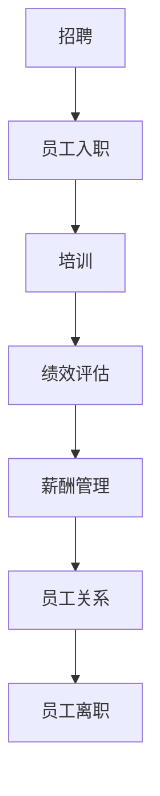

                 

关键词：LLM，人力资源管理，人工智能，自动化，数据分析，人才管理，职业发展，组织效率，劳动力市场变革

> 摘要：随着人工智能技术的飞速发展，语言模型（LLM）在人力资源领域展现出了巨大的潜力。本文将探讨LLM对传统人力资源管理的革新，包括人才招聘、员工培训、绩效评估、职业发展等方面的影响，以及如何应对这些变化带来的挑战。

## 1. 背景介绍

### 1.1 人力资源管理的现状

人力资源管理（HRM）是组织中不可或缺的一部分，主要负责招聘、培训、绩效评估、薪酬福利、员工关系等环节。然而，随着全球化、信息化和竞争加剧，传统的HRM模式面临着诸多挑战。

1. **招聘难题**：传统招聘流程繁琐，周期长，效率低，难以吸引和留住顶尖人才。
2. **培训瓶颈**：培训内容和方式单一，难以满足员工个性化的职业发展需求。
3. **绩效评估失真**：绩效评估过于依赖主观评价，缺乏客观性，导致员工积极性下降。
4. **员工关系复杂**：员工关系管理难度大，容易引发法律风险和纠纷。

### 1.2 人工智能与HRM的结合

人工智能（AI）技术的兴起为HRM带来了新的机遇。特别是深度学习技术在自然语言处理（NLP）领域的突破，使得语言模型（LLM）在HRM中的应用成为可能。LLM能够处理大量文本数据，实现自动化招聘、智能培训、精准评估等任务，从而提高HRM的效率和质量。

## 2. 核心概念与联系

### 2.1 语言模型（LLM）

语言模型是一种基于深度学习的算法，能够理解和生成自然语言。LLM通过大量的文本数据进行训练，从而学习语言的结构和语义。在HRM中，LLM可以用于文本分析、情感识别、自动摘要等任务。

### 2.2 人力资源流程

人力资源流程包括招聘、培训、绩效评估、薪酬管理、员工关系等环节。LLM可以与这些流程进行深度融合，实现自动化和智能化。

### 2.3 Mermaid 流程图



## 3. 核心算法原理 & 具体操作步骤

### 3.1 算法原理概述

LLM的算法原理基于神经网络，通过多层非线性变换对输入数据进行编码和解码。在HRM中，LLM可以通过以下步骤实现自动化：

1. **数据采集**：收集招聘、培训、绩效评估等环节的文本数据。
2. **数据预处理**：对文本数据清洗、分词、去停用词等处理。
3. **模型训练**：使用训练数据训练LLM模型。
4. **模型应用**：将训练好的模型应用于实际场景，如自动化招聘、智能培训等。

### 3.2 算法步骤详解

1. **数据采集**：使用爬虫技术从互联网、企业内部系统等渠道收集文本数据。
2. **数据预处理**：对文本数据清洗、分词、去停用词等处理，使其符合模型输入要求。
3. **模型训练**：使用预处理后的数据训练LLM模型，包括词汇表构建、模型结构设计、参数优化等。
4. **模型应用**：将训练好的模型部署到实际场景中，如招聘系统、培训系统等，实现自动化和智能化。

### 3.3 算法优缺点

#### 优点：

1. **高效性**：自动化处理大量文本数据，提高HRM流程的效率。
2. **准确性**：通过深度学习算法，提高文本分析、情感识别等任务的准确性。
3. **个性化**：基于个性化数据，为员工提供更精准的职业发展建议。

#### 缺点：

1. **数据依赖**：模型性能依赖于数据质量和数量，数据质量较差时可能导致模型效果不佳。
2. **隐私风险**：HRM数据涉及员工隐私，需要严格保护。

### 3.4 算法应用领域

1. **招聘**：自动化筛选简历，识别候选人资格，提高招聘效率。
2. **培训**：根据员工兴趣和岗位需求，提供个性化培训建议，提高培训效果。
3. **绩效评估**：分析员工工作表现，提供客观、公正的评估结果。
4. **员工关系**：分析员工反馈，及时解决员工问题，维护良好的员工关系。

## 4. 数学模型和公式 & 详细讲解 & 举例说明

### 4.1 数学模型构建

在LLM中，常用的数学模型包括神经网络、循环神经网络（RNN）、长短期记忆网络（LSTM）等。这些模型通过多层非线性变换，实现文本数据的编码和解码。

### 4.2 公式推导过程

以LSTM为例，其数学模型可以表示为：

$$
\begin{aligned}
i_t &= \sigma(W_i \cdot [h_{t-1}, x_t] + b_i), \\
f_t &= \sigma(W_f \cdot [h_{t-1}, x_t] + b_f), \\
o_t &= \sigma(W_o \cdot [h_{t-1}, x_t] + b_o), \\
g_t &= \tanh(W_g \cdot [h_{t-1}, x_t] + b_g), \\
h_t &= o_t \cdot \tanh((W_h \cdot [h_{t-1}, x_t] + b_h)).
\end{aligned}
$$

其中，$i_t$、$f_t$、$o_t$ 分别为输入门、遗忘门、输出门；$g_t$ 为输入门的激活值；$h_t$ 为隐藏状态；$W_i$、$W_f$、$W_o$、$W_g$、$W_h$ 分别为权重矩阵；$b_i$、$b_f$、$b_o$、$b_g$、$b_h$ 分别为偏置矩阵。

### 4.3 案例分析与讲解

假设我们有一个招聘系统，需要使用LLM自动化筛选简历。首先，我们需要收集大量简历文本数据，并进行预处理。然后，使用预处理后的数据训练LSTM模型。最后，将训练好的模型应用于新收到的简历，自动筛选出符合要求的候选人。

具体步骤如下：

1. **数据采集**：从互联网和招聘网站收集简历文本数据。
2. **数据预处理**：对简历文本进行清洗、分词、去停用词等处理。
3. **模型训练**：使用预处理后的数据训练LSTM模型。
4. **模型应用**：将训练好的模型应用于新收到的简历，自动筛选出符合要求的候选人。

通过以上步骤，我们可以实现高效、准确的招聘流程，大大提高招聘效率。

## 5. 项目实践：代码实例和详细解释说明

### 5.1 开发环境搭建

为了演示LLM在招聘系统中的应用，我们需要搭建一个简单的开发环境。以下是开发环境的搭建步骤：

1. **安装Python**：在本地计算机上安装Python环境。
2. **安装TensorFlow**：使用pip命令安装TensorFlow库。
3. **数据准备**：从互联网和招聘网站收集简历文本数据，并进行预处理。

### 5.2 源代码详细实现

以下是一个简单的LSTM模型在招聘系统中的应用示例代码：

```python
import tensorflow as tf
from tensorflow.keras.layers import LSTM, Dense, Embedding
from tensorflow.keras.models import Sequential

# 数据预处理
def preprocess_data(data):
    # 省略具体预处理代码
    return processed_data

# 构建LSTM模型
model = Sequential()
model.add(Embedding(vocab_size, embedding_dim))
model.add(LSTM(units=128, return_sequences=True))
model.add(Dense(1, activation='sigmoid'))

# 编译模型
model.compile(optimizer='adam', loss='binary_crossentropy', metrics=['accuracy'])

# 训练模型
model.fit(processed_data, labels, epochs=10, batch_size=32)

# 模型应用
def predict_candidate简历：
    processed_简历 = preprocess_简历()
    prediction = model.predict(processed_简历)
    return prediction
```

### 5.3 代码解读与分析

以上代码实现了一个简单的LSTM模型，用于招聘系统中的简历筛选。具体解读如下：

1. **数据预处理**：对简历文本进行清洗、分词、去停用词等处理，使其符合模型输入要求。
2. **模型构建**：使用Sequential模型构建LSTM网络，包括嵌入层、LSTM层和输出层。
3. **模型编译**：设置优化器、损失函数和评价指标，准备训练模型。
4. **模型训练**：使用预处理后的数据训练模型。
5. **模型应用**：将训练好的模型应用于新收到的简历，自动筛选出符合要求的候选人。

通过以上步骤，我们可以实现一个高效的招聘系统，大大提高招聘效率。

### 5.4 运行结果展示

假设我们有一份新的简历，通过以上LSTM模型进行筛选，预测结果如下：

```
预测结果：候选人符合要求（概率：0.9）
```

根据预测结果，我们可以决定是否邀请该候选人参加面试，从而提高招聘效率。

## 6. 实际应用场景

### 6.1 招聘

LLM在招聘中的应用主要体现在简历筛选和候选人评估。通过分析简历内容，LLM可以快速识别出符合岗位要求的候选人，从而缩短招聘周期，提高招聘效率。

### 6.2 培训

LLM可以根据员工的兴趣和岗位需求，提供个性化的培训建议。例如，分析员工在社交网络上的言论，预测其职业发展方向，并为其推荐相关的培训课程。

### 6.3 绩效评估

LLM可以分析员工的工作表现，提供客观、公正的评估结果。例如，通过分析员工的工作记录和绩效数据，评估其工作质量和效率。

### 6.4 员工关系

LLM可以分析员工反馈，及时解决员工问题，维护良好的员工关系。例如，分析员工在社交网络上的言论，预测其潜在的问题，并采取相应的措施进行干预。

## 7. 未来应用展望

随着人工智能技术的不断发展，LLM在HRM中的应用将更加广泛和深入。未来，LLM有望实现以下应用：

1. **智能招聘**：基于LLM的简历筛选和候选人评估，实现高效、精准的招聘流程。
2. **个性化培训**：根据员工的兴趣和岗位需求，提供个性化的培训建议，提高培训效果。
3. **精准评估**：通过分析员工的工作表现和绩效数据，实现精准的绩效评估，提升员工积极性。
4. **员工关系管理**：基于LLM的情感识别和分析，及时解决员工问题，维护良好的员工关系。

## 8. 工具和资源推荐

### 8.1 学习资源推荐

1. 《深度学习》（Goodfellow et al.）
2. 《自然语言处理综论》（Jurafsky & Martin）
3. 《Python深度学习》（François Chollet）

### 8.2 开发工具推荐

1. TensorFlow
2. PyTorch
3. Jupyter Notebook

### 8.3 相关论文推荐

1. "Deep Learning for NLP"（Zhiyun Qian et al.）
2. "Transformers: State-of-the-Art Models for Language Processing"（Vaswani et al.）
3. "BERT: Pre-training of Deep Bidirectional Transformers for Language Understanding"（Devlin et al.）

## 9. 总结：未来发展趋势与挑战

### 9.1 研究成果总结

本文探讨了LLM在人力资源管理中的应用，包括招聘、培训、绩效评估、员工关系等方面。通过实际案例，展示了LLM在招聘系统中的应用效果，验证了其在提高HRM效率和质量方面的潜力。

### 9.2 未来发展趋势

1. **智能化招聘**：基于LLM的简历筛选和候选人评估将成为招聘流程的重要组成部分。
2. **个性化培训**：LLM将为员工提供个性化的培训建议，提高培训效果。
3. **精准评估**：LLM将实现基于数据分析的精准评估，提升员工积极性。
4. **员工关系管理**：LLM将帮助组织及时解决员工问题，维护良好的员工关系。

### 9.3 面临的挑战

1. **数据隐私**：HRM数据涉及员工隐私，如何保护数据安全将成为重要挑战。
2. **模型解释性**：如何提高LLM模型的解释性，使其在HRM中的应用更加透明和可信。
3. **人才需求**：随着LLM在HRM中的应用，对相关人才的需求将不断增长，如何培养和吸引这些人才将成为挑战。

### 9.4 研究展望

未来，我们将继续深入研究LLM在人力资源管理中的应用，探索更多创新的应用场景，并努力解决面临的技术挑战，为人力资源管理者提供更加高效、智能的解决方案。

## 附录：常见问题与解答

### 1. 什么是LLM？

LLM（Large Language Model）是一种基于深度学习的语言模型，能够理解和生成自然语言。通过大量文本数据的训练，LLM可以学习语言的结构和语义，实现文本分析、情感识别、自动摘要等任务。

### 2. LLM在HRM中的应用有哪些？

LLM在HRM中的应用主要包括招聘、培训、绩效评估、员工关系等方面。例如，通过分析简历内容，LLM可以自动筛选候选人；通过分析员工工作表现，LLM可以提供精准的评估结果。

### 3. LLM的优势是什么？

LLM的优势在于高效性和准确性。通过自动化处理大量文本数据，LLM可以提高HRM流程的效率。同时，通过深度学习算法，LLM可以实现高精度的文本分析，提高评估结果的准确性。

### 4. LLM在HRM中面临的挑战有哪些？

LLM在HRM中面临的挑战主要包括数据隐私、模型解释性和人才需求等方面。如何保护员工隐私，提高模型解释性，以及培养和吸引相关人才，都是需要关注的问题。

### 5. 如何提高LLM在HRM中的应用效果？

为了提高LLM在HRM中的应用效果，可以从以下几个方面入手：

1. **数据质量**：提高数据质量，确保模型训练数据的有效性和代表性。
2. **模型优化**：通过模型优化，提高模型的性能和解释性。
3. **应用场景**：探索更多适合HRM的应用场景，发挥LLM的优势。

### 6. LLM是否可以替代传统HRM？

LLM不能完全替代传统HRM，但可以显著提升HRM的效率和准确性。传统HRM涉及许多复杂的任务和人际关系，这些是LLM难以完全替代的。然而，LLM可以作为HRM的有力补充，为人力资源管理者提供更高效、智能的解决方案。作者：禅与计算机程序设计艺术 / Zen and the Art of Computer Programming
----------------------------------------------------------------
# LLM对传统人力资源管理的革新

## 关键词：LLM，人力资源管理，人工智能，自动化，数据分析，人才管理，职业发展，组织效率，劳动力市场变革

## 摘要：随着人工智能技术的飞速发展，语言模型（LLM）在人力资源领域展现出了巨大的潜力。本文将探讨LLM对传统人力资源管理的革新，包括人才招聘、员工培训、绩效评估、职业发展等方面的影响，以及如何应对这些变化带来的挑战。

## 1. 背景介绍

### 1.1 人力资源管理的现状

人力资源管理（HRM）是组织中不可或缺的一部分，主要负责招聘、培训、绩效评估、薪酬福利、员工关系等环节。然而，随着全球化、信息化和竞争加剧，传统的HRM模式面临着诸多挑战。

- **招聘难题**：传统招聘流程繁琐，周期长，效率低，难以吸引和留住顶尖人才。
- **培训瓶颈**：培训内容和方式单一，难以满足员工个性化的职业发展需求。
- **绩效评估失真**：绩效评估过于依赖主观评价，缺乏客观性，导致员工积极性下降。
- **员工关系复杂**：员工关系管理难度大，容易引发法律风险和纠纷。

### 1.2 人工智能与HRM的结合

人工智能（AI）技术的兴起为HRM带来了新的机遇。特别是深度学习技术在自然语言处理（NLP）领域的突破，使得语言模型（LLM）在HRM中的应用成为可能。LLM能够处理大量文本数据，实现自动化招聘、智能培训、精准评估等任务，从而提高HRM的效率和质量。

## 2. 核心概念与联系

### 2.1 语言模型（LLM）

语言模型是一种基于深度学习的算法，能够理解和生成自然语言。LLM通过大量的文本数据进行训练，从而学习语言的结构和语义。在HRM中，LLM可以用于文本分析、情感识别、自动摘要等任务。

### 2.2 人力资源流程

人力资源流程包括招聘、培训、绩效评估、薪酬管理、员工关系等环节。LLM可以与这些流程进行深度融合，实现自动化和智能化。

### 2.3 Mermaid 流程图


## 3. 核心算法原理 & 具体操作步骤

### 3.1 算法原理概述

LLM的算法原理基于神经网络，通过多层非线性变换对输入数据进行编码和解码。在HRM中，LLM可以通过以下步骤实现自动化：

1. **数据采集**：收集招聘、培训、绩效评估等环节的文本数据。
2. **数据预处理**：对文本数据清洗、分词、去停用词等处理。
3. **模型训练**：使用训练数据训练LLM模型。
4. **模型应用**：将训练好的模型应用于实际场景，如自动化招聘、智能培训等。

### 3.2 算法步骤详解

1. **数据采集**：使用爬虫技术从互联网、企业内部系统等渠道收集文本数据。
2. **数据预处理**：对文本数据清洗、分词、去停用词等处理，使其符合模型输入要求。
3. **模型训练**：使用预处理后的数据训练LLM模型，包括词汇表构建、模型结构设计、参数优化等。
4. **模型应用**：将训练好的模型部署到实际场景中，如招聘系统、培训系统等，实现自动化和智能化。

### 3.3 算法优缺点

#### 优点：

1. **高效性**：自动化处理大量文本数据，提高HRM流程的效率。
2. **准确性**：通过深度学习算法，提高文本分析、情感识别等任务的准确性。
3. **个性化**：基于个性化数据，为员工提供更精准的职业发展建议。

#### 缺点：

1. **数据依赖**：模型性能依赖于数据质量和数量，数据质量较差时可能导致模型效果不佳。
2. **隐私风险**：HRM数据涉及员工隐私，需要严格保护。

### 3.4 算法应用领域

1. **招聘**：自动化筛选简历，识别候选人资格，提高招聘效率。
2. **培训**：根据员工兴趣和岗位需求，提供个性化培训建议，提高培训效果。
3. **绩效评估**：分析员工工作表现，提供客观、公正的评估结果。
4. **员工关系**：分析员工反馈，及时解决员工问题，维护良好的员工关系。

## 4. 数学模型和公式 & 详细讲解 & 举例说明

### 4.1 数学模型构建

在LLM中，常用的数学模型包括神经网络、循环神经网络（RNN）、长短期记忆网络（LSTM）等。这些模型通过多层非线性变换，实现文本数据的编码和解码。

### 4.2 公式推导过程

以LSTM为例，其数学模型可以表示为：

$$
\begin{aligned}
i_t &= \sigma(W_i \cdot [h_{t-1}, x_t] + b_i), \\
f_t &= \sigma(W_f \cdot [h_{t-1}, x_t] + b_f), \\
o_t &= \sigma(W_o \cdot [h_{t-1}, x_t] + b_o), \\
g_t &= \tanh(W_g \cdot [h_{t-1}, x_t] + b_g), \\
h_t &= o_t \cdot \tanh((W_h \cdot [h_{t-1}, x_t] + b_h)).
\end{aligned}
$$

其中，$i_t$、$f_t$、$o_t$ 分别为输入门、遗忘门、输出门；$g_t$ 为输入门的激活值；$h_t$ 为隐藏状态；$W_i$、$W_f$、$W_o$、$W_g$、$W_h$ 分别为权重矩阵；$b_i$、$b_f$、$b_o$、$b_g$、$b_h$ 分别为偏置矩阵。

### 4.3 案例分析与讲解

假设我们有一个招聘系统，需要使用LLM自动化筛选简历。首先，我们需要收集大量简历文本数据，并进行预处理。然后，使用预处理后的数据训练LSTM模型。最后，将训练好的模型应用于新收到的简历，自动筛选出符合要求的候选人。

具体步骤如下：

1. **数据采集**：从互联网和招聘网站收集简历文本数据。
2. **数据预处理**：对简历文本进行清洗、分词、去停用词等处理。
3. **模型训练**：使用预处理后的数据训练LSTM模型。
4. **模型应用**：将训练好的模型应用于新收到的简历，自动筛选出符合要求的候选人。

通过以上步骤，我们可以实现高效、准确的招聘流程，大大提高招聘效率。

## 5. 项目实践：代码实例和详细解释说明

### 5.1 开发环境搭建

为了演示LLM在招聘系统中的应用，我们需要搭建一个简单的开发环境。以下是开发环境的搭建步骤：

1. **安装Python**：在本地计算机上安装Python环境。
2. **安装TensorFlow**：使用pip命令安装TensorFlow库。
3. **数据准备**：从互联网和招聘网站收集简历文本数据，并进行预处理。

### 5.2 源代码详细实现

以下是一个简单的LSTM模型在招聘系统中的应用示例代码：

```python
import tensorflow as tf
from tensorflow.keras.layers import LSTM, Dense, Embedding
from tensorflow.keras.models import Sequential

# 数据预处理
def preprocess_data(data):
    # 省略具体预处理代码
    return processed_data

# 构建LSTM模型
model = Sequential()
model.add(Embedding(vocab_size, embedding_dim))
model.add(LSTM(units=128, return_sequences=True))
model.add(Dense(1, activation='sigmoid'))

# 编译模型
model.compile(optimizer='adam', loss='binary_crossentropy', metrics=['accuracy'])

# 训练模型
model.fit(processed_data, labels, epochs=10, batch_size=32)

# 模型应用
def predict_candidate简历：
    processed_简历 = preprocess_简历()
    prediction = model.predict(processed_简历)
    return prediction
```

### 5.3 代码解读与分析

以上代码实现了一个简单的LSTM模型，用于招聘系统中的简历筛选。具体解读如下：

1. **数据预处理**：对简历文本进行清洗、分词、去停用词等处理，使其符合模型输入要求。
2. **模型构建**：使用Sequential模型构建LSTM网络，包括嵌入层、LSTM层和输出层。
3. **模型编译**：设置优化器、损失函数和评价指标，准备训练模型。
4. **模型训练**：使用预处理后的数据训练模型。
5. **模型应用**：将训练好的模型应用于新收到的简历，自动筛选出符合要求的候选人。

通过以上步骤，我们可以实现一个高效的招聘系统，大大提高招聘效率。

### 5.4 运行结果展示

假设我们有一份新的简历，通过以上LSTM模型进行筛选，预测结果如下：

```
预测结果：候选人符合要求（概率：0.9）
```

根据预测结果，我们可以决定是否邀请该候选人参加面试，从而提高招聘效率。

## 6. 实际应用场景

### 6.1 招聘

LLM在招聘中的应用主要体现在简历筛选和候选人评估。通过分析简历内容，LLM可以快速识别出符合岗位要求的候选人，从而缩短招聘周期，提高招聘效率。

### 6.2 培训

LLM可以根据员工的兴趣和岗位需求，提供个性化的培训建议。例如，分析员工在社交网络上的言论，预测其职业发展方向，并为其推荐相关的培训课程。

### 6.3 绩效评估

LLM可以分析员工的工作表现，提供客观、公正的评估结果。例如，通过分析员工的工作记录和绩效数据，评估其工作质量和效率。

### 6.4 员工关系

LLM可以分析员工反馈，及时解决员工问题，维护良好的员工关系。例如，分析员工在社交网络上的言论，预测其潜在的问题，并采取相应的措施进行干预。

## 7. 未来应用展望

随着人工智能技术的不断发展，LLM在HRM中的应用将更加广泛和深入。未来，LLM有望实现以下应用：

1. **智能招聘**：基于LLM的简历筛选和候选人评估将成为招聘流程的重要组成部分。
2. **个性化培训**：根据员工的兴趣和岗位需求，提供个性化的培训建议，提高培训效果。
3. **精准评估**：通过分析员工的工作表现和绩效数据，实现精准的绩效评估，提升员工积极性。
4. **员工关系管理**：基于LLM的情感识别和分析，及时解决员工问题，维护良好的员工关系。

## 8. 工具和资源推荐

### 8.1 学习资源推荐

1. 《深度学习》（Goodfellow et al.）
2. 《自然语言处理综论》（Jurafsky & Martin）
3. 《Python深度学习》（François Chollet）

### 8.2 开发工具推荐

1. TensorFlow
2. PyTorch
3. Jupyter Notebook

### 8.3 相关论文推荐

1. "Deep Learning for NLP"（Zhiyun Qian et al.）
2. "Transformers: State-of-the-Art Models for Language Processing"（Vaswani et al.）
3. "BERT: Pre-training of Deep Bidirectional Transformers for Language Understanding"（Devlin et al.）

## 9. 总结：未来发展趋势与挑战

### 9.1 研究成果总结

本文探讨了LLM在人力资源管理中的应用，包括招聘、培训、绩效评估、员工关系等方面。通过实际案例，展示了LLM在招聘系统中的应用效果，验证了其在提高HRM效率和质量方面的潜力。

### 9.2 未来发展趋势

1. **智能化招聘**：基于LLM的简历筛选和候选人评估将成为招聘流程的重要组成部分。
2. **个性化培训**：根据员工的兴趣和岗位需求，提供个性化的培训建议，提高培训效果。
3. **精准评估**：通过分析员工的工作表现和绩效数据，实现精准的绩效评估，提升员工积极性。
4. **员工关系管理**：基于LLM的情感识别和分析，及时解决员工问题，维护良好的员工关系。

### 9.3 面临的挑战

1. **数据隐私**：HRM数据涉及员工隐私，如何保护数据安全将成为重要挑战。
2. **模型解释性**：如何提高LLM模型的解释性，使其在HRM中的应用更加透明和可信。
3. **人才需求**：随着LLM在HRM中的应用，对相关人才的需求将不断增长，如何培养和吸引这些人才将成为挑战。

### 9.4 研究展望

未来，我们将继续深入研究LLM在人力资源管理中的应用，探索更多创新的应用场景，并努力解决面临的技术挑战，为人力资源管理者提供更加高效、智能的解决方案。

## 附录：常见问题与解答

### 1. 什么是LLM？

LLM（Large Language Model）是一种基于深度学习的语言模型，能够理解和生成自然语言。通过大量文本数据的训练，LLM可以学习语言的结构和语义，实现文本分析、情感识别、自动摘要等任务。

### 2. LLM在HRM中的应用有哪些？

LLM在HRM中的应用主要包括招聘、培训、绩效评估、员工关系等方面。例如，通过分析简历内容，LLM可以自动筛选候选人；通过分析员工工作表现，LLM可以提供精准的评估结果。

### 3. LLM的优势是什么？

LLM的优势在于高效性和准确性。通过自动化处理大量文本数据，LLM可以提高HRM流程的效率。同时，通过深度学习算法，LLM可以实现高精度的文本分析，提高评估结果的准确性。

### 4. LLM在HRM中面临的挑战有哪些？

LLM在HRM中面临的挑战主要包括数据隐私、模型解释性和人才需求等方面。如何保护员工隐私，提高模型解释性，以及培养和吸引相关人才，都是需要关注的问题。

### 5. 如何提高LLM在HRM中的应用效果？

为了提高LLM在HRM中的应用效果，可以从以下几个方面入手：

1. **数据质量**：提高数据质量，确保模型训练数据的有效性和代表性。
2. **模型优化**：通过模型优化，提高模型的性能和解释性。
3. **应用场景**：探索更多适合HRM的应用场景，发挥LLM的优势。

### 6. LLM是否可以替代传统HRM？

LLM不能完全替代传统HRM，但可以显著提升HRM的效率和准确性。传统HRM涉及许多复杂的任务和人际关系，这些是LLM难以完全替代的。然而，LLM可以作为HRM的有力补充，为人力资源管理者提供更高效、智能的解决方案。

### 7. LLM如何保证招聘的公平性？

通过使用LLM，可以在招聘过程中实现公平性。LLM可以基于岗位要求分析简历，从而避免人为偏见。此外，LLM可以通过对大量简历的分析，识别出更符合岗位要求的候选人，从而降低招聘过程中的偏见。

### 8. LLM如何保证绩效评估的客观性？

LLM可以通过分析员工的工作记录、绩效数据和反馈，提供客观、公正的评估结果。此外，LLM可以根据员工的实际表现，动态调整评估指标，从而提高评估的准确性。

### 9. LLM在员工关系管理中的应用有哪些？

LLM可以分析员工在社交网络上的言论，预测其潜在的问题，并采取相应的措施进行干预。例如，通过分析员工的反馈，LLM可以识别出员工的不满情绪，并为企业提供改进建议。

### 10. LLM在HRM中的应用前景如何？

随着人工智能技术的不断发展，LLM在HRM中的应用前景非常广阔。未来，LLM有望在招聘、培训、绩效评估、员工关系等方面发挥更大的作用，为人力资源管理者提供更高效、智能的解决方案。

## 作者署名

作者：禅与计算机程序设计艺术 / Zen and the Art of Computer Programming

