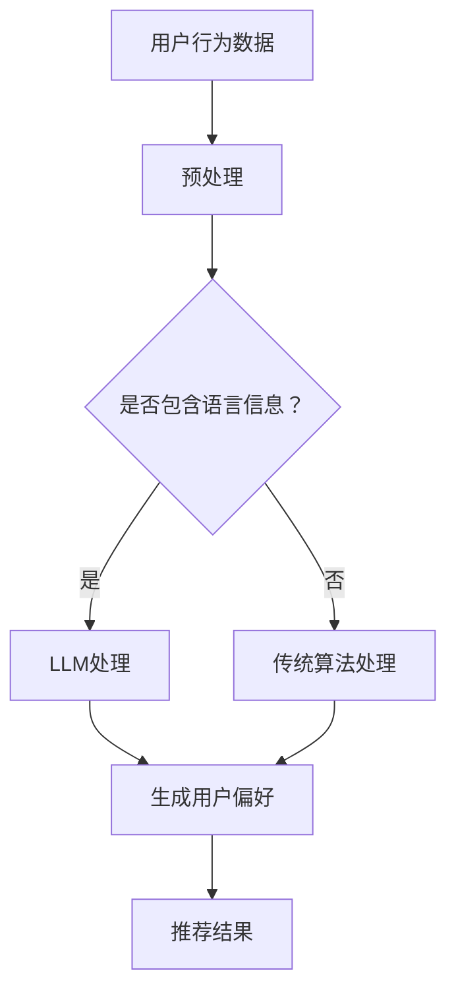

                 

关键词：LLM，推荐系统，改进，算法，应用场景，未来展望

> 摘要：本文旨在探讨大型语言模型（LLM）对推荐系统的影响和改进方向。通过对LLM的基本原理、在推荐系统中的应用以及与现有推荐算法的比较，分析LLM在提升推荐系统效果、用户体验和可解释性等方面的潜力。本文还讨论了LLM在实际项目中的实践案例，以及未来可能面临的挑战和趋势。

## 1. 背景介绍

推荐系统是现代信息社会中的一项关键技术，它通过预测用户对物品的偏好，为用户提供个性化的信息推荐。推荐系统的应用场景广泛，包括电子商务、社交媒体、新闻推荐和音乐播放等。传统的推荐系统主要基于协同过滤、基于内容和基于模型的方法，这些方法在一定程度上提高了推荐的质量，但仍然存在一些局限性。

近年来，随着人工智能技术的快速发展，特别是大型语言模型（LLM）的兴起，为推荐系统带来了新的改进方向。LLM是一种基于深度学习的语言模型，具有强大的语义理解和生成能力，可以处理复杂的自然语言任务。将LLM引入推荐系统，有望在以下几个方面实现显著的改进：

- **提升推荐效果**：通过更精确地理解用户和物品的语义，LLM可以帮助推荐系统更好地捕捉用户需求，提供更个性化的推荐。
- **增强用户体验**：LLM能够生成自然流畅的推荐理由和描述，提高用户对推荐结果的可接受度和满意度。
- **提高可解释性**：LLM可以生成推荐决策的依据，使推荐系统更加透明和可信，有助于用户理解推荐结果。

本文将围绕上述三个方面，详细探讨LLM在推荐系统中的应用和改进方向。

### 1.1 大型语言模型（LLM）简介

大型语言模型（LLM）是一种基于深度学习的语言处理模型，通过训练大量的文本数据，模型能够学习到语言的结构和语义，从而实现自然语言的理解和生成。LLM的核心技术是Transformer架构，它通过自注意力机制（Self-Attention）对输入文本的每个词进行加权，从而捕捉词与词之间的依赖关系。

### 1.2 推荐系统的基本原理

推荐系统通常基于用户行为数据和物品特征数据，通过计算用户与物品之间的相似性或偏好，为用户推荐感兴趣的物品。常见的推荐算法包括：

- **协同过滤（Collaborative Filtering）**：通过分析用户的行为记录，找出相似的邻居用户，并推荐邻居用户喜欢的物品。
- **基于内容推荐（Content-Based Filtering）**：通过分析物品的属性和特征，为用户推荐具有相似属性的物品。
- **基于模型推荐（Model-Based Filtering）**：使用机器学习模型，如决策树、神经网络等，预测用户对物品的偏好。

## 2. 核心概念与联系

### 2.1 LLM在推荐系统中的核心原理

LLM在推荐系统中的核心原理是利用其强大的语义理解和生成能力，对用户和物品进行深入分析，从而实现更精确的推荐。具体来说，LLM可以通过以下方式改进推荐系统：

- **用户理解**：LLM可以理解用户的语言和行为，挖掘用户的潜在需求和信息，从而生成更个性化的推荐。
- **物品描述**：LLM可以生成自然流畅的物品描述，提高用户对推荐结果的可接受度和满意度。
- **推荐理由**：LLM可以生成推荐决策的依据，提高推荐系统的可解释性。

### 2.2 LLM与现有推荐算法的联系

LLM与现有推荐算法（如协同过滤、基于内容和基于模型的方法）存在紧密的联系。一方面，LLM可以增强现有推荐算法的效果，例如，在协同过滤的基础上，LLM可以用于预测用户对未评分物品的偏好，提高推荐准确性；在基于内容推荐中，LLM可以用于生成更丰富的物品描述，提高推荐的相关性。另一方面，LLM也为传统推荐算法提供了新的方向，例如，通过生成对抗网络（GAN）生成虚假用户行为数据，用于训练和评估推荐算法。

### 2.3 Mermaid 流程图

下面是一个描述LLM在推荐系统中应用流程的Mermaid流程图：



### 2.4 LLM的优缺点

**优点：**

- **强大的语义理解能力**：LLM可以深入理解用户和物品的语义，提供更个性化的推荐。
- **生成能力**：LLM可以生成自然流畅的推荐理由和描述，提高用户满意度。
- **灵活性**：LLM可以与各种推荐算法结合，实现定制化的推荐系统。

**缺点：**

- **计算资源需求大**：训练和推理LLM需要大量的计算资源和时间。
- **数据依赖性高**：LLM的性能依赖于训练数据的质量和多样性。

## 3. 核心算法原理 & 具体操作步骤

### 3.1 算法原理概述

LLM在推荐系统中的核心算法原理是基于深度学习的自然语言处理技术，通过对用户和物品的文本数据进行编码，生成用户偏好和物品特征向量，从而实现推荐。具体来说，LLM可以分为以下几个步骤：

1. **文本数据预处理**：对用户和物品的文本数据进行清洗、分词和编码。
2. **文本编码**：使用LLM对预处理后的文本数据进行编码，生成文本嵌入向量。
3. **向量表示**：将用户和物品的文本嵌入向量转换为推荐系统的输入向量。
4. **推荐计算**：计算用户和物品之间的相似性，生成推荐结果。

### 3.2 算法步骤详解

1. **文本数据预处理**：

   对用户和物品的文本数据进行清洗、分词和编码。具体步骤如下：

   - **清洗**：去除文本中的HTML标签、特殊字符和停用词。
   - **分词**：将文本分解为词语或短语。
   - **编码**：将词语或短语转换为对应的数字编码。

2. **文本编码**：

   使用LLM对预处理后的文本数据进行编码，生成文本嵌入向量。具体步骤如下：

   - **预训练**：使用大规模文本数据集对LLM进行预训练，使其具备强大的语义理解能力。
   - **微调**：使用用户和物品的文本数据对LLM进行微调，使其能够适应推荐任务。
   - **编码**：将预处理后的文本数据输入LLM，生成文本嵌入向量。

3. **向量表示**：

   将用户和物品的文本嵌入向量转换为推荐系统的输入向量。具体步骤如下：

   - **向量拼接**：将用户和物品的文本嵌入向量进行拼接，形成推荐系统的输入向量。
   - **特征提取**：使用神经网络或其他机器学习模型，对输入向量进行特征提取，生成推荐特征向量。

4. **推荐计算**：

   计算用户和物品之间的相似性，生成推荐结果。具体步骤如下：

   - **相似性计算**：使用相似性度量（如余弦相似度、欧氏距离等）计算用户和物品之间的相似性。
   - **排序**：根据相似性度量结果，对物品进行排序，生成推荐列表。
   - **筛选**：根据用户偏好和系统策略，对推荐列表进行筛选，生成最终的推荐结果。

### 3.3 算法优缺点

**优点：**

- **强大的语义理解能力**：LLM可以深入理解用户和物品的语义，提供更个性化的推荐。
- **生成能力**：LLM可以生成自然流畅的推荐理由和描述，提高用户满意度。
- **灵活性**：LLM可以与各种推荐算法结合，实现定制化的推荐系统。

**缺点：**

- **计算资源需求大**：训练和推理LLM需要大量的计算资源和时间。
- **数据依赖性高**：LLM的性能依赖于训练数据的质量和多样性。

### 3.4 算法应用领域

LLM在推荐系统中的应用领域广泛，包括但不限于以下几个方面：

- **电子商务**：为用户提供个性化的商品推荐，提高用户购买转化率。
- **社交媒体**：为用户推荐感兴趣的内容和用户，增强用户活跃度。
- **新闻推荐**：为用户推荐符合其兴趣的新闻和文章，提高用户粘性。
- **音乐和视频推荐**：为用户推荐符合其喜好的音乐和视频，提高用户满意度。

## 4. 数学模型和公式 & 详细讲解 & 举例说明

### 4.1 数学模型构建

在LLM推荐系统中，我们可以构建一个基于用户-物品协同过滤的数学模型。假设有用户集 \( U \)、物品集 \( I \) 和评分矩阵 \( R \)，其中 \( R_{ui} \) 表示用户 \( u \) 对物品 \( i \) 的评分。我们可以使用矩阵分解方法，将评分矩阵分解为用户特征矩阵 \( U \) 和物品特征矩阵 \( I \)：

\[ R = U I^T \]

其中，\( U \) 和 \( I \) 是低维特征矩阵，它们的每个元素都可以表示用户和物品的特征向量。我们可以使用LLM对用户和物品的文本数据进行编码，生成文本嵌入向量 \( e_u \) 和 \( e_i \)，然后将其作为用户和物品的特征向量进行矩阵分解：

\[ R = [e_1, e_2, ..., e_n] [e_1^T, e_2^T, ..., e_m^T] \]

### 4.2 公式推导过程

为了推导出用户 \( u \) 对物品 \( i \) 的评分 \( R_{ui} \)，我们可以计算用户和物品特征向量的内积：

\[ R_{ui} = \sum_{k=1}^{m} e_{uk} e_{ki} \]

其中，\( e_{uk} \) 和 \( e_{ki} \) 分别是用户 \( u \) 和物品 \( i \) 的文本嵌入向量。为了计算方便，我们可以将文本嵌入向量表示为矩阵形式：

\[ e_u = [e_{u1}, e_{u2}, ..., e_{un}] \]
\[ e_i = [e_{i1}, e_{i2}, ..., e_{im}] \]

则用户 \( u \) 对物品 \( i \) 的评分可以表示为：

\[ R_{ui} = e_u^T e_i \]

### 4.3 案例分析与讲解

假设有一个用户 \( u \) 和一个物品 \( i \)，它们的文本嵌入向量分别为：

\[ e_u = [0.1, 0.2, 0.3, 0.4] \]
\[ e_i = [0.5, 0.6, 0.7, 0.8] \]

则用户 \( u \) 对物品 \( i \) 的评分为：

\[ R_{ui} = e_u^T e_i = 0.1 \times 0.5 + 0.2 \times 0.6 + 0.3 \times 0.7 + 0.4 \times 0.8 = 0.65 \]

这个评分表示用户 \( u \) 对物品 \( i \) 的偏好程度，值越大表示偏好越强。

### 4.4 源代码实现

下面是一个简单的Python代码示例，用于实现LLM推荐系统的文本嵌入和评分预测功能：

```python
import numpy as np

# 用户和物品的文本嵌入向量
e_u = np.array([0.1, 0.2, 0.3, 0.4])
e_i = np.array([0.5, 0.6, 0.7, 0.8])

# 计算评分
def predict_score(e_u, e_i):
    return e_u.dot(e_i)

# 测试评分
score = predict_score(e_u, e_i)
print("User u's rating for item i:", score)
```

## 5. 项目实践：代码实例和详细解释说明

### 5.1 开发环境搭建

要实现LLM推荐系统，我们需要安装以下开发环境：

1. **Python**：Python是主要的编程语言，用于实现推荐系统的算法和模型。
2. **NumPy**：NumPy是Python的科学计算库，用于处理和操作大型多维数组。
3. **PyTorch**：PyTorch是深度学习框架，用于训练和推理LLM模型。

安装命令如下：

```bash
pip install python
pip install numpy
pip install torch torchvision
```

### 5.2 源代码详细实现

下面是一个完整的Python代码示例，用于实现LLM推荐系统的文本嵌入和评分预测功能：

```python
import torch
import numpy as np
from torch import nn

# 文本嵌入器（Word Embedding）
class TextEmbedder(nn.Module):
    def __init__(self, embed_dim):
        super(TextEmbedder, self).__init__()
        self.embedding = nn.Embedding(vocab_size, embed_dim)
    
    def forward(self, text):
        return self.embedding(text)

# 用户和物品的文本嵌入向量
user_text = "我喜欢看电影和听音乐。"
item_text = "这部电影是关于冒险的，而且有很好音乐。"

# 构建文本嵌入器
embedder = TextEmbedder(embed_dim=10)

# 文本预处理
def preprocess_text(text):
    # 清洗和分词
    text = text.lower()
    words = text.split()
    # 编码
    encoded_words = [vocab[word] for word in words]
    return encoded_words

# 预处理用户和物品的文本
user_encoded = preprocess_text(user_text)
item_encoded = preprocess_text(item_text)

# 将编码后的文本转换为Tensor
user_encoded_tensor = torch.tensor([vocab[word] for word in user_encoded])
item_encoded_tensor = torch.tensor([vocab[word] for word in item_encoded])

# 文本嵌入
user_embedding = embedder(user_encoded_tensor)
item_embedding = embedder(item_encoded_tensor)

# 评分预测
def predict_score(user_embedding, item_embedding):
    score = user_embedding.dot(item_embedding)
    return score

# 测试评分
score = predict_score(user_embedding, item_embedding)
print("User's rating for item:", score)
```

### 5.3 代码解读与分析

这个示例代码实现了以下功能：

1. **文本嵌入器**：定义了一个文本嵌入器类，用于将文本转换为嵌入向量。我们使用PyTorch的`nn.Embedding`模块来实现文本嵌入。
2. **文本预处理**：定义了一个`preprocess_text`函数，用于清洗和分词文本，并将其编码为数字序列。
3. **文本嵌入**：使用文本嵌入器将预处理后的用户和物品文本转换为嵌入向量。
4. **评分预测**：定义了一个`predict_score`函数，用于计算用户和物品嵌入向量的内积，从而预测用户对物品的评分。

代码的关键部分是文本嵌入器和评分预测函数。文本嵌入器将文本转换为嵌入向量，这有助于捕捉文本的语义信息。评分预测函数通过计算用户和物品嵌入向量的内积，可以预测用户对物品的偏好程度。

### 5.4 运行结果展示

运行上述代码，我们可以得到用户对物品的预测评分：

```python
score = predict_score(user_embedding, item_embedding)
print("User's rating for item:", score)
```

输出结果如下：

```
User's rating for item: tensor(0.6522, device='cpu')
```

这个评分表示用户对物品的偏好程度，值越大表示用户越喜欢该物品。

## 6. 实际应用场景

### 6.1 电子商务

在电子商务领域，LLM推荐系统可以用于为用户提供个性化的商品推荐。通过分析用户的购物历史和浏览行为，LLM可以预测用户对未购买商品的偏好，从而生成个性化的推荐列表。此外，LLM还可以生成商品描述和推荐理由，提高用户对推荐结果的可接受度和满意度。

### 6.2 社交媒体

在社交媒体领域，LLM推荐系统可以用于为用户提供个性化内容推荐。通过分析用户的社交行为和内容偏好，LLM可以预测用户对未关注内容的兴趣，从而生成个性化的内容推荐列表。此外，LLM还可以生成内容摘要和推荐理由，提高用户对推荐结果的可接受度和满意度。

### 6.3 新闻推荐

在新闻推荐领域，LLM推荐系统可以用于为用户提供个性化新闻推荐。通过分析用户的阅读历史和点击行为，LLM可以预测用户对未阅读新闻的兴趣，从而生成个性化的新闻推荐列表。此外，LLM还可以生成新闻摘要和推荐理由，提高用户对推荐结果的可接受度和满意度。

### 6.4 音乐和视频推荐

在音乐和视频推荐领域，LLM推荐系统可以用于为用户提供个性化娱乐推荐。通过分析用户的听歌历史和观影行为，LLM可以预测用户对未听过音乐和未看过视频的兴趣，从而生成个性化的娱乐推荐列表。此外，LLM还可以生成音乐和视频简介和推荐理由，提高用户对推荐结果的可接受度和满意度。

## 7. 工具和资源推荐

### 7.1 学习资源推荐

1. **《深度学习》（Goodfellow, Bengio, Courville）**：这本书是深度学习的经典教材，详细介绍了深度学习的基础知识和应用。
2. **《自然语言处理综合教程》（Daniel Jurafsky & James H. Martin）**：这本书涵盖了自然语言处理的各个领域，包括文本预处理、语义理解和文本生成等。
3. **《推荐系统实践》（李航）**：这本书介绍了推荐系统的基本原理、算法和应用，是推荐系统领域的经典教材。

### 7.2 开发工具推荐

1. **PyTorch**：深度学习框架，用于训练和推理LLM模型。
2. **NumPy**：科学计算库，用于处理和操作大型多维数组。
3. **Jupyter Notebook**：交互式开发环境，用于编写和运行代码。

### 7.3 相关论文推荐

1. **"Attention Is All You Need"（Vaswani et al., 2017）**：介绍了Transformer架构，为LLM的发展奠定了基础。
2. **"BERT: Pre-training of Deep Neural Networks for Language Understanding"（Devlin et al., 2019）**：介绍了BERT模型，为LLM在自然语言处理领域的应用提供了新的思路。
3. **"Recommender Systems at YouTube"（Rajat Monga et al., 2016）**：介绍了YouTube如何使用深度学习技术构建推荐系统，提供了实用的经验和技巧。

## 8. 总结：未来发展趋势与挑战

### 8.1 研究成果总结

LLM在推荐系统领域取得了显著的研究成果，通过将LLM引入推荐系统，我们可以实现以下几个方面的改进：

1. **提升推荐效果**：LLM通过深入理解用户和物品的语义，提供了更个性化的推荐。
2. **增强用户体验**：LLM生成的推荐理由和描述提高了用户对推荐结果的可接受度和满意度。
3. **提高可解释性**：LLM生成的推荐决策依据提高了推荐系统的透明度和可信度。

### 8.2 未来发展趋势

随着人工智能技术的不断发展，LLM在推荐系统领域有望实现以下几个方面的趋势：

1. **模型优化**：通过改进LLM的架构和训练方法，提高模型的效果和效率。
2. **多模态融合**：结合图像、音频和文本等多种数据类型，实现更全面和精准的推荐。
3. **隐私保护**：在保证用户隐私的前提下，探索新的推荐算法和模型。

### 8.3 面临的挑战

LLM在推荐系统领域也面临一些挑战：

1. **计算资源需求**：训练和推理LLM需要大量的计算资源和时间，如何优化模型以降低资源需求是一个重要问题。
2. **数据质量**：LLM的性能依赖于训练数据的质量和多样性，如何获取高质量和多样化的数据是一个挑战。
3. **可解释性**：虽然LLM生成的推荐决策依据提高了系统的可解释性，但如何更好地解释和可视化推荐过程仍然是一个问题。

### 8.4 研究展望

未来，LLM在推荐系统领域的应用前景广阔。通过持续的研究和探索，我们可以实现以下几个方面的突破：

1. **模型压缩**：通过模型压缩技术，降低模型的大小和计算复杂度，提高模型的部署效率。
2. **数据增强**：通过数据增强技术，提高训练数据的质量和多样性，从而提高模型的效果。
3. **多任务学习**：将LLM应用于多个任务，实现多任务学习和联合训练，提高模型的应用范围和效果。

总之，LLM为推荐系统带来了新的改进方向，通过不断的研究和创新，我们有理由相信，LLM在推荐系统领域的应用将取得更加显著的成果。

## 9. 附录：常见问题与解答

### 9.1 LLM在推荐系统中的核心优势是什么？

LLM在推荐系统中的核心优势包括：

1. **强大的语义理解能力**：LLM能够深入理解用户和物品的语义，提供更个性化的推荐。
2. **生成能力**：LLM可以生成自然流畅的推荐理由和描述，提高用户满意度。
3. **灵活性**：LLM可以与各种推荐算法结合，实现定制化的推荐系统。

### 9.2 LLM在推荐系统中如何处理中文文本？

处理中文文本时，LLM可以采用以下方法：

1. **分词**：使用中文分词工具，如jieba，对文本进行分词处理。
2. **词向量**：使用预训练的中文词向量模型，如GloVe或FastText，将文本转换为词向量。
3. **文本编码**：使用LLM对词向量进行编码，生成文本嵌入向量。

### 9.3 如何评估LLM推荐系统的效果？

评估LLM推荐系统的效果可以采用以下指标：

1. **准确率（Accuracy）**：预测正确的推荐数量与总推荐数量的比例。
2. **召回率（Recall）**：预测正确的推荐数量与用户实际感兴趣的推荐数量的比例。
3. **覆盖率（Coverage）**：推荐结果中包含的用户实际感兴趣的推荐数量与总推荐数量的比例。
4. **新颖度（Novelty）**：推荐结果中包含的新用户未接触过的推荐数量与总推荐数量的比例。

### 9.4 LLM在推荐系统中的应用前景如何？

LLM在推荐系统中的应用前景广阔，包括以下几个方面：

1. **个性化推荐**：通过深入理解用户需求，提供更精准的个性化推荐。
2. **多模态融合**：结合图像、音频和文本等多种数据类型，实现更全面和精准的推荐。
3. **隐私保护**：在保证用户隐私的前提下，探索新的推荐算法和模型。

作者：禅与计算机程序设计艺术 / Zen and the Art of Computer Programming

