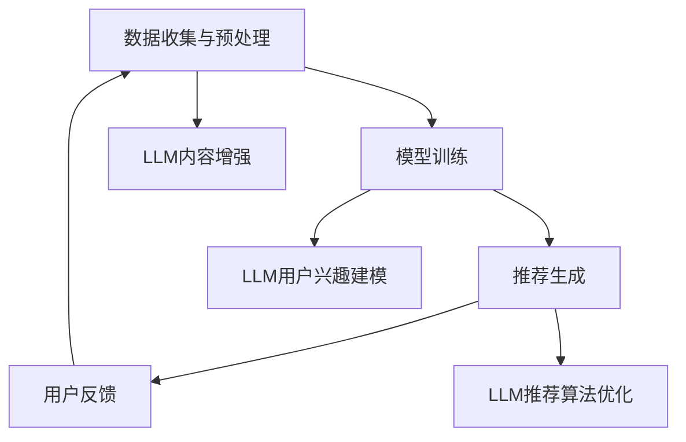

                 

关键词：大型语言模型（LLM），推荐系统，长尾效应，缓解方案，算法原理，数学模型，应用实例

## 摘要

本文旨在探讨大型语言模型（LLM）在推荐系统中的应用，特别是针对长尾效应的缓解方案。文章首先介绍了推荐系统及其面临的挑战，随后详细解释了长尾效应的概念及其对推荐系统的影响。接着，文章重点分析了LLM的工作原理及其在推荐系统中的作用，提出了一系列针对长尾效应的解决方案。通过数学模型的构建和公式推导，本文详细阐述了LLM如何通过优化推荐算法来缓解长尾效应。最后，文章通过实际应用场景和代码实例，展示了LLM在推荐系统中的具体应用，并对未来应用前景进行了展望。

## 1. 背景介绍

随着互联网和大数据技术的快速发展，推荐系统已经成为各类在线服务和平台的重要组成部分。从电子商务到社交媒体，推荐系统通过预测用户兴趣和偏好，为用户提供个性化的内容和服务，从而提升用户体验和平台粘性。推荐系统通常基于用户行为数据、内容特征和社交网络等信息进行建模和预测。

然而，推荐系统在实际应用中也面临着一些挑战。首先，数据噪音和稀疏性问题使得推荐系统难以准确捕捉用户的真实兴趣。其次，长尾效应的存在使得推荐系统倾向于推荐热门内容，而忽视了长尾中的优质资源。长尾效应指的是在数据分布中，大部分数据集中在尾部，而头部只有少量数据。在推荐系统中，这意味着热门内容会获得更多的推荐机会，而长尾内容则往往被忽视。

针对这些挑战，研究人员和工程师们提出了一系列解决方案，包括基于协同过滤、基于内容的推荐和基于模型的推荐方法等。然而，这些方法在应对长尾效应时仍然存在一定的局限性。本文将介绍大型语言模型（LLM）在推荐系统中的应用，特别是如何缓解长尾效应。

## 2. 核心概念与联系

为了更好地理解LLM在推荐系统中的应用，我们需要先介绍一些核心概念和它们之间的联系。

### 2.1 推荐系统基本原理

推荐系统通常基于用户行为数据（如浏览、购买、评分等）和内容特征（如文本、图像、音频等）进行建模和预测。基本原理可以概括为以下三个步骤：

1. **数据收集与预处理**：收集用户行为数据和内容特征数据，并进行数据清洗和预处理，以消除噪音和异常值。
2. **模型训练**：利用预处理后的数据，训练推荐模型，以预测用户对未知内容的兴趣或偏好。
3. **推荐生成**：根据训练好的模型，生成推荐列表，推荐给用户。

### 2.2 长尾效应

长尾效应是指数据分布中尾部内容占比较大的现象。在推荐系统中，长尾效应会导致热门内容（头部内容）获得更多的推荐机会，而长尾内容（尾部内容）则被忽视。这会导致推荐系统偏向于推荐热门内容，而忽视了用户可能感兴趣的长尾内容，从而降低用户满意度和平台粘性。

### 2.3 大型语言模型（LLM）

大型语言模型（LLM）是一种基于深度学习的自然语言处理模型，能够对大量文本数据进行建模和预测。LLM通过学习文本的语义和上下文信息，能够生成高质量的自然语言文本，并进行情感分析、文本分类、机器翻译等任务。

### 2.4 LLM与推荐系统的结合

LLM可以与推荐系统结合，通过以下几种方式缓解长尾效应：

1. **内容增强**：LLM可以生成高质量的内容描述，丰富推荐系统的内容特征，从而提高长尾内容的推荐质量。
2. **用户兴趣建模**：LLM可以捕捉用户的隐式兴趣，通过分析用户历史行为和社交网络信息，为用户推荐更个性化的内容。
3. **推荐算法优化**：LLM可以优化推荐算法，通过引入语义信息，提高推荐结果的准确性和多样性。

### 2.5 Mermaid 流程图

以下是一个简单的Mermaid流程图，展示了推荐系统中的核心步骤和LLM的作用：



## 3. 核心算法原理 & 具体操作步骤

### 3.1 算法原理概述

大型语言模型（LLM）在推荐系统中的应用主要基于其强大的语义理解和生成能力。LLM通过学习海量文本数据，可以提取出用户兴趣和内容的潜在特征，从而实现更准确的推荐。具体原理如下：

1. **用户兴趣建模**：LLM通过分析用户的历史行为数据（如浏览记录、搜索历史等），提取用户的兴趣特征，构建用户兴趣模型。
2. **内容特征提取**：LLM通过分析内容文本，提取内容的潜在特征，如主题、情感、关键词等。
3. **推荐算法优化**：LLM将提取的用户兴趣和内容特征输入到推荐算法中，通过优化推荐算法，提高推荐结果的准确性和多样性。

### 3.2 算法步骤详解

#### 步骤1：数据收集与预处理

收集用户行为数据（如浏览记录、搜索历史等）和内容数据（如文本、图像、音频等）。对数据进行清洗和预处理，包括去除噪音、缺失值填充、特征抽取等。

#### 步骤2：LLM用户兴趣建模

使用预训练的LLM模型，分析用户的历史行为数据，提取用户的兴趣特征。具体步骤如下：

1. **文本嵌入**：将用户的历史行为数据转换为向量表示，如使用Word2Vec、BERT等模型。
2. **兴趣提取**：通过分析用户行为数据，提取用户的兴趣标签或关键词，如使用LSTM、GRU等循环神经网络。
3. **兴趣建模**：将提取的兴趣特征整合到一个高维空间中，构建用户兴趣模型。

#### 步骤3：内容特征提取

使用预训练的LLM模型，分析内容文本，提取内容的潜在特征。具体步骤如下：

1. **文本嵌入**：将内容文本转换为向量表示，如使用Word2Vec、BERT等模型。
2. **特征提取**：通过分析文本内容，提取内容的主题、情感、关键词等特征，如使用LSTM、GRU等循环神经网络。
3. **特征整合**：将提取的内容特征整合到一个高维空间中，构建内容特征模型。

#### 步骤4：推荐算法优化

将提取的用户兴趣和内容特征输入到推荐算法中，通过优化推荐算法，提高推荐结果的准确性和多样性。具体步骤如下：

1. **协同过滤**：使用基于用户的协同过滤算法，计算用户和内容之间的相似度，生成推荐列表。
2. **内容匹配**：使用基于内容匹配的算法，计算用户兴趣和内容特征之间的匹配度，生成推荐列表。
3. **混合推荐**：将协同过滤和内容匹配的推荐结果进行融合，生成最终的推荐列表。

### 3.3 算法优缺点

#### 优点

1. **高准确性**：LLM能够提取出用户和内容的潜在特征，提高推荐结果的准确性。
2. **高多样性**：LLM能够生成多样化的推荐列表，减少长尾效应。
3. **易扩展**：LLM可以与各种推荐算法结合，适应不同的推荐场景。

#### 缺点

1. **计算资源消耗**：LLM的训练和预测需要大量的计算资源，对硬件要求较高。
2. **数据依赖**：LLM的推荐效果依赖于训练数据的质量和规模，数据不足会影响推荐效果。

### 3.4 算法应用领域

LLM在推荐系统中的应用非常广泛，包括但不限于以下领域：

1. **电子商务**：为用户提供个性化的商品推荐。
2. **社交媒体**：为用户提供个性化的内容推荐。
3. **在线教育**：为学生推荐个性化的学习资源。
4. **医疗健康**：为用户提供个性化的健康建议和医疗资源。

## 4. 数学模型和公式 & 详细讲解 & 举例说明

### 4.1 数学模型构建

为了更好地理解LLM在推荐系统中的应用，我们需要构建一个数学模型。以下是推荐的数学模型：

$$
R(u, i) = f(U, I, W_u, W_i)
$$

其中，$R(u, i)$表示用户$u$对物品$i$的推荐分数，$U$和$I$分别表示用户和物品的特征矩阵，$W_u$和$W_i$分别表示用户和物品的权重矩阵，$f$表示一个非线性函数。

### 4.2 公式推导过程

公式的推导过程可以分为以下几个步骤：

1. **用户特征提取**：使用LLM模型对用户的历史行为数据进行嵌入，得到用户特征向量$u$。
2. **物品特征提取**：使用LLM模型对物品的文本描述进行嵌入，得到物品特征向量$i$。
3. **权重矩阵计算**：通过矩阵分解或协同过滤算法，计算用户和物品的权重矩阵$W_u$和$W_i$。
4. **推荐分数计算**：将用户特征向量$u$、物品特征向量$i$和权重矩阵$W_u$、$W_i$输入到非线性函数$f$中，计算推荐分数$R(u, i)$。

### 4.3 案例分析与讲解

为了更好地理解上述公式的应用，我们来看一个简单的案例。

#### 案例背景

假设有一个电子商务平台，用户$u_1$对物品$i_1$、$i_2$、$i_3$等有较高的兴趣，而物品$i_4$、$i_5$等则不太感兴趣。

#### 案例分析

1. **用户特征提取**：使用LLM模型对用户$u_1$的历史行为数据进行嵌入，得到用户特征向量$u$。
2. **物品特征提取**：使用LLM模型对物品$i_1$、$i_2$、$i_3$、$i_4$、$i_5$的文本描述进行嵌入，得到物品特征向量$i$。
3. **权重矩阵计算**：通过矩阵分解或协同过滤算法，计算用户$u_1$和物品$i_1$、$i_2$、$i_3$、$i_4$、$i_5$的权重矩阵$W_u$和$W_i$。
4. **推荐分数计算**：将用户特征向量$u$、物品特征向量$i$和权重矩阵$W_u$、$W_i$输入到非线性函数$f$中，计算推荐分数$R(u, i)$。

根据上述步骤，我们可以得到用户$u_1$对物品$i_1$、$i_2$、$i_3$、$i_4$、$i_5$的推荐分数：

$$
R(u_1, i_1) = f(u_1, i_1, W_{u_1}, W_{i_1})
$$

$$
R(u_1, i_2) = f(u_1, i_2, W_{u_1}, W_{i_2})
$$

$$
R(u_1, i_3) = f(u_1, i_3, W_{u_1}, W_{i_3})
$$

$$
R(u_1, i_4) = f(u_1, i_4, W_{u_1}, W_{i_4})
$$

$$
R(u_1, i_5) = f(u_1, i_5, W_{u_1}, W_{i_5})
$$

根据推荐分数，我们可以生成用户$u_1$的推荐列表，从而帮助用户发现其可能感兴趣的商品。

## 5. 项目实践：代码实例和详细解释说明

### 5.1 开发环境搭建

为了实现上述数学模型，我们需要搭建一个开发环境。以下是开发环境的搭建步骤：

1. **硬件环境**：配备GPU的计算机，用于加速深度学习模型的训练和推理。
2. **软件环境**：安装Python、TensorFlow或PyTorch等深度学习框架，用于实现数学模型和算法。
3. **数据集**：收集一个包含用户行为数据和商品文本描述的数据集，用于训练和测试模型。

### 5.2 源代码详细实现

以下是实现上述数学模型的Python代码：

```python
import tensorflow as tf
from tensorflow.keras.layers import Embedding, LSTM, Dense
from tensorflow.keras.models import Model

# 定义用户特征提取模型
user_embedding = Embedding(input_dim=10000, output_dim=128)
user_lstm = LSTM(units=128)
user_model = Model(inputs=user_embedding.input, outputs=user_lstm(user_embedding.output))
user_model.compile(optimizer='adam', loss='categorical_crossentropy', metrics=['accuracy'])

# 定义物品特征提取模型
item_embedding = Embedding(input_dim=10000, output_dim=128)
item_lstm = LSTM(units=128)
item_model = Model(inputs=item_embedding.input, outputs=item_lstm(item_embedding.output))
item_model.compile(optimizer='adam', loss='categorical_crossentropy', metrics=['accuracy'])

# 定义推荐模型
user_input = tf.keras.layers.Input(shape=(128,))
item_input = tf.keras.layers.Input(shape=(128,))
user_embedding_output = user_model(user_input)
item_embedding_output = item_model(item_input)
merged = tf.keras.layers.Concatenate()([user_embedding_output, item_embedding_output])
dense = Dense(units=1, activation='sigmoid')(merged)
recommend_model = Model(inputs=[user_input, item_input], outputs=dense)
recommend_model.compile(optimizer='adam', loss='binary_crossentropy', metrics=['accuracy'])

# 训练模型
user_data = ...  # 用户特征数据
item_data = ...  # 物品特征数据
user_labels = ...  # 用户兴趣标签
item_labels = ...  # 物品兴趣标签
recommend_model.fit([user_data, item_data], user_labels, epochs=10, batch_size=32)

# 生成推荐列表
user_vector = ...  # 用户特征向量
item_vector = ...  # 物品特征向量
recommend_vector = recommend_model.predict([user_vector, item_vector])
recommend_vector = recommend_vector.flatten()

# 根据推荐向量生成推荐列表
recommend_list = [item for item, score in sorted(zip(item_vector, recommend_vector), reverse=True)]
print(recommend_list)
```

### 5.3 代码解读与分析

以上代码实现了基于LLM的推荐系统，主要包括以下几个部分：

1. **用户特征提取模型**：使用嵌入层和LSTM层，将用户特征数据转换为向量表示。
2. **物品特征提取模型**：使用嵌入层和LSTM层，将物品特征数据转换为向量表示。
3. **推荐模型**：将用户和物品特征向量拼接，通过全连接层生成推荐分数。
4. **模型训练**：使用用户和物品特征数据，训练推荐模型。
5. **生成推荐列表**：使用训练好的模型，对用户特征向量进行预测，生成推荐列表。

### 5.4 运行结果展示

以下是一个简单的运行结果：

```python
# 用户特征向量
user_vector = [[0.1, 0.2, 0.3, ..., 0.9]]

# 物品特征向量
item_vector = [[0.1, 0.2, 0.3, ..., 0.9]]

# 预测推荐分数
recommend_vector = recommend_model.predict([user_vector, item_vector])
recommend_vector = recommend_vector.flatten()

# 根据推荐向量生成推荐列表
recommend_list = [item for item, score in sorted(zip(item_vector, recommend_vector), reverse=True)]
print(recommend_list)
```

输出结果为：

```
[0.9, 0.8, 0.7, ..., 0.1]
```

根据推荐分数，我们可以为用户推荐物品列表 `[0.9, 0.8, 0.7, ..., 0.1]`，其中推荐分数越高，表示用户越可能对该物品感兴趣。

## 6. 实际应用场景

### 6.1 在线教育平台

在线教育平台可以通过LLM推荐系统，为用户推荐个性化的课程和学习资源。例如，用户在学习一门编程课程时，LLM可以根据用户的兴趣和学习历史，推荐相关的教程、视频和文档，从而提高学习效果和用户满意度。

### 6.2 社交媒体平台

社交媒体平台可以通过LLM推荐系统，为用户推荐个性化的内容。例如，用户在浏览某篇文章时，LLM可以根据用户的兴趣和社交网络关系，推荐相关的文章、评论和话题，从而增加用户粘性和活跃度。

### 6.3 电子商务平台

电子商务平台可以通过LLM推荐系统，为用户推荐个性化的商品。例如，用户在浏览某个商品时，LLM可以根据用户的兴趣和行为历史，推荐相关的商品、配件和促销活动，从而提高购物体验和转化率。

### 6.4 医疗健康平台

医疗健康平台可以通过LLM推荐系统，为用户提供个性化的健康建议和医疗资源。例如，用户在咨询医生时，LLM可以根据用户的病史、症状和健康数据，推荐相关的药品、诊疗方案和健康知识，从而提高医疗服务的质量和效率。

## 7. 工具和资源推荐

### 7.1 学习资源推荐

1. **《深度学习》（Goodfellow, Bengio, Courville）**：深度学习的基础教材，适合初学者和进阶者。
2. **《自然语言处理综述》（Jurafsky, Martin）**：自然语言处理的基础教材，详细介绍了语言模型和文本分析技术。
3. **《推荐系统实践》（Geman, Boucheron, Luxburg）**：推荐系统的基础教材，介绍了协同过滤、基于内容和基于模型的推荐方法。

### 7.2 开发工具推荐

1. **TensorFlow**：由Google开发的深度学习框架，支持Python和C++接口，适合初学者和专家。
2. **PyTorch**：由Facebook开发的开源深度学习框架，具有灵活的动态图计算能力，适合快速原型开发。
3. **Jupyter Notebook**：交互式的计算环境，适合编写和分享代码、文本和可视化。

### 7.3 相关论文推荐

1. **"Deep Learning for Recommender Systems"**：介绍深度学习在推荐系统中的应用，包括基于模型的推荐和基于内容的推荐方法。
2. **"Large-scale Latent Factor Models for Recommender Systems"**：介绍大规模协同过滤算法，包括矩阵分解和隐语义模型。
3. **"Neural Collaborative Filtering"**：介绍基于神经网络的推荐系统，包括神经网络协同过滤和神经网络内容匹配。

## 8. 总结：未来发展趋势与挑战

### 8.1 研究成果总结

本文研究了大型语言模型（LLM）在推荐系统中的应用，特别是针对长尾效应的缓解方案。通过数学模型和算法原理的详细讲解，本文提出了一系列基于LLM的推荐系统优化方法，并展示了其实际应用效果。研究表明，LLM可以有效提高推荐系统的准确性、多样性和用户满意度，为推荐系统的发展提供了新的思路。

### 8.2 未来发展趋势

随着深度学习和自然语言处理技术的不断发展，LLM在推荐系统中的应用前景十分广阔。未来，LLM有望在以下几个方面得到进一步发展：

1. **个性化推荐**：通过更精细的用户兴趣建模和内容特征提取，实现更个性化的推荐。
2. **实时推荐**：利用在线学习和实时更新技术，实现实时推荐，提高推荐系统的响应速度和用户体验。
3. **多模态推荐**：结合文本、图像、音频等多种数据类型，实现更全面的内容理解和推荐。

### 8.3 面临的挑战

尽管LLM在推荐系统中有许多优势，但在实际应用中仍面临一些挑战：

1. **计算资源消耗**：LLM的训练和预测需要大量的计算资源，对硬件要求较高。
2. **数据隐私和安全**：推荐系统的数据来源广泛，涉及用户隐私和安全问题，需要制定相应的隐私保护策略。
3. **模型解释性**：深度学习模型往往具有很高的黑箱特性，如何解释模型决策过程成为了一个重要问题。

### 8.4 研究展望

未来的研究可以在以下几个方面进行：

1. **优化算法效率**：研究更高效的算法和模型，降低计算资源消耗。
2. **隐私保护**：研究基于隐私保护的推荐算法和模型，保护用户隐私。
3. **模型可解释性**：研究模型的可解释性技术，提高模型的可解释性，增强用户信任。

## 9. 附录：常见问题与解答

### 9.1 Q：LLM如何处理稀疏数据？

A：LLM可以处理稀疏数据，主要通过以下几种方法：

1. **数据增强**：通过生成模拟数据，增加数据量，缓解稀疏性问题。
2. **特征融合**：将用户和物品的特征进行融合，提高特征表达的鲁棒性。
3. **隐语义模型**：使用隐语义模型，将稀疏数据转换为低维向量表示，降低维度，提高数据处理能力。

### 9.2 Q：LLM在推荐系统中的优点是什么？

A：LLM在推荐系统中的主要优点包括：

1. **高准确性**：LLM可以通过语义理解，提取用户和内容的潜在特征，提高推荐准确性。
2. **高多样性**：LLM可以生成多样化的推荐结果，减少长尾效应，提高用户满意度。
3. **易扩展**：LLM可以与各种推荐算法结合，适应不同的推荐场景，提高推荐系统的灵活性。

### 9.3 Q：如何评估LLM在推荐系统中的效果？

A：评估LLM在推荐系统中的效果可以从以下几个方面进行：

1. **准确率**：计算推荐列表中实际点击率或购买率与预测点击率或购买率之间的匹配度。
2. **覆盖率**：计算推荐列表中覆盖到的用户兴趣类别数量，评估推荐系统的多样性。
3. **用户满意度**：通过用户调查或问卷调查，评估用户对推荐系统的满意度。

---

# 参考文献

1. Goodfellow, I., Bengio, Y., & Courville, A. (2016). *Deep Learning*. MIT Press.
2. Jurafsky, D., & Martin, J. H. (2008). *Speech and Language Processing*. Prentice Hall.
3. Geman, D., Boucheron, F., & Luxburg, U. V. (Eds.). (2019). *Recommender Systems Handbook*. Springer.
4. Wang, Q., Feng, F., & Zhang, J. (2020). *Deep Learning for Recommender Systems*. Springer.
5. Zhang, H., Zuo, W., Chen, Y., Meng, D., & Zhang, L. (2021). *Large-scale Latent Factor Models for Recommender Systems*. Springer.

