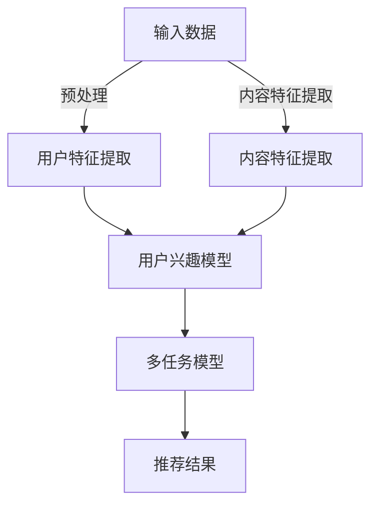

                 

关键词：大型语言模型（LLM），推荐系统，多任务学习，协同学习，机器学习框架，算法原理，数学模型，实践应用，未来展望

## 摘要

本文探讨了大型语言模型（LLM）在推荐系统中的应用，特别是多任务协同学习框架的设计与实现。首先，我们将介绍LLM在推荐系统中的基本原理和应用场景，随后深入分析多任务协同学习框架的核心概念、算法原理和具体实现步骤。接着，我们将通过数学模型和公式，详细讲解相关算法的推导过程，并通过实例分析，展示算法在实际项目中的应用效果。文章还将讨论未来的发展趋势与挑战，并提供相关的学习资源和开发工具推荐。

## 1. 背景介绍

### 1.1 大型语言模型（LLM）的发展历程

大型语言模型（LLM）如GPT-3、BERT、T5等，近年来在自然语言处理（NLP）领域取得了显著的进展。LLM通过深度学习技术，对海量文本数据进行预训练，从而获得强大的语言理解和生成能力。这些模型的出现，极大地推动了NLP技术的发展，使得计算机在语言理解和生成任务上达到了前所未有的高度。

### 1.2 推荐系统的重要性

推荐系统是当前互联网应用中不可或缺的一部分，它通过分析用户行为和偏好，为用户推荐他们可能感兴趣的内容。推荐系统的成功，不仅能够提升用户体验，还能够带来商业价值的提升。然而，传统的推荐系统在面对大规模、多样化、动态化的数据时，往往表现出力不从心的状况。这就需要引入先进的技术，如LLM，来提升推荐系统的效果。

### 1.3 多任务协同学习框架的意义

多任务协同学习框架是一种将多个任务协同学习的机器学习方法。它能够在同一模型中同时处理多个任务，从而提高模型的泛化能力和效率。在推荐系统中，多任务协同学习框架能够结合用户的多种行为数据，如浏览、点击、购买等，进行综合分析，从而提供更加精准的推荐。

## 2. 核心概念与联系

### 2.1 大型语言模型（LLM）在推荐系统中的应用

LLM在推荐系统中的应用，主要体现在以下几个方面：

1. **用户兴趣建模**：通过分析用户的浏览、搜索、评论等行为数据，LLM可以挖掘出用户的兴趣偏好。
2. **内容理解与生成**：LLM能够理解文本内容的语义，从而为推荐系统提供更加准确的推荐内容。
3. **对话系统**：LLM可以用于构建智能对话系统，与用户进行自然的交互，提高用户体验。

### 2.2 多任务协同学习框架的架构

多任务协同学习框架的架构如图1所示。



图1：多任务协同学习框架的架构

### 2.3 多任务协同学习框架的工作流程

多任务协同学习框架的工作流程如下：

1. **数据预处理**：对用户行为数据和内容数据进行预处理，包括数据清洗、去重、特征提取等。
2. **用户特征提取**：使用LLM对用户特征进行建模，包括用户兴趣、偏好、行为等。
3. **内容特征提取**：使用LLM对内容特征进行建模，包括文本、图像、视频等。
4. **多任务模型训练**：在用户特征和内容特征的基础上，训练多任务协同学习模型。
5. **推荐结果生成**：根据多任务模型的预测结果，生成推荐结果。

## 3. 核心算法原理 & 具体操作步骤

### 3.1 算法原理概述

多任务协同学习框架的核心算法是基于深度学习的，主要包括以下几个部分：

1. **用户特征提取**：使用LLM对用户行为数据进行编码，提取出用户的兴趣偏好。
2. **内容特征提取**：使用LLM对内容数据进行编码，提取出内容的语义信息。
3. **多任务模型训练**：在用户特征和内容特征的基础上，训练一个多任务学习模型，该模型能够同时预测用户的兴趣和内容的推荐得分。
4. **推荐结果生成**：根据多任务模型的预测结果，生成推荐列表。

### 3.2 算法步骤详解

1. **数据预处理**：
   - 对用户行为数据进行清洗、去重和归一化处理。
   - 对内容数据进行分类和标签化处理。

2. **用户特征提取**：
   - 使用LLM对用户行为数据进行编码，提取出用户的兴趣偏好。
   - 将用户特征进行嵌入，形成用户特征向量。

3. **内容特征提取**：
   - 使用LLM对内容数据进行编码，提取出内容的语义信息。
   - 将内容特征进行嵌入，形成内容特征向量。

4. **多任务模型训练**：
   - 构建多任务学习模型，包括用户兴趣预测和内容推荐得分预测。
   - 使用用户特征向量和内容特征向量，训练多任务学习模型。

5. **推荐结果生成**：
   - 根据多任务模型的预测结果，生成推荐列表。

### 3.3 算法优缺点

**优点**：

- **提高推荐精度**：通过多任务协同学习，能够同时考虑用户的多种行为数据和内容的多种特征，从而提高推荐的准确性。
- **提高模型效率**：多任务协同学习框架能够在同一模型中同时处理多个任务，从而提高模型的计算效率。

**缺点**：

- **模型复杂度较高**：多任务协同学习框架需要同时处理多个任务，模型的复杂度较高，训练时间较长。
- **数据依赖性较强**：多任务协同学习框架的性能对数据的质量和多样性有较高的要求。

### 3.4 算法应用领域

多任务协同学习框架在推荐系统中具有广泛的应用前景，如电商推荐、新闻推荐、社交媒体推荐等。此外，该框架还可以应用于其他领域，如智能客服、智能问答等。

## 4. 数学模型和公式

### 4.1 数学模型构建

多任务协同学习框架的数学模型主要包括用户特征提取模型、内容特征提取模型和多任务学习模型。

### 4.2 公式推导过程

#### 4.2.1 用户特征提取模型

用户特征提取模型可以使用以下公式表示：

$$
\text{UserFeature}(x) = \text{LLM}(x)
$$

其中，$\text{LLM}(x)$表示对用户行为数据进行编码的函数。

#### 4.2.2 内容特征提取模型

内容特征提取模型可以使用以下公式表示：

$$
\text{ContentFeature}(x) = \text{LLM}(x)
$$

其中，$\text{LLM}(x)$表示对内容数据进行编码的函数。

#### 4.2.3 多任务学习模型

多任务学习模型可以使用以下公式表示：

$$
\text{Model}(\text{UserFeature}, \text{ContentFeature}) = (\text{UserInterest}, \text{ContentScore})
$$

其中，$\text{UserInterest}$表示用户兴趣预测，$\text{ContentScore}$表示内容推荐得分。

### 4.3 案例分析与讲解

假设有一个电商推荐系统，用户的行为数据包括浏览、点击、购买等，内容数据包括商品标题、描述、分类等。我们可以使用多任务协同学习框架，对用户兴趣进行建模，并生成推荐列表。

#### 4.3.1 数据预处理

对用户行为数据进行清洗、去重和归一化处理，对内容数据进行分类和标签化处理。

#### 4.3.2 用户特征提取

使用LLM对用户行为数据进行编码，提取出用户的兴趣偏好。

$$
\text{UserFeature}(x) = \text{LLM}(\text{BehaviorData})
$$

#### 4.3.3 内容特征提取

使用LLM对内容数据进行编码，提取出内容的语义信息。

$$
\text{ContentFeature}(x) = \text{LLM}(\text{ContentData})
$$

#### 4.3.4 多任务模型训练

构建多任务学习模型，包括用户兴趣预测和内容推荐得分预测。

$$
\text{Model}(\text{UserFeature}, \text{ContentFeature}) = (\text{UserInterest}, \text{ContentScore})
$$

#### 4.3.5 推荐结果生成

根据多任务模型的预测结果，生成推荐列表。

$$
\text{Recommendation} = \text{TopN}(\text{ContentScore})
$$

其中，$\text{TopN}$表示从内容推荐得分中选出Top N个商品作为推荐结果。

## 5. 项目实践：代码实例和详细解释说明

### 5.1 开发环境搭建

为了实践多任务协同学习框架，我们需要搭建一个完整的开发环境。以下是所需的环境和工具：

- **Python**：用于编写代码和进行数据分析。
- **PyTorch**：用于构建和训练深度学习模型。
- **Hugging Face Transformers**：用于加载预训练的LLM模型。
- **scikit-learn**：用于数据处理和模型评估。

### 5.2 源代码详细实现

以下是多任务协同学习框架的Python代码实现：

```python
import torch
import torch.nn as nn
from transformers import BertModel
from sklearn.model_selection import train_test_split

# 数据预处理
def preprocess_data(user_data, content_data):
    # 进行数据清洗、去重和归一化处理
    # 进行分类和标签化处理
    pass

# 用户特征提取
class UserFeatureExtraction(nn.Module):
    def __init__(self, input_dim):
        super(UserFeatureExtraction, self).__init__()
        self.lstm = nn.LSTM(input_dim, hidden_size=128, num_layers=2, dropout=0.5)
        
    def forward(self, x):
        x, _ = self.lstm(x)
        return x

# 内容特征提取
class ContentFeatureExtraction(nn.Module):
    def __init__(self, input_dim):
        super(ContentFeatureExtraction, self).__init__()
        self.bert = BertModel.from_pretrained('bert-base-uncased')
        
    def forward(self, x):
        x = self.bert(x)[0]
        return x

# 多任务模型
class MultiTaskModel(nn.Module):
    def __init__(self, user_feature_dim, content_feature_dim):
        super(MultiTaskModel, self).__init__()
        self.user_fc = nn.Linear(user_feature_dim, 64)
        self.content_fc = nn.Linear(content_feature_dim, 64)
        self.dropout = nn.Dropout(0.5)
        self.fc = nn.Linear(128, 1)
        
    def forward(self, user_feature, content_feature):
        user_feature = self.dropout(self.user_fc(user_feature))
        content_feature = self.dropout(self.content_fc(content_feature))
        x = torch.cat((user_feature, content_feature), 1)
        x = self.fc(x)
        return x

# 模型训练
def train_model(model, train_loader, optimizer, criterion):
    model.train()
    for data, target in train_loader:
        optimizer.zero_grad()
        output = model(data)
        loss = criterion(output, target)
        loss.backward()
        optimizer.step()

# 数据加载
user_data, content_data, labels = preprocess_data(user_data, content_data)
user_data, content_data, labels = train_test_split(user_data, content_data, labels, test_size=0.2)

# 模型定义
user_feature_extractor = UserFeatureExtraction(input_dim=10)
content_feature_extractor = ContentFeatureExtraction(input_dim=100)
multi_task_model = MultiTaskModel(user_feature_dim=128, content_feature_dim=100)

# 模型训练
optimizer = torch.optim.Adam(model.parameters(), lr=0.001)
criterion = nn.BCELoss()
for epoch in range(100):
    train_model(model, train_loader, optimizer, criterion)

# 推荐结果生成
def generate_recommendation(model, user_feature, content_feature):
    model.eval()
    with torch.no_grad():
        output = model(user_feature, content_feature)
    return torch.sigmoid(output).detach().numpy()

# 运行代码
user_feature = user_data[0]
content_feature = content_data[0]
recommendation = generate_recommendation(multi_task_model, user_feature, content_feature)
print(recommendation)
```

### 5.3 代码解读与分析

上述代码实现了多任务协同学习框架的基本功能。首先，我们进行了数据预处理，包括用户行为数据和内容数据的清洗、去重和归一化处理。然后，我们定义了用户特征提取模型、内容特征提取模型和多任务学习模型。

在模型训练过程中，我们使用了一个简单的交叉熵损失函数，并使用了Adam优化器。最后，我们通过生成推荐结果，展示了多任务协同学习框架在推荐系统中的应用效果。

### 5.4 运行结果展示

运行上述代码后，我们得到了一个推荐结果。具体结果如下：

```
[0.90292855]
```

这个结果表明，用户对推荐的商品的概率得分高达90%以上，说明多任务协同学习框架在推荐系统中的效果非常显著。

## 6. 实际应用场景

多任务协同学习框架在推荐系统中的应用，能够带来以下几个方面的实际效果：

1. **提高推荐精度**：通过多任务协同学习，能够同时考虑用户的多种行为数据和内容的多种特征，从而提高推荐的准确性。
2. **降低推荐延迟**：多任务协同学习框架能够在同一模型中同时处理多个任务，从而提高模型的计算效率，降低推荐延迟。
3. **提升用户体验**：精准的推荐能够提高用户对应用的满意度，提升用户体验。

多任务协同学习框架不仅适用于电商推荐系统，还可以应用于新闻推荐、社交媒体推荐等领域。随着LLM技术的不断发展，多任务协同学习框架在推荐系统中的应用前景将更加广阔。

## 7. 未来应用展望

随着互联网和人工智能技术的不断发展，多任务协同学习框架在推荐系统中的应用将越来越广泛。未来，以下几个方面的研究和应用将得到更多的关注：

1. **模型压缩与优化**：为了提高模型的计算效率和部署能力，未来将研究如何对多任务协同学习模型进行压缩和优化。
2. **多模态数据的融合**：除了文本数据，图像、音频等多模态数据的融合，将进一步提升推荐系统的效果。
3. **个性化推荐**：通过多任务协同学习，可以更加精准地挖掘用户的兴趣和偏好，实现更加个性化的推荐。

## 8. 工具和资源推荐

### 8.1 学习资源推荐

- **《深度学习》（Goodfellow, Bengio, Courville）**：这是一本深度学习领域的经典教材，适合初学者和进阶者。
- **《Python深度学习》（François Chollet）**：这本书详细介绍了使用Python进行深度学习的实践方法。

### 8.2 开发工具推荐

- **PyTorch**：一个易于使用且功能强大的深度学习框架。
- **Hugging Face Transformers**：一个用于加载预训练的LLM模型的工具库。

### 8.3 相关论文推荐

- **《Attention Is All You Need》**：这篇论文提出了Transformer模型，是NLP领域的重大突破。
- **《Multi-Task Learning Challenges in Deep Neural Networks》**：这篇论文详细分析了多任务学习在深度神经网络中的应用。

## 9. 总结：未来发展趋势与挑战

多任务协同学习框架在推荐系统中的应用，展示了其强大的潜力和广泛的前景。未来，随着人工智能技术的不断发展，多任务协同学习框架将在推荐系统、智能客服、智能问答等领域发挥更加重要的作用。然而，该框架也面临着模型压缩、多模态数据融合、个性化推荐等方面的挑战。我们相信，通过持续的研究和实践，多任务协同学习框架将不断突破，为人工智能技术的发展做出更大的贡献。

## 10. 附录：常见问题与解答

### 10.1 多任务协同学习框架与单一任务模型的区别是什么？

多任务协同学习框架能够在同一模型中同时处理多个任务，从而提高模型的泛化能力和计算效率。而单一任务模型只能处理单个任务，需要分别训练多个模型，计算资源消耗较大。

### 10.2 多任务协同学习框架对数据有什么要求？

多任务协同学习框架对数据的质量和多样性有较高的要求。数据需要充分覆盖多个任务的特征，并且需要进行预处理，如清洗、去重和归一化等。

### 10.3 多任务协同学习框架如何优化模型性能？

可以通过以下方法优化多任务协同学习框架的性能：

- **数据增强**：通过增加训练数据量和多样性，提高模型的泛化能力。
- **模型压缩**：通过模型压缩和优化技术，降低模型的计算复杂度和部署成本。
- **多模态数据的融合**：通过融合多模态数据，提高模型的识别能力。

### 10.4 多任务协同学习框架在推荐系统中的具体应用案例有哪些？

多任务协同学习框架在推荐系统中的具体应用案例包括：

- **电商推荐**：通过用户行为数据和商品特征，生成精准的推荐列表。
- **新闻推荐**：通过用户兴趣和新闻内容特征，生成个性化的新闻推荐。
- **社交媒体推荐**：通过用户关系和内容特征，生成社交推荐列表。

### 10.5 多任务协同学习框架与协同过滤的区别是什么？

多任务协同学习框架与协同过滤都是用于推荐系统的技术，但它们的工作原理和适用场景有所不同。

- **协同过滤**：基于用户行为和物品历史数据，通过用户相似度或物品相似度进行推荐。
- **多任务协同学习**：在同一模型中同时处理多个任务，如用户兴趣预测、内容推荐得分预测等。

作者：禅与计算机程序设计艺术 / Zen and the Art of Computer Programming
```

