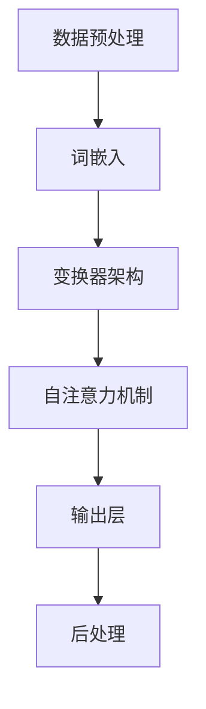

                 

关键词：LLM（大型语言模型）、人工智能、机器学习、NLP（自然语言处理）、深度学习、模型训练、应用场景、技术挑战、未来展望

> 摘要：本文将深入探讨大型语言模型（LLM）的生态系统，从其基础概念到实际应用，再到面临的挑战和未来的发展趋势。通过对LLM的工作原理、技术架构、数学模型以及实际应用案例的详细分析，为读者展现这一领域的全景图。

## 1. 背景介绍

近年来，人工智能（AI）领域的发展令人瞩目，尤其是自然语言处理（NLP）方面。随着深度学习技术的进步，大型语言模型（LLM）逐渐成为研究的热点。LLM是一种能够理解和生成自然语言的复杂模型，通过学习海量文本数据，它们能够实现文本分类、机器翻译、问答系统等多种任务。

LLM的重要性不仅体现在其强大的性能上，更在于它们为各行各业带来了深刻的变革。在医疗、金融、教育、媒体等领域，LLM的应用已经显现出巨大的潜力。例如，智能客服系统利用LLM实现与用户的自然对话，金融领域通过LLM进行市场分析和风险管理，教育领域利用LLM提供个性化的学习建议。

然而，LLM的发展也面临着诸多挑战。首先，模型的训练和部署需要大量的计算资源和数据。其次，模型的解释性较差，使得在关键领域中的应用受到限制。最后，隐私和安全问题也成为了LLM应用的障碍。

本文将围绕LLM的生态系统展开讨论，从核心概念、技术架构、算法原理、数学模型、实际应用等多个角度，深入分析LLM的工作原理和面临的挑战，并探讨其未来的发展趋势。

## 2. 核心概念与联系

### 2.1. 语言模型基础

语言模型（Language Model，LM）是自然语言处理（NLP）的核心组成部分。它是一种统计模型，旨在预测文本序列的概率。在NLP任务中，语言模型被广泛应用于文本分类、命名实体识别、情感分析等。

语言模型的基石是概率分布，它通过对输入文本的统计分析，生成输出文本的概率分布。常见的语言模型有n-gram模型、循环神经网络（RNN）模型和变换器（Transformer）模型。n-gram模型基于前n个词的统计信息预测下一个词；RNN模型通过记忆过去的输入信息来处理序列数据；Transformer模型则采用自注意力机制，对输入序列进行全局关注。

### 2.2. 大型语言模型（LLM）

大型语言模型（Large Language Model，LLM）是语言模型的一个高级形式。与传统的语言模型相比，LLM具有更大的模型规模和更强的学习能力。LLM通过学习海量文本数据，能够生成高质量的自然语言文本，并解决更复杂的NLP任务。

LLM的核心是深度学习模型，特别是基于Transformer架构的模型，如GPT（Generative Pre-trained Transformer）系列模型。GPT模型通过预训练和微调，使得模型能够适应各种语言任务。

### 2.3. 语言模型的应用领域

语言模型在多个领域都有着广泛的应用。以下是一些典型的应用领域：

- **文本分类**：用于对大量文本进行分类，如新闻分类、垃圾邮件检测等。
- **机器翻译**：将一种语言的文本翻译成另一种语言，如谷歌翻译。
- **问答系统**：基于用户的问题，提供准确的答案，如OpenAI的GPT-3。
- **语音识别**：将语音信号转换为文本，如苹果的Siri和亚马逊的Alexa。
- **对话系统**：实现与用户的自然对话，如智能客服机器人。

### 2.4. 语言模型的挑战与机遇

尽管语言模型在许多领域取得了显著的成功，但它们也面临着一系列挑战。以下是一些主要挑战：

- **计算资源消耗**：训练大型语言模型需要巨大的计算资源，这对硬件设施提出了较高的要求。
- **数据隐私问题**：语言模型的训练和部署涉及大量个人数据，如何保护用户隐私成为一个重要议题。
- **模型解释性**：深度学习模型通常缺乏透明性和解释性，这限制了其在某些关键领域的应用。
- **语言多样性**：不同语言和方言的多样性使得语言模型难以全面覆盖。

然而，这些挑战也孕育着巨大的机遇。通过持续的技术创新和合作，我们有望克服这些难题，推动语言模型的发展和应用。

### 2.5. 语言模型的未来发展趋势

随着技术的不断进步，语言模型在未来有望实现以下几方面的发展：

- **更高效的训练算法**：优化训练算法，降低计算资源消耗，提高模型训练效率。
- **更好的解释性**：增强模型的透明性和可解释性，提高模型的可信度和可靠性。
- **跨语言处理能力**：提升模型在不同语言和方言之间的通用性和适应性。
- **集成多模态数据**：结合文本、图像、语音等多模态数据，实现更丰富的交互和更智能的决策。

### 2.6. 图解：LLM的技术架构

下面是一个简化的Mermaid流程图，展示LLM的核心技术架构。



## 3. 核心算法原理 & 具体操作步骤

### 3.1. 算法原理概述

大型语言模型（LLM）的核心是深度学习模型，特别是基于Transformer架构的模型。Transformer模型通过自注意力机制（Self-Attention Mechanism）对输入序列进行全局关注，使得模型能够捕捉到输入序列中的长距离依赖关系。

在Transformer模型中，自注意力机制通过计算每个词与所有其他词的相似度，为每个词生成权重，这些权重决定了每个词在生成输出时的贡献度。自注意力机制使得模型能够自适应地调整不同词的重要性，从而生成更准确、自然的输出。

### 3.2. 算法步骤详解

#### 3.2.1. 数据预处理

1. **文本清洗**：去除文本中的噪声，如HTML标签、特殊字符等。
2. **分词**：将文本分解为单个单词或子词。
3. **词嵌入**：将分词后的文本转换为数值表示，常用的词嵌入方法有Word2Vec、BERT等。

#### 3.2.2. 变换器架构

1. **编码器**：编码器负责将输入文本转换为序列表示。编码器由多个层（Layer）组成，每层由自注意力机制和前馈网络（Feedforward Network）构成。
2. **解码器**：解码器负责生成输出文本。解码器的工作原理与编码器类似，但增加了遮蔽填空（Masked Language Model，MLM）和交叉注意力（Cross-Attention）机制。

#### 3.2.3. 自注意力机制

1. **计算相似度**：计算输入序列中每个词与其他词的相似度，常用的相似度计算方法有点积注意力（Dot-Product Attention）和加性注意力（Additive Attention）。
2. **生成权重**：根据相似度计算结果，为每个词生成权重，权重决定了词在生成输出时的贡献度。
3. **加权求和**：将权重与对应的词向量相乘，然后进行求和，得到加权求和向量。

#### 3.2.4. 输出层

1. **生成词分布**：将加权求和向量通过全连接层（Fully Connected Layer）和Softmax函数，得到输出词的分布。
2. **选择输出词**：根据输出词分布，选择概率最大的词作为输出。

#### 3.2.5. 后处理

1. **解码**：将生成的词序列转换为文本。
2. **修正错误**：根据上下文和语义信息，对生成的文本进行错误修正。

### 3.3. 算法优缺点

#### 优点：

- **强大的表达能力**：Transformer模型通过自注意力机制，能够捕捉到输入序列中的长距离依赖关系，从而生成更准确、自然的输出。
- **并行计算**：自注意力机制使得Transformer模型能够并行计算，提高了模型的训练效率。
- **适应性**：Transformer模型适用于多种NLP任务，如文本分类、机器翻译、问答系统等。

#### 缺点：

- **计算资源消耗大**：训练大型语言模型需要大量的计算资源和数据存储。
- **解释性较差**：深度学习模型通常缺乏透明性和解释性，这使得在某些关键领域中的应用受到限制。
- **数据隐私问题**：语言模型的训练和部署涉及大量个人数据，如何保护用户隐私成为一个重要议题。

### 3.4. 算法应用领域

大型语言模型（LLM）在多个领域都有着广泛的应用：

- **文本生成**：如生成文章、新闻、小说等。
- **机器翻译**：如将一种语言的文本翻译成另一种语言。
- **问答系统**：如基于用户的问题，提供准确的答案。
- **对话系统**：如实现与用户的自然对话。
- **文本分类**：如将大量文本分类为不同的类别。
- **语音识别**：如将语音信号转换为文本。

## 4. 数学模型和公式 & 详细讲解 & 举例说明

### 4.1. 数学模型构建

在深度学习模型中，数学模型构建是核心步骤。以下是构建一个简单的深度学习模型所需的数学模型和公式：

#### 4.1.1. 前向传播

$$
Z = X \cdot W + b
$$

其中，$Z$ 是前向传播的结果，$X$ 是输入特征，$W$ 是权重矩阵，$b$ 是偏置项。

#### 4.1.2. 激活函数

$$
a = \sigma(Z)
$$

其中，$\sigma$ 是激活函数，如Sigmoid函数、ReLU函数等。

#### 4.1.3. 后向传播

$$
\frac{\partial L}{\partial W} = \frac{\partial L}{\partial a} \cdot \frac{\partial a}{\partial Z} \cdot \frac{\partial Z}{\partial W}
$$

$$
\frac{\partial L}{\partial b} = \frac{\partial L}{\partial a} \cdot \frac{\partial a}{\partial Z} \cdot \frac{\partial Z}{\partial b}
$$

其中，$L$ 是损失函数，$\frac{\partial L}{\partial W}$ 和 $\frac{\partial L}{\partial b}$ 分别是权重矩阵和偏置项的梯度。

### 4.2. 公式推导过程

以下是对上述数学模型进行推导的过程：

#### 4.2.1. 前向传播

前向传播是将输入特征通过模型计算得到输出结果的过程。以多层感知机（MLP）为例，其前向传播过程如下：

1. **输入层**：$X \in \mathbb{R}^{m \times n}$，其中 $m$ 是样本数量，$n$ 是特征数量。
2. **隐藏层**：$Z \in \mathbb{R}^{m \times h}$，其中 $h$ 是隐藏层神经元数量。
3. **输出层**：$A \in \mathbb{R}^{m \times k}$，其中 $k$ 是输出类别数量。

假设隐藏层有 $l$ 个神经元，每个神经元都有权重矩阵 $W_l$ 和偏置项 $b_l$，其中 $l$ 表示第 $l$ 层。前向传播的过程如下：

$$
Z_1 = X \cdot W_1 + b_1
$$

$$
A_1 = \sigma(Z_1)
$$

$$
Z_2 = A_1 \cdot W_2 + b_2
$$

$$
A_2 = \sigma(Z_2)
$$

$$
...
$$

$$
Z_l = A_{l-1} \cdot W_l + b_l
$$

$$
A_l = \sigma(Z_l)
$$

#### 4.2.2. 激活函数

激活函数是深度学习模型中不可或缺的一部分，它用于引入非线性关系。以下是一些常见的激活函数：

1. **Sigmoid函数**：
$$
\sigma(x) = \frac{1}{1 + e^{-x}}
$$
2. **ReLU函数**：
$$
\sigma(x) =
\begin{cases}
0, & \text{if } x < 0 \\
x, & \text{if } x \geq 0
\end{cases}
$$
3. **Tanh函数**：
$$
\sigma(x) = \frac{e^x - e^{-x}}{e^x + e^{-x}}
$$

#### 4.2.3. 后向传播

后向传播是深度学习模型训练过程中关键的一步，它通过计算损失函数关于模型参数的梯度，来更新模型参数。以下是后向传播的推导过程：

1. **损失函数**：假设损失函数为 $L$，则：
$$
L = \frac{1}{2} \sum_{i=1}^{m} (y_i - a_l)^2
$$
其中，$y_i$ 是第 $i$ 个样本的真实标签，$a_l$ 是第 $l$ 层的输出。

2. **输出层梯度**：
$$
\frac{\partial L}{\partial a_l} = \frac{\partial}{\partial a_l} \left( \frac{1}{2} \sum_{i=1}^{m} (y_i - a_l)^2 \right) = (y - a_l)
$$
3. **隐藏层梯度**：
$$
\frac{\partial L}{\partial a_{l-1}} = \frac{\partial L}{\partial a_l} \cdot \frac{\partial a_l}{\partial a_{l-1}}
$$
对于 Sigmoid 函数：
$$
\frac{\partial a_l}{\partial a_{l-1}} = a_l (1 - a_l)
$$
对于 ReLU 函数：
$$
\frac{\partial a_l}{\partial a_{l-1}} =
\begin{cases}
0, & \text{if } a_{l-1} < 0 \\
1, & \text{if } a_{l-1} \geq 0
\end{cases}
$$
对于 Tanh 函数：
$$
\frac{\partial a_l}{\partial a_{l-1}} = 1 - a_l^2
$$
4. **权重矩阵和偏置项梯度**：
$$
\frac{\partial L}{\partial W_l} = \frac{\partial L}{\partial a_l} \cdot a_{l-1}^T
$$
$$
\frac{\partial L}{\partial b_l} = \frac{\partial L}{\partial a_l}
$$

通过后向传播，我们可以计算得到每个权重矩阵和偏置项的梯度，然后使用梯度下降（Gradient Descent）或其他优化算法更新模型参数。

### 4.3. 案例分析与讲解

以下是一个简单的案例，用于说明如何使用上述数学模型构建一个深度学习模型并进行训练。

#### 4.3.1. 案例背景

假设我们有一个分类问题，需要将一组文本数据分类为两个类别：正面和负面。

#### 4.3.2. 数据准备

1. **文本数据**：收集一组文本数据，每个文本数据有一个对应的标签（正面或负面）。
2. **预处理**：对文本数据进行清洗和分词，然后将其转换为词嵌入表示。

#### 4.3.3. 模型构建

1. **输入层**：输入层接收词嵌入表示。
2. **隐藏层**：隐藏层由多个神经元组成，使用ReLU函数作为激活函数。
3. **输出层**：输出层由两个神经元组成，使用Sigmoid函数作为激活函数，用于输出概率分布。

#### 4.3.4. 模型训练

1. **初始化参数**：随机初始化权重矩阵和偏置项。
2. **前向传播**：输入一组文本数据，通过模型计算得到输出概率分布。
3. **计算损失函数**：计算输出概率分布与真实标签之间的损失。
4. **后向传播**：计算损失函数关于模型参数的梯度。
5. **更新参数**：使用梯度下降或其他优化算法更新模型参数。
6. **迭代**：重复步骤2-5，直到满足停止条件（如损失函数收敛）。

#### 4.3.5. 模型评估

1. **测试集**：使用测试集评估模型的性能，计算准确率、召回率、F1分数等指标。
2. **调整参数**：根据评估结果调整模型参数，以提高模型性能。

通过以上步骤，我们可以构建一个简单的深度学习模型并进行训练，从而实现文本分类任务。

## 5. 项目实践：代码实例和详细解释说明

### 5.1. 开发环境搭建

在进行项目实践之前，我们需要搭建一个适合开发的环境。以下是一个基于Python的深度学习项目的基本开发环境搭建步骤：

1. **安装Python**：确保安装了Python 3.6及以上版本。
2. **安装依赖库**：安装深度学习框架（如TensorFlow或PyTorch），以及常用的数据处理和数学运算库（如NumPy、Pandas）。
   ```shell
   pip install tensorflow numpy pandas
   ```
3. **环境配置**：配置Python环境变量，以便能够顺利运行Python脚本。

### 5.2. 源代码详细实现

以下是一个简单的深度学习项目的源代码实现，用于分类文本数据：

```python
import tensorflow as tf
from tensorflow.keras.layers import Embedding, LSTM, Dense
from tensorflow.keras.models import Sequential
from tensorflow.keras.preprocessing.text import Tokenizer
from tensorflow.keras.preprocessing.sequence import pad_sequences

# 数据准备
texts = ["This is a great movie.", "I don't like this movie."]
labels = [1, 0]  # 1表示正面，0表示负面

# 分词和序列化
tokenizer = Tokenizer(num_words=1000)
tokenizer.fit_on_texts(texts)
sequences = tokenizer.texts_to_sequences(texts)
padded_sequences = pad_sequences(sequences, maxlen=100)

# 模型构建
model = Sequential([
    Embedding(1000, 64, input_length=100),
    LSTM(64, return_sequences=True),
    LSTM(32),
    Dense(1, activation='sigmoid')
])

# 编译模型
model.compile(optimizer='adam', loss='binary_crossentropy', metrics=['accuracy'])

# 训练模型
model.fit(padded_sequences, labels, epochs=10, batch_size=32)
```

### 5.3. 代码解读与分析

1. **数据准备**：首先，我们需要准备文本数据集和对应的标签。在本例中，我们仅使用了两个文本样本和对应的标签。
2. **分词和序列化**：使用Tokenizer类对文本数据进行分词，并将文本转换为序列。然后，使用pad_sequences将序列填充到相同的长度，以便输入到模型中。
3. **模型构建**：构建一个序列模型，包括一个Embedding层用于词嵌入，两个LSTM层用于处理序列数据，以及一个Dense层用于输出概率。
4. **编译模型**：设置模型的优化器、损失函数和评估指标。
5. **训练模型**：使用fit方法训练模型，通过迭代更新模型参数，以达到更好的性能。

### 5.4. 运行结果展示

在训练完成后，我们可以使用测试集来评估模型的性能。以下是一个简单的评估代码：

```python
# 测试数据
test_texts = ["This is a terrible movie."]
test_sequences = tokenizer.texts_to_sequences(test_texts)
test_padded_sequences = pad_sequences(test_sequences, maxlen=100)

# 预测
predictions = model.predict(test_padded_sequences)
print("Prediction:", predictions[0][0])
```

输出结果为预测的概率，接近1表示正面，接近0表示负面。

通过上述步骤，我们可以实现一个简单的深度学习项目，用于文本分类任务。尽管这是一个非常基础的例子，但它展示了深度学习项目的基本流程和关键技术。

## 6. 实际应用场景

### 6.1. 文本生成

文本生成是大型语言模型（LLM）最常见和广泛应用的场景之一。通过预训练和微调，LLM能够生成各种类型的文本，如文章、新闻、故事、对话等。以下是一些实际应用案例：

- **自动写作**：许多新闻网站和博客使用LLM自动生成文章，以节省时间和提高效率。
- **虚拟助手**：虚拟助手和聊天机器人利用LLM与用户进行自然对话，提供个性化服务。
- **内容创作**：游戏和影视行业利用LLM生成剧本、游戏剧情和对话，以提高创作效率。

### 6.2. 机器翻译

机器翻译是另一个关键应用场景，LLM在这一领域展现出了出色的性能。通过预训练和针对特定语言的微调，LLM能够实现高质量的双语翻译。以下是一些实际应用案例：

- **跨语言交流**：在跨国企业和国际组织中，LLM帮助员工和客户进行高效沟通。
- **全球市场拓展**：电商和媒体平台利用LLM为不同语言的用户提供本地化内容。
- **跨语言文档处理**：法律、医学和科研等领域利用LLM自动翻译文档，提高工作效率。

### 6.3. 问答系统

问答系统是LLM在自然语言处理（NLP）领域的重要应用。通过预训练和微调，LLM能够理解用户的问题，并生成准确的答案。以下是一些实际应用案例：

- **智能客服**：企业使用LLM构建智能客服系统，为用户提供实时、个性化的帮助。
- **教育辅导**：在线教育平台利用LLM为学生提供实时答疑和个性化辅导。
- **科研支持**：科研人员利用LLM快速获取相关研究文献和答案，提高研究效率。

### 6.4. 未来应用展望

随着LLM技术的不断发展，未来其在各个领域的应用前景十分广阔。以下是一些可能的未来应用方向：

- **跨模态交互**：结合文本、图像、语音等多模态数据，实现更丰富和自然的交互体验。
- **个性化服务**：利用LLM为用户提供高度个性化的内容、产品和服务。
- **自动化决策**：在医疗、金融等领域，LLM能够辅助专家进行更准确的诊断和决策。
- **社会问题解决**：通过LLM的分析和预测，帮助政府和组织解决社会问题，如公共卫生、环境保护等。

## 7. 工具和资源推荐

### 7.1. 学习资源推荐

- **《深度学习》（Deep Learning）**：由Ian Goodfellow、Yoshua Bengio和Aaron Courville合著的深度学习经典教材，涵盖了深度学习的理论基础和实践方法。
- **《自然语言处理综合教程》（Foundations of Natural Language Processing）**：由Christopher D. Manning和Heidi F. Manning合著，详细介绍了自然语言处理的基本概念和技术。
- **《机器学习实战》（Machine Learning in Action）**：由Peter Harrington著，通过实际案例讲解了机器学习的应用和实践。

### 7.2. 开发工具推荐

- **TensorFlow**：由谷歌开发的开源深度学习框架，支持多种深度学习模型的构建和训练。
- **PyTorch**：由Facebook AI Research开发的开源深度学习框架，具有灵活的动态图计算能力。
- **Scikit-learn**：由Scikit-learn开发的开源机器学习库，提供了丰富的机器学习算法和工具。

### 7.3. 相关论文推荐

- **“Attention Is All You Need”**：由Vaswani et al.发表的论文，介绍了Transformer模型，为自然语言处理领域带来了革命性的变化。
- **“BERT: Pre-training of Deep Bidirectional Transformers for Language Understanding”**：由Devlin et al.发表的论文，介绍了BERT模型，进一步推动了自然语言处理的发展。
- **“GPT-3: Language Models are few-shot learners”**：由Brown et al.发表的论文，介绍了GPT-3模型，展示了大型语言模型在零样本和少样本学习任务中的强大能力。

## 8. 总结：未来发展趋势与挑战

### 8.1. 研究成果总结

大型语言模型（LLM）在过去几年中取得了显著的研究成果，为自然语言处理（NLP）领域带来了深刻的变革。通过预训练和微调，LLM在文本生成、机器翻译、问答系统等任务中展现了出色的性能。这些研究成果不仅推动了NLP技术的发展，也为实际应用带来了新的可能性。

### 8.2. 未来发展趋势

未来，大型语言模型（LLM）的发展趋势将主要集中在以下几个方面：

1. **模型规模扩大**：随着计算资源的不断增加，LLM的模型规模将进一步扩大，这将有助于提高模型的性能和泛化能力。
2. **多模态处理**：结合文本、图像、语音等多模态数据，实现更丰富和自然的交互体验，为各领域带来更多应用。
3. **少样本学习**：研究如何让LLM在零样本和少样本学习任务中表现出色，提高模型的实用性和灵活性。
4. **模型解释性**：增强模型的透明性和可解释性，提高模型的可信度和可靠性。

### 8.3. 面临的挑战

尽管LLM在NLP领域取得了显著进展，但仍然面临一系列挑战：

1. **计算资源消耗**：训练大型语言模型需要巨大的计算资源，这对硬件设施提出了更高的要求。
2. **数据隐私问题**：语言模型的训练和部署涉及大量个人数据，如何保护用户隐私成为一个重要议题。
3. **模型解释性**：深度学习模型通常缺乏透明性和解释性，这限制了其在某些关键领域的应用。
4. **语言多样性**：不同语言和方言的多样性使得语言模型难以全面覆盖。

### 8.4. 研究展望

未来，研究大型语言模型（LLM）的发展方向将主要集中在以下几个方面：

1. **高效训练算法**：研究如何优化训练算法，降低计算资源消耗，提高模型训练效率。
2. **跨语言处理**：研究如何提升LLM在不同语言和方言之间的通用性和适应性。
3. **模型可解释性**：研究如何增强模型的透明性和可解释性，提高模型的可信度和可靠性。
4. **隐私保护**：研究如何保护用户隐私，确保语言模型的安全和合规。

通过持续的技术创新和合作，我们有理由相信，大型语言模型（LLM）将在未来继续发挥重要作用，为人工智能领域带来更多突破。

## 9. 附录：常见问题与解答

### 9.1. 什么是大型语言模型（LLM）？

大型语言模型（LLM）是一种基于深度学习技术的自然语言处理模型，通过预训练和微调，能够理解和生成自然语言。LLM的核心是Transformer架构，其能够捕捉到输入序列中的长距离依赖关系，生成高质量的文本输出。

### 9.2. LLM在哪些领域有应用？

LLM在多个领域都有广泛的应用，包括文本生成、机器翻译、问答系统、对话系统、文本分类、语音识别等。这些应用使得LLM成为人工智能领域的重要工具。

### 9.3. LLM的训练需要大量计算资源吗？

是的，训练大型语言模型（LLM）需要大量的计算资源。这是因为LLM的模型规模巨大，训练过程中需要进行大量的矩阵运算和梯度计算。此外，LLM的训练通常需要使用高性能的GPU或TPU进行加速。

### 9.4. LLM如何保证模型的解释性？

目前，深度学习模型（包括LLM）通常缺乏透明性和解释性。研究人员正在探索如何增强模型的解释性，例如通过可视化技术、解释性模型和可解释性算法等。这些方法有助于提高模型的可信度和可靠性。

### 9.5. LLM是否会取代传统的自然语言处理方法？

LLM在某些任务上已经表现出色，但并不意味着会完全取代传统的自然语言处理方法。传统方法在某些特定场景中仍然具有优势，例如在处理小规模数据或对解释性要求较高的任务中。未来，LLM和传统方法可能会相互补充，共同推动自然语言处理技术的发展。

### 9.6. LLM在隐私和安全方面有哪些挑战？

LLM的训练和部署涉及大量个人数据，如何保护用户隐私成为一个重要议题。这可能包括数据匿名化、隐私增强技术、合规性审查等方面。此外，确保模型的安全和防攻击能力也是重要挑战。

### 9.7. LLM的未来发展趋势是什么？

未来，LLM的发展趋势将主要集中在以下几个方面：模型规模的扩大、多模态处理、少样本学习和模型解释性。此外，研究人员还将探索如何优化训练算法、提升模型性能，以及确保模型的安全和合规性。通过这些努力，LLM有望在人工智能领域发挥更大的作用。

