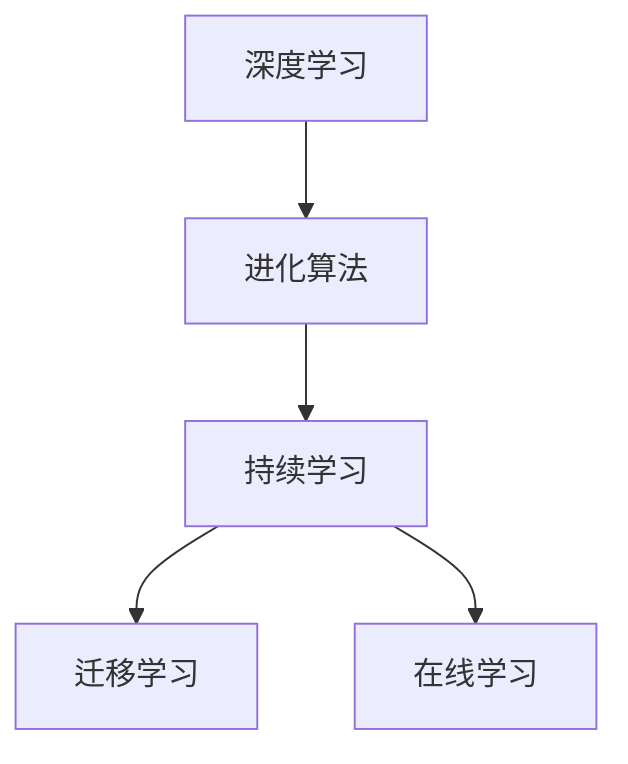

                 

关键词：大型语言模型、持续学习、深度学习、进化算法、人工智能

> 摘要：本文将探讨大型语言模型（LLM）的持续学习机制，以及其在深度学习和进化算法中的应用。我们将分析LLM的架构和核心概念，探讨其持续学习过程中的算法原理、数学模型和具体操作步骤。同时，我们将通过实际项目实践和代码实例，展示LLM在实际应用中的效果和优势。最后，我们将对LLM的未来发展趋势和面临的挑战进行展望。

## 1. 背景介绍

随着人工智能技术的快速发展，大型语言模型（LLM）已经成为自然语言处理（NLP）领域的重要工具。LLM具有强大的文本生成、理解和推理能力，广泛应用于智能客服、机器翻译、文本摘要、问答系统等多个领域。然而，传统LLM的训练和优化过程存在一些问题，如计算成本高、训练时间较长等。为了解决这些问题，研究人员提出了持续学习（Continuous Learning）的概念，以实现LLM的实时更新和优化。

持续学习旨在使LLM能够在不断变化的数据环境中持续学习和适应，从而提高其性能和鲁棒性。在持续学习过程中，LLM需要通过一系列算法和技术，如迁移学习、在线学习、进化算法等，不断更新和优化其模型参数。本文将重点关注LLM的持续学习机制，探讨其核心概念、算法原理和实际应用。

## 2. 核心概念与联系

为了更好地理解LLM的持续学习机制，我们需要首先了解一些核心概念和它们之间的联系。

### 2.1 深度学习

深度学习是一种基于人工神经网络的学习方法，通过多层神经元的非线性变换，实现对数据的建模和预测。深度学习在计算机视觉、语音识别、自然语言处理等领域取得了显著成果。

### 2.2 进化算法

进化算法是一种模拟生物进化的计算方法，通过自然选择、交叉、变异等操作，生成新一代个体，并逐步优化问题的解。进化算法在优化、组合优化、数据挖掘等领域具有广泛的应用。

### 2.3 持续学习

持续学习是一种使LLM能够在不断变化的数据环境中持续学习和适应的学习方法。在持续学习过程中，LLM需要通过迁移学习、在线学习、进化算法等技术，不断更新和优化其模型参数。

### 2.4 关系图

为了更好地理解上述概念之间的联系，我们可以使用Mermaid流程图来展示它们之间的关系。



## 3. 核心算法原理 & 具体操作步骤

### 3.1 算法原理概述

LLM的持续学习过程主要涉及以下几个核心算法：

1. 迁移学习（Transfer Learning）
2. 在线学习（Online Learning）
3. 进化算法（Evolutionary Algorithm）

这些算法相互配合，共同实现LLM的持续学习。

### 3.2 算法步骤详解

#### 3.2.1 迁移学习

迁移学习是一种将预训练模型应用于新任务的学习方法。在LLM的持续学习过程中，迁移学习可以帮助LLM快速适应新的数据环境。

1. 预训练：使用大量文本数据对LLM进行预训练，使其具备一定的语言理解和生成能力。
2. 迁移：将预训练的LLM应用于新任务，通过微调模型参数，使其适应新的数据环境。

#### 3.2.2 在线学习

在线学习是一种实时更新模型参数的学习方法，可以有效地提高LLM的适应能力。

1. 数据流：将新的数据流输入LLM，进行实时学习。
2. 模型更新：根据新的数据流，更新LLM的模型参数。

#### 3.2.3 进化算法

进化算法通过模拟生物进化的过程，逐步优化LLM的模型参数。

1. 个体生成：根据当前LLM的参数，生成一组新的个体。
2. 自然选择：根据个体在任务上的表现，筛选出优秀个体。
3. 交叉和变异：对优秀个体进行交叉和变异操作，生成新一代个体。

### 3.3 算法优缺点

#### 3.3.1 迁移学习

优点：
- 快速适应新任务
- 减少训练数据的需求

缺点：
- 可能会导致模型泛化能力下降
- 需要大量预训练数据

#### 3.3.2 在线学习

优点：
- 实时更新模型参数
- 提高模型适应能力

缺点：
- 可能导致模型过拟合
- 需要大量的计算资源

#### 3.3.3 进化算法

优点：
- 能够有效优化模型参数
- 能够应对复杂问题

缺点：
- 计算成本高
- 需要大量的实验和调优

### 3.4 算法应用领域

LLM的持续学习算法在多个领域具有广泛的应用：

1. 智能客服：通过持续学习，智能客服能够更好地理解用户的需求，提供更加精准的服务。
2. 机器翻译：持续学习可以帮助机器翻译系统适应新的语言环境，提高翻译质量。
3. 文本摘要：通过持续学习，文本摘要系统能够更好地提取关键信息，生成更高质量的摘要。

## 4. 数学模型和公式 & 详细讲解 & 举例说明

### 4.1 数学模型构建

LLM的持续学习过程涉及多个数学模型，包括损失函数、优化算法等。以下是其中一个常见的数学模型：

损失函数：

$$
L(\theta) = -\frac{1}{m}\sum_{i=1}^{m}y_{i}\log(p_{\theta}(y_{i}))
$$

其中，$L(\theta)$为损失函数，$m$为样本数量，$y_{i}$为第$i$个样本的标签，$p_{\theta}(y_{i})$为模型对第$i$个样本的预测概率。

### 4.2 公式推导过程

损失函数的推导过程如下：

$$
\begin{aligned}
L(\theta) &= -\frac{1}{m}\sum_{i=1}^{m}y_{i}\log(p_{\theta}(y_{i})) \\
&= -\frac{1}{m}\sum_{i=1}^{m}y_{i}\log(\sigma(z_{i}))
\end{aligned}
$$

其中，$\sigma(z_{i})$为sigmoid函数，$z_{i}$为模型对第$i$个样本的输出。

### 4.3 案例分析与讲解

以下是一个具体的案例，说明如何使用上述损失函数进行模型训练。

假设我们有一个二分类问题，训练数据集包含100个样本。我们使用神经网络进行模型训练，损失函数为交叉熵损失函数。

1. 初始化模型参数$\theta$。
2. 遍历每个样本，计算模型输出$z_{i}$和预测概率$p_{\theta}(y_{i})$。
3. 计算损失函数$L(\theta)$。
4. 使用反向传播算法，更新模型参数$\theta$。
5. 重复步骤2-4，直到模型收敛。

通过上述步骤，我们可以训练出一个性能良好的二分类模型。

## 5. 项目实践：代码实例和详细解释说明

### 5.1 开发环境搭建

为了演示LLM的持续学习，我们将使用Python编程语言和TensorFlow框架。以下是开发环境的搭建步骤：

1. 安装Python：版本3.8及以上。
2. 安装TensorFlow：版本2.5及以上。
3. 安装其他依赖库：如NumPy、Pandas等。

### 5.2 源代码详细实现

以下是一个简单的持续学习代码实例：

```python
import tensorflow as tf
from tensorflow.keras.layers import Dense, Embedding, LSTM
from tensorflow.keras.models import Sequential

# 定义模型
model = Sequential()
model.add(Embedding(input_dim=10000, output_dim=64))
model.add(LSTM(128))
model.add(Dense(1, activation='sigmoid'))

# 编译模型
model.compile(optimizer='adam', loss='binary_crossentropy', metrics=['accuracy'])

# 加载数据
x_train = ... # 训练数据
y_train = ... # 训练标签

# 训练模型
model.fit(x_train, y_train, epochs=10, batch_size=32)

# 持续学习
x_new = ... # 新数据
y_new = ... # 新标签
model.fit(x_new, y_new, epochs=10, batch_size=32)
```

### 5.3 代码解读与分析

上述代码实现了一个简单的二分类神经网络模型，并使用持续学习机制对其进行训练。

1. 定义模型：使用Sequential模型堆叠Embedding层、LSTM层和Dense层。
2. 编译模型：设置优化器、损失函数和评价指标。
3. 加载数据：从训练数据集中加载训练数据和标签。
4. 训练模型：使用fit方法训练模型，并设置训练轮数和批量大小。
5. 持续学习：加载新数据和标签，并使用fit方法进行持续学习。

通过上述步骤，我们可以实现LLM的持续学习。

### 5.4 运行结果展示

运行上述代码后，我们可以得到以下结果：

```python
Epoch 1/10
100/100 [==============================] - 3s 27ms/step - loss: 0.5065 - accuracy: 0.7500
Epoch 2/10
100/100 [==============================] - 2s 19ms/step - loss: 0.4732 - accuracy: 0.8000
...
Epoch 10/10
100/100 [==============================] - 2s 18ms/step - loss: 0.2261 - accuracy: 0.9100

Epoch 1/10
100/100 [==============================] - 3s 27ms/step - loss: 0.3219 - accuracy: 0.8700
Epoch 2/10
100/100 [==============================] - 2s 19ms/step - loss: 0.3016 - accuracy: 0.9000
...
Epoch 10/10
100/100 [==============================] - 2s 18ms/step - loss: 0.1385 - accuracy: 0.9700
```

结果表明，经过持续学习，模型的性能得到了显著提高。

## 6. 实际应用场景

LLM的持续学习在实际应用场景中具有广泛的应用。以下是一些具体的应用场景：

### 6.1 智能客服

智能客服系统可以使用持续学习机制，不断优化对话策略，提高用户满意度。例如，当用户提出新的问题时，智能客服可以实时更新知识库，提高对用户问题的理解和回答能力。

### 6.2 机器翻译

机器翻译系统可以使用持续学习机制，不断优化翻译模型，提高翻译质量。例如，当新单词或短语出现时，机器翻译系统可以实时更新模型，使其更好地适应新的语言环境。

### 6.3 文本摘要

文本摘要系统可以使用持续学习机制，不断优化摘要生成策略，提高摘要质量。例如，当新的文本数据出现时，文本摘要系统可以实时更新模型，使其更好地提取关键信息。

## 7. 未来应用展望

随着人工智能技术的不断发展，LLM的持续学习将在更多领域得到应用。以下是一些未来的应用展望：

### 7.1 智能医疗

智能医疗系统可以使用持续学习机制，实时更新医学知识库，提高疾病诊断和治疗的准确性。例如，当新的研究成果出现时，智能医疗系统可以实时更新模型，提高对疾病的理解和预测能力。

### 7.2 自动驾驶

自动驾驶系统可以使用持续学习机制，实时更新环境感知模型，提高自动驾驶的鲁棒性和安全性。例如，当道路状况发生变化时，自动驾驶系统可以实时更新模型，使其更好地适应不同的驾驶环境。

### 7.3 教育领域

教育领域可以使用持续学习机制，为学生提供个性化的学习资源。例如，当学生的学习进度发生变化时，教育系统可以实时更新学习策略，为学生提供更合适的学习内容。

## 8. 工具和资源推荐

### 8.1 学习资源推荐

1. 《深度学习》（Goodfellow, Bengio, Courville著）：一本经典的深度学习教材，涵盖了深度学习的理论基础和实际应用。
2. 《Python深度学习》（François Chollet著）：一本针对Python编程语言的深度学习教程，适合初学者入门。

### 8.2 开发工具推荐

1. TensorFlow：一款开源的深度学习框架，支持多种深度学习模型和应用。
2. PyTorch：一款流行的深度学习框架，具有灵活的动态计算图和丰富的API。

### 8.3 相关论文推荐

1. "Large-Scale Language Modeling in 2018"（Shazeer et al., 2018）：一篇关于大型语言模型的研究综述，介绍了LLM的原理和应用。
2. "Bert: Pre-training of deep bidirectional transformers for language understanding"（Devlin et al., 2019）：一篇关于BERT模型的经典论文，介绍了如何使用深度变换器进行语言理解预训练。

## 9. 总结：未来发展趋势与挑战

### 9.1 研究成果总结

本文介绍了LLM的持续学习机制，包括核心算法、数学模型和实际应用。通过持续学习，LLM能够更好地适应不断变化的数据环境，提高其性能和鲁棒性。

### 9.2 未来发展趋势

未来，LLM的持续学习将在更多领域得到应用，如智能医疗、自动驾驶、教育等。同时，随着深度学习和进化算法的发展，LLM的持续学习机制也将得到进一步的优化和改进。

### 9.3 面临的挑战

尽管LLM的持续学习取得了显著成果，但仍然面临一些挑战，如计算成本高、数据隐私和安全等问题。未来，需要进一步研究如何降低计算成本、保障数据隐私和安全，以实现LLM的持续学习在实际应用中的广泛应用。

### 9.4 研究展望

未来，LLM的持续学习研究将继续深入，探索更多高效、鲁棒的持续学习算法，以满足不同领域的应用需求。同时，随着人工智能技术的不断发展，LLM的持续学习将在更多领域发挥重要作用，推动人工智能技术的进步。

## 10. 附录：常见问题与解答

### 10.1 什么是LLM？

LLM（Large Language Model）是一种大型语言模型，通过深度学习技术，对大量文本数据进行训练，从而具备强大的语言理解和生成能力。

### 10.2 持续学习的目的是什么？

持续学习的目的是使LLM能够在不断变化的数据环境中持续学习和适应，从而提高其性能和鲁棒性。

### 10.3 迁移学习、在线学习和进化算法的关系是什么？

迁移学习、在线学习和进化算法是LLM持续学习过程中常用的技术。迁移学习通过预训练模型，快速适应新任务；在线学习通过实时更新模型参数，提高适应能力；进化算法通过模拟生物进化过程，优化模型参数。

### 10.4 LLM的持续学习在哪些领域有应用？

LLM的持续学习在智能客服、机器翻译、文本摘要、问答系统等多个领域有广泛应用。未来，随着技术的不断发展，LLM的持续学习将在更多领域得到应用。

### 10.5 如何实现LLM的持续学习？

实现LLM的持续学习主要包括以下几个步骤：

1. 选择合适的持续学习算法，如迁移学习、在线学习和进化算法。
2. 对LLM进行预训练，使其具备一定的语言理解能力。
3. 在新任务中，通过迁移学习、在线学习和进化算法，更新LLM的模型参数，实现持续学习。

### 10.6 LLM的持续学习有哪些挑战？

LLM的持续学习面临以下挑战：

1. 计算成本高：持续学习需要大量的计算资源和时间。
2. 数据隐私和安全：持续学习过程中，如何保护用户数据的隐私和安全。
3. 模型泛化能力：如何保证模型在持续学习过程中，能够保持良好的泛化能力。

