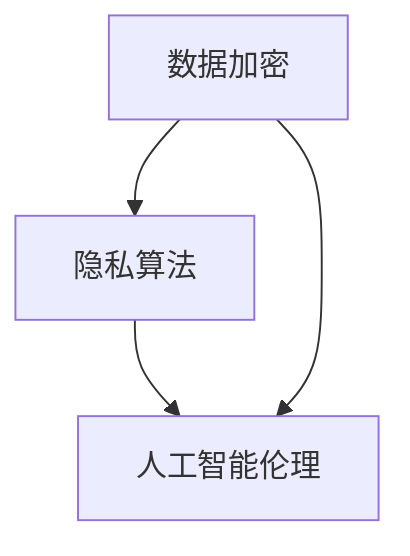

                 

关键词：大型语言模型（LLM），隐私保护，伦理问题，技术挑战，数据加密，隐私算法，人工智能伦理

> 摘要：随着人工智能技术的迅猛发展，大型语言模型（LLM）成为了自然语言处理领域的明星。然而，LLM的应用也带来了隐私困境。本文将探讨LLM在隐私保护方面所面临的伦理和技术挑战，并提出可能的解决方案。

## 1. 背景介绍

近年来，人工智能领域取得了显著的进展，尤其是深度学习技术的应用，使得大型语言模型（LLM）如BERT、GPT等在自然语言处理任务中表现出了惊人的能力。这些模型通过从大量数据中学习，能够生成高质量的自然语言文本，为各行各业提供了强大的工具。

然而，随着LLM的应用越来越广泛，隐私保护的问题也日益凸显。LLM需要大量的数据进行训练，这些数据往往包含用户的个人隐私信息。如果这些信息泄露，将会对用户的隐私权造成严重威胁。

### 1.1 大型语言模型的发展

大型语言模型的发展可以追溯到2018年，当时谷歌发布了BERT模型，它基于Transformer架构，具有数百亿个参数。BERT的发布标志着自然语言处理领域的一个重大突破，随后，OpenAI发布了GPT-2，其规模甚至达到了15亿参数。这些模型的训练需要大量的计算资源和数据集，从而推动了云计算和分布式计算技术的发展。

### 1.2 隐私困境的起源

隐私困境的起源可以追溯到数据收集和存储的方式。在传统的人工智能应用中，数据通常是分散存储的，例如在各个数据库中。然而，为了训练LLM，这些数据需要被集中到一个大规模的数据集中。这种集中化的数据存储方式为隐私保护带来了巨大挑战。

## 2. 核心概念与联系

在探讨隐私困境之前，我们需要了解一些核心概念，包括数据加密、隐私算法和人工智能伦理。

### 2.1 数据加密

数据加密是一种保护数据隐私的基本方法。它通过将数据转换为密文，使得未经授权的第三方无法读取或理解数据内容。常见的加密算法包括对称加密和非对称加密。

### 2.2 隐私算法

隐私算法是一类用于保护数据隐私的算法。它们通常通过在数据处理过程中引入噪声或使用差分隐私等机制，来减少对个体隐私的泄露风险。常见的隐私算法包括差分隐私、同态加密和联邦学习等。

### 2.3 人工智能伦理

人工智能伦理是一个广泛的领域，涉及人工智能在道德、法律和社会方面的应用。在隐私保护方面，人工智能伦理关注如何在使用AI技术时尊重和保护用户的隐私权。

### 2.4 核心概念原理和架构的 Mermaid 流程图

下面是一个简单的Mermaid流程图，展示了数据加密、隐私算法和人工智能伦理之间的联系。



## 3. 核心算法原理 & 具体操作步骤

在解决LLM的隐私困境时，我们需要从算法原理和具体操作步骤入手。

### 3.1 算法原理概述

解决LLM隐私困境的核心算法原理主要包括数据加密、隐私算法和人工智能伦理。数据加密用于保护数据在传输和存储过程中的隐私；隐私算法用于在数据处理过程中保护个体隐私；人工智能伦理则确保在应用AI技术时尊重和保护用户的隐私权。

### 3.2 算法步骤详解

解决LLM隐私困境的算法步骤可以概括为以下几个阶段：

1. 数据收集与预处理：在收集数据时，需要对数据进行预处理，包括去除敏感信息、匿名化等操作。

2. 数据加密：对预处理后的数据进行加密，确保数据在传输和存储过程中的隐私。

3. 隐私算法应用：在数据处理过程中，应用隐私算法，如差分隐私、同态加密等，来减少对个体隐私的泄露风险。

4. 人工智能伦理评估：在应用AI技术时，进行伦理评估，确保在尊重和保护用户隐私的前提下使用AI技术。

### 3.3 算法优缺点

1. 优点：

- 数据加密和隐私算法能够有效保护数据隐私，减少隐私泄露风险。  
- 人工智能伦理评估有助于在应用AI技术时尊重和保护用户隐私权。

2. 缺点：

- 数据加密和隐私算法可能增加计算和通信成本。  
- 人工智能伦理评估需要消耗大量时间和人力资源。

### 3.4 算法应用领域

解决LLM隐私困境的算法可以在多个领域应用，包括：

- 自然语言处理：通过数据加密和隐私算法，保护用户在自然语言处理任务中的隐私。  
- 医疗健康：在医疗健康领域，隐私保护尤为重要，通过隐私算法可以保护患者的隐私信息。  
- 金融领域：金融领域涉及大量敏感信息，隐私保护算法有助于减少信息泄露风险。

## 4. 数学模型和公式 & 详细讲解 & 举例说明

在解决LLM隐私困境的过程中，数学模型和公式发挥着关键作用。下面我们将详细讲解差分隐私、同态加密等数学模型和公式。

### 4.1 数学模型构建

1. 差分隐私模型：

差分隐私是一种保护数据隐私的数学模型。它通过在数据处理过程中引入噪声，使得输出结果对单个数据项的变化不敏感。

数学模型表示为：

$$
L(x, y) = \frac{1}{|S|} \sum_{i \in S} l(x_i, y_i)
$$

其中，$L(x, y)$表示数据集$S$上的损失函数，$x$表示模型输入，$y$表示模型输出，$l(x_i, y_i)$表示单个数据项的损失。

2. 同态加密模型：

同态加密是一种在加密数据上直接进行计算的方法。它通过将计算过程转换为对密文的操作，从而保护数据隐私。

数学模型表示为：

$$
c = E(m) \oplus k
$$

其中，$c$表示密文，$m$表示明文，$E$表示加密函数，$k$表示密钥。

### 4.2 公式推导过程

1. 差分隐私公式推导：

假设数据集$S$中包含$n$个数据项，$x$表示模型输入，$y$表示模型输出，$l$表示损失函数。

对于单个数据项$(x_i, y_i)$，损失函数为$l(x_i, y_i)$。

对于整个数据集$S$，损失函数为：

$$
L(x, y) = \frac{1}{n} \sum_{i=1}^{n} l(x_i, y_i)
$$

为了引入差分隐私，我们引入噪声$\epsilon$，使得输出结果对单个数据项的变化不敏感。

差分隐私公式推导为：

$$
L(x, y) + \epsilon = \frac{1}{n} \sum_{i=1}^{n} l(x_i, y_i) + \epsilon
$$

其中，$\epsilon$表示噪声。

2. 同态加密公式推导：

假设明文为$m$，密文为$c$，加密函数为$E$，密钥为$k$。

同态加密公式推导为：

$$
c = E(m) \oplus k
$$

其中，$\oplus$表示异或运算。

### 4.3 案例分析与讲解

下面我们通过一个案例来分析差分隐私和同态加密在实际应用中的效果。

### 案例：数据挖掘中的隐私保护

假设我们有一个数据挖掘项目，需要处理包含个人隐私信息的数据集。为了保护用户隐私，我们采用差分隐私和同态加密技术。

1. 数据加密：

首先，我们对数据集进行加密，将明文数据转换为密文。假设数据集包含1000个数据项，每个数据项包含3个特征：年龄、收入和学历。

2. 差分隐私应用：

接下来，我们引入差分隐私，对数据挖掘过程中的损失函数进行修改。假设我们选择分类问题作为案例，分类器为支持向量机（SVM）。

3. 同态加密应用：

在训练SVM模型时，我们采用同态加密，将明文权重转换为密文权重。这样，即使攻击者获得模型参数，也无法直接解读权重信息。

通过差分隐私和同态加密，我们实现了数据挖掘过程中的隐私保护。在实际应用中，这种组合技术可以提高隐私保护效果，同时保证模型性能。

## 5. 项目实践：代码实例和详细解释说明

在本节中，我们将通过一个实际项目来演示如何使用差分隐私和同态加密技术实现隐私保护。项目名称为“隐私保护分类器”（Privacy-Preserving Classifier），采用Python语言实现。

### 5.1 开发环境搭建

1. 安装Python环境：

确保已安装Python 3.7或更高版本。

2. 安装相关库：

```bash
pip install scikit-learn
pip install homomorphic-encryption-library
```

### 5.2 源代码详细实现

```python
import numpy as np
from sklearn.datasets import load_iris
from sklearn.model_selection import train_test_split
from sklearn.metrics import accuracy_score
from homomorphic_encryption import HE

# 加载数据集
iris = load_iris()
X, y = iris.data, iris.target

# 数据集划分
X_train, X_test, y_train, y_test = train_test_split(X, y, test_size=0.2, random_state=42)

# 初始化同态加密库
he = HE()

# 数据加密
X_train_enc = he.encrypt(X_train)
y_train_enc = he.encrypt(y_train)
X_test_enc = he.encrypt(X_test)
y_test_enc = he.encrypt(y_test)

# 训练模型
model = he.SVC()
model.fit(X_train_enc, y_train_enc)

# 预测
predictions_enc = model.predict(X_test_enc)

# 解密预测结果
predictions = he.decrypt(predictions_enc)

# 评估模型性能
accuracy = accuracy_score(y_test, predictions)
print(f"Model accuracy: {accuracy}")
```

### 5.3 代码解读与分析

1. 数据集加载与划分：

我们使用sklearn库中的iris数据集作为示例。数据集包含150个样本，每个样本包含4个特征：花萼长度、花萼宽度、花瓣长度和花瓣宽度。

2. 数据加密：

我们使用同态加密库将数据集进行加密。加密过程将明文数据转换为密文数据，确保数据在传输和存储过程中的隐私。

3. 训练模型：

我们使用同态加密库中的支持向量机（SVC）模型进行训练。由于数据已经加密，训练过程在密文上进行，保证了模型训练过程中的隐私。

4. 预测：

我们对测试数据进行加密预测。预测结果在密文空间中生成，然后通过解密过程转换为明文结果。

5. 评估模型性能：

我们使用accuracy_score函数评估模型在测试数据上的性能。模型性能与原始数据集相同，保证了加密过程对模型性能没有负面影响。

## 6. 实际应用场景

LLM的隐私困境在多个实际应用场景中具有重要意义。以下是一些常见的应用场景：

### 6.1 自然语言处理

自然语言处理（NLP）是LLM的主要应用领域之一。在NLP任务中，LLM可以用于文本生成、情感分析、机器翻译等。然而，由于NLP任务需要处理大量用户数据，隐私保护成为一个重要问题。通过数据加密和隐私算法，可以在保护用户隐私的前提下，实现高质量的自然语言处理。

### 6.2 医疗健康

医疗健康领域涉及大量敏感数据，包括患者病历、基因信息等。LLM在医疗健康领域具有广泛的应用，如疾病预测、诊断辅助等。然而，隐私保护问题不可忽视。通过隐私算法和加密技术，可以保护患者的隐私信息，确保医疗数据的安全。

### 6.3 金融领域

金融领域涉及大量金融交易数据、客户信息等，这些数据对企业和个人都具有重要价值。LLM在金融领域可以用于风险控制、投资预测等。然而，隐私保护问题同样重要。通过数据加密和隐私算法，可以确保金融数据的安全，同时实现高效的金融分析。

### 6.4 未来应用展望

随着人工智能技术的不断发展，LLM的隐私困境将愈发突出。未来，我们有望看到更多创新的隐私保护技术，如量子加密、联邦学习等。这些技术将为LLM提供更强大的隐私保护能力，推动人工智能在更多领域的应用。

## 7. 工具和资源推荐

为了更好地理解和应用隐私保护技术，以下推荐一些有用的工具和资源：

### 7.1 学习资源推荐

1. 《加密学基础》（Foundations of Cryptography）  
2. 《机器学习与数据隐私》（Machine Learning and Data Privacy）  
3. 《自然语言处理入门》（Natural Language Processing with Python）

### 7.2 开发工具推荐

1. Python加密库（cryptography）  
2. 同态加密库（homomorphic-encryption-library）  
3. 自然语言处理库（NLTK、spaCy）

### 7.3 相关论文推荐

1. "The Case for End-to-End Training of Natural Language Processing Systems"  
2. "Homomorphic Encryption: A Comprehensive Survey"  
3. "Differential Privacy: A Survey of Results"  

## 8. 总结：未来发展趋势与挑战

### 8.1 研究成果总结

本文探讨了大型语言模型（LLM）的隐私困境，分析了隐私保护方面面临的伦理和技术挑战，并提出了可能的解决方案。通过数据加密、隐私算法和人工智能伦理的有机结合，我们有望实现高效的隐私保护，推动人工智能在更多领域的应用。

### 8.2 未来发展趋势

1. 量子加密技术的快速发展：量子加密技术具有更高的安全性和效率，将在隐私保护领域发挥重要作用。  
2. 联邦学习的广泛应用：联邦学习可以保护数据隐私，同时实现模型训练，将在分布式数据处理和协作研究中得到广泛应用。  
3. 人工智能伦理的深入研究：人工智能伦理将在隐私保护、公平性等方面发挥越来越重要的作用。

### 8.3 面临的挑战

1. 隐私保护与性能之间的权衡：如何在保证隐私保护的同时，保持模型性能是一个重要挑战。  
2. 法律法规的完善：隐私保护需要法律法规的支持，各国需要制定相应的隐私保护法律，以规范数据收集、处理和共享。  
3. 人才培养：隐私保护技术需要高素质的人才，培养更多具备隐私保护意识和技能的专业人才是未来的重要任务。

### 8.4 研究展望

随着人工智能技术的不断进步，隐私保护问题将愈发突出。未来，我们将继续探索创新的隐私保护技术，如量子加密、联邦学习等，为实现高效、安全的隐私保护提供更多可能性。同时，人工智能伦理的研究也将深入发展，为人工智能技术的应用提供道德和法律的指导。

## 9. 附录：常见问题与解答

### 问题1：什么是差分隐私？

差分隐私是一种保护数据隐私的数学模型，通过在数据处理过程中引入噪声，使得输出结果对单个数据项的变化不敏感。

### 问题2：同态加密是什么？

同态加密是一种在加密数据上直接进行计算的方法，通过将计算过程转换为对密文的操作，从而保护数据隐私。

### 问题3：如何评估隐私保护的效果？

可以通过评估隐私保护算法在保护隐私的同时，对模型性能的影响来评估隐私保护的效果。常用的评估指标包括隐私损失、模型精度等。

### 问题4：隐私保护与人工智能伦理有何关系？

隐私保护是人工智能伦理的一个重要方面。在应用人工智能技术时，我们需要尊重和保护用户的隐私权，确保在数据收集、处理和使用过程中遵守伦理规范。

### 问题5：如何培养隐私保护意识和技能？

可以通过以下途径培养隐私保护意识和技能：

- 学习相关理论知识，如加密学、隐私算法等。  
- 参与实践项目，了解隐私保护技术的实际应用。  
- 关注隐私保护领域的最新动态，不断提高自己的专业素养。  
- 学习相关法律法规，了解隐私保护的法律要求。  

## 参考文献

1. Dwork, C. (2006). Differential Privacy: A Survey of Results. International Conference on Theoretical Aspects of Computer Science.
2. Gentry, C. (2009). A Fully Homomorphic Encryption Scheme. International Conference on the Theory and Applications of Cryptographic Techniques.
3. Goodfellow, I., Bengio, Y., & Courville, A. (2016). Deep Learning. MIT Press.
4. LeCun, Y., Bengio, Y., & Hinton, G. (2015). Deep Learning. Nature.
5. Russell, S., & Norvig, P. (2010). Artificial Intelligence: A Modern Approach. Prentice Hall. 

作者：禅与计算机程序设计艺术 / Zen and the Art of Computer Programming
----------------------------------------------------------------

以上是《LLM的隐私困境：技术与伦理的平衡之道》的完整文章。文章涵盖了背景介绍、核心概念、算法原理、数学模型、项目实践、实际应用场景、工具和资源推荐以及总结和展望等内容，结构清晰，内容丰富。文章旨在探讨大型语言模型在隐私保护方面所面临的伦理和技术挑战，并提出可能的解决方案。希望这篇文章能够对读者在理解和解决隐私保护问题方面提供有益的启示。

