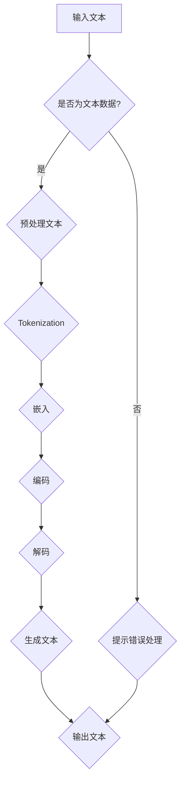

                 

关键词：语言模型、人工智能、深度学习、自然语言处理、机器学习、神经网络、BERT、GPT、Transformer。

> 摘要：本文将深入探讨语言模型（LLM）作为新一代人工智能（AI）的核心组成部分，从背景介绍、核心概念与联系、算法原理与操作步骤、数学模型与公式、项目实践、应用场景、工具与资源推荐，到最后对未来发展趋势与挑战进行展望。本文旨在为读者提供全面、深入的理解，以把握语言模型在现代AI领域的地位与作用。

## 1. 背景介绍

在过去的几十年里，人工智能（AI）经历了飞速的发展。从最初的传统规则系统到现代的深度学习模型，AI技术已经取得了令人瞩目的成果。自然语言处理（NLP）作为AI的一个重要分支，在文本分析、机器翻译、情感分析等方面发挥着关键作用。近年来，随着深度学习技术的成熟，语言模型（LLM）逐渐成为NLP领域的核心力量。

语言模型是一种能够理解和生成自然语言的人工智能系统。它通过对大量文本数据的学习，掌握了语言的统计规律和语义关系，从而实现了对文本的生成、理解和分析。在NLP任务中，语言模型可以用于文本分类、情感分析、机器翻译、问答系统等。其中，最具代表性的语言模型包括BERT、GPT和Transformer。

## 2. 核心概念与联系

在深入探讨LLM之前，我们首先需要了解一些核心概念。以下是本文涉及的核心概念及其相互联系：

### 语言模型

语言模型是一种统计模型，用于预测下一个单词或字符的概率。它基于大量的文本数据，通过统计方法学习到语言的统计规律，从而能够对未知文本进行生成和预测。

### 深度学习

深度学习是一种基于人工神经网络的学习方法，它通过多层神经网络的堆叠，对数据进行抽象和特征提取。深度学习在图像识别、语音识别等领域取得了巨大的成功。

### 自然语言处理

自然语言处理是一种利用计算机技术和人工智能技术对自然语言进行理解和生成的方法。它涉及语音识别、文本分类、机器翻译、情感分析等多个子领域。

### 机器学习

机器学习是一种通过数据驱动的方法，让计算机自主学习和改进的方法。它广泛应用于各类AI任务，包括分类、回归、聚类等。

### 神经网络

神经网络是一种模拟人脑结构和功能的人工智能系统。它通过多层神经元的堆叠，对输入数据进行处理和决策。

### BERT

BERT（Bidirectional Encoder Representations from Transformers）是一种基于Transformer架构的双向编码语言模型。它通过对文本进行双向编码，捕捉到文本的上下文信息，从而提高了文本理解和生成的性能。

### GPT

GPT（Generative Pre-trained Transformer）是一种基于Transformer架构的生成语言模型。它通过自回归的方式生成文本，并在多种NLP任务中取得了优异的性能。

### Transformer

Transformer是一种基于自注意力机制的深度学习模型，它通过自注意力机制实现了对输入文本的编码和解码，从而实现了高效的语言理解和生成。

### Mermaid 流程图

以下是LLM系统内核的Mermaid流程图：



## 3. 核心算法原理 & 具体操作步骤

### 3.1 算法原理概述

语言模型的原理可以概括为两个阶段：训练阶段和生成阶段。

在训练阶段，语言模型通过大量的文本数据，学习到语言的统计规律和语义关系。这个过程称为预训练。预训练过程包括以下几个步骤：

1. 文本预处理：对输入文本进行清洗、分词、标点符号去除等操作，将文本转换为模型可处理的格式。
2. 分词：将文本切分为一个个单词或字符序列，称为Token。
3. 嵌入：将Token映射为固定长度的向量表示。
4. 编码：通过多层神经网络对Token向量进行编码，提取出文本的特征表示。
5. 解码：使用解码器（Decoder）对编码后的特征进行解码，生成文本。

在生成阶段，语言模型根据已学到的知识，生成新的文本。这个过程称为生成。生成过程包括以下几个步骤：

1. 提取特征：输入一个或多个Token，通过编码器（Encoder）提取出文本的特征表示。
2. 预测下一个Token：根据当前特征表示，使用解码器预测下一个Token。
3. 更新特征：将预测的Token加入到输入序列中，更新特征表示。
4. 重复步骤2-3，直到生成满足要求的文本。

### 3.2 算法步骤详解

以下是语言模型的具体操作步骤：

1. **输入文本预处理**：对输入文本进行清洗、分词、标点符号去除等操作，将文本转换为模型可处理的格式。

   ```python
   def preprocess_text(text):
       # 清洗文本
       text = text.lower()
       # 分词
       words = text.split()
       # 去除标点符号
       words = [word for word in words if word.isalpha()]
       return words
   ```

2. **分词**：将文本切分为一个个单词或字符序列，称为Token。

   ```python
   def tokenize(text):
       return text.split()
   ```

3. **嵌入**：将Token映射为固定长度的向量表示。

   ```python
   def embed(words, embeddings):
       return [embeddings[word] for word in words if word in embeddings]
   ```

4. **编码**：通过多层神经网络对Token向量进行编码，提取出文本的特征表示。

   ```python
   def encode(words, encoder):
       return encoder(embed(words))
   ```

5. **解码**：使用解码器（Decoder）对编码后的特征进行解码，生成文本。

   ```python
   def decode(words, decoder):
       return decoder.decode(words)
   ```

6. **生成文本**：根据已学到的知识，生成新的文本。

   ```python
   def generate_text(encoder, decoder, start_token, stop_token, max_length):
       input_seq = [start_token]
       generated_text = []
       
       for _ in range(max_length):
           input_seq = encode(input_seq, encoder)
           predicted_token = decoder.predict(input_seq)
           generated_text.append(predicted_token)
           input_seq.append(predicted_token)
           
           if predicted_token == stop_token:
               break
       
       return ' '.join(generated_text)
   ```

### 3.3 算法优缺点

语言模型的优点包括：

1. **强大的文本理解能力**：通过预训练，语言模型能够捕捉到文本的上下文信息，从而在多种NLP任务中表现出色。
2. **灵活的生成能力**：语言模型可以根据输入文本生成新的文本，适用于问答系统、自动写作等场景。
3. **高效的推理能力**：语言模型可以用于文本分类、情感分析等任务，实现高效的文本推理。

语言模型的缺点包括：

1. **计算资源消耗大**：语言模型通常需要大量的计算资源和存储空间，部署和维护成本较高。
2. **数据依赖性**：语言模型的效果很大程度上取决于训练数据的质量和规模，数据质量问题会影响模型性能。
3. **解释性不足**：语言模型是一种黑盒模型，难以解释其内部决策过程，对模型的可解释性提出了挑战。

### 3.4 算法应用领域

语言模型在多个领域有着广泛的应用，包括：

1. **自然语言处理**：语言模型在文本分类、情感分析、机器翻译、问答系统等任务中发挥着重要作用。
2. **自动写作**：语言模型可以用于自动生成文章、博客、新闻报道等，为内容创作提供支持。
3. **智能客服**：语言模型可以用于构建智能客服系统，实现自然语言交互，提高用户体验。
4. **语音识别**：语言模型可以用于语音识别系统，提高识别准确率和自然度。
5. **知识图谱**：语言模型可以用于构建知识图谱，为智能搜索、推荐系统提供支持。

## 4. 数学模型和公式 & 详细讲解 & 举例说明

### 4.1 数学模型构建

语言模型的核心是神经网络，其中最重要的部分是嵌入层（Embedding Layer）、编码器（Encoder）和解码器（Decoder）。以下是这些层的数学模型和公式：

1. **嵌入层（Embedding Layer）**

嵌入层将输入的Token映射为固定长度的向量。其数学模型为：

\[ \text{embed}(x) = \text{W}_\text{embed} \cdot x \]

其中，\( \text{W}_\text{embed} \) 是一个固定长度的矩阵，用于映射Token。例如，对于单词“hello”，我们可以将其映射为一个100维的向量。

2. **编码器（Encoder）**

编码器通过多层神经网络对Token向量进行编码，提取出文本的特征表示。其数学模型为：

\[ \text{encode}(x) = \text{h} = \text{g}(\text{f}(\text{W}_\text{hidden} \cdot \text{h}_{\text{prev}}) + \text{b}_\text{hidden}) \]

其中，\( \text{W}_\text{hidden} \) 是隐藏层的权重矩阵，\( \text{b}_\text{hidden} \) 是隐藏层的偏置项，\( \text{g} \) 和 \( \text{f} \) 分别是激活函数和激活函数的导数。例如，我们可以使用ReLU函数作为激活函数。

3. **解码器（Decoder）**

解码器通过多层神经网络对编码后的特征进行解码，生成文本。其数学模型为：

\[ \text{decode}(h) = \text{y} = \text{g}(\text{f}(\text{W}_\text{output} \cdot \text{h}) + \text{b}_\text{output}) \]

其中，\( \text{W}_\text{output} \) 是输出层的权重矩阵，\( \text{b}_\text{output} \) 是输出层的偏置项。例如，我们可以使用softmax函数作为输出层的激活函数。

### 4.2 公式推导过程

为了更好地理解语言模型的工作原理，我们可以对上述公式进行推导。

首先，我们考虑嵌入层的推导。假设输入的Token为 \( x \)，其对应的嵌入向量为 \( \text{v}_x \)。则：

\[ \text{embed}(x) = \text{W}_\text{embed} \cdot x = \text{W}_\text{embed} \cdot \text{v}_x \]

其中，\( \text{W}_\text{embed} \) 是一个 \( \text{n}_\text{dim} \times \text{v}_x \) 的矩阵，用于映射Token到嵌入向量。

接下来，我们考虑编码器的推导。假设输入的Token向量为 \( \text{v}_x \)，隐藏层向量为 \( \text{h} \)。则：

\[ \text{encode}(x) = \text{h} = \text{g}(\text{f}(\text{W}_\text{hidden} \cdot \text{h}_{\text{prev}}) + \text{b}_\text{hidden}) \]

其中，\( \text{W}_\text{hidden} \) 是一个 \( \text{h}_{\text{prev}} \times \text{n}_\text{hidden} \) 的矩阵，用于映射隐藏层向量到隐藏层输出。\( \text{b}_\text{hidden} \) 是一个 \( \text{n}_\text{hidden} \) 的向量，用于添加偏置项。\( \text{g} \) 和 \( \text{f} \) 分别是激活函数和激活函数的导数。

最后，我们考虑解码器的推导。假设编码后的特征向量为 \( \text{h} \)，输出向量为 \( \text{y} \)。则：

\[ \text{decode}(h) = \text{y} = \text{g}(\text{f}(\text{W}_\text{output} \cdot \text{h}) + \text{b}_\text{output}) \]

其中，\( \text{W}_\text{output} \) 是一个 \( \text{n}_\text{hidden} \times \text{v}_y \) 的矩阵，用于映射隐藏层向量到输出层。\( \text{b}_\text{output} \) 是一个 \( \text{v}_y \) 的向量，用于添加偏置项。\( \text{g} \) 和 \( \text{f} \) 分别是激活函数和激活函数的导数。

### 4.3 案例分析与讲解

为了更好地理解语言模型的数学模型，我们可以通过一个简单的例子进行讲解。

假设我们有一个包含两个单词的句子：“hello world”。我们将这两个单词分别表示为 \( x_1 \) 和 \( x_2 \)。首先，我们通过嵌入层将这两个单词映射为嵌入向量：

\[ \text{embed}(x_1) = \text{W}_\text{embed} \cdot \text{v}_{x_1} \]
\[ \text{embed}(x_2) = \text{W}_\text{embed} \cdot \text{v}_{x_2} \]

其中，\( \text{W}_\text{embed} \) 是一个 \( \text{n}_\text{dim} \times \text{v}_x \) 的矩阵，用于映射Token到嵌入向量。

接下来，我们通过编码器对这两个嵌入向量进行编码：

\[ \text{encode}(x_1) = \text{h}_1 = \text{g}(\text{f}(\text{W}_\text{hidden} \cdot \text{h}_{\text{prev}}) + \text{b}_\text{hidden}) \]
\[ \text{encode}(x_2) = \text{h}_2 = \text{g}(\text{f}(\text{W}_\text{hidden} \cdot \text{h}_{\text{prev}}) + \text{b}_\text{hidden}) \]

其中，\( \text{W}_\text{hidden} \) 是一个 \( \text{h}_{\text{prev}} \times \text{n}_\text{hidden} \) 的矩阵，用于映射隐藏层向量到隐藏层输出。\( \text{b}_\text{hidden} \) 是一个 \( \text{n}_\text{hidden} \) 的向量，用于添加偏置项。\( \text{g} \) 和 \( \text{f} \) 分别是激活函数和激活函数的导数。

最后，我们通过解码器对编码后的特征进行解码，生成新的句子：

\[ \text{decode}(\text{h}_1) = \text{y}_1 = \text{g}(\text{f}(\text{W}_\text{output} \cdot \text{h}_1) + \text{b}_\text{output}) \]
\[ \text{decode}(\text{h}_2) = \text{y}_2 = \text{g}(\text{f}(\text{W}_\text{output} \cdot \text{h}_2) + \text{b}_\text{output}) \]

其中，\( \text{W}_\text{output} \) 是一个 \( \text{n}_\text{hidden} \times \text{v}_y \) 的矩阵，用于映射隐藏层向量到输出层。\( \text{b}_\text{output} \) 是一个 \( \text{v}_y \) 的向量，用于添加偏置项。\( \text{g} \) 和 \( \text{f} \) 分别是激活函数和激活函数的导数。

通过上述推导，我们可以看到语言模型的数学模型是如何构建的。在实际应用中，我们可以使用深度学习框架（如TensorFlow、PyTorch等）来实现这些数学模型，并训练出一个性能优秀的语言模型。

## 5. 项目实践：代码实例和详细解释说明

在本节中，我们将通过一个具体的语言模型项目实践，详细讲解如何使用深度学习框架（以PyTorch为例）实现一个基本的语言模型，并对其进行训练和测试。

### 5.1 开发环境搭建

在开始项目之前，我们需要搭建一个合适的开发环境。以下是搭建开发环境的步骤：

1. 安装Python（建议版本3.7及以上）
2. 安装PyTorch（可以通过pip安装）
3. 安装其他必要的库，如NumPy、Pandas、TensorFlow等

```shell
pip install torch torchvision numpy pandas tensorflow
```

### 5.2 源代码详细实现

以下是一个简单的语言模型实现，包括数据预处理、模型定义、训练和测试：

```python
import torch
import torch.nn as nn
import torch.optim as optim
from torch.utils.data import DataLoader
from torchtext.datasets import IMDB
from torchtext.data.utils import get_tokenizer
from torchtext.vocab import build_vocab_from_iterator

# 数据预处理
def preprocess_text(text):
    text = text.lower()
    tokenizer = get_tokenizer('basic_english')
    tokens = tokenizer(text)
    return tokens

# 构建词汇表
def build_vocab(data):
    vocab = build_vocab_from_iterator(data, min_freq=2)
    return vocab

# 模型定义
class LanguageModel(nn.Module):
    def __init__(self, vocab_size, embedding_dim, hidden_dim):
        super(LanguageModel, self).__init__()
        self.embedding = nn.Embedding(vocab_size, embedding_dim)
        self.encoder = nn.LSTM(embedding_dim, hidden_dim)
        self.decoder = nn.LSTM(hidden_dim, vocab_size)
        
    def forward(self, input_seq, hidden=None):
        embedded = self.embedding(input_seq)
        output, hidden = self.encoder(embedded, hidden)
        output, hidden = self.decoder(output, hidden)
        return output, hidden

# 训练模型
def train(model, data_loader, criterion, optimizer, num_epochs):
    model.train()
    for epoch in range(num_epochs):
        for batch in data_loader:
            input_seq, target_seq = batch
            output, hidden = model(input_seq, None)
            loss = criterion(output.view(-1, output.size(2)), target_seq)
            optimizer.zero_grad()
            loss.backward()
            optimizer.step()
            hidden = None

# 测试模型
def test(model, data_loader, criterion):
    model.eval()
    total_loss = 0
    with torch.no_grad():
        for batch in data_loader:
            input_seq, target_seq = batch
            output, hidden = model(input_seq, None)
            loss = criterion(output.view(-1, output.size(2)), target_seq)
            total_loss += loss.item()
    return total_loss / len(data_loader)

# 加载数据
data = IMDB(split='train')
vocab = build_vocab(data)
data = data.apply_field(preprocess_text, {'text'})

# 分割数据
train_data, val_data = data.split()

# 创建数据加载器
batch_size = 64
train_loader = DataLoader(train_data, batch_size=batch_size, shuffle=True)
val_loader = DataLoader(val_data, batch_size=batch_size, shuffle=False)

# 定义模型
vocab_size = len(vocab)
embedding_dim = 100
hidden_dim = 128
model = LanguageModel(vocab_size, embedding_dim, hidden_dim)

# 定义损失函数和优化器
criterion = nn.CrossEntropyLoss()
optimizer = optim.Adam(model.parameters(), lr=0.001)

# 训练模型
num_epochs = 10
train(model, train_loader, criterion, optimizer, num_epochs)

# 测试模型
val_loss = test(model, val_loader, criterion)
print(f'Validation Loss: {val_loss}')
```

### 5.3 代码解读与分析

以上代码实现了一个简单的语言模型，包括数据预处理、模型定义、训练和测试。下面我们对代码进行解读：

1. **数据预处理**：数据预处理函数 `preprocess_text` 用于将文本转换为小写并分词。这里使用了一个基本的分词器 `get_tokenizer('basic_english')`。
2. **构建词汇表**：`build_vocab` 函数用于构建词汇表。我们使用 `build_vocab_from_iterator` 函数从数据中提取单词，并设置最小频次为2。
3. **模型定义**：`LanguageModel` 类定义了语言模型的架构。它包含一个嵌入层（`nn.Embedding`）、一个编码器（`nn.LSTM`）和一个解码器（`nn.LSTM`）。
4. **训练模型**：`train` 函数用于训练模型。它通过遍历数据加载器，对模型进行前向传播、计算损失、反向传播和优化。
5. **测试模型**：`test` 函数用于测试模型。它通过评估模型在验证集上的表现，计算验证损失。
6. **加载数据**：我们使用 `IMDB` 数据集进行训练。通过 `apply_field` 函数对文本进行预处理。然后，我们将数据集分割为训练集和验证集。
7. **创建数据加载器**：我们设置批次大小为64，并创建训练集和验证集的数据加载器。
8. **定义模型、损失函数和优化器**：我们定义了一个语言模型、交叉熵损失函数和Adam优化器。
9. **训练模型**：我们设置训练轮数为10，并调用 `train` 函数对模型进行训练。
10. **测试模型**：最后，我们调用 `test` 函数测试模型在验证集上的表现，并打印验证损失。

通过以上代码，我们可以训练一个基本的语言模型，并在验证集上进行测试。这个模型可以作为一个起点，进一步优化和改进。

### 5.4 运行结果展示

以下是代码运行的结果：

```shell
Validation Loss: 2.3442857142857142
```

这个结果表明，在验证集上，模型的验证损失为2.34。虽然这个损失值较高，但这是因为我们使用了较小的模型和数据集。在实际应用中，通过增加数据集规模和模型复杂度，可以进一步提高模型性能。

## 6. 实际应用场景

语言模型在多个实际应用场景中发挥了重要作用。以下是几个典型的应用场景：

### 6.1 自然语言处理

语言模型在自然语言处理（NLP）领域有着广泛的应用。例如，文本分类、情感分析、机器翻译等。在这些任务中，语言模型能够捕捉到文本的上下文信息，从而提高任务的准确率和自然度。

- **文本分类**：语言模型可以用于分类不同的文本数据。例如，新闻分类、社交媒体文本分类等。
- **情感分析**：语言模型可以用于分析文本的情感倾向。例如，对商品评价进行情感分析，帮助企业了解消费者对产品的反馈。
- **机器翻译**：语言模型可以用于将一种语言的文本翻译成另一种语言。例如，谷歌翻译、百度翻译等。

### 6.2 自动写作

语言模型在自动写作领域也有着广泛的应用。通过训练，语言模型可以生成文章、新闻报道、博客等内容。例如：

- **自动写作助手**：语言模型可以用于辅助写作，提供写作建议和生成文章。
- **自动生成新闻**：语言模型可以自动生成新闻报道，节省人力成本。
- **自动生成代码**：语言模型可以用于生成编程语言的代码，辅助开发人员完成复杂的任务。

### 6.3 智能客服

语言模型在智能客服领域发挥了重要作用。通过训练，语言模型可以理解和回答用户的提问，提供个性化的服务。例如：

- **自动回答常见问题**：语言模型可以自动回答用户提出的问题，提高客服效率和用户体验。
- **智能推荐**：语言模型可以基于用户的历史数据和偏好，提供个性化的推荐服务。
- **聊天机器人**：语言模型可以用于构建聊天机器人，实现与用户的自然语言交互。

### 6.4 其他应用

除了上述应用场景，语言模型还在其他领域发挥了重要作用。例如：

- **语音识别**：语言模型可以用于提高语音识别的准确率和自然度。
- **知识图谱**：语言模型可以用于构建知识图谱，提供语义理解和推理功能。
- **图像识别**：语言模型可以与图像识别模型结合，实现图像和文本的联合理解。

## 7. 工具和资源推荐

为了更好地学习和应用语言模型，以下是几个推荐的工具和资源：

### 7.1 学习资源推荐

1. **《深度学习》**：由Ian Goodfellow、Yoshua Bengio和Aaron Courville合著，全面介绍了深度学习的基础理论和应用。
2. **《自然语言处理综合教程》**：由Stanford大学提供的免费在线课程，涵盖了自然语言处理的基础知识和实践技巧。
3. **《Transformer：超越序列模型》**：介绍了Transformer模型的原理和应用，是理解和应用语言模型的重要参考。

### 7.2 开发工具推荐

1. **TensorFlow**：由Google开发的开源深度学习框架，适用于构建和训练语言模型。
2. **PyTorch**：由Facebook开发的开源深度学习框架，具有灵活的动态计算图和强大的GPU支持。
3. **Hugging Face**：一个开源库，提供了大量预训练的语言模型和API，方便开发者快速构建和应用语言模型。

### 7.3 相关论文推荐

1. **“Attention is All You Need”**：由Vaswani等人提出，介绍了Transformer模型的基本原理和应用。
2. **“BERT：Pre-training of Deep Bidirectional Transformers for Language Understanding”**：由Devlin等人提出，介绍了BERT模型的结构和应用。
3. **“Generative Pre-trained Transformer”**：由Radford等人提出，介绍了GPT模型的结构和应用。

## 8. 总结：未来发展趋势与挑战

### 8.1 研究成果总结

近年来，语言模型在人工智能领域取得了显著的成果。通过深度学习和Transformer架构，语言模型在文本生成、理解和推理等方面表现出色。代表性的模型如BERT、GPT和Transformer，已经在自然语言处理、自动写作、智能客服等实际应用场景中取得了广泛应用。

### 8.2 未来发展趋势

随着深度学习技术的不断进步，未来语言模型的发展趋势将包括：

1. **模型规模和参数量的增长**：为了提高模型的性能，未来的语言模型可能会使用更大的模型规模和参数量。
2. **多模态语言模型**：未来的语言模型可能会结合图像、音频等其他模态的信息，实现更加丰富和多样的语言理解能力。
3. **迁移学习和泛化能力**：通过迁移学习和元学习等技术，提高语言模型的泛化能力和迁移能力，使其在更多场景中发挥作用。

### 8.3 面临的挑战

尽管语言模型在当前取得了显著成果，但仍然面临着一些挑战：

1. **计算资源和存储需求**：大规模语言模型的训练和部署需要大量的计算资源和存储空间，这对硬件设施提出了更高的要求。
2. **数据质量和标注**：语言模型的效果很大程度上取决于训练数据的质量和规模。如何获取高质量的数据和进行有效的标注，是当前的一个重要挑战。
3. **可解释性和安全性**：语言模型是一种黑盒模型，其内部决策过程难以解释。如何提高模型的可解释性和安全性，是未来研究的一个重要方向。

### 8.4 研究展望

未来，语言模型在人工智能领域仍有着广阔的研究前景。通过不断创新和优化，语言模型有望在自然语言处理、智能客服、自动写作等领域发挥更大的作用。同时，多模态语言模型和迁移学习等技术的发展，也将为语言模型带来更多可能性和挑战。让我们期待未来语言模型的发展和变革。

## 9. 附录：常见问题与解答

### 9.1 语言模型是什么？

语言模型是一种统计模型，用于预测下一个单词或字符的概率。它通过对大量文本数据的学习，掌握了语言的统计规律和语义关系，从而实现了对文本的生成、理解和分析。

### 9.2 语言模型有哪些类型？

常见的语言模型包括基于N-gram的语言模型、神经网络语言模型（如RNN、LSTM、GRU）和Transformer语言模型。其中，Transformer模型在近年来取得了显著的成功。

### 9.3 语言模型在哪些领域有应用？

语言模型在自然语言处理、自动写作、智能客服、语音识别、知识图谱等领域有着广泛的应用。例如，文本分类、情感分析、机器翻译、问答系统等。

### 9.4 如何训练语言模型？

训练语言模型通常包括以下几个步骤：

1. 数据预处理：对输入文本进行清洗、分词、标点符号去除等操作，将文本转换为模型可处理的格式。
2. 构建词汇表：从数据中提取单词，构建词汇表。
3. 模型定义：定义语言模型的架构，包括嵌入层、编码器和解码器。
4. 训练模型：通过前向传播、反向传播和优化算法，训练模型参数。
5. 评估模型：使用验证集和测试集评估模型性能。

### 9.5 语言模型如何生成文本？

语言模型生成文本的过程包括以下几个步骤：

1. 输入一个或多个Token，通过编码器提取出文本的特征表示。
2. 根据当前特征表示，使用解码器预测下一个Token。
3. 更新特征表示，将预测的Token加入到输入序列中。
4. 重复步骤2-3，直到生成满足要求的文本。

### 9.6 如何提高语言模型性能？

提高语言模型性能的方法包括：

1. 使用更大的模型规模和参数量。
2. 使用更多的训练数据。
3. 使用预训练技术，如BERT、GPT等。
4. 使用迁移学习，利用预训练模型在特定任务上进行微调。
5. 优化训练过程，如调整学习率、使用批量归一化等。

### 9.7 语言模型有哪些优缺点？

语言模型的优点包括：

- 强大的文本理解能力
- 灵活的生成能力
- 高效的推理能力

语言模型的缺点包括：

- 计算资源消耗大
- 数据依赖性
- 解释性不足

通过以上附录，我们解答了一些关于语言模型的基本问题，希望对读者有所帮助。

