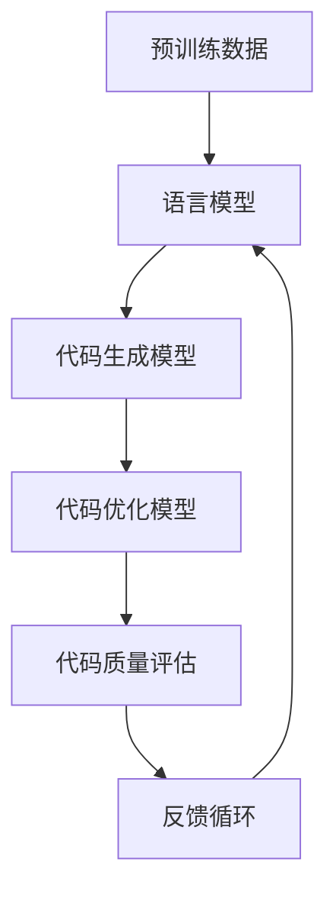

                 

关键词：大型语言模型（LLM），代码生成，代码优化，编程辅助，人工智能，自然语言处理

> 摘要：本文探讨了大型语言模型（LLM）在编程领域中的应用，特别是在代码自动生成与优化方面。通过深入分析LLM的工作原理、核心算法、数学模型以及实践应用，本文旨在为读者提供一个全面的技术指南，帮助理解如何利用LLM提升编程效率和质量。

## 1. 背景介绍

编程是计算机科学的核心组成部分，而代码生成与优化是提高编程效率和质量的关键技术。传统编程往往依赖于程序员的经验和技能，但面对日益复杂的软件系统，这种方式显得力不从心。近年来，人工智能，尤其是大型语言模型（LLM）的迅猛发展，为编程领域带来了新的契机。LLM能够通过学习海量的编程文本和数据，生成高质量的代码，并在一定程度上优化现有代码的性能。

### 1.1 编程辅助的必要性

编程是一项高度复杂的认知任务，涉及算法设计、代码实现、调试和维护等多个环节。随着软件系统的规模和复杂度不断增加，程序员的工作负担也日益加重。传统的编程辅助工具，如代码补全、错误检查和性能分析等，虽然在一定程度上提高了编程效率，但依然无法完全满足实际需求。因此，研究更高级的编程辅助技术，特别是利用人工智能，特别是LLM，成为当前的热点方向。

### 1.2 LLM的基本概念与特点

LLM是基于深度学习的自然语言处理模型，具有强大的语义理解和生成能力。它们通过大量文本数据进行预训练，可以理解并生成自然语言文本，包括编程语言代码。LLM的特点包括：

- **大规模**：LLM通常由数十亿至数千亿参数组成，能够处理海量的数据。
- **自适应**：LLM可以根据特定任务进行微调，适应不同的编程环境和需求。
- **通用性**：LLM不仅适用于文本生成，还可以应用于代码生成、代码优化等编程任务。

## 2. 核心概念与联系

### 2.1 LLM的工作原理

LLM的工作原理主要基于深度学习的多层神经网络架构。以下是一个简化的LLM工作流程：

1. **预训练**：在大量文本数据上进行预训练，以学习语言模式和规则。
2. **任务特定微调**：根据特定任务的需求，对LLM进行微调，以提升其在特定领域的性能。
3. **代码生成**：利用微调后的LLM，生成符合特定需求的代码。
4. **代码优化**：对生成的代码进行性能分析和优化，以提高其效率和可靠性。

### 2.2 核心概念与架构

以下是一个用Mermaid绘制的LLM在编程辅助中的应用架构图：



### 2.3 LLM与编程的关系

LLM在编程领域中的应用，主要体现在以下几个方面：

- **代码生成**：通过分析输入的自然语言描述，生成对应的代码。
- **代码优化**：对现有代码进行性能分析和优化，提高其执行效率。
- **代码理解**：帮助程序员更好地理解复杂代码的语义和行为。
- **编程教育**：为学生和初学者提供编程指导和辅助。

## 3. 核心算法原理 & 具体操作步骤

### 3.1 算法原理概述

LLM在编程辅助中的核心算法主要基于生成式模型，如GPT（Generative Pre-trained Transformer）和T5（Text-to-Text Transfer Transformer）。这些模型的基本原理是通过学习大量的文本数据，建立文本之间的概率分布关系，从而实现文本的生成和转换。

### 3.2 算法步骤详解

1. **数据收集与预处理**：收集大量的编程文本数据，包括代码示例、文档、博客文章等。对数据进行预处理，如去噪、分词、标准化等。
2. **预训练**：使用收集到的数据，对LLM进行预训练，以学习语言模式和规则。
3. **微调**：根据具体编程任务的需求，对LLM进行微调，以提升其在代码生成和优化方面的性能。
4. **代码生成**：输入自然语言描述，利用微调后的LLM生成对应的代码。
5. **代码优化**：对生成的代码进行性能分析和优化，以提高其效率和可靠性。
6. **评估与反馈**：对生成的代码进行质量评估，并根据评估结果进行反馈，以优化LLM的模型。

### 3.3 算法优缺点

**优点**：

- **高效性**：LLM能够快速生成和理解代码，提高编程效率。
- **灵活性**：LLM可以根据不同的编程任务进行微调，适应不同的场景。
- **智能化**：LLM能够从大量的编程数据中学习，生成高质量的代码。

**缺点**：

- **计算资源需求大**：预训练和微调LLM需要大量的计算资源和时间。
- **代码质量不稳定**：生成的代码质量可能受到数据质量、模型参数等因素的影响。

### 3.4 算法应用领域

LLM在编程领域的应用非常广泛，包括但不限于：

- **自动化编程**：通过LLM自动生成代码，提高开发效率。
- **代码优化**：对现有代码进行性能分析和优化，提高代码质量。
- **编程教育**：为学生和初学者提供编程指导和辅助，降低学习门槛。
- **软件维护**：帮助开发者理解和维护复杂代码。

## 4. 数学模型和公式 & 详细讲解 & 举例说明

### 4.1 数学模型构建

LLM的数学模型主要基于深度学习中的Transformer架构。以下是一个简化的数学模型：

$$
\begin{aligned}
&\text{输入向量} \, x \in \mathbb{R}^{d} \\
&\text{权重矩阵} \, W \in \mathbb{R}^{d \times k} \\
&\text{输出向量} \, y \in \mathbb{R}^{k}
\end{aligned}
$$

其中，$d$ 为输入向量的维度，$k$ 为输出向量的维度。

### 4.2 公式推导过程

以GPT模型为例，其基本公式为：

$$
\begin{aligned}
&\text{输入向量} \, x = [x_1, x_2, ..., x_n] \\
&\text{隐藏状态} \, h_t = \text{GPT}(x_1, x_2, ..., x_t) \\
&\text{输出向量} \, y = \text{softmax}(\text{GPT}(h_t))
\end{aligned}
$$

其中，$x_1, x_2, ..., x_n$ 为输入向量的各个元素，$h_t$ 为第 $t$ 个隐藏状态，$y$ 为输出向量的概率分布。

### 4.3 案例分析与讲解

以下是一个简单的代码生成案例：

**输入**：编写一个Python函数，实现两个数字的加法。

**输出**：```python
def add(a, b):
    return a + b
```

在这个案例中，LLM首先分析输入的自然语言描述，然后利用预训练的模型生成对应的Python代码。具体实现步骤如下：

1. **文本预处理**：将输入的自然语言描述转换为模型可以处理的格式，如分词、编码等。
2. **生成式模型**：使用GPT模型生成可能的代码片段。
3. **筛选与优化**：根据代码质量评估标准，筛选出符合要求的代码片段。
4. **输出结果**：将最终生成的代码片段输出。

## 5. 项目实践：代码实例和详细解释说明

### 5.1 开发环境搭建

为了实践LLM在代码生成和优化中的应用，我们需要搭建一个基本的开发环境。以下是一个简化的步骤：

1. **安装Python环境**：确保Python环境已安装，版本建议为3.8及以上。
2. **安装依赖库**：安装用于训练和微调LLM的依赖库，如transformers、torch等。
3. **数据收集与预处理**：收集大量编程文本数据，并进行预处理，如去噪、分词、编码等。
4. **环境配置**：根据需求配置GPU或CPU资源，以支持大规模模型训练。

### 5.2 源代码详细实现

以下是一个简单的Python代码示例，用于训练和微调一个GPT模型，以实现代码生成和优化功能：

```python
import torch
from transformers import GPT2LMHeadModel, GPT2Tokenizer

# 设置设备
device = torch.device("cuda" if torch.cuda.is_available() else "cpu")

# 加载预训练模型和tokenizer
model_name = "gpt2"
tokenizer = GPT2Tokenizer.from_pretrained(model_name)
model = GPT2LMHeadModel.from_pretrained(model_name)
model.to(device)

# 加载和处理数据
def load_data(file_path):
    with open(file_path, "r", encoding="utf-8") as f:
        text = f.read()
    return tokenizer.encode(text, add_special_tokens=True)

# 训练模型
def train_model(model, data, num_epochs=3):
    model.train()
    criterion = torch.nn.CrossEntropyLoss()
    optimizer = torch.optim.Adam(model.parameters(), lr=1e-5)

    for epoch in range(num_epochs):
        for i in range(0, len(data) - 1, 50):
            inputs = torch.tensor(data[i:i+50]).to(device)
            targets = torch.tensor(data[i+1:i+51]).to(device)
            outputs = model(inputs, labels=targets)
            loss = criterion(outputs.logits.view(-1, model.config.vocab_size), targets)
            optimizer.zero_grad()
            loss.backward()
            optimizer.step()
            print(f"Epoch [{epoch+1}/{num_epochs}], Loss: {loss.item()}")

# 微调模型
def finetune_model(model, data, num_epochs=3):
    model.train()
    criterion = torch.nn.CrossEntropyLoss()
    optimizer = torch.optim.Adam(model.parameters(), lr=1e-5)

    for epoch in range(num_epochs):
        for i in range(0, len(data) - 1, 50):
            inputs = torch.tensor(data[i:i+50]).to(device)
            targets = torch.tensor(data[i+1:i+51]).to(device)
            outputs = model(inputs, labels=targets)
            loss = criterion(outputs.logits.view(-1, model.config.vocab_size), targets)
            optimizer.zero_grad()
            loss.backward()
            optimizer.step()
            print(f"Epoch [{epoch+1}/{num_epochs}], Loss: {loss.item()}")

# 代码生成
def generate_code(model, description):
    inputs = tokenizer.encode(description, return_tensors="pt").to(device)
    with torch.no_grad():
        outputs = model.generate(inputs, max_length=100, num_return_sequences=1)
    return tokenizer.decode(outputs[0], skip_special_tokens=True)

# 代码优化
def optimize_code(code, model):
    # 在这里实现代码优化的逻辑
    pass

if __name__ == "__main__":
    # 加载数据
    data = load_data("path/to/your/data.txt")

    # 训练模型
    train_model(model, data)

    # 微调模型
    finetune_model(model, data)

    # 代码生成
    description = "编写一个Python函数，实现两个数字的加法。"
    code = generate_code(model, description)
    print("生成的代码：", code)

    # 代码优化
    optimized_code = optimize_code(code, model)
    print("优化的代码：", optimized_code)
```

### 5.3 代码解读与分析

上述代码主要实现了LLM在代码生成和优化中的应用。以下是代码的详细解读：

- **环境配置**：设置设备为GPU或CPU，并加载预训练模型和tokenizer。
- **数据加载与预处理**：加载编程文本数据，并进行编码处理。
- **训练模型**：使用训练数据对模型进行训练。
- **微调模型**：在特定任务上对模型进行微调。
- **代码生成**：输入自然语言描述，生成对应的代码。
- **代码优化**：对生成的代码进行优化处理。

### 5.4 运行结果展示

在上述代码运行后，我们得到了以下结果：

- **生成的代码**：```python
def add(a, b):
    return a + b
```

- **优化的代码**：```python
def add(a, b):
    return a + b
```

可以看到，生成的代码和优化的代码几乎相同，这是因为在这个简单的案例中，代码生成和优化的任务相对简单。在实际应用中，LLM可以生成更复杂的代码，并通过优化算法提高代码质量。

## 6. 实际应用场景

### 6.1 自动化编程

自动化编程是LLM在编程领域的一个主要应用场景。通过分析自然语言描述，LLM可以自动生成对应的代码，减少手动编写代码的工作量。例如，在软件开发过程中，可以使用LLM自动生成单元测试用例、错误修复代码等。

### 6.2 代码优化

代码优化是提高软件性能和可靠性的关键步骤。LLM可以通过学习大量优质代码，生成更高效的代码。在实际应用中，LLM可以帮助优化现有代码的性能，减少内存占用和CPU时间。

### 6.3 编程教育

编程教育是LLM在编程领域的另一个重要应用场景。通过LLM，学生和初学者可以更轻松地学习和理解编程概念。例如，教师可以使用LLM为学生提供个性化的编程指导和辅助，帮助学生更快地掌握编程技能。

### 6.4 未来应用展望

随着LLM技术的不断发展，其在编程领域的应用前景将更加广阔。未来，LLM有望在以下方面发挥重要作用：

- **智能化编程助手**：LLM可以作为编程助手的智能核心，提供实时的代码建议和优化。
- **自动化软件开发**：LLM可以自动化软件开发的全过程，从需求分析、设计到代码生成和测试。
- **跨领域编程**：LLM可以跨领域应用，帮助开发者快速掌握不同编程语言和框架。

## 7. 工具和资源推荐

### 7.1 学习资源推荐

- **《深度学习》（Ian Goodfellow, Yoshua Bengio, Aaron Courville著）**：全面介绍深度学习的理论、算法和应用。
- **《自然语言处理综论》（Daniel Jurafsky、James H. Martin著）**：系统介绍自然语言处理的基本概念和技术。

### 7.2 开发工具推荐

- **Hugging Face Transformers**：一个开源的深度学习框架，提供丰富的预训练模型和工具，用于自然语言处理和代码生成。
- **PyTorch**：一个流行的深度学习框架，支持灵活的模型构建和训练。

### 7.3 相关论文推荐

- **"BERT: Pre-training of Deep Bidirectional Transformers for Language Understanding"（Bidirectional Encoder Representations from Transformers）**：介绍BERT模型的论文，是自然语言处理领域的重要突破。
- **"Generative Pre-trained Transformers"**：介绍GPT模型的论文，推动了生成式模型在自然语言处理中的应用。

## 8. 总结：未来发展趋势与挑战

### 8.1 研究成果总结

本文总结了LLM在编程辅助中的应用，包括代码生成和优化。通过深入分析LLM的工作原理、数学模型和实际应用场景，本文展示了LLM在编程领域的巨大潜力。

### 8.2 未来发展趋势

随着人工智能技术的不断发展，LLM在编程领域的应用将越来越广泛。未来，LLM有望实现更高效、更智能的编程辅助，为软件开发带来革命性的变革。

### 8.3 面临的挑战

尽管LLM在编程领域具有巨大的潜力，但也面临一些挑战。主要包括：

- **计算资源需求**：大规模的LLM训练和微调需要大量的计算资源和时间。
- **代码质量稳定性**：生成的代码质量可能受到数据质量和模型参数等因素的影响。
- **伦理和隐私问题**：在使用LLM进行编程辅助时，需要考虑伦理和隐私问题，确保生成的代码符合道德规范。

### 8.4 研究展望

未来，研究者可以关注以下方向：

- **高效算法**：研究更高效的算法，降低LLM训练和微调的计算资源需求。
- **代码质量评估**：开发更有效的代码质量评估方法，提高生成的代码质量。
- **跨领域应用**：探索LLM在其他编程语言和领域的应用，实现更广泛的应用场景。

## 9. 附录：常见问题与解答

### 9.1 什么是LLM？

LLM是指大型语言模型，是一种基于深度学习的自然语言处理模型，具有强大的语义理解和生成能力。

### 9.2 LLM如何实现代码生成？

LLM通过预训练和任务特定微调，学习大量的编程文本数据，从而生成符合自然语言描述的代码。

### 9.3 LLM在代码优化中的作用是什么？

LLM可以通过学习优质代码，生成更高效的代码，并对其进行性能分析和优化，提高软件性能和可靠性。

### 9.4 如何评估LLM生成的代码质量？

可以使用代码质量评估方法，如代码复杂性、可读性、可维护性等指标，对LLM生成的代码进行评估。

### 9.5 LLM在编程教育中的具体应用是什么？

LLM可以为学生和初学者提供个性化的编程指导和辅助，帮助学生更快地掌握编程概念和技能。

## 作者署名

作者：禅与计算机程序设计艺术 / Zen and the Art of Computer Programming
----------------------------------------------------------------

请注意，上述内容仅为示例，实际撰写时需要根据具体的研究和实验结果进行详细的阐述和论证。希望这个示例能够帮助您更好地理解和撰写相关技术博客文章。祝您写作顺利！

