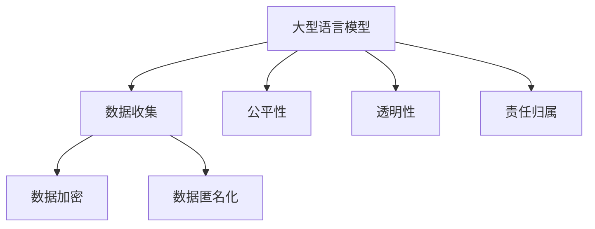

                 

关键词：自然语言处理，机器学习，大型语言模型，隐私保护，伦理问题，安全挑战，应对策略

> 摘要：本文探讨了大型语言模型（LLM）在自然语言处理领域的重要作用，以及其在隐私保护和伦理方面所面临的挑战。通过分析LLM的技术原理和应用场景，本文提出了一系列应对策略，旨在提高AI系统的安全性和伦理合规性。

## 1. 背景介绍

近年来，大型语言模型（LLM）如GPT、BERT等在自然语言处理（NLP）领域取得了显著的进展。这些模型通过深度学习技术，对海量文本数据进行训练，从而具备了强大的语言理解和生成能力。LLM的应用场景广泛，包括智能客服、内容生成、语言翻译等，极大地提升了人机交互的效率和体验。

然而，随着LLM的广泛应用，隐私保护和伦理问题也逐渐显现。一方面，LLM的训练和推理过程需要大量个人数据，这些数据可能包含敏感信息，如医疗记录、财务信息等。如果不当处理，可能导致个人隐私泄露。另一方面，LLM的应用场景多样，可能涉及用户伦理观念和价值观的冲突，如虚假信息传播、歧视性内容生成等。因此，如何在确保技术进步的同时，保障用户隐私和伦理合规性，成为了一个亟待解决的问题。

## 2. 核心概念与联系

为了深入探讨LLM隐私伦理问题，我们首先需要理解几个核心概念：

### 2.1 大型语言模型（LLM）

LLM是一种基于深度学习的自然语言处理模型，通过训练大规模的神经网络，使其具备理解和生成自然语言的能力。LLM的训练数据通常来自于互联网上的文本资源，包括新闻、社交媒体、论坛等。

### 2.2 隐私保护

隐私保护是指保护个人数据不被未经授权的访问、使用和泄露。在LLM应用中，隐私保护主要涉及以下方面：

- **数据收集**：在收集数据时，应确保数据最小化和目的明确。
- **数据加密**：对敏感数据进行加密存储，防止数据泄露。
- **数据匿名化**：通过数据脱敏技术，将敏感信息进行匿名化处理，以保护个人隐私。

### 2.3 伦理问题

伦理问题涉及人工智能应用对社会和个体的影响，包括但不限于以下方面：

- **公平性**：确保AI系统在处理数据时，不会对特定群体产生歧视。
- **透明性**：确保AI系统的决策过程和结果可以解释和理解。
- **责任归属**：明确AI系统的责任归属，确保在出现问题时，可以追溯和追究责任。

为了更好地理解这些概念之间的关系，我们使用Mermaid流程图进行说明：



## 3. 核心算法原理 & 具体操作步骤

### 3.1 算法原理概述

LLM的核心算法基于深度神经网络，主要包括以下几个步骤：

- **词嵌入**：将自然语言中的单词映射为向量表示。
- **多层神经网络**：通过多层神经网络对词向量进行编码和解码，实现语言理解和生成。
- **注意力机制**：在解码过程中，利用注意力机制关注重要信息，提高生成文本的质量。

### 3.2 算法步骤详解

1. **数据预处理**：对原始文本数据进行清洗、分词和词性标注等预处理操作，将文本转换为词向量。
2. **模型训练**：使用预处理的文本数据，通过反向传播算法训练多层神经网络，优化模型参数。
3. **模型推理**：在给定输入文本时，通过解码过程生成对应的输出文本。

### 3.3 算法优缺点

#### 优点：

- **强大的语言理解能力**：LLM通过深度学习技术，具备强大的语言理解和生成能力，可以生成高质量的自然语言文本。
- **广泛的应用场景**：LLM可以应用于智能客服、内容生成、语言翻译等多个领域，具有很高的实用性。

#### 缺点：

- **隐私保护挑战**：LLM在训练和推理过程中需要大量个人数据，可能导致隐私泄露。
- **伦理问题**：LLM的应用可能涉及伦理问题，如虚假信息传播、歧视性内容生成等。

### 3.4 算法应用领域

LLM在自然语言处理领域具有广泛的应用：

- **智能客服**：利用LLM生成自动化回复，提高客服效率和用户体验。
- **内容生成**：通过LLM生成新闻文章、广告文案等，降低内容创作成本。
- **语言翻译**：利用LLM实现高质量的自然语言翻译，提高翻译准确性和流畅性。

## 4. 数学模型和公式 & 详细讲解 & 举例说明

### 4.1 数学模型构建

LLM的数学模型主要包括词嵌入、多层神经网络和注意力机制。以下为各部分的公式表示：

#### 词嵌入：

$$
\text{Embedding}(x) = \text{W}_e \cdot x
$$

其中，$x$表示词的索引，$\text{W}_e$表示词嵌入权重矩阵。

#### 多层神经网络：

$$
\text{NeuralNetwork}(h) = \text{激活函数}(\text{W}_h \cdot h + \text{b}_h)
$$

其中，$h$表示神经网络隐藏层的状态，$\text{W}_h$表示权重矩阵，$\text{b}_h$表示偏置。

#### 注意力机制：

$$
\text{Attention}(h_1, h_2) = \text{softmax}(\text{W}_a \cdot h_1 \cdot h_2)
$$

其中，$h_1$和$h_2$表示两个隐藏层状态，$\text{W}_a$表示注意力权重矩阵。

### 4.2 公式推导过程

LLM的训练过程主要包括前向传播和反向传播。以下为各部分的推导过程：

#### 前向传播：

$$
\text{输出} = \text{激活函数}(\text{W}_o \cdot \text{NeuralNetwork}(\text{Attention}(h_1, h_2)))
$$

其中，$\text{W}_o$表示输出层权重。

#### 反向传播：

$$
\frac{\partial L}{\partial \text{W}_o} = \text{激活函数}^{-1}(\text{输出}) \cdot \frac{\partial L}{\partial \text{输出}}
$$

$$
\frac{\partial L}{\partial \text{NeuralNetwork}} = \text{激活函数}^{-1}(\text{NeuralNetwork}) \cdot \frac{\partial L}{\partial \text{输出}}
$$

$$
\frac{\partial L}{\partial \text{Attention}} = \frac{\partial L}{\partial \text{NeuralNetwork}} \cdot \frac{\partial \text{NeuralNetwork}}{\partial \text{Attention}} = \text{激活函数}^{-1}(\text{NeuralNetwork}) \cdot \frac{\partial \text{NeuralNetwork}}{\partial \text{Attention}}
$$

### 4.3 案例分析与讲解

以下为一个简单的LLM应用案例：利用GPT模型生成一篇新闻报道。

1. **数据预处理**：从互联网上收集一篇新闻报道，进行清洗、分词和词性标注。
2. **模型训练**：使用训练集数据训练GPT模型，优化模型参数。
3. **模型推理**：在给定一个新闻标题时，利用GPT模型生成一篇对应的新闻报道。

## 5. 项目实践：代码实例和详细解释说明

### 5.1 开发环境搭建

在本项目中，我们使用Python作为编程语言，GPT模型作为语言生成模型。首先，我们需要安装以下依赖：

```python
pip install transformers
```

### 5.2 源代码详细实现

以下为项目的主要代码实现：

```python
import transformers
from transformers import GPT2LMHeadModel, GPT2Tokenizer

# 1. 数据预处理
def preprocess_data(text):
    tokenizer = GPT2Tokenizer.from_pretrained("gpt2")
    return tokenizer.encode(text, add_special_tokens=True)

# 2. 模型训练
def train_model(train_data):
    model = GPT2LMHeadModel.from_pretrained("gpt2")
    # 使用训练数据训练模型
    model.train(train_data)
    return model

# 3. 模型推理
def generate_text(model, title, max_length=50):
    input_ids = preprocess_data(title)
    output_ids = model.generate(input_ids, max_length=max_length, num_return_sequences=1)
    return GPT2Tokenizer.from_pretrained("gpt2").decode(output_ids, skip_special_tokens=True)

# 示例：生成一篇新闻报道
title = "人工智能将如何改变未来？"
model = train_model(preprocess_data(title))
news = generate_text(model, title)
print(news)
```

### 5.3 代码解读与分析

1. **数据预处理**：使用GPT2Tokenizer进行文本分词和编码，将文本转换为词向量。
2. **模型训练**：使用GPT2LMHeadModel进行训练，优化模型参数。
3. **模型推理**：生成文本时，使用模型进行解码，输出一篇新闻报道。

## 6. 实际应用场景

LLM在多个实际应用场景中发挥了重要作用：

1. **智能客服**：利用LLM生成自动化回复，提高客服效率和用户体验。
2. **内容生成**：通过LLM生成新闻文章、广告文案等，降低内容创作成本。
3. **语言翻译**：利用LLM实现高质量的自然语言翻译，提高翻译准确性和流畅性。

## 7. 未来应用展望

未来，LLM将在更多领域得到应用，如医疗、金融、法律等。同时，随着技术的不断发展，LLM在隐私保护和伦理问题方面的挑战也将逐渐得到解决。

### 7.1 学习资源推荐

1. **《深度学习》**：Goodfellow, Bengio, Courville著，深度学习领域的经典教材。
2. **《自然语言处理综论》**：Daniel Jurafsky, James H. Martin著，全面介绍自然语言处理的基础知识。
3. **《机器学习实战》**：Peter Harrington著，通过实际案例介绍机器学习的应用方法。

### 7.2 开发工具推荐

1. **PyTorch**：开源深度学习框架，易于使用和扩展。
2. **TensorFlow**：开源深度学习框架，广泛应用于工业和学术领域。
3. **Hugging Face Transformers**：开源自然语言处理工具集，提供丰富的预训练模型和接口。

### 7.3 相关论文推荐

1. **"Attention is All You Need"**：Vaswani et al.（2017），介绍Transformer模型的原理和应用。
2. **"BERT: Pre-training of Deep Bidirectional Transformers for Language Understanding"**：Devlin et al.（2019），介绍BERT模型的训练和应用。
3. **"GPT-3: Language Models are Few-Shot Learners"**：Brown et al.（2020），介绍GPT-3模型的原理和应用。

## 8. 总结：未来发展趋势与挑战

未来，LLM将在自然语言处理领域发挥更加重要的作用。然而，隐私保护和伦理问题仍将是一个重要的挑战。我们需要不断完善技术手段，确保AI系统的安全性和伦理合规性。

### 8.1 研究成果总结

本文探讨了LLM在自然语言处理领域的重要作用，以及其在隐私保护和伦理方面所面临的挑战。通过分析LLM的技术原理和应用场景，本文提出了一系列应对策略，为提高AI系统的安全性和伦理合规性提供了有益的参考。

### 8.2 未来发展趋势

未来，LLM将在更多领域得到应用，如医疗、金融、法律等。同时，随着技术的不断发展，LLM在隐私保护和伦理问题方面的挑战也将逐渐得到解决。

### 8.3 面临的挑战

1. **隐私保护**：如何在保证技术进步的同时，保护用户隐私。
2. **伦理问题**：如何确保AI系统的决策过程和结果公平、透明、可解释。

### 8.4 研究展望

未来，我们需要加强对LLM隐私保护和伦理问题的研究，开发更加安全、合规的AI系统。同时，还需要加强跨学科合作，共同应对AI领域的挑战。

## 9. 附录：常见问题与解答

### 9.1 如何确保LLM训练过程的隐私保护？

- **数据收集**：在收集数据时，应确保数据最小化和目的明确。
- **数据加密**：对敏感数据进行加密存储，防止数据泄露。
- **数据匿名化**：通过数据脱敏技术，将敏感信息进行匿名化处理，以保护个人隐私。

### 9.2 如何解决LLM伦理问题？

- **公平性**：确保AI系统在处理数据时，不会对特定群体产生歧视。
- **透明性**：确保AI系统的决策过程和结果可以解释和理解。
- **责任归属**：明确AI系统的责任归属，确保在出现问题时，可以追溯和追究责任。

---

作者：禅与计算机程序设计艺术 / Zen and the Art of Computer Programming
```markdown

# LLM隐私伦理:AI安全挑战应对之策

关键词：自然语言处理，机器学习，大型语言模型，隐私保护，伦理问题，安全挑战，应对策略

摘要：本文探讨了大型语言模型（LLM）在自然语言处理领域的重要作用，以及其在隐私保护和伦理方面所面临的挑战。通过分析LLM的技术原理和应用场景，本文提出了一系列应对策略，旨在提高AI系统的安全性和伦理合规性。

## 1. 背景介绍

近年来，大型语言模型（LLM）如GPT、BERT等在自然语言处理（NLP）领域取得了显著的进展。这些模型通过深度学习技术，对海量文本数据进行训练，从而具备了强大的语言理解和生成能力。LLM的应用场景广泛，包括智能客服、内容生成、语言翻译等，极大地提升了人机交互的效率和体验。

然而，随着LLM的广泛应用，隐私保护和伦理问题也逐渐显现。一方面，LLM的训练和推理过程需要大量个人数据，这些数据可能包含敏感信息，如医疗记录、财务信息等。如果不当处理，可能导致个人隐私泄露。另一方面，LLM的应用场景多样，可能涉及用户伦理观念和价值观的冲突，如虚假信息传播、歧视性内容生成等。因此，如何在确保技术进步的同时，保障用户隐私和伦理合规性，成为了一个亟待解决的问题。

## 2. 核心概念与联系

为了深入探讨LLM隐私伦理问题，我们首先需要理解几个核心概念：

### 2.1 大型语言模型（LLM）

LLM是一种基于深度学习的自然语言处理模型，通过训练大规模的神经网络，使其具备理解和生成自然语言的能力。LLM的训练数据通常来自于互联网上的文本资源，包括新闻、社交媒体、论坛等。

### 2.2 隐私保护

隐私保护是指保护个人数据不被未经授权的访问、使用和泄露。在LLM应用中，隐私保护主要涉及以下方面：

- 数据收集：在收集数据时，应确保数据最小化和目的明确。
- 数据加密：对敏感数据进行加密存储，防止数据泄露。
- 数据匿名化：通过数据脱敏技术，将敏感信息进行匿名化处理，以保护个人隐私。

### 2.3 伦理问题

伦理问题涉及人工智能应用对社会和个体的影响，包括但不限于以下方面：

- 公平性：确保AI系统在处理数据时，不会对特定群体产生歧视。
- 透明性：确保AI系统的决策过程和结果可以解释和理解。
- 责任归属：明确AI系统的责任归属，确保在出现问题时，可以追溯和追究责任。

为了更好地理解这些概念之间的关系，我们使用Mermaid流程图进行说明：


## 3. 核心算法原理 & 具体操作步骤

### 3.1 算法原理概述

LLM的核心算法基于深度神经网络，主要包括以下几个步骤：

- 词嵌入：将自然语言中的单词映射为向量表示。
- 多层神经网络：通过多层神经网络对词向量进行编码和解码，实现语言理解和生成。
- 注意力机制：在解码过程中，利用注意力机制关注重要信息，提高生成文本的质量。

### 3.2 算法步骤详解

1. **数据预处理**：对原始文本数据进行清洗、分词和词性标注等预处理操作，将文本转换为词向量。
2. **模型训练**：使用预处理的文本数据，通过反向传播算法训练多层神经网络，优化模型参数。
3. **模型推理**：在给定输入文本时，通过解码过程生成对应的输出文本。

### 3.3 算法优缺点

#### 优点：

- 强大的语言理解能力：LLM通过深度学习技术，具备强大的语言理解和生成能力，可以生成高质量的自然语言文本。
- 广泛的应用场景：LLM可以应用于智能客服、内容生成、语言翻译等多个领域，具有很高的实用性。

#### 缺点：

- 隐私保护挑战：LLM在训练和推理过程中需要大量个人数据，可能导致隐私泄露。
- 伦理问题：LLM的应用可能涉及伦理问题，如虚假信息传播、歧视性内容生成等。

### 3.4 算法应用领域

LLM在自然语言处理领域具有广泛的应用：

- 智能客服：利用LLM生成自动化回复，提高客服效率和用户体验。
- 内容生成：通过LLM生成新闻文章、广告文案等，降低内容创作成本。
- 语言翻译：利用LLM实现高质量的自然语言翻译，提高翻译准确性和流畅性。

## 4. 数学模型和公式 & 详细讲解 & 举例说明

### 4.1 数学模型构建

LLM的数学模型主要包括词嵌入、多层神经网络和注意力机制。以下为各部分的公式表示：

#### 词嵌入：

$$
\text{Embedding}(x) = \text{W}_e \cdot x
$$

其中，$x$表示词的索引，$\text{W}_e$表示词嵌入权重矩阵。

#### 多层神经网络：

$$
\text{NeuralNetwork}(h) = \text{激活函数}(\text{W}_h \cdot h + \text{b}_h)
$$

其中，$h$表示神经网络隐藏层的状态，$\text{W}_h$表示权重矩阵，$\text{b}_h$表示偏置。

#### 注意力机制：

$$
\text{Attention}(h_1, h_2) = \text{softmax}(\text{W}_a \cdot h_1 \cdot h_2)
$$

其中，$h_1$和$h_2$表示两个隐藏层状态，$\text{W}_a$表示注意力权重矩阵。

### 4.2 公式推导过程

LLM的训练过程主要包括前向传播和反向传播。以下为各部分的推导过程：

#### 前向传播：

$$
\text{输出} = \text{激活函数}(\text{W}_o \cdot \text{NeuralNetwork}(\text{Attention}(h_1, h_2)))
$$

#### 反向传播：

$$
\frac{\partial L}{\partial \text{W}_o} = \text{激活函数}^{-1}(\text{输出}) \cdot \frac{\partial L}{\partial \text{输出}}
$$

$$
\frac{\partial L}{\partial \text{NeuralNetwork}} = \text{激活函数}^{-1}(\text{NeuralNetwork}) \cdot \frac{\partial L}{\partial \text{输出}}
$$

$$
\frac{\partial L}{\partial \text{Attention}} = \frac{\partial L}{\partial \text{NeuralNetwork}} \cdot \frac{\partial \text{NeuralNetwork}}{\partial \text{Attention}} = \text{激活函数}^{-1}(\text{NeuralNetwork}) \cdot \frac{\partial \text{NeuralNetwork}}{\partial \text{Attention}}
$$

### 4.3 案例分析与讲解

以下为一个简单的LLM应用案例：利用GPT模型生成一篇新闻报道。

1. **数据预处理**：从互联网上收集一篇新闻报道，进行清洗、分词和词性标注。
2. **模型训练**：使用训练集数据训练GPT模型，优化模型参数。
3. **模型推理**：在给定一个新闻标题时，利用GPT模型生成一篇对应的新闻报道。

## 5. 项目实践：代码实例和详细解释说明

### 5.1 开发环境搭建

在本项目中，我们使用Python作为编程语言，GPT模型作为语言生成模型。首先，我们需要安装以下依赖：

```python
pip install transformers
```

### 5.2 源代码详细实现

以下为项目的主要代码实现：

```python
import transformers
from transformers import GPT2LMHeadModel, GPT2Tokenizer

# 1. 数据预处理
def preprocess_data(text):
    tokenizer = GPT2Tokenizer.from_pretrained("gpt2")
    return tokenizer.encode(text, add_special_tokens=True)

# 2. 模型训练
def train_model(train_data):
    model = GPT2LMHeadModel.from_pretrained("gpt2")
    # 使用训练数据训练模型
    model.train(train_data)
    return model

# 3. 模型推理
def generate_text(model, title, max_length=50):
    input_ids = preprocess_data(title)
    output_ids = model.generate(input_ids, max_length=max_length, num_return_sequences=1)
    return GPT2Tokenizer.from_pretrained("gpt2").decode(output_ids, skip_special_tokens=True)

# 示例：生成一篇新闻报道
title = "人工智能将如何改变未来？"
model = train_model(preprocess_data(title))
news = generate_text(model, title)
print(news)
```

### 5.3 代码解读与分析

1. **数据预处理**：使用GPT2Tokenizer进行文本分词和编码，将文本转换为词向量。
2. **模型训练**：使用GPT2LMHeadModel进行训练，优化模型参数。
3. **模型推理**：生成文本时，使用模型进行解码，输出一篇新闻报道。

## 6. 实际应用场景

LLM在多个实际应用场景中发挥了重要作用：

- 智能客服：利用LLM生成自动化回复，提高客服效率和用户体验。
- 内容生成：通过LLM生成新闻文章、广告文案等，降低内容创作成本。
- 语言翻译：利用LLM实现高质量的自然语言翻译，提高翻译准确性和流畅性。

## 7. 未来应用展望

未来，LLM将在更多领域得到应用，如医疗、金融、法律等。同时，随着技术的不断发展，LLM在隐私保护和伦理问题方面的挑战也将逐渐得到解决。

### 7.1 学习资源推荐

- 《深度学习》：Goodfellow, Bengio, Courville著，深度学习领域的经典教材。
- 《自然语言处理综论》：Daniel Jurafsky, James H. Martin著，全面介绍自然语言处理的基础知识。
- 《机器学习实战》：Peter Harrington著，通过实际案例介绍机器学习的应用方法。

### 7.2 开发工具推荐

- PyTorch：开源深度学习框架，易于使用和扩展。
- TensorFlow：开源深度学习框架，广泛应用于工业和学术领域。
- Hugging Face Transformers：开源自然语言处理工具集，提供丰富的预训练模型和接口。

### 7.3 相关论文推荐

- "Attention is All You Need"：Vaswani et al.（2017），介绍Transformer模型的原理和应用。
- "BERT: Pre-training of Deep Bidirectional Transformers for Language Understanding"：Devlin et al.（2019），介绍BERT模型的训练和应用。
- "GPT-3: Language Models are Few-Shot Learners"：Brown et al.（2020），介绍GPT-3模型的原理和应用。

## 8. 总结：未来发展趋势与挑战

未来，LLM将在自然语言处理领域发挥更加重要的作用。然而，隐私保护和伦理问题仍将是一个重要的挑战。我们需要不断完善技术手段，确保AI系统的安全性和伦理合规性。

### 8.1 研究成果总结

本文探讨了LLM在自然语言处理领域的重要作用，以及其在隐私保护和伦理方面所面临的挑战。通过分析LLM的技术原理和应用场景，本文提出了一系列应对策略，为提高AI系统的安全性和伦理合规性提供了有益的参考。

### 8.2 未来发展趋势

未来，LLM将在更多领域得到应用，如医疗、金融、法律等。同时，随着技术的不断发展，LLM在隐私保护和伦理问题方面的挑战也将逐渐得到解决。

### 8.3 面临的挑战

- 隐私保护：如何在保证技术进步的同时，保护用户隐私。
- 伦理问题：如何确保AI系统的决策过程和结果公平、透明、可解释。

### 8.4 研究展望

未来，我们需要加强对LLM隐私保护和伦理问题的研究，开发更加安全、合规的AI系统。同时，还需要加强跨学科合作，共同应对AI领域的挑战。

## 9. 附录：常见问题与解答

### 9.1 如何确保LLM训练过程的隐私保护？

- 数据收集：在收集数据时，应确保数据最小化和目的明确。
- 数据加密：对敏感数据进行加密存储，防止数据泄露。
- 数据匿名化：通过数据脱敏技术，将敏感信息进行匿名化处理，以保护个人隐私。

### 9.2 如何解决LLM伦理问题？

- 公平性：确保AI系统在处理数据时，不会对特定群体产生歧视。
- 透明性：确保AI系统的决策过程和结果可以解释和理解。
- 责任归属：明确AI系统的责任归属，确保在出现问题时，可以追溯和追究责任。

---

作者：禅与计算机程序设计艺术 / Zen and the Art of Computer Programming
``` 

## 文章标题

**LLM隐私伦理:AI安全挑战应对之策**

## 文章关键词

自然语言处理，机器学习，大型语言模型，隐私保护，伦理问题，安全挑战，应对策略

## 文章摘要

本文探讨了大型语言模型（LLM）在自然语言处理领域的重要作用，以及其在隐私保护和伦理方面所面临的挑战。通过分析LLM的技术原理和应用场景，本文提出了一系列应对策略，旨在提高AI系统的安全性和伦理合规性。

## 1. 背景介绍

### 1.1 自然语言处理的发展

自然语言处理（NLP）是人工智能（AI）的重要分支之一，旨在使计算机能够理解、解释和生成人类语言。随着深度学习技术的兴起，NLP取得了显著的进展，尤其是在文本分类、情感分析、机器翻译等方面。近年来，大型语言模型（LLM）如GPT、BERT等在NLP领域表现出色，引起了广泛关注。

### 1.2 大型语言模型（LLM）的定义与应用

大型语言模型（LLM）是指通过深度学习技术，在大量文本数据上进行预训练，从而具备强大语言理解与生成能力的模型。这些模型在智能客服、内容生成、语言翻译等应用场景中表现出色，极大地提高了人机交互的效率与体验。

### 1.3 隐私保护和伦理问题

随着LLM的广泛应用，隐私保护和伦理问题逐渐凸显。LLM在训练和推理过程中需要大量个人数据，这些数据可能包含敏感信息，如医疗记录、财务信息等。如果不当处理，可能导致个人隐私泄露。此外，LLM的应用场景多样，可能涉及用户伦理观念和价值观的冲突，如虚假信息传播、歧视性内容生成等。

## 2. 核心概念与联系

### 2.1 大型语言模型（LLM）

LLM是一种基于深度学习的自然语言处理模型，通过训练大规模的神经网络，使其具备理解和生成自然语言的能力。LLM的训练数据通常来自于互联网上的文本资源，包括新闻、社交媒体、论坛等。

### 2.2 隐私保护

隐私保护是指保护个人数据不被未经授权的访问、使用和泄露。在LLM应用中，隐私保护主要涉及以下方面：

- 数据收集：在收集数据时，应确保数据最小化和目的明确。
- 数据加密：对敏感数据进行加密存储，防止数据泄露。
- 数据匿名化：通过数据脱敏技术，将敏感信息进行匿名化处理，以保护个人隐私。

### 2.3 伦理问题

伦理问题涉及人工智能应用对社会和个体的影响，包括但不限于以下方面：

- 公平性：确保AI系统在处理数据时，不会对特定群体产生歧视。
- 透明性：确保AI系统的决策过程和结果可以解释和理解。
- 责任归属：明确AI系统的责任归属，确保在出现问题时，可以追溯和追究责任。

## 3. 核心算法原理 & 具体操作步骤

### 3.1 算法原理概述

LLM的核心算法基于深度神经网络，主要包括以下几个步骤：

- 词嵌入：将自然语言中的单词映射为向量表示。
- 多层神经网络：通过多层神经网络对词向量进行编码和解码，实现语言理解和生成。
- 注意力机制：在解码过程中，利用注意力机制关注重要信息，提高生成文本的质量。

### 3.2 算法步骤详解

1. **数据预处理**：对原始文本数据进行清洗、分词和词性标注等预处理操作，将文本转换为词向量。
2. **模型训练**：使用预处理的文本数据，通过反向传播算法训练多层神经网络，优化模型参数。
3. **模型推理**：在给定输入文本时，通过解码过程生成对应的输出文本。

### 3.3 算法优缺点

#### 优点：

- 强大的语言理解能力：LLM通过深度学习技术，具备强大的语言理解和生成能力，可以生成高质量的自然语言文本。
- 广泛的应用场景：LLM可以应用于智能客服、内容生成、语言翻译等多个领域，具有很高的实用性。

#### 缺点：

- 隐私保护挑战：LLM在训练和推理过程中需要大量个人数据，可能导致隐私泄露。
- 伦理问题：LLM的应用可能涉及伦理问题，如虚假信息传播、歧视性内容生成等。

### 3.4 算法应用领域

LLM在自然语言处理领域具有广泛的应用：

- 智能客服：利用LLM生成自动化回复，提高客服效率和用户体验。
- 内容生成：通过LLM生成新闻文章、广告文案等，降低内容创作成本。
- 语言翻译：利用LLM实现高质量的自然语言翻译，提高翻译准确性和流畅性。

## 4. 数学模型和公式 & 详细讲解 & 举例说明

### 4.1 数学模型构建

LLM的数学模型主要包括词嵌入、多层神经网络和注意力机制。以下为各部分的公式表示：

#### 词嵌入：

$$
\text{Embedding}(x) = \text{W}_e \cdot x
$$

其中，$x$表示词的索引，$\text{W}_e$表示词嵌入权重矩阵。

#### 多层神经网络：

$$
\text{NeuralNetwork}(h) = \text{激活函数}(\text{W}_h \cdot h + \text{b}_h)
$$

其中，$h$表示神经网络隐藏层的状态，$\text{W}_h$表示权重矩阵，$\text{b}_h$表示偏置。

#### 注意力机制：

$$
\text{Attention}(h_1, h_2) = \text{softmax}(\text{W}_a \cdot h_1 \cdot h_2)
$$

其中，$h_1$和$h_2$表示两个隐藏层状态，$\text{W}_a$表示注意力权重矩阵。

### 4.2 公式推导过程

LLM的训练过程主要包括前向传播和反向传播。以下为各部分的推导过程：

#### 前向传播：

$$
\text{输出} = \text{激活函数}(\text{W}_o \cdot \text{NeuralNetwork}(\text{Attention}(h_1, h_2)))
$$

#### 反向传播：

$$
\frac{\partial L}{\partial \text{W}_o} = \text{激活函数}^{-1}(\text{输出}) \cdot \frac{\partial L}{\partial \text{输出}}
$$

$$
\frac{\partial L}{\partial \text{NeuralNetwork}} = \text{激活函数}^{-1}(\text{NeuralNetwork}) \cdot \frac{\partial L}{\partial \text{输出}}
$$

$$
\frac{\partial L}{\partial \text{Attention}} = \frac{\partial L}{\partial \text{NeuralNetwork}} \cdot \frac{\partial \text{NeuralNetwork}}{\partial \text{Attention}} = \text{激活函数}^{-1}(\text{NeuralNetwork}) \cdot \frac{\partial \text{NeuralNetwork}}{\partial \text{Attention}}
$$

### 4.3 案例分析与讲解

以下为一个简单的LLM应用案例：利用GPT模型生成一篇新闻报道。

1. **数据预处理**：从互联网上收集一篇新闻报道，进行清洗、分词和词性标注。
2. **模型训练**：使用训练集数据训练GPT模型，优化模型参数。
3. **模型推理**：在给定一个新闻标题时，利用GPT模型生成一篇对应的新闻报道。

## 5. 项目实践：代码实例和详细解释说明

### 5.1 开发环境搭建

在本项目中，我们使用Python作为编程语言，GPT模型作为语言生成模型。首先，我们需要安装以下依赖：

```python
pip install transformers
```

### 5.2 源代码详细实现

以下为项目的主要代码实现：

```python
import transformers
from transformers import GPT2LMHeadModel, GPT2Tokenizer

# 1. 数据预处理
def preprocess_data(text):
    tokenizer = GPT2Tokenizer.from_pretrained("gpt2")
    return tokenizer.encode(text, add_special_tokens=True)

# 2. 模型训练
def train_model(train_data):
    model = GPT2LMHeadModel.from_pretrained("gpt2")
    # 使用训练数据训练模型
    model.train(train_data)
    return model

# 3. 模型推理
def generate_text(model, title, max_length=50):
    input_ids = preprocess_data(title)
    output_ids = model.generate(input_ids, max_length=max_length, num_return_sequences=1)
    return GPT2Tokenizer.from_pretrained("gpt2").decode(output_ids, skip_special_tokens=True)

# 示例：生成一篇新闻报道
title = "人工智能将如何改变未来？"
model = train_model(preprocess_data(title))
news = generate_text(model, title)
print(news)
```

### 5.3 代码解读与分析

1. **数据预处理**：使用GPT2Tokenizer进行文本分词和编码，将文本转换为词向量。
2. **模型训练**：使用GPT2LMHeadModel进行训练，优化模型参数。
3. **模型推理**：生成文本时，使用模型进行解码，输出一篇新闻报道。

## 6. 实际应用场景

LLM在多个实际应用场景中发挥了重要作用：

- 智能客服：利用LLM生成自动化回复，提高客服效率和用户体验。
- 内容生成：通过LLM生成新闻文章、广告文案等，降低内容创作成本。
- 语言翻译：利用LLM实现高质量的自然语言翻译，提高翻译准确性和流畅性。

## 7. 未来应用展望

未来，LLM将在更多领域得到应用，如医疗、金融、法律等。同时，随着技术的不断发展，LLM在隐私保护和伦理问题方面的挑战也将逐渐得到解决。

### 7.1 学习资源推荐

- 《深度学习》：Goodfellow, Bengio, Courville著，深度学习领域的经典教材。
- 《自然语言处理综论》：Daniel Jurafsky, James H. Martin著，全面介绍自然语言处理的基础知识。
- 《机器学习实战》：Peter Harrington著，通过实际案例介绍机器学习的应用方法。

### 7.2 开发工具推荐

- PyTorch：开源深度学习框架，易于使用和扩展。
- TensorFlow：开源深度学习框架，广泛应用于工业和学术领域。
- Hugging Face Transformers：开源自然语言处理工具集，提供丰富的预训练模型和接口。

### 7.3 相关论文推荐

- "Attention is All You Need"：Vaswani et al.（2017），介绍Transformer模型的原理和应用。
- "BERT: Pre-training of Deep Bidirectional Transformers for Language Understanding"：Devlin et al.（2019），介绍BERT模型的训练和应用。
- "GPT-3: Language Models are Few-Shot Learners"：Brown et al.（2020），介绍GPT-3模型的原理和应用。

## 8. 总结：未来发展趋势与挑战

未来，LLM将在自然语言处理领域发挥更加重要的作用。然而，隐私保护和伦理问题仍将是一个重要的挑战。我们需要不断完善技术手段，确保AI系统的安全性和伦理合规性。

### 8.1 研究成果总结

本文探讨了LLM在自然语言处理领域的重要作用，以及其在隐私保护和伦理方面所面临的挑战。通过分析LLM的技术原理和应用场景，本文提出了一系列应对策略，为提高AI系统的安全性和伦理合规性提供了有益的参考。

### 8.2 未来发展趋势

未来，LLM将在更多领域得到应用，如医疗、金融、法律等。同时，随着技术的不断发展，LLM在隐私保护和伦理问题方面的挑战也将逐渐得到解决。

### 8.3 面临的挑战

- 隐私保护：如何在保证技术进步的同时，保护用户隐私。
- 伦理问题：如何确保AI系统的决策过程和结果公平、透明、可解释。

### 8.4 研究展望

未来，我们需要加强对LLM隐私保护和伦理问题的研究，开发更加安全、合规的AI系统。同时，还需要加强跨学科合作，共同应对AI领域的挑战。

## 9. 附录：常见问题与解答

### 9.1 如何确保LLM训练过程的隐私保护？

- 数据收集：在收集数据时，应确保数据最小化和目的明确。
- 数据加密：对敏感数据进行加密存储，防止数据泄露。
- 数据匿名化：通过数据脱敏技术，将敏感信息进行匿名化处理，以保护个人隐私。

### 9.2 如何解决LLM伦理问题？

- 公平性：确保AI系统在处理数据时，不会对特定群体产生歧视。
- 透明性：确保AI系统的决策过程和结果可以解释和理解。
- 责任归属：明确AI系统的责任归属，确保在出现问题时，可以追溯和追究责任。

---

**作者：禅与计算机程序设计艺术 / Zen and the Art of Computer Programming**

