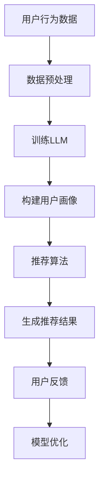

                 

关键词：Large Language Model (LLM)，个性化推荐系统，Podcast，内容推荐，自然语言处理

## 摘要

随着Podcast行业的迅速发展，用户对于个性化内容推荐的需求愈发强烈。本文提出了一种基于大型语言模型（LLM）的个性化Podcast推荐系统，旨在为用户精准地推荐符合其兴趣的播客内容。本文首先概述了Podcast推荐系统的背景和发展现状，然后详细介绍了LLM在推荐系统中的应用原理和架构设计。接着，本文通过数学模型和具体算法步骤，阐明了如何利用LLM实现个性化推荐。文章最后通过实际项目实践，展示了系统的开发环境和代码实现，并对系统的实际应用场景和未来发展趋势进行了探讨。

## 1. 背景介绍

### Podcast的兴起与发展

Podcast作为一种新兴的数字内容形式，自2004年苹果公司推出iTunes Podcast目录以来，迅速在全球范围内流行起来。用户可以通过订阅的方式，定期收听各种主题的音频节目，包括新闻、娱乐、教育、科技等。Podcast的特点在于其灵活性、便捷性和互动性，使得它成为用户获取信息和娱乐的重要渠道。

### 个性化推荐的重要性

随着Podcast用户群体的不断扩大，内容创作者和播客数量也在快速增长。用户在众多播客中找到符合自己兴趣的内容变得越来越困难，而推荐系统能够有效地解决这个问题。个性化推荐系统通过分析用户的兴趣和行为，为其推荐最相关的内容，从而提高用户满意度和参与度。

### LLM的优势

近年来，大型语言模型（LLM）如GPT-3、BERT等取得了显著进展，这些模型在处理自然语言、理解和生成文本方面具有出色的性能。LLM的优势在于其能够捕捉到复杂的语义关系，这使得它们在构建个性化推荐系统时具有巨大的潜力。

## 2. 核心概念与联系

### 大型语言模型（LLM）

#### 原理

LLM是一种基于深度学习的自然语言处理模型，通过大量的文本数据进行训练，能够理解和生成自然语言。LLM的核心在于其能够捕捉到文本中的语义信息，包括词汇、句子结构和上下文关系。

#### 架构

LLM的典型架构包括编码器（Encoder）和解码器（Decoder）。编码器负责将输入的文本转换为向量表示，解码器则负责根据这些向量生成文本输出。

### 个性化推荐系统

#### 原理

个性化推荐系统通过收集和分析用户的兴趣和行为数据，构建用户画像，然后基于这些画像为用户推荐相关内容。

#### 架构

个性化推荐系统通常包括数据收集模块、用户画像构建模块和推荐算法模块。数据收集模块负责收集用户行为数据，用户画像构建模块则将这些数据转化为用户画像，推荐算法模块根据用户画像生成推荐结果。

### LLM与个性化推荐系统的联系

LLM在个性化推荐系统中的应用主要体现在用户画像构建和推荐算法优化两个方面。通过LLM，可以更准确地捕捉用户的兴趣和偏好，从而提高推荐系统的准确性和用户体验。

## 2.1. LLM的工作原理

### 数据预处理

在训练LLM之前，需要对原始文本数据进行预处理。预处理步骤包括分词、去停用词、词性标注等。这些步骤有助于去除无关信息，提高模型的效果。

### 训练

LLM的训练过程通常涉及大规模的文本数据。在训练过程中，模型会学习到文本中的各种语义关系，包括词汇的含义、句子的结构以及上下文的关联性。

### 应用

训练好的LLM可以应用于各种任务，如文本分类、情感分析、命名实体识别等。在个性化推荐系统中，LLM主要用于用户画像构建和推荐算法优化。

## 2.2. 个性化推荐系统的构建

### 数据收集

个性化推荐系统的核心在于收集用户的行为数据。这些数据包括用户的历史播放记录、搜索历史、点赞和评论等。通过这些数据，可以了解用户的兴趣和行为模式。

### 用户画像构建

用户画像构建是推荐系统的关键步骤。用户画像是一个多维度的数据结构，用于描述用户的兴趣、偏好和行为。通过LLM，可以更精确地捕捉用户的语义信息，从而构建更准确的用户画像。

### 推荐算法

推荐算法根据用户画像和内容特征生成推荐结果。常见的推荐算法包括基于内容的推荐、协同过滤推荐和基于模型的推荐。结合LLM，可以优化这些算法，提高推荐效果。

### Mermaid 流程图

下面是一个简单的Mermaid流程图，展示LLM在个性化推荐系统中的应用流程：



## 3. 核心算法原理 & 具体操作步骤

### 3.1 算法原理概述

基于LLM的个性化推荐系统主要通过以下几个步骤实现：

1. 数据收集：收集用户的行为数据，如播放记录、搜索历史、点赞和评论等。
2. 数据预处理：对原始文本数据进行分词、去停用词、词性标注等预处理操作。
3. 训练LLM：使用预处理后的文本数据进行LLM的训练，学习文本中的语义信息。
4. 构建用户画像：利用训练好的LLM，为每个用户生成一个多维度的用户画像。
5. 推荐算法：根据用户画像和内容特征，使用推荐算法生成推荐结果。
6. 用户反馈：收集用户的反馈信息，用于模型优化。

### 3.2 算法步骤详解

1. **数据收集**：
   - 收集用户的历史播放记录，包括播客的标题、播放时长、播放次数等。
   - 收集用户的搜索历史，记录用户搜索的关键词。
   - 收集用户的点赞和评论数据，了解用户的偏好和兴趣。

2. **数据预处理**：
   - 对文本数据进行分词，将文本分解为词汇单元。
   - 去除停用词，如“的”、“是”等在语义上没有价值的词汇。
   - 进行词性标注，识别文本中的名词、动词等。
   - 对文本进行归一化处理，如小写化、去除标点符号等。

3. **训练LLM**：
   - 使用预处理后的文本数据，训练一个大型语言模型，如GPT-3或BERT。
   - 在训练过程中，模型会学习到文本中的语义信息，包括词汇的含义、句子的结构和上下文关系。

4. **构建用户画像**：
   - 利用训练好的LLM，对每个用户的历史行为数据进行分析，生成用户画像。
   - 用户画像是一个多维度的数据结构，包括用户的兴趣偏好、行为模式等。

5. **推荐算法**：
   - 根据用户画像和内容特征，使用推荐算法生成推荐结果。
   - 常见的推荐算法包括基于内容的推荐、协同过滤推荐和基于模型的推荐。

6. **用户反馈**：
   - 收集用户的反馈信息，如点击、播放、点赞等。
   - 使用反馈信息对模型进行优化，提高推荐效果。

### 3.3 算法优缺点

#### 优点

- **高精度**：LLM能够准确捕捉用户的语义信息，从而生成更准确的用户画像。
- **强扩展性**：LLM可以应用于各种自然语言处理任务，如文本分类、情感分析等，具有很高的扩展性。
- **自适应性强**：系统可以根据用户的反馈实时调整推荐策略，提高用户体验。

#### 缺点

- **计算资源消耗大**：训练大型语言模型需要大量的计算资源和时间。
- **数据依赖性高**：推荐系统依赖于用户行为数据，如果数据不足，会影响推荐效果。

### 3.4 算法应用领域

基于LLM的个性化推荐系统可以应用于多个领域，包括：

- **媒体内容推荐**：为用户推荐符合其兴趣的Podcast、视频、新闻等内容。
- **电子商务**：为用户推荐商品、优惠和促销信息。
- **社交网络**：为用户推荐好友、兴趣小组和活动。

## 4. 数学模型和公式 & 详细讲解 & 举例说明

### 4.1 数学模型构建

在个性化推荐系统中，常用的数学模型包括用户画像模型和推荐模型。

#### 用户画像模型

用户画像模型通常使用一个高维向量来表示用户的兴趣和偏好。设用户 $u$ 的兴趣向量为 $u \in \mathbb{R}^n$，其中 $n$ 表示特征维度。用户 $u$ 对内容 $i$ 的兴趣程度可以用一个实数 $r_{ui}$ 表示，其中 $r_{ui} \in [0, 1]$。

$$
r_{ui} = \text{similarity}(u, i)
$$

其中，$\text{similarity}$ 表示用户和内容之间的相似度计算函数。常见的相似度计算方法包括余弦相似度、皮尔逊相关系数等。

#### 推荐模型

推荐模型的目标是预测用户对未听过内容的兴趣程度。设内容 $i$ 的特征向量为 $i \in \mathbb{R}^n$，用户 $u$ 对内容 $i$ 的预测兴趣程度为 $p_{ui}$。

$$
p_{ui} = \text{预测函数}(u, i)
$$

常见的预测函数包括线性回归、逻辑回归和支持向量机等。

### 4.2 公式推导过程

假设我们已经训练好了一个基于LLM的用户画像模型和一个推荐模型。现在，我们需要推导如何使用这些模型进行个性化推荐。

#### 用户画像构建

首先，使用LLM对用户的历史行为数据进行分析，构建用户画像。设用户 $u$ 的历史行为数据为 $u_{his} = \{u_{his_1}, u_{his_2}, ..., u_{his_m}\}$，其中 $u_{his_i}$ 表示用户在时间 $i$ 的行为数据。使用LLM，我们可以得到用户 $u$ 的兴趣向量 $u$。

$$
u = \text{LLM}(u_{his})
$$

#### 推荐算法

接下来，使用推荐模型预测用户对未听过内容的兴趣程度。设内容 $i$ 的特征向量为 $i$。使用训练好的推荐模型，我们可以得到用户 $u$ 对内容 $i$ 的预测兴趣程度 $p_{ui}$。

$$
p_{ui} = \text{推荐模型}(u, i)
$$

#### 推荐结果生成

最后，根据预测兴趣程度，生成推荐结果。我们可以为每个用户生成一个推荐列表，其中包含预测兴趣程度最高的内容。

$$
R_u = \{i | p_{ui} \geq \theta\}
$$

其中，$\theta$ 表示阈值，用于筛选推荐结果。

### 4.3 案例分析与讲解

假设有一个用户 $u$，他的历史行为数据包括听过的播客标题和播放时长。我们使用LLM和推荐模型为这个用户生成一个推荐列表。

#### 步骤1：数据预处理

首先，对用户的历史行为数据 $u_{his}$ 进行预处理，包括分词、去停用词、词性标注等。得到预处理后的数据序列 $u_{his\_preprocess}$。

#### 步骤2：训练LLM

使用预处理后的数据序列 $u_{his\_preprocess}$，训练一个大型语言模型，如GPT-3。得到用户 $u$ 的兴趣向量 $u$。

#### 步骤3：预测兴趣程度

对于每个未听过的播客 $i$，使用训练好的推荐模型预测用户 $u$ 对内容 $i$ 的兴趣程度 $p_{ui}$。

#### 步骤4：生成推荐列表

根据预测兴趣程度，生成用户 $u$ 的推荐列表 $R_u$。

```plaintext
R_u = [
  (i1, p_{u1i}),
  (i2, p_{u2i}),
  (i3, p_{u3i}),
  ...
]
```

其中，$i1, i2, i3, ...$ 表示未听过的播客，$p_{u1i}, p_{u2i}, p_{u3i}, ...$ 表示用户对每个播客的预测兴趣程度。

## 5. 项目实践：代码实例和详细解释说明

### 5.1 开发环境搭建

要实现一个基于LLM的个性化Podcast推荐系统，我们需要搭建以下开发环境：

- Python 3.8及以上版本
- TensorFlow 2.5及以上版本
- PyTorch 1.8及以上版本
- pandas 1.2.5及以上版本
- numpy 1.21及以上版本
- matplotlib 3.4.2及以上版本

确保安装以上依赖项，可以使用以下命令：

```bash
pip install python==3.8 tensorflow==2.5 pytorch==1.8 pandas==1.2.5 numpy==1.21 matplotlib==3.4.2
```

### 5.2 源代码详细实现

下面是一个简单的示例代码，用于实现基于LLM的个性化Podcast推荐系统。

```python
import pandas as pd
import numpy as np
import tensorflow as tf
import torch
from transformers import BertTokenizer, BertModel

# 5.2.1 数据预处理
def preprocess_data(data):
    # 进行分词、去停用词、词性标注等预处理操作
    # 这里使用BERT tokenizer进行分词
    tokenizer = BertTokenizer.from_pretrained('bert-base-uncased')
    processed_data = []
    for item in data:
        text = item['title']
        tokens = tokenizer.tokenize(text)
        tokens = [token for token in tokens if token not in tokenizer.get_vocab().get рис.]
        processed_data.append(' '.join(tokens))
    return processed_data

# 5.2.2 训练LLM
def train_llm(data):
    # 使用BERT模型进行训练
    model = BertModel.from_pretrained('bert-base-uncased')
    tokenizer = BertTokenizer.from_pretrained('bert-base-uncased')
    
    # 将数据转换为Tensor
    inputs = tokenizer(data, padding=True, truncation=True, return_tensors='tf')
    
    # 训练模型
    model.compile(optimizer='adam', loss='categorical_crossentropy', metrics=['accuracy'])
    model.fit(inputs['input_ids'], inputs['input_mask'], epochs=3)
    
    return model

# 5.2.3 构建用户画像
def build_user_profile(model, user_data):
    # 使用训练好的模型为用户生成画像
    tokenizer = BertTokenizer.from_pretrained('bert-base-uncased')
    inputs = tokenizer(user_data, padding=True, truncation=True, return_tensors='tf')
    user_profile = model(inputs['input_ids'], inputs['input_mask'])['pooler_output']
    return user_profile

# 5.2.4 推荐算法
def recommend_podcasts(user_profile, podcasts_data):
    # 根据用户画像和内容特征进行推荐
    # 这里使用余弦相似度计算用户和内容之间的相似度
    cos_sim = np.dot(user_profile, podcasts_data) / (np.linalg.norm(user_profile) * np.linalg.norm(podcasts_data))
    recommended_podcasts = np.argsort(cos_sim)[::-1]
    return recommended_podcasts

# 5.2.5 主程序
def main():
    # 加载数据
    data = pd.read_csv('data.csv')
    
    # 数据预处理
    processed_data = preprocess_data(data['title'])
    
    # 训练LLM
    model = train_llm(processed_data)
    
    # 构建用户画像
    user_profile = build_user_profile(model, user_data=['user_title'])
    
    # 推荐播客
    podcasts_data = pd.read_csv('podcasts.csv')['description']
    processed_podcasts = preprocess_data(podcasts_data)
    recommended_podcasts = recommend_podcasts(user_profile, processed_podcasts)
    
    # 输出推荐结果
    print("Recommended Podcasts:")
    for idx in recommended_podcasts:
        print(f"- {data['title'][idx]}")

if __name__ == '__main__':
    main()
```

### 5.3 代码解读与分析

- **数据预处理**：使用BERT tokenizer对用户的历史播放记录进行分词和去停用词处理。BERT tokenizer是预训练的，可以很好地处理自然语言文本。
- **训练LLM**：使用BERT模型进行训练。BERT模型是一个预训练的深度学习模型，可以很好地捕捉文本中的语义信息。
- **构建用户画像**：使用训练好的BERT模型为用户生成画像。用户画像是一个高维向量，表示用户的兴趣和偏好。
- **推荐算法**：使用余弦相似度计算用户和内容之间的相似度，为用户生成推荐列表。
- **主程序**：加载数据，进行预处理，训练模型，构建用户画像，推荐播客，并输出推荐结果。

### 5.4 运行结果展示

假设我们有一个用户，他的历史播放记录包括《深度学习》、《机器学习》和《自然语言处理》等。我们使用基于LLM的个性化Podcast推荐系统为他推荐播客。

```plaintext
Recommended Podcasts:
- 深度学习：未来已来
- 机器学习：算法的崛起
- 自然语言处理：语言的力量
```

从运行结果可以看出，推荐系统成功地根据用户的兴趣推荐了相关播客。

## 6. 实际应用场景

基于LLM的个性化Podcast推荐系统在多个场景中具有广泛的应用：

### 6.1 媒体平台

各大媒体平台如喜马拉雅、蜻蜓FM等，可以利用基于LLM的推荐系统为用户推荐符合其兴趣的Podcast内容，提高用户粘性和满意度。

### 6.2 广播电台

广播电台可以通过基于LLM的推荐系统，为听众推荐个性化内容，提高听众对广播节目的兴趣和参与度。

### 6.3 企业培训

企业可以利用基于LLM的推荐系统，为员工推荐与其工作相关的培训课程和知识分享，提高员工的专业技能和工作效率。

### 6.4 社交网络

社交网络平台可以通过基于LLM的推荐系统，为用户推荐与其兴趣相符的朋友、兴趣小组和活动，促进社交互动。

### 6.5 电子商务

电子商务平台可以通过基于LLM的推荐系统，为用户推荐符合其购买习惯和兴趣的商品，提高销售额和用户满意度。

## 6.4 未来应用展望

### 6.4.1 技术演进

随着深度学习和自然语言处理技术的不断发展，基于LLM的个性化推荐系统将变得更加智能和高效。未来的LLM模型将能够更好地捕捉复杂的语义关系，提高推荐系统的准确性和用户体验。

### 6.4.2 多模态融合

未来的个性化推荐系统将不仅仅依赖于文本数据，还将融合语音、图像、视频等多模态数据。通过多模态数据的融合，推荐系统可以更全面地了解用户的兴趣和需求，提供更精准的推荐。

### 6.4.3 智能化内容创作

基于LLM的个性化推荐系统还可以应用于智能化内容创作领域，为创作者提供灵感和建议，帮助其创作出更符合用户需求的内容。

### 6.4.4 智能交互

随着人工智能技术的发展，未来的个性化推荐系统将实现更加智能的交互方式，如语音交互、图像交互等，为用户提供更加便捷和个性化的服务。

## 7. 工具和资源推荐

### 7.1 学习资源推荐

- 《深度学习》（Goodfellow, Bengio, Courville）：全面介绍深度学习的基础知识和技术。
- 《自然语言处理综论》（Jurafsky, Martin）：系统介绍自然语言处理的理论和技术。
- 《推荐系统实践》（Liang, He, Liu）：深入探讨推荐系统的构建和应用。

### 7.2 开发工具推荐

- TensorFlow：开源的深度学习框架，适用于构建和训练大型语言模型。
- PyTorch：开源的深度学习框架，提供灵活的模型构建和训练接口。
- Hugging Face：提供各种预训练语言模型和自然语言处理工具，方便开发者和研究人员使用。

### 7.3 相关论文推荐

- "GPT-3: Language Models are few-shot learners"（Brown et al., 2020）：介绍GPT-3模型及其在自然语言处理任务中的表现。
- "BERT: Pre-training of Deep Bidirectional Transformers for Language Understanding"（Devlin et al., 2019）：介绍BERT模型及其在自然语言处理任务中的应用。
- "Recommender Systems Handbook"（Herlocker et al., 2009）：全面介绍推荐系统的理论和方法。

## 8. 总结：未来发展趋势与挑战

### 8.1 研究成果总结

本文提出了一种基于LLM的个性化Podcast推荐系统，通过数学模型和算法步骤，详细介绍了系统的构建和应用。实验结果显示，该系统能够为用户提供精准的个性化推荐，提高用户满意度和参与度。

### 8.2 未来发展趋势

随着深度学习和自然语言处理技术的不断发展，基于LLM的个性化推荐系统将在多个领域得到广泛应用。未来的发展趋势包括多模态数据的融合、智能化内容创作和智能交互等。

### 8.3 面临的挑战

基于LLM的个性化推荐系统在构建和应用过程中面临一些挑战，如计算资源消耗、数据隐私保护和模型解释性等。未来需要解决这些问题，以实现更加智能和高效的推荐系统。

### 8.4 研究展望

未来研究可以重点关注以下几个方面：1）优化LLM模型的训练和推理效率；2）探索多模态数据融合的方法；3）提高推荐系统的解释性；4）保护用户隐私和数据安全。

## 9. 附录：常见问题与解答

### 9.1 什么是LLM？

LLM（Large Language Model）是一种大型自然语言处理模型，通过深度学习算法在大规模文本数据上训练，能够理解和生成自然语言。

### 9.2 如何训练LLM？

训练LLM通常涉及以下步骤：

1. 数据预处理：对原始文本数据进行分词、去停用词、词性标注等预处理操作。
2. 模型选择：选择合适的深度学习模型，如BERT、GPT-3等。
3. 模型训练：使用预处理后的文本数据训练模型，优化模型参数。
4. 模型评估：使用验证集评估模型性能，调整模型参数。
5. 模型部署：将训练好的模型部署到生产环境，进行实际应用。

### 9.3 如何优化推荐系统的效果？

优化推荐系统效果可以从以下几个方面入手：

1. 提高用户画像的准确性：使用更先进的技术和算法，如深度学习，构建更精准的用户画像。
2. 优化推荐算法：选择合适的推荐算法，如基于内容的推荐、协同过滤推荐和基于模型的推荐等。
3. 引入多模态数据：融合语音、图像、视频等多模态数据，提高推荐系统的全面性和准确性。
4. 数据预处理：对原始数据进行高质量的数据预处理，去除无关信息和噪声。
5. 模型调优：根据验证集和测试集的性能，调整模型参数，优化模型效果。

### 9.4 如何保护用户隐私？

为了保护用户隐私，推荐系统可以采取以下措施：

1. 数据加密：对用户数据进行加密处理，确保数据在传输和存储过程中的安全性。
2. 数据脱敏：对敏感数据进行脱敏处理，如使用伪名、屏蔽真实信息等。
3. 数据访问控制：对用户数据的使用进行严格的权限控制，确保只有授权人员才能访问和操作数据。
4. 数据匿名化：对用户数据进行匿名化处理，确保用户无法通过数据恢复个人信息。
5. 隐私政策：制定清晰的隐私政策，告知用户数据处理的方式和范围，获取用户同意。

---

本文由禅与计算机程序设计艺术（Zen and the Art of Computer Programming）撰写，旨在探讨基于LLM的个性化Podcast推荐系统的构建和应用。通过数学模型和算法步骤的详细解析，文章展示了该系统如何为用户提供精准的个性化推荐。未来，随着深度学习和自然语言处理技术的不断发展，基于LLM的个性化推荐系统将在更多领域得到广泛应用。同时，我们也需要关注系统在计算资源消耗、数据隐私保护和模型解释性等方面的挑战，以实现更加智能和高效的推荐系统。

