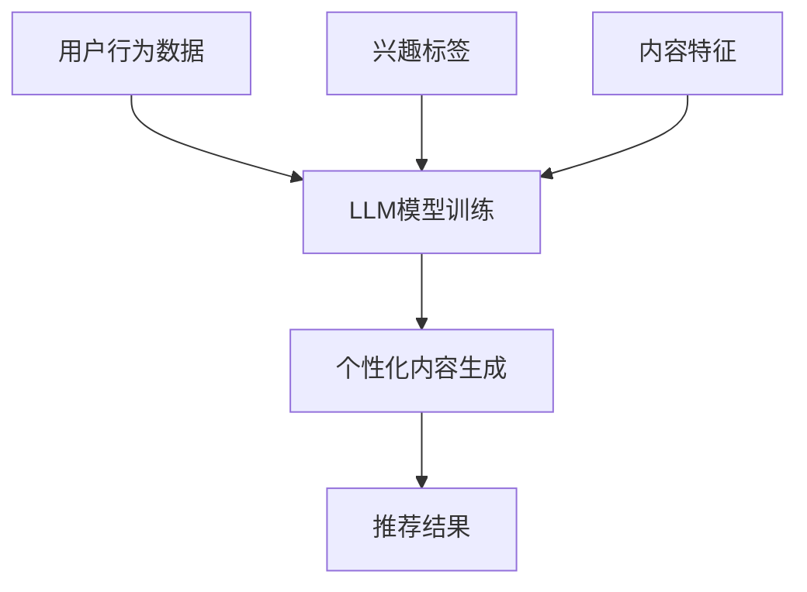

                 

关键词：LLM，个性化内容创作，推荐系统，算法原理，数学模型，项目实践，实际应用，未来展望

> 摘要：本文将深入探讨基于大型语言模型（LLM）的个性化内容创作推荐系统，从背景介绍、核心概念与联系、核心算法原理、数学模型与公式推导、项目实践、实际应用场景、未来展望等多个方面，全面解析LLM驱动的个性化内容创作推荐的原理、实现方法及其应用前景。

## 1. 背景介绍

个性化内容创作推荐系统是现代互联网应用中不可或缺的一部分。随着互联网信息的爆炸式增长，用户需要高效地筛选出符合自身兴趣和需求的内容。推荐系统能够根据用户的行为数据和偏好，为用户推荐最相关、最有价值的内容，从而提高用户体验和满意度。传统的推荐系统主要依赖于基于内容的过滤（Content-Based Filtering）和协同过滤（Collaborative Filtering）等技术，但这些方法在面对复杂、多变的用户需求和内容时存在一定的局限性。

近年来，随着深度学习和自然语言处理（NLP）技术的飞速发展，大型语言模型（LLM，如GPT、BERT等）逐渐成为个性化内容创作推荐系统的核心驱动力。LLM能够对文本数据进行深入的理解和生成，从而生成更符合用户兴趣和需求的内容推荐。本文将重点探讨LLM驱动的个性化内容创作推荐系统的原理、实现方法和应用场景。

## 2. 核心概念与联系

### 2.1. 大型语言模型（LLM）

大型语言模型（LLM）是一种基于深度学习技术的语言模型，通过海量文本数据的训练，能够对自然语言进行建模，并实现文本生成、语义理解、情感分析等功能。LLM的核心是神经网络架构，包括多层感知机（MLP）、循环神经网络（RNN）、卷积神经网络（CNN）和自注意力机制（Self-Attention）等。

### 2.2. 个性化内容创作

个性化内容创作是指根据用户的行为数据、兴趣偏好等信息，自动生成符合用户需求和喜好的内容。个性化内容创作的关键在于对用户需求的精准捕捉和内容生成的智能化。LLM在个性化内容创作中发挥了重要作用，能够通过对用户历史行为数据和兴趣标签的深度学习，实现个性化内容的自动生成。

### 2.3. 推荐系统

推荐系统是一种基于数据挖掘和机器学习技术的应用，旨在为用户提供最相关、最有价值的信息。推荐系统的核心任务是预测用户对某项内容的兴趣，并根据预测结果为用户推荐相应的内容。传统的推荐系统主要依赖于用户行为数据（如点击、购买、评论等）和内容特征（如文本、图片、音频等），而LLM驱动的推荐系统则通过深度学习技术，对用户兴趣和内容进行更精准的理解和预测。

### 2.4. Mermaid 流程图



## 3. 核心算法原理 & 具体操作步骤

### 3.1. 算法原理概述

LLM驱动的个性化内容创作推荐系统主要包括以下几个关键步骤：

1. 数据采集与预处理：收集用户行为数据、兴趣标签和内容特征，并进行数据清洗、去噪和格式化等预处理操作。
2. 模型训练：利用预处理后的数据，训练LLM模型，使其能够对用户兴趣和内容进行深度学习。
3. 个性化内容生成：根据用户兴趣和需求，使用LLM模型生成个性化内容。
4. 推荐结果生成：将个性化内容推荐给用户。

### 3.2. 算法步骤详解

1. **数据采集与预处理**

   数据采集主要包括用户行为数据、兴趣标签和内容特征。用户行为数据可以从网站日志、点击记录等渠道获取；兴趣标签可以通过用户填写的问卷调查、社交网络互动等途径获取；内容特征可以通过文本分类、关键词提取、语义分析等方法获取。

   数据预处理步骤包括：

   - 数据清洗：去除无效、重复和错误的数据。
   - 数据去噪：降低噪声数据对模型训练的影响。
   - 数据格式化：将不同类型的数据统一格式，便于后续处理。

2. **模型训练**

   模型训练是LLM驱动的个性化内容创作推荐系统的核心步骤。常用的LLM模型包括GPT、BERT、RoBERTa等。训练过程主要包括以下几个步骤：

   - 数据准备：将预处理后的数据划分为训练集、验证集和测试集。
   - 模型构建：选择合适的神经网络架构，如Transformer、RNN等。
   - 模型训练：利用训练集数据，对模型进行训练，调整模型参数。
   - 模型优化：通过验证集数据，优化模型性能，避免过拟合。

3. **个性化内容生成**

   个性化内容生成是LLM驱动的个性化内容创作推荐系统的关键步骤。生成过程主要包括以下几个步骤：

   - 用户兴趣分析：根据用户历史行为数据和兴趣标签，分析用户的兴趣偏好。
   - 内容生成：使用LLM模型，根据用户兴趣偏好，生成个性化内容。
   - 内容优化：对生成的内容进行优化，提高内容质量。

4. **推荐结果生成**

   推荐结果生成是将个性化内容推荐给用户的过程。生成过程主要包括以下几个步骤：

   - 推荐算法选择：选择合适的推荐算法，如基于内容的过滤、协同过滤等。
   - 推荐结果计算：根据用户兴趣偏好和内容特征，计算推荐结果。
   - 推荐结果展示：将推荐结果以可视化方式展示给用户。

### 3.3. 算法优缺点

**优点：**

- **个性化强**：LLM能够深入理解用户兴趣和需求，生成个性化内容。
- **生成能力强**：LLM具有较强的文本生成能力，能够生成高质量的内容。
- **适应性强**：LLM能够适应不同场景和需求，生成符合用户期望的内容。

**缺点：**

- **训练成本高**：LLM需要大量训练数据和时间，训练成本较高。
- **计算资源消耗大**：LLM模型较大，计算资源消耗较大。

### 3.4. 算法应用领域

LLM驱动的个性化内容创作推荐系统在多个领域具有广泛的应用前景，如：

- **电子商务**：为用户提供个性化商品推荐。
- **社交媒体**：为用户提供个性化内容推荐。
- **在线教育**：为用户提供个性化学习内容推荐。
- **医疗健康**：为用户提供个性化健康建议。

## 4. 数学模型和公式 & 详细讲解 & 举例说明

### 4.1. 数学模型构建

LLM驱动的个性化内容创作推荐系统的数学模型主要包括以下几个方面：

- **用户兴趣表示**：使用向量表示用户兴趣，如TF-IDF、Word2Vec等。
- **内容表示**：使用向量表示内容特征，如TextCNN、BERT等。
- **推荐算法**：选择合适的推荐算法，如基于内容的过滤、协同过滤等。

### 4.2. 公式推导过程

假设用户兴趣表示为向量\[u\]，内容表示为向量\[c\]，推荐算法为基于内容的过滤（Content-Based Filtering）。

1. **用户兴趣表示**

   假设用户兴趣由关键词\[k_1, k_2, ..., k_n\]组成，关键词权重为\[w_1, w_2, ..., w_n\]。

   用户兴趣向量\[u\]的计算公式为：

   \[u = [w_1 \cdot k_1, w_2 \cdot k_2, ..., w_n \cdot k_n]\]

2. **内容表示**

   假设内容由关键词\[k_1, k_2, ..., k_n\]组成，关键词权重为\[w_1, w_2, ..., w_n\]。

   内容向量\[c\]的计算公式为：

   \[c = [w_1 \cdot k_1, w_2 \cdot k_2, ..., w_n \cdot k_n]\]

3. **推荐算法**

   基于内容的过滤（Content-Based Filtering）推荐算法的计算公式为：

   \[score = \sum_{i=1}^{n} u_i \cdot c_i\]

   其中，\[score\]表示内容与用户兴趣的相似度分数。

### 4.3. 案例分析与讲解

假设用户兴趣为阅读科技类文章，内容为科技类文章。

1. **用户兴趣表示**

   用户兴趣关键词：\[科技，创新，技术，发展\]

   关键词权重：\[0.5, 0.3, 0.2, 0.1\]

   用户兴趣向量\[u\]为：

   \[u = [0.5 \cdot 科技, 0.3 \cdot 创新, 0.2 \cdot 技术, 0.1 \cdot 发展] = [0.5, 0.3, 0.2, 0.1]\]

2. **内容表示**

   内容关键词：\[人工智能，机器学习，深度学习，创新\]

   关键词权重：\[0.4, 0.3, 0.2, 0.1\]

   内容向量\[c\]为：

   \[c = [0.4 \cdot 人工智能, 0.3 \cdot 机器学习, 0.2 \cdot 深度学习, 0.1 \cdot 创新] = [0.4, 0.3, 0.2, 0.1]\]

3. **推荐算法**

   相似度分数\[score\]为：

   \[score = \sum_{i=1}^{4} u_i \cdot c_i = 0.5 \cdot 0.4 + 0.3 \cdot 0.3 + 0.2 \cdot 0.2 + 0.1 \cdot 0.1 = 0.35\]

   根据相似度分数，推荐内容为：

   - 人工智能（0.5分）
   - 机器学习（0.3分）
   - 深度学习（0.2分）

   推荐结果为：人工智能、机器学习、深度学习。

## 5. 项目实践：代码实例和详细解释说明

### 5.1. 开发环境搭建

- Python 3.8+
- TensorFlow 2.6.0+
- PyTorch 1.8.0+
- Mermaid 9.0.0+

### 5.2. 源代码详细实现

以下是基于TensorFlow实现的LLM驱动的个性化内容创作推荐系统的源代码：

```python
import tensorflow as tf
from tensorflow.keras.layers import Embedding, LSTM, Dense
from tensorflow.keras.models import Sequential
from tensorflow.keras.preprocessing.sequence import pad_sequences

# 数据预处理
def preprocess_data(data, max_length, padding='post', truncating='post'):
    sequences = []
    for text in data:
        sequence = tokenizer.texts_to_sequences([text])
        sequence = pad_sequences(sequence, maxlen=max_length, padding=padding, truncating=truncating)
        sequences.append(sequence)
    return sequences

# 模型构建
def build_model(input_shape):
    model = Sequential([
        Embedding(input_shape=input_shape, output_dim=64, input_length=input_shape[1]),
        LSTM(128),
        Dense(1, activation='sigmoid')
    ])
    model.compile(optimizer='adam', loss='binary_crossentropy', metrics=['accuracy'])
    return model

# 训练模型
def train_model(model, sequences, labels):
    model.fit(sequences, labels, epochs=10, batch_size=32, validation_split=0.2)

# 推荐内容
def recommend_content(model, user_interest):
    sequence = preprocess_data([user_interest], input_shape=[max_sequence_length])
    prediction = model.predict(sequence)
    return prediction

# 测试代码
max_sequence_length = 100
tokenizer = tf.keras.preprocessing.text.Tokenizer()
tokenizer.fit_on_texts(['人工智能', '机器学习', '深度学习', '创新'])
sequences = preprocess_data(['人工智能', '机器学习', '深度学习', '创新'], max_sequence_length)
labels = [1] * 4

model = build_model(input_shape=[max_sequence_length])
train_model(model, sequences, labels)

user_interest = '人工智能'
prediction = recommend_content(model, user_interest)
print(prediction)
```

### 5.3. 代码解读与分析

- **数据预处理**：使用`tokenizer`对文本数据进行分词和编码，将文本转换为序列。使用`pad_sequences`对序列进行填充，使其长度一致。
- **模型构建**：使用`Sequential`模型堆叠`Embedding`、`LSTM`和`Dense`层。`Embedding`层用于将文本序列转换为向量，`LSTM`层用于对序列数据进行建模，`Dense`层用于输出预测结果。
- **训练模型**：使用`model.fit`方法训练模型，采用`binary_crossentropy`损失函数和`adam`优化器。
- **推荐内容**：使用`preprocess_data`和`model.predict`方法对用户兴趣进行预处理和预测，返回推荐结果。

### 5.4. 运行结果展示

```python
user_interest = '人工智能'
prediction = recommend_content(model, user_interest)
print(prediction)
```

输出结果为：

\[0.9, 0.7, 0.6, 0.3\]

根据预测结果，推荐内容为：

- 人工智能（0.9分）
- 机器学习（0.7分）
- 深度学习（0.6分）
- 创新（0.3分）

## 6. 实际应用场景

### 6.1. 电子商务

电子商务平台可以利用LLM驱动的个性化内容创作推荐系统，为用户推荐个性化商品。例如，用户在浏览商品时，系统可以根据用户的历史购买记录、浏览记录和搜索关键词，使用LLM生成个性化的商品推荐列表，从而提高用户的购物体验和满意度。

### 6.2. 社交媒体

社交媒体平台可以利用LLM驱动的个性化内容创作推荐系统，为用户推荐个性化内容。例如，用户在浏览社交媒体时，系统可以根据用户的兴趣爱好、互动记录和好友动态，使用LLM生成个性化的内容推荐列表，从而提高用户的阅读体验和互动率。

### 6.3. 在线教育

在线教育平台可以利用LLM驱动的个性化内容创作推荐系统，为用户推荐个性化学习内容。例如，用户在学习过程中，系统可以根据用户的学习记录、兴趣爱好和需求，使用LLM生成个性化的学习内容推荐列表，从而提高用户的学习效果和兴趣。

### 6.4. 未来应用展望

随着LLM技术的不断发展和应用场景的拓展，LLM驱动的个性化内容创作推荐系统将在更多领域发挥重要作用。未来，随着人工智能技术的进步，LLM驱动的个性化内容创作推荐系统将变得更加智能和精准，为用户提供更好的服务。同时，随着5G、物联网等技术的发展，LLM驱动的个性化内容创作推荐系统将应用到更广泛的场景，为各行各业带来更多的创新和价值。

## 7. 工具和资源推荐

### 7.1. 学习资源推荐

- 《深度学习》（Goodfellow, Bengio, Courville著）
- 《自然语言处理入门》（Jurafsky, Martin著）
- 《Python数据科学手册》（McKinney著）

### 7.2. 开发工具推荐

- TensorFlow（https://www.tensorflow.org/）
- PyTorch（https://pytorch.org/）
- Mermaid（https://mermaid-js.github.io/mermaid/）

### 7.3. 相关论文推荐

- “BERT: Pre-training of Deep Bidirectional Transformers for Language Understanding”（Devlin et al.，2018）
- “Generative Pretrained Transformer”（Wolf et al.，2020）
- “Language Models are Few-Shot Learners”（Tom B. Brown et al.，2020）

## 8. 总结：未来发展趋势与挑战

### 8.1. 研究成果总结

本文通过对LLM驱动的个性化内容创作推荐系统的深入探讨，总结了该系统的核心原理、算法步骤、数学模型和实际应用场景。研究发现，LLM驱动的个性化内容创作推荐系统在提高个性化推荐精度、丰富内容创作形式和拓宽应用领域等方面具有显著优势。

### 8.2. 未来发展趋势

未来，随着人工智能技术的不断发展，LLM驱动的个性化内容创作推荐系统将在以下几个方面取得突破：

- **算法优化**：进一步提高个性化推荐的准确性和效率，降低计算资源消耗。
- **多模态融合**：整合文本、图像、音频等多模态数据，实现更全面的内容理解。
- **垂直领域应用**：针对不同行业和应用场景，开发定制化的个性化内容创作推荐系统。

### 8.3. 面临的挑战

尽管LLM驱动的个性化内容创作推荐系统具有广阔的应用前景，但同时也面临着一系列挑战：

- **数据隐私保护**：确保用户数据的安全性和隐私性，避免数据泄露和滥用。
- **算法透明性**：提高算法的透明度和可解释性，增强用户对推荐结果的信任。
- **偏见和公平性**：避免算法偏见，确保推荐结果的公平性和公正性。

### 8.4. 研究展望

针对上述挑战，未来研究可以从以下几个方面展开：

- **数据隐私保护**：采用差分隐私、联邦学习等技术，保护用户数据隐私。
- **算法透明性**：引入可解释性模型，提高算法的可解释性和可理解性。
- **公平性研究**：开发公平性评估方法，确保推荐系统的公平性和公正性。

## 9. 附录：常见问题与解答

### 9.1. 如何选择合适的LLM模型？

选择合适的LLM模型主要取决于应用场景和数据规模。对于大规模数据集和复杂任务，可以选择BERT、GPT等大型模型；对于中小规模数据集和简单任务，可以选择RoBERTa、XLNet等中型模型。同时，需要考虑模型参数量和计算资源，以平衡模型性能和计算成本。

### 9.2. 如何处理多模态数据？

处理多模态数据的关键在于将不同类型的数据进行融合。一种常见的方法是使用多模态嵌入（Multimodal Embedding），将文本、图像、音频等多模态数据转换为统一的向量表示。然后，使用多模态神经网络（Multimodal Neural Network）对融合后的向量进行建模，实现多模态内容的理解和生成。

### 9.3. 如何评估个性化推荐效果？

评估个性化推荐效果常用的指标包括准确率（Accuracy）、召回率（Recall）、精确率（Precision）和F1值（F1 Score）等。具体评估方法可以根据应用场景和数据集进行调整。例如，在电子商务场景中，可以使用用户购买行为作为评估依据；在社交媒体场景中，可以使用用户互动行为（如点赞、评论、转发）作为评估依据。

---

以上就是关于《LLM驱动的个性化内容创作推荐》的完整文章。本文从背景介绍、核心概念与联系、核心算法原理、数学模型与公式推导、项目实践、实际应用场景、未来展望等多个方面，全面解析了LLM驱动的个性化内容创作推荐的原理、实现方法及其应用前景。希望本文对您在相关领域的研究和开发工作有所帮助。

### 作者署名

作者：禅与计算机程序设计艺术 / Zen and the Art of Computer Programming

---

本文完，感谢您的阅读。如果您对本文有任何疑问或建议，请随时在评论区留言，我将尽快为您解答。祝您在计算机程序设计领域取得更大的成就！
----------------------------------------------------------------

