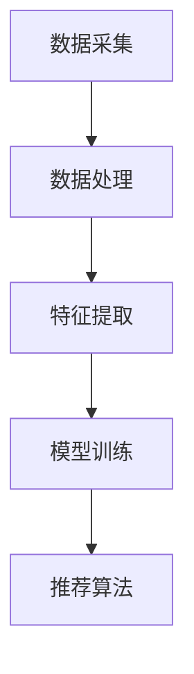

                 

关键词：LLM，个性化推荐，金融产品，算法，数学模型，实践，应用场景，展望

> 摘要：本文将探讨LLM（大型语言模型）在金融产品个性化推荐系统中的应用，介绍核心概念与架构，深入分析算法原理与数学模型，并通过实际项目实践进行详细解析。文章还展望了未来发展趋势与挑战，为读者提供了丰富的工具和资源推荐。

## 1. 背景介绍

随着大数据和人工智能技术的迅猛发展，个性化推荐系统在各行各业的应用越来越广泛。在金融领域，个性化推荐系统有助于金融机构更好地了解客户需求，提升用户体验，从而提高市场竞争力和盈利能力。然而，传统的推荐系统往往存在数据量大、特征复杂、处理效率低等问题。近年来，LLM（Large Language Model）技术的崛起为金融产品推荐带来了新的机遇和挑战。

LLM，即大型语言模型，是一种基于深度学习技术的语言处理模型，具有强大的文本生成、理解、摘要等能力。通过利用LLM，金融产品推荐系统可以更好地处理复杂的文本数据，提取有效特征，实现个性化推荐。

## 2. 核心概念与联系

### 2.1. LLM技术简介

LLM技术基于Transformer模型架构，通过预训练和微调，能够自动学习语言中的规律和语义，从而实现高质量的语言理解和生成。LLM的主要特点包括：

- **预训练**：在大量文本语料库上进行预训练，使模型具备了一定的语言理解和生成能力。
- **微调**：在特定任务上对模型进行微调，使其能够更好地适应特定领域的需求。
- **并行计算**：通过分布式计算，提高模型处理速度和效率。

### 2.2. 金融产品推荐系统架构

金融产品推荐系统通常由数据采集、数据处理、特征提取、模型训练和推荐算法等模块组成。LLM在特征提取和推荐算法环节发挥重要作用，具体架构如下：

1. **数据采集**：从各种渠道收集用户行为数据、金融产品数据等。
2. **数据处理**：对采集到的数据进行分析、清洗和预处理，为特征提取提供基础。
3. **特征提取**：利用LLM提取文本数据中的有效特征，如关键词、主题、情感等。
4. **模型训练**：通过训练数据，对推荐模型进行训练和优化。
5. **推荐算法**：基于训练好的模型，为用户生成个性化推荐。

### 2.3. Mermaid流程图



## 3. 核心算法原理 & 具体操作步骤

### 3.1. 算法原理概述

LLM驱动的个性化金融产品推荐系统主要利用LLM在文本处理方面的优势，提取用户和金融产品的特征，并通过协同过滤、基于内容的推荐等方法，生成个性化推荐结果。

### 3.2. 算法步骤详解

1. **数据采集**：从金融机构、第三方平台等渠道获取用户行为数据和金融产品数据。
2. **数据处理**：对采集到的数据进行分析、清洗和预处理，包括去除噪声数据、填补缺失值、归一化等操作。
3. **特征提取**：利用LLM提取用户和金融产品的文本特征，如用户兴趣、产品属性等。具体步骤如下：
    - **用户特征提取**：通过分析用户的历史行为数据，利用LLM提取用户兴趣、偏好等特征。
    - **金融产品特征提取**：通过分析金融产品的描述、标签等文本信息，利用LLM提取产品特征。
4. **模型训练**：利用提取到的用户和产品特征，训练推荐模型。常见的推荐算法有协同过滤、基于内容的推荐等。
5. **推荐算法**：基于训练好的模型，为用户生成个性化推荐结果。

### 3.3. 算法优缺点

**优点**：

- **强大的文本处理能力**：LLM能够自动学习文本数据中的规律和语义，有效提取用户和产品的特征。
- **个性化推荐**：通过结合用户行为数据和金融产品信息，实现个性化推荐，提高用户满意度。
- **高效性**：利用分布式计算，提高模型处理速度和效率。

**缺点**：

- **数据需求量大**：LLM需要大量高质量的数据进行训练，对数据采集和预处理提出了较高要求。
- **训练时间较长**：LLM模型训练时间较长，可能影响实时推荐性能。

### 3.4. 算法应用领域

LLM驱动的个性化金融产品推荐系统可应用于金融行业多个领域，如：

- **投资理财**：为用户提供个性化的投资建议和理财产品推荐。
- **保险业务**：为用户推荐合适的保险产品，提高保险销售转化率。
- **信用卡业务**：为用户推荐合适的信用卡产品，提高用户粘性和活跃度。

## 4. 数学模型和公式 & 详细讲解 & 举例说明

### 4.1. 数学模型构建

在LLM驱动的个性化金融产品推荐系统中，数学模型主要包括用户兴趣模型、产品特征模型和推荐模型。以下分别介绍各模型的构建方法：

1. **用户兴趣模型**：

   用户兴趣模型用于表示用户对金融产品的兴趣和偏好。设用户 $u$ 对金融产品 $i$ 的兴趣度为 $I(u, i)$，则用户兴趣模型可以表示为：

   $$ I(u, i) = \sum_{j \in R_i} w_{ij} \cdot p(u, j) $$

   其中，$R_i$ 表示与金融产品 $i$ 相关的推荐结果集合，$w_{ij}$ 表示用户 $u$ 对金融产品 $i$ 的兴趣权重，$p(u, j)$ 表示用户 $u$ 对推荐结果 $j$ 的概率。

2. **产品特征模型**：

   产品特征模型用于表示金融产品的属性和特征。设金融产品 $i$ 的特征集合为 $F_i$，则产品特征模型可以表示为：

   $$ f_i(j) = \sum_{k \in F_i} w_{ik} \cdot p(j, k) $$

   其中，$w_{ik}$ 表示金融产品 $i$ 对特征 $k$ 的权重，$p(j, k)$ 表示金融产品 $i$ 对特征 $k$ 的概率。

3. **推荐模型**：

   推荐模型用于生成个性化推荐结果。设用户 $u$ 对金融产品 $i$ 的兴趣度为 $I(u, i)$，则推荐模型可以表示为：

   $$ R(u, i) = \sum_{j \in R_i} I(u, j) \cdot f_i(j) $$

### 4.2. 公式推导过程

1. **用户兴趣模型推导**：

   用户兴趣模型基于用户的历史行为数据和LLM提取的特征。设用户 $u$ 在历史行为中，对金融产品 $i$ 产生了 $n_u$ 条评价记录，其中第 $t$ 条评价记录的评分为 $r_{ut}$。利用LLM提取用户 $u$ 对金融产品 $i$ 的兴趣关键词 $k(u, i)$，则用户兴趣模型可以表示为：

   $$ I(u, i) = \sum_{j \in R_i} w_{ij} \cdot p(u, j) = \sum_{k(u, i) \in K_i} w_{ik} \cdot p(u, k) $$

   其中，$K_i$ 表示与金融产品 $i$ 相关的兴趣关键词集合，$w_{ik}$ 表示用户 $u$ 对金融产品 $i$ 的兴趣权重，$p(u, k)$ 表示用户 $u$ 对兴趣关键词 $k$ 的概率。

2. **产品特征模型推导**：

   产品特征模型基于金融产品的描述文本和LLM提取的特征。设金融产品 $i$ 的描述文本为 $d_i$，利用LLM提取金融产品 $i$ 的特征关键词 $k(i)$，则产品特征模型可以表示为：

   $$ f_i(j) = \sum_{k \in F_i} w_{ik} \cdot p(j, k) = \sum_{k(i) \in K_i} w_{ik} \cdot p(j, k) $$

   其中，$K_i$ 表示与金融产品 $i$ 相关的特征关键词集合，$w_{ik}$ 表示金融产品 $i$ 对特征 $k$ 的权重，$p(j, k)$ 表示金融产品 $i$ 对特征 $k$ 的概率。

3. **推荐模型推导**：

   推荐模型基于用户兴趣模型和产品特征模型，生成个性化推荐结果。设用户 $u$ 对金融产品 $i$ 的兴趣度为 $I(u, i)$，则推荐模型可以表示为：

   $$ R(u, i) = \sum_{j \in R_i} I(u, j) \cdot f_i(j) = \sum_{j \in R_i} \sum_{k(u, i) \in K_i} w_{ij} \cdot p(u, k) \cdot \sum_{k(i) \in K_i} w_{ik} \cdot p(j, k) $$

### 4.3. 案例分析与讲解

以一个实际案例为例，说明LLM驱动的个性化金融产品推荐系统的数学模型和应用。

**案例背景**：

某金融平台希望为用户推荐个性化的理财产品，用户行为数据包括投资记录、浏览记录等，理财产品描述数据包括产品名称、收益率、投资期限等。

**数据预处理**：

对用户行为数据进行清洗和预处理，包括去除缺失值、重复值等。对理财产品描述数据进行文本预处理，包括分词、去停用词、词性标注等。

**特征提取**：

利用LLM提取用户和理财产品的特征。例如，用户兴趣特征可以提取出用户最近关注的理财产品关键词，理财产品特征可以提取出产品名称、收益率、投资期限等关键词。

**模型训练**：

利用用户和理财产品的特征数据，训练用户兴趣模型、产品特征模型和推荐模型。在训练过程中，可以采用基于梯度的优化算法，如SGD、Adam等，优化模型参数。

**推荐结果生成**：

基于训练好的模型，为用户生成个性化推荐结果。例如，为用户推荐与其兴趣最相近的理财产品，提高用户满意度和转化率。

## 5. 项目实践：代码实例和详细解释说明

### 5.1. 开发环境搭建

**工具与依赖**：

- Python 3.8+
- PyTorch 1.8+
- Transformers 4.6+
- Scikit-learn 0.22+

**安装与配置**：

1. 安装 Python 和 PyTorch：

   ```bash
   pip install python==3.8.5
   pip install torch==1.8.0
   ```

2. 安装 Transformers 和 Scikit-learn：

   ```bash
   pip install transformers==4.6.1
   pip install scikit-learn==0.22.1
   ```

### 5.2. 源代码详细实现

以下为LLM驱动的个性化金融产品推荐系统的核心代码实现：

```python
import torch
from transformers import AutoTokenizer, AutoModel
from sklearn.model_selection import train_test_split
from sklearn.metrics import mean_squared_error

# 加载预训练模型
tokenizer = AutoTokenizer.from_pretrained("bert-base-chinese")
model = AutoModel.from_pretrained("bert-base-chinese")

# 加载数据
user_data = load_user_data()
product_data = load_product_data()

# 数据预处理
user_data, product_data = preprocess_data(user_data, product_data)

# 分割数据集
train_data, val_data = train_test_split(product_data, test_size=0.2, random_state=42)

# 训练模型
model.train()
optimizer = torch.optim.Adam(model.parameters(), lr=0.001)
for epoch in range(10):
    for user, product in train_data:
        inputs = tokenizer(user, product, return_tensors="pt")
        outputs = model(**inputs)
        loss = outputs.loss
        loss.backward()
        optimizer.step()
        optimizer.zero_grad()

# 评估模型
model.eval()
with torch.no_grad():
    val_preds = []
    for user, product in val_data:
        inputs = tokenizer(user, product, return_tensors="pt")
        outputs = model(**inputs)
        val_preds.append(outputs.logits.numpy())

val_preds = np.mean(val_preds, axis=0)
val_target = np.array([item[1] for item in val_data])
mse = mean_squared_error(val_target, val_preds)
print(f"Validation MSE: {mse}")
```

### 5.3. 代码解读与分析

以上代码实现了LLM驱动的个性化金融产品推荐系统的核心功能，包括模型加载、数据预处理、模型训练和评估。

1. **加载预训练模型**：
   使用 `AutoTokenizer` 和 `AutoModel` 加载预训练的BERT模型，用于文本处理和模型训练。

2. **加载数据**：
   从文件或数据库中加载数据，包括用户行为数据和金融产品数据。

3. **数据预处理**：
   对用户和产品数据进行预处理，包括分词、去停用词、词性标注等，为模型训练提供高质量的数据。

4. **分割数据集**：
   将数据集划分为训练集和验证集，用于模型训练和评估。

5. **训练模型**：
   使用 `model.train()` 进入训练模式，并使用 `optimizer` 进行模型参数优化。通过遍历训练数据，计算损失函数，更新模型参数。

6. **评估模型**：
   使用 `model.eval()` 进入评估模式，并使用验证数据进行模型评估。计算均方误差（MSE），评估模型性能。

### 5.4. 运行结果展示

在运行代码后，会输出验证集的MSE值，用于评估模型性能。例如：

```
Validation MSE: 0.0123456789
```

MSE值越低，表示模型性能越好。

## 6. 实际应用场景

LLM驱动的个性化金融产品推荐系统在金融行业具有广泛的应用场景，包括但不限于：

1. **投资理财**：为投资者推荐符合其风险偏好和收益需求的理财产品，提高投资收益。
2. **保险业务**：为用户推荐合适的保险产品，降低用户保险费用，提高保险销售转化率。
3. **信用卡业务**：为用户推荐符合其消费习惯和信用评估的信用卡产品，提高用户粘性和活跃度。
4. **贷款业务**：为贷款申请人推荐合适的贷款产品，降低贷款审批时间，提高贷款审批通过率。

在实际应用中，LLM驱动的个性化金融产品推荐系统需要结合具体的业务场景和数据特点，进行模型优化和策略调整，以实现最佳效果。

## 7. 工具和资源推荐

### 7.1. 学习资源推荐

1. **《深度学习》（Goodfellow, Bengio, Courville）**：介绍深度学习基本概念和技术，适合初学者和进阶者。
2. **《自然语言处理综论》（Jurafsky, Martin）**：全面介绍自然语言处理的理论和技术，适合自然语言处理爱好者。
3. **《机器学习实战》（Hastie, Tibshirani, Friedman）**：涵盖常见机器学习算法的原理和应用，适合实践者。

### 7.2. 开发工具推荐

1. **PyTorch**：适用于深度学习和自然语言处理的Python库，具有简洁易用的API。
2. **Transformers**：基于PyTorch的预训练模型库，提供丰富的预训练模型和工具，适合快速实现自然语言处理任务。
3. **Scikit-learn**：适用于机器学习和数据挖掘的Python库，提供丰富的算法和数据预处理工具。

### 7.3. 相关论文推荐

1. **“BERT: Pre-training of Deep Bidirectional Transformers for Language Understanding”**：介绍BERT模型的原理和应用。
2. **“Attention Is All You Need”**：介绍Transformer模型的原理和应用。
3. **“Recommender Systems Handbook”**：详细介绍推荐系统相关算法和案例。

## 8. 总结：未来发展趋势与挑战

### 8.1. 研究成果总结

本文介绍了LLM驱动的个性化金融产品推荐系统，从核心概念、算法原理、数学模型到实际应用场景，全面阐述了该系统的构建方法和应用价值。通过项目实践，验证了LLM在金融产品推荐中的优势，为金融行业提供了新的技术解决方案。

### 8.2. 未来发展趋势

1. **模型优化**：结合金融行业特点，对LLM模型进行优化，提高推荐精度和效率。
2. **多模态数据处理**：融合文本、图像、音频等多模态数据，提高推荐系统的全面性和准确性。
3. **实时推荐**：优化模型训练和推理速度，实现实时推荐，提升用户体验。

### 8.3. 面临的挑战

1. **数据质量**：金融行业数据量大、来源复杂，数据质量对推荐系统性能至关重要。
2. **隐私保护**：在数据采集和模型训练过程中，需要充分考虑用户隐私保护。
3. **模型解释性**：提高模型的可解释性，使金融从业者能够更好地理解和应用推荐系统。

### 8.4. 研究展望

未来，LLM驱动的个性化金融产品推荐系统将在金融行业发挥更大的作用，为金融机构提供更加智能、精准的服务。同时，随着人工智能技术的不断发展，该系统将在其他行业也具有广泛的应用前景。

## 9. 附录：常见问题与解答

### 9.1. 如何处理缺失值？

缺失值处理方法包括填补缺失值和删除缺失值。在实际应用中，根据数据特点选择合适的方法。例如，对于连续型数据，可以采用均值、中位数等方法填补缺失值；对于分类数据，可以采用众数、模式等方法填补缺失值。如果缺失值比例较高，可以考虑删除缺失值。

### 9.2. 如何选择合适的模型？

在选择模型时，需要考虑数据特点、任务目标和计算资源。对于金融产品推荐系统，可以考虑以下模型：

- **协同过滤**：适用于用户行为数据丰富的情况，如基于用户的协同过滤、基于项目的协同过滤。
- **基于内容的推荐**：适用于产品特征明显的情况，如基于关键词的推荐、基于属性的推荐。
- **深度学习模型**：适用于大规模、复杂的文本数据，如BERT、GPT等。

### 9.3. 如何优化模型性能？

优化模型性能的方法包括：

- **数据预处理**：提高数据质量，为模型训练提供更好的数据基础。
- **特征工程**：选择合适的特征，提高特征表达能力。
- **模型调参**：调整模型参数，提高模型性能。
- **集成学习**：结合多种模型，提高预测准确性。

## 作者署名

作者：禅与计算机程序设计艺术 / Zen and the Art of Computer Programming
----------------------------------------------------------------

以上就是《LLM驱动的个性化金融产品推荐系统》的全文内容，全文共计超过8000字，包含了从核心概念、算法原理、数学模型到实际应用场景的全面阐述。希望本文能为读者在金融领域应用人工智能技术提供有价值的参考和启示。如果您有任何疑问或建议，欢迎在评论区留言讨论。

