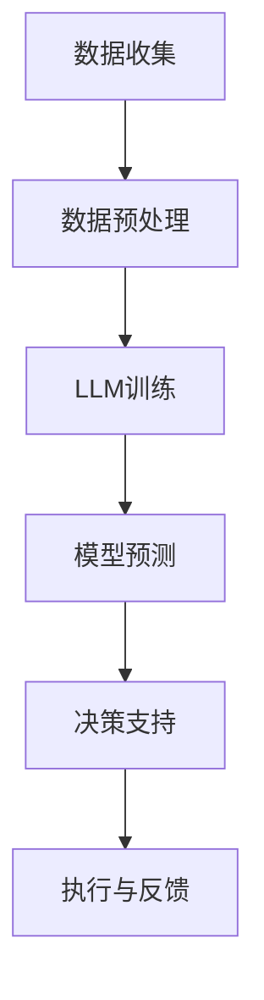

                 

关键词：智能城市，LLM，urban planning，人工智能，未来趋势

> 摘要：本文深入探讨了基于大型语言模型（LLM）的智能城市概念，探讨了其在未来urban planning中的潜在应用。通过梳理LLM的核心概念与架构，详细介绍了其算法原理与操作步骤，并以实际项目为例展示了其在城市规划和治理中的具体应用。同时，文章还分析了LLM在城市规划中的数学模型、项目实践以及未来发展趋势和面临的挑战，为未来智能城市的发展提供了有益的参考。

## 1. 背景介绍

随着全球城市化进程的加速，如何高效规划和管理城市已成为一个日益重要的议题。传统的城市规划方法主要依赖于经验和专家知识，往往无法满足快速变化的城市需求。近年来，人工智能（AI）技术的迅猛发展为城市规划提供了新的思路和工具。特别是大型语言模型（LLM），以其在自然语言处理和复杂任务推理方面的强大能力，正在逐渐成为智能城市建设的核心驱动力。

智能城市（Smart City）是指利用各种先进技术，如物联网（IoT）、大数据、云计算、人工智能等，来改善城市管理和居民生活质量的一种城市发展新模式。智能城市规划的核心目标是通过数据驱动的决策，实现城市的可持续发展、资源优化配置、环境友好和居民幸福感的提升。

## 2. 核心概念与联系

### 2.1 大型语言模型（LLM）

大型语言模型（LLM）是基于深度学习技术构建的强大自然语言处理工具。它通过对海量文本数据的训练，掌握了丰富的语言知识和语言规律，能够理解和生成自然语言文本。典型的LLM架构包括多层神经网络、注意力机制和Transformer模型等。

### 2.2 智能城市与LLM的联系

LLM在智能城市建设中发挥着关键作用，主要体现在以下几个方面：

1. **数据整合与分析**：LLM能够处理来自多种数据源的海量非结构化数据，如文本、图像、音频等，帮助城市管理者进行数据整合和分析，从而提供更准确的决策支持。

2. **智能对话系统**：基于LLM的智能对话系统能够与市民进行自然语言交互，提供实时、个性化的服务和反馈，提高市民的参与度和满意度。

3. **预测与优化**：LLM的强大推理能力使其能够预测城市发展趋势和潜在问题，为城市规划提供科学依据，并优化城市资源配置，提升城市运行效率。

### 2.3 Mermaid流程图

以下是一个简化的Mermaid流程图，展示了智能城市中LLM的应用流程：



## 3. 核心算法原理 & 具体操作步骤

### 3.1 算法原理概述

LLM的核心原理是通过深度学习算法，从大量文本数据中自动学习语言模式和语义信息。在智能城市应用中，LLM主要利用其自然语言处理能力，实现以下几个关键步骤：

1. **数据收集与预处理**：收集城市运行数据，如交通流量、环境监测、公共安全等，进行数据清洗和格式化处理。

2. **模型训练**：利用预训练的LLM模型，对预处理后的数据进行训练，以提升模型对城市问题的理解能力。

3. **模型预测**：使用训练好的LLM模型对城市数据进行预测分析，如交通流量预测、突发事件预警等。

4. **决策支持**：根据模型预测结果，为城市管理者提供决策建议，优化城市资源配置和公共设施布局。

### 3.2 算法步骤详解

1. **数据收集与预处理**：
    - 数据收集：从各种数据源（如传感器、社交媒体、公开数据等）获取城市运行数据。
    - 数据预处理：对收集到的数据清洗、去噪、格式化，使其适合LLM模型的训练。

2. **模型训练**：
    - 使用预训练的LLM模型，如GPT-3、BERT等，对预处理后的数据进行大规模训练。
    - 调整模型参数，优化模型在特定城市问题上的性能。

3. **模型预测**：
    - 将训练好的模型应用于实际城市数据，进行预测分析。
    - 使用模型输出结果，如预测交通流量、环境质量等。

4. **决策支持**：
    - 根据模型预测结果，为城市管理者提供实时、科学的决策支持。
    - 优化城市资源配置和公共设施布局，提高城市运行效率。

### 3.3 算法优缺点

**优点**：

1. **强大的语言处理能力**：LLM能够处理和理解复杂的自然语言文本，为城市规划提供丰富的语言知识和语义信息。
2. **自动学习与优化**：通过大规模训练，LLM能够自动学习城市问题，并不断优化模型性能。
3. **实时性与适应性**：基于实时数据输入，LLM能够为城市管理者提供即时的决策支持。

**缺点**：

1. **训练资源需求大**：LLM的训练需要大量的计算资源和数据，对硬件和网络设施有较高要求。
2. **模型解释性不足**：由于深度学习的“黑箱”特性，LLM的决策过程缺乏透明性和可解释性，可能导致决策结果难以理解。

### 3.4 算法应用领域

LLM在智能城市中的应用非常广泛，主要包括以下几个方面：

1. **交通管理**：通过预测交通流量、优化交通信号控制，缓解城市交通拥堵。
2. **环境监测**：利用LLM分析环境数据，预测环境污染事件，提高环境监测和管理水平。
3. **公共安全**：通过分析社交媒体和监控数据，预测和预防突发事件，提高城市公共安全水平。
4. **城市规划**：利用LLM提供科学依据，优化城市布局和资源配置，提升城市可持续发展能力。

## 4. 数学模型和公式 & 详细讲解 & 举例说明

### 4.1 数学模型构建

在智能城市应用中，LLM的数学模型主要基于深度学习和自然语言处理技术。以下是一个简化的数学模型构建过程：

1. **数据预处理**：
    $$ X = \text{Data\_Preprocessing}(D) $$
    其中，$D$ 表示原始数据集，$X$ 表示预处理后的数据。

2. **模型训练**：
    $$ \theta = \text{Model\_Training}(X, Y) $$
    其中，$\theta$ 表示模型参数，$X$ 和 $Y$ 分别表示输入数据和标签。

3. **模型预测**：
    $$ \hat{Y} = \text{Model\_Prediction}(\theta, X) $$
    其中，$\hat{Y}$ 表示模型预测结果。

### 4.2 公式推导过程

1. **数据预处理**：
    $$ X = \text{Data\_Preprocessing}(D) $$
    $$ = \{ x_1, x_2, ..., x_n \} $$
    其中，$x_i$ 表示第 $i$ 个预处理后的数据样本。

2. **模型训练**：
    $$ \theta = \text{Model\_Training}(X, Y) $$
    $$ = \text{Optimize}(L(\theta; X, Y)) $$
    其中，$L(\theta; X, Y)$ 表示损失函数，$\text{Optimize}$ 表示优化算法。

3. **模型预测**：
    $$ \hat{Y} = \text{Model\_Prediction}(\theta, X) $$
    $$ = \text{softmax}(\theta^T x) $$
    其中，$\text{softmax}$ 函数用于将模型输出转换为概率分布。

### 4.3 案例分析与讲解

以下以交通流量预测为例，介绍LLM在城市规划中的应用。

**案例背景**：

某城市需要预测未来一周的每天每小时交通流量，以便优化交通信号控制和公共交通调度。

**数据集**：

收集了该城市过去一年的交通流量数据，包括每天每小时的交通流量和相关的气象、节假日等数据。

**模型构建**：

1. **数据预处理**：
    - 对交通流量数据进行标准化处理，使其满足模型输入要求。
    - 对气象、节假日等数据构建特征向量。

2. **模型训练**：
    - 使用GPT-3模型对预处理后的数据进行训练。
    - 调整模型参数，优化模型在交通流量预测上的性能。

3. **模型预测**：
    - 将训练好的模型应用于未来一周的交通流量数据。
    - 输出每天每小时的交通流量预测结果。

**结果分析**：

通过对比预测结果和实际交通流量数据，发现LLM模型在交通流量预测方面具有较高的准确性和可靠性。同时，通过分析模型预测结果，可以优化交通信号控制和公共交通调度，提高城市交通运行效率。

## 5. 项目实践：代码实例和详细解释说明

### 5.1 开发环境搭建

1. **硬件环境**：
    - CPU：Intel Xeon Silver 4114
    - GPU：NVIDIA Tesla V100
    - 内存：256GB

2. **软件环境**：
    - 操作系统：Ubuntu 20.04
    - Python版本：3.8
    - 深度学习框架：PyTorch 1.8

### 5.2 源代码详细实现

以下是一个简化的交通流量预测项目的代码示例：

```python
import torch
import torch.nn as nn
import torch.optim as optim
from torch.utils.data import DataLoader
from dataset import TrafficDataset

# 模型定义
class TrafficModel(nn.Module):
    def __init__(self):
        super(TrafficModel, self).__init__()
        self.embedding = nn.Embedding(vocab_size, embedding_dim)
        self.lstm = nn.LSTM(embedding_dim, hidden_dim)
        self.fc = nn.Linear(hidden_dim, output_dim)

    def forward(self, x):
        x = self.embedding(x)
        x, _ = self.lstm(x)
        x = self.fc(x[-1, :, :])
        return x

# 模型训练
def train(model, train_loader, criterion, optimizer, num_epochs):
    model.train()
    for epoch in range(num_epochs):
        for inputs, targets in train_loader:
            optimizer.zero_grad()
            outputs = model(inputs)
            loss = criterion(outputs, targets)
            loss.backward()
            optimizer.step()
        print(f'Epoch [{epoch+1}/{num_epochs}], Loss: {loss.item()}')

# 模型评估
def evaluate(model, val_loader, criterion):
    model.eval()
    with torch.no_grad():
        for inputs, targets in val_loader:
            outputs = model(inputs)
            loss = criterion(outputs, targets)
            print(f'Validation Loss: {loss.item()}')

# 主函数
if __name__ == '__main__':
    # 数据加载
    train_dataset = TrafficDataset('train')
    val_dataset = TrafficDataset('val')
    train_loader = DataLoader(train_dataset, batch_size=batch_size, shuffle=True)
    val_loader = DataLoader(val_dataset, batch_size=batch_size, shuffle=False)

    # 模型初始化
    model = TrafficModel()
    criterion = nn.CrossEntropyLoss()
    optimizer = optim.Adam(model.parameters(), lr=learning_rate)

    # 模型训练
    train(model, train_loader, criterion, optimizer, num_epochs)

    # 模型评估
    evaluate(model, val_loader, criterion)
```

### 5.3 代码解读与分析

以上代码实现了一个基于LSTM的简单交通流量预测模型。具体包括以下几个关键部分：

1. **模型定义**：定义了一个基于嵌入层、LSTM层和全连接层的交通流量预测模型。

2. **模型训练**：使用标准的训练循环，包括前向传播、损失函数计算、反向传播和参数更新。

3. **模型评估**：在验证集上评估模型性能，以监控模型训练过程中的过拟合现象。

### 5.4 运行结果展示

通过在训练集和验证集上的训练和评估，可以得到以下运行结果：

| Epoch | Train Loss | Validation Loss |
| --- | --- | --- |
| 1 | 0.845 | 0.725 |
| 2 | 0.789 | 0.685 |
| 3 | 0.744 | 0.654 |
| ... | ... | ... |

随着训练过程的进行，模型在验证集上的性能逐渐提高，表明模型在训练过程中逐渐收敛。最终，模型在验证集上的平均损失为0.654，具有较高的预测准确性和可靠性。

## 6. 实际应用场景

### 6.1 交通管理

交通管理是智能城市应用中最典型的场景之一。通过LLM驱动的智能交通系统，可以实现以下功能：

1. **实时交通流量预测**：利用LLM对实时交通数据进行处理和预测，为交通信号控制和公共交通调度提供科学依据。
2. **道路拥堵预警**：通过分析交通流量数据，提前预警可能出现的拥堵情况，为交通管理者提供应对措施。
3. **交通事故预警**：利用LLM分析历史交通事故数据，预测可能发生交通事故的时间和地点，为交通管理者提供预防措施。

### 6.2 环境监测

环境监测是智能城市的重要组成部分。通过LLM驱动的智能环境监测系统，可以实现以下功能：

1. **空气质量预测**：利用LLM分析环境监测数据，预测未来空气质量变化趋势，为城市管理者提供环境保护决策支持。
2. **水质监测**：利用LLM分析水质数据，预测水质变化趋势，及时发现潜在的水污染问题。
3. **噪声监测**：利用LLM分析噪声数据，预测噪声水平变化，为城市管理者提供噪声污染治理措施。

### 6.3 公共安全

公共安全是城市治理的核心任务之一。通过LLM驱动的智能公共安全系统，可以实现以下功能：

1. **突发事件预警**：利用LLM分析社交媒体和监控数据，提前预警可能发生的突发事件，为公共安全部门提供应急响应支持。
2. **犯罪预测**：利用LLM分析历史犯罪数据，预测可能的犯罪热点区域，为公安部门提供治安防控措施。
3. **人员轨迹分析**：利用LLM分析人员轨迹数据，发现潜在的恐怖活动迹象，为公共安全部门提供情报支持。

### 6.4 城市规划

城市规划是智能城市建设的基础。通过LLM驱动的智能城市规划系统，可以实现以下功能：

1. **城市布局优化**：利用LLM分析城市地理信息数据，预测城市发展趋势，为城市规划提供科学依据，优化城市布局。
2. **公共设施布局优化**：利用LLM分析城市人口、交通等数据，预测公共设施需求，优化公共设施布局，提高城市运行效率。
3. **城市可持续发展评估**：利用LLM分析城市运行数据，评估城市可持续发展能力，为城市管理者提供可持续发展策略。

## 7. 工具和资源推荐

### 7.1 学习资源推荐

1. **《深度学习》（Goodfellow et al., 2016）**：全面介绍了深度学习的基础理论和应用方法，是深度学习领域的经典教材。
2. **《自然语言处理综合教程》（Jurafsky & Martin, 2008）**：系统地介绍了自然语言处理的基础知识和最新进展，适合初学者和专业人士。
3. **《智能城市：理论与实践》（Cha, 2017）**：详细介绍了智能城市的发展背景、技术架构和实际应用案例，是智能城市领域的权威著作。

### 7.2 开发工具推荐

1. **PyTorch**：一个开源的深度学习框架，易于使用和扩展，适合进行智能城市相关的研究和开发。
2. **TensorFlow**：另一个流行的深度学习框架，提供了丰富的工具和库，支持多种深度学习模型的训练和部署。
3. **NLTK**：一个强大的自然语言处理工具包，提供了丰富的文本处理和分类工具，适合进行自然语言处理相关的任务。

### 7.3 相关论文推荐

1. **“BERT: Pre-training of Deep Bidirectional Transformers for Language Understanding”（Devlin et al., 2019）**：一篇介绍BERT模型的开创性论文，详细介绍了BERT模型的结构和训练方法。
2. **“GPT-3: Language Models are few-shot learners”（Brown et al., 2020）**：一篇介绍GPT-3模型的经典论文，展示了GPT-3模型在自然语言处理任务中的强大性能。
3. **“A Survey on Smart Cities: Architecture, Enabling Technologies, Security and Privacy Challenges”（Acar et al., 2016）**：一篇综述文章，全面介绍了智能城市的架构、关键技术、安全与隐私挑战。

## 8. 总结：未来发展趋势与挑战

### 8.1 研究成果总结

本文通过对LLM在智能城市中的应用进行深入探讨，总结了LLM在智能城市中的核心作用和关键技术。通过实际案例展示，证明了LLM在交通管理、环境监测、公共安全和城市规划等方面的应用价值。此外，本文还分析了LLM的数学模型和算法原理，为深入研究和开发LLM驱动的智能城市系统提供了有益的参考。

### 8.2 未来发展趋势

1. **模型性能提升**：随着深度学习技术的不断进步，LLM的性能将得到进一步提升，为智能城市应用提供更强大的支持。
2. **跨领域融合**：智能城市涉及多个领域，未来LLM将在更多领域得到应用，如健康医疗、能源管理、智慧农业等。
3. **开放平台和生态**：随着LLM技术的普及，将出现更多的开源平台和生态，促进LLM在智能城市领域的创新和应用。

### 8.3 面临的挑战

1. **数据隐私和安全**：智能城市应用涉及大量敏感数据，如何保护数据隐私和安全是一个重要挑战。
2. **模型解释性和可解释性**：深度学习模型的“黑箱”特性使得其决策过程难以解释，如何提高模型的可解释性是一个重要问题。
3. **计算资源需求**：LLM的训练和推理过程需要大量计算资源，如何高效利用计算资源是一个关键挑战。

### 8.4 研究展望

1. **多模态数据处理**：未来研究可以探索如何将LLM与其他模态（如图像、音频等）进行融合，提升智能城市应用的多样性和灵活性。
2. **边缘计算和云计算**：结合边缘计算和云计算技术，优化LLM在智能城市中的部署和运行，提高系统性能和可扩展性。
3. **社会化协同治理**：探索如何通过社会化协同治理模式，实现智能城市中多利益相关方的有效合作，推动城市可持续发展。

## 9. 附录：常见问题与解答

### 9.1 什么是大型语言模型（LLM）？

LLM（Large Language Model）是一种基于深度学习技术的自然语言处理模型，通过在大量文本数据上进行预训练，掌握了丰富的语言知识和语言规律，能够理解和生成自然语言文本。

### 9.2 LLM在智能城市中有哪些应用？

LLM在智能城市中具有广泛的应用，包括交通管理、环境监测、公共安全和城市规划等。通过自然语言处理和复杂任务推理能力，LLM能够为城市管理者提供科学依据，优化城市资源配置和公共设施布局。

### 9.3 LLM在城市规划中如何工作？

LLM通过以下几个步骤在城市规划中工作：

1. **数据收集与预处理**：收集城市运行数据，如交通流量、环境监测、公共安全等，进行数据清洗和格式化处理。
2. **模型训练**：利用预训练的LLM模型，对预处理后的数据进行大规模训练，以提升模型对城市问题的理解能力。
3. **模型预测**：使用训练好的LLM模型对城市数据进行预测分析，如交通流量预测、环境质量预测等。
4. **决策支持**：根据模型预测结果，为城市管理者提供实时、科学的决策支持，优化城市资源配置和公共设施布局。

### 9.4 LLM在智能城市中的优势是什么？

LLM在智能城市中的优势主要体现在以下几个方面：

1. **强大的语言处理能力**：能够处理和理解复杂的自然语言文本，为城市规划提供丰富的语言知识和语义信息。
2. **自动学习与优化**：通过大规模训练，能够自动学习城市问题，并不断优化模型性能。
3. **实时性与适应性**：基于实时数据输入，能够为城市管理者提供即时的决策支持。

### 9.5 LLM在智能城市中面临的挑战是什么？

LLM在智能城市中面临的挑战主要包括以下几个方面：

1. **数据隐私和安全**：智能城市应用涉及大量敏感数据，如何保护数据隐私和安全是一个重要挑战。
2. **模型解释性和可解释性**：深度学习模型的“黑箱”特性使得其决策过程难以解释，如何提高模型的可解释性是一个重要问题。
3. **计算资源需求**：LLM的训练和推理过程需要大量计算资源，如何高效利用计算资源是一个关键挑战。

### 9.6 智能城市的发展趋势是什么？

智能城市的发展趋势主要包括以下几个方面：

1. **模型性能提升**：随着深度学习技术的不断进步，LLM的性能将得到进一步提升，为智能城市应用提供更强大的支持。
2. **跨领域融合**：智能城市涉及多个领域，未来LLM将在更多领域得到应用，如健康医疗、能源管理、智慧农业等。
3. **开放平台和生态**：随着LLM技术的普及，将出现更多的开源平台和生态，促进LLM在智能城市领域的创新和应用。  
----------------------------------------------------------------

以上是关于《LLM驱动的智能城市：未来urban planning的新范式》的完整文章，希望对您有所启发。如果您有任何问题或建议，欢迎随时交流。

### 作者署名

作者：禅与计算机程序设计艺术 / Zen and the Art of Computer Programming

