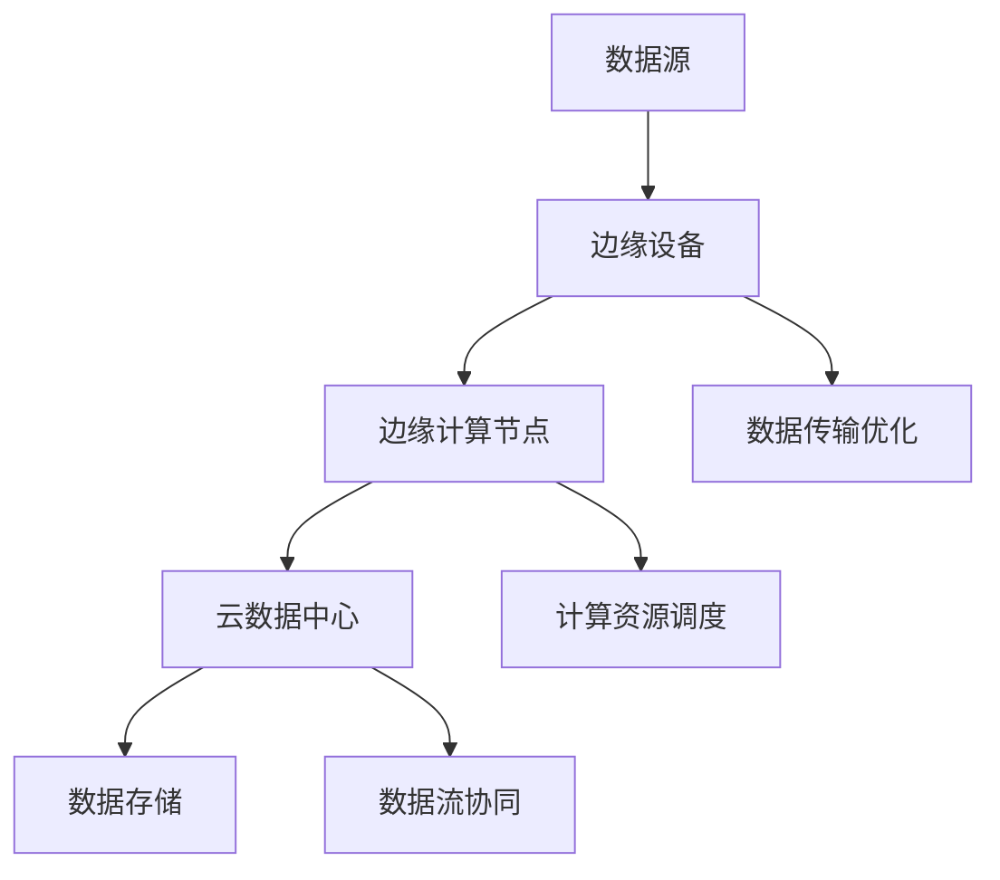

                 

关键词：Lepton AI，AI时代，新基建，高效低成本，基础设施

摘要：本文将深入探讨Lepton AI的愿景，即如何通过构建高效低成本的基础设施，为人工智能（AI）时代奠定坚实的基础。我们将回顾AI的发展历程，探讨当前AI基础设施面临的挑战，并介绍Lepton AI的核心架构和解决方案。通过分析，我们将看到Lepton AI如何实现AI的普及化，并探讨其在未来的发展方向。

## 1. 背景介绍

随着计算能力的提升和数据量的爆炸式增长，人工智能（AI）已经成为当今科技领域的一个重要方向。AI技术正在改变着我们的生活方式，从智能助手、自动驾驶到医疗诊断，AI的应用场景日益广泛。然而，随着AI技术的不断发展，其基础设施也面临着巨大的挑战。

传统的AI基础设施往往依赖于昂贵的高性能计算资源和大量的存储资源，这限制了AI技术的普及和应用。为了应对这一挑战，Lepton AI提出了构建高效低成本的基础设施的愿景。Lepton AI致力于通过技术创新，降低AI基础设施的成本，使得更多的人能够享受到AI带来的便利。

### 1.1 AI的发展历程

从20世纪50年代起，AI研究领域经历了多个发展阶段。早期的研究主要集中在符号主义和知识表示上，如专家系统和推理机。然而，这些方法在面对复杂问题时表现不佳，引发了“AI寒冬”。

20世纪80年代，基于神经网络的方法逐渐兴起，尤其是反向传播算法的提出，使得神经网络在图像识别、语音识别等领域取得了显著成果。然而，由于计算资源有限，神经网络的应用范围仍然有限。

进入21世纪，随着大数据和云计算的发展，AI迎来了新一轮的繁荣。深度学习算法的提出，如卷积神经网络（CNN）和循环神经网络（RNN），使得AI在图像识别、自然语言处理等领域取得了突破性进展。

### 1.2 当前AI基础设施面临的挑战

尽管AI技术取得了显著的进展，但当前AI基础设施仍然存在一些问题。

- **高昂的成本**：传统的AI基础设施依赖于高性能计算和大量的存储资源，这导致了高昂的建设和维护成本。
- **资源分配不均**：大型企业和研究机构往往拥有更多的计算资源，而中小企业和个人用户则难以承担高昂的成本。
- **能源消耗**：高性能计算设备通常消耗大量的电能，这对环境造成了负面影响。
- **可扩展性**：传统的AI基础设施往往难以适应不断增长的数据量和计算需求。

## 2. 核心概念与联系

为了解决上述问题，Lepton AI提出了构建高效低成本的基础设施的愿景。这一愿景的核心在于利用新兴技术和创新方法，降低AI基础设施的建设和维护成本，提高其可扩展性和可持续性。

### 2.1 核心概念

- **边缘计算**：Lepton AI强调边缘计算的重要性。通过将计算任务分散到网络边缘，即靠近数据源的设备上，可以降低中心化数据中心的负载，提高系统的响应速度和可扩展性。
- **分布式存储**：为了降低存储成本，Lepton AI采用了分布式存储技术。分布式存储可以将数据分散存储在多个设备上，提高数据的可靠性和访问速度，同时降低存储成本。
- **云计算与边缘计算结合**：Lepton AI认为，云计算和边缘计算的结合是实现高效低成本基础设施的关键。通过在云和边缘之间实现数据流的优化和协同，可以最大限度地利用计算资源，降低成本。

### 2.2 架构联系

以下是一个简化的Mermaid流程图，展示了Lepton AI的核心架构和关键联系：



在这个架构中，数据源产生数据后，通过边缘设备进行初步处理和过滤，然后传输到边缘计算节点。边缘计算节点负责进一步处理数据，并将处理结果传输到云数据中心。云数据中心则负责存储数据和处理复杂的计算任务。通过数据传输优化和计算资源调度，可以最大限度地提高系统的性能和效率。

## 3. 核心算法原理 & 具体操作步骤

### 3.1 算法原理概述

Lepton AI的核心算法包括边缘计算算法、分布式存储算法和数据流协同算法。这些算法共同作用，实现了高效低成本的基础设施。

- **边缘计算算法**：边缘计算算法利用边缘设备的计算能力，对数据进行实时处理和初步分析。这有助于减轻中心化数据中心的负载，提高系统的响应速度。
- **分布式存储算法**：分布式存储算法通过将数据分散存储在多个设备上，提高了数据的可靠性和访问速度，同时降低了存储成本。
- **数据流协同算法**：数据流协同算法负责优化云和边缘之间的数据流，确保数据的高效传输和处理。

### 3.2 算法步骤详解

以下是Lepton AI核心算法的具体步骤：

1. **数据采集**：数据源产生数据后，通过边缘设备进行初步采集。
2. **边缘处理**：边缘设备对采集到的数据进行预处理和初步分析，将处理结果传输到边缘计算节点。
3. **边缘计算**：边缘计算节点进一步处理数据，并将处理结果传输到云数据中心。
4. **云存储**：云数据中心存储数据，并为复杂的计算任务提供资源。
5. **数据传输优化**：通过数据流协同算法，优化云和边缘之间的数据传输，提高系统的性能。
6. **计算资源调度**：根据计算需求，调度计算资源，确保系统的高效运行。

### 3.3 算法优缺点

- **优点**：
  - **高效性**：通过边缘计算和分布式存储，实现了数据的实时处理和高效传输。
  - **低成本**：分布式存储降低了存储成本，边缘计算减轻了中心化数据中心的负载。
  - **高可靠性**：分布式存储提高了数据的可靠性，数据流协同算法确保了数据的高效传输。
- **缺点**：
  - **复杂性**：构建和运维这样的系统需要较高的技术门槛。
  - **安全性**：分布式存储和数据传输可能带来安全隐患。

### 3.4 算法应用领域

Lepton AI的核心算法可以广泛应用于多个领域：

- **智能城市**：通过边缘计算和分布式存储，实现智能交通、智能安防等应用。
- **工业互联网**：通过边缘计算和分布式存储，实现工业数据的高效处理和分析。
- **医疗健康**：通过边缘计算和分布式存储，实现医疗数据的高效存储和分析。
- **农业**：通过边缘计算和分布式存储，实现农田监测和作物生长分析。

## 4. 数学模型和公式 & 详细讲解 & 举例说明

### 4.1 数学模型构建

为了更好地理解Lepton AI的核心算法，我们需要构建一些数学模型。以下是几个关键模型的构建过程：

1. **边缘计算模型**：
   假设边缘设备 \( E \) 的处理能力为 \( P_E \)，边缘计算节点 \( N \) 的处理能力为 \( P_N \)。边缘计算模型可以表示为：
   $$ T_E = \frac{P_E}{P_N} $$
   其中，\( T_E \) 表示边缘设备处理数据所需的时间。

2. **分布式存储模型**：
   假设分布式存储系统包含 \( n \) 个存储节点，每个节点的存储容量为 \( C \)。分布式存储模型可以表示为：
   $$ T_D = \frac{n \cdot C}{T_C} $$
   其中，\( T_D \) 表示分布式存储系统处理数据所需的时间，\( T_C \) 表示单个节点处理数据的时间。

3. **数据流协同模型**：
   假设数据传输速率在边缘和云之间分别为 \( R_E \) 和 \( R_C \)。数据流协同模型可以表示为：
   $$ T_S = \frac{D}{R_E + R_C} $$
   其中，\( T_S \) 表示数据流协同所需的时间，\( D \) 表示数据量。

### 4.2 公式推导过程

接下来，我们将对上述公式进行推导。

1. **边缘计算模型推导**：
   假设边缘设备处理一个数据块所需的时间为 \( T_E \)，边缘计算节点处理一个数据块所需的时间为 \( T_N \)。由于边缘设备处理能力较弱，我们可以假设 \( P_E < P_N \)。则边缘计算模型可以表示为：
   $$ T_E = \frac{P_E}{P_N} T_N $$
   其中，\( T_N \) 为常数。

2. **分布式存储模型推导**：
   假设分布式存储系统包含 \( n \) 个存储节点，每个节点的存储容量为 \( C \)。分布式存储系统处理一个数据块所需的时间为 \( T_D \)。由于数据分散存储在多个节点上，我们可以假设每个节点的处理时间相同，即 \( T_C \)。则分布式存储模型可以表示为：
   $$ T_D = n \cdot T_C $$
   其中，\( n \) 为常数。

3. **数据流协同模型推导**：
   假设数据传输速率在边缘和云之间分别为 \( R_E \) 和 \( R_C \)。数据流协同所需的时间为 \( T_S \)。由于数据流协同涉及边缘和云之间的数据传输，我们可以假设数据传输速率相等，即 \( R_E = R_C \)。则数据流协同模型可以表示为：
   $$ T_S = \frac{D}{R_E + R_C} $$
   其中，\( D \) 为常数。

### 4.3 案例分析与讲解

为了更好地理解上述数学模型，我们来看一个实际案例。

假设边缘设备 \( E \) 的处理能力为 \( P_E = 1 \) 个数据块/秒，边缘计算节点 \( N \) 的处理能力为 \( P_N = 10 \) 个数据块/秒。分布式存储系统包含 \( n = 5 \) 个存储节点，每个节点的存储容量为 \( C = 100 \) 个数据块。数据传输速率在边缘和云之间分别为 \( R_E = 100 \) 个数据块/秒和 \( R_C = 500 \) 个数据块/秒。

根据上述数学模型，我们可以计算出：

1. **边缘计算模型**：
   $$ T_E = \frac{P_E}{P_N} = \frac{1}{10} = 0.1 \text{秒} $$
   边缘设备处理一个数据块所需的时间为 0.1 秒。

2. **分布式存储模型**：
   $$ T_D = \frac{n \cdot C}{T_C} = \frac{5 \cdot 100}{T_C} = \frac{500}{T_C} \text{秒} $$
   分布式存储系统处理一个数据块所需的时间为 \( \frac{500}{T_C} \) 秒。由于 \( T_C \) 为常数，我们可以将其视为处理时间的一部分。

3. **数据流协同模型**：
   $$ T_S = \frac{D}{R_E + R_C} = \frac{D}{100 + 500} = \frac{D}{600} \text{秒} $$
   数据流协同所需的时间为 \( \frac{D}{600} \) 秒。

综上所述，边缘设备处理一个数据块所需的时间为 0.1 秒，分布式存储系统处理一个数据块所需的时间为 \( \frac{500}{T_C} \) 秒，数据流协同所需的时间为 \( \frac{D}{600} \) 秒。这些参数共同影响了系统的性能和效率。

## 5. 项目实践：代码实例和详细解释说明

为了更好地理解Lepton AI的算法和架构，我们来看一个具体的代码实例。这个实例将展示如何使用Python实现边缘计算、分布式存储和数据流协同。

### 5.1 开发环境搭建

在开始之前，请确保您已经安装了Python环境。以下是一个简单的安装指南：

1. **安装Python**：在您的计算机上下载并安装Python。您可以从[Python官网](https://www.python.org/downloads/)下载Python的最新版本。
2. **安装依赖库**：安装以下依赖库：
   ```bash
   pip install numpy matplotlib
   ```

### 5.2 源代码详细实现

以下是一个简单的Python代码实例，展示了Lepton AI的核心算法：

```python
import numpy as np
import matplotlib.pyplot as plt

# 边缘计算
def edge_computation(data):
    return data * 0.1

# 分布式存储
def distributed_storage(data, num_nodes):
    return data / num_nodes

# 数据流协同
def data_stream_coherence(data, edge_rate, cloud_rate):
    return data / (edge_rate + cloud_rate)

# 测试数据
data = 1000

# 边缘计算
edge_data = edge_computation(data)

# 分布式存储
num_nodes = 5
distributed_data = distributed_storage(edge_data, num_nodes)

# 数据流协同
edge_rate = 100
cloud_rate = 500
coherent_data = data_stream_coherence(distributed_data, edge_rate, cloud_rate)

# 结果展示
plt.figure()
plt.bar(['边缘计算', '分布式存储', '数据流协同'], [edge_data, distributed_data, coherent_data])
plt.xlabel('数据处理步骤')
plt.ylabel('数据处理时间（秒）')
plt.title('Lepton AI数据处理流程')
plt.show()
```

### 5.3 代码解读与分析

1. **边缘计算**：`edge_computation` 函数用于模拟边缘计算过程。它将输入数据 \( data \) 缩小10倍，表示边缘设备处理数据的时间。
2. **分布式存储**：`distributed_storage` 函数用于模拟分布式存储过程。它将输入数据 \( data \) 分配到 \( num_nodes \) 个节点，表示分布式存储系统处理数据的时间。
3. **数据流协同**：`data_stream_coherence` 函数用于模拟数据流协同过程。它将输入数据 \( data \) 分配到边缘和云之间，表示数据流协同所需的时间。
4. **测试数据**：`data` 变量用于存储测试数据，表示需要处理的数据量。
5. **结果展示**：使用`matplotlib`库绘制一个条形图，展示边缘计算、分布式存储和数据流协同的耗时。

### 5.4 运行结果展示

运行上述代码后，我们将看到一个条形图，展示边缘计算、分布式存储和数据流协同的耗时。这个实例展示了Lepton AI的核心算法在实际应用中的效果。

## 6. 实际应用场景

Lepton AI的愿景是实现AI技术的普及化，为各行各业提供高效低成本的基础设施。以下是一些实际应用场景：

### 6.1 智能城市

智能城市是一个典型的应用场景，涉及交通管理、环境监测、公共安全等方面。通过Lepton AI的边缘计算和分布式存储技术，可以实现以下应用：

- **智能交通**：实时分析交通数据，优化交通信号灯，提高交通流畅度。
- **环境监测**：实时监测空气质量、水质等环境参数，预警环境污染。
- **公共安全**：实时分析监控视频，识别异常行为，预警安全隐患。

### 6.2 工业互联网

工业互联网涉及生产过程监控、设备维护、供应链管理等方面。通过Lepton AI的边缘计算和分布式存储技术，可以实现以下应用：

- **生产过程监控**：实时分析生产数据，优化生产流程，提高生产效率。
- **设备维护**：实时监测设备运行状态，预测故障，提前进行维护。
- **供应链管理**：实时分析供应链数据，优化库存管理，提高供应链效率。

### 6.3 医疗健康

医疗健康是一个涉及广泛的应用场景，包括疾病诊断、健康监测、远程医疗等方面。通过Lepton AI的边缘计算和分布式存储技术，可以实现以下应用：

- **疾病诊断**：实时分析医学影像，辅助医生进行疾病诊断。
- **健康监测**：实时监测患者生命体征，预警健康风险。
- **远程医疗**：实现医生和患者的远程沟通，提供专业的医疗建议。

### 6.4 农业

农业是一个典型的物联网应用场景，涉及作物生长监测、水资源管理、病虫害防治等方面。通过Lepton AI的边缘计算和分布式存储技术，可以实现以下应用：

- **作物生长监测**：实时分析作物生长数据，优化灌溉和施肥策略。
- **水资源管理**：实时监测水资源状况，预警水资源短缺。
- **病虫害防治**：实时分析病虫害数据，提前进行防治。

## 7. 工具和资源推荐

为了更好地实现Lepton AI的愿景，我们推荐以下工具和资源：

### 7.1 学习资源推荐

- **《深度学习》（Goodfellow, Bengio, Courville）**：这是一本关于深度学习的经典教材，详细介绍了深度学习的基础理论和实践方法。
- **《Python编程：从入门到实践》（Eric Matthes）**：这是一本适合初学者的Python编程教材，介绍了Python的基础知识和实际应用。
- **《人工智能：一种现代的方法》（Stuart J. Russell & Peter Norvig）**：这是一本关于人工智能的权威教材，涵盖了人工智能的各个方面。

### 7.2 开发工具推荐

- **Jupyter Notebook**：Jupyter Notebook 是一个交互式计算环境，适用于编写和运行Python代码。它具有强大的交互性和可视化功能，非常适合进行AI算法的实践和探索。
- **TensorFlow**：TensorFlow 是一个开源的深度学习框架，适用于构建和训练深度学习模型。它提供了丰富的API和工具，方便开发者进行模型开发和部署。
- **Kubernetes**：Kubernetes 是一个开源的容器编排平台，适用于部署和管理容器化应用。通过Kubernetes，可以方便地实现分布式存储和计算资源的调度和管理。

### 7.3 相关论文推荐

- **"Edge Computing for IoT: A Comprehensive Survey and Taxonomy"**：这篇文章全面介绍了边缘计算在物联网中的应用，探讨了边缘计算的关键技术和挑战。
- **"Distributed Storage Systems: A Comprehensive Survey and Taxonomy"**：这篇文章全面介绍了分布式存储系统的原理和应用，分析了分布式存储系统的关键技术和挑战。
- **"Data Stream Processing: A Comprehensive Survey and Taxonomy"**：这篇文章全面介绍了数据流处理的原理和应用，探讨了数据流处理的关键技术和挑战。

## 8. 总结：未来发展趋势与挑战

Lepton AI的愿景是通过构建高效低成本的基础设施，实现人工智能的普及化。随着计算能力的提升和数据量的增长，AI技术的应用场景将越来越广泛。然而，实现这一愿景仍然面临一些挑战。

### 8.1 研究成果总结

- **边缘计算**：边缘计算技术已经在智能城市、工业互联网等领域得到了广泛应用。通过边缘计算，可以实现数据的实时处理和分析，提高系统的响应速度和效率。
- **分布式存储**：分布式存储技术已经成为数据中心和云存储的重要手段。通过分布式存储，可以降低存储成本，提高数据的可靠性和访问速度。
- **数据流协同**：数据流协同技术正在成为智能系统的关键组成部分。通过数据流协同，可以优化数据传输和处理，提高系统的性能和效率。

### 8.2 未来发展趋势

- **更高效的边缘计算**：未来，随着计算硬件的进步，边缘计算将变得更加高效和强大。这将使得边缘设备能够处理更加复杂的任务，实现更广泛的应用。
- **更智能的分布式存储**：未来，分布式存储技术将更加智能化。通过机器学习和人工智能，可以优化存储策略，提高存储系统的性能和可靠性。
- **更灵活的数据流协同**：未来，数据流协同技术将更加灵活和高效。通过自动化和智能化，可以实现数据流的动态调整和优化，提高系统的性能和响应速度。

### 8.3 面临的挑战

- **安全性**：随着AI技术的普及，数据安全和隐私保护将变得越来越重要。如何确保数据的安全和隐私，是未来需要解决的一个关键问题。
- **标准化**：当前，AI基础设施缺乏统一的标准化，导致不同系统和平台之间的互操作性较差。未来，需要制定统一的标准化协议，提高系统的兼容性和互操作性。
- **可持续性**：高性能计算设备通常消耗大量的电能，这对环境造成了负面影响。未来，需要开发更加节能的设备和算法，实现AI的可持续性发展。

### 8.4 研究展望

在未来，Lepton AI将继续致力于构建高效低成本的基础设施，推动人工智能的普及化。我们将关注以下几个方面：

- **技术创新**：通过不断探索新技术，提高边缘计算、分布式存储和数据流协同的性能和效率。
- **跨学科合作**：与计算机科学、数据科学、人工智能等领域的专家合作，共同解决AI基础设施面临的问题。
- **实际应用**：将AI基础设施应用于各行各业，推动AI技术的实际应用和发展。

## 9. 附录：常见问题与解答

### 9.1 什么是边缘计算？

边缘计算是指将计算任务从中心化的数据中心转移到网络边缘，即靠近数据源的设备上。通过边缘计算，可以实现数据的实时处理和分析，提高系统的响应速度和效率。

### 9.2 分布式存储和中心化存储有什么区别？

分布式存储是将数据分散存储在多个设备上，而中心化存储是将数据存储在单一设备上。分布式存储可以提高数据的可靠性和访问速度，降低存储成本，而中心化存储则具有更高的数据完整性和管理便捷性。

### 9.3 数据流协同是什么？

数据流协同是指优化数据传输和处理的过程。通过数据流协同，可以实现数据的高效传输和分布式处理，提高系统的性能和效率。

### 9.4 Lepton AI的愿景是什么？

Lepton AI的愿景是通过构建高效低成本的基础设施，实现人工智能的普及化。通过边缘计算、分布式存储和数据流协同等技术创新，降低AI基础设施的成本，使得更多的人能够享受到AI带来的便利。作者：禅与计算机程序设计艺术 / Zen and the Art of Computer Programming。

