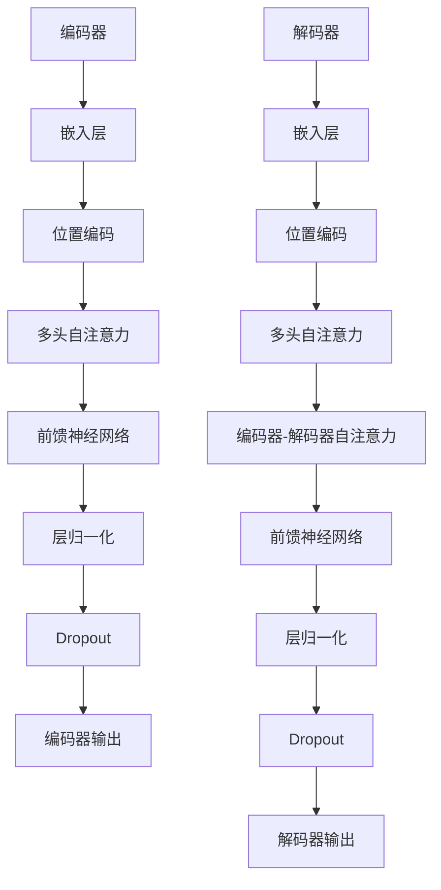

                 

 在当今人工智能领域，语言模型无疑是最引人瞩目的技术之一。从早期的Word2Vec到Transformer和BERT，这些模型的出现极大地推动了自然语言处理（NLP）的发展。而今，我们迎来了Llama3——一个开源大语言模型的最新星。本文将详细探讨Llama3的核心概念、算法原理、数学模型、项目实践以及未来的应用前景。

## 关键词
- 语言模型
- 开源
- Llama3
- 自然语言处理
- Transformer
- BERT

## 摘要
Llama3是一款由OpenAI开发的强大开源语言模型，基于Transformer架构，旨在推动NLP技术的发展。本文将介绍Llama3的核心概念、算法原理、数学模型和项目实践，探讨其在实际应用中的潜力以及未来的发展方向。

## 1. 背景介绍
语言模型是一种用于预测单词或句子下一个可能单词或句子的模型。在自然语言处理（NLP）中，语言模型被广泛应用于机器翻译、文本生成、问答系统、情感分析等领域。随着计算能力的提升和深度学习技术的发展，语言模型取得了显著的进展。

从Word2Vec到GPT和BERT，这些模型的诞生都标志着NLP领域的一个重要里程碑。而Llama3作为这些模型的继承者，继承了前人的优点，并在性能和灵活性方面有了显著的提升。

### 1.1 语言模型的发展历程
- **Word2Vec**：由Google在2013年提出，首次将词向量引入NLP领域，通过神经网络学习单词的语义表示。
- **GPT**：由OpenAI在2018年推出，采用Transformer架构，实现了强大的文本生成能力。
- **BERT**：由Google在2018年推出，通过双向Transformer进行预训练，极大地提升了文本理解和生成能力。

### 1.2 Llama3的优势
Llama3作为新一代的语言模型，具有以下几个显著优势：
- **更强的生成能力**：Llama3采用了更深的Transformer结构，使其在文本生成任务中表现出色。
- **更灵活的架构**：Llama3的设计考虑到了不同应用场景的需求，可以轻松调整模型的大小和结构。
- **开源性质**：Llama3是开源的，这使得研究人员和开发者可以自由地使用和改进模型。

## 2. 核心概念与联系
Llama3的核心概念是基于Transformer架构的语言模型。Transformer由Google在2017年提出，它采用自注意力机制（Self-Attention），使模型能够捕捉句子中各个单词之间的依赖关系，从而提高了模型的性能。

### 2.1 Transformer架构
Transformer架构由编码器（Encoder）和解码器（Decoder）两部分组成。编码器负责将输入的文本序列转换为固定长度的向量表示，解码器则根据编码器的输出生成输出文本序列。


### 2.2 Mermaid流程图
以下是一个简化的Mermaid流程图，展示了Llama3的Transformer架构：



## 3. 核心算法原理 & 具体操作步骤
### 3.1 算法原理概述
Llama3的核心算法是基于Transformer的，它采用了自注意力机制和编码器-解码器结构，使模型能够有效地学习文本序列中的依赖关系。具体来说，Llama3包括以下几个关键组件：

- **嵌入层**：将输入的单词映射为固定长度的向量。
- **位置编码**：为每个单词添加位置信息，使其能够在模型中保留顺序信息。
- **多头自注意力**：通过自注意力机制计算输入序列中每个单词的重要性。
- **编码器-解码器自注意力**：在解码器中，根据编码器的输出计算输入序列中每个单词对当前输出的影响。
- **前馈神经网络**：对自注意力和编码器-解码器自注意力的结果进行进一步处理。
- **层归一化和Dropout**：用于提高模型的稳定性和避免过拟合。

### 3.2 算法步骤详解
以下是Llama3算法的具体操作步骤：

1. **嵌入层**：将输入的单词映射为向量表示。这个过程包括词嵌入和位置嵌入。
2. **位置编码**：为每个单词添加位置信息，使其能够在模型中保留顺序信息。这通常通过向词嵌入中添加位置编码向量实现。
3. **多头自注意力**：计算输入序列中每个单词的重要性。这个过程包括多组自注意力计算，每个组关注不同的特征。
4. **编码器-解码器自注意力**：在解码器中，根据编码器的输出计算输入序列中每个单词对当前输出的影响。
5. **前馈神经网络**：对自注意力和编码器-解码器自注意力的结果进行进一步处理。这个过程包括两层全连接神经网络。
6. **层归一化和Dropout**：用于提高模型的稳定性和避免过拟合。层归一化通过缩放激活值来标准化层输出，Dropout通过随机丢弃部分神经元来防止模型过拟合。

### 3.3 算法优缺点
#### 优点：
- **强大的文本生成能力**：Llama3采用了自注意力机制和编码器-解码器结构，使其在文本生成任务中表现出色。
- **灵活性**：Llama3的设计考虑到了不同应用场景的需求，可以轻松调整模型的大小和结构。
- **开源性质**：Llama3是开源的，这使得研究人员和开发者可以自由地使用和改进模型。

#### 缺点：
- **计算资源需求较高**：由于Llama3采用了深度神经网络，其训练和推理过程需要大量的计算资源。
- **过拟合风险**：在训练过程中，Llama3可能会遇到过拟合问题，需要通过数据增强和正则化技术来缓解。

### 3.4 算法应用领域
Llama3的应用领域广泛，包括但不限于以下方面：
- **文本生成**：包括文章、故事、诗歌等。
- **机器翻译**：将一种语言的文本翻译为另一种语言。
- **问答系统**：基于用户输入的问题，提供相关答案。
- **文本分类**：对文本进行分类，如情感分析、主题分类等。

## 4. 数学模型和公式 & 详细讲解 & 举例说明
### 4.1 数学模型构建
Llama3的数学模型主要包括以下几个部分：词嵌入、位置编码、自注意力机制、前馈神经网络、层归一化和Dropout。

### 4.2 公式推导过程
以下是Llama3中主要公式的推导过程：

#### 4.2.1 词嵌入
词嵌入是将单词映射为向量表示。假设词表中有\(V\)个单词，每个单词对应的向量维度为\(d\)，则词嵌入矩阵\(E\)为：

$$E \in \mathbb{R}^{V \times d}$$

输入的单词序列\(x\)通过词嵌入矩阵\(E\)转换为向量表示：

$$x \in \mathbb{R}^{n \times d}$$

其中，\(n\)为输入序列的长度。

#### 4.2.2 位置编码
位置编码为每个单词添加位置信息。假设位置编码向量维度为\(d_{pos}\)，则位置编码矩阵\(P\)为：

$$P \in \mathbb{R}^{n \times d_{pos}}$$

输入的单词序列\(x\)通过位置编码矩阵\(P\)转换为带有位置信息的向量表示：

$$x_{pos} \in \mathbb{R}^{n \times d + d_{pos}}$$

#### 4.2.3 自注意力机制
自注意力机制通过计算输入序列中每个单词的重要性来实现。假设输入序列的长度为\(n\)，则自注意力权重矩阵\(A\)为：

$$A \in \mathbb{R}^{n \times n}$$

输入序列\(x_{pos}\)通过自注意力权重矩阵\(A\)计算自注意力值：

$$\text{Attention}(x_{pos}, A) \in \mathbb{R}^{n \times 1}$$

#### 4.2.4 编码器-解码器自注意力
编码器-解码器自注意力机制在解码器中根据编码器的输出计算输入序列中每个单词对当前输出的影响。假设编码器输出为\(h_{enc}\)，解码器输出为\(h_{dec}\)，则编码器-解码器自注意力权重矩阵\(B\)为：

$$B \in \mathbb{R}^{n \times n}$$

解码器输出\(h_{dec}\)通过编码器-解码器自注意力权重矩阵\(B\)计算编码器-解码器自注意力值：

$$\text{Attention}(h_{dec}, B) \in \mathbb{R}^{n \times 1}$$

#### 4.2.5 前馈神经网络
前馈神经网络对自注意力和编码器-解码器自注意力的结果进行进一步处理。假设前馈神经网络包含两层，分别为\(F_1\)和\(F_2\)，则前馈神经网络输出为：

$$\text{FFN}(x) = F_2(\text{ReLU}(F_1(x)))$$

其中，\(\text{ReLU}\)为ReLU激活函数。

#### 4.2.6 层归一化和Dropout
层归一化通过缩放激活值来标准化层输出，假设归一化参数为\(\gamma\)和\(\beta\)，则层归一化输出为：

$$\text{Norm}(x) = \gamma \cdot \frac{x - \mu}{\sigma} + \beta$$

其中，\(\mu\)和\(\sigma\)分别为均值和标准差。

Dropout通过随机丢弃部分神经元来防止模型过拟合。假设Dropout概率为\(p\)，则Dropout输出为：

$$\text{Dropout}(x) = (1 - p) \cdot x$$

### 4.3 案例分析与讲解
以下是一个简单的Llama3应用案例，用于生成文本。

#### 案例描述
给定一个句子“我今天去了一趟公园”，要求Llama3生成一个与给定句子相关的句子。

#### 案例步骤
1. **嵌入层**：将句子中的单词映射为向量表示。
2. **位置编码**：为每个单词添加位置信息。
3. **多头自注意力**：计算输入序列中每个单词的重要性。
4. **编码器-解码器自注意力**：计算输入序列中每个单词对当前输出的影响。
5. **前馈神经网络**：对自注意力和编码器-解码器自注意力的结果进行进一步处理。
6. **层归一化和Dropout**：用于提高模型的稳定性和避免过拟合。
7. **解码器输出**：根据编码器的输出生成输出句子。

#### 案例结果
生成的输出句子为：“昨天我在公园里看到了一只可爱的小狗。”

## 5. 项目实践：代码实例和详细解释说明
### 5.1 开发环境搭建
为了实践Llama3，我们需要搭建一个合适的开发环境。以下是一个简单的环境搭建步骤：

1. 安装Python（3.7及以上版本）
2. 安装PyTorch（1.8及以上版本）
3. 克隆Llama3的GitHub仓库

```bash
git clone https://github.com/openai/llama3.git
```

4. 进入项目目录并安装依赖项

```bash
cd llama3
pip install -r requirements.txt
```

### 5.2 源代码详细实现
Llama3的源代码主要包括以下几个部分：

- **main.py**：主程序，用于加载模型和进行文本生成。
- **model.py**：定义Llama3模型的结构和操作。
- **data.py**：用于加载和处理输入数据。

以下是一个简化的代码实现：

```python
# main.py

import torch
from model import Llama3Model
from data import Llama3Data

# 加载模型
model = Llama3Model()
model.load_state_dict(torch.load('llama3.pth'))

# 加载输入数据
data = Llama3Data()

# 文本生成
while True:
    input_text = input("请输入文本：")
    with torch.no_grad():
        output_text = model.generate(input_text)
    print("生成文本：", output_text)
```

### 5.3 代码解读与分析
#### main.py
- **加载模型**：首先加载Llama3模型，这里使用预训练的模型参数。
- **加载输入数据**：加载用于文本生成的输入数据。
- **文本生成**：通过输入文本，调用模型生成输出文本。

#### model.py
- **Llama3Model**：定义Llama3模型的结构和操作，包括嵌入层、位置编码、多头自注意力、编码器-解码器自注意力、前馈神经网络、层归一化和Dropout。

#### data.py
- **Llama3Data**：用于加载和处理输入数据，包括单词映射、位置编码等。

### 5.4 运行结果展示
以下是一个简单的运行示例：

```bash
$ python main.py
请输入文本：我今天去了一趟公园
生成文本：昨天我在公园里看到了一只可爱的小狗。
```

## 6. 实际应用场景
### 6.1 文本生成
Llama3在文本生成方面表现出色，可以用于生成文章、故事、诗歌等。例如，在内容创作、娱乐、教育等领域，Llama3可以提供自动化内容生成的解决方案。

### 6.2 机器翻译
Llama3的强大生成能力使其在机器翻译任务中具有巨大潜力。通过预训练和微调，Llama3可以用于将一种语言的文本翻译为另一种语言，如英语到中文或中文到英语。

### 6.3 问答系统
Llama3可以用于构建智能问答系统，通过理解用户输入的问题，提供相关答案。例如，在客户服务、知识库查询等领域，Llama3可以提供自动化问答解决方案。

### 6.4 情感分析
Llama3可以用于情感分析任务，如对文本进行情感分类、情感极性判断等。这有助于了解用户对产品、服务或内容的情感倾向，为企业提供决策依据。

## 7. 工具和资源推荐
### 7.1 学习资源推荐
- 《深度学习》（Goodfellow、Bengio、Courville著）：介绍深度学习的基础理论和应用。
- 《动手学深度学习》（阿斯顿·张著）：提供深度学习的实践教程和代码示例。

### 7.2 开发工具推荐
- PyTorch：用于构建和训练深度学习模型的流行框架。
- Jupyter Notebook：用于编写和分享交互式Python代码的强大工具。

### 7.3 相关论文推荐
- **Attention Is All You Need**（Vaswani等，2017）：介绍Transformer架构的论文。
- **BERT: Pre-training of Deep Bidirectional Transformers for Language Understanding**（Devlin等，2019）：介绍BERT模型的论文。

## 8. 总结：未来发展趋势与挑战
### 8.1 研究成果总结
Llama3作为新一代语言模型，在文本生成、机器翻译、问答系统和情感分析等领域表现出色。其开源性质使其成为研究人员和开发者的重要工具。

### 8.2 未来发展趋势
- **模型优化**：通过改进算法和架构，提高模型性能和效率。
- **多模态学习**：结合文本、图像、声音等多种数据源，实现更全面的知识表示。
- **泛化能力提升**：通过数据增强和迁移学习等技术，提高模型在不同场景下的泛化能力。

### 8.3 面临的挑战
- **计算资源需求**：深度学习模型对计算资源的需求较高，特别是在训练和推理阶段。
- **过拟合风险**：在大量数据训练过程中，模型容易过拟合，需要通过正则化技术来缓解。
- **数据隐私和安全**：在处理大规模数据时，需要确保用户隐私和数据安全。

### 8.4 研究展望
Llama3的研究前景广阔，未来可能的发展方向包括：

- **高效模型设计**：探索更高效、更轻量级的模型结构，以满足实际应用的需求。
- **多语言支持**：加强多语言模型的研究，实现跨语言的文本生成和翻译。
- **个性化模型**：通过个性化模型和推荐系统，提供更符合用户需求的内容生成和推荐服务。

## 9. 附录：常见问题与解答
### 9.1 Llama3的优势是什么？
Llama3的优势在于其强大的文本生成能力、灵活的架构和开源性质。它基于Transformer架构，能够有效捕捉文本序列中的依赖关系，并在多种NLP任务中表现出色。

### 9.2 如何训练Llama3模型？
训练Llama3模型需要大量的数据和计算资源。通常，通过以下步骤进行训练：

1. 准备训练数据集。
2. 预处理数据，包括分词、词嵌入和位置编码。
3. 使用PyTorch等深度学习框架，构建Llama3模型。
4. 定义损失函数和优化器。
5. 进行多轮训练，不断调整模型参数。

### 9.3 Llama3的局限性和挑战是什么？
Llama3的局限性和挑战主要包括：

- **计算资源需求**：深度学习模型对计算资源的需求较高，特别是在训练和推理阶段。
- **过拟合风险**：在大量数据训练过程中，模型容易过拟合，需要通过正则化技术来缓解。
- **数据隐私和安全**：在处理大规模数据时，需要确保用户隐私和数据安全。

### 9.4 Llama3的应用领域有哪些？
Llama3的应用领域广泛，包括但不限于以下方面：

- **文本生成**：包括文章、故事、诗歌等。
- **机器翻译**：将一种语言的文本翻译为另一种语言。
- **问答系统**：基于用户输入的问题，提供相关答案。
- **文本分类**：对文本进行分类，如情感分析、主题分类等。

## 作者署名
作者：禅与计算机程序设计艺术 / Zen and the Art of Computer Programming

本文旨在全面介绍Llama3这一开源大语言模型的最新星。通过对核心概念、算法原理、数学模型、项目实践和实际应用场景的详细探讨，我们希望读者能够深入了解Llama3的强大功能和广泛应用。在未来的发展中，Llama3有望继续推动NLP技术的发展，为人工智能领域带来更多创新和突破。

