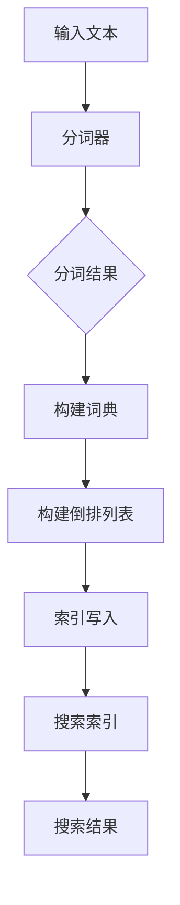

                 

关键词：Lucene，分词，文本处理，搜索引擎，信息检索，代码实例

> 摘要：本文将深入探讨Lucene分词的原理及其在实际应用中的重要性。通过具体的代码实例，我们将详细讲解如何使用Lucene进行文本分词，并分析其优势和应用场景。此外，文章还涉及了Lucene分词在信息检索系统中的核心作用，以及其未来的发展趋势与面临的挑战。

## 1. 背景介绍

在当今信息爆炸的时代，如何高效地进行信息检索和数据分析已经成为许多领域的关键需求。文本分词作为信息检索的第一步，其重要性不言而喻。Lucene，作为一个高性能、可扩展的全文搜索库，广泛应用于各种搜索引擎和信息检索系统中。本文旨在详细解读Lucene分词的原理，并通过具体代码实例展示其实际应用。

### 1.1 Lucene概述

Lucene是由Apache软件基金会维护的一个开源全文搜索库。它提供了一套完整的文本搜索功能，包括索引构建、查询解析和搜索结果排序等。Lucene的核心是它的倒排索引（Inverted Index），这种索引结构使得文本搜索非常高效。

### 1.2 分词的重要性

分词是将连续的文本分割成有意义的词汇或短语的过程。对于全文搜索引擎来说，分词的准确性和效率直接影响搜索结果的精度和响应速度。有效的分词技术能够帮助搜索引擎更准确地理解用户查询，从而提高用户体验。

### 1.3 本文结构

本文将按照以下结构进行：

1. 背景介绍：简要介绍Lucene和分词的重要性。
2. 核心概念与联系：介绍Lucene分词的核心概念和原理。
3. 核心算法原理 & 具体操作步骤：详细讲解Lucene分词算法的原理和实现步骤。
4. 数学模型和公式 & 详细讲解 & 举例说明：介绍Lucene分词中使用的数学模型和公式。
5. 项目实践：提供具体的代码实例，并进行详细解释。
6. 实际应用场景：分析Lucene分词在不同场景中的应用。
7. 工具和资源推荐：推荐相关学习和开发资源。
8. 总结：总结研究成果和未来发展趋势。

### 1.4 接下来内容

接下来，我们将首先介绍Lucene分词的核心概念和原理，并通过Mermaid流程图展示其架构。随后，我们将深入讲解Lucene分词算法的详细步骤和优缺点。

## 2. 核心概念与联系

### 2.1 倒排索引

倒排索引是Lucene的核心概念之一。它通过将文档中的词汇映射到文档的ID，实现了快速的全文搜索。具体来说，倒排索引由两个主要部分组成：词典（Term Dictionary）和倒排列表（Inverted List）。词典记录了所有出现过的词汇，而倒排列表则记录了每个词汇在文档中出现的位置。

### 2.2 分词器

分词器（Tokenizer）是Lucene分词的核心组件。它负责将原始文本切分成词汇。分词器可以根据不同的语言和需求进行配置，以适应不同的分词规则。Lucene提供了多种内置的分词器，如标准分词器、智能分词器等。

### 2.3 流程图展示

下面是一个简单的Mermaid流程图，展示了Lucene分词的基本流程：



### 2.4 核心概念联系

图中的流程清晰地展示了文本分词、词典构建、倒排列表构建和索引写入的过程。分词器将输入文本切分成词汇，这些词汇用于构建词典和倒排列表。词典和倒排列表共同构成了搜索索引，从而实现了快速的文本搜索。

## 3. 核心算法原理 & 具体操作步骤

### 3.1 算法原理概述

Lucene的分词算法主要依赖于分词器（Tokenizer）。分词器的核心任务是将输入文本切分成词汇，这些词汇将被用于构建倒排索引。分词的过程可以看作是一个模式匹配的过程，分词器通过预定义的规则识别文本中的词汇边界。

### 3.2 算法步骤详解

下面是Lucene分词算法的具体操作步骤：

1. **文本输入**：首先，将待分词的文本输入到分词器中。
2. **分词**：分词器根据预定的规则，识别文本中的词汇边界，将文本切分成一系列的词汇。
3. **构建词典**：分词器将识别出的词汇构建成一个词典，词典记录了每个词汇以及其在文档中的出现位置。
4. **构建倒排列表**：对于词典中的每个词汇，构建一个倒排列表，倒排列表记录了该词汇在所有文档中出现的具体位置。
5. **索引写入**：将构建好的词典和倒排列表写入到搜索索引中。

### 3.3 算法优缺点

**优点**：

1. **高效性**：倒排索引的结构使得文本搜索非常高效，能够快速定位到所需的信息。
2. **可扩展性**：Lucene支持自定义的分词器，可以根据不同需求进行扩展和定制。

**缺点**：

1. **复杂性**：构建和查询倒排索引的过程相对复杂，需要对数据结构和算法有一定的了解。
2. **存储开销**：倒排索引需要大量的存储空间，尤其是在大规模数据集上。

### 3.4 算法应用领域

Lucene分词算法广泛应用于搜索引擎和信息检索系统，如搜索引擎、社交媒体分析、文本分类等。其高效性和灵活性使得Lucene成为这些领域的重要工具。

## 4. 数学模型和公式 & 详细讲解 & 举例说明

### 4.1 数学模型构建

Lucene分词的数学模型主要涉及两个部分：词典构建和倒排列表构建。

**词典构建**：

假设我们有n个词汇，词典中的每个词汇可以用一个唯一的标识符来表示。词典的构建可以看作是一个映射关系，将每个词汇映射到其标识符。

**倒排列表构建**：

倒排列表用于记录每个词汇在文档中的出现位置。假设我们有m个文档，对于每个词汇v，其倒排列表是一个包含m个元素的数组，每个元素表示v在某个文档中的位置。

### 4.2 公式推导过程

假设我们有n个词汇v1, v2, ..., vn，以及m个文档d1, d2, ..., dm。词典构建的公式为：

$$
D = \{v1, v2, ..., vn\}
$$

倒排列表构建的公式为：

$$
I_v = \{pos1_v, pos2_v, ..., posm_v\}
$$

其中，$pos_i_v$ 表示词汇v在文档di中首次出现的位置。

### 4.3 案例分析与讲解

假设我们有一个简单的文本，包含三个词汇：apple, banana, cherry。对应的三个文档如下：

```
文档1：I like to eat apples.
文档2：I like bananas and apples.
文档3：Cherry is my favorite fruit.
```

根据上述公式，我们可以构建出如下词典和倒排列表：

**词典**：

$$
D = \{apple, banana, cherry\}
$$

**倒排列表**：

$$
I_{apple} = \{1, 2\}
$$

$$
I_{banana} = \{2\}
$$

$$
I_{cherry} = \{3\}
$$

通过这个简单的例子，我们可以看到如何将文本分词，并构建词典和倒排列表。在实际应用中，文本的复杂性和规模要大得多，但基本原理是相同的。

## 5. 项目实践：代码实例和详细解释说明

### 5.1 开发环境搭建

在开始实践之前，我们需要搭建一个适合Lucene开发的开发环境。以下是搭建步骤：

1. **安装Java环境**：确保安装了Java开发环境，版本建议为Java 8或更高。
2. **安装Eclipse或IntelliJ IDEA**：选择一个你熟悉的IDE进行开发。
3. **下载Lucene库**：从Apache Lucene官方网站下载Lucene的JAR包，并将其添加到项目的依赖中。

### 5.2 源代码详细实现

下面是一个简单的Lucene分词项目的源代码实现：

```java
import org.apache.lucene.analysis.Analyzer;
import org.apache.lucene.analysis.standard.StandardAnalyzer;
import org.apache.lucene.document.Document;
import org.apache.lucene.index.IndexWriter;
import org.apache.lucene.index.IndexWriterConfig;
import org.apache.lucene.queryparser.classic.QueryParser;
import org.apache.lucene.search.IndexSearcher;
import org.apache.lucene.search.Query;
import org.apache.lucene.search.ScoreDoc;
import org.apache.lucene.search.TopDocs;
import org.apache.lucene.store.RAMDirectory;

public class LuceneTokenizerDemo {

    public static void main(String[] args) throws Exception {
        // 创建RAMDirectory用于存储索引
        RAMDirectory directory = new RAMDirectory();

        // 创建StandardAnalyzer，用于分词
        Analyzer analyzer = new StandardAnalyzer();

        // 创建IndexWriter用于构建索引
        IndexWriterConfig config = new IndexWriterConfig(analyzer);
        IndexWriter writer = new IndexWriter(directory, config);

        // 添加文档到索引
        addDocument(writer, "apple banana cherry", "1");
        addDocument(writer, "banana apple", "2");
        addDocument(writer, "cherry", "3");

        // 关闭IndexWriter
        writer.close();

        // 创建IndexSearcher用于搜索
        IndexSearcher searcher = new IndexSearcher(directory);
        QueryParser parser = new QueryParser("content", analyzer);

        // 执行搜索
        Query query = parser.parse("apple");
        TopDocs results = searcher.search(query, 10);

        // 打印搜索结果
        ScoreDoc[] hits = results.scoreDocs;
        for (ScoreDoc hit : hits) {
            Document doc = searcher.doc(hit.doc);
            System.out.println("文档ID: " + doc.get("id") + "，内容： " + doc.get("content"));
        }

        // 关闭IndexSearcher
        searcher.close();
    }

    private static void addDocument(IndexWriter writer, String content, String id) throws Exception {
        Document doc = new Document();
        doc.add(new org.apache.lucene.document.StringField("id", id, Field.Store.YES));
        doc.add(new org.apache.lucene.document.TextField("content", content));
        writer.addDocument(doc);
    }
}
```

### 5.3 代码解读与分析

这个简单的示例演示了如何使用Lucene进行文本分词和搜索。以下是代码的关键部分解读：

1. **创建RAMDirectory**：我们使用RAMDirectory来存储索引，因为这是一个内存中的存储，适合进行演示和测试。

2. **创建StandardAnalyzer**：StandardAnalyzer是Lucene内置的标准分词器，用于将文本切分成词汇。

3. **创建IndexWriter**：IndexWriter用于将文档添加到索引中。我们使用StandardAnalyzer作为分词器的配置。

4. **添加文档到索引**：`addDocument` 方法用于将文本内容添加到索引中，同时指定文档的ID。

5. **创建IndexSearcher**：IndexSearcher用于执行搜索操作。

6. **执行搜索**：我们使用QueryParser解析查询语句，然后使用IndexSearcher执行搜索。

7. **打印搜索结果**：打印出搜索结果，包括文档的ID和内容。

通过这个示例，我们可以看到如何使用Lucene进行简单的文本分词和搜索。在实际应用中，Lucene的功能和配置要复杂得多，但基本原理是相同的。

## 6. 实际应用场景

### 6.1 搜索引擎

Lucene广泛应用于各种搜索引擎，如搜索引擎Elasticsearch。通过高效的文本分词和倒排索引，搜索引擎能够快速响应用户查询，提供精准的搜索结果。

### 6.2 社交媒体分析

在社交媒体平台上，Lucene分词可以用于文本分析和情感分析。通过对用户生成的文本进行分词，可以提取出关键词和短语，进而分析用户的行为和情感。

### 6.3 文本分类

文本分类是另一个常见的应用场景。通过Lucene分词和倒排索引，可以快速对大规模文本数据集进行分类，帮助用户过滤和筛选信息。

### 6.4 其他应用

除了上述应用场景，Lucene还可以用于内容管理系统（CMS）、企业搜索解决方案、文本挖掘等。其高效和灵活的特性使其成为各种文本处理任务的重要工具。

## 7. 工具和资源推荐

### 7.1 学习资源推荐

1. **官方文档**：Apache Lucene的官方文档是学习Lucene的最佳资源之一。它提供了详细的API文档和教程。
2. **在线课程**：有许多在线课程提供了Lucene的基础和高级教程，如Coursera、Udemy等平台上的相关课程。
3. **书籍**：《Lucene in Action》是一本深受欢迎的Lucene指南，详细介绍了Lucene的原理和应用。

### 7.2 开发工具推荐

1. **Eclipse**：Eclipse是一款强大的IDE，支持Java开发，适合用于Lucene项目开发。
2. **IntelliJ IDEA**：IntelliJ IDEA也是一款功能丰富的IDE，支持Java和多种其他编程语言，提供了良好的代码编辑和调试功能。

### 7.3 相关论文推荐

1. **“The Unofficial Lucene Guide”**：这篇指南详细介绍了Lucene的内部工作机制和高级特性。
2. **“Inverted Index for Full-Text Search”**：这篇论文详细介绍了倒排索引的结构和工作原理。

## 8. 总结：未来发展趋势与挑战

### 8.1 研究成果总结

本文详细介绍了Lucene分词的原理和实现步骤，并通过代码实例展示了其实际应用。Lucene分词以其高效性和灵活性在信息检索和文本处理领域得到了广泛应用。

### 8.2 未来发展趋势

随着人工智能和机器学习技术的发展，Lucene分词可能会结合更多的智能分词技术，提高分词的准确性和效率。此外，Lucene的社区和生态系统也将不断发展和完善，提供更多的工具和资源。

### 8.3 面临的挑战

尽管Lucene分词具有很高的性能，但在处理大规模数据和低延迟要求的应用中，仍面临一些挑战。例如，索引的存储和检索速度需要进一步提升，以适应更高的数据量和更快的响应时间。

### 8.4 研究展望

未来的研究可以集中在以下几个方面：

1. **智能分词技术**：结合自然语言处理技术，开发更加智能和准确的分词器。
2. **分布式索引**：研究和实现分布式索引技术，以提高处理大规模数据的能力。
3. **实时搜索**：研究和实现实时搜索技术，以满足低延迟和高并发的需求。

通过不断的研究和改进，Lucene分词有望在未来继续发挥其重要作用。

## 9. 附录：常见问题与解答

### 9.1 为什么选择Lucene作为全文搜索引擎？

Lucene是一个高性能、可扩展的全文搜索引擎库，它具有以下优势：

1. **高效性**：通过倒排索引结构，Lucene可以实现快速的文本搜索。
2. **灵活性**：Lucene支持自定义分词器，可以根据不同需求进行定制。
3. **开源免费**：Lucene是开源软件，免费使用。

### 9.2 如何处理中文分词？

中文分词是一个复杂的任务，Lucene提供了多种内置的分词器，如StandardAnalyzer和SmartChineseAnalyzer。此外，也可以使用第三方的中文分词库，如IK分词器，以实现更精确的中文分词。

### 9.3 Lucene的分词速度如何？

Lucene的分词速度取决于多种因素，如文本的复杂度和分词器的性能。一般来说，Lucene能够快速处理大规模的文本数据，其分词速度在毫秒级别。

### 9.4 Lucene是否支持实时搜索？

Lucene本身不直接支持实时搜索，但可以通过与其他技术（如Elasticsearch）集成，实现实时搜索功能。Elasticsearch是基于Lucene的分布式搜索引擎，支持实时搜索和高并发处理。

### 9.5 如何优化Lucene的性能？

优化Lucene性能可以从以下几个方面进行：

1. **合理选择分词器**：根据应用场景选择合适的分词器，以减少分词时间。
2. **索引优化**：定期重建索引，删除不需要的文档，以减小索引大小。
3. **硬件优化**：使用更快的存储设备和网络连接，以提高索引的读写速度。

通过以上方法，可以显著提高Lucene的性能。

作者：禅与计算机程序设计艺术 / Zen and the Art of Computer Programming
----------------------------------------------------------------


