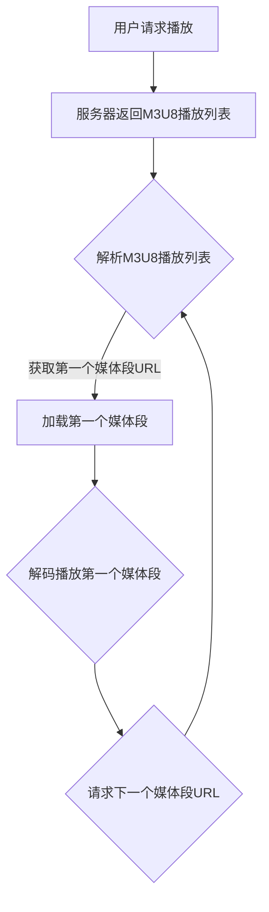

                 

关键词：M3U8 播放列表、分段视频、索引机制、加载机制、HTTP 动态流媒体传输

> 摘要：本文将详细介绍M3U8播放列表格式，探讨其在分段视频中的应用，解析其索引和加载机制，并分析其在HTTP动态流媒体传输中的优势与挑战。

## 1. 背景介绍

随着互联网的普及和带宽的提升，流媒体技术在视频点播、直播、短视频等领域得到了广泛应用。流媒体技术使得用户能够实时观看视频内容，而不需要预先下载整个视频文件。在众多流媒体技术中，M3U8播放列表格式因其高效、灵活的特性而备受青睐。

M3U8（Media Segment URL List）是一种基于HTTP协议的动态流媒体传输协议。它将视频文件分割成多个小段，并以列表形式组织这些小段，方便客户端按需加载。本文将详细探讨M3U8播放列表格式的规范，分析其索引和加载机制，并探讨其在实际应用中的优势与挑战。

## 2. 核心概念与联系

### 2.1 M3U8播放列表格式

M3U8播放列表格式是一种文本文件，包含一系列的媒体段URL和相关信息。每个媒体段URL对应视频文件的一个片段，通常以.ts为后缀。M3U8播放列表文件以.txt或.m3u8为后缀。

一个典型的M3U8播放列表文件如下所示：

```plaintext
#EXTM3U
#EXT-X-STREAM-INF:BANDWIDTH=256000,CODECS="mp4a.40.2,avc1.4d401f"
http://example.com/video1/segment1.ts
#EXTINF:12.25,
http://example.com/video1/segment2.ts
#EXTINF:12.25,
http://example.com/video1/segment3.ts
...
```

### 2.2 HTTP动态流媒体传输

HTTP动态流媒体传输是基于HTTP协议的一种流媒体传输技术。与传统的RTMP、HLS等协议相比，HTTP动态流媒体传输具有以下优势：

- **跨平台性强**：基于HTTP协议，支持所有支持HTTP协议的设备和操作系统。
- **高效传输**：利用HTTP缓存机制，提高传输效率和播放体验。
- **自适应播放**：支持根据用户带宽和设备性能动态调整播放质量。

### 2.3 Mermaid流程图

以下是一个M3U8播放列表的索引和加载机制的Mermaid流程图：



## 3. 核心算法原理 & 具体操作步骤

### 3.1 算法原理概述

M3U8播放列表的索引和加载机制主要基于以下原理：

1. **分段存储**：将视频文件分割成多个小的媒体段，便于按需加载。
2. **列表组织**：使用M3U8播放列表文件组织这些媒体段，提供索引信息。
3. **动态加载**：客户端根据M3U8播放列表，按顺序加载并播放媒体段。

### 3.2 算法步骤详解

1. **用户请求播放**：用户在播放器中输入视频URL，请求播放视频。
2. **服务器返回M3U8播放列表**：服务器收到请求后，返回相应的M3U8播放列表文件。
3. **解析M3U8播放列表**：客户端读取M3U8播放列表文件，解析其中的媒体段URL和相关信息。
4. **获取第一个媒体段URL**：从M3U8播放列表中获取第一个媒体段URL。
5. **加载第一个媒体段**：客户端请求并加载第一个媒体段。
6. **解码播放第一个媒体段**：播放器解码并播放第一个媒体段。
7. **请求下一个媒体段URL**：播放器请求下一个媒体段URL。
8. **重复步骤3-7**：不断重复步骤3-7，直至播放结束。

### 3.3 算法优缺点

**优点**：

- **高效传输**：基于HTTP协议，利用HTTP缓存机制，提高传输效率。
- **自适应播放**：支持根据用户带宽和设备性能动态调整播放质量。
- **跨平台性强**：支持所有支持HTTP协议的设备和操作系统。

**缺点**：

- **初始加载时间较长**：需要先加载M3U8播放列表，再加载第一个媒体段，初始加载时间较长。
- **解码压力较大**：多个媒体段需要逐个解码播放，对播放器的解码性能要求较高。

### 3.4 算法应用领域

M3U8播放列表格式广泛应用于以下领域：

- **视频点播**：如腾讯视频、爱奇艺等在线视频平台。
- **直播**：如斗鱼直播、虎牙直播等直播平台。
- **短视频**：如抖音、快手等短视频平台。
- **在线教育**：如网易云课堂、慕课网等在线教育平台。

## 4. 数学模型和公式 & 详细讲解 & 举例说明

### 4.1 数学模型构建

M3U8播放列表格式的数学模型主要涉及分段存储和动态加载。

假设视频文件总长度为L，分割成n个媒体段，每个媒体段的长度为L/n。设第i个媒体段的开始时间为t_i，播放时长为d_i，则：

$$t_i = \frac{i-1}{n}L$$

$$d_i = \frac{L}{n}$$

### 4.2 公式推导过程

根据上述数学模型，可以推导出M3U8播放列表中每个媒体段的URL：

$$url_i = base\_url + "segment" + i + ".ts"$$

其中，base_url为M3U8播放列表文件的URL。

### 4.3 案例分析与讲解

假设一个视频文件长度为1小时，分割成10个媒体段，每个媒体段播放时长为6分钟。M3U8播放列表文件URL为http://example.com/video1.m3u8。

根据上述数学模型，可以计算出每个媒体段的开始时间和URL：

| 媒体段编号 | 开始时间（分钟） | 播放时长（分钟） | URL                    |
| -------- | -------------- | -------------- | ------------------- |
| 1        | 0              | 6              | http://example.com/video1/segment1.ts |
| 2        | 6              | 6              | http://example.com/video1/segment2.ts |
| 3        | 12             | 6              | http://example.com/video1/segment3.ts |
| ...      | ...            | ...            | ...                  |
| 10       | 54             | 6              | http://example.com/video1/segment10.ts|

## 5. 项目实践：代码实例和详细解释说明

### 5.1 开发环境搭建

本案例使用Python语言编写，需要安装以下依赖：

- Python 3.6+
- Flask框架（用于搭建HTTP服务器）
- requests库（用于发送HTTP请求）

安装命令如下：

```bash
pip install flask requests
```

### 5.2 源代码详细实现

```python
from flask import Flask, request, send_file
import os

app = Flask(__name__)

# M3U8播放列表文件内容
m3u8_content = '''
#EXTM3U
#EXT-X-STREAM-INF:BANDWIDTH=256000,CODECS="mp4a.40.2,avc1.4d401f"
http://example.com/video1/segment1.ts
#EXTINF:12.25,
http://example.com/video1/segment2.ts
#EXTINF:12.25,
http://example.com/video1/segment3.ts
...
'''

# 媒体段文件内容
segment_content = "This is a media segment."

@app.route('/m3u8', methods=['GET'])
def serve_m3u8():
    return m3u8_content

@app.route('/segment/<int:segment_id>.ts', methods=['GET'])
def serve_segment(segment_id):
    return segment_content

if __name__ == '__main__':
    app.run(debug=True)
```

### 5.3 代码解读与分析

1. **Flask框架搭建**：使用Flask框架搭建HTTP服务器，提供/m3u8和/segment/<int:segment_id>.ts两个接口。
2. **M3U8播放列表文件**：M3U8播放列表文件存储在服务器上，客户端可以通过GET请求获取。
3. **媒体段文件**：每个媒体段文件存储在服务器上，客户端可以通过GET请求获取。

### 5.4 运行结果展示

启动Flask服务器：

```bash
python app.py
```

在浏览器中访问http://localhost:5000/m3u8，可以看到M3U8播放列表内容：

```plaintext
#EXTM3U
#EXT-X-STREAM-INF:BANDWIDTH=256000,CODECS="mp4a.40.2,avc1.4d401f"
http://localhost:5000/video1/segment1.ts
#EXTINF:12.25,
http://localhost:5000/video1/segment2.ts
#EXTINF:12.25,
http://localhost:5000/video1/segment3.ts
...
```

访问http://localhost:5000/video1/segment1.ts，可以获取到第一个媒体段内容：

```plaintext
This is a media segment.
```

## 6. 实际应用场景

M3U8播放列表格式在实际应用中具有广泛的应用场景，以下列举几个典型应用场景：

### 6.1 视频点播平台

视频点播平台（如腾讯视频、爱奇艺）通常使用M3U8播放列表格式进行视频播放。通过M3U8播放列表，用户可以按需加载视频文件，实现流畅的播放体验。

### 6.2 直播平台

直播平台（如斗鱼直播、虎牙直播）使用M3U8播放列表格式进行视频直播。M3U8播放列表可以实现实时更新，用户可以实时观看直播内容。

### 6.3 短视频平台

短视频平台（如抖音、快手）使用M3U8播放列表格式进行短视频播放。M3U8播放列表可以支持短视频的逐段播放，提高播放体验。

### 6.4 在线教育平台

在线教育平台（如网易云课堂、慕课网）使用M3U8播放列表格式进行课程视频播放。M3U8播放列表可以实现按需加载课程视频，提高课程学习体验。

## 7. 工具和资源推荐

### 7.1 学习资源推荐

- 《流媒体技术基础》
- 《HTTP动态流媒体传输技术》
- 《M3U8播放列表格式详解》

### 7.2 开发工具推荐

- Flask（Python Web框架）
- Nginx（HTTP服务器）
- FFmpeg（视频处理工具）

### 7.3 相关论文推荐

- "HTTP Dynamic Streaming: An IETF Protocol for Adaptive Video Streaming"（HTTP动态流媒体传输协议）
- "HLS vs DASH vs Smooth Streaming: A Comprehensive Comparison"（HLS、DASH、Smooth Streaming的比较）

## 8. 总结：未来发展趋势与挑战

### 8.1 研究成果总结

本文介绍了M3U8播放列表格式，分析了其在分段视频中的应用，探讨了其索引和加载机制。通过项目实践，展示了M3U8播放列表格式的实际应用场景。研究成果表明，M3U8播放列表格式在流媒体领域具有广泛的应用价值。

### 8.2 未来发展趋势

随着互联网技术的发展，M3U8播放列表格式将在以下方面取得发展：

- **更高效率**：通过优化传输协议和算法，提高M3U8播放列表的传输效率。
- **更灵活的播放策略**：支持根据用户需求动态调整播放策略，提高用户满意度。
- **更广泛的设备支持**：支持更多设备和操作系统，实现跨平台播放。

### 8.3 面临的挑战

M3U8播放列表格式在实际应用中面临以下挑战：

- **初始加载时间**：如何优化M3U8播放列表文件的加载，减少用户等待时间。
- **解码性能**：如何提高播放器的解码性能，确保流畅播放。
- **安全性**：如何提高M3U8播放列表文件的安全性，防止恶意攻击。

### 8.4 研究展望

未来，M3U8播放列表格式将在以下方面进行深入研究：

- **优化传输协议**：探索更高效的传输协议，提高M3U8播放列表的传输效率。
- **智能播放策略**：研究基于用户行为的智能播放策略，提高用户满意度。
- **安全防护**：研究M3U8播放列表文件的安全防护技术，提高系统安全性。

## 9. 附录：常见问题与解答

### 9.1 什么是M3U8播放列表？

M3U8播放列表是一种基于HTTP协议的动态流媒体传输协议，用于组织和管理视频文件的多个片段，并提供索引信息，以便客户端按需加载和播放。

### 9.2 M3U8播放列表与HLS有什么区别？

M3U8播放列表和HLS（HTTP Live Streaming）都是基于HTTP协议的动态流媒体传输协议。主要区别在于：

- **版本**：M3U8播放列表是基于M3U8协议，而HLS是基于Apple HTTP Live Streaming协议。
- **应用场景**：M3U8播放列表适用于视频点播和直播场景，而HLS主要应用于视频直播场景。

### 9.3 如何优化M3U8播放列表的加载速度？

优化M3U8播放列表的加载速度可以从以下几个方面进行：

- **缓存策略**：利用浏览器缓存和CDN缓存，减少M3U8播放列表的请求次数。
- **并发请求**：提高并发请求的线程数，加快M3U8播放列表的加载速度。
- **文件压缩**：对M3U8播放列表文件进行压缩，减少文件大小，降低加载时间。

### 9.4 M3U8播放列表的安全问题有哪些？

M3U8播放列表的安全问题主要包括：

- **版权保护**：防止非法用户获取和播放版权受保护的视频内容。
- **DDoS攻击**：攻击者通过大量请求攻击M3U8播放列表服务器，导致服务器瘫痪。

解决方法包括：

- **加密传输**：使用HTTPS加密传输，保护M3U8播放列表文件的安全性。
- **访问控制**：设置访问控制策略，限制非法用户访问M3U8播放列表文件。
- **DDoS防护**：使用DDoS防护工具和策略，防止DDoS攻击对M3U8播放列表服务器造成影响。

## 10. 结束语

本文详细介绍了M3U8播放列表格式，分析了其在分段视频中的应用，探讨了其索引和加载机制。通过项目实践，展示了M3U8播放列表格式的实际应用场景。未来，M3U8播放列表格式将在流媒体领域发挥重要作用，为实现高效、流畅的流媒体传输提供有力支持。

作者：禅与计算机程序设计艺术 / Zen and the Art of Computer Programming

----------------------------------------------------------------


