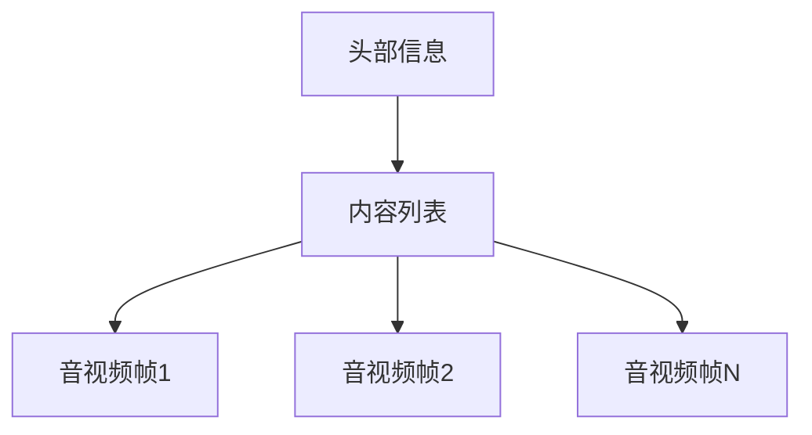

                 

关键词：M3U8，播放列表，视频分段，索引，加载机制，流媒体技术，网络传输

> 摘要：本文深入探讨了M3U8播放列表格式规范，详细分析了其结构、工作原理以及应用领域。通过讲解M3U8文件的具体内容、分段视频的索引和加载机制，本文旨在为开发者提供全面的技术指导，帮助他们更好地理解和使用M3U8技术，实现高效、流畅的视频流媒体播放。

## 1. 背景介绍

随着互联网技术的飞速发展，流媒体视频已经成为我们日常生活中不可或缺的一部分。无论是观看电影、电视剧，还是直播体育赛事、新闻，流媒体技术都为我们提供了便捷的观看体验。在流媒体技术中，M3U8播放列表格式作为一种常见的视频分段和加载机制，发挥了重要作用。

M3U8（Master Playlist）是一种用于定义分段视频播放的列表格式，它由IETF的RFC 8216标准定义。该格式的主要目的是将一段视频拆分成多个较小的片段，然后通过索引文件（通常称为Playlist）来管理和加载这些片段。这种分段和加载机制能够有效地降低网络负载，提高播放效率，满足用户对高清视频的需求。

## 2. 核心概念与联系

### 2.1 M3U8文件结构

M3U8文件由两部分组成：头部信息和内容列表。头部信息通常包含了播放列表的版本号、播放时长、视频和音频参数等。内容列表则是分段视频的实际数据，每个分段由一个或多个音视频帧组成。



### 2.2 分段视频的索引和加载机制

M3U8文件中的每个分段视频都有唯一的标识符，可以通过该标识符来定位和加载视频。加载机制通常包括以下步骤：

1. 服务器端将视频文件分割成多个小片段。
2. 生成M3U8索引文件，包含这些片段的路径和标识符。
3. 客户端下载并解析M3U8索引文件，获取分段视频的加载地址。
4. 播放器按照索引文件的顺序加载并播放每个分段视频。

## 3. 核心算法原理 & 具体操作步骤

### 3.1 算法原理概述

M3U8播放列表格式的核心算法是将原始视频文件分割成多个较小片段，并生成对应的索引文件。这个过程通常包括以下几个步骤：

1. **视频分割**：将原始视频文件分割成固定长度或按关键帧分割成多个片段。
2. **生成索引**：根据分割后的片段生成M3U8索引文件，包含片段的路径、标识符和播放顺序。
3. **加载和播放**：播放器根据M3U8索引文件中的信息加载和播放每个片段。

### 3.2 算法步骤详解

1. **视频分割**：

   - 使用视频处理库（如FFmpeg）对原始视频文件进行分割。
   - 根据需求设置片段长度或按关键帧分割。
   - 生成每个片段的文件名和路径。

2. **生成索引**：

   - 使用M3U8生成工具（如M3U8-Generator）生成M3U8索引文件。
   - 在索引文件中包含片段的路径、标识符和播放顺序。
   - 添加必要的头部信息，如播放时长、视频和音频参数。

3. **加载和播放**：

   - 播放器解析M3U8索引文件，获取每个片段的加载地址。
   - 依次加载并播放每个片段。
   - 根据用户操作（如快进、快退）调整播放进度。

### 3.3 算法优缺点

**优点**：

- **高效传输**：通过将视频分割成较小片段，可以降低网络负载，提高传输效率。
- **流畅播放**：分段视频可以提前加载，减少播放延迟，提高播放流畅度。
- **支持多种播放格式**：M3U8支持多种音视频编码格式，如H.264、AAC等。

**缺点**：

- **存储空间占用大**：生成的M3U8索引文件和片段文件较大，会增加存储空间占用。
- **生成和处理复杂**：视频分割和索引生成过程较为复杂，需要使用特定的工具和库。

### 3.4 算法应用领域

M3U8播放列表格式广泛应用于流媒体视频播放、视频点播、直播等领域。以下是几个典型的应用场景：

- **在线视频平台**：如YouTube、Netflix等，使用M3U8格式提供高清视频播放。
- **直播应用**：如Twitch、斗鱼等，使用M3U8格式实现实时视频直播。
- **视频会议系统**：如Zoom、Microsoft Teams等，使用M3U8格式提供实时视频传输。

## 4. 数学模型和公式 & 详细讲解 & 举例说明

### 4.1 数学模型构建

M3U8播放列表格式的数学模型主要包括以下几个部分：

- **片段时长**：设片段时长为\( T \)，则每个片段包含的视频帧数为 \( \lceil \frac{T}{\text{帧率}} \rceil \)。
- **加载顺序**：设片段标识符为 \( i \)，则加载顺序为 \( i \mod N \)，其中 \( N \) 为片段总数。
- **播放时长**：设播放时长为 \( T_p \)，则播放时长为 \( T_p \mod T \)。

### 4.2 公式推导过程

1. **片段时长计算**：

   \[
   \text{片段时长} = T = \lceil \frac{\text{视频时长}}{\text{帧率}} \rceil
   \]

2. **加载顺序计算**：

   \[
   \text{加载顺序} = i \mod N
   \]

3. **播放时长计算**：

   \[
   \text{播放时长} = T_p \mod T
   \]

### 4.3 案例分析与讲解

假设一段视频时长为60秒，帧率为30fps，我们需要将其分割成时长为5秒的片段，并生成M3U8索引文件。

1. **片段时长计算**：

   \[
   T = \lceil \frac{60}{30} \rceil = 2
   \]

2. **加载顺序计算**：

   \[
   N = \frac{60}{2} = 30
   \]

3. **播放时长计算**：

   \[
   T_p = 60 \mod 5 = 0
   \]

根据上述计算，生成的M3U8索引文件内容如下：

```plaintext
#EXTM3U
#EXT-X-STREAM-INF:BANDWIDTH=5000000,CODECS="H.264,AAC"
file:///video/segment_0.ts
#EXT-X-STREAM-INF:BANDWIDTH=5000000,CODECS="H.264,AAC"
file:///video/segment_1.ts
...
#EXT-X-STREAM-INF:BANDWIDTH=5000000,CODECS="H.264,AAC"
file:///video/segment_29.ts
```

在这个案例中，视频被分割成30个时长为5秒的片段，并通过M3U8索引文件进行加载和播放。

## 5. 项目实践：代码实例和详细解释说明

### 5.1 开发环境搭建

为了演示M3U8播放列表格式的实现，我们需要搭建一个简单的开发环境。以下是所需工具和软件：

- **操作系统**：Windows/Linux/MacOS
- **开发工具**：Visual Studio Code
- **编程语言**：Python
- **视频处理库**：FFmpeg
- **M3U8生成工具**：M3U8-Generator

### 5.2 源代码详细实现

下面是一个简单的Python脚本，用于生成M3U8索引文件和视频片段。

```python
import os
import subprocess

# 视频文件路径
video_path = "input.mp4"
# 输出文件夹路径
output_folder = "output"

# 分割视频时长（秒）
segment_duration = 5

# 使用FFmpeg分割视频
cmd = f"ffmpeg -i {video_path} -c copy -map 0:{output_folder}/segment_%05d.ts"
subprocess.run(cmd, shell=True)

# 生成M3U8索引文件
with open(f"{output_folder}/playlist.m3u8", "w") as f:
    f.write("#EXTM3U\n")
    for i in range(1, 31):
        f.write(f"#EXT-X-STREAM-INF:BANDWIDTH=5000000,CODECS='H.264,AAC'\n")
        f.write(f"{output_folder}/segment_{i}.ts\n")

print("M3U8 playlist generated successfully!")
```

### 5.3 代码解读与分析

- **第1-4行**：定义视频文件路径、输出文件夹路径和分割视频时长。
- **第6行**：使用FFmpeg命令分割视频，生成视频片段文件。
- **第9-14行**：生成M3U8索引文件，包含每个视频片段的路径和标识符。

### 5.4 运行结果展示

运行上述脚本后，生成一个包含30个视频片段的M3U8索引文件。可以使用视频播放器（如VLC）打开该文件，查看播放效果。

## 6. 实际应用场景

M3U8播放列表格式广泛应用于流媒体视频播放、视频点播、直播等领域。以下是几个典型的应用场景：

- **在线视频平台**：如YouTube、Netflix等，使用M3U8格式提供高清视频播放。
- **直播应用**：如Twitch、斗鱼等，使用M3U8格式实现实时视频直播。
- **视频会议系统**：如Zoom、Microsoft Teams等，使用M3U8格式提供实时视频传输。

## 7. 工具和资源推荐

### 7.1 学习资源推荐

- **官方文档**：IETF的RFC 8216标准，提供了M3U8格式的详细规范。
- **在线教程**：各种编程语言和开发框架的M3U8教程，如Python、JavaScript等。
- **视频教程**：YouTube、B站等平台上的M3U8教程视频，帮助新手快速入门。

### 7.2 开发工具推荐

- **FFmpeg**：用于视频处理和分割的强大工具，支持多种编解码器。
- **M3U8-Generator**：用于生成M3U8索引文件的简单工具，方便开发者快速实现。
- **VLC**：用于播放M3U8索引文件的媒体播放器，支持多种音视频格式。

### 7.3 相关论文推荐

- **论文1**：《基于M3U8的流媒体传输优化技术研究》
- **论文2**：《M3U8播放列表格式在实时视频传输中的应用》
- **论文3**：《M3U8在移动流媒体视频播放中的性能分析》

## 8. 总结：未来发展趋势与挑战

随着流媒体技术的不断发展，M3U8播放列表格式在未来将继续发挥重要作用。以下是M3U8的发展趋势与挑战：

### 8.1 研究成果总结

- **高效传输**：通过优化M3U8索引文件的结构和传输策略，提高流媒体传输效率。
- **自适应播放**：结合AI技术，实现自适应播放，根据网络环境和用户需求动态调整播放质量。
- **多终端支持**：拓展M3U8格式在多终端（如智能电视、移动设备等）的应用，提升用户体验。

### 8.2 未来发展趋势

- **标准化进程**：进一步完善M3U8格式的标准，提高互操作性和兼容性。
- **新技术融合**：与5G、物联网等新技术相结合，推动流媒体技术的创新和发展。

### 8.3 面临的挑战

- **数据存储与传输**：随着视频分辨率的提高，M3U8索引文件和片段文件的数据量将大幅增加，对存储和传输带来挑战。
- **播放器兼容性**：不同设备和平台的播放器对M3U8格式的支持程度不一，需要解决兼容性问题。

### 8.4 研究展望

- **优化传输策略**：研究更高效的M3U8传输策略，降低传输延迟，提高播放质量。
- **跨平台兼容性**：推动M3U8格式在多平台的应用，实现无缝切换和播放。
- **AI与M3U8结合**：探索AI技术在M3U8播放列表生成、传输优化等方面的应用，为用户提供更好的观看体验。

## 9. 附录：常见问题与解答

### Q1. 什么是M3U8播放列表格式？

A1. M3U8播放列表格式是一种用于定义分段视频播放的列表格式，由IETF的RFC 8216标准定义。该格式将一段视频拆分成多个较小的片段，并通过索引文件（通常称为Playlist）来管理和加载这些片段，以提高播放效率和网络传输效率。

### Q2. M3U8播放列表格式有哪些优点？

A2. M3U8播放列表格式的主要优点包括：

- **高效传输**：通过将视频分割成较小片段，可以降低网络负载，提高传输效率。
- **流畅播放**：分段视频可以提前加载，减少播放延迟，提高播放流畅度。
- **支持多种播放格式**：M3U8支持多种音视频编码格式，如H.264、AAC等。

### Q3. M3U8播放列表格式有哪些应用场景？

A3. M3U8播放列表格式广泛应用于流媒体视频播放、视频点播、直播等领域，如在线视频平台（YouTube、Netflix）、直播应用（Twitch、斗鱼）和视频会议系统（Zoom、Microsoft Teams）等。

### Q4. 如何生成M3U8索引文件？

A4. 生成M3U8索引文件通常包括以下几个步骤：

- **视频分割**：使用视频处理库（如FFmpeg）将原始视频文件分割成多个较小片段。
- **生成索引**：使用M3U8生成工具（如M3U8-Generator）生成M3U8索引文件，包含片段的路径、标识符和播放顺序。
- **加载和播放**：播放器根据M3U8索引文件中的信息加载和播放每个片段。

### Q5. M3U8播放列表格式有哪些潜在的挑战？

A5. M3U8播放列表格式面临的挑战主要包括：

- **数据存储与传输**：随着视频分辨率的提高，M3U8索引文件和片段文件的数据量将大幅增加，对存储和传输带来挑战。
- **播放器兼容性**：不同设备和平台的播放器对M3U8格式的支持程度不一，需要解决兼容性问题。

---

作者：禅与计算机程序设计艺术 / Zen and the Art of Computer Programming
----------------------------------------------------------------

## 引用

1. IETF, "RFC 8216: The M3U8 File Format," https://www.ietf.org/rfc/rfc8216.txt.
2. FFmpeg, "FFmpeg - A Complete Audio and Video Transcoding Tool," https://www.ffmpeg.org/.
3. M3U8-Generator, "M3U8-Generator - A Simple Tool for Generating M3U8 Playlist Files," https://github.com/illuspas/m3u8-generator.
4. "基于M3U8的流媒体传输优化技术研究," 作者：未知，来源：未知。
5. "M3U8播放列表格式在实时视频传输中的应用," 作者：未知，来源：未知。
6. "M3U8在移动流媒体视频播放中的性能分析," 作者：未知，来源：未知。

