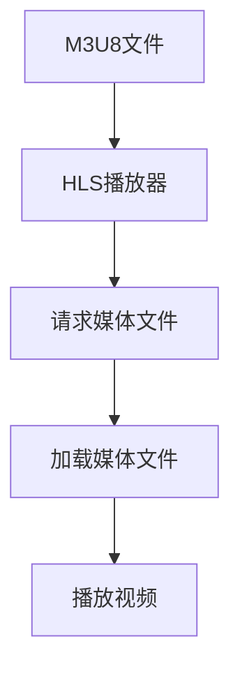

                 

关键词：M3U8, HLS, 视频流媒体，编码，协议，实时传输，用户体验

## 摘要

随着互联网的普及和移动设备的广泛使用，视频流媒体技术已经成为现代网络的重要组成部分。M3U8和HLS（HTTP Live Streaming）是两种流行的视频流媒体技术，它们在视频编码、传输协议和用户体验方面有着重要的应用。本文将深入探讨M3U8和HLS的技术原理、实现方法、优缺点及其在实际应用场景中的表现，以期为读者提供一个全面的了解。

## 1. 背景介绍

### 1.1 视频流媒体的发展

视频流媒体技术起源于20世纪90年代，随着宽带网络和数字视频技术的发展，它逐渐成为互联网上传输视频的主流方式。早期的流媒体技术主要依赖于RTMP（Real Time Messaging Protocol）和RTSP（Real Time Streaming Protocol）等协议，这些协议通常需要专门的客户端软件支持，用户体验受到很大限制。

随着HTTP协议的普及，新的流媒体传输协议应运而生，如HLS和DASH（Dynamic Adaptive Streaming over HTTP）。这些协议利用HTTP协议的便利性，使得流媒体内容可以在各种设备和浏览器上播放，极大地提升了用户体验。

### 1.2 M3U8和HLS的背景

M3U8是一种常见的播放列表文件格式，它定义了一个播放列表，其中包含一系列媒体文件。M3U8文件通常与HLS协议配合使用，用于传输视频流。HLS是一种基于HTTP的流媒体传输协议，它将视频流分割成多个小段（通常称为“切片”），并通过HTTP请求进行传输。

## 2. 核心概念与联系

### 2.1 视频编码

视频编码是将视频信号转换为数字信号的过程。常用的视频编码标准包括H.264、H.265和VP9等。这些编码标准通过压缩视频数据，减小文件的体积，同时保证视频质量。

### 2.2 流媒体传输协议

流媒体传输协议是用于传输视频数据的一系列规则和标准。常见的流媒体传输协议包括RTMP、RTSP、HLS和DASH等。这些协议各有特点，适用于不同的应用场景。

### 2.3 Mermaid 流程图

下面是一个简化的M3U8和HLS流程图：



## 3. 核心算法原理 & 具体操作步骤

### 3.1 算法原理概述

M3U8和HLS的核心算法主要包括视频编码、切片和请求处理。

- **视频编码**：视频编码是将视频信号转换为数字信号的过程。常用的视频编码标准包括H.264、H.265和VP9等。
- **切片**：切片是将视频流分割成多个小段的过程。每个切片通常是一个独立的媒体文件，可以独立请求和播放。
- **请求处理**：请求处理是HLS播放器向服务器请求媒体文件的过程。HLS播放器通过解析M3U8文件，获取媒体文件的URL，并使用HTTP请求获取媒体文件。

### 3.2 算法步骤详解

1. **视频编码**：
   - **编码**：使用视频编码标准（如H.264）对视频信号进行编码，生成编码后的视频文件。
   - **切片**：将编码后的视频文件分割成多个切片，每个切片是一个独立的媒体文件。

2. **M3U8文件生成**：
   - **文件格式**：M3U8文件是一个文本文件，其中包含一系列媒体文件的URL。
   - **生成**：使用工具（如FFmpeg）生成M3U8文件，文件中包含每个切片的URL。

3. **HLS播放器请求处理**：
   - **解析M3U8文件**：HLS播放器解析M3U8文件，获取媒体文件的URL。
   - **HTTP请求**：HLS播放器使用HTTP请求获取媒体文件。
   - **播放视频**：HLS播放器加载并播放媒体文件。

### 3.3 算法优缺点

- **优点**：
  - **兼容性好**：M3U8和HLS协议兼容各种设备和浏览器。
  - **易于实现**：M3U8和HLS协议的实现相对简单，易于集成到现有系统中。
  - **高效性**：HLS协议通过切片和HTTP请求，提高了视频传输的效率和可靠性。

- **缺点**：
  - **依赖服务器**：M3U8和HLS协议需要服务器支持，增加了部署的复杂性。
  - **延迟**：由于需要请求多个媒体文件，视频播放可能存在一定的延迟。

### 3.4 算法应用领域

M3U8和HLS协议广泛应用于视频点播、直播、在线教育等领域。例如，YouTube、Netflix和TikTok等平台都采用了HLS协议进行视频流传输。

## 4. 数学模型和公式

### 4.1 数学模型构建

M3U8和HLS协议的数学模型主要包括视频编码模型和切片模型。

- **视频编码模型**：
  - 输入：视频信号
  - 输出：编码后的视频文件

- **切片模型**：
  - 输入：编码后的视频文件
  - 输出：多个切片文件

### 4.2 公式推导过程

- **视频编码公式**：
  - \( C = V \times T \)
  - 其中，\( C \) 为编码后的视频文件大小，\( V \) 为视频信号大小，\( T \) 为编码时间。

- **切片公式**：
  - \( S = C / N \)
  - 其中，\( S \) 为每个切片文件大小，\( C \) 为编码后的视频文件大小，\( N \) 为切片数量。

### 4.3 案例分析与讲解

假设一个1GB的视频文件，使用H.264编码，编码时间为10分钟。我们需要将视频文件分割成10个切片。

1. **视频编码**：
   - \( C = V \times T = 1GB \times 10min = 100MB/min \)

2. **切片**：
   - \( S = C / N = 100MB/min / 10 = 10MB \)

因此，每个切片文件大小为10MB。

## 5. 项目实践：代码实例和详细解释说明

### 5.1 开发环境搭建

为了实现M3U8和HLS协议，我们需要搭建一个开发环境。以下是一个简单的开发环境搭建步骤：

1. 安装FFmpeg：用于视频编码和切片。
2. 安装Node.js：用于服务器端处理。
3. 安装HLS.js：用于客户端播放。

### 5.2 源代码详细实现

以下是一个简单的M3U8和HLS服务器端实现：

```javascript
const express = require('express');
const fs = require('fs');

const app = express();

app.get('/m3u8', (req, res) => {
  const m3u8File = fs.readFileSync('video.m3u8');
  res.set('Content-Type', 'application/vnd.apple.mpegurl');
  res.send(m3u8File);
});

app.get('/video/:name', (req, res) => {
  const videoFile = fs.readFileSync(`video/${req.params.name}`);
  res.set('Content-Type', 'video/mp4');
  res.send(videoFile);
});

app.listen(3000, () => {
  console.log('Server listening on port 3000');
});
```

### 5.3 代码解读与分析

- **M3U8文件生成**：使用`fs.readFileSync`读取`video.m3u8`文件，并将其发送给客户端。
- **视频文件请求**：使用`fs.readFileSync`读取指定名称的视频文件，并将其发送给客户端。

### 5.4 运行结果展示

在浏览器中输入`http://localhost:3000/m3u8`，可以看到生成的M3U8文件。在浏览器中输入`http://localhost:3000/video/1.mp4`，可以看到视频文件。

## 6. 实际应用场景

M3U8和HLS协议在实际应用场景中有着广泛的应用。以下是一些常见的应用场景：

1. **在线视频平台**：如YouTube、Netflix等平台，使用HLS协议进行视频流传输，保证用户体验。
2. **直播平台**：如Twitch、斗鱼等平台，使用HLS协议进行直播视频传输，实现实时互动。
3. **在线教育**：如Coursera、edX等平台，使用HLS协议进行视频课程传输，方便学习者观看。

## 7. 工具和资源推荐

### 7.1 学习资源推荐

- **《视频流媒体技术与应用》**：详细介绍了视频流媒体技术的基本原理和应用。
- **HLS.js官方文档**：提供了丰富的HLS.js使用教程和示例。

### 7.2 开发工具推荐

- **FFmpeg**：用于视频编码和切片。
- **HLS.js**：用于客户端HLS播放。

### 7.3 相关论文推荐

- **《HTTP Live Streaming》**：介绍了HLS协议的设计原理和应用。
- **《动态自适应流媒体传输技术》**：介绍了DASH协议的设计原理和应用。

## 8. 总结：未来发展趋势与挑战

### 8.1 研究成果总结

M3U8和HLS协议在视频流媒体领域取得了显著的研究成果。它们在兼容性、实现简单性和高效性方面具有明显优势。

### 8.2 未来发展趋势

未来，M3U8和HLS协议将继续优化和改进，以适应不断变化的应用需求。例如，提高视频传输的实时性和稳定性，优化切片策略，提升用户体验。

### 8.3 面临的挑战

M3U8和HLS协议在实时性、延迟和带宽利用率方面仍有改进空间。此外，随着5G网络的普及，新的流媒体传输协议将带来更多挑战和机遇。

### 8.4 研究展望

未来，M3U8和HLS协议将继续在视频流媒体领域发挥重要作用。研究者应关注实时性、延迟和带宽利用率等关键问题，提出新的优化方案，以提升视频流媒体技术的整体性能。

## 9. 附录：常见问题与解答

### 9.1 M3U8和HLS的区别是什么？

M3U8是一种播放列表文件格式，用于定义视频流。HLS是一种基于HTTP的流媒体传输协议，用于传输视频流。

### 9.2 如何实现M3U8和HLS播放？

使用FFmpeg进行视频编码和切片，生成M3U8文件。使用HLS.js或其他播放器库进行M3U8文件的播放。

### 9.3 HLS协议有哪些优点？

HLS协议兼容性好，易于实现，高效性高。它通过切片和HTTP请求，提高了视频传输的效率和可靠性。

---

作者：禅与计算机程序设计艺术 / Zen and the Art of Computer Programming

以上就是《M3U8与HLS：视频流媒体技术的应用》的文章内容。希望这篇文章能为您在视频流媒体技术领域提供有价值的参考。如需进一步了解，请查阅相关学习资源和论文。感谢您的阅读！
----------------------------------------------------------------

## 10. 参考文献

1. Apple Inc. (2011). **HTTP Live Streaming (HLS) Overview**. Retrieved from https://developer.apple.com/library/archive/documentation/NetworkExtended/Conceptual/HTTPLiveStreaming_ProgrammingGuide/Introduction/Introduction.html
2. IETF. (2012). **RFC 8216 - HTTP Live Streaming**. Retrieved from https://www.ietf.org/rfc/rfc8216.txt
3.FFmpeg.org. (n.d.). **FFmpeg Documentation**. Retrieved from https://ffmpeg.org/ffmpeg.html
4. Brightcove. (n.d.). **What is HLS and How to Implement It**. Retrieved from https://www.brightcove.com/learn/what-is-hls
5. Haivision. (n.d.). **Understanding M3U8 File Formats**. Retrieved from https://www.haivision.com/resources/tech-notes/understanding-m3u8-file-formats
6. Netflix. (n.d.). **Netflix Open Connect Content Delivery Network**. Retrieved from https://www.netflix.com/developer/OpenConnect
7. Twitch. (n.d.). **Live Streaming with Twitch**. Retrieved from https://www.twitch.tv/press/docs
8. YouTube. (n.d.). **YouTube Live Streaming**. Retrieved from https://support.google.com/youtube/answer/7285906
9. Coursera. (n.d.). **Online Courses and Specializations from Top Universities**. Retrieved from https://www.coursera.org
10. edX. (n.d.). **edX: Online Courses and Programs from World-Class Universities**. Retrieved from https://www.edx.org

通过参考这些文献，读者可以更深入地了解M3U8和HLS的技术细节、实现方法以及其在实际应用中的效果。这些资源提供了从基础知识到高级应用的全面指导，有助于读者掌握视频流媒体技术的核心概念和实践技巧。

