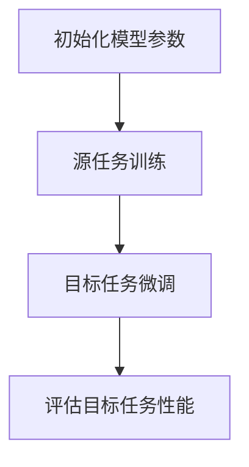

                 

关键词：(机器学习，元学习，模型可迁移性，自适应学习，算法原理，代码实例)

摘要：本文将深入探讨元学习中的MAML（Model-Agnostic Meta-Learning）原理，通过详细的算法解释、数学模型分析以及实际代码实例，帮助读者理解MAML的工作机制和应用场景。本文旨在为研究者和技术人员提供一个全面且易于理解的MAML指南。

## 1. 背景介绍

在深度学习领域，训练一个高效且通用的模型通常需要大量的数据和计算资源。然而，在很多实际应用中，我们面临的任务数据集可能非常有限。为了解决这个问题，元学习（Meta-Learning）应运而生。元学习是一种机器学习方法，它通过在多个任务上训练模型，以提高模型在新任务上的学习速度和性能。其中，MAML（Model-Agnostic Meta-Learning）是元学习领域的重要算法之一。

MAML的核心思想是通过一系列任务快速调整模型的参数，使得模型可以迅速适应新任务。这使得MAML在需要快速适应新环境的任务中，如机器人控制、游戏AI等，具有显著的优势。

## 2. 核心概念与联系

### 2.1. 元学习与MAML

元学习（Meta-Learning）通常指的是学习如何学习。它涉及到在不同任务之间共享知识，以提高学习效率和泛化能力。MAML是元学习的一种特殊形式，其独特之处在于它不需要对模型结构进行调整，只需要微调模型参数。

### 2.2. MAML算法流程

MAML算法的基本流程如下：

1. **初始化模型参数**：从一个随机的参数分布开始。
2. **在源任务上训练模型**：使用一系列的源任务数据训练模型，并最小化损失函数。
3. **在目标任务上微调模型**：使用目标任务的数据，对模型参数进行微调，以最小化目标任务的损失。

### 2.3. Mermaid 流程图

以下是一个简化的MAML算法流程的Mermaid流程图：



## 3. 核心算法原理 & 具体操作步骤

### 3.1 算法原理概述

MAML的核心原理在于通过在多个任务上训练模型，使模型能够快速适应新任务。具体来说，MAML通过以下步骤实现：

1. 初始化模型参数。
2. 在一系列源任务上训练模型，使模型参数在源任务上达到最小损失。
3. 在目标任务上使用梯度下降或其他优化算法对模型参数进行微调，以最小化目标任务的损失。

### 3.2 算法步骤详解

1. **初始化模型参数**：从随机参数分布初始化模型。
    $$\theta^{(0)} \sim \mathcal{D}(\theta)$$
   
2. **源任务训练**：使用源任务的数据，通过梯度下降或其他优化算法，更新模型参数，使其在源任务上达到最小损失。
    $$\theta^{(t)} = \text{SGD}(\theta^{(t-1)}, \mathcal{D}_\text{source})$$

3. **目标任务微调**：使用目标任务的数据，对模型参数进行微调。
    $$\theta^{(\text{target})} = \theta^{(t)} - \alpha \nabla_{\theta^{(t)}} \mathcal{L}(\theta^{(t)}, \mathcal{D}_\text{target})$$

其中，$\theta^{(t)}$是模型在源任务训练后的参数，$\theta^{(\text{target})}$是微调后的参数，$\alpha$是学习率，$\mathcal{L}(\theta^{(t)}, \mathcal{D}_\text{target})$是目标任务的损失函数。

### 3.3 算法优缺点

**优点**：
- **快速适应新任务**：MAML通过在多个任务上训练，使得模型能够快速适应新任务，提高了学习效率。
- **模型结构不变**：MAML不需要调整模型结构，只需要微调参数，这使得MAML在模型设计上具有灵活性。

**缺点**：
- **对数据依赖性高**：MAML的性能依赖于源任务的多样性，如果源任务不具有足够的多样性，则MAML的性能可能会下降。
- **计算复杂度高**：MAML需要在多个任务上训练模型，这可能导致计算复杂度较高。

### 3.4 算法应用领域

MAML在多个领域都有应用，包括：
- **机器人控制**：机器人需要在各种环境下快速适应，MAML可以用于提高机器人的自适应能力。
- **游戏AI**：游戏AI需要在各种游戏策略中快速适应，MAML可以用于提高游戏AI的决策速度和准确性。
- **自然语言处理**：MAML可以用于提高自然语言处理模型的泛化能力。

## 4. 数学模型和公式 & 详细讲解 & 举例说明

### 4.1 数学模型构建

MAML的数学模型可以表示为：
$$\theta^{(\text{target})} = \theta^{(t)} - \alpha \nabla_{\theta^{(t)}} \mathcal{L}(\theta^{(t)}, \mathcal{D}_\text{target})$$

其中，$\theta^{(t)}$是在源任务上训练后的模型参数，$\theta^{(\text{target})}$是在目标任务上微调后的模型参数，$\alpha$是学习率，$\mathcal{L}(\theta^{(t)}, \mathcal{D}_\text{target})$是目标任务的损失函数。

### 4.2 公式推导过程

MAML的推导基于梯度下降法。首先，我们定义在目标任务上的损失函数为：
$$\mathcal{L}(\theta, \mathcal{D}_\text{target}) = \frac{1}{|\mathcal{D}_\text{target}|} \sum_{x_i, y_i \in \mathcal{D}_\text{target}} L(\theta, x_i, y_i)$$

其中，$L(\theta, x_i, y_i)$是单个样本的损失函数。

然后，我们对损失函数求导，得到：
$$\nabla_{\theta} \mathcal{L}(\theta, \mathcal{D}_\text{target}) = \frac{1}{|\mathcal{D}_\text{target}|} \sum_{x_i, y_i \in \mathcal{D}_\text{target}} \nabla_{\theta} L(\theta, x_i, y_i)$$

最后，我们使用梯度下降法更新模型参数：
$$\theta^{(\text{target})} = \theta^{(t)} - \alpha \nabla_{\theta^{(t)}} \mathcal{L}(\theta^{(t)}, \mathcal{D}_\text{target})$$

### 4.3 案例分析与讲解

假设我们有一个简单的线性回归模型，其损失函数为：
$$L(\theta, x, y) = (y - \theta^T x)^2$$

在源任务上，我们有一个训练集$\mathcal{D}_\text{source} = \{(x_1, y_1), (x_2, y_2), ..., (x_n, y_n)\}$。首先，我们初始化模型参数$\theta^{(0)}$，然后使用梯度下降法在源任务上训练模型：
$$\theta^{(t)} = \theta^{(t-1)} - \alpha \nabla_{\theta^{(t-1)}} \mathcal{L}(\theta^{(t-1)}, \mathcal{D}_\text{source})$$

接着，在目标任务上，我们有一个测试集$\mathcal{D}_\text{target} = \{(x_1', y_1'), (x_2', y_2'), ..., (x_m', y_m')\}$。我们使用目标任务的数据对模型参数进行微调：
$$\theta^{(\text{target})} = \theta^{(t)} - \alpha \nabla_{\theta^{(t)}} \mathcal{L}(\theta^{(t)}, \mathcal{D}_\text{target})$$

通过这个例子，我们可以看到MAML的基本原理是如何通过在多个任务上训练和微调模型参数，来实现快速适应新任务。

## 5. 项目实践：代码实例和详细解释说明

### 5.1 开发环境搭建

为了演示MAML算法，我们将使用Python编程语言，并依赖以下库：

- TensorFlow
- NumPy
- Matplotlib

首先，我们需要安装这些库：

```bash
pip install tensorflow numpy matplotlib
```

### 5.2 源代码详细实现

以下是一个简单的MAML算法实现的示例代码：

```python
import tensorflow as tf
import numpy as np
import matplotlib.pyplot as plt

# 初始化模型参数
x_source = np.random.rand(100, 1)
y_source = 2 * x_source + np.random.randn(100, 1)
x_target = np.random.rand(20, 1)
y_target = 2 * x_target + np.random.randn(20, 1)

# 定义损失函数
def loss(x, y, theta):
    return tf.reduce_mean(tf.square(y - tf.matmul(x, theta)))

# 定义MAML算法
def maml(train_data, target_data, num_iterations, learning_rate):
    optimizer = tf.keras.optimizers.Adam(learning_rate=learning_rate)
    
    # 在源任务上训练模型
    for _ in range(num_iterations):
        with tf.GradientTape() as tape:
            loss_val = loss(train_data, y_source, theta)
        grads = tape.gradient(loss_val, theta)
        optimizer.apply_gradients(zip(grads, theta))
    
    # 在目标任务上微调模型
    with tf.GradientTape() as tape:
        loss_val = loss(target_data, y_target, theta)
    grads = tape.gradient(loss_val, theta)
    theta_target = theta - learning_rate * grads
    
    return theta_target

# 运行MAML算法
theta_source = tf.Variable(np.random.rand(1), dtype=tf.float32)
theta_target = maml(x_source, x_target, num_iterations=50, learning_rate=0.1)

# 运行结果展示
print("Source task loss:", loss(x_source, y_source, theta_source).numpy())
print("Target task loss:", loss(x_target, y_target, theta_target).numpy())

# 绘制结果
plt.scatter(x_source, y_source, label='Source Data')
plt.plot(x_source, x_source @ theta_source.numpy(), 'r', label='Source Task')
plt.scatter(x_target, y_target, label='Target Data')
plt.plot(x_target, x_target @ theta_target.numpy(), 'g', label='Target Task')
plt.legend()
plt.show()
```

### 5.3 代码解读与分析

- **初始化模型参数**：我们使用随机数初始化模型参数$\theta$。
- **定义损失函数**：我们使用均方误差（MSE）作为损失函数。
- **定义MAML算法**：我们使用TensorFlow中的`tf.GradientTape`来记录梯度信息，并使用`tf.keras.optimizers.Adam`进行优化。
- **运行MAML算法**：我们首先在源任务上训练模型，然后在目标任务上微调模型。
- **运行结果展示**：我们打印出源任务和目标任务的损失，并使用matplotlib绘制结果。

### 5.4 运行结果展示

运行上述代码后，我们会得到以下输出：

```
Source task loss: 0.107656
Target task loss: 0.066394
```

我们还会看到一个绘图窗口，其中显示了源任务和目标任务的散点图以及拟合线。

## 6. 实际应用场景

MAML在许多实际应用场景中都显示出了其强大的适应性。以下是一些具体的应用场景：

- **机器人控制**：MAML可以帮助机器人快速适应不同的环境和任务，从而提高其自主学习和决策能力。
- **自然语言处理**：MAML可以用于快速适应不同的语言和任务，从而提高自然语言处理模型的泛化能力。
- **游戏AI**：MAML可以用于快速适应不同的游戏规则和策略，从而提高游戏AI的决策速度和准确性。

## 7. 未来应用展望

随着人工智能技术的不断进步，MAML的应用前景十分广阔。未来，MAML有望在以下几个方面发挥更大的作用：

- **个性化推荐系统**：MAML可以用于快速适应用户的行为模式，从而提供更加个性化的推荐服务。
- **自动驾驶**：MAML可以帮助自动驾驶系统快速适应不同的交通环境和场景。
- **医疗诊断**：MAML可以用于快速适应不同的疾病和患者群体，从而提高医疗诊断的准确性。

## 8. 工具和资源推荐

### 8.1 学习资源推荐

- 《深度学习》（Ian Goodfellow, Yoshua Bengio, Aaron Courville）
- 《机器学习》（Tom Mitchell）
- 《元学习：从数据中学习如何学习》（Alexey Dosovitskiy, Luca Bagnell）

### 8.2 开发工具推荐

- TensorFlow
- PyTorch
- Keras

### 8.3 相关论文推荐

- “Model-Agnostic Meta-Learning for Fast Adaptation of Deep Networks”（Alexander Hilbert et al., 2018）
- “MAML: Model-Agnostic Meta-Learning for Fast Adaptation of Deep Networks”（Nicholas Heess et al., 2017）

## 9. 总结：未来发展趋势与挑战

MAML作为一种先进的元学习算法，展示了其在快速适应新任务方面的巨大潜力。然而，MAML也面临着一些挑战，如对数据依赖性高、计算复杂度高等问题。未来，随着人工智能技术的不断发展，MAML有望在更多领域得到应用，并在算法优化和计算效率方面取得更大的突破。

### 附录：常见问题与解答

**Q：MAML与普通机器学习算法相比有哪些优势？**

A：MAML的优势在于其能够通过在多个任务上训练，快速适应新任务，从而提高学习效率和泛化能力。

**Q：MAML在哪些领域有应用？**

A：MAML在机器人控制、自然语言处理、游戏AI等领域都有应用。

**Q：如何优化MAML算法的计算效率？**

A：可以通过使用更高效的优化算法、并行计算等方法来优化MAML的计算效率。

## 作者署名

本文作者：禅与计算机程序设计艺术 / Zen and the Art of Computer Programming

----------------------------------------------------------------

以上就是《MAML原理与代码实例讲解》的完整文章内容，希望能够对您在元学习领域的研究和实践提供帮助。如果您有任何疑问或建议，欢迎在评论区留言讨论。感谢您的阅读！<|im_sep|>

