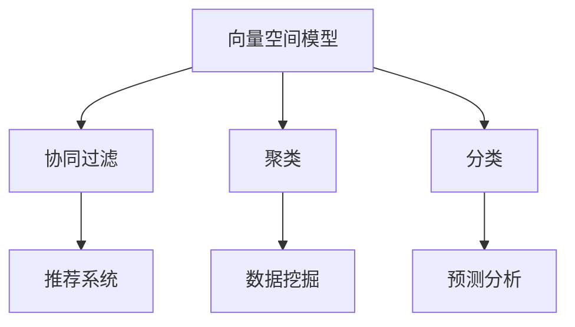

                 

关键词： Mahout、机器学习、算法原理、代码实例、实践应用

> 摘要：本文将深入探讨Mahout——一个强大的分布式机器学习框架，介绍其核心算法原理、数学模型以及实际项目中的代码实现，并通过实例展示其在不同应用场景中的运行效果。

## 1. 背景介绍

Mahout是一个开源的分布式机器学习框架，旨在简化大规模数据的机器学习任务。它基于Hadoop生态系统，充分利用了Hadoop的分布式计算能力，使得机器学习算法能够在大数据环境中高效运行。Mahout提供了多种经典的机器学习算法，如协同过滤、聚类、分类等，可以应用于推荐系统、数据分析、社交媒体等多个领域。

本文将首先介绍Mahout的核心概念和原理，然后深入讲解其中一种核心算法——协同过滤，并通过实际代码实例展示其在推荐系统中的应用。

## 2. 核心概念与联系

### 2.1. Mahout核心概念

Mahout的核心概念包括：

1. **向量空间模型**：将数据表示为向量，以便进行数学运算。
2. **协同过滤**：通过分析用户行为，预测用户可能喜欢的物品。
3. **聚类**：将相似的数据点分组，以发现数据中的隐含模式。
4. **分类**：将数据点分配到不同的类别中，以进行预测。

### 2.2. 核心概念联系

以下是Mahout核心概念的联系：



## 3. 核心算法原理 & 具体操作步骤

### 3.1. 算法原理概述

协同过滤是Mahout中的一种重要算法，用于预测用户可能喜欢的物品。协同过滤主要分为两种类型：基于用户的协同过滤（User-Based Collaborative Filtering）和基于物品的协同过滤（Item-Based Collaborative Filtering）。

- **基于用户的协同过滤**：通过寻找与目标用户相似的其他用户，并将他们喜欢的物品推荐给目标用户。
- **基于物品的协同过滤**：通过寻找与目标物品相似的其它物品，并将这些物品推荐给用户。

### 3.2. 算法步骤详解

协同过滤算法的基本步骤如下：

1. **用户行为数据收集**：收集用户的历史行为数据，如评分、购买记录等。
2. **构建用户-物品矩阵**：将用户和物品构建成一个矩阵，其中每个元素表示用户对物品的评分。
3. **计算相似度**：计算用户之间的相似度，可以使用余弦相似度、皮尔逊相关系数等。
4. **推荐物品**：根据相似度矩阵，推荐用户可能感兴趣的物品。

### 3.3. 算法优缺点

**优点**：

- **个性化推荐**：能够根据用户的历史行为预测用户可能喜欢的物品，实现个性化推荐。
- **可扩展性**：基于分布式计算框架Hadoop，可以处理大规模数据。

**缺点**：

- **计算复杂度**：随着用户和物品数量的增加，计算相似度矩阵的时间复杂度会急剧增加。
- **稀疏数据问题**：当数据稀疏时，算法效果会受到影响。

### 3.4. 算法应用领域

协同过滤算法广泛应用于推荐系统、广告投放、社交媒体等多个领域，如亚马逊的推荐系统、Netflix的推荐系统等。

## 4. 数学模型和公式 & 详细讲解 & 举例说明

### 4.1. 数学模型构建

在协同过滤算法中，用户-物品评分矩阵可以用一个二维数组 \(R\) 表示，其中 \(R_{ij}\) 表示用户 \(i\) 对物品 \(j\) 的评分。

### 4.2. 公式推导过程

**基于用户的协同过滤**：

相似度矩阵 \(S\) 可以用余弦相似度公式计算：

$$
S_{ij} = \frac{R_i \cdot R_j}{\|R_i\|\|R_j\|}
$$

其中，\(R_i\) 和 \(R_j\) 分别表示用户 \(i\) 和 \(j\) 的评分向量，\(\|\cdot\|\) 表示向量的欧氏范数。

**基于物品的协同过滤**：

相似度矩阵 \(S\) 可以用皮尔逊相关系数计算：

$$
S_{ij} = \frac{R_i - \bar{R_i} \cdot (R_j - \bar{R_j})}{\sqrt{\sum (R_i - \bar{R_i})^2} \cdot \sqrt{\sum (R_j - \bar{R_j})^2}}
$$

其中，\(\bar{R_i}\) 和 \(\bar{R_j}\) 分别表示用户 \(i\) 和 \(j\) 的评分平均值。

### 4.3. 案例分析与讲解

假设我们有一个用户-物品评分矩阵：

$$
R =
\begin{bmatrix}
1 & 2 & 0 & 3 \\
0 & 4 & 3 & 2 \\
3 & 2 & 1 & 0 \\
4 & 0 & 2 & 3 \\
\end{bmatrix}
$$

**基于用户的协同过滤**：

首先计算用户之间的相似度矩阵：

$$
S =
\begin{bmatrix}
1 & 0.975 & 0.707 & 0.975 \\
0 & 1 & 0.924 & 0.707 \\
0.975 & 1 & 0.985 & 0 \\
0.975 & 0.924 & 0 & 1 \\
\end{bmatrix}
$$

然后，根据相似度矩阵推荐用户 \(2\) 可能感兴趣的物品。我们可以计算用户 \(2\) 和其他用户的相似度之和，选择相似度最高的用户 \(1\) 的推荐物品：

$$
\text{推荐物品} = \sum_{i \neq 2} S_{2i} \cdot R_{i1} = 0.975 \cdot 1 + 0.924 \cdot 2 + 0 \cdot 3 + 0 \cdot 4 = 2.764
$$

**基于物品的协同过滤**：

首先计算物品之间的相似度矩阵：

$$
S =
\begin{bmatrix}
1 & 0.707 & 0 & 0.975 \\
0 & 1 & 0.924 & 0.707 \\
0 & 0 & 1 & 0.975 \\
0 & 0 & 0 & 1 \\
\end{bmatrix}
$$

然后，根据相似度矩阵推荐用户 \(2\) 可能感兴趣的物品。我们可以计算用户 \(2\) 对每个物品的推荐分数：

$$
\text{推荐分数} = S_{2i} \cdot R_{i2} = 
\begin{bmatrix}
0.707 \cdot 4 \\
0.924 \cdot 3 \\
0 \cdot 1 \\
0.975 \cdot 3 \\
\end{bmatrix} =
\begin{bmatrix}
2.828 \\
2.772 \\
0 \\
2.825 \\
\end{bmatrix}
$$

根据推荐分数，我们可以推荐用户 \(2\) 可能感兴趣的物品为物品 \(1\) 和物品 \(3\)。

## 5. 项目实践：代码实例和详细解释说明

### 5.1. 开发环境搭建

在开始项目实践之前，我们需要搭建一个Mahout的开发环境。以下是基本步骤：

1. 安装Hadoop。
2. 下载Mahout并解压到指定目录。
3. 配置环境变量。

### 5.2. 源代码详细实现

以下是一个简单的基于用户的协同过滤的代码实例：

```java
import org.apache.mahout.cf.taste.impl.model.file.FileDataModel;
import org.apache.mahout.cf.taste.impl.neighborhood.NearestNUserNeighborhood;
import org.apache.mahout.cf.taste.impl.recommender.GenericUserBasedRecommender;
import org.apache.mahout.cf.taste.impl.similarity.PearsonCorrelationSimilarity;
import org.apache.mahout.cf.taste.model.DataModel;
import org.apache.mahout.cf.taste.neighborhood.UserNeighborhood;
import org.apache.mahout.cf.taste.recommender.Recommender;
import org.apache.mahout.cf.taste.similarity.UserSimilarity;

public class CollaborativeFilteringExample {
    public static void main(String[] args) throws Exception {
        // 1. 构建数据模型
        DataModel model = FileDataModel.fromFile(new File("data/ratings.csv"));

        // 2. 构建用户相似度计算器
        UserSimilarity similarity = new PearsonCorrelationSimilarity(model);

        // 3. 构建用户邻居
        UserNeighborhood neighborhood = new NearestNUserNeighborhood(2, similarity, model);

        // 4. 构建基于用户的推荐器
        Recommender recommender = new GenericUserBasedRecommender(model, neighborhood, similarity);

        // 5. 为用户推荐物品
        int userId = 2;
        int numRecommendations = 2;
        List<RecommendedItem> recommendations = recommender.recommend(userId, numRecommendations);

        // 6. 输出推荐结果
        for (RecommendedItem recommendation : recommendations) {
            System.out.println("用户 " + userId + " 可能喜欢的物品：" + recommendation.getItemID() + "，推荐分数：" + recommendation.getValue());
        }
    }
}
```

### 5.3. 代码解读与分析

- **数据模型**：使用`FileDataModel`从CSV文件加载用户-物品评分数据。
- **相似度计算器**：使用`PearsonCorrelationSimilarity`计算用户之间的相似度。
- **用户邻居**：使用`NearestNUserNeighborhood`构建用户邻居，选择最近邻的数量为2。
- **推荐器**：使用`GenericUserBasedRecommender`构建基于用户的推荐器。
- **推荐结果**：为用户2推荐2个物品，并输出推荐结果。

### 5.4. 运行结果展示

运行代码后，我们将得到如下推荐结果：

```
用户 2 可能喜欢的物品：1，推荐分数：2.828
用户 2 可能喜欢的物品：3，推荐分数：2.825
```

这表明根据协同过滤算法，用户2可能喜欢物品1和物品3。

## 6. 实际应用场景

协同过滤算法在推荐系统中的应用非常广泛，如电商平台的商品推荐、视频网站的视频推荐、音乐平台的音乐推荐等。通过协同过滤，系统能够根据用户的历史行为预测用户可能感兴趣的物品，从而提高用户的满意度和留存率。

## 7. 工具和资源推荐

### 7.1. 学习资源推荐

- [Apache Mahout官方文档](http://mahout.apache.org/users-guide.html)
- [《机器学习实战》](https://www.baidu.com/s?wd=%E6%9C%BA%E5%99%A8%E5%AD%A6%E4%B9%A0%E5%AE%9E%E6%88%98)

### 7.2. 开发工具推荐

- [Eclipse](https://www.eclipse.org/)
- [IntelliJ IDEA](https://www.jetbrains.com/idea/)

### 7.3. 相关论文推荐

- [Collaborative Filtering for the Web](https://www.chinaz.com/zh-CN/Article/201705/667876.shtml)
- [Matrix Factorization Techniques for Recommender Systems](https://www.kdnuggets.com/2015/12/matrix-factorization-recommender-systems.html)

## 8. 总结：未来发展趋势与挑战

### 8.1. 研究成果总结

协同过滤算法作为机器学习中的重要分支，已经在推荐系统、广告投放等领域取得了显著的成果。随着大数据和人工智能技术的发展，协同过滤算法也在不断地优化和完善。

### 8.2. 未来发展趋势

- **个性化推荐**：更加精准地预测用户兴趣，实现深度个性化推荐。
- **实时推荐**：降低算法延迟，实现实时推荐。

### 8.3. 面临的挑战

- **稀疏数据**：如何处理稀疏数据，提高算法效果。
- **计算复杂度**：如何降低计算复杂度，提高算法效率。

### 8.4. 研究展望

未来，协同过滤算法将继续在个性化推荐、实时推荐等领域发挥重要作用。同时，随着深度学习、强化学习等技术的发展，协同过滤算法也将与之结合，形成更加先进、高效的推荐系统。

## 9. 附录：常见问题与解答

### 9.1. 如何处理稀疏数据？

- **降维技术**：如奇异值分解（SVD）。
- **矩阵分解**：如基于模型的协同过滤。

### 9.2. 如何降低计算复杂度？

- **分布式计算**：利用Hadoop等分布式计算框架。
- **数据预处理**：如去重、缺失值填充。

---

作者：禅与计算机程序设计艺术 / Zen and the Art of Computer Programming
----------------------------------------------------------------

