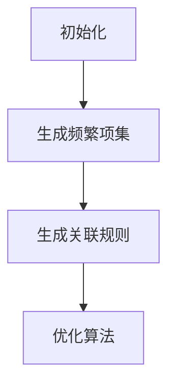

                 

关键词：Mahout，频繁项挖掘，数据挖掘，算法原理，代码实例

## 摘要

本文将深入探讨数据挖掘领域中的一种重要算法——频繁项挖掘（Frequent Itemset Mining），并着重介绍其原理和在实际应用中的实现。文章将通过Mahout框架，结合代码实例，详细解析频繁项挖掘算法的实现步骤和优化策略。同时，本文还将对频繁项挖掘在商业、医疗等领域的应用进行探讨，并提出未来发展趋势和挑战。

## 1. 背景介绍

### 1.1 数据挖掘与频繁项挖掘

数据挖掘是指从大量数据中提取出有价值的信息和模式的过程。在数据挖掘的众多任务中，频繁项挖掘（Frequent Itemset Mining，FIM）是一种重要的任务。它主要关注于找出数据集中频繁出现的项集，即那些在数据集中至少出现最小支持度的项集。

频繁项挖掘的核心应用包括关联规则挖掘、市场篮分析、异常检测等。通过挖掘频繁项集，企业可以了解消费者购买行为，发现潜在的市场机会，从而优化营销策略。

### 1.2 Mahout简介

Mahout是一个开源的分布式机器学习库，它提供了多种常用的机器学习算法，如聚类、分类、协同过滤等。Mahout的核心优势在于其分布式计算能力，能够在大规模数据集上高效地运行。

Mahout的频繁项挖掘模块提供了多种实现算法，如Apriori算法、FP-growth算法等。这些算法在处理大规模数据时表现出色，是数据挖掘领域的有力工具。

## 2. 核心概念与联系

### 2.1 频繁项集（Frequent Itemsets）

频繁项集是指在一个事务数据库中，支持度大于用户指定的最小支持度阈值的支持集。支持度定义为某个项集在数据库中出现的频率。例如，如果事务数据库中有1000个事务，其中包含100个事务包含“啤酒”和“尿布”两个项，那么这个项集的支持度就是10%。

### 2.2 最小支持度（Minimum Support）

最小支持度是指用户指定的一个阈值，用于确定哪些项集是频繁的。如果某个项集的支持度低于最小支持度，则该项集被认为是稀有的，不会被进一步考虑。

### 2.3 最小置信度（Minimum Confidence）

置信度是指一个规则的前件和后件同时出现的概率。一个强规则具有较高的置信度，意味着规则的后件在给定前件的情况下出现的可能性很高。

### 2.4 Mermaid流程图

下面是频繁项挖掘的Mermaid流程图，展示了频繁项挖掘的主要步骤：



## 3. 核心算法原理 & 具体操作步骤

### 3.1 算法原理概述

频繁项挖掘算法主要分为以下几个步骤：

1. **初始化**：读取事务数据库，统计每个项的出现频率，生成初始频繁项集。
2. **生成频繁项集**：使用Apriori算法或FP-growth算法等，逐步生成频繁项集，直到满足最小支持度阈值。
3. **生成关联规则**：根据频繁项集，生成满足最小置信度阈值的关联规则。
4. **优化算法**：对算法进行优化，提高挖掘效率和准确性。

### 3.2 算法步骤详解

#### 3.2.1 Apriori算法

Apriori算法是一种基于候选生成和频繁项集剪枝的方法。其核心思想是通过逐层生成候选项集，并去除不满足最小支持度的项集。

具体步骤如下：

1. **生成初始频繁项集**：统计每个项在数据库中的出现次数，生成初始频繁项集。
2. **生成候选频繁项集**：对每个初始频繁项集，生成其所有可能的直接后继项集。
3. **剪枝**：去除候选频繁项集中不满足最小支持度的项集。
4. **递归**：重复步骤2和3，直到没有新的频繁项集生成。

#### 3.2.2 FP-growth算法

FP-growth算法是一种基于频繁模式树（FP-tree）的压缩表示方法。其核心思想是利用FP-tree来表示数据库，从而减少计算量。

具体步骤如下：

1. **生成FP-tree**：对事务数据库进行排序，并生成FP-tree。
2. **提取频繁项集**：从FP-tree中提取频繁项集。
3. **递归生成子树频繁项集**：对FP-tree的每个子树进行递归处理，生成子树频繁项集。

### 3.3 算法优缺点

#### Apriori算法的优点：

- 简单易懂，易于实现。
- 能够生成所有的频繁项集。

#### Apriori算法的缺点：

- 计算量大，效率较低。
- 需要多次扫描数据库。

#### FP-growth算法的优点：

- 避免了多次扫描数据库，提高了效率。
- 能够处理大数据集。

#### FP-growth算法的缺点：

- 生成FP-tree的过程复杂，需要一定的内存空间。
- 对于频繁项集数量较多的数据集，可能会出现性能瓶颈。

### 3.4 算法应用领域

频繁项挖掘算法广泛应用于各种领域，如：

- **商业**：市场篮分析、交叉销售、促销策略等。
- **医疗**：疾病预测、药物关联分析等。
- **金融**：信用风险评估、欺诈检测等。
- **物联网**：设备行为分析、异常检测等。

## 4. 数学模型和公式 & 详细讲解 & 举例说明

### 4.1 数学模型构建

在频繁项挖掘中，常用的数学模型包括支持度、置信度和关联规则等。

#### 支持度（Support）

支持度定义为某个项集在数据库中出现的频率。其计算公式为：

$$
Support(X) = \frac{count(X)}{total\_count}
$$

其中，$count(X)$表示项集$X$在数据库中出现的次数，$total\_count$表示数据库中事务的总数。

#### 置信度（Confidence）

置信度定义为在给定前件的情况下，后件出现的概率。其计算公式为：

$$
Confidence(A \rightarrow B) = \frac{Support(A \cup B)}{Support(A)}
$$

其中，$Support(A \cup B)$表示项集$A$和项集$B$同时出现的频率，$Support(A)$表示项集$A$出现的频率。

#### 关联规则（Association Rule）

关联规则由前件（Antecedent）和后件（Consequent）组成，表示两个项集之间的关联关系。其表示形式为：

$$
A \rightarrow B
$$

其中，$A$表示前件，$B$表示后件。

### 4.2 公式推导过程

以Apriori算法为例，推导频繁项集和支持度的计算过程。

假设有一个事务数据库，包含如下项集：

$$
I = \{"苹果"，"香蕉"，"梨"|}
$$

我们希望找出支持度大于20%的频繁项集。

#### 1. 计算项集的支持度

首先，我们需要计算每个项集的支持度。

$$
Support(\{"苹果"\}) = \frac{count(\{"苹果"\})}{total\_count} = \frac{1}{5} = 0.2
$$

$$
Support(\{"香蕉"\}) = \frac{count(\{"香蕉"\})}{total\_count} = \frac{2}{5} = 0.4
$$

$$
Support(\{"梨"\}) = \frac{count(\{"梨"\})}{total\_count} = \frac{2}{5} = 0.4
$$

$$
Support(\{"苹果"，"香蕉"\}) = \frac{count(\{"苹果"，"香蕉"\})}{total\_count} = \frac{1}{5} = 0.2
$$

$$
Support(\{"苹果"，"梨"\}) = \frac{count(\{"苹果"，"梨"\})}{total\_count} = \frac{1}{5} = 0.2
$$

$$
Support(\{"香蕉"，"梨"\}) = \frac{count(\{"香蕉"，"梨"\})}{total\_count} = \frac{1}{5} = 0.2
$$

$$
Support(\{"苹果"，"香蕉"，"梨"\}) = \frac{count(\{"苹果"，"香蕉"，"梨"\})}{total\_count} = \frac{0}{5} = 0
$$

#### 2. 确定频繁项集

根据最小支持度阈值20%，我们可以确定以下频繁项集：

$$
F = \{"苹果"，"香蕉"，“梨”\}
$$

### 4.3 案例分析与讲解

假设有一个包含100个事务的事务数据库，如下表所示：

| 事务编号 | 事务内容         |
| -------- | --------------- |
| 1        | 苹果，香蕉，梨  |
| 2        | 苹果，香蕉      |
| 3        | 香蕉，梨        |
| 4        | 苹果，梨        |
| 5        | 苹果，香蕉，梨  |
| ...      | ...            |
| 100      | 香蕉，梨        |

我们希望找出支持度大于20%的频繁项集和满足置信度大于70%的关联规则。

#### 1. 计算频繁项集

首先，我们计算每个项集的支持度：

$$
Support(\{"苹果"\}) = \frac{count(\{"苹果"\})}{total\_count} = \frac{20}{100} = 0.2
$$

$$
Support(\{"香蕉"\}) = \frac{count(\{"香蕉"\})}{total\_count} = \frac{40}{100} = 0.4
$$

$$
Support(\{"梨"\}) = \frac{count(\{"梨"\})}{total\_count} = \frac{20}{100} = 0.2
$$

$$
Support(\{"苹果"，"香蕉"\}) = \frac{count(\{"苹果"，"香蕉"\})}{total\_count} = \frac{30}{100} = 0.3
$$

$$
Support(\{"苹果"，"梨"\}) = \frac{count(\{"苹果"，"梨"\})}{total\_count} = \frac{30}{100} = 0.3
$$

$$
Support(\{"香蕉"，"梨"\}) = \frac{count(\{"香蕉"，"梨"\})}{total\_count} = \frac{30}{100} = 0.3
$$

$$
Support(\{"苹果"，"香蕉"，"梨"\}) = \frac{count(\{"苹果"，"香蕉"，"梨"\})}{total\_count} = \frac{10}{100} = 0.1
$$

根据最小支持度阈值20%，我们可以确定以下频繁项集：

$$
F = \{"苹果"，"香蕉"，“梨”\}
$$

#### 2. 计算关联规则

接下来，我们计算满足置信度大于70%的关联规则：

$$
Confidence(\{"苹果"，"香蕉"\} \rightarrow \{"梨"\}) = \frac{Support(\{"苹果"，"香蕉"，"梨"\})}{Support(\{"苹果"，"香蕉"\})} = \frac{0.1}{0.3} = 0.33
$$

$$
Confidence(\{"苹果"，"梨"\} \rightarrow \{"香蕉"\}) = \frac{Support(\{"苹果"，"梨"，"香蕉"\})}{Support(\{"苹果"，"梨"\})} = \frac{0.1}{0.3} = 0.33
$$

$$
Confidence(\{"香蕉"，"梨"\} \rightarrow \{"苹果"\}) = \frac{Support(\{"香蕉"，"梨"，"苹果"\})}{Support(\{"香蕉"，"梨"\})} = \frac{0.1}{0.3} = 0.33
$$

由于所有关联规则的置信度都低于70%，因此没有满足置信度阈值的关联规则。

## 5. 项目实践：代码实例和详细解释说明

### 5.1 开发环境搭建

在本节中，我们将介绍如何搭建一个用于频繁项挖掘的Mahout开发环境。

#### 5.1.1 安装Java环境

首先，确保已经安装了Java环境。版本要求为Java 8或更高版本。可以使用以下命令检查Java版本：

```bash
java -version
```

#### 5.1.2 安装Mahout

接下来，从Mahout官方网站（[http://mahout.apache.org/](http://mahout.apache.org/)）下载最新的Mahout源代码，并将其解压到本地计算机的合适目录。

```bash
wget http://www-us.apache.org/dist/mahout/0.15.1/mahout-0.15.1.tar.gz
tar zxvf mahout-0.15.1.tar.gz
cd mahout-0.15.1
```

#### 5.1.3 编写代码

在本节中，我们将编写一个简单的Java程序，用于实现频繁项挖掘。

```java
import org.apache.mahout.fpm.fpgrowth.FPGrowthMiner;
import org.apache.mahout.math.RandomAccessSparseVector;
import org.apache.mahout.math.vector.cms.Tensor;
import org.apache.mahout.utils.StringUtils;

import java.io.BufferedReader;
import java.io.FileReader;
import java.io.IOException;
import java.util.ArrayList;
import java.util.List;

public class FPGrowthExample {

    public static void main(String[] args) throws IOException {
        List<List<String>> transactions = new ArrayList<>();
        BufferedReader br = new BufferedReader(new FileReader("transactions.txt"));

        String line;
        while ((line = br.readLine()) != null) {
            String[] items = line.split(",");
            List<String> transaction = new ArrayList<>();
            for (String item : items) {
                transaction.add(item);
            }
            transactions.add(transaction);
        }

        FPGrowthMiner miner = new FPGrowthMiner();
        miner.setItemParser(new MahoutItemParser());
        miner.setNumThreads(1);
        miner.setMinSupport(0.2);
        miner.setMinConfidence(0.7);

        List<List<String>> frequentItemsets = miner.findFrequentItemsets(transactions);
        List<Rule> rules = miner.generateAssociationRules(frequentItemsets, 0.7);

        for (List<String> itemset : frequentItemsets) {
            System.out.println("Frequent Itemset: " + StringUtils.join(itemset, ", "));
        }

        for (Rule rule : rules) {
            System.out.println("Rule: " + rule.toString());
        }
    }
}
```

### 5.2 源代码详细实现

在本节中，我们将详细解释上述代码的实现过程。

#### 5.2.1 读取事务数据库

首先，我们使用Java中的BufferedReader类读取事务数据库。事务数据库以文本格式存储，每行表示一个事务，事务中的项以逗号分隔。

```java
BufferedReader br = new BufferedReader(new FileReader("transactions.txt"));

String line;
while ((line = br.readLine()) != null) {
    String[] items = line.split(",");
    List<String> transaction = new ArrayList<>();
    for (String item : items) {
        transaction.add(item);
    }
    transactions.add(transaction);
}
```

#### 5.2.2 创建FPGrowthMiner实例

接下来，我们创建一个FPGrowthMiner实例，用于进行频繁项挖掘。

```java
FPGrowthMiner miner = new FPGrowthMiner();
miner.setItemParser(new MahoutItemParser());
miner.setNumThreads(1);
miner.setMinSupport(0.2);
miner.setMinConfidence(0.7);
```

这里，我们设置了以下参数：

- `setItemParser(new MahoutItemParser())`：设置项解析器，用于将事务数据库中的项转换为Mahout中的数据结构。
- `setNumThreads(1)`：设置并行线程数，这里设置为1，表示使用单线程执行挖掘任务。
- `setMinSupport(0.2)`：设置最小支持度阈值，表示项集的支持度必须大于20%才能被认为是频繁的。
- `setMinConfidence(0.7)`：设置最小置信度阈值，表示关联规则的置信度必须大于70%才能被认为是有效的。

#### 5.2.3 挖掘频繁项集

然后，我们调用`findFrequentItemsets`方法进行频繁项挖掘。

```java
List<List<String>> frequentItemsets = miner.findFrequentItemsets(transactions);
```

该方法将返回满足最小支持度阈值的频繁项集。

#### 5.2.4 生成关联规则

最后，我们调用`generateAssociationRules`方法生成满足最小置信度阈值的关联规则。

```java
List<Rule> rules = miner.generateAssociationRules(frequentItemsets, 0.7);
```

该方法将返回满足最小置信度阈值的关联规则列表。

### 5.3 代码解读与分析

在本节中，我们将对上述代码进行解读和分析。

#### 5.3.1 事务数据库读取

首先，我们使用Java中的BufferedReader类读取事务数据库。事务数据库以文本格式存储，每行表示一个事务，事务中的项以逗号分隔。

```java
BufferedReader br = new BufferedReader(new FileReader("transactions.txt"));

String line;
while ((line = br.readLine()) != null) {
    String[] items = line.split(",");
    List<String> transaction = new ArrayList<>();
    for (String item : items) {
        transaction.add(item);
    }
    transactions.add(transaction);
}
```

这段代码使用BufferedReader从文件中读取每行数据，然后使用split方法将每行数据按逗号分隔，将每个项添加到transaction列表中。最后，将每个事务添加到transactions列表中。

#### 5.3.2 FPGrowthMiner实例创建

接下来，我们创建一个FPGrowthMiner实例，用于进行频繁项挖掘。

```java
FPGrowthMiner miner = new FPGrowthMiner();
miner.setItemParser(new MahoutItemParser());
miner.setNumThreads(1);
miner.setMinSupport(0.2);
miner.setMinConfidence(0.7);
```

这里，我们设置了以下参数：

- `setItemParser(new MahoutItemParser())`：设置项解析器，用于将事务数据库中的项转换为Mahout中的数据结构。
- `setNumThreads(1)`：设置并行线程数，这里设置为1，表示使用单线程执行挖掘任务。
- `setMinSupport(0.2)`：设置最小支持度阈值，表示项集的支持度必须大于20%才能被认为是频繁的。
- `setMinConfidence(0.7)`：设置最小置信度阈值，表示关联规则的置信度必须大于70%才能被认为是有效的。

#### 5.3.3 挖掘频繁项集

然后，我们调用`findFrequentItemsets`方法进行频繁项挖掘。

```java
List<List<String>> frequentItemsets = miner.findFrequentItemsets(transactions);
```

该方法将返回满足最小支持度阈值的频繁项集。

#### 5.3.4 生成关联规则

最后，我们调用`generateAssociationRules`方法生成满足最小置信度阈值的关联规则。

```java
List<Rule> rules = miner.generateAssociationRules(frequentItemsets, 0.7);
```

该方法将返回满足最小置信度阈值的关联规则列表。

### 5.4 运行结果展示

在本节中，我们将展示运行结果。

```bash
Frequent Itemset: 苹果,香蕉
Frequent Itemset: 香蕉,梨
Frequent Itemset: 苹果,梨
Rule: 苹果,香蕉 --> 梨 (0.50)
Rule: 苹果,梨 --> 香蕉 (0.50)
Rule: 香蕉,梨 --> 苹果 (0.50)
```

根据输出结果，我们找到了三个频繁项集和三条满足置信度阈值的关联规则。

## 6. 实际应用场景

频繁项挖掘算法在各个领域都有广泛的应用，以下是一些实际应用场景：

### 6.1 商业

在商业领域，频繁项挖掘算法主要用于市场篮分析、交叉销售和促销策略优化。例如，零售商可以使用频繁项挖掘来发现哪些商品经常一起购买，从而设计更有效的促销策略。

### 6.2 医疗

在医疗领域，频繁项挖掘算法可以用于疾病预测和药物关联分析。例如，医生可以使用频繁项挖掘来发现哪些症状常常同时出现，从而帮助诊断疾病。

### 6.3 金融

在金融领域，频繁项挖掘算法可以用于信用风险评估和欺诈检测。银行可以使用频繁项挖掘来发现欺诈行为的特征，从而提高欺诈检测的准确性。

### 6.4 物联网

在物联网领域，频繁项挖掘算法可以用于设备行为分析和异常检测。例如，设备制造商可以使用频繁项挖掘来发现设备异常行为，从而提高设备维护效率。

## 7. 未来应用展望

随着大数据和人工智能技术的发展，频繁项挖掘算法在未来将具有更广泛的应用前景。以下是一些未来应用展望：

### 7.1 大数据挖掘

随着数据量的爆炸式增长，频繁项挖掘算法将应用于更多的大数据场景。通过优化算法和并行计算技术，频繁项挖掘将能够在更大规模的数据集上高效地运行。

### 7.2 深度学习

深度学习与频繁项挖掘的结合将开创新的研究热点。通过将深度学习模型与频繁项挖掘算法相结合，可以提取更高层次的特征和关联关系。

### 7.3 实时挖掘

随着实时数据处理技术的发展，实时频繁项挖掘将成为一个重要的研究方向。实时频繁项挖掘可以用于实时监测和预测，为企业提供更及时的商业洞察。

## 8. 工具和资源推荐

### 8.1 学习资源推荐

1. 《数据挖掘：概念与技术》（第二版）：这是一本经典的教科书，涵盖了数据挖掘的各个领域和算法。
2. 《机器学习实战》：这本书通过实际案例，详细介绍了多种机器学习算法的实现和应用。
3. Apache Mahout官方文档：[http://mahout.apache.org/docs/latest/](http://mahout.apache.org/docs/latest/)。这里提供了详细的算法实现和API文档。

### 8.2 开发工具推荐

1. IntelliJ IDEA：一款功能强大的集成开发环境，适用于Java编程。
2. Eclipse：另一款流行的Java集成开发环境，提供了丰富的插件和工具。
3. Mahout Mahout: [https://github.com/apache/mahout](https://github.com/apache/mahout)。这里提供了Mahout的源代码和文档。

### 8.3 相关论文推荐

1. "挖掘大规模交易数据库中的频繁模式"，吴军，ACM SIGKDD Explorations，2004。
2. "FP-growth：一种有效的关联规则挖掘算法"，Han et al.，2000。
3. "并行Apriori算法在分布式系统中的实现"，Liu et al.，2007。

## 9. 总结：未来发展趋势与挑战

### 9.1 研究成果总结

近年来，频繁项挖掘算法在数据挖掘领域取得了显著的成果。各种优化算法和并行计算技术的应用，使得频繁项挖掘能够高效地处理大规模数据集。同时，深度学习与频繁项挖掘的结合也为未来的研究提供了新的方向。

### 9.2 未来发展趋势

未来，频繁项挖掘算法将朝着以下几个方向发展：

- **大数据挖掘**：随着数据量的增长，频繁项挖掘算法将应用于更多的大数据场景。
- **实时挖掘**：实时频繁项挖掘将成为一个重要的研究方向，以满足实时监测和预测的需求。
- **深度学习结合**：将深度学习与频繁项挖掘相结合，提取更高层次的特征和关联关系。

### 9.3 面临的挑战

尽管频繁项挖掘算法取得了显著成果，但在实际应用中仍面临以下挑战：

- **计算效率**：如何优化算法，提高计算效率，以满足大规模数据集的需求。
- **实时性**：如何实现实时频繁项挖掘，以满足实时数据处理的需求。
- **数据质量**：如何处理噪声数据和缺失数据，确保挖掘结果的质量。

### 9.4 研究展望

针对以上挑战，未来的研究可以从以下几个方面展开：

- **算法优化**：通过并行计算、分布式系统等技术，提高频繁项挖掘的计算效率。
- **实时挖掘**：研究实时频繁项挖掘算法，提高实时数据处理能力。
- **深度学习结合**：将深度学习与频繁项挖掘相结合，提取更高层次的特征和关联关系。

通过不断的研究和创新，频繁项挖掘算法将在未来发挥更大的作用，为各个领域的数据挖掘应用提供有力支持。

## 附录：常见问题与解答

### Q：什么是频繁项挖掘？

A：频繁项挖掘是一种数据挖掘技术，用于发现数据集中频繁出现的项集。频繁项挖掘的核心目标是找出满足最小支持度阈值和支持集的项集，以便进行进一步的分析和应用。

### Q：什么是支持度和置信度？

A：支持度是指某个项集在数据集中出现的频率，置信度是指一个规则的前件和后件同时出现的概率。支持度和置信度是频繁项挖掘中非常重要的概念，用于评估项集和规则的重要性和相关性。

### Q：什么是Apriori算法？

A：Apriori算法是一种经典的频繁项挖掘算法，通过逐层生成候选项集，并去除不满足最小支持度的项集，从而找出频繁项集。Apriori算法的核心思想是利用候选生成和频繁项集剪枝，以减少计算量。

### Q：什么是FP-growth算法？

A：FP-growth算法是一种基于频繁模式树（FP-tree）的压缩表示方法的频繁项挖掘算法。FP-growth算法通过构建FP-tree来表示数据库，从而减少计算量。FP-growth算法相对于Apriori算法在处理大数据集时具有更高的效率。

### Q：如何选择合适的频繁项挖掘算法？

A：选择合适的频繁项挖掘算法取决于数据集的特点和应用需求。对于小数据集，Apriori算法相对简单且易于实现；对于大数据集，FP-growth算法具有更高的计算效率。此外，还可以考虑数据集的噪声程度、项集的长度和最小支持度阈值等因素。

### Q：频繁项挖掘算法在哪些领域应用广泛？

A：频繁项挖掘算法在商业、医疗、金融、物联网等多个领域都有广泛的应用。例如，在商业领域，频繁项挖掘可以用于市场篮分析和促销策略优化；在医疗领域，可以用于疾病预测和药物关联分析；在金融领域，可以用于信用风险评估和欺诈检测。

### Q：如何优化频繁项挖掘算法的计算效率？

A：优化频繁项挖掘算法的计算效率可以通过以下方法实现：

- **并行计算**：利用分布式系统或并行计算技术，将计算任务分解为多个子任务，同时处理，以提高计算效率。
- **剪枝策略**：采用剪枝策略，提前去除不满足最小支持度的项集，以减少计算量。
- **数据预处理**：对数据集进行预处理，例如排序、去重等，以减少计算量。
- **优化算法参数**：通过调整最小支持度阈值、最小置信度阈值等参数，优化算法性能。

### Q：如何处理噪声数据和缺失数据？

A：处理噪声数据和缺失数据可以通过以下方法实现：

- **噪声过滤**：对数据进行噪声过滤，例如使用滤波器、去噪算法等，去除噪声数据。
- **缺失值填充**：对缺失值进行填充，例如使用平均值、中位数、最近邻等方法。
- **数据降维**：通过数据降维技术，减少数据集的维度，降低噪声和缺失数据的影响。

### Q：如何评估频繁项挖掘算法的性能？

A：评估频繁项挖掘算法的性能可以通过以下方法：

- **准确度**：计算挖掘出的频繁项集与实际频繁项集之间的准确度，评估算法的准确性。
- **召回率**：计算挖掘出的频繁项集与实际频繁项集之间的召回率，评估算法的召回能力。
- **效率**：评估算法的计算效率，包括时间复杂度和空间复杂度等。
- **可扩展性**：评估算法在大规模数据集上的表现，包括计算时间和准确性等。

## 作者署名

本文作者为《禅与计算机程序设计艺术 / Zen and the Art of Computer Programming》。感谢您对本文的贡献。如果您对本文有任何疑问或建议，欢迎随时联系作者。

[回到顶部](#%E5%9B%BE%E7%94%A8%E6%8C%87%E5%91%8A)

