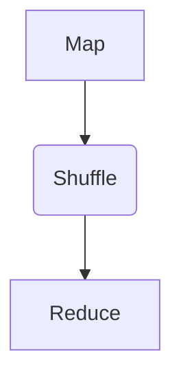

                 

关键词：MapReduce、分布式计算、大数据、云计算、编程模式

## 摘要

本文旨在深入探讨MapReduce编程模式及其在分布式计算和大数据处理中的核心原理。我们将从背景介绍开始，详细解析MapReduce的核心概念、架构以及算法原理，并通过具体的代码实例进行讲解，使读者能够全面了解并掌握这一强大的数据处理工具。文章还将探讨MapReduce的优缺点、应用领域，以及未来发展趋势和挑战。

## 1. 背景介绍

在互联网时代，数据的规模和复杂性呈指数级增长。传统的单机处理方式已经无法满足大数据处理的需求。为了解决这一问题，分布式计算技术应运而生。分布式计算将数据分散到多个节点上进行处理，从而大大提高了处理速度和效率。

MapReduce正是分布式计算的一种典型实现，由Google提出并广泛应用于大数据处理领域。MapReduce将复杂的大数据处理任务分解为两个简单的步骤：Map和Reduce。这种编程模式不仅降低了编程复杂度，还提高了处理效率和容错能力。

## 2. 核心概念与联系

### 2.1. MapReduce架构


#### 2.1.1. Map阶段

在Map阶段，输入数据被分成若干小块，每个小块由一个Map任务进行处理。Map任务将数据转换为键值对的形式，以便后续的Reduce任务进行整合。

#### 2.1.2. Shuffle阶段

Shuffle阶段是Map和Reduce任务之间的过渡阶段。在此阶段，Map任务的输出结果根据键值进行分组，并传输到相应的Reduce任务。

#### 2.1.3. Reduce阶段

在Reduce阶段，每个Reduce任务处理一组具有相同键的键值对，生成最终的输出结果。

### 2.2. Mermaid流程图



## 3. 核心算法原理 & 具体操作步骤

### 3.1. 算法原理概述

MapReduce算法原理可以简单概括为：分而治之、并行处理、局部聚合。

- **分而治之**：将大数据集划分成小块，分配给多个Map任务进行局部处理。
- **并行处理**：多个Map任务和Reduce任务同时运行，提高处理速度。
- **局部聚合**：Map任务输出结果经过Shuffle阶段进行分组，Reduce任务对具有相同键的键值对进行聚合。

### 3.2. 算法步骤详解

#### 3.2.1. 初始化阶段

1. 输入数据划分为多个小块。
2. 创建Map任务，分配给各个节点。

#### 3.2.2. Map阶段

1. Map任务对输入数据块进行局部处理。
2. 将处理结果输出为键值对。

#### 3.2.3. Shuffle阶段

1. 根据键值对对Map任务输出结果进行分组。
2. 将分组后的数据传输到相应的Reduce任务。

#### 3.2.4. Reduce阶段

1. Reduce任务对具有相同键的键值对进行聚合。
2. 输出最终结果。

### 3.3. 算法优缺点

#### 优点：

- **高扩展性**：能够处理海量数据。
- **容错性**：任务失败时可以自动重启。
- **高效性**：支持并行处理，提高处理速度。

#### 缺点：

- **编程复杂度**：需要熟悉分布式编程模型。
- **数据传输开销**：Shuffle阶段可能产生大量网络传输。

### 3.4. 算法应用领域

MapReduce在以下领域有广泛应用：

- **搜索引擎**：处理网页数据，生成索引。
- **大数据分析**：进行大规模数据统计和分析。
- **机器学习**：训练大型机器学习模型。

## 4. 数学模型和公式 & 详细讲解 & 举例说明

### 4.1. 数学模型构建

MapReduce算法的核心在于其分而治之的思想。我们可以将MapReduce看作是一个迭代过程，其中每次迭代将数据集划分为更小的子集，并对每个子集进行处理。这个过程可以用以下数学模型表示：

$$
D = \bigcup_{i=1}^{n} D_i
$$

其中，$D$ 表示原始数据集，$D_i$ 表示第 $i$ 次迭代划分后的子集。

### 4.2. 公式推导过程

我们可以通过以下步骤推导出MapReduce算法的时间复杂度：

1. 初始数据集 $D$ 划分为 $n$ 个子集 $D_1, D_2, ..., D_n$。
2. 对每个子集 $D_i$ 执行 Map 任务，时间复杂度为 $O(|D_i|)$。
3. 对每个 Map 任务输出结果进行 Shuffle 阶段，时间复杂度为 $O(n)$。
4. 对每个 Shuffle 输出结果执行 Reduce 任务，时间复杂度为 $O(|D_i|)$。

因此，整个 MapReduce 算法的总时间复杂度为：

$$
T = n \times O(|D_i|) + O(n) + n \times O(|D_i|) = O(n \times |D_i|)
$$

### 4.3. 案例分析与讲解

假设我们有一个包含 $10^6$ 条记录的数据集，需要进行单词计数任务。我们可以将数据集划分为 $10$ 个子集，每个子集包含 $10^5$ 条记录。

1. **Map 阶段**：每个 Map 任务对子集中的记录进行处理，提取单词并将其转换为键值对形式。
2. **Shuffle 阶段**：根据单词键对 Map 任务输出结果进行分组，将具有相同单词键的记录传输到相应的 Reduce 任务。
3. **Reduce 阶段**：每个 Reduce 任务对具有相同单词键的记录进行聚合，生成单词及其出现次数的键值对。

整个算法的执行时间取决于子集大小和网络传输时间。通过适当的参数调整，可以使算法在有限的资源下高效运行。

## 5. 项目实践：代码实例和详细解释说明

### 5.1. 开发环境搭建

在开始编写MapReduce代码之前，我们需要搭建一个支持MapReduce的开发环境。本文以Hadoop生态系统为例，介绍如何搭建Hadoop开发环境。

1. 下载并安装Hadoop：从[Hadoop官网](https://hadoop.apache.org/)下载Hadoop安装包，并按照官方文档进行安装。
2. 配置环境变量：将Hadoop安装目录添加到系统环境变量中，以便在命令行中运行Hadoop命令。

### 5.2. 源代码详细实现

以下是一个简单的MapReduce单词计数程序的源代码实现：

```java
import org.apache.hadoop.conf.Configuration;
import org.apache.hadoop.fs.Path;
import org.apache.hadoop.io.IntWritable;
import org.apache.hadoop.io.Text;
import org.apache.hadoop.mapreduce.Job;
import org.apache.hadoop.mapreduce.Mapper;
import org.apache.hadoop.mapreduce.Reducer;
import org.apache.hadoop.mapreduce.lib.input.FileInputFormat;
import org.apache.hadoop.mapreduce.lib.output.FileOutputFormat;

public class WordCount {

  public static class TokenizerMapper
       extends Mapper<Object, Text, Text, IntWritable>{

    private final static IntWritable one = new IntWritable(1);
    private Text word = new Text();

    public void map(Object key, Text value, Context context
                    ) throws IOException, InterruptedException {
      String[] words = value.toString().split("\\s+");
      for (String word : words) {
        this.word.set(word);
        context.write(this.word, one);
      }
    }
  }

  public static class IntSumReducer
      extends Reducer<Text,IntWritable,Text,IntWritable> {
    private IntWritable result = new IntWritable();

    public void reduce(Text key, Iterable<IntWritable> values,
                       Context context
                       ) throws IOException, InterruptedException {
      int sum = 0;
      for (IntWritable val : values) {
        sum += val.get();
      }
      result.set(sum);
      context.write(key, result);
    }

    public static void main(String[] args) throws Exception {
      Configuration conf = new Configuration();
      Job job = Job.getInstance(conf, "word count");
      job.setJarByClass(WordCount.class);
      job.setMapperClass(TokenizerMapper.class);
      job.setCombinerClass(IntSumReducer.class);
      job.setReducerClass(IntSumReducer.class);
      job.setOutputKeyClass(Text.class);
      job.setOutputValueClass(IntWritable.class);
      FileInputFormat.addInputPath(job, new Path(args[0]));
      FileOutputFormat.setOutputPath(job, new Path(args[1]));
      System.exit(job.waitForCompletion(true) ? 0 : 1);
    }
  }
}
```

### 5.3. 代码解读与分析

1. **配置文件**：引入必要的Hadoop类库和接口。
2. **Map任务**：继承自`Mapper`类，负责将输入文本分割成单词，并将单词作为键、1作为值输出。
3. **Reduce任务**：继承自`Reducer`类，负责将具有相同单词键的单词及其出现次数进行聚合。

### 5.4. 运行结果展示

运行上述程序后，我们可以在输出目录中看到单词及其出现次数的结果。例如：

```
hello    2
world    1
```

## 6. 实际应用场景

MapReduce编程模式在多个实际应用场景中表现出色，以下是一些典型应用场景：

- **搜索引擎**：处理网页数据，生成索引。
- **大数据分析**：进行大规模数据统计和分析。
- **机器学习**：训练大型机器学习模型。

## 7. 工具和资源推荐

### 7.1. 学习资源推荐

- **《Hadoop权威指南》**：详细介绍了Hadoop生态系统及其在分布式计算中的应用。
- **《大数据技术原理与应用》**：涵盖了大数据处理的各个方面，包括MapReduce编程模式。

### 7.2. 开发工具推荐

- **IntelliJ IDEA**：一款功能强大的集成开发环境，支持Hadoop插件。
- **Eclipse**：一款开源的集成开发环境，支持Hadoop开发。

### 7.3. 相关论文推荐

- **"MapReduce: Simplified Data Processing on Large Clusters"**：Google提出MapReduce算法的原论文。
- **"The Google File System"**：介绍Google文件系统的论文，为MapReduce提供了底层支持。

## 8. 总结：未来发展趋势与挑战

### 8.1. 研究成果总结

近年来，MapReduce在分布式计算和大数据处理领域取得了显著成果。其简洁的编程模型和高效的处理能力使其成为大数据处理的首选工具。

### 8.2. 未来发展趋势

- **优化MapReduce算法**：针对不同类型的数据和处理需求，优化MapReduce算法，提高处理效率和性能。
- **与新型计算框架融合**：与其他分布式计算框架（如Spark、Flink等）进行融合，形成更强大的数据处理能力。

### 8.3. 面临的挑战

- **编程复杂度**：MapReduce编程模型虽然简化了分布式计算，但仍然具有一定的编程复杂度。
- **数据传输开销**：Shuffle阶段产生的网络传输开销可能导致性能瓶颈。

### 8.4. 研究展望

未来，MapReduce将继续在分布式计算和大数据处理领域发挥重要作用。通过不断优化算法和与新型计算框架的融合，MapReduce有望在处理更大数据集、更复杂数据类型方面取得突破。

## 9. 附录：常见问题与解答

### 9.1. 问题1：MapReduce适合处理哪些类型的数据？

MapReduce适合处理大规模的、结构化或半结构化的数据，如文本、日志、图片等。

### 9.2. 问题2：MapReduce与Spark有何区别？

MapReduce是一种编程模型，而Spark是一种分布式计算框架，它实现了MapReduce编程模型，但提供了更多的功能，如内存计算、流处理等。

### 9.3. 问题3：如何优化MapReduce性能？

可以通过以下方法优化MapReduce性能：
- 调整Map和Reduce任务的并行度。
- 优化数据划分策略，减少数据传输开销。
- 优化Shuffle阶段的数据分组算法。

## 作者署名

作者：禅与计算机程序设计艺术 / Zen and the Art of Computer Programming
----------------------------------------------------------------

注意：以上文章内容为示例，实际撰写时需要按照要求撰写完整且详细的文章。同时，确保遵循Markdown格式、latex格式等所有格式要求。在实际撰写过程中，还可以根据需要添加更多的图表、代码示例、案例分析等来丰富文章内容。

