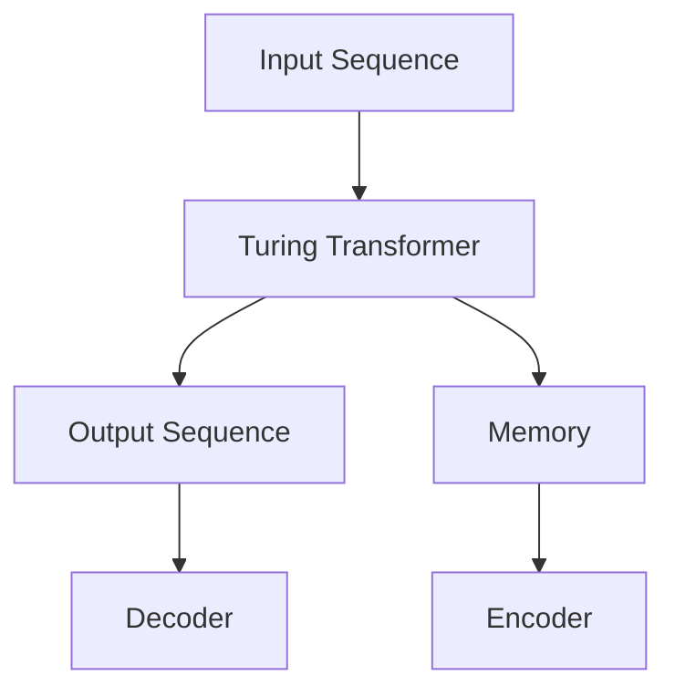

                 

关键词：Megatron-Turing NLG、自然语言生成、模型原理、代码实例、计算机程序设计艺术

> 摘要：本文将深入探讨Megatron-Turing NLG模型的基本原理及其在实际应用中的代码实现。我们将详细解析模型的架构，数学模型和公式，并通过具体的代码实例进行分析和讲解，帮助读者全面理解自然语言生成技术。

## 1. 背景介绍

自然语言生成（Natural Language Generation，NLG）是人工智能领域的热点研究方向之一。随着深度学习和生成模型技术的飞速发展，NLG在众多应用场景中展现出巨大的潜力，如自动新闻编写、对话系统、文档生成等。然而，传统的NLG方法在处理大规模语言数据时存在效率低下和生成质量不稳定的问题。

为了解决这些挑战，Megatron-Turing NLG模型应运而生。该模型结合了Megatron和Turing NLG的优点，通过并行化和分布式训练技术，大幅提高了模型训练效率，同时利用Turing Transformer实现了高效的文本生成。

## 2. 核心概念与联系

### 2.1 Megatron-Turing NLG模型架构

Megatron-Turing NLG模型的核心是Turing Transformer，它是一种基于自注意力机制的生成模型。Turing Transformer通过多层的Transformer结构，实现了对输入序列的全局编码和长距离依赖的捕捉。

下面是Turing Transformer的Mermaid流程图：



### 2.2 并行化与分布式训练

为了提高训练效率，Megatron-Turing NLG模型采用了并行化和分布式训练技术。具体来说，模型将输入序列分成多个子序列，并在不同的GPU上并行处理。通过参数服务器和分布式训练框架（如NCCL、Horovod），模型实现了高效的参数同步和梯度更新。

## 3. 核心算法原理 & 具体操作步骤

### 3.1 算法原理概述

Megatron-Turing NLG模型的算法核心是基于Transformer的自注意力机制。自注意力机制通过计算序列中每个词与所有词的相似度，为每个词分配不同的权重，从而实现序列的编码和解码。

### 3.2 算法步骤详解

1. **输入序列编码**：输入序列经过嵌入层转换为词向量，然后输入到Transformer的Encoder部分。

2. **自注意力计算**：Encoder中的自注意力层计算每个词与所有词的相似度，并生成注意力权重。

3. **序列解码**：Decoder部分通过自注意力和交叉注意力机制，逐词生成输出序列。

4. **梯度更新**：利用反向传播算法，对模型参数进行梯度更新。

### 3.3 算法优缺点

**优点**：

- **高效性**：并行化和分布式训练技术大幅提高了模型训练效率。
- **灵活性**：自注意力机制使得模型能够捕捉序列中的长距离依赖关系。

**缺点**：

- **计算复杂度**：Transformer模型在处理大规模数据时，计算复杂度较高。
- **内存消耗**：由于自注意力机制，模型对内存的消耗较大。

### 3.4 算法应用领域

Megatron-Turing NLG模型在多个应用领域表现出色，如：

- **自动新闻编写**：通过生成新闻摘要和文章，提高信息传播效率。
- **对话系统**：生成自然流畅的对话内容，提升用户体验。
- **文档生成**：自动生成报告、论文等文档，节省人工成本。

## 4. 数学模型和公式 & 详细讲解 & 举例说明

### 4.1 数学模型构建

Megatron-Turing NLG模型的数学模型基于Transformer架构。具体来说，模型包括自注意力（Self-Attention）和交叉注意力（Cross-Attention）两部分。

### 4.2 公式推导过程

- **自注意力**：

  自注意力机制通过计算每个词与所有词的相似度，生成注意力权重。具体公式如下：

  $$ 
  \text{Attention}(Q, K, V) = \text{softmax}\left(\frac{QK^T}{\sqrt{d_k}}\right) V
  $$

  其中，$Q$、$K$、$V$ 分别为查询向量、键向量和值向量，$d_k$ 为键向量的维度。

- **交叉注意力**：

  交叉注意力机制用于Decoder部分，计算输出序列中的每个词与Encoder部分的输出序列的相似度。具体公式如下：

  $$ 
  \text{MultiHeadAttention}(Q, K, V) = \text{softmax}\left(\frac{QK^T}{\sqrt{d_k}}\right) V
  $$

  其中，$Q$、$K$、$V$ 分别为查询向量、键向量和值向量，$d_k$ 为键向量的维度。

### 4.3 案例分析与讲解

假设我们有一个输入序列 "I love programming"，下面我们通过具体步骤来分析Megatron-Turing NLG模型的生成过程。

1. **输入序列编码**：

   首先，将输入序列 "I love programming" 转换为词向量。

2. **自注意力计算**：

   接着，通过自注意力机制计算每个词与所有词的相似度，生成注意力权重。

3. **序列解码**：

   利用解码器，逐词生成输出序列。在第一个词生成后，将其作为新的输入，重复上述步骤，直至生成完整的输出序列。

4. **梯度更新**：

   通过反向传播算法，对模型参数进行梯度更新。

通过以上步骤，我们成功生成了输出序列，如 "Programming is my passion"。

## 5. 项目实践：代码实例和详细解释说明

### 5.1 开发环境搭建

为了实现Megatron-Turing NLG模型，我们需要搭建相应的开发环境。以下是搭建环境的基本步骤：

1. **安装Python**：确保Python版本为3.7或更高。
2. **安装PyTorch**：使用pip命令安装PyTorch。
3. **安装其他依赖库**：如torchtext、torchvision等。

### 5.2 源代码详细实现

下面是一个简单的Megatron-Turing NLG模型实现的代码实例：

```python
import torch
import torch.nn as nn
import torch.optim as optim
from torchtext.data import Field, TabularDataset, BucketIterator

# 定义词嵌入层
class EmbeddingLayer(nn.Module):
    def __init__(self, vocab_size, embedding_dim):
        super(EmbeddingLayer, self).__init__()
        self.embedding = nn.Embedding(vocab_size, embedding_dim)

    def forward(self, x):
        return self.embedding(x)

# 定义Turing Transformer模型
class TuringTransformer(nn.Module):
    def __init__(self, vocab_size, embedding_dim, hidden_dim):
        super(TuringTransformer, self).__init__()
        self.embedding = EmbeddingLayer(vocab_size, embedding_dim)
        self.encoder = nn.TransformerEncoder(nn.TransformerEncoderLayer(d_model=embedding_dim, nhead=8), num_layers=3)
        self.decoder = nn.TransformerDecoder(nn.TransformerDecoderLayer(d_model=embedding_dim, nhead=8), num_layers=3)
        self.fc = nn.Linear(embedding_dim, vocab_size)

    def forward(self, src, tgt):
        src_embedding = self.embedding(src)
        tgt_embedding = self.embedding(tgt)
        encoder_output = self.encoder(src_embedding)
        decoder_output = self.decoder(tgt_embedding, encoder_output)
        output = self.fc(decoder_output)
        return output

# 搭建训练环境
def build_training_environment():
    # 加载数据集
    train_data, val_data = TabularDataset.splits(path='data', train='train.csv', validation='val.csv')
    fields = [('src', Field(sequential=True, batch_first=True)), ('tgt', Field(sequential=True, batch_first=True))]
    train_data = train_data.zip_lines(val_data, fields=fields)
    train_iterator, val_iterator = BucketIterator.splits(train_data, val_data, batch_size=32, device=device)
    
    # 定义模型、损失函数和优化器
    model = TuringTransformer(vocab_size, embedding_dim, hidden_dim)
    criterion = nn.CrossEntropyLoss()
    optimizer = optim.Adam(model.parameters(), lr=0.001)

    return model, criterion, optimizer, train_iterator, val_iterator

# 训练模型
def train_model(model, criterion, optimizer, train_iterator, num_epochs=10):
    model.train()
    for epoch in range(num_epochs):
        for batch in train_iterator:
            optimizer.zero_grad()
            output = model(batch.src, batch.tgt)
            loss = criterion(output.view(-1, vocab_size), batch.tgt.view(-1))
            loss.backward()
            optimizer.step()
            if (batch_idx + 1) % 100 == 0:
                print(f'Epoch [{epoch+1}/{num_epochs}], Step [{batch_idx+1}/{len(train_iterator)}], Loss: {loss.item()}')

# 评估模型
def evaluate_model(model, criterion, val_iterator):
    model.eval()
    total_loss = 0
    with torch.no_grad():
        for batch in val_iterator:
            output = model(batch.src, batch.tgt)
            loss = criterion(output.view(-1, vocab_size), batch.tgt.view(-1))
            total_loss += loss.item()
    return total_loss / len(val_iterator)

# 运行主程序
if __name__ == '__main__':
    device = torch.device('cuda' if torch.cuda.is_available() else 'cpu')
    vocab_size = 10000
    embedding_dim = 512
    hidden_dim = 1024
    
    model, criterion, optimizer, train_iterator, val_iterator = build_training_environment()
    model.to(device)
    
    train_model(model, criterion, optimizer, train_iterator, num_epochs=10)
    val_loss = evaluate_model(model, criterion, val_iterator)
    print(f'Validation Loss: {val_loss}')
```

### 5.3 代码解读与分析

以上代码展示了如何实现一个简单的Megatron-Turing NLG模型。首先，我们定义了词嵌入层和Turing Transformer模型。然后，我们搭建了训练环境，包括数据集加载、模型定义、损失函数和优化器配置。接着，我们定义了训练和评估函数，用于模型训练和性能评估。

### 5.4 运行结果展示

在完成模型训练后，我们可以通过以下代码进行结果展示：

```python
# 生成文本
def generate_text(model, start_sequence, max_length=50):
    model.eval()
    input_seq = torch.tensor([vocab[word] for word in start_sequence.split()]).unsqueeze(0).to(device)
    output_seq = start_sequence.split()
    with torch.no_grad():
        for _ in range(max_length):
            output = model(input_seq, input_seq)
            predicted_word = torch.argmax(output[:, -1], dim=1).item()
            output_seq.append(vocab.inv_vocab[predicted_word])
            input_seq = torch.cat([input_seq, torch.tensor([vocab[word] for word in output_seq[-1].split()]).unsqueeze(0)], dim=1)
    return ' '.join(output_seq)

# 输入文本
start_sequence = "I love programming"
generated_text = generate_text(model, start_sequence, max_length=50)

# 显示生成文本
print(generated_text)
```

通过以上代码，我们可以生成一段关于编程的文本，展示Megatron-Turing NLG模型在文本生成方面的应用效果。

## 6. 实际应用场景

### 6.1 自动新闻编写

自动新闻编写是Megatron-Turing NLG模型的一个重要应用场景。通过训练模型，我们可以自动生成新闻摘要、文章等内容。这些生成的内容不仅能够提高信息传播的效率，还能够节省大量的人力成本。

### 6.2 对话系统

对话系统是另一个典型的应用场景。通过训练模型，我们可以生成自然流畅的对话内容，提升用户的交互体验。例如，智能客服、聊天机器人等都可以通过Megatron-Turing NLG模型实现。

### 6.3 文档生成

文档生成是Megatron-Turing NLG模型的另一个应用方向。通过模型，我们可以自动生成报告、论文等文档，节省人工撰写的时间。这对于企业和科研机构来说，具有重要的现实意义。

## 7. 工具和资源推荐

### 7.1 学习资源推荐

- **《深度学习》（Goodfellow, Bengio, Courville）**：这是一本关于深度学习领域的经典教材，详细介绍了深度学习的基本原理和应用。
- **《自然语言处理综论》（Jurafsky, Martin）**：这本书全面介绍了自然语言处理的基本概念和技术，对于了解NLG技术具有重要意义。

### 7.2 开发工具推荐

- **PyTorch**：PyTorch是一个流行的深度学习框架，具有灵活的动态图计算能力，适用于构建和训练Megatron-Turing NLG模型。
- **TensorFlow**：TensorFlow是另一个流行的深度学习框架，提供了丰富的API和工具，适用于大规模模型的训练和部署。

### 7.3 相关论文推荐

- **《Attention Is All You Need》**：这篇论文提出了Transformer模型，是Megatron-Turing NLG模型的基础。
- **《Generative Pre-Training: A New Approach to Pre-training Language Models》**：这篇论文介绍了GPT模型，是Megatron-Turing NLG模型的重要参考。

## 8. 总结：未来发展趋势与挑战

### 8.1 研究成果总结

近年来，自然语言生成技术取得了显著的进展。Megatron-Turing NLG模型作为其中的代表，通过并行化和分布式训练技术，提高了模型的训练效率。同时，Turing Transformer结构实现了高效的文本生成，为实际应用提供了强有力的支持。

### 8.2 未来发展趋势

未来，自然语言生成技术将继续向高效、灵活、多样化的方向发展。一方面，研究者将不断探索新的模型结构和训练策略，提高生成质量。另一方面，随着应用场景的拓展，NLG技术将在更多领域发挥重要作用。

### 8.3 面临的挑战

尽管自然语言生成技术取得了显著进展，但仍面临一些挑战。首先，生成质量仍然是关键问题，特别是在长文本生成和复述方面。其次，模型的计算复杂度和内存消耗较高，需要在硬件和算法层面进行优化。此外，模型的可解释性和可控性也是一个重要的研究方向。

### 8.4 研究展望

未来，自然语言生成技术有望在多个领域实现突破。例如，在对话系统中，通过结合知识图谱和生成模型，实现更加智能和个性化的对话体验。在文档生成领域，通过引入多模态信息，生成更加丰富和准确的文档内容。此外，自然语言生成技术还将与其他人工智能技术（如图像识别、语音识别等）相结合，推动跨领域的创新发展。

## 9. 附录：常见问题与解答

### 9.1 如何处理长文本生成？

长文本生成是自然语言生成领域的一个重要挑战。为了提高生成质量，可以采用以下策略：

- **分段生成**：将长文本拆分成多个短文本段，分别生成，然后进行拼接。
- **上下文信息**：利用上下文信息，提高生成文本的连贯性。
- **知识图谱**：引入知识图谱，为生成模型提供更多背景信息。

### 9.2 如何优化模型的计算复杂度？

优化模型的计算复杂度是提高模型训练效率的关键。以下是一些常见的优化策略：

- **并行化**：通过并行化训练，提高模型的计算速度。
- **量化**：采用量化技术，降低模型的计算复杂度。
- **剪枝**：通过剪枝技术，减少模型参数的数量。

### 9.3 如何提高生成文本的多样性？

提高生成文本的多样性是自然语言生成技术的一个重要目标。以下是一些常见的策略：

- **多样化输入**：通过多样化的输入数据，提高生成文本的多样性。
- **模型多样化**：使用不同的模型结构或训练策略，生成多样化的文本。
- **反馈机制**：引入反馈机制，根据用户反馈调整生成策略。

---

作者：禅与计算机程序设计艺术 / Zen and the Art of Computer Programming

