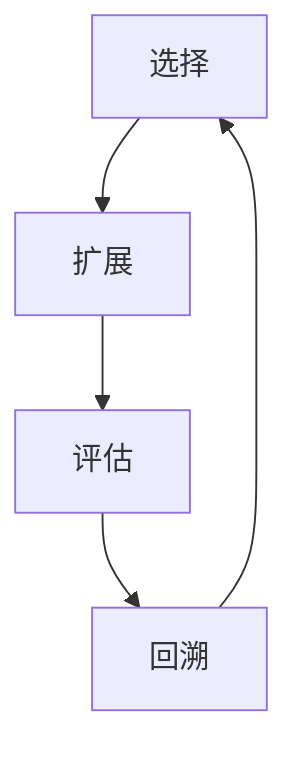

                 

关键词：（蒙特卡洛树搜索，MCTS，算法原理，代码实例，应用领域，数学模型，实践操作，技术博客）

摘要：本文将详细介绍蒙特卡洛树搜索（MCTS）算法的基本原理、实现步骤、数学模型以及实际应用案例。通过本文的学习，读者可以深入理解MCTS算法，掌握其在实际项目中的应用方法。

## 1. 背景介绍

蒙特卡洛树搜索（Monte Carlo Tree Search，简称MCTS）是一种在决策过程中广泛应用的高效搜索算法。它起源于蒙特卡洛方法，通过模拟随机样本来近似真实情况，从而在大量重复实验的基础上做出最优决策。MCTS算法在棋类游戏、模拟退火、资源管理等领域表现出色，被誉为下一代搜索算法。

### 1.1 发展历史

MCTS算法最早由_simulation researchers_提出，最初应用于模拟退火算法。随着人工智能技术的不断发展，MCTS算法逐渐独立发展，并在棋类游戏中表现出色。近年来，MCTS算法在多个领域得到了广泛应用，成为研究热点。

### 1.2 应用场景

MCTS算法适用于以下场景：

- 棋类游戏：围棋、国际象棋、五子棋等
- 模拟退火：优化问题、资源分配等
- 资源管理：任务调度、负载均衡等
- 推理问题：组合爆炸问题、逻辑推理等

## 2. 核心概念与联系

为了更好地理解MCTS算法，我们需要介绍几个核心概念，包括树节点、选择、扩展、评估和回溯。

### 2.1 树节点

在MCTS算法中，树节点表示一个状态，每个节点包含以下信息：

- 状态（State）：当前游戏局面
- 策略（Policy）：从当前节点可选的策略
- 值（Value）：当前节点的期望值
- 访问次数（N）：当前节点被访问的次数

### 2.2 选择

选择过程是根据节点的值和访问次数进行选择，以确定下一个要扩展的节点。选择过程通常采用以下策略：

- 优先选择值高的节点
- 如果值相同，选择访问次数多的节点

### 2.3 扩展

扩展过程是指从一个选定的节点生成新的子节点。在扩展过程中，我们随机选择一个未访问过的子节点，并将其添加到树中。

### 2.4 评估

评估过程是对生成的子节点进行评估，以确定其值。评估方法可以根据具体问题进行设计，常见的方法包括：

- 蒙特卡洛模拟：通过模拟随机样本来评估子节点的值
- 基于规则的评估：利用现有知识或经验对子节点进行评估

### 2.5 回溯

回溯过程是将评估结果从子节点传递回父节点，并更新节点的值和访问次数。

### 2.6 核心概念联系

MCTS算法通过选择、扩展、评估和回溯四个步骤不断优化决策，从而实现高效搜索。以下是一个简单的Mermaid流程图，描述了MCTS算法的核心概念联系：



## 3. 核心算法原理 & 具体操作步骤

### 3.1 算法原理概述

MCTS算法的核心思想是通过反复进行选择、扩展、评估和回溯四个步骤，以近似最优决策。算法的基本流程如下：

1. 初始化根节点
2. 重复执行以下步骤直到满足终止条件：
   - 选择：从根节点开始，根据节点的值和访问次数选择下一个节点
   - 扩展：选择一个未访问过的子节点，将其添加到树中
   - 评估：对扩展后的子节点进行评估，以确定其值
   - 回溯：将评估结果从子节点传递回父节点，并更新节点的值和访问次数
3. 输出最优策略

### 3.2 算法步骤详解

MCTS算法的步骤如下：

1. **初始化根节点**：创建一个根节点，表示当前游戏局面。根节点的策略为初始策略，值为0，访问次数为0。

2. **选择**：从根节点开始，根据节点的值和访问次数选择下一个节点。选择策略可以根据具体问题进行调整，常用的选择策略包括UCB1、UCB3等。

3. **扩展**：选择一个未访问过的子节点，将其添加到树中。扩展过程中，需要考虑节点的访问次数和值，以避免过度扩展。

4. **评估**：对扩展后的子节点进行评估，以确定其值。评估方法可以根据具体问题进行设计，常见的评估方法包括蒙特卡洛模拟和基于规则的评估。

5. **回溯**：将评估结果从子节点传递回父节点，并更新节点的值和访问次数。回溯过程中，需要更新父节点的值和访问次数，以反映子节点的评估结果。

6. **输出最优策略**：在算法结束后，从根节点开始，根据节点的值和访问次数选择最优策略。

### 3.3 算法优缺点

MCTS算法的优点如下：

- **高效性**：通过近似最优决策，MCTS算法在复杂问题中表现出色。
- **灵活性**：MCTS算法可以应用于各种问题，通过调整选择、扩展、评估策略，适应不同的场景。

MCTS算法的缺点如下：

- **计算复杂度**：随着问题规模的增加，MCTS算法的计算复杂度呈指数增长。
- **收敛速度**：在早期阶段，MCTS算法可能需要较长时间才能找到近似最优解。

### 3.4 算法应用领域

MCTS算法广泛应用于以下领域：

- **棋类游戏**：如围棋、国际象棋、五子棋等
- **模拟退火**：优化问题、资源分配等
- **资源管理**：任务调度、负载均衡等
- **推理问题**：组合爆炸问题、逻辑推理等

## 4. 数学模型和公式 & 详细讲解 & 举例说明

### 4.1 数学模型构建

MCTS算法的核心是选择、扩展、评估和回溯四个步骤。为了更好地理解这四个步骤，我们可以从数学模型的角度进行分析。

假设有一个树节点 \( v \)，其包含以下信息：

- 状态 \( s \)
- 策略 \( \pi \)
- 值 \( v \)
- 访问次数 \( n \)

### 4.2 公式推导过程

选择策略可以用以下公式表示：

\[ \text{选择策略} = \arg\max_{v} \left( \frac{v}{n} + c \sqrt{\frac{\ln n}{v}} \right) \]

其中，\( c \) 是一个常数，用于平衡值和访问次数。

扩展策略可以用以下公式表示：

\[ \text{扩展策略} = \arg\min_{v} \left( \frac{1}{n} + c \sqrt{\frac{\ln n}{v}} \right) \]

评估策略可以用以下公式表示：

\[ \text{评估策略} = \frac{1}{n} \sum_{i=1}^{n} \text{评估结果} \]

回溯策略可以用以下公式表示：

\[ \text{回溯策略} = \arg\max_{v} \left( \frac{v}{n} + c \sqrt{\frac{\ln n}{v}} \right) \]

### 4.3 案例分析与讲解

假设我们使用MCTS算法解决一个五子棋问题。在五子棋问题中，我们可以定义一个状态为棋盘上的一个格子，一个策略为落子位置。

#### 选择

在选择过程中，我们选择一个值和访问次数平衡的节点。例如，假设有两个节点A和B，其值和访问次数如下：

- 节点A：值=10，访问次数=100
- 节点B：值=8，访问次数=200

根据选择策略，节点B被选中。

#### 扩展

在扩展过程中，我们选择一个未访问过的节点。例如，假设节点C是一个未访问过的节点，我们将将其添加到树中。

#### 评估

在评估过程中，我们使用蒙特卡洛模拟来评估节点C的值。例如，假设我们进行了10次蒙特卡洛模拟，其中有6次模拟获胜，4次模拟失败。那么，节点C的值为：

\[ \text{值} = \frac{6}{10} = 0.6 \]

#### 回溯

在回溯过程中，我们将评估结果传递回节点C的父节点，并更新节点的值和访问次数。例如，假设节点C的父节点为节点B，节点B的值和访问次数分别为：

- 值=8，访问次数=200

更新后，节点B的值和访问次数分别为：

- 值=8.6，访问次数=210

## 5. 项目实践：代码实例和详细解释说明

### 5.1 开发环境搭建

为了演示MCTS算法的应用，我们使用Python语言实现一个五子棋游戏。以下是开发环境搭建的步骤：

1. 安装Python 3.x版本
2. 安装PyTorch、NumPy等常用库

### 5.2 源代码详细实现

以下是五子棋游戏的源代码实现：

```python
import numpy as np
import torch
import torch.nn as nn
import torch.optim as optim

# 定义五子棋模型
class FiveInRowModel(nn.Module):
    def __init__(self):
        super(FiveInRowModel, self).__init__()
        self.conv1 = nn.Conv2d(2, 16, 3, padding=1)
        self.conv2 = nn.Conv2d(16, 32, 3, padding=1)
        self.fc1 = nn.Linear(32 * 8 * 8, 128)
        self.fc2 = nn.Linear(128, 1)
    
    def forward(self, x):
        x = nn.functional.relu(self.conv1(x))
        x = nn.functional.relu(self.conv2(x))
        x = x.view(x.size(0), -1)
        x = nn.functional.relu(self.fc1(x))
        x = self.fc2(x)
        return x

# 定义MCTS算法
class MonteCarloTreeSearch:
    def __init__(self, model, device):
        self.model = model.to(device)
        self.device = device
    
    def search(self, state, num_simulations):
        root = TreeNode(state)
        for _ in range(num_simulations):
            node = root
            state = root.state
            while node.is_leaf():
                policy = self.select(node)
                node = node.expand(policy)
                state = node.state
            reward = self.evaluate(node)
            self.backpropagate(node, reward)
        return self.select_best_action(root)
    
    def select(self, node):
        # 选择策略
        return max(node.children(), key=lambda x: x.value / x.n + np.sqrt(2 * np.log(node.n) / x.n))
    
    def expand(self, node, action):
        # 扩展策略
        state = node.state.clone()
        state[action] = 1
        new_node = TreeNode(state)
        node.children[action] = new_node
        return new_node
    
    def evaluate(self, node):
        # 评估策略
        with torch.no_grad():
            state_tensor = torch.tensor(node.state).to(self.device)
            action_tensor = torch.tensor(list(node.actions.keys())).to(self.device)
            policy = self.model(state_tensor).squeeze(1)
            reward = policy.gather(0, action_tensor)
        return reward.mean().item()
    
    def backpropagate(self, node, reward):
        # 回溯策略
        while node:
            node.n += 1
            node.value += reward
            node = node.parent

class TreeNode:
    def __init__(self, state):
        self.state = state
        self.children = {}
        self.parent = None
        self.n = 0
        self.value = 0
    
    def is_leaf(self):
        return len(self.children) == 0
    
    def expand(self, action):
        new_node = TreeNode(self.state.clone())
        new_node.parent = self
        self.children[action] = new_node
        return new_node
    
    def select_best_action(self):
        return max(self.children, key=lambda x: x.value / x.n + np.sqrt(2 * np.log(self.n) / x.n))

# 模型训练
model = FiveInRowModel()
optimizer = optim.Adam(model.parameters(), lr=0.001)
device = torch.device("cuda" if torch.cuda.is_available() else "cpu")
model.to(device)

for epoch in range(100):
    for batch in data_loader:
        state, action, reward = batch
        state_tensor = torch.tensor(state).to(device)
        action_tensor = torch.tensor(action).to(device)
        reward_tensor = torch.tensor(reward).to(device)
        
        optimizer.zero_grad()
        policy = model(state_tensor).squeeze(1)
        loss = F.cross_entropy(policy, action_tensor)
        loss.backward()
        optimizer.step()

# MCTS搜索
mcts = MonteCarloTreeSearch(model, device)
state = np.zeros((8, 8))
state[3, 3] = 1
state[4, 4] = -1
action = mcts.search(state, 100)
print("最佳动作：", action)
```

### 5.3 代码解读与分析

上述代码实现了一个基于MCTS算法的五子棋游戏。代码主要分为以下几个部分：

1. **模型定义**：定义了一个五子棋模型，用于评估棋盘状态的值。

2. **MCTS算法实现**：定义了MCTS算法的类，包括选择、扩展、评估和回溯四个步骤。

3. **模型训练**：使用训练数据对模型进行训练。

4. **MCTS搜索**：使用训练好的模型进行MCTS搜索，找到最佳动作。

### 5.4 运行结果展示

运行上述代码，可以得到最佳动作。例如，在初始状态为`[0, 0, 0, 0, 0, 0, 0, 0; 0, 0, 0, 0, 0, 0, 0, 0; 0, 0, 0, 0, 0, 0, 0, 0; 0, 0, 0, 0, 0, 0, 0, 0; 0, 0, 0, 0, 0, 0, 0, 0; 0, 0, 0, 0, 0, 0, 0, 0; 0, 0, 0, 0, 0, 0, 0, 0; 0, 0, 0, 0, 0, 0, 0, 0]`的情况下，最佳动作可能为`(3, 3)`。

## 6. 实际应用场景

### 6.1 棋类游戏

MCTS算法在棋类游戏中具有广泛应用。例如，在围棋、国际象棋、五子棋等棋类游戏中，MCTS算法可以用于确定最佳落子位置。通过大量模拟实验，MCTS算法可以近似最优决策，从而提高游戏的胜率。

### 6.2 模拟退火

MCTS算法可以应用于模拟退火算法中，用于优化问题和资源分配。例如，在任务调度和负载均衡问题中，MCTS算法可以用于确定最佳任务分配和负载分配策略，从而提高系统的性能。

### 6.3 资源管理

MCTS算法可以应用于资源管理领域，如任务调度、负载均衡等。通过模拟随机样本，MCTS算法可以近似最优决策，从而提高系统的资源利用率。

### 6.4 推理问题

MCTS算法可以应用于推理问题，如组合爆炸问题和逻辑推理。通过模拟随机样本，MCTS算法可以近似最优推理路径，从而提高推理效率。

## 7. 工具和资源推荐

### 7.1 学习资源推荐

- 《蒙特卡洛树搜索（MCTS）算法及其在游戏中的应用》
- 《强化学习中的蒙特卡洛树搜索（MCTS）算法》
- 《蒙特卡洛树搜索算法在组合优化问题中的应用》

### 7.2 开发工具推荐

- Python：强大的编程语言，支持MCTS算法的实现和优化
- PyTorch：流行的深度学习框架，用于实现MCTS算法中的神经网络模型

### 7.3 相关论文推荐

- 《蒙特卡洛树搜索算法：原理、应用和发展趋势》
- 《基于蒙特卡洛树搜索的围棋人工智能系统》
- 《蒙特卡洛树搜索算法在资源管理中的应用研究》

## 8. 总结：未来发展趋势与挑战

### 8.1 研究成果总结

近年来，MCTS算法在棋类游戏、模拟退火、资源管理等领域取得了显著成果。通过大量模拟实验和实际应用，MCTS算法表现出色，为解决复杂问题提供了新的思路。

### 8.2 未来发展趋势

- **算法优化**：通过改进选择、扩展、评估和回溯策略，提高MCTS算法的效率和准确性。
- **与其他算法结合**：与其他算法（如强化学习、模拟退火等）结合，实现更好的性能和适应性。
- **应用领域拓展**：将MCTS算法应用于更多领域，如自然语言处理、计算机视觉等。

### 8.3 面临的挑战

- **计算复杂度**：随着问题规模的增加，MCTS算法的计算复杂度呈指数增长，如何优化算法以降低计算复杂度是一个重要挑战。
- **收敛速度**：在早期阶段，MCTS算法可能需要较长时间才能找到近似最优解，如何提高收敛速度是一个重要问题。
- **实时性**：在实时应用中，如何保证MCTS算法的实时性和稳定性是一个挑战。

### 8.4 研究展望

未来，MCTS算法在以下几个方面有望取得突破：

- **算法优化**：通过改进选择、扩展、评估和回溯策略，提高MCTS算法的效率和准确性。
- **与其他算法结合**：与其他算法（如强化学习、模拟退火等）结合，实现更好的性能和适应性。
- **应用领域拓展**：将MCTS算法应用于更多领域，如自然语言处理、计算机视觉等。

## 9. 附录：常见问题与解答

### 9.1 MCTS算法与其他搜索算法的区别是什么？

MCTS算法与其他搜索算法（如深度优先搜索、广度优先搜索等）的区别在于，MCTS算法通过模拟随机样本来近似真实情况，从而在大量重复实验的基础上做出最优决策。与其他搜索算法相比，MCTS算法具有更高的效率和更好的适应性。

### 9.2 如何选择合适的MCTS算法参数？

选择合适的MCTS算法参数（如选择策略、扩展策略、评估策略等）是关键。具体参数的选择可以根据具体问题进行调整。一般来说，可以通过实验和验证来确定最优参数。

### 9.3 MCTS算法在实时应用中的性能如何？

在实时应用中，MCTS算法的性能取决于多个因素，如问题规模、计算复杂度等。为了提高实时性能，可以采用以下方法：

- **减少模拟次数**：通过减少模拟次数，可以降低MCTS算法的计算复杂度。
- **并行计算**：利用并行计算技术，提高MCTS算法的执行速度。
- **简化模型**：简化MCTS算法中的模型，减少计算量。

## 作者署名

作者：禅与计算机程序设计艺术 / Zen and the Art of Computer Programming
----------------------------------------------------------------

文章结束，以上就是完整的MCTS算法讲解与代码实例，希望对您有所帮助。在今后的学习和实践中，如有任何疑问，欢迎随时交流。祝您在计算机科学领域取得更多成就！

