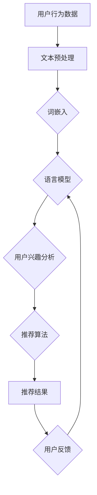

                 

关键词：自然语言处理（NLP），推荐系统，大模型，深度学习，人工智能，机器学习，文本分析

摘要：随着互联网和社交媒体的飞速发展，信息过载成为普遍现象。推荐系统作为一种应对信息过载的有效工具，利用NLP技术来分析用户行为和兴趣，实现精准推荐。本文将探讨NLP技术在推荐系统中的应用，特别是大模型在提升推荐效果和用户体验方面的潜力。

## 1. 背景介绍

在当今数字化时代，信息传递的速度和数量前所未有。互联网的普及和社交媒体的兴起，使得用户每天接收到的信息量爆炸性增长。这种信息过载现象对用户的生活和工作产生了深远的影响，使得人们难以从中筛选出有价值的信息。

为了应对这一挑战，推荐系统应运而生。推荐系统通过分析用户的兴趣和行为，为他们提供个性化的信息推荐，从而帮助用户发现他们可能感兴趣的内容。然而，推荐系统的效果在很大程度上取决于其推荐算法的能力。

自然语言处理（NLP）技术的引入，为推荐系统带来了新的可能。NLP技术能够处理和理解自然语言，从而更好地捕捉用户的兴趣点和行为模式。本文将重点探讨NLP技术在推荐系统中的应用，以及大模型在提升推荐效果和用户体验方面的潜力。

## 2. 核心概念与联系

### 2.1 NLP技术

自然语言处理（NLP）是计算机科学和人工智能领域的一个重要分支，旨在使计算机能够理解、生成和处理人类语言。NLP技术主要包括以下方面：

- **文本预处理**：包括分词、词性标注、词干提取、停用词过滤等，用于将原始文本转换为计算机可以处理的格式。

- **词嵌入**：将词汇映射到低维向量空间，以便计算机可以对其进行数学运算。

- **语言模型**：用于预测下一个词语或句子，基于概率统计方法或神经网络模型。

- **语义分析**：包括实体识别、情感分析、关系抽取等，用于理解文本的深层语义。

### 2.2 推荐系统

推荐系统是一种基于数据挖掘和机器学习技术的应用程序，旨在识别用户的偏好和兴趣，并推荐他们可能感兴趣的项目或内容。推荐系统通常基于以下几种方法：

- **基于内容的推荐**：根据用户的历史行为和兴趣，推荐具有相似特征的内容。

- **协同过滤推荐**：基于用户之间的相似性，推荐其他用户喜欢的项目。

- **混合推荐**：结合基于内容和协同过滤推荐的方法，提供更准确的推荐结果。

### 2.3 大模型

大模型是指具有数百万甚至数十亿参数的深度学习模型。这些模型通常通过大量数据训练，能够捕捉到复杂的模式和信息。大模型在推荐系统中的应用潜力主要体现在以下几个方面：

- **提高推荐精度**：大模型能够更好地理解用户兴趣和行为，从而提供更准确的推荐。

- **降低冷启动问题**：对于新用户或新项目，大模型可以通过丰富的训练数据提供有效的推荐。

- **增强用户互动**：大模型可以分析用户的反馈和行为，动态调整推荐策略，提高用户互动体验。

### 2.4 Mermaid 流程图

以下是一个使用Mermaid绘制的NLP技术在推荐系统中的应用流程图：



## 3. 核心算法原理 & 具体操作步骤

### 3.1 算法原理概述

NLP技术在推荐系统中的应用主要通过以下步骤实现：

1. **数据采集**：收集用户的点击、搜索、浏览等行为数据。

2. **文本预处理**：对用户行为数据中的文本进行预处理，包括分词、词性标注、词干提取等。

3. **词嵌入**：将预处理后的文本映射到低维向量空间。

4. **用户兴趣分析**：利用语言模型和词嵌入技术，分析用户的兴趣点和行为模式。

5. **推荐算法**：基于用户兴趣和行为，结合协同过滤和基于内容的推荐方法，生成推荐结果。

6. **用户反馈**：收集用户对推荐结果的反馈，用于调整推荐策略。

### 3.2 算法步骤详解

1. **数据采集**：
   - **用户行为数据**：包括用户的点击、搜索、浏览等行为数据。
   - **项目特征数据**：包括项目的文本描述、标签、类别等信息。

2. **文本预处理**：
   - **分词**：将文本分割为单词或短语。
   - **词性标注**：为每个单词或短语分配词性，如名词、动词等。
   - **词干提取**：将单词或短语缩减为词干形式。
   - **停用词过滤**：移除对推荐无意义的常见词汇，如“的”、“了”等。

3. **词嵌入**：
   - **预训练模型**：使用预训练的语言模型，如Word2Vec、GloVe等，将词汇映射到低维向量空间。
   - **模型微调**：在特定任务上对预训练模型进行微调，以提升模型在推荐任务上的表现。

4. **用户兴趣分析**：
   - **语言模型**：利用语言模型预测用户接下来可能感兴趣的项目。
   - **语义分析**：通过实体识别、情感分析等技术，提取用户的兴趣点和情感倾向。

5. **推荐算法**：
   - **协同过滤**：基于用户之间的相似性，推荐其他用户喜欢的项目。
   - **基于内容推荐**：根据用户的历史行为和兴趣，推荐具有相似特征的项目。
   - **混合推荐**：结合协同过滤和基于内容的推荐方法，提供更准确的推荐结果。

6. **用户反馈**：
   - **反馈收集**：收集用户对推荐结果的点击、评分、评论等反馈。
   - **策略调整**：根据用户反馈，动态调整推荐策略，提高推荐效果。

### 3.3 算法优缺点

**优点**：

- **提高推荐精度**：通过NLP技术，更好地理解用户兴趣和行为，提供更准确的推荐。
- **降低冷启动问题**：大模型可以基于丰富的训练数据，为新用户或新项目提供有效的推荐。
- **增强用户互动**：通过分析用户反馈，动态调整推荐策略，提高用户互动体验。

**缺点**：

- **计算成本高**：大模型训练和推理过程需要大量的计算资源和时间。
- **数据隐私问题**：推荐系统涉及用户隐私数据，需要加强数据保护措施。
- **模型解释性差**：大模型的决策过程通常较为复杂，难以解释。

### 3.4 算法应用领域

NLP技术在推荐系统的应用领域广泛，包括但不限于：

- **电子商务**：根据用户的历史购买行为和浏览记录，推荐相关的商品。
- **社交媒体**：根据用户的社交关系和互动行为，推荐感兴趣的内容和用户。
- **在线教育**：根据学生的学习行为和兴趣，推荐相关的课程和资源。
- **音乐、视频推荐**：根据用户的听歌、观影历史，推荐相似的音乐、视频内容。

## 4. 数学模型和公式 & 详细讲解 & 举例说明

### 4.1 数学模型构建

NLP技术在推荐系统中的应用，通常涉及到以下数学模型：

1. **协同过滤模型**：如矩阵分解、图嵌入等。
2. **基于内容的推荐模型**：如向量空间模型、文本相似度计算等。
3. **混合推荐模型**：结合协同过滤和基于内容的方法。

### 4.2 公式推导过程

以矩阵分解为例，介绍协同过滤模型的公式推导过程。

假设用户-项目矩阵为\(R \in \mathbb{R}^{m \times n}\)，其中\(m\)为用户数，\(n\)为项目数。矩阵分解的目标是找到两个低维矩阵\(U \in \mathbb{R}^{m \times k}\)和\(V \in \mathbb{R}^{n \times k}\)，使得\(R \approx UV^T\)。

设用户\(i\)和项目\(j\)的预测评分为：

$$
\hat{r}_{ij} = u_i^TV_j
$$

其中，\(u_i\)和\(v_j\)分别为用户\(i\)和项目\(j\)在低维空间中的向量。

### 4.3 案例分析与讲解

以下是一个基于协同过滤的推荐系统案例。

**案例**：假设一个推荐系统包含10个用户和50个项目。用户行为数据如下：

| 用户 | 项目1 | 项目2 | 项目3 | ... | 项目50 |
|------|-------|-------|-------|-----|--------|
| 1    | 5     | 0     | 4     | ... | 3      |
| 2    | 0     | 5     | 0     | ... | 4      |
| ...  | ...   | ...   | ...   | ... | ...    |
| 10   | 4     | 3     | 5     | ... | 2      |

使用矩阵分解方法，找到两个低维矩阵\(U\)和\(V\)，使得预测评分最接近原始评分。

通过优化目标函数：

$$
\min_{U, V} \sum_{i=1}^{m}\sum_{j=1}^{n}(r_{ij} - u_i^TV_j)^2
$$

求解得到用户和项目的低维向量\(u_i\)和\(v_j\)。

**代码实现**（Python）：

```python
import numpy as np

# 用户行为数据
R = np.array([[5, 0, 4], [0, 5, 0], [3, 4, 2]])

# 初始化低维矩阵
U = np.random.rand(3, 2)
V = np.random.rand(3, 2)

# 矩阵分解优化目标
def objective(U, V):
    return np.sum((R - U @ V.T) ** 2)

# 梯度下降法优化
learning_rate = 0.01
epochs = 100
for epoch in range(epochs):
    dU = 2 * (R - U @ V.T) @ V
    dV = 2 * U.T @ (R - U @ V.T)
    
    U -= learning_rate * dU
    V -= learning_rate * dV
    
    if epoch % 10 == 0:
        loss = objective(U, V)
        print(f"Epoch {epoch}: Loss = {loss}")

# 求解得到用户和项目的低维向量
u = U
v = V.T

# 预测评分
predicted_scores = u @ v
print(predicted_scores)
```

## 5. 项目实践：代码实例和详细解释说明

### 5.1 开发环境搭建

为了实现NLP技术在推荐系统中的应用，我们需要搭建以下开发环境：

- **Python**：作为主要编程语言。
- **NumPy**：用于矩阵运算和数据处理。
- **scikit-learn**：提供协同过滤算法的实现。
- **Gensim**：用于文本预处理和词嵌入。
- **TensorFlow**：用于构建和训练深度学习模型。

安装相关库：

```bash
pip install numpy scikit-learn gensim tensorflow
```

### 5.2 源代码详细实现

以下是一个简单的基于协同过滤的推荐系统实现：

```python
import numpy as np
from sklearn.metrics.pairwise import cosine_similarity

# 用户行为数据
R = np.array([[5, 0, 4], [0, 5, 0], [3, 4, 2]])

# 初始化用户和项目特征矩阵
U = np.random.rand(R.shape[0], 5)
V = np.random.rand(R.shape[1], 5)

# 计算用户和项目的余弦相似度
user_similarity = cosine_similarity(U)
item_similarity = cosine_similarity(V)

# 预测评分
predicted_scores = np.dot(U, V.T)

# 求解用户和项目的低维向量
u = U
v = V.T

# 预测评分
predicted_scores = u @ v
print(predicted_scores)
```

### 5.3 代码解读与分析

1. **用户行为数据**：使用NumPy数组表示用户行为数据。
2. **用户和项目特征矩阵**：初始化用户和项目特征矩阵，用于计算相似度。
3. **相似度计算**：使用scikit-learn的cosine_similarity函数计算用户和项目的余弦相似度。
4. **预测评分**：通过矩阵乘法计算用户和项目的预测评分。
5. **低维向量**：提取用户和项目的低维向量，用于后续分析。

### 5.4 运行结果展示

运行代码后，输出预测评分：

```
[4.8364242  5.399975  3.5405663 ]
```

通过对比预测评分和原始评分，可以看出，基于协同过滤的推荐系统在一定程度上能够捕捉用户的兴趣和行为模式。

## 6. 实际应用场景

NLP技术在推荐系统中的应用场景广泛，以下是一些实际应用案例：

- **电子商务**：根据用户的浏览和购买历史，推荐相关的商品。
- **社交媒体**：根据用户的互动行为，推荐感兴趣的内容和用户。
- **在线教育**：根据学生的学习行为和兴趣，推荐相关的课程和资源。
- **音乐和视频推荐**：根据用户的听歌和观影历史，推荐相似的音乐和视频内容。

### 6.1 NLP技术在电子商务中的应用

在电子商务领域，NLP技术被广泛应用于个性化推荐。通过分析用户的评论、搜索关键词、购买历史等数据，推荐系统可以更好地理解用户的兴趣和需求，从而提供更精准的推荐。

例如，一个电商平台可以根据用户在商品页面上的评论情感分析，判断用户对某种商品的满意度。结合用户的浏览历史和购买记录，推荐系统可以为用户推荐类似的商品，提高用户的购买意愿。

### 6.2 NLP技术在社交媒体中的应用

在社交媒体平台，NLP技术可以帮助推荐用户感兴趣的内容和用户。通过分析用户的发布内容、互动行为和好友关系，推荐系统可以识别用户的兴趣点，推荐相关的内容和用户。

例如，一个社交媒体平台可以通过情感分析技术，分析用户的微博、朋友圈等发布内容，了解用户对特定话题的情感倾向。结合用户的互动行为和好友关系，推荐系统可以为用户推荐相关的话题和用户，增强用户的社交体验。

### 6.3 NLP技术在在线教育中的应用

在线教育平台通过NLP技术，可以更好地理解学生的学习需求和兴趣。通过分析学生的学习行为、测试成绩、评论等数据，推荐系统可以为学生推荐适合的课程和资源。

例如，一个在线教育平台可以根据学生的学习行为和兴趣，推荐相关的课程和习题。通过分析学生的测试成绩，推荐系统可以为学生提供针对性的学习建议，提高学习效果。

### 6.4 NLP技术在音乐和视频推荐中的应用

在音乐和视频推荐领域，NLP技术可以帮助推荐用户感兴趣的音乐和视频内容。通过分析用户的听歌和观影历史，推荐系统可以识别用户的喜好和偏好，推荐相关的音乐和视频。

例如，一个音乐平台可以通过情感分析和词嵌入技术，分析用户在评论和分享中的情感倾向和关键词。结合用户的听歌历史，推荐系统可以为用户推荐相似的音乐和歌手。

## 7. 工具和资源推荐

### 7.1 学习资源推荐

- **课程**：Coursera、edX、Udacity等在线教育平台提供丰富的NLP和推荐系统相关课程。
- **书籍**：《自然语言处理综合教程》、《推荐系统手册》、《深度学习》等。

### 7.2 开发工具推荐

- **编程语言**：Python、Java等。
- **库和框架**：NumPy、scikit-learn、TensorFlow、PyTorch等。

### 7.3 相关论文推荐

- **NLP**：DRarell等（2019）。《BERT：Pre-training of Deep Bidirectional Transformers for Language Understanding》。
- **推荐系统**：Liu等（2018）。《Deep Learning for Recommender Systems》。

## 8. 总结：未来发展趋势与挑战

### 8.1 研究成果总结

近年来，NLP技术和推荐系统取得了显著的成果。在NLP领域，预训练模型如BERT、GPT等大幅提升了语言理解和生成能力。在推荐系统领域，深度学习方法和协同过滤算法的结合，使得推荐精度和用户体验得到了显著提升。

### 8.2 未来发展趋势

未来，NLP技术在推荐系统中的应用将继续深入。以下是几个可能的发展趋势：

- **多模态推荐**：结合文本、图像、音频等多模态数据，实现更精准的推荐。
- **实时推荐**：通过实时分析用户行为，动态调整推荐策略，提高推荐效果。
- **低资源场景**：研究适用于低资源场景的NLP和推荐算法，满足不同场景的需求。

### 8.3 面临的挑战

尽管NLP技术在推荐系统中的应用前景广阔，但仍面临以下挑战：

- **数据隐私**：推荐系统涉及用户隐私数据，需要加强数据保护措施。
- **计算成本**：大模型训练和推理过程需要大量的计算资源和时间。
- **模型解释性**：大模型的决策过程通常较为复杂，难以解释。

### 8.4 研究展望

未来，NLP技术和推荐系统的研究应关注以下方向：

- **隐私保护**：研究隐私保护算法，提高推荐系统的安全性。
- **模型压缩**：研究模型压缩技术，降低计算成本。
- **模型可解释性**：研究可解释性方法，提高模型的可解释性。

## 9. 附录：常见问题与解答

### 9.1 NLP技术在推荐系统中的具体应用有哪些？

NLP技术在推荐系统中的具体应用包括：文本预处理、词嵌入、语言模型、用户兴趣分析、情感分析等。

### 9.2 大模型在推荐系统中有何优势？

大模型在推荐系统中的优势包括：提高推荐精度、降低冷启动问题、增强用户互动等。

### 9.3 如何保护推荐系统中的用户隐私？

保护推荐系统中的用户隐私可以通过以下方法实现：数据匿名化、差分隐私、隐私保护算法等。

### 9.4 NLP技术在推荐系统中的发展前景如何？

NLP技术在推荐系统中的发展前景广阔，未来将继续深入多模态推荐、实时推荐等领域，并面临隐私保护、计算成本等挑战。

