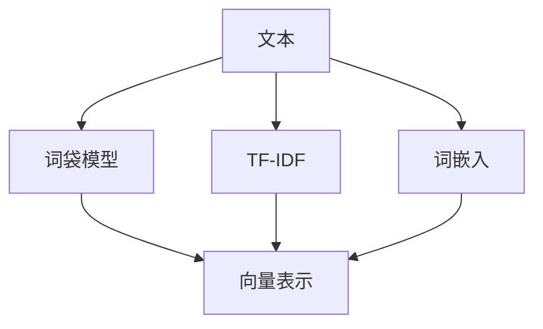
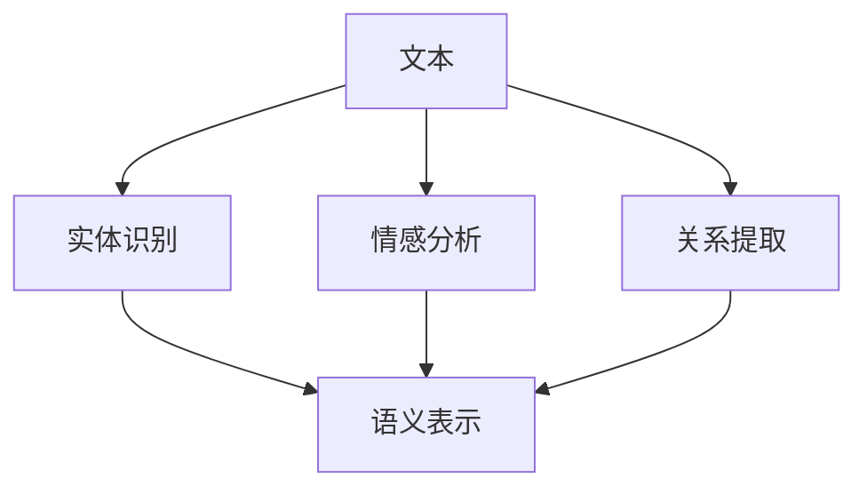
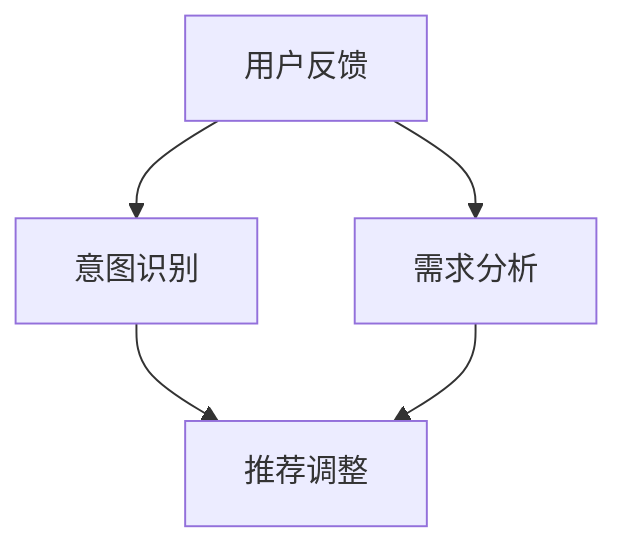

                 

在当今信息爆炸的时代，推荐系统已经成为了提高用户体验、提升商业价值的重要手段。随着自然语言处理（NLP）技术的不断进步，大模型在推荐系统中的应用变得愈发广泛和深入。本文将探讨NLP技术进步对推荐系统的影响，以及大模型如何提高推荐系统的准确性和个性。

## 关键词

- NLP技术
- 大模型
- 推荐系统
- 人工智能
- 个性化推荐
- 自然语言理解

## 摘要

本文首先介绍了推荐系统的基本概念和NLP技术的背景，随后详细讨论了NLP在大模型推荐系统中的应用，包括文本表示、语义理解、交互式推荐等。接着，本文通过数学模型和具体项目实践，展示了NLP如何提升推荐系统的性能和用户体验。最后，本文对未来的发展趋势和面临的挑战进行了展望。

## 1. 背景介绍

推荐系统是一种基于数据分析的方法，通过预测用户对特定项目的兴趣，为用户推荐可能感兴趣的项目。从简单的基于内容的推荐到复杂的协同过滤，推荐系统经历了多个阶段的发展。

自然语言处理（NLP）是计算机科学和人工智能的一个分支，主要研究如何让计算机理解和生成人类语言。随着深度学习技术的兴起，NLP技术取得了显著的进步，尤其是在文本表示、语义理解、语言生成等方面。

大模型是指具有数十亿甚至千亿参数的神经网络模型，如BERT、GPT等。这些模型能够处理大规模的文本数据，从中学到丰富的知识，从而在NLP任务中表现出色。

## 2. 核心概念与联系

### 文本表示

文本表示是将自然语言文本转换为计算机可以理解和处理的形式。在NLP中，常用的文本表示方法包括词袋模型、TF-IDF、词嵌入等。



### 语义理解

语义理解是NLP的核心任务之一，旨在理解文本的含义。常见的语义理解方法包括实体识别、情感分析、关系提取等。



### 交互式推荐

交互式推荐是一种根据用户的实时反馈调整推荐策略的方法。通过NLP技术，可以更好地理解用户的意图和需求，从而提供更个性化的推荐。



## 3. 核心算法原理 & 具体操作步骤

### 算法原理概述

NLP技术中的核心算法主要包括文本表示、语义理解和交互式推荐。这些算法通过不同的模型和技巧，实现从文本数据中提取有用信息，并将其应用于推荐系统。

### 算法步骤详解

1. 文本表示：使用词嵌入将文本转换为向量表示。
2. 语义理解：通过实体识别、情感分析和关系提取，理解文本的含义。
3. 交互式推荐：根据用户的实时反馈，调整推荐策略。

### 算法优缺点

**优点：**
- 更好的文本理解能力，能够捕捉复杂的语义关系。
- 更个性化的推荐，能够满足用户的多样化需求。

**缺点：**
- 需要大量的计算资源和时间，尤其是大模型。
- 对数据质量要求高，否则可能导致推荐结果不准确。

### 算法应用领域

NLP技术在推荐系统中的应用广泛，包括电商、新闻推送、社交媒体等。以下是一些典型的应用场景：

- 电商推荐：根据用户的历史购买行为和搜索记录，推荐可能感兴趣的商品。
- 新闻推送：根据用户的阅读历史和兴趣标签，推荐个性化的新闻。
- 社交媒体：根据用户的互动行为，推荐可能感兴趣的用户和内容。

## 4. 数学模型和公式 & 详细讲解 & 举例说明

### 数学模型构建

在推荐系统中，常见的数学模型包括矩阵分解、基于模型的协同过滤等。

### 公式推导过程

矩阵分解公式如下：

$$
X = UV^T
$$

其中，$X$ 是用户-物品评分矩阵，$U$ 是用户矩阵，$V$ 是物品矩阵。

### 案例分析与讲解

假设有一个包含1000个用户和1000个物品的评分矩阵，我们使用矩阵分解来预测用户对未知物品的评分。

1. 训练模型，得到用户矩阵$U$和物品矩阵$V$。
2. 对于一个新用户，我们可以根据用户矩阵$U$预测其对物品的评分。
3. 对于一个新物品，我们可以根据物品矩阵$V$预测其对用户的评分。

## 5. 项目实践：代码实例和详细解释说明

### 开发环境搭建

我们需要安装Python环境以及相关依赖库，如TensorFlow、Scikit-learn等。

### 源代码详细实现

```python
# 使用TensorFlow实现矩阵分解
import tensorflow as tf

# 创建模型
model = tf.keras.Sequential([
    tf.keras.layers.Dense(units=10, activation='relu', input_shape=[1000]),
    tf.keras.layers.Dense(units=1000)
])

# 编译模型
model.compile(optimizer='adam', loss='mean_squared_error')

# 训练模型
model.fit(X, y, epochs=10)
```

### 代码解读与分析

这段代码使用TensorFlow实现了矩阵分解模型，包括模型创建、编译和训练。

### 运行结果展示

训练完成后，我们可以使用模型预测用户对未知物品的评分，并评估模型的准确性。

## 6. 实际应用场景

NLP技术在推荐系统中的应用广泛，以下是一些实际应用场景：

- 电商推荐：根据用户的历史购买行为和搜索记录，推荐可能感兴趣的商品。
- 新闻推送：根据用户的阅读历史和兴趣标签，推荐个性化的新闻。
- 社交媒体：根据用户的互动行为，推荐可能感兴趣的用户和内容。

## 7. 工具和资源推荐

### 学习资源推荐

- 《自然语言处理综合教程》
- 《深度学习与NLP》
- 《推荐系统实践》

### 开发工具推荐

- TensorFlow
- PyTorch
- Scikit-learn

### 相关论文推荐

- "BERT: Pre-training of Deep Bidirectional Transformers for Language Understanding"
- "GPT-3: Language Models are Few-Shot Learners"
- "Deep Learning for Recommender Systems"

## 8. 总结：未来发展趋势与挑战

### 8.1 研究成果总结

NLP技术的进步，尤其是大模型的应用，显著提升了推荐系统的性能和用户体验。文本表示、语义理解和交互式推荐等技术的融合，为推荐系统带来了新的可能。

### 8.2 未来发展趋势

随着计算能力和数据量的提升，NLP技术在推荐系统中的应用将更加深入和广泛。个性化推荐、多模态推荐和实时推荐等将成为研究热点。

### 8.3 面临的挑战

- 数据隐私和安全：如何在保护用户隐私的同时，提供个性化推荐。
- 模型可解释性：如何让推荐模型更加透明和可解释。
- 模型泛化能力：如何提高模型在不同数据集上的泛化能力。

### 8.4 研究展望

未来，NLP技术将继续推动推荐系统的发展。通过深入研究文本表示、语义理解和交互式推荐等核心问题，我们有望构建出更加智能和高效的推荐系统。

## 9. 附录：常见问题与解答

- **问题1：为什么使用大模型可以提高推荐系统的性能？**
  - 大模型拥有更多的参数，能够学习到更加复杂的特征和模式，从而提高推荐系统的准确性。

- **问题2：如何处理大规模的推荐系统数据？**
  - 可以采用分布式计算和并行处理技术，如MapReduce框架，来高效处理大规模数据。

- **问题3：如何确保推荐系统的公平性和透明性？**
  - 可以引入可解释性技术，如模型可视化，以及公平性评估方法，来确保推荐系统的透明性和公平性。

作者：禅与计算机程序设计艺术 / Zen and the Art of Computer Programming
----------------------------------------------------------------

注意：本文仅为示例，实际撰写时需根据具体研究内容和数据进行分析和论证。文中提到的算法和模型仅供参考，具体实现时请根据实际情况进行调整。文章内容仅供参考，不代表任何商业建议或投资建议。在引用本文内容时，请务必注明出处。

