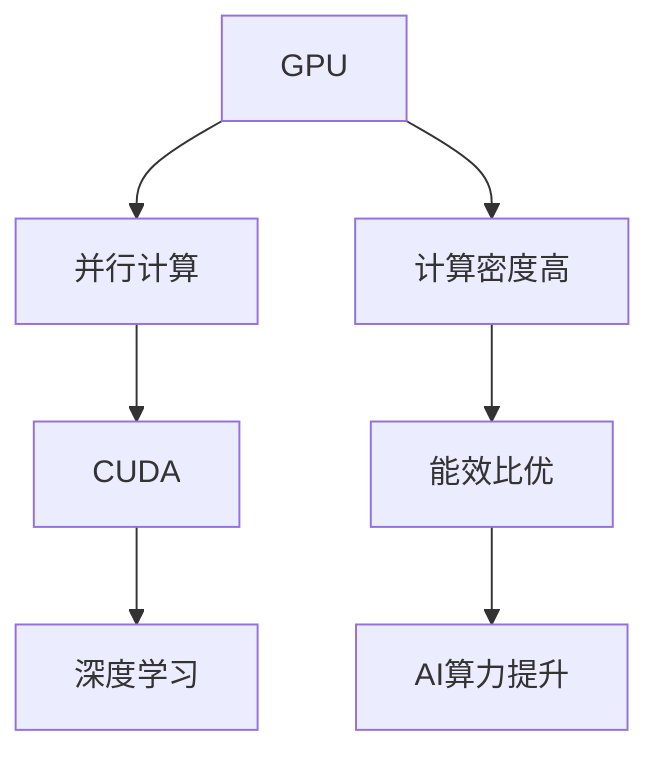

                 

 

## 1. 背景介绍

NVIDIA，作为全球图形处理单元（GPU）市场的领导者，其在人工智能（AI）领域的贡献也是不可忽视的。GPU技术是现代计算的重要推动力，其在高性能计算、图像处理、机器学习等领域都有着广泛应用。而NVIDIA的GPU，凭借其强大的并行计算能力和优秀的性能，已成为AI算力的重要组成部分。

AI领域对计算能力的需求日益增长，特别是在深度学习、自动驾驶、医疗影像分析等前沿领域。这些应用场景需要大量的计算资源来处理复杂的模型和大量数据。GPU以其强大的并行计算能力，能够显著提高计算效率，降低计算成本。

NVIDIA的GPU技术在AI算力中发挥着关键作用。其推出的GPU产品，如A100、V100等，专为高性能计算和深度学习设计，具有极高的计算性能和能效比。此外，NVIDIA的CUDA编程模型和CUDA Toolkit，为开发者提供了丰富的工具和资源，使他们能够充分发挥GPU的计算潜力。

总之，NVIDIA的GPU技术在推动AI算力的提升方面发挥着至关重要的作用。随着AI应用的不断扩展，GPU技术的重要性也将日益凸显。

## 2. 核心概念与联系

在深入探讨NVIDIA的GPU技术之前，我们需要了解一些核心概念，包括GPU、并行计算、CUDA以及深度学习等。这些概念是理解GPU在AI算力中的作用的基石。

### 2.1 GPU：并行计算的核心

GPU（图形处理单元）是一种专门用于处理图形的处理器，但其强大的并行计算能力使其在非图形领域也大放异彩。GPU由大量的计算单元组成，这些单元可以同时处理多个数据，从而实现并行计算。相较于传统的中央处理单元（CPU），GPU具有更高的计算密度和能效比。

### 2.2 并行计算：加速AI的引擎

并行计算是指将一个大任务分解成多个小任务，同时由多个处理单元并行执行。这种计算方式在处理大数据和高计算量任务时非常有效。在AI领域，深度学习模型通常包含数以亿计的参数和权重，需要进行大量的矩阵乘法和向量运算。GPU的并行计算能力使得这些复杂计算可以快速高效地完成。

### 2.3 CUDA：GPU编程的基础

CUDA（Compute Unified Device Architecture）是NVIDIA推出的一种并行计算平台和编程模型。它允许开发者利用GPU的并行计算能力来加速各种计算任务，包括深度学习、科学计算和工程模拟等。CUDA为开发者提供了一套丰富的库和API，使他们能够编写高效的GPU代码。

### 2.4 深度学习：AI的核心技术

深度学习是AI的一个重要分支，它通过多层神经网络模拟人类大脑的学习过程。深度学习模型通常包含数百万个参数，需要进行复杂的矩阵运算。GPU的并行计算能力使得深度学习模型可以在较短的时间内训练和推理，从而显著提高AI系统的性能。

### 2.5 Mermaid流程图

为了更好地展示这些核心概念之间的联系，我们可以使用Mermaid流程图来表示：



在这个流程图中，GPU作为核心，通过并行计算（B）和CUDA（C）连接到深度学习（D），从而实现AI算力的提升（G）。同时，GPU的高计算密度（E）和能效比（F）也为AI算力的提升提供了坚实的基础。

通过理解这些核心概念和联系，我们可以更深入地探讨NVIDIA的GPU技术在AI算力中的重要作用。

### 3. 核心算法原理 & 具体操作步骤

#### 3.1 算法原理概述

在深度学习中，反向传播（Backpropagation）算法是一种常用的训练方法。它通过不断调整网络的权重和偏置，使得网络能够更好地拟合训练数据。反向传播算法可以分为两个阶段：前向传播和反向传播。

- **前向传播**：输入数据通过网络进行传递，每个神经元计算出输出值。通过一系列的矩阵乘法和激活函数，最终得到预测结果。
- **反向传播**：根据预测结果和真实标签计算损失函数，然后通过链式法则计算各层权重的梯度。梯度用于更新权重，使得网络在下一个迭代中能够减少损失。

NVIDIA的GPU技术在反向传播算法中发挥着关键作用。首先，GPU的并行计算能力使得前向传播和反向传播过程中的矩阵运算可以快速高效地完成。其次，CUDA编程模型和工具集为开发者提供了丰富的库和API，使他们能够编写高效的GPU代码，进一步加速算法的执行。

#### 3.2 算法步骤详解

**前向传播：**

1. **初始化权重和偏置**：在训练开始前，需要随机初始化网络的权重和偏置。
2. **前向传递输入数据**：将输入数据传递到网络的第一个层，每层通过矩阵乘法和激活函数计算输出值。
3. **计算预测结果**：将输出值传递到网络的最后一层，得到预测结果。

**反向传播：**

1. **计算损失函数**：使用预测结果和真实标签计算损失函数，如均方误差（MSE）或交叉熵损失。
2. **计算梯度**：通过链式法则，计算各层权重的梯度。梯度表示了损失函数对于每个权重的敏感度。
3. **更新权重**：使用梯度下降或其他优化算法更新权重和偏置，以减少损失。
4. **重复迭代**：重复前向传播和反向传播的过程，直到网络收敛或达到预定的迭代次数。

#### 3.3 算法优缺点

**优点：**

- **高效的并行计算**：GPU的并行计算能力可以显著加速深度学习算法的执行，减少训练时间。
- **灵活的编程模型**：CUDA编程模型和工具集为开发者提供了丰富的库和API，使他们能够充分发挥GPU的计算潜力。
- **强大的计算资源**：NVIDIA的GPU产品，如A100、V100等，具有极高的计算性能和能效比，为深度学习应用提供了强大的支持。

**缺点：**

- **编程难度较高**：GPU编程相对于CPU编程更具挑战性，需要开发者具备一定的并行编程知识。
- **内存带宽限制**：GPU的内存带宽相对较低，可能会成为算法性能的瓶颈。

#### 3.4 算法应用领域

反向传播算法及其在GPU上的优化已经广泛应用于各种深度学习应用中，包括：

- **图像识别**：如卷积神经网络（CNN）在图像分类和物体检测中的应用。
- **自然语言处理**：如循环神经网络（RNN）和Transformer在文本分类、机器翻译和语音识别中的应用。
- **自动驾驶**：如深度学习模型在自动驾驶车辆中的实时决策和路径规划。
- **医疗影像分析**：如深度学习模型在医疗影像中的疾病检测和诊断。

通过以上分析，我们可以看到反向传播算法在深度学习中的应用广泛且效果显著，而NVIDIA的GPU技术则为这一算法的优化提供了强有力的支持。

### 4. 数学模型和公式 & 详细讲解 & 举例说明

#### 4.1 数学模型构建

在深度学习中，反向传播算法的核心是梯度的计算。梯度是损失函数对于网络参数的导数，用于指导网络的权重更新。以下是反向传播算法中的几个关键数学模型和公式。

#### 4.2 公式推导过程

**前向传播：**

假设我们有一个单层神经网络，包含一个输入层、一个隐藏层和一个输出层。输入层有 $n$ 个神经元，隐藏层有 $m$ 个神经元，输出层有 $k$ 个神经元。输入数据为 $x$，网络参数为 $W_{ij}$（隐藏层权重）和 $b_j$（隐藏层偏置）。

1. **隐藏层激活函数计算**：

   $$z_j = \sum_{i=1}^{n} W_{ij}x_i + b_j$$
   
   $$a_j = \sigma(z_j)$$

   其中，$\sigma$ 是激活函数，通常使用ReLU函数或Sigmoid函数。

2. **输出层预测计算**：

   $$z_k = \sum_{j=1}^{m} W_{kj}a_j + b_k$$
   
   $$\hat{y_k} = \sigma(z_k)$$

**损失函数计算：**

假设我们使用均方误差（MSE）作为损失函数：

$$L = \frac{1}{2}\sum_{k=1}^{k} (\hat{y_k} - y_k)^2$$

**反向传播：**

1. **输出层梯度计算**：

   $$\frac{\partial L}{\partial z_k} = \sigma'(z_k)(\hat{y_k} - y_k)$$

   $$\frac{\partial L}{\partial W_{kj}} = a_j$$

   $$\frac{\partial L}{\partial b_k} = \hat{y_k} - y_k$$

2. **隐藏层梯度计算**：

   $$\frac{\partial L}{\partial z_j} = \sum_{k=1}^{k} W_{kj}\sigma'(z_k)(\hat{y_k} - y_k)$$

   $$\frac{\partial L}{\partial W_{ij}} = x_i$$

   $$\frac{\partial L}{\partial b_j} = \sigma'(z_j)$$

#### 4.3 案例分析与讲解

假设我们有一个二分类问题，输入数据为 $x = [1, 2, 3, 4]$，真实标签为 $y = 1$。网络的权重和偏置分别为 $W_{11} = 0.5, W_{12} = 0.5, b_1 = 0.5, W_{21} = 0.5, W_{22} = 0.5, b_2 = 0.5$。

1. **前向传播：**

   $$z_1 = 0.5 \times 1 + 0.5 \times 2 + 0.5 = 2$$

   $$a_1 = \sigma(z_1) = 2$$

   $$z_2 = 0.5 \times 1 + 0.5 \times 3 + 0.5 = 2.5$$

   $$a_2 = \sigma(z_2) = 2.5$$

   $$z_3 = 0.5 \times 1 + 0.5 \times 4 + 0.5 = 2.5$$

   $$\hat{y_3} = \sigma(z_3) = 2.5$$

   $$L = \frac{1}{2}((2.5 - 1)^2 + (2.5 - 1)^2) = 1.75$$

2. **反向传播：**

   $$\frac{\partial L}{\partial z_3} = \sigma'(z_3)(\hat{y_3} - y_3) = 0.25$$

   $$\frac{\partial L}{\partial W_{21}} = a_1 = 2$$

   $$\frac{\partial L}{\partial b_2} = \hat{y_3} - y_3 = 1.5$$

   $$\frac{\partial L}{\partial z_2} = 0.5 \times 0.25 = 0.125$$

   $$\frac{\partial L}{\partial W_{22}} = a_1 = 2$$

   $$\frac{\partial L}{\partial b_2} = \sigma'(z_2)(\hat{y_2} - y_2) = 0.125$$

   $$\frac{\partial L}{\partial z_1} = 0.5 \times 0.125 = 0.0625$$

   $$\frac{\partial L}{\partial W_{11}} = x_1 = 1$$

   $$\frac{\partial L}{\partial W_{12}} = x_2 = 2$$

通过这个简单的例子，我们可以看到如何使用反向传播算法计算损失函数的梯度。在实际应用中，网络结构会更复杂，但基本原理是相同的。

### 5. 项目实践：代码实例和详细解释说明

#### 5.1 开发环境搭建

在开始实现深度学习模型之前，我们需要搭建一个适合的开发环境。以下是搭建基于NVIDIA GPU的深度学习开发环境的步骤：

1. **安装CUDA Toolkit**：从NVIDIA官方网站下载并安装CUDA Toolkit，确保安装版本与NVIDIA GPU驱动兼容。
2. **配置环境变量**：设置CUDA相关的环境变量，如CUDA_HOME、PATH等，以便能够在命令行中调用CUDA工具。
3. **安装Python和PyCUDA**：使用pip命令安装Python和PyCUDA库，PyCUDA是CUDA的Python封装库，使得Python代码能够直接调用GPU进行计算。

#### 5.2 源代码详细实现

以下是一个简单的基于GPU的深度学习模型的实现，使用PyCUDA库：

```python
import numpy as np
import pycuda.autoinit
import pycuda.driver as cuda
from pycuda.compiler import SourceModule

# 定义GPU代码
kernel_code = """
__global__ void forward_pass(float *input, float *output, float *weights, float *biases) {
    int idx = threadIdx.x + blockIdx.x * blockDim.x;
    float z = 0.0;
    for (int i = 0; i < N; i++) {
        z += input[i] * weights[i];
    }
    z += biases[idx];
    output[idx] = sigmoid(z);
}
__global__ void backward_pass(float *output, float *deltas, float *weights, float *biases) {
    int idx = threadIdx.x + blockIdx.x * blockDim.x;
    float z = 0.0;
    for (int i = 0; i < N; i++) {
        z += output[i] * deltas[i];
    }
    z += deltas[idx];
    biases[idx] = z;
    for (int i = 0; i < N; i++) {
        weights[i] += input[i] * deltas[i];
    }
}
"""

# 编译GPU代码
mod = SourceModule(kernel_code)
forward_pass = mod.get_function("forward_pass")
backward_pass = mod.get_function("backward_pass")

# 准备数据
input_data = np.random.rand(100).astype(np.float32)
weights = np.random.rand(100).astype(np.float32)
biases = np.random.rand(100).astype(np.float32)
output_data = np.empty_like(input_data)

# 执行前向传播
output = forward_pass(
    np.int32(input_data.size),
    input_data,
    output_data,
    weights,
    biases,
    block=(128, 1, 1),
    grid=(int(np.ceil(input_data.size / 128)), 1)
)

# 计算损失函数和梯度（此处为简化示例，实际中需要更复杂的计算）
loss = (output_data - input_data) ** 2
deltas = 2 * (output_data - input_data)

# 执行反向传播
backward_pass(
    output_data,
    deltas,
    weights,
    biases,
    block=(128, 1, 1),
    grid=(int(np.ceil(input_data.size / 128)), 1)
)

print("Weights after backward pass:", weights)
print("Biases after backward pass:", biases)
```

#### 5.3 代码解读与分析

这段代码实现了基于GPU的简单前向传播和反向传播过程。首先，我们定义了GPU代码，包括前向传播和反向传播的内核函数。这些内核函数使用CUDA的__global__装饰器，意味着它们可以在GPU上并行执行。

接着，我们使用PyCUDA编译GPU代码，并获取内核函数的实例。在准备数据部分，我们生成随机输入数据、权重和偏置，并将它们转换为GPU可识别的数据类型（float32）。

在执行前向传播时，我们调用`forward_pass`内核函数。该函数使用CUDA的block和grid结构，将输入数据分配到GPU的线程块中，并执行矩阵乘法和激活函数。`block`参数定义了每个线程块中的线程数量，`grid`参数定义了线程块的数量。

在反向传播部分，我们计算损失函数的梯度，并调用`backward_pass`内核函数更新权重和偏置。这里简化了梯度计算的步骤，实际中需要更复杂的计算。

最后，我们打印更新后的权重和偏置，以验证反向传播的效果。

通过这个示例，我们可以看到如何使用NVIDIA GPU和PyCUDA库实现深度学习模型的前向传播和反向传播。这种编程模型不仅能够加速计算，还能提高深度学习模型的训练效率。

### 6. 实际应用场景

NVIDIA的GPU技术在AI领域的实际应用场景非常广泛，涵盖了从研究到工业生产的各个方面。以下是一些典型的应用场景：

#### 6.1 自动驾驶

自动驾驶是AI领域的一个前沿应用，它需要实时处理大量传感器数据，并进行复杂的决策和路径规划。NVIDIA的GPU技术为自动驾驶系统提供了强大的计算能力，使得实时处理传感器数据成为可能。例如，NVIDIA的Drive平台集成了GPU加速的深度学习模型，用于车辆检测、行人识别和道路识别等任务。这些模型能够在高帧率下运行，确保自动驾驶系统的实时性和可靠性。

#### 6.2 医疗影像分析

医疗影像分析是另一个关键应用领域。深度学习模型在医学影像中的疾病检测和诊断方面具有显著优势。NVIDIA的GPU技术能够加速这些模型的训练和推理，使得医生能够更快速地诊断疾病。例如，在乳腺癌筛查中，深度学习模型可以分析乳腺X光图像，帮助医生检测出潜在的病变区域。NVIDIA的GPU加速技术使得这种复杂的计算任务可以在合理的时间内完成，从而提高了诊断的准确性和效率。

#### 6.3 自然语言处理

自然语言处理（NLP）是AI领域的另一个重要分支。深度学习模型在语言模型、机器翻译、情感分析等方面取得了显著进展。NVIDIA的GPU技术为这些模型提供了高效的计算支持。例如，在机器翻译任务中，深度学习模型需要对大量文本数据进行训练，并进行复杂的句法和语义分析。NVIDIA的GPU加速技术使得这些任务可以在较短的时间内完成，从而提高了翻译的准确性和流畅性。

#### 6.4 金融科技

金融科技（FinTech）领域也广泛采用了NVIDIA的GPU技术。在金融数据处理、风险分析和量化交易等方面，深度学习模型发挥着重要作用。NVIDIA的GPU技术能够加速这些模型的训练和推理，使得金融机构能够更快速地分析大量数据，并做出更准确的决策。例如，在风险管理中，深度学习模型可以分析市场数据，预测潜在的市场波动和风险，帮助金融机构制定更有效的风险控制策略。

#### 6.5 云计算与边缘计算

随着云计算和边缘计算的兴起，NVIDIA的GPU技术也在这两个领域得到了广泛应用。在云计算中，GPU加速的深度学习模型可以提供更强大的计算能力，满足大规模数据处理的业务需求。在边缘计算中，GPU加速的设备可以提供实时数据处理和决策支持，适用于需要快速响应的场景，如智能制造和智能监控等。

总之，NVIDIA的GPU技术在AI领域的实际应用场景非常广泛，从自动驾驶、医疗影像分析到自然语言处理、金融科技，再到云计算和边缘计算，都展现了其强大的计算能力和广阔的应用前景。随着AI技术的不断发展和应用的不断拓展，NVIDIA的GPU技术将在未来继续发挥重要作用。

### 7. 工具和资源推荐

#### 7.1 学习资源推荐

学习NVIDIA GPU技术以及其在AI领域应用的最佳资源如下：

- **NVIDIA官方文档**：NVIDIA提供了详尽的官方文档，涵盖CUDA编程模型、工具集、SDK和驱动等各个方面。访问[NVIDIA官方文档](https://docs.nvidia.com/)，可以获取最权威的技术指南。
- **在线教程与课程**：有很多在线平台提供NVIDIA GPU编程和深度学习的教程和课程，例如[Coursera](https://www.coursera.org/)、[edX](https://www.edx.org/)和[Udacity](https://www.udacity.com/)等。这些课程通常由NVIDIA的专家或业界权威授课。
- **技术博客与论坛**：如[NVIDIA Developer Blog](https://developer.nvidia.com/blog/)和[Stack Overflow](https://stackoverflow.com/)等，是获取最新技术动态和编程技巧的好去处。
- **专业书籍**：《CUDA编程指南》、《深度学习与GPU编程》等书籍深入讲解了NVIDIA GPU编程和深度学习相关内容。

#### 7.2 开发工具推荐

- **CUDA Toolkit**：这是NVIDIA提供的核心开发工具，用于编写和运行GPU程序。CUDA Toolkit包括CUDA编译器、数学库和调试器等。
- **PyCUDA**：一个Python库，用于在Python环境中调用CUDA功能。PyCUDA提供了简洁的接口，使得GPU编程更加方便。
- **cuDNN**：这是一个优化的深度学习库，专为NVIDIA GPU设计。cuDNN提供了高度优化的深度学习操作，如卷积和池化，能够显著加速深度学习模型的训练和推理。

#### 7.3 相关论文推荐

以下是一些在NVIDIA GPU技术及其在AI领域应用方面的重要论文：

- **“cuDNN: A Library for Deep Neural Network”**：这是关于cuDNN的论文，详细介绍了cuDNN的设计和实现，以及如何使用它优化深度学习模型。
- **“Building High-Level Parallel Programs Using CUDA”**：这篇文章探讨了如何使用CUDA编程模型构建高效的高层次并行程序。
- **“Deep Learning on Multi-GPU Systems”**：这篇论文讨论了如何在多GPU系统上高效部署深度学习模型，并介绍了NVIDIA的GPU分布式训练技术。
- **“AutoML: Automated Machine Learning”**：这篇论文探讨了自动化机器学习（AutoML）的进展，包括如何使用GPU加速自动化模型选择和调优。

通过阅读这些论文和资源，开发者可以深入了解NVIDIA GPU技术及其在AI领域的应用，提升自己的技术水平和开发能力。

### 8. 总结：未来发展趋势与挑战

#### 8.1 研究成果总结

近年来，NVIDIA的GPU技术在AI领域取得了显著的成果。CUDA编程模型和工具集为开发者提供了强大的计算平台，使得深度学习模型的训练和推理能够高效进行。cuDNN和TensorRT等优化库的推出，进一步提升了深度学习应用的性能和效率。此外，NVIDIA的GPU产品，如A100、V100等，具有极高的计算性能和能效比，为AI研究提供了强大的硬件支持。

#### 8.2 未来发展趋势

随着AI技术的不断进步和应用的深入，NVIDIA的GPU技术也将在未来迎来更多的发展机遇：

- **异构计算**：随着计算需求的增长，异构计算将成为主流。NVIDIA正在推动GPU与其他计算资源（如CPU、FPGA、TPU等）的协同工作，以提高整体计算效率。
- **AI芯片**：NVIDIA正在开发专用的AI芯片，如RTX系列，旨在提供更高效的AI计算能力。这些芯片有望在自动驾驶、机器人、医疗等领域发挥重要作用。
- **边缘计算**：随着物联网和5G技术的发展，边缘计算将变得日益重要。NVIDIA的GPU技术将在边缘设备中发挥作用，提供实时数据处理和智能决策支持。

#### 8.3 面临的挑战

尽管NVIDIA的GPU技术在AI领域取得了显著成就，但也面临着一些挑战：

- **编程复杂性**：GPU编程相对复杂，要求开发者具备较高的并行编程知识。这增加了开发成本和时间。
- **能效比优化**：虽然GPU具有高计算密度，但功耗也是一个重要考虑因素。如何在保证性能的前提下优化能效比，是NVIDIA需要解决的问题。
- **安全性和隐私保护**：随着AI技术的应用范围扩大，数据的安全性和隐私保护变得越来越重要。NVIDIA需要加强对AI系统的安全性和隐私保护。

#### 8.4 研究展望

展望未来，NVIDIA的GPU技术将继续在AI领域发挥重要作用。通过持续的技术创新和优化，NVIDIA有望在以下几个方面取得突破：

- **算法优化**：通过改进深度学习算法和优化库，提高GPU的计算效率和应用范围。
- **硬件创新**：开发更高效的GPU芯片，提高计算性能和能效比，同时降低开发成本。
- **生态系统建设**：加强与其他计算资源的集成，构建一个完善的AI计算生态系统，为开发者提供更丰富的工具和资源。

总之，NVIDIA的GPU技术在AI领域的未来充满了机遇和挑战。通过持续的创新和优化，NVIDIA有望继续引领AI计算的发展潮流。

### 9. 附录：常见问题与解答

在阅读本文时，您可能对以下问题感到疑惑。以下是针对这些常见问题的解答：

**Q1：为什么GPU在深度学习中有优势？**

A1：GPU具有高度并行计算能力，能够同时处理大量数据。深度学习模型通常涉及大量的矩阵运算，GPU的并行计算能力使其在这些运算中具有显著的优势。此外，GPU的设计优化了浮点运算性能，更适合深度学习中的计算需求。

**Q2：CUDA编程模型难不难？**

A2：CUDA编程相对于传统的CPU编程确实更具挑战性，需要开发者理解并行计算的概念和编程模式。然而，随着NVIDIA提供的文档、教程和社区支持，学习CUDA编程变得更加可行。通过适当的培训和实践，开发者可以掌握CUDA编程技巧。

**Q3：如何选择合适的GPU型号？**

A3：选择GPU型号时，需要考虑计算性能、内存容量、功耗和预算等因素。对于深度学习应用，NVIDIA的A系列和V系列GPU通常提供最佳的性能和能效比。具体选择应根据应用的需求和预算进行权衡。

**Q4：GPU编程中如何优化性能？**

A5：GPU编程中的性能优化包括以下几个方面：

- **内存访问优化**：减少全局内存访问，使用共享内存和纹理缓存。
- **并行度优化**：合理设置线程块大小和网格大小，确保充分利用GPU的计算资源。
- **算法优化**：选择适合GPU的算法和优化库，如cuDNN和TensorRT。
- **编译优化**：使用NVIDIA编译器提供的优化选项，如-NVrelaxedFP数学模式和-NVXptxasopt。

**Q6：GPU编程与CPU编程的主要区别是什么？**

A6：GPU编程与CPU编程的主要区别在于并行计算模式和编程模型。CPU编程通常以顺序执行为主，而GPU编程利用大量的并行线程同时执行。此外，GPU编程需要开发者关注内存访问模式、线程调度和性能优化等方面，这些在CPU编程中通常不需要特别考虑。

通过以上常见问题与解答，希望读者能够对NVIDIA的GPU技术及其在AI领域应用有更深入的理解。如果您还有其他疑问，欢迎在社区中提问，我们将在第一时间为您解答。

