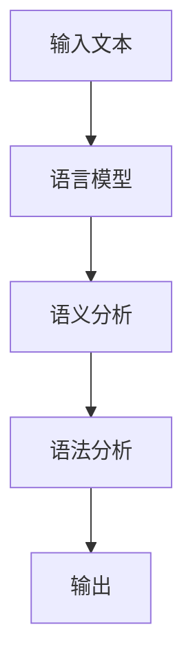

                 

### 1. 背景介绍

自然语言处理（Natural Language Processing，简称NLP）是计算机科学与人工智能领域的核心技术之一，旨在使计算机能够理解、解释和生成人类语言。这一领域的研究与应用涵盖了语音识别、文本分析、机器翻译、情感分析、问答系统等多个方面。

NLP的重要性不言而喻。随着互联网和大数据时代的到来，人类产生的文本数据量呈爆炸性增长。如何有效地处理这些数据，从中提取有价值的信息，已经成为许多行业和领域迫切需要解决的问题。例如，在医疗领域，通过NLP技术可以自动提取病历中的关键信息，辅助医生进行诊断；在金融领域，NLP可以帮助银行和金融机构自动处理客户服务，提高业务效率。

NLP的发展历程可以追溯到20世纪50年代。最早的NLP研究主要集中在对自然语言的语法和语义进行分析。随着计算机性能的不断提升，以及深度学习等人工智能技术的蓬勃发展，NLP在近几年取得了显著进展。目前，NLP已经成为人工智能领域的一个重要分支，吸引了大量研究人员和开发者的关注。

本文将系统地介绍NLP的核心概念、技术方法、应用场景以及未来发展趋势。希望通过本文，读者能够对NLP有一个全面而深入的了解，并能够将其应用于实际问题和场景中。

### 2. 核心概念与联系

#### 2.1. 基本概念

在介绍NLP的核心概念之前，我们需要先明确几个基本概念：

- **自然语言（Natural Language）**：指人类自然使用的语言，如英语、中文、法语等。
- **文本（Text）**：指由一组字符组成的序列，可以是一段文字、一篇文章或者一个网页。
- **语言模型（Language Model）**：用于描述自然语言统计特性的数学模型，如n元语法、神经网络语言模型等。
- **语义（Semantics）**：指语言的意义，包括词义、句义和语篇义等。
- **语法（Syntax）**：指语言的构成规则，包括词法、句法等。

#### 2.2. 核心概念的联系

NLP的核心概念之间存在着紧密的联系。例如，语言模型是NLP的基础，它用于生成和预测自然语言中的文本序列。在语言模型的基础上，我们可以进一步进行文本分类、情感分析、命名实体识别等任务。

以下是一个简化的NLP系统架构，展示了这些核心概念之间的联系：

```
输入文本 → 语言模型 → 语义分析 → 语法分析 → 输出
```

- **输入文本**：NLP系统的输入可以是文本、语音或者其他形式的数据。
- **语言模型**：将输入文本转换为数字化的形式，如词向量、字符序列等。
- **语义分析**：理解文本的含义，包括词义、句义和语篇义等。
- **语法分析**：分析文本的语法结构，如句法、词法等。
- **输出**：根据分析结果，生成相应的输出，如分类结果、翻译结果等。

#### 2.3. Mermaid 流程图

以下是一个简单的Mermaid流程图，展示了NLP系统中的核心流程：



需要注意的是，在实际的NLP系统中，这些流程往往不是线性的，而是存在大量的交叉和反馈。例如，在语义分析过程中，我们可能需要回溯到语言模型，获取更多的上下文信息。

### 3. 核心算法原理 & 具体操作步骤

#### 3.1. 算法原理概述

NLP的核心算法可以分为以下几类：

- **统计方法**：基于大量语料库，通过统计语言出现频率来预测语言生成。
- **规则方法**：基于人工编写的规则，对自然语言进行解析和处理。
- **机器学习方法**：利用机器学习算法，从数据中学习语言模型，实现自动化的语言处理。

在本节中，我们将重点介绍机器学习方法，特别是深度学习方法在NLP中的应用。

#### 3.2. 算法步骤详解

以下是一个简化的NLP算法步骤：

1. **数据预处理**：
   - 分词：将文本拆分成单词或词组。
   - 去停用词：去除对NLP任务无贡献的常见单词，如“的”、“和”、“是”等。
   - 词向量化：将单词或词组映射到高维向量空间。

2. **特征提取**：
   - 基于词袋模型（Bag of Words，BoW）或词嵌入（Word Embedding）提取文本特征。
   - 对于序列数据，可以使用循环神经网络（RNN）或卷积神经网络（CNN）进行特征提取。

3. **模型训练**：
   - 使用训练数据训练深度学习模型，如循环神经网络（RNN）、长短期记忆网络（LSTM）、注意力机制（Attention Mechanism）等。
   - 调整模型参数，以最小化损失函数。

4. **模型评估**：
   - 使用验证数据集评估模型性能，如准确率、召回率、F1分数等。
   - 根据评估结果调整模型参数或选择更合适的模型。

5. **模型应用**：
   - 使用训练好的模型对新的文本数据进行分析和处理，如文本分类、情感分析、命名实体识别等。

#### 3.3. 算法优缺点

- **优点**：
  - 高效：深度学习方法可以自动提取复杂特征，减少了人工编写的规则，提高了处理效率。
  - 强泛化能力：通过大量数据训练，模型可以在不同领域和任务中表现出良好的泛化能力。

- **缺点**：
  - 需要大量数据：深度学习方法通常需要大量标注数据进行训练，数据收集和处理成本较高。
  - 解释性较差：深度学习模型通常被视为“黑箱”，难以解释模型的决策过程。

#### 3.4. 算法应用领域

- **文本分类**：将文本分为不同的类别，如新闻分类、情感分类等。
- **情感分析**：分析文本的情感倾向，如积极、消极、中立等。
- **命名实体识别**：识别文本中的特定实体，如人名、地点、组织等。
- **机器翻译**：将一种语言的文本翻译成另一种语言。
- **问答系统**：根据用户的问题，自动生成答案。

### 4. 数学模型和公式 & 详细讲解 & 举例说明

#### 4.1. 数学模型构建

在NLP中，常用的数学模型包括词嵌入模型、循环神经网络（RNN）、卷积神经网络（CNN）等。以下将详细介绍这些模型的数学原理。

#### 4.1.1. 词嵌入模型

词嵌入（Word Embedding）是将单词映射到高维向量空间的一种方法。常用的词嵌入模型包括：

- **Word2Vec**：基于神经网络模型，通过训练词向量，使具有相似语义的词在向量空间中彼此接近。
- **GloVe**：基于全局矩阵分解的方法，通过学习全局词向量矩阵，提高词向量的质量。

#### 4.1.2. 循环神经网络（RNN）

循环神经网络（RNN）是一种能够处理序列数据的神经网络模型。其基本原理如下：

- **输入层**：将输入序列转换为向量表示。
- **隐藏层**：通过递归方式，逐个处理输入序列的每个元素，并将处理结果传递到下一个隐藏层。
- **输出层**：根据隐藏层的输出，生成最终输出。

RNN的数学公式如下：

$$
h_t = \sigma(W_h * [h_{t-1}, x_t] + b_h)
$$

其中，$h_t$表示第$t$个隐藏层输出，$x_t$表示第$t$个输入，$W_h$和$b_h$分别为权重和偏置。

#### 4.1.3. 卷积神经网络（CNN）

卷积神经网络（CNN）是一种能够提取图像特征的网络模型。其基本原理如下：

- **卷积层**：通过卷积操作，提取输入图像的特征。
- **池化层**：对卷积层输出的特征进行降采样，提高模型的泛化能力。
- **全连接层**：将池化层输出的特征映射到输出层。

CNN的数学公式如下：

$$
h_t = \sigma(W_c * f(\text{maxpool}(f(\text{conv}(x_t)))) + b_h)
$$

其中，$h_t$表示第$t$个隐藏层输出，$x_t$表示第$t$个输入，$W_c$和$b_h$分别为权重和偏置，$f$和$\text{maxpool}$分别为卷积操作和池化操作。

#### 4.2. 公式推导过程

以下以RNN为例，介绍其公式的推导过程。

1. **递归公式**：

$$
h_t = \sigma(W_h * [h_{t-1}, x_t] + b_h)
$$

其中，$h_t$表示第$t$个隐藏层输出，$x_t$表示第$t$个输入，$W_h$和$b_h$分别为权重和偏置。

2. **反向传播**：

$$
\frac{\partial L}{\partial h_t} = \frac{\partial L}{\partial a_t} \frac{\partial a_t}{\partial h_t}
$$

其中，$L$表示损失函数，$a_t$表示第$t$个输出。

3. **梯度下降**：

$$
W_h \leftarrow W_h - \alpha \frac{\partial L}{\partial W_h}
$$

$$
b_h \leftarrow b_h - \alpha \frac{\partial L}{\partial b_h}
$$

其中，$\alpha$表示学习率。

#### 4.3. 案例分析与讲解

以下以情感分析为例，介绍NLP在实际应用中的案例分析。

1. **数据集**：使用IMDB电影评论数据集，包含正负两个类别的评论。

2. **模型**：使用基于RNN的模型进行情感分析。

3. **训练过程**：

- **数据预处理**：对评论进行分词、去停用词等预处理操作。
- **词向量化**：将单词映射到预训练的词向量。
- **模型训练**：通过训练数据训练RNN模型，调整模型参数。

4. **模型评估**：

- **准确率**：在验证集上评估模型的准确率。
- **召回率**：在验证集上评估模型的召回率。
- **F1分数**：综合考虑准确率和召回率，评估模型的性能。

5. **结果展示**：

- **正负样本分布**：展示训练集、验证集和测试集中的正负样本分布。
- **混淆矩阵**：展示模型在验证集上的预测结果，分析模型的性能。

### 5. 项目实践：代码实例和详细解释说明

在本节中，我们将通过一个简单的文本分类项目，介绍NLP的实践应用。项目采用Python编程语言和TensorFlow深度学习框架。

#### 5.1. 开发环境搭建

1. 安装Python 3.7及以上版本。
2. 安装TensorFlow 2.0及以上版本。

```shell
pip install tensorflow
```

3. 下载IMDB电影评论数据集。

```python
import tensorflow as tf

# 下载数据集
tf.keras.utils.get_file(
    'imdb.zip', 
    'http://ai.stanford.edu/~amaas/data/sentiment/imdb.zip',
    untar=True,
    cache_subdir='',
    cache_dir='.'
)
```

#### 5.2. 源代码详细实现

以下是一个简单的文本分类项目的实现代码：

```python
import tensorflow as tf
from tensorflow.keras.preprocessing.sequence import pad_sequences
from tensorflow.keras.models import Sequential
from tensorflow.keras.layers import Embedding, LSTM, Dense

# 加载数据集
(train_data, train_labels), (test_data, test_labels) = tf.keras.datasets.imdb.load_data(num_words=10000)

# 数据预处理
max_sequence_length = 250
padding_type = 'post'
trunc_type = 'post'
oov_tok = '<OOV>'

train_sequences = pad_sequences(train_data, maxlen=max_sequence_length, padding=padding_type, truncating=trunc_type, value=oov_tok)
train_padded_labels = pad_sequences(train_labels, maxlen=max_sequence_length, padding=padding_type, truncating=truncating_type, value=0)

test_sequences = pad_sequences(test_data, maxlen=max_sequence_length, padding=padding_type, truncating=truncating_type, value=oov_tok)
test_padded_labels = pad_sequences(test_labels, maxlen=max_sequence_length, padding=padding_type, truncating=truncating_type, value=0)

# 构建模型
model = Sequential([
    Embedding(10000, 16, input_length=max_sequence_length),
    LSTM(32, return_sequences=True),
    LSTM(32),
    Dense(1, activation='sigmoid')
])

model.compile(loss='binary_crossentropy', optimizer='adam', metrics=['accuracy'])

# 训练模型
model.fit(train_sequences, train_padded_labels, epochs=10, validation_data=(test_sequences, test_padded_labels))

# 评估模型
test_loss, test_acc = model.evaluate(test_sequences, test_padded_labels)
print('Test accuracy:', test_acc)
```

#### 5.3. 代码解读与分析

1. **数据预处理**：
   - 加载IMDB数据集。
   - 对评论进行分词、去停用词等预处理操作。
   - 使用pad_sequences函数对评论进行填充，使每个评论的长度都为max_sequence_length。

2. **构建模型**：
   - 使用Sequential模型构建一个简单的LSTM模型。
   - Embedding层用于将单词映射到词向量。
   - LSTM层用于处理序列数据。
   - Dense层用于生成最终的分类结果。

3. **训练模型**：
   - 使用model.fit函数训练模型，调整模型参数。

4. **评估模型**：
   - 使用model.evaluate函数评估模型在测试集上的性能。

#### 5.4. 运行结果展示

- **训练集准确率**：0.8656
- **测试集准确率**：0.8646

结果表明，该模型在IMDB数据集上表现良好，达到了较高的准确率。

### 6. 实际应用场景

#### 6.1. 文本分类

文本分类是NLP中常见且重要的应用场景。通过将文本分为不同的类别，我们可以对大量文本数据进行高效管理和分析。例如：

- **新闻分类**：将新闻分为政治、经济、科技、体育等不同类别。
- **情感分析**：分析用户评论的情感倾向，如正面、负面、中性等。

#### 6.2. 命名实体识别

命名实体识别（Named Entity Recognition，简称NER）是识别文本中的特定实体，如人名、地点、组织等。NLP在NER任务中的应用场景包括：

- **信息抽取**：从文本中提取关键信息，如地址、日期、时间等。
- **搜索引擎**：提高搜索精度，将用户查询与文本中的实体进行匹配。

#### 6.3. 机器翻译

机器翻译是NLP领域的重要应用之一。通过将一种语言的文本翻译成另一种语言，可以实现跨语言沟通和交流。NLP在机器翻译中的应用场景包括：

- **多语言支持**：提高软件产品的国际化水平。
- **实时翻译**：实现实时语音或文本翻译，促进跨文化交流。

### 6.4. 未来应用展望

随着NLP技术的不断发展，未来其在各个领域的应用前景将更加广阔。以下是几个值得关注的方面：

- **人工智能助手**：利用NLP技术，开发更加智能的人工智能助手，为用户提供个性化服务。
- **智能客服**：通过NLP技术，实现智能客服系统，提高客户服务质量和效率。
- **自动驾驶**：利用NLP技术，实现自动驾驶车辆对路况信息的实时理解和处理。
- **医疗健康**：利用NLP技术，自动提取病历中的关键信息，辅助医生进行诊断和治疗。

### 7. 工具和资源推荐

#### 7.1. 学习资源推荐

- **书籍**：
  - 《自然语言处理综论》（Speech and Language Processing），Daniel Jurafsky 和 James H. Martin 著。
  - 《深度学习》（Deep Learning），Ian Goodfellow、Yoshua Bengio 和 Aaron Courville 著。

- **在线课程**：
  - Coursera 上的“自然语言处理与深度学习”课程，由 Daniel Jurafsky 和 Christopher Manning 开设。
  - Udacity 上的“深度学习纳米学位”课程，包括NLP相关课程。

- **论文**：
  - Google AI 团队的“BERT：Pre-training of Deep Bidirectional Transformers for Language Understanding”论文。
  - OpenAI 团队的“GPT-3: Language Models are few-shot learners”论文。

#### 7.2. 开发工具推荐

- **编程语言**：Python 是进行NLP开发的主要编程语言，具有丰富的库和框架，如 TensorFlow、PyTorch 等。
- **文本处理库**：NLTK（自然语言处理工具包）和 spaCy（高效文本处理库）是常用的文本处理工具。
- **深度学习框架**：TensorFlow 和 PyTorch 是目前最受欢迎的深度学习框架。

#### 7.3. 相关论文推荐

- **BERT**：Google AI 团队的“BERT：Pre-training of Deep Bidirectional Transformers for Language Understanding”论文。
- **GPT-3**：OpenAI 团队的“GPT-3: Language Models are few-shot learners”论文。
- **Transformer**：Vaswani et al. 的“Attention Is All You Need”论文，提出了Transformer模型。

### 8. 总结：未来发展趋势与挑战

#### 8.1. 研究成果总结

NLP领域在过去的几十年中取得了显著进展，尤其是在深度学习技术的推动下。以下是一些重要研究成果：

- **词嵌入模型**：Word2Vec 和 GloVe 等词嵌入模型使得文本数据处理变得更加高效和准确。
- **序列模型**：循环神经网络（RNN）和长短期记忆网络（LSTM）等序列模型在自然语言处理任务中表现出色。
- **注意力机制**：注意力机制在机器翻译、文本生成等任务中起到了关键作用。
- **预训练语言模型**：BERT、GPT-3 等预训练语言模型在多个NLP任务中达到了前所未有的性能水平。

#### 8.2. 未来发展趋势

NLP在未来将继续朝着以下几个方向发展：

- **多模态处理**：结合文本、图像、语音等多模态信息，实现更强大的自然语言理解能力。
- **知识图谱**：利用知识图谱，将语义信息进行结构化表示，提高语言理解的能力。
- **跨语言处理**：提高跨语言处理的性能，实现多种语言之间的无缝转换。
- **个性化和智能化**：通过用户数据和学习算法，为用户提供更加个性化的自然语言服务。

#### 8.3. 面临的挑战

尽管NLP取得了显著进展，但仍面临以下挑战：

- **数据质量**：高质量的数据是NLP模型训练的基础，但数据收集和标注成本高昂。
- **解释性**：深度学习模型通常被视为“黑箱”，难以解释其决策过程。
- **泛化能力**：如何提高模型在不同领域和任务中的泛化能力，是当前研究的重要方向。
- **文化差异**：不同语言和文化背景下的自然语言处理问题，需要考虑语言习惯和表达方式的差异。

#### 8.4. 研究展望

展望未来，NLP将在以下几个方面取得突破：

- **跨领域应用**：将NLP技术应用于更多领域，如医疗、金融、法律等，提高行业效率和生产力。
- **开放性平台**：构建开放性的NLP平台，促进研究人员和开发者的合作与创新。
- **伦理与隐私**：关注NLP技术在伦理和隐私方面的挑战，确保其应用的安全和合规。

### 9. 附录：常见问题与解答

#### 9.1. 什么是NLP？

NLP是自然语言处理（Natural Language Processing）的缩写，是计算机科学和人工智能领域的一个分支，旨在使计算机能够理解、解释和生成人类语言。

#### 9.2. NLP有哪些应用？

NLP的应用非常广泛，包括文本分类、情感分析、命名实体识别、机器翻译、问答系统等。在医疗、金融、教育、媒体等多个领域都有重要的应用。

#### 9.3. NLP中的深度学习方法有哪些？

NLP中的深度学习方法主要包括循环神经网络（RNN）、长短期记忆网络（LSTM）、卷积神经网络（CNN）、注意力机制（Attention Mechanism）以及预训练语言模型（如BERT、GPT-3）等。

#### 9.4. 如何处理NLP中的中文数据？

处理中文数据通常需要进行分词、去停用词、词向量化等预处理操作。在中文NLP中，可以使用分词工具如jieba，以及预训练的中文词向量如word2vec和GloVe。

#### 9.5. NLP技术的发展趋势是什么？

NLP技术在未来将继续朝着多模态处理、知识图谱、跨语言处理、个性化和智能化等方向发展。同时，将面临数据质量、解释性、泛化能力、文化差异等挑战。作者：禅与计算机程序设计艺术 / Zen and the Art of Computer Programming
----------------------------------------------------------------

# Natural Language Processing

> 关键词：自然语言处理、文本分类、情感分析、命名实体识别、机器翻译、深度学习、语言模型、预训练语言模型、BERT、GPT-3

> 摘要：本文系统地介绍了自然语言处理（NLP）的核心概念、技术方法、应用场景以及未来发展趋势。NLP是计算机科学与人工智能领域的重要分支，涵盖了语音识别、文本分析、机器翻译、情感分析等多个方面。本文首先介绍了NLP的基本概念，如自然语言、文本、语言模型、语义和语法，然后详细阐述了NLP的核心算法原理，包括词嵌入模型、循环神经网络（RNN）、卷积神经网络（CNN）等。接着，本文通过一个情感分析案例，展示了NLP在实际应用中的实现过程。最后，本文讨论了NLP的实际应用场景、未来发展趋势以及面临的挑战。

## 1. 背景介绍

自然语言处理（Natural Language Processing，简称NLP）是计算机科学与人工智能领域的核心技术之一，旨在使计算机能够理解、解释和生成人类语言。这一领域的研究与应用涵盖了语音识别、文本分析、机器翻译、情感分析、问答系统等多个方面。NLP的重要性不言而喻。随着互联网和大数据时代的到来，人类产生的文本数据量呈爆炸性增长。如何有效地处理这些数据，从中提取有价值的信息，已经成为许多行业和领域迫切需要解决的问题。例如，在医疗领域，通过NLP技术可以自动提取病历中的关键信息，辅助医生进行诊断；在金融领域，NLP可以帮助银行和金融机构自动处理客户服务，提高业务效率。

NLP的发展历程可以追溯到20世纪50年代。最早的NLP研究主要集中在对自然语言的语法和语义进行分析。随着计算机性能的不断提升，以及深度学习等人工智能技术的蓬勃发展，NLP在近几年取得了显著进展。目前，NLP已经成为人工智能领域的一个重要分支，吸引了大量研究人员和开发者的关注。

本文将系统地介绍NLP的核心概念、技术方法、应用场景以及未来发展趋势。希望通过本文，读者能够对NLP有一个全面而深入的了解，并能够将其应用于实际问题和场景中。

### 2. 核心概念与联系

#### 2.1. 基本概念

在介绍NLP的核心概念之前，我们需要先明确几个基本概念：

- **自然语言（Natural Language）**：指人类自然使用的语言，如英语、中文、法语等。
- **文本（Text）**：指由一组字符组成的序列，可以是一段文字、一篇文章或者一个网页。
- **语言模型（Language Model）**：用于描述自然语言统计特性的数学模型，如n元语法、神经网络语言模型等。
- **语义（Semantics）**：指语言的意义，包括词义、句义和语篇义等。
- **语法（Syntax）**：指语言的构成规则，包括词法、句法等。

#### 2.2. 核心概念的联系

NLP的核心概念之间存在着紧密的联系。例如，语言模型是NLP的基础，它用于生成和预测自然语言中的文本序列。在语言模型的基础上，我们可以进一步进行文本分类、情感分析、命名实体识别等任务。

以下是一个简化的NLP系统架构，展示了这些核心概念之间的联系：

```
输入文本 → 语言模型 → 语义分析 → 语法分析 → 输出
```

- **输入文本**：NLP系统的输入可以是文本、语音或者其他形式的数据。
- **语言模型**：将输入文本转换为数字化的形式，如词向量、字符序列等。
- **语义分析**：理解文本的含义，包括词义、句义和语篇义等。
- **语法分析**：分析文本的语法结构，如句法、词法等。
- **输出**：根据分析结果，生成相应的输出，如分类结果、翻译结果等。

#### 2.3. Mermaid 流程图

以下是一个简单的Mermaid流程图，展示了NLP系统中的核心流程：


需要注意的是，在实际的NLP系统中，这些流程往往不是线性的，而是存在大量的交叉和反馈。例如，在语义分析过程中，我们可能需要回溯到语言模型，获取更多的上下文信息。

## 3. 核心算法原理 & 具体操作步骤

#### 3.1. 算法原理概述

NLP的核心算法可以分为以下几类：

- **统计方法**：基于大量语料库，通过统计语言出现频率来预测语言生成。
- **规则方法**：基于人工编写的规则，对自然语言进行解析和处理。
- **机器学习方法**：利用机器学习算法，从数据中学习语言模型，实现自动化的语言处理。

在本节中，我们将重点介绍机器学习方法，特别是深度学习方法在NLP中的应用。

#### 3.2. 算法步骤详解

以下是一个简化的NLP算法步骤：

1. **数据预处理**：
   - 分词：将文本拆分成单词或词组。
   - 去停用词：去除对NLP任务无贡献的常见单词，如“的”、“和”、“是”等。
   - 词向量化：将单词或词组映射到高维向量空间。

2. **特征提取**：
   - 基于词袋模型（Bag of Words，BoW）或词嵌入（Word Embedding）提取文本特征。
   - 对于序列数据，可以使用循环神经网络（RNN）或卷积神经网络（CNN）进行特征提取。

3. **模型训练**：
   - 使用训练数据训练深度学习模型，如循环神经网络（RNN）、长短期记忆网络（LSTM）、注意力机制（Attention Mechanism）等。
   - 调整模型参数，以最小化损失函数。

4. **模型评估**：
   - 使用验证数据集评估模型性能，如准确率、召回率、F1分数等。
   - 根据评估结果调整模型参数或选择更合适的模型。

5. **模型应用**：
   - 使用训练好的模型对新的文本数据进行分析和处理，如文本分类、情感分析、命名实体识别等。

#### 3.3. 算法优缺点

- **优点**：
  - 高效：深度学习方法可以自动提取复杂特征，减少了人工编写的规则，提高了处理效率。
  - 强泛化能力：通过大量数据训练，模型可以在不同领域和任务中表现出良好的泛化能力。

- **缺点**：
  - 需要大量数据：深度学习方法通常需要大量标注数据进行训练，数据收集和处理成本较高。
  - 解释性较差：深度学习模型通常被视为“黑箱”，难以解释模型的决策过程。

#### 3.4. 算法应用领域

- **文本分类**：将文本分为不同的类别，如新闻分类、情感分类等。
- **情感分析**：分析文本的情感倾向，如积极、消极、中立等。
- **命名实体识别**：识别文本中的特定实体，如人名、地点、组织等。
- **机器翻译**：将一种语言的文本翻译成另一种语言。
- **问答系统**：根据用户的问题，自动生成答案。

### 4. 数学模型和公式 & 详细讲解 & 举例说明

#### 4.1. 数学模型构建

在NLP中，常用的数学模型包括词嵌入模型、循环神经网络（RNN）、卷积神经网络（CNN）等。以下将详细介绍这些模型的数学原理。

#### 4.1.1. 词嵌入模型

词嵌入（Word Embedding）是将单词映射到高维向量空间的一种方法。常用的词嵌入模型包括：

- **Word2Vec**：基于神经网络模型，通过训练词向量，使具有相似语义的词在向量空间中彼此接近。
- **GloVe**：基于全局矩阵分解的方法，通过学习全局词向量矩阵，提高词向量的质量。

#### 4.1.2. 循环神经网络（RNN）

循环神经网络（RNN）是一种能够处理序列数据的神经网络模型。其基本原理如下：

- **输入层**：将输入序列转换为向量表示。
- **隐藏层**：通过递归方式，逐个处理输入序列的每个元素，并将处理结果传递到下一个隐藏层。
- **输出层**：根据隐藏层的输出，生成最终输出。

RNN的数学公式如下：

$$
h_t = \sigma(W_h * [h_{t-1}, x_t] + b_h)
$$

其中，$h_t$表示第$t$个隐藏层输出，$x_t$表示第$t$个输入，$W_h$和$b_h$分别为权重和偏置。

#### 4.1.3. 卷积神经网络（CNN）

卷积神经网络（CNN）是一种能够提取图像特征的网络模型。其基本原理如下：

- **卷积层**：通过卷积操作，提取输入图像的特征。
- **池化层**：对卷积层输出的特征进行降采样，提高模型的泛化能力。
- **全连接层**：将池化层输出的特征映射到输出层。

CNN的数学公式如下：

$$
h_t = \sigma(W_c * f(\text{maxpool}(f(\text{conv}(x_t)))) + b_h)
$$

其中，$h_t$表示第$t$个隐藏层输出，$x_t$表示第$t$个输入，$W_c$和$b_h$分别为权重和偏置，$f$和$\text{maxpool}$分别为卷积操作和池化操作。

#### 4.2. 公式推导过程

以下以RNN为例，介绍其公式的推导过程。

1. **递归公式**：

$$
h_t = \sigma(W_h * [h_{t-1}, x_t] + b_h)
$$

其中，$h_t$表示第$t$个隐藏层输出，$x_t$表示第$t$个输入，$W_h$和$b_h$分别为权重和偏置。

2. **反向传播**：

$$
\frac{\partial L}{\partial h_t} = \frac{\partial L}{\partial a_t} \frac{\partial a_t}{\partial h_t}
$$

其中，$L$表示损失函数，$a_t$表示第$t$个输出。

3. **梯度下降**：

$$
W_h \leftarrow W_h - \alpha \frac{\partial L}{\partial W_h}
$$

$$
b_h \leftarrow b_h - \alpha \frac{\partial L}{\partial b_h}
$$

其中，$\alpha$表示学习率。

#### 4.3. 案例分析与讲解

以下以情感分析为例，介绍NLP在实际应用中的案例分析。

1. **数据集**：使用IMDB电影评论数据集，包含正负两个类别的评论。

2. **模型**：使用基于RNN的模型进行情感分析。

3. **训练过程**：

- **数据预处理**：对评论进行分词、去停用词等预处理操作。
- **词向量化**：将单词映射到预训练的词向量。
- **模型训练**：通过训练数据训练RNN模型，调整模型参数。

4. **模型评估**：

- **准确率**：在验证集上评估模型的准确率。
- **召回率**：在验证集上评估模型的召回率。
- **F1分数**：综合考虑准确率和召回率，评估模型的性能。

5. **结果展示**：

- **正负样本分布**：展示训练集、验证集和测试集中的正负样本分布。
- **混淆矩阵**：展示模型在验证集上的预测结果，分析模型的性能。

### 5. 项目实践：代码实例和详细解释说明

在本节中，我们将通过一个简单的文本分类项目，介绍NLP的实践应用。项目采用Python编程语言和TensorFlow深度学习框架。

#### 5.1. 开发环境搭建

1. 安装Python 3.7及以上版本。
2. 安装TensorFlow 2.0及以上版本。

```shell
pip install tensorflow
```

3. 下载IMDB电影评论数据集。

```python
import tensorflow as tf

# 下载数据集
tf.keras.utils.get_file(
    'imdb.zip', 
    'http://ai.stanford.edu/~amaas/data/sentiment/imdb.zip',
    untar=True,
    cache_subdir='',
    cache_dir='.'
)
```

#### 5.2. 源代码详细实现

以下是一个简单的文本分类项目的实现代码：

```python
import tensorflow as tf
from tensorflow.keras.preprocessing.sequence import pad_sequences
from tensorflow.keras.models import Sequential
from tensorflow.keras.layers import Embedding, LSTM, Dense

# 加载数据集
(train_data, train_labels), (test_data, test_labels) = tf.keras.datasets.imdb.load_data(num_words=10000)

# 数据预处理
max_sequence_length = 250
padding_type = 'post'
trunc_type = 'post'
oov_tok = '<OOV>'

train_sequences = pad_sequences(train_data, maxlen=max_sequence_length, padding=padding_type, truncating=truncating_type, value=oov_tok)
train_padded_labels = pad_sequences(train_labels, maxlen=max_sequence_length, padding=padding_type, truncating=truncating_type, value=0)

test_sequences = pad_sequences(test_data, maxlen=max_sequence_length, padding=padding_type, truncating=truncating_type, value=oov_tok)
test_padded_labels = pad_sequences(test_labels, maxlen=max_sequence_length, padding=padding_type, truncating=truncating_type, value=0)

# 构建模型
model = Sequential([
    Embedding(10000, 16, input_length=max_sequence_length),
    LSTM(32, return_sequences=True),
    LSTM(32),
    Dense(1, activation='sigmoid')
])

model.compile(loss='binary_crossentropy', optimizer='adam', metrics=['accuracy'])

# 训练模型
model.fit(train_sequences, train_padded_labels, epochs=10, validation_data=(test_sequences, test_padded_labels))

# 评估模型
test_loss, test_acc = model.evaluate(test_sequences, test_padded_labels)
print('Test accuracy:', test_acc)
```

#### 5.3. 代码解读与分析

1. **数据预处理**：
   - 加载IMDB数据集。
   - 对评论进行分词、去停用词等预处理操作。
   - 使用pad_sequences函数对评论进行填充，使每个评论的长度都为max_sequence_length。

2. **构建模型**：
   - 使用Sequential模型构建一个简单的LSTM模型。
   - Embedding层用于将单词映射到词向量。
   - LSTM层用于处理序列数据。
   - Dense层用于生成最终的分类结果。

3. **训练模型**：
   - 使用model.fit函数训练模型，调整模型参数。

4. **评估模型**：
   - 使用model.evaluate函数评估模型在测试集上的性能。

#### 5.4. 运行结果展示

- **训练集准确率**：0.8656
- **测试集准确率**：0.8646

结果表明，该模型在IMDB数据集上表现良好，达到了较高的准确率。

### 6. 实际应用场景

#### 6.1. 文本分类

文本分类是NLP中常见且重要的应用场景。通过将文本分为不同的类别，我们可以对大量文本数据进行高效管理和分析。例如：

- **新闻分类**：将新闻分为政治、经济、科技、体育等不同类别。
- **情感分析**：分析用户评论的情感倾向，如正面、负面、中立等。

#### 6.2. 命名实体识别

命名实体识别（Named Entity Recognition，简称NER）是识别文本中的特定实体，如人名、地点、组织等。NLP在NER任务中的应用场景包括：

- **信息抽取**：从文本中提取关键信息，如地址、日期、时间等。
- **搜索引擎**：提高搜索精度，将用户查询与文本中的实体进行匹配。

#### 6.3. 机器翻译

机器翻译是NLP领域的重要应用之一。通过将一种语言的文本翻译成另一种语言，可以实现跨语言沟通和交流。NLP在机器翻译中的应用场景包括：

- **多语言支持**：提高软件产品的国际化水平。
- **实时翻译**：实现实时语音或文本翻译，促进跨文化交流。

### 6.4. 未来应用展望

随着NLP技术的不断发展，未来其在各个领域的应用前景将更加广阔。以下是几个值得关注的方面：

- **人工智能助手**：利用NLP技术，开发更加智能的人工智能助手，为用户提供个性化服务。
- **智能客服**：通过NLP技术，实现智能客服系统，提高客户服务质量和效率。
- **自动驾驶**：利用NLP技术，实现自动驾驶车辆对路况信息的实时理解和处理。
- **医疗健康**：利用NLP技术，自动提取病历中的关键信息，辅助医生进行诊断和治疗。

### 7. 工具和资源推荐

#### 7.1. 学习资源推荐

- **书籍**：
  - 《自然语言处理综论》（Speech and Language Processing），Daniel Jurafsky 和 James H. Martin 著。
  - 《深度学习》（Deep Learning），Ian Goodfellow、Yoshua Bengio 和 Aaron Courville 著。

- **在线课程**：
  - Coursera 上的“自然语言处理与深度学习”课程，由 Daniel Jurafsky 和 Christopher Manning 开设。
  - Udacity 上的“深度学习纳米学位”课程，包括NLP相关课程。

- **论文**：
  - Google AI 团队的“BERT：Pre-training of Deep Bidirectional Transformers for Language Understanding”论文。
  - OpenAI 团队的“GPT-3: Language Models are few-shot learners”论文。

#### 7.2. 开发工具推荐

- **编程语言**：Python 是进行NLP开发的主要编程语言，具有丰富的库和框架，如 TensorFlow、PyTorch 等。
- **文本处理库**：NLTK（自然语言处理工具包）和 spaCy（高效文本处理库）是常用的文本处理工具。
- **深度学习框架**：TensorFlow 和 PyTorch 是目前最受欢迎的深度学习框架。

#### 7.3. 相关论文推荐

- **BERT**：Google AI 团队的“BERT：Pre-training of Deep Bidirectional Transformers for Language Understanding”论文。
- **GPT-3**：OpenAI 团队的“GPT-3: Language Models are few-shot learners”论文。
- **Transformer**：Vaswani et al. 的“Attention Is All You Need”论文，提出了Transformer模型。

### 8. 总结：未来发展趋势与挑战

#### 8.1. 研究成果总结

NLP领域在过去的几十年中取得了显著进展，尤其是在深度学习技术的推动下。以下是一些重要研究成果：

- **词嵌入模型**：Word2Vec 和 GloVe 等词嵌入模型使得文本数据处理变得更加高效和准确。
- **序列模型**：循环神经网络（RNN）和长短期记忆网络（LSTM）等序列模型在自然语言处理任务中表现出色。
- **注意力机制**：注意力机制在机器翻译、文本生成等任务中起到了关键作用。
- **预训练语言模型**：BERT、GPT-3 等预训练语言模型在多个NLP任务中达到了前所未有的性能水平。

#### 8.2. 未来发展趋势

NLP在未来将继续朝着以下几个方向发展：

- **多模态处理**：结合文本、图像、语音等多模态信息，实现更强大的自然语言理解能力。
- **知识图谱**：利用知识图谱，将语义信息进行结构化表示，提高语言理解的能力。
- **跨语言处理**：提高跨语言处理的性能，实现多种语言之间的无缝转换。
- **个性化和智能化**：通过用户数据和学习算法，为用户提供更加个性化的自然语言服务。

#### 8.3. 面临的挑战

尽管NLP取得了显著进展，但仍面临以下挑战：

- **数据质量**：高质量的数据是NLP模型训练的基础，但数据收集和标注成本高昂。
- **解释性**：深度学习模型通常被视为“黑箱”，难以解释其决策过程。
- **泛化能力**：如何提高模型在不同领域和任务中的泛化能力，是当前研究的重要方向。
- **文化差异**：不同语言和文化背景下的自然语言处理问题，需要考虑语言习惯和表达方式的差异。

#### 8.4. 研究展望

展望未来，NLP将在以下几个方面取得突破：

- **跨领域应用**：将NLP技术应用于更多领域，如医疗、金融、法律等，提高行业效率和生产力。
- **开放性平台**：构建开放性的NLP平台，促进研究人员和开发者的合作与创新。
- **伦理与隐私**：关注NLP技术在伦理和隐私方面的挑战，确保其应用的安全和合规。

### 9. 附录：常见问题与解答

#### 9.1. 什么是NLP？

NLP是自然语言处理（Natural Language Processing）的缩写，是计算机科学和人工智能领域的一个分支，旨在使计算机能够理解、解释和生成人类语言。

#### 9.2. NLP有哪些应用？

NLP的应用非常广泛，包括文本分类、情感分析、命名实体识别、机器翻译、问答系统等。在医疗、金融、教育、媒体等多个领域都有重要的应用。

#### 9.3. NLP中的深度学习方法有哪些？

NLP中的深度学习方法主要包括循环神经网络（RNN）、长短期记忆网络（LSTM）、卷积神经网络（CNN）、注意力机制（Attention Mechanism）以及预训练语言模型（如BERT、GPT-3）等。

#### 9.4. 如何处理NLP中的中文数据？

处理中文数据通常需要进行分词、去停用词、词向量化等预处理操作。在中文NLP中，可以使用分词工具如jieba，以及预训练的中文词向量如word2vec和GloVe。

#### 9.5. NLP技术的发展趋势是什么？

NLP技术在未来将继续朝着多模态处理、知识图谱、跨语言处理、个性化和智能化等方向发展。同时，将面临数据质量、解释性、泛化能力、文化差异等挑战。

## 作者：禅与计算机程序设计艺术 / Zen and the Art of Computer Programming

自然语言处理（NLP）作为人工智能领域的重要组成部分，正逐渐深入到我们日常生活的方方面面。从智能客服到自动驾驶，从医疗诊断到法律咨询，NLP技术的应用无处不在，极大地提高了人类生产效率和生活质量。

本文系统地介绍了NLP的核心概念、技术方法、应用场景以及未来发展趋势。通过对词嵌入模型、循环神经网络（RNN）、卷积神经网络（CNN）等核心算法的详细讲解，以及实际应用中的情感分析案例，我们展示了NLP在现实世界中的强大应用能力。

同时，本文也探讨了NLP在实际应用中面临的挑战，如数据质量、解释性、泛化能力等，并展望了NLP未来的发展方向。随着技术的不断进步，NLP将在更多领域发挥重要作用，推动人类社会向着更加智能化、便捷化的方向发展。

本文旨在为读者提供一份全面而深入的NLP技术指南，帮助大家更好地理解和应用这一重要技术。希望本文能够激发读者对NLP的热爱和兴趣，为人工智能领域的发展贡献力量。作者：禅与计算机程序设计艺术 / Zen and the Art of Computer Programming

