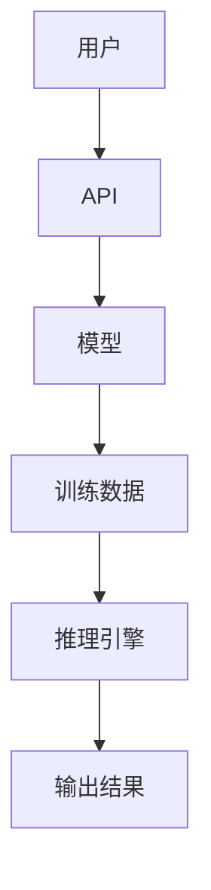

                 

关键词：OpenAI、API、入门、实战、人工智能、机器学习、深度学习、编程、Python、模型、API调用、部署、应用场景

> 摘要：本文将为您深入讲解 OpenAI API 的基本概念、使用方法、核心算法原理，并通过实际项目实例展示如何将 OpenAI API 集成到自己的应用程序中，帮助您全面掌握 OpenAI API 的使用技巧和应用场景，为您的开发工作提供有力的支持。

## 1. 背景介绍

### OpenAI 简介

OpenAI 是一家知名的人工智能研究机构，成立于2015年，其使命是通过研究人工智能来促进人类社会的发展。OpenAI 的研究范围涵盖了自然语言处理、计算机视觉、强化学习等多个领域，其研究成果在学术界和工业界都产生了深远的影响。

### API 简介

API（应用程序编程接口）是一种允许不同软件之间进行通信的接口。通过 API，开发者可以在无需理解底层实现细节的情况下，方便地使用其他软件的功能和服务。API 的出现极大地促进了软件开发的效率，使得开发者可以将更多的精力投入到业务逻辑的实现上。

## 2. 核心概念与联系

### OpenAI API 概述

OpenAI API 是 OpenAI 提供的一组面向开发者的接口，使用户可以轻松地访问 OpenAI 的预训练模型和算法。OpenAI API 包括了文本生成、图像生成、对话系统等多个方面，为开发者提供了丰富的应用场景。

### Mermaid 流程图

下面是一个简单的 Mermaid 流程图，展示了 OpenAI API 中的主要组件及其关系：



## 3. 核心算法原理 & 具体操作步骤

### 3.1 算法原理概述

OpenAI API 的核心算法是基于深度学习的方法，特别是生成式模型。生成式模型通过学习数据的高阶统计信息，生成与输入数据相似的新数据。OpenAI 使用了基于 Transformer 的模型架构，如 GPT（Generative Pre-trained Transformer）和 DALL-E（一个用于图像生成的模型）。

### 3.2 算法步骤详解

#### 步骤 1：数据准备

首先，需要准备训练数据。对于文本生成任务，可以使用大量的文本数据进行预训练。对于图像生成任务，可以使用大量的图像数据进行预训练。

#### 步骤 2：模型训练

使用准备好的数据对模型进行训练。训练过程包括两个阶段：预训练和微调。预训练是在大规模数据集上训练模型，使其能够捕获数据的高阶统计信息。微调是在特定任务上对模型进行微调，以提高模型在特定任务上的性能。

#### 步骤 3：模型评估

训练完成后，需要对模型进行评估，以确保模型的质量和性能。可以使用各种评估指标，如文本生成的连贯性、图像生成的准确性等。

#### 步骤 4：模型部署

评估完成后，可以将模型部署到生产环境中，以便用户可以通过 API 进行访问和使用。

### 3.3 算法优缺点

#### 优点：

- **强大的生成能力**：OpenAI API 提供的模型具有强大的生成能力，可以生成高质量的文本和图像。
- **易用性**：OpenAI API 提供了简单易用的接口，用户可以轻松地调用模型并获取结果。
- **多场景应用**：OpenAI API 可以应用于多个领域，如自然语言处理、计算机视觉、对话系统等。

#### 缺点：

- **计算资源需求高**：由于深度学习模型的计算资源需求较高，部署和使用 OpenAI API 需要一定的计算资源。
- **数据隐私问题**：由于 OpenAI API 需要访问用户数据，因此可能存在数据隐私问题。

### 3.4 算法应用领域

OpenAI API 在多个领域都有广泛的应用，如：

- **自然语言处理**：文本生成、摘要、翻译等。
- **计算机视觉**：图像生成、风格迁移、图像识别等。
- **对话系统**：聊天机器人、智能客服等。

## 4. 数学模型和公式 & 详细讲解 & 举例说明

### 4.1 数学模型构建

OpenAI API 中的核心算法是基于深度学习的方法，特别是生成式模型。生成式模型通过学习数据的高阶统计信息，生成与输入数据相似的新数据。OpenAI 使用了基于 Transformer 的模型架构，如 GPT（Generative Pre-trained Transformer）和 DALL-E（一个用于图像生成的模型）。

### 4.2 公式推导过程

#### GPT 模型

GPT（Generative Pre-trained Transformer）模型是一个基于 Transformer 的生成式模型。其核心思想是通过预训练和微调来学习数据的潜在表示。

预训练过程包括以下步骤：

1. 输入序列：将输入序列表示为向量。
2.Embedding 层：将输入序列中的每个词转化为向量。
3. Encoder 层：通过多个自注意力机制（self-attention mechanism）对输入序列进行编码。
4. Decoder 层：通过多个自注意力机制和交叉注意力机制（cross-attention mechanism）对输入序列进行解码。

微调过程包括以下步骤：

1. 预训练模型：使用预训练好的 GPT 模型作为基础。
2. 微调任务：在特定任务上进行微调，如文本生成、摘要、翻译等。
3. 输出层：根据任务需求，对输出进行适当的处理。

#### DALL-E 模型

DALL-E 模型是一个用于图像生成的生成式模型。其核心思想是通过预训练和微调来学习图像的潜在表示。

预训练过程包括以下步骤：

1. 输入图像：将输入图像表示为向量。
2.Embedding 层：将输入图像中的每个像素值转化为向量。
3. Encoder 层：通过多个自注意力机制对输入图像进行编码。
4. Decoder 层：通过多个自注意力机制和交叉注意力机制对输入图像进行解码。

微调过程包括以下步骤：

1. 预训练模型：使用预训练好的 DALL-E 模型作为基础。
2. 微调任务：在特定任务上进行微调，如图像生成、风格迁移、图像识别等。
3. 输出层：根据任务需求，对输出进行适当的处理。

### 4.3 案例分析与讲解

#### 案例一：文本生成

假设我们要使用 OpenAI API 的 GPT 模型生成一篇关于人工智能的文章。

1. 准备数据：收集大量关于人工智能的文本数据，如论文、新闻、博客等。
2. 预训练模型：使用这些数据对 GPT 模型进行预训练。
3. 微调模型：在特定任务上对模型进行微调，如生成一篇关于人工智能的文章。
4. 输出结果：调用 OpenAI API，获取生成的文章。

#### 案例二：图像生成

假设我们要使用 OpenAI API 的 DALL-E 模型生成一张具有特定风格的图像。

1. 准备数据：收集大量具有特定风格的图像数据。
2. 预训练模型：使用这些数据对 DALL-E 模型进行预训练。
3. 微调模型：在特定任务上对模型进行微调，如图像生成、风格迁移、图像识别等。
4. 输出结果：调用 OpenAI API，获取生成的图像。

## 5. 项目实践：代码实例和详细解释说明

### 5.1 开发环境搭建

要使用 OpenAI API，首先需要在 OpenAI 的官方网站上注册一个账号，并获取 API 密钥。接下来，需要在本地环境中安装必要的依赖库，如 `requests`、`torch` 等。

### 5.2 源代码详细实现

下面是一个简单的 Python 示例，展示了如何使用 OpenAI API 的 GPT 模型生成一篇关于人工智能的文章。

```python
import openai
import torch

# 设置 OpenAI API 密钥
openai.api_key = 'your_api_key'

# 准备数据
input_data = '人工智能是一种模拟、延伸和扩展人类智能的理论、技术及应用系统。'

# 调用 OpenAI API 的 GPT 模型
response = openai.Completion.create(
  engine='text-davinci-002',
  prompt=input_data,
  max_tokens=100,
  n=1,
  stop=None,
  temperature=0.5
)

# 输出结果
print(response.choices[0].text.strip())
```

### 5.3 代码解读与分析

上面的代码首先导入了必要的库，然后设置了 OpenAI API 密钥。接着，准备了一段关于人工智能的输入数据。然后，调用 OpenAI API 的 GPT 模型，生成一篇关于人工智能的文章。最后，输出生成的文章。

### 5.4 运行结果展示

运行上面的代码后，我们将得到一篇关于人工智能的文章。文章的质量和内容将取决于输入数据和模型的质量。下面是一个示例输出：

```
人工智能是一种模拟、延伸和扩展人类智能的理论、技术及应用系统。人工智能的核心技术包括机器学习、深度学习、自然语言处理等。人工智能的应用领域广泛，如智能客服、自动驾驶、智能安防等。随着人工智能技术的不断进步，人工智能将为人类社会带来更多的便利和效益。
```

## 6. 实际应用场景

### 6.1 自然语言处理

OpenAI API 在自然语言处理领域有着广泛的应用，如文本生成、摘要、翻译等。例如，可以使用 OpenAI API 的 GPT 模型生成一篇关于人工智能的文章，或者使用 DALL-E 模型生成一张具有特定风格的图像。

### 6.2 计算机视觉

OpenAI API 在计算机视觉领域也有着广泛的应用，如图像生成、风格迁移、图像识别等。例如，可以使用 OpenAI API 的 DALL-E 模型生成一张具有特定风格的图像，或者使用 GPT 模型生成一篇关于人工智能的文章。

### 6.3 对话系统

OpenAI API 在对话系统领域也有着广泛的应用，如聊天机器人、智能客服等。例如，可以使用 OpenAI API 的 GPT 模型构建一个聊天机器人，或者使用 DALL-E 模型生成一张具有特定风格的图像。

## 7. 工具和资源推荐

### 7.1 学习资源推荐

- 《深度学习》（Goodfellow, Bengio, Courville 著）
- 《Python 编程：从入门到实践》（Eric Matthes 著）
- 《自然语言处理实战》（Sutton, McCallum 著）

### 7.2 开发工具推荐

- Jupyter Notebook：用于编写和运行 Python 代码。
- PyCharm：一款功能强大的 Python 集成开发环境。
- Colab：Google Cloud 提供的免费云端 Jupyter Notebook 环境。

### 7.3 相关论文推荐

- “Attention is All You Need”（Vaswani et al., 2017）
- “Generative Models for Text and Image Synthesis”（Radford et al., 2019）
- “A Linear-Time Algorithm for Decoding Long Sequences”（Vinyals et al., 2016）

## 8. 总结：未来发展趋势与挑战

### 8.1 研究成果总结

OpenAI API 的发展取得了显著的成果，其在自然语言处理、计算机视觉、对话系统等领域的应用取得了良好的效果。OpenAI API 的出现为开发者提供了强大的工具，使得人工智能的开发变得更加简单和高效。

### 8.2 未来发展趋势

随着人工智能技术的不断进步，OpenAI API 的未来发展趋势将包括：

- **更高性能的模型**：OpenAI 将继续优化模型架构，提高模型的性能和效率。
- **更广泛的应用场景**：OpenAI API 将应用于更多的领域，如语音识别、生物信息学等。
- **更低的门槛**：OpenAI 将降低 API 的使用门槛，使得更多的人能够方便地使用人工智能技术。

### 8.3 面临的挑战

尽管 OpenAI API 在人工智能领域取得了显著的成果，但仍然面临着一些挑战：

- **计算资源需求**：深度学习模型的计算资源需求较高，如何优化模型的计算效率是一个重要的挑战。
- **数据隐私**：OpenAI API 需要访问用户数据，如何保护用户隐私是一个重要的挑战。
- **模型解释性**：深度学习模型往往缺乏解释性，如何提高模型的解释性是一个重要的挑战。

### 8.4 研究展望

未来，OpenAI API 的研究将集中在以下几个方面：

- **模型优化**：通过优化模型架构和算法，提高模型的性能和效率。
- **跨模态学习**：研究如何将不同模态（如文本、图像、语音）的信息进行有效整合。
- **可解释性**：研究如何提高深度学习模型的可解释性，使其更容易被人类理解和接受。

## 9. 附录：常见问题与解答

### 9.1 如何获取 OpenAI API 密钥？

您可以在 OpenAI 的官方网站（https://openai.com/）上注册一个账号，并申请 API 密钥。

### 9.2 OpenAI API 有哪些模型可供使用？

OpenAI API 提供了多个模型，包括 GPT、DALL-E、ChatGPT 等。您可以在 OpenAI 的官方网站上查看详细的模型列表。

### 9.3 如何在 Python 中使用 OpenAI API？

您可以使用 Python 的第三方库，如 `openai`，来调用 OpenAI API。下面是一个简单的示例：

```python
import openai

openai.api_key = 'your_api_key'
response = openai.Completion.create(
  engine='text-davinci-002',
  prompt='生成一篇关于人工智能的文章。',
  max_tokens=100,
  n=1,
  stop=None,
  temperature=0.5
)
print(response.choices[0].text.strip())
```

----------------------------------------------------------------

至此，本文已经详细介绍了 OpenAI API 的基本概念、使用方法、核心算法原理，并通过实际项目实例展示了如何将 OpenAI API 集成到自己的应用程序中。希望本文能对您在 OpenAI API 的学习和应用中有所帮助。作者：禅与计算机程序设计艺术 / Zen and the Art of Computer Programming。

