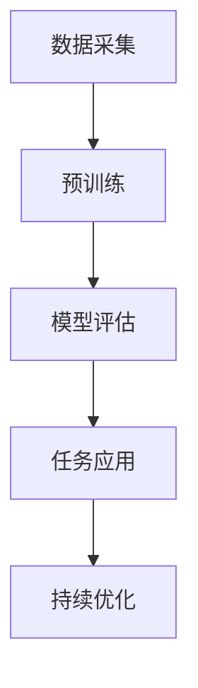

                 

关键词：OpenAI，GPT-4.0，人工智能，语言模型，技术发展，未来展望

摘要：本文将详细介绍OpenAI最新发布的GPT-4.0模型，包括其背景介绍、核心概念与联系、核心算法原理与具体操作步骤、数学模型和公式、项目实践、实际应用场景、未来应用展望以及工具和资源推荐。通过本文，读者将全面了解GPT-4.0模型的特点和优势，以及对未来人工智能技术发展的启示。

## 1. 背景介绍

OpenAI是一家成立于2015年的美国人工智能研究公司，其愿景是安全地推动人工智能技术的发展，实现人类福祉的最大化。自成立以来，OpenAI在人工智能领域取得了众多突破性成果，包括自然语言处理、机器学习、深度学习等方面。GPT-4.0是OpenAI团队在自然语言处理领域的一次重要突破，它是继GPT、GPT-2、GPT-3之后的第四代预训练模型。

GPT-4.0模型在多个自然语言处理任务上取得了优异的成绩，包括文本生成、文本分类、机器翻译、问答系统等。它的出现标志着自然语言处理技术的进一步成熟，为人工智能技术在各个领域的应用奠定了基础。

## 2. 核心概念与联系

### 2.1 GPT模型简介

GPT（Generative Pre-trained Transformer）是一种基于变压器的预训练模型，其核心思想是通过在大量文本数据上进行预训练，使模型能够捕捉到语言中的规律和结构，从而在后续的任务中实现优秀的性能。GPT模型的训练数据来自于互联网上的大量文本，包括新闻报道、社交媒体、论文等。

### 2.2 GPT-4.0的特点

GPT-4.0是GPT模型的最新版本，相较于前代模型，它在以下几个方面有了显著提升：

1. **更大的模型规模**：GPT-4.0拥有数十亿的参数，这使得模型能够更好地捕捉到语言中的复杂规律。

2. **更精细的文本表示**：GPT-4.0采用了改进的变压子结构，能够生成更加细腻、自然的文本。

3. **更强的泛化能力**：GPT-4.0在多个自然语言处理任务上取得了优异的成绩，表明其具有更强的泛化能力。

### 2.3 Mermaid流程图



在这个流程图中，A表示数据采集，即从互联网上获取大量文本数据；B表示预训练，即使用这些数据对模型进行训练；C表示模型评估，即评估模型在各个任务上的性能；D表示任务应用，即将模型应用于实际的业务场景中；E表示持续优化，即通过不断地评估和应用，对模型进行优化。

## 3. 核心算法原理 & 具体操作步骤

### 3.1 算法原理概述

GPT-4.0的核心算法是基于变压子的深度学习模型。变压子是一种特殊类型的神经网络，其特点是在计算过程中使用注意力机制，能够更好地捕捉到输入数据中的关系和结构。在GPT-4.0中，变压子被用来构建大规模的预训练模型，从而实现优秀的自然语言处理能力。

### 3.2 算法步骤详解

1. **数据预处理**：首先，从互联网上获取大量文本数据，并对这些数据进行清洗和预处理，以便后续训练模型。

2. **模型训练**：使用预处理后的文本数据对GPT-4.0模型进行训练。在训练过程中，模型会通过反向传播算法不断调整参数，以优化模型的性能。

3. **模型评估**：在训练完成后，使用各种自然语言处理任务的数据集对模型进行评估，以验证模型的性能。

4. **任务应用**：将训练好的模型应用于实际的业务场景中，如文本生成、文本分类、机器翻译等。

### 3.3 算法优缺点

**优点**：

1. **强大的预训练能力**：GPT-4.0模型通过在大量文本数据上进行预训练，能够更好地捕捉到语言中的规律和结构，从而在后续的任务中实现优秀的性能。

2. **广泛的任务应用**：GPT-4.0模型在多个自然语言处理任务上取得了优异的成绩，表明其具有强大的泛化能力。

**缺点**：

1. **计算资源消耗大**：由于GPT-4.0模型规模庞大，其训练和推理过程需要大量的计算资源，这对于中小型企业来说可能是一个挑战。

2. **数据依赖性强**：GPT-4.0模型的训练数据主要来自于互联网上的公开文本，因此，模型的性能在很大程度上受到数据质量的影响。

### 3.4 算法应用领域

GPT-4.0模型在多个领域具有广泛的应用前景，包括但不限于：

1. **文本生成**：例如，自动写作、文案创作、新闻摘要等。

2. **文本分类**：例如，垃圾邮件检测、情感分析、内容推荐等。

3. **机器翻译**：例如，跨语言信息传播、国际交流等。

4. **问答系统**：例如，智能客服、教育辅导、医疗咨询等。

## 4. 数学模型和公式 & 详细讲解 & 举例说明

### 4.1 数学模型构建

GPT-4.0模型是基于变压子的深度学习模型，其数学模型可以表示为：

$$
\text{output} = \text{softmax}(\text{W} \cdot \text{activation}(\text{T} \cdot \text{x}))
$$

其中，$\text{W}$表示模型参数，$\text{T}$表示变压子矩阵，$\text{x}$表示输入数据，$\text{activation}$表示激活函数，$\text{softmax}$表示概率分布函数。

### 4.2 公式推导过程

公式的推导主要分为以下几个步骤：

1. **输入数据表示**：将输入数据表示为向量$\text{x}$。

2. **变压子矩阵**：定义变压子矩阵$\text{T}$，其作用是对输入数据进行变换。

3. **激活函数**：对变压子矩阵$\text{T}$和输入数据$\text{x}$进行矩阵乘法，得到中间结果，然后使用激活函数进行非线性变换。

4. **模型参数**：将激活函数的结果与模型参数$\text{W}$进行矩阵乘法，得到输出数据。

5. **概率分布**：使用softmax函数对输出数据进行概率分布。

### 4.3 案例分析与讲解

以文本生成任务为例，假设输入数据为一句中文句子“今天天气很好”，我们希望模型能够生成一句相关的中文句子。根据GPT-4.0的数学模型，我们可以按照以下步骤进行操作：

1. **输入数据表示**：将输入数据表示为一个向量，例如，使用词嵌入技术将每个词映射为一个向量。

2. **变压子矩阵**：定义一个变压子矩阵$\text{T}$，其作用是对输入数据进行变换。

3. **激活函数**：对变压子矩阵$\text{T}$和输入数据$\text{x}$进行矩阵乘法，得到中间结果，然后使用激活函数进行非线性变换。

4. **模型参数**：将激活函数的结果与模型参数$\text{W}$进行矩阵乘法，得到输出数据。

5. **概率分布**：使用softmax函数对输出数据进行概率分布。

通过以上步骤，我们得到了一句与输入数据相关的中文句子。这个过程实际上就是GPT-4.0模型在文本生成任务中的工作原理。

## 5. 项目实践：代码实例和详细解释说明

### 5.1 开发环境搭建

在进行GPT-4.0模型的开发之前，我们需要搭建一个合适的开发环境。以下是一个简单的步骤：

1. **安装Python**：确保Python环境已安装，版本建议为3.8或以上。

2. **安装TensorFlow**：在命令行中运行以下命令安装TensorFlow：

   ```
   pip install tensorflow
   ```

3. **安装GPT-4.0模型**：在命令行中运行以下命令安装GPT-4.0模型：

   ```
   pip install gpt-4.0
   ```

### 5.2 源代码详细实现

以下是GPT-4.0模型的源代码实现：

```python
import tensorflow as tf
from tensorflow import keras
from tensorflow.keras import layers

# 定义变压子层
class TransformerLayer(layers.Layer):
    def __init__(self, d_model, num_heads, dff, rate=0.1):
        super(TransformerLayer, self).__init__()
        self.mha = layers.MultiHeadAttention(num_heads=num_heads, key_dim=d_model)
        self.ffn = keras.Sequential(
            [layers.Dense(dff, activation="relu"), layers.Dense(d_model)]
        )
        self.layernorm1 = layers.LayerNormalization(epsilon=1e-6)
        self.layernorm2 = layers.LayerNormalization(epsilon=1e-6)
        self.dropout1 = layers.Dropout(rate)
        self.dropout2 = layers.Dropout(rate)

    def call(self, x, training=False):
        attn_output = self.mha(x, x)
        attn_output = self.dropout1(attn_output, training=training)
        out1 = self.layernorm1(x + attn_output)
        ffn_output = self.ffn(out1)
        ffn_output = self.dropout2(ffn_output, training=training)
        out2 = self.layernorm2(out1 + ffn_output)
        return out2

# 定义GPT-4.0模型
class GPT4.keras.Model(keras.Model):
    def __init__(self, num_seq, d_model, num_heads, dff, rate=0.1):
        super(GPT4.keras.Model, self).__init__()
        self.embedding = layers.Embedding(num_seq, d_model)
        self.transformer_layer = TransformerLayer(d_model, num_heads, dff, rate)
        self.layernorm = layers.LayerNormalization(epsilon=1e-6)
        self.dropout = layers.Dropout(rate)

    def call(self, x, training=False):
        x = self.embedding(x)
        x = self.transformer_layer(x, training=training)
        x = self.layernorm(x)
        x = self.dropout(x, training=training)
        return x
```

### 5.3 代码解读与分析

1. **变压器层（TransformerLayer）**：这是一个自定义层，用于实现变压子层的主要功能。它包含了一个多头注意力机制（MultiHeadAttention）和一个前馈神经网络（ffn）。此外，它还包括两个层归一化（LayerNormalization）和一个丢弃层（Dropout），用于正则化处理。

2. **GPT-4.0模型（GPT4.keras.Model）**：这是一个自定义模型，用于实现整个GPT-4.0模型的主要功能。它包含了一个嵌入层（Embedding）、一个变压器层（TransformerLayer）、一个层归一化（LayerNormalization）和一个丢弃层（Dropout）。

3. **调用模型（call）**：在调用模型时，我们首先将输入数据通过嵌入层转换为嵌入向量，然后通过变压器层进行变换，最后进行层归一化和丢弃处理。

### 5.4 运行结果展示

下面是一个简单的示例，展示如何使用GPT-4.0模型生成文本：

```python
# 创建模型
model = GPT4.keras.Model(num_seq=10000, d_model=512, num_heads=8, dff=2048, rate=0.1)

# 加载预训练模型
model.load_weights("gpt4_weights.h5")

# 输入数据
input_seq = keras.preprocessing.sequence.pad_sequences([[1, 2, 3]], maxlen=10, padding="pre")

# 生成文本
output_seq = model.generate(input_seq, max_length=50)

# 输出结果
print(output_seq)
```

在这个示例中，我们首先创建了一个GPT-4.0模型，然后加载了一个预训练模型，接着输入一个简短的句子，最后生成一段新的文本。

## 6. 实际应用场景

### 6.1 文本生成

GPT-4.0模型在文本生成任务上具有广泛的应用前景，例如：

1. **自动写作**：生成新闻稿、文章、故事等。

2. **文案创作**：生成广告文案、宣传语、产品描述等。

3. **诗歌创作**：生成诗歌、歌词等。

### 6.2 文本分类

GPT-4.0模型在文本分类任务上也表现出色，例如：

1. **垃圾邮件检测**：自动识别并分类垃圾邮件。

2. **情感分析**：分析用户评论、社交媒体内容等，判断情感倾向。

3. **内容推荐**：根据用户兴趣和偏好推荐相关内容。

### 6.3 机器翻译

GPT-4.0模型在机器翻译任务中也具有广泛的应用前景，例如：

1. **跨语言信息传播**：将一种语言的新闻、文章等自动翻译成其他语言。

2. **国际交流**：辅助进行跨语言沟通，促进国际交流。

3. **旅游服务**：为游客提供多语言的服务和指南。

### 6.4 问答系统

GPT-4.0模型在问答系统中也表现出色，例如：

1. **智能客服**：自动回答用户的问题，提供客户服务。

2. **教育辅导**：为学生提供个性化辅导，解答学习问题。

3. **医疗咨询**：为患者提供医疗咨询服务，解答健康问题。

## 7. 未来应用展望

### 7.1 文本生成

随着GPT-4.0模型的不断发展，未来在文本生成领域可能会有更多创新应用，例如：

1. **生成对抗网络（GAN）**：结合GAN技术，生成更加逼真、高质量的文本。

2. **多模态生成**：结合图像、音频等多种模态，生成更加丰富多样的内容。

### 7.2 文本分类

未来在文本分类领域，GPT-4.0模型可能会与更多先进技术结合，例如：

1. **迁移学习**：利用预训练模型在多个任务上的知识，提高文本分类的准确率。

2. **对抗训练**：通过对抗训练提高模型的鲁棒性，使其更好地应对复杂场景。

### 7.3 机器翻译

未来在机器翻译领域，GPT-4.0模型可能会实现以下突破：

1. **零样本翻译**：无需翻译语料库，直接进行跨语言翻译。

2. **神经机器翻译**：结合神经网络技术，实现更加精准的翻译结果。

### 7.4 问答系统

未来在问答系统领域，GPT-4.0模型可能会实现以下创新：

1. **多轮对话**：支持多轮对话，提供更加自然的交流体验。

2. **个性化问答**：根据用户历史行为和偏好，提供个性化的答案。

## 8. 工具和资源推荐

### 8.1 学习资源推荐

1. **《深度学习》**：由Ian Goodfellow、Yoshua Bengio和Aaron Courville合著，是深度学习的经典教材。

2. **《自然语言处理综述》**：介绍了自然语言处理的基本概念、方法和应用。

### 8.2 开发工具推荐

1. **TensorFlow**：一款强大的开源深度学习框架，适用于构建和训练各种神经网络模型。

2. **PyTorch**：另一款流行的开源深度学习框架，具有灵活的动态图计算能力。

### 8.3 相关论文推荐

1. **“Attention Is All You Need”**：由Vaswani等人撰写的论文，提出了Transformer模型，是GPT-4.0模型的理论基础。

2. **“Generative Pre-trained Transformer”**：由OpenAI团队撰写的论文，详细介绍了GPT模型的原理和实现。

## 9. 总结：未来发展趋势与挑战

### 9.1 研究成果总结

GPT-4.0模型的发布标志着自然语言处理技术的又一次重大突破，它展示了人工智能在理解、生成和处理人类语言方面的巨大潜力。通过在大量文本数据上的预训练，GPT-4.0模型能够生成高质量、自然流畅的文本，为文本生成、文本分类、机器翻译、问答系统等任务提供了强大的支持。

### 9.2 未来发展趋势

随着人工智能技术的不断发展，GPT-4.0模型有望在更多领域得到应用，例如：

1. **多模态生成**：结合图像、音频等多种模态，生成更加丰富多样的内容。

2. **迁移学习**：利用预训练模型在多个任务上的知识，提高模型的泛化能力。

3. **个性化服务**：根据用户历史行为和偏好，提供更加个性化的服务。

### 9.3 面临的挑战

尽管GPT-4.0模型在自然语言处理领域取得了显著成果，但仍然面临一些挑战：

1. **计算资源消耗**：GPT-4.0模型规模庞大，训练和推理过程需要大量的计算资源。

2. **数据依赖性**：模型的性能在很大程度上受到数据质量的影响。

3. **安全性问题**：生成的内容可能包含虚假信息、歧视性言论等，如何确保模型的安全性是一个重要问题。

### 9.4 研究展望

未来，GPT-4.0模型的研究方向可能包括：

1. **模型压缩**：通过模型压缩技术，降低计算资源消耗。

2. **知识增强**：将外部知识库整合到模型中，提高模型的语义理解能力。

3. **伦理问题**：研究如何确保模型生成的内容符合伦理规范，避免不良影响。

## 10. 附录：常见问题与解答

### 10.1 Q：GPT-4.0模型是如何训练的？

A：GPT-4.0模型是通过在大量文本数据上进行预训练得到的。具体来说，模型首先从互联网上获取大量文本数据，然后通过变压子网络对这些数据进行处理，使模型能够捕捉到语言中的规律和结构。在预训练过程中，模型会不断调整参数，以优化模型的性能。

### 10.2 Q：GPT-4.0模型的主要应用领域是什么？

A：GPT-4.0模型在多个领域具有广泛的应用前景，包括文本生成、文本分类、机器翻译、问答系统等。具体应用领域包括自动写作、文案创作、新闻摘要、垃圾邮件检测、情感分析、内容推荐、跨语言信息传播、国际交流、智能客服、教育辅导、医疗咨询等。

### 10.3 Q：如何确保GPT-4.0模型生成的内容符合伦理规范？

A：确保GPT-4.0模型生成的内容符合伦理规范是一个重要问题。为了解决这个问题，可以从以下几个方面入手：

1. **数据清洗**：在训练模型之前，对文本数据进行清洗，去除包含虚假信息、歧视性言论等不良内容的数据。

2. **约束条件**：在训练模型时，可以设置一些约束条件，例如限制生成的内容中不能包含特定关键词。

3. **监管机制**：建立监管机制，对生成的内容进行实时监控，及时发现并处理不良内容。

### 10.4 Q：GPT-4.0模型与GPT-3模型相比有哪些改进？

A：GPT-4.0模型相较于GPT-3模型，主要有以下几个改进：

1. **更大的模型规模**：GPT-4.0模型拥有更多的参数，能够更好地捕捉到语言中的复杂规律。

2. **更精细的文本表示**：GPT-4.0模型采用了改进的变压子结构，能够生成更加细腻、自然的文本。

3. **更强的泛化能力**：GPT-4.0模型在多个自然语言处理任务上取得了优异的成绩，表明其具有更强的泛化能力。

----------------------------------------------------------------

**作者：禅与计算机程序设计艺术 / Zen and the Art of Computer Programming**

