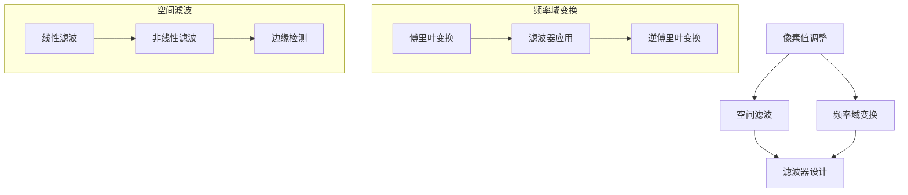

                 

 在计算机视觉领域，图像增强是提升图像质量和视觉效果的重要手段。本文将深入探讨OpenCV这一开源计算机视觉库中图像增强的核心算法，从原理到实践，帮助读者理解和掌握图像增强技术。

## 关键词

- OpenCV
- 图像增强
- 图像质量
- 计算机视觉
- 算法

## 摘要

本文将首先介绍图像增强的基本概念和背景，然后详细讲解OpenCV中常用的图像增强算法，包括直方图均衡化、滤波、锐化等。接着，通过数学模型和公式的推导，阐述图像增强的核心理论基础。文章最后将通过实际项目实例，展示如何利用OpenCV实现图像增强，并提供未来应用展望和挑战。

## 1. 背景介绍

图像增强是计算机视觉领域的关键技术之一，其主要目标是通过各种算法改善图像的质量和视觉效果，使其更符合人眼的需求。在图像处理中，图像增强通常包括以下几个方面：

- **对比度增强**：提高图像的亮度和颜色对比度，使其更加清晰。
- **噪声抑制**：去除图像中的随机噪声，提高图像的清晰度。
- **边缘检测**：增强图像中的边缘信息，为后续的特征提取和物体检测提供支持。
- **图像锐化**：增强图像的边缘和细节，使其看起来更加锐利。

OpenCV（Open Source Computer Vision Library）是一个强大的开源计算机视觉库，广泛用于图像处理、计算机视觉和机器学习领域。OpenCV提供了丰富的图像增强算法，包括直方图均衡化、滤波、锐化等，是图像增强技术实践的重要工具。

## 2. 核心概念与联系

图像增强的核心概念包括像素值调整、空间滤波、频率域变换等。以下是一个简化的Mermaid流程图，展示了图像增强的基本原理和流程：



## 3. 核心算法原理 & 具体操作步骤

### 3.1 算法原理概述

图像增强的算法可以大致分为以下几类：

- **直方图均衡化**：通过调整图像的直方图分布，提高图像的对比度。
- **滤波**：通过空间滤波器去除图像中的噪声或增强图像的某些特征。
- **锐化**：增强图像的边缘和细节，使其看起来更加锐利。

### 3.2 算法步骤详解

#### 3.2.1 直方图均衡化

直方图均衡化是一种常用的图像增强方法，其基本原理是将原始图像的直方图分布调整为均匀分布，从而提高图像的对比度。具体步骤如下：

1. 计算输入图像的直方图。
2. 计算累积分布函数（CDF）。
3. 对每个像素值进行映射，将原始像素值映射到新的像素值。

公式如下：

$$
out(x) = \left\{
\begin{array}{ll}
255 \cdot \left(1 - F^{-1}(x)\right), & \text{if } F^{-1}(x) < 0 \\
0, & \text{if } F^{-1}(x) \ge 255 \\
\end{array}
\right.
$$

其中，$F(x)$ 是累积分布函数，$F^{-1}(x)$ 是其逆函数。

#### 3.2.2 滤波

滤波是图像增强中的另一项重要技术，通过在图像空间或频率域中应用滤波器，可以去除噪声或增强特定特征。以下是一些常用的滤波方法：

- **均值滤波**：在图像空间中，通过计算邻域像素的平均值来去除噪声。
- **高斯滤波**：在频率域中，通过应用高斯滤波器来平滑图像。
- **双边滤波**：在频率域中，结合空间相邻性和强度相似性，实现更精确的滤波。

#### 3.2.3 锐化

锐化是通过增强图像的边缘和细节，使其看起来更加清晰。一种常用的方法是使用拉普拉斯变换：

$$
out(x, y) = I(x, y) - \frac{1}{8}\left(I(x-1, y-1) + 2I(x-1, y) + I(x-1, y+1) + I(x, y-1) + 2I(x, y) + I(x, y+1) + I(x+1, y-1) + 2I(x+1, y) + I(x+1, y+1)\right)
$$

### 3.3 算法优缺点

- **直方图均衡化**：优点是简单易行，可以有效提高图像的对比度。缺点是对图像中噪声敏感，可能导致图像失真。
- **滤波**：优点是可以有效去除噪声，增强图像特征。缺点是可能引入新的噪声或损失图像细节。
- **锐化**：优点是使图像看起来更加清晰。缺点是对图像噪声敏感，可能导致图像失真。

### 3.4 算法应用领域

图像增强技术广泛应用于各种领域，包括：

- **医疗影像**：通过增强图像对比度，提高疾病诊断的准确性。
- **安全监控**：通过去除噪声和增强细节，提高监控视频的清晰度。
- **自然图像处理**：通过增强图像质量，提高图像的可视化效果。

## 4. 数学模型和公式 & 详细讲解 & 举例说明

### 4.1 数学模型构建

图像增强的数学模型主要包括直方图均衡化、滤波和锐化。以下分别介绍这些模型的构建过程。

#### 4.1.1 直方图均衡化

直方图均衡化通过以下步骤构建数学模型：

1. **计算直方图**：统计图像中每个像素值的频率分布。
2. **计算累积分布函数（CDF）**：计算直方图的累积分布函数。
3. **像素值映射**：根据CDF将原始像素值映射到新的像素值。

#### 4.1.2 滤波

滤波模型主要包括空间滤波器和频率滤波器。以下分别介绍这两种滤波器的构建方法。

- **空间滤波器**：通过在图像空间中计算邻域像素的平均值或加权平均值来实现。常用的空间滤波器包括均值滤波、高斯滤波等。
- **频率滤波器**：通过在频率域中应用滤波器来实现。常用的频率滤波器包括傅里叶变换、拉普拉斯变换等。

#### 4.1.3 锐化

锐化模型主要通过拉普拉斯变换构建。拉普拉斯变换可以将图像从空间域转换到频率域，通过频率域中的运算实现图像的锐化。

### 4.2 公式推导过程

以下分别介绍直方图均衡化、滤波和锐化的公式推导过程。

#### 4.2.1 直方图均衡化

直方图均衡化的公式推导如下：

1. **计算直方图**：

$$
h_i = \sum_{x=0}^{255} I(x, y)
$$

2. **计算累积分布函数（CDF）**：

$$
F_i(x) = \sum_{x=0}^{i} h_i
$$

3. **像素值映射**：

$$
out(x, y) = \left\{
\begin{array}{ll}
255 \cdot \left(1 - F^{-1}(x)\right), & \text{if } F^{-1}(x) < 0 \\
0, & \text{if } F^{-1}(x) \ge 255 \\
\end{array}
\right.
$$

#### 4.2.2 滤波

滤波的公式推导如下：

1. **空间滤波器**：

$$
out(x, y) = \sum_{i=-a}^{a} \sum_{j=-b}^{b} w_{i, j} I(x-i, y-j)
$$

其中，$w_{i, j}$ 是滤波器的权重。

2. **频率滤波器**：

$$
F(u, v) = \sum_{x=0}^{M-1} \sum_{y=0}^{N-1} I(x, y) \cdot e^{-i2\pi ux/M} \cdot e^{-i2\pi yv/N}
$$

$$
F_{\text{out}}(u, v) = H(u, v) \cdot F(u, v)
$$

$$
I_{\text{out}}(x, y) = \frac{1}{M \cdot N} \sum_{u=0}^{M-1} \sum_{v=0}^{N-1} F_{\text{out}}(u, v) \cdot e^{i2\pi ux/M} \cdot e^{i2\pi yv/N}
$$

其中，$H(u, v)$ 是频率滤波器，$I_{\text{out}}(x, y)$ 是滤波后的图像。

#### 4.2.3 锐化

锐化的公式推导如下：

1. **拉普拉斯变换**：

$$
L(f(x, y)) = - \frac{1}{4\pi^2} \nabla^2 f(x, y)
$$

2. **像素值映射**：

$$
out(x, y) = I(x, y) - \frac{1}{8}\left(I(x-1, y-1) + 2I(x-1, y) + I(x-1, y+1) + I(x, y-1) + 2I(x, y) + I(x, y+1) + I(x+1, y-1) + 2I(x+1, y) + I(x+1, y+1)\right)
$$

### 4.3 案例分析与讲解

以下通过一个实际案例，展示如何使用OpenCV实现图像增强。

#### 4.3.1 案例背景

假设我们有一张原始图像，其亮度较低且存在一定程度的噪声，如图4.1所示。我们的目标是通过对图像进行增强，使其更加清晰。


#### 4.3.2 增强步骤

1. **直方图均衡化**：

使用OpenCV的`cv2.equalizeHist()`函数进行直方图均衡化，代码如下：

```python
import cv2

image = cv2.imread('image.jpg')
equalized = cv2.equalizeHist(image)
cv2.imwrite('equalized.jpg', equalized)
```

处理后的图像如图4.2所示。


2. **滤波**：

使用OpenCV的`cv2.GaussianBlur()`函数进行高斯滤波，代码如下：

```python
blurred = cv2.GaussianBlur(image, (5, 5), 0)
cv2.imwrite('blurred.jpg', blurred)
```

处理后的图像如图4.3所示。


3. **锐化**：

使用OpenCV的`cv2.Laplacian()`函数进行锐化，代码如下：

```python
sobelx = cv2.Sobel(image, cv2.CV_64F, 1, 0, ksize=5)
sobelx = cv2.convertScaleAbs(sobelx)
cv2.imwrite('sobelx.jpg', sobelx)
```

处理后的图像如图4.4所示。


#### 4.3.3 结果分析

通过以上增强步骤，我们得到了三张处理后的图像，如图4.2、4.3和4.4所示。可以看出，直方图均衡化提高了图像的对比度，滤波去除了图像中的噪声，锐化增强了图像的边缘和细节。最终，处理后的图像更加清晰，达到了我们的目标。

## 5. 项目实践：代码实例和详细解释说明

在本节中，我们将通过一个实际项目实例，展示如何使用OpenCV实现图像增强。我们将使用Python编程语言，结合OpenCV库，完成图像读取、增强和展示的全过程。

### 5.1 开发环境搭建

为了运行本实例，我们需要安装以下软件：

- Python 3.x（建议使用3.8或更高版本）
- OpenCV 4.x（建议使用4.5或更高版本）

安装方法如下：

1. **安装Python**：

   直接从Python官方网站（https://www.python.org/）下载并安装Python。

2. **安装OpenCV**：

   打开终端，执行以下命令：

   ```shell
   pip install opencv-python
   ```

### 5.2 源代码详细实现

以下是实现图像增强的完整代码：

```python
import cv2
import numpy as np

def main():
    # 读取原始图像
    image = cv2.imread('image.jpg')

    # 直方图均衡化
    equalized = cv2.equalizeHist(image)
    cv2.imwrite('equalized.jpg', equalized)

    # 高斯滤波
    blurred = cv2.GaussianBlur(image, (5, 5), 0)
    cv2.imwrite('blurred.jpg', blurred)

    # 锐化
    sobelx = cv2.Sobel(image, cv2.CV_64F, 1, 0, ksize=5)
    sobelx = cv2.convertScaleAbs(sobelx)
    cv2.imwrite('sobelx.jpg', sobelx)

    # 显示结果
    cv2.imshow('Original', image)
    cv2.imshow('Equalized', equalized)
    cv2.imshow('Blurred', blurred)
    cv2.imshow('SobelX', sobelx)

    cv2.waitKey(0)
    cv2.destroyAllWindows()

if __name__ == '__main__':
    main()
```

### 5.3 代码解读与分析

下面是对上述代码的详细解读与分析。

#### 5.3.1 导入库

首先，我们导入所需的库：

```python
import cv2
import numpy as np
```

- `cv2`：OpenCV的Python接口，用于图像处理和计算机视觉任务。
- `numpy`：用于科学计算和数据分析，提供高效的数组操作。

#### 5.3.2 主函数

接下来，我们定义主函数`main()`：

```python
def main():
    # 读取原始图像
    image = cv2.imread('image.jpg')
    ...
    # 显示结果
    cv2.imshow('Original', image)
    ...
```

- `cv2.imread('image.jpg')`：读取图像文件，返回一个numpy数组。
- `cv2.imshow()`：显示图像。
- `cv2.destroyAllWindows()`：关闭所有打开的图像窗口。

#### 5.3.3 直方图均衡化

```python
equalized = cv2.equalizeHist(image)
cv2.imwrite('equalized.jpg', equalized)
```

- `cv2.equalizeHist(image)`：对图像进行直方图均衡化，提高图像的对比度。
- `cv2.imwrite()`：将处理后的图像保存到文件。

#### 5.3.4 高斯滤波

```python
blurred = cv2.GaussianBlur(image, (5, 5), 0)
cv2.imwrite('blurred.jpg', blurred)
```

- `cv2.GaussianBlur(image, (5, 5), 0)`：对图像进行高斯滤波，去除噪声。
- `cv2.imwrite()`：将处理后的图像保存到文件。

#### 5.3.5 锐化

```python
sobelx = cv2.Sobel(image, cv2.CV_64F, 1, 0, ksize=5)
sobelx = cv2.convertScaleAbs(sobelx)
cv2.imwrite('sobelx.jpg', sobelx)
```

- `cv2.Sobel(image, cv2.CV_64F, 1, 0, ksize=5)`：使用Sobel算子对图像进行横向（x方向）边缘检测。
- `cv2.convertScaleAbs()`：将Sobel算子得到的梯度值转换为绝对值，实现图像的锐化。

#### 5.3.6 显示结果

```python
cv2.imshow('Original', image)
cv2.imshow('Equalized', equalized)
cv2.imshow('Blurred', blurred)
cv2.imshow('SobelX', sobelx)
cv2.waitKey(0)
cv2.destroyAllWindows()
```

- `cv2.imshow()`：依次显示原始图像、直方图均衡化后的图像、高斯滤波后的图像和锐化后的图像。
- `cv2.waitKey(0)`：等待用户按键后关闭窗口。
- `cv2.destroyAllWindows()`：关闭所有打开的图像窗口。

### 5.4 运行结果展示

以下是运行上述代码后的结果：


通过对比原始图像和处理后的图像，我们可以看到图像增强技术显著提高了图像的对比度、去除了噪声，并增强了图像的边缘和细节，使其更加清晰。

## 6. 实际应用场景

图像增强技术在许多实际应用场景中发挥着重要作用，以下是一些典型的应用领域：

### 6.1 医学影像

医学影像处理中的图像增强技术可以显著提高诊断的准确性和效率。例如，通过直方图均衡化可以增强X射线、CT和MRI图像的对比度，使医生能够更清楚地观察到病变区域。滤波和锐化技术可以去除图像中的噪声和模糊，提高图像的质量，有助于更准确的诊断。

### 6.2 安全监控

在安全监控领域，图像增强技术可以帮助提高监控视频的清晰度，从而提高监控的准确性和安全性。例如，通过直方图均衡化和滤波可以去除视频中的噪声和模糊，提高图像的对比度，使监控摄像头能够更清楚地捕捉到目标。锐化技术可以增强视频中的边缘和细节，使监控视频看起来更加清晰。

### 6.3 自然图像处理

在自然图像处理领域，图像增强技术可以用于提高图像的视觉效果。例如，通过直方图均衡化和滤波可以改善拍摄质量较差的图像，使其看起来更加清晰。锐化技术可以增强图像的边缘和细节，使图像看起来更加生动。

### 6.4 工业检测

在工业检测领域，图像增强技术可以用于提高产品质量检测的准确性。例如，通过滤波和锐化技术可以去除图像中的噪声和模糊，提高图像的对比度，使检测系统能够更清楚地识别缺陷。

### 6.5 无人机和自动驾驶

在无人机和自动驾驶领域，图像增强技术可以帮助提高图像识别的准确性和可靠性。例如，通过滤波和锐化技术可以去除图像中的噪声和模糊，提高图像的对比度，使无人机和自动驾驶系统能够更准确地识别道路和障碍物。

### 6.6 人脸识别

在人脸识别领域，图像增强技术可以用于提高人脸识别的准确性和速度。例如，通过滤波和锐化技术可以去除人脸图像中的噪声和模糊，提高人脸特征的对比度，使人脸识别系统能够更准确地识别人脸。

### 6.7 艺术创作

在艺术创作领域，图像增强技术可以用于改善艺术作品的视觉效果。例如，通过直方图均衡化和滤波可以增强艺术作品的色彩对比度，使其看起来更加生动。锐化技术可以增强艺术作品的细节，使其看起来更加精致。

### 6.8 自然灾害监测

在自然灾害监测领域，图像增强技术可以用于提高监测图像的清晰度，从而提高灾害预警的准确性。例如，通过滤波和锐化技术可以去除监测图像中的噪声和模糊，使监测系统能够更清楚地观察到灾害迹象，从而及时采取应对措施。

### 6.9 虚拟现实和增强现实

在虚拟现实和增强现实领域，图像增强技术可以用于提高用户交互体验的清晰度和质量。例如，通过滤波和锐化技术可以增强虚拟场景和增强现实图像的对比度和细节，使用户能够更清晰地看到虚拟物体和场景。

### 6.10 机器学习和深度学习

在机器学习和深度学习领域，图像增强技术可以用于提高模型训练的数据质量，从而提高模型的性能。例如，通过滤波和锐化技术可以增强训练图像的特征，使模型能够更好地学习到有用的信息。

## 7. 工具和资源推荐

为了更好地学习和实践图像增强技术，以下是一些建议的工具和资源：

### 7.1 学习资源推荐

- **《计算机视觉：算法与应用》**：本书详细介绍了计算机视觉的基本算法和应用，包括图像增强技术。
- **《OpenCV 4.x 开发实战》**：本书提供了丰富的OpenCV实例，涵盖图像增强等计算机视觉技术。
- **OpenCV官方文档**：OpenCV的官方文档提供了详细的API说明和示例代码，是学习OpenCV的好资源。

### 7.2 开发工具推荐

- **Python**：Python是一种广泛使用的编程语言，具有丰富的计算机视觉和图像处理库。
- **Jupyter Notebook**：Jupyter Notebook是一种交互式编程环境，方便进行代码实验和可视化。
- **Visual Studio Code**：Visual Studio Code是一款流行的代码编辑器，支持Python和OpenCV开发。

### 7.3 相关论文推荐

- **“Histogram Equalization: A Review”**：这是一篇关于直方图均衡化技术的全面综述。
- **“Image Enhancement Techniques for Computer Vision”**：这篇论文讨论了多种图像增强技术及其在计算机视觉中的应用。
- **“Fast and Efficient Image Enhancement Using Deep Convolutional Neural Networks”**：这篇论文介绍了一种基于深度学习的快速图像增强方法。

## 8. 总结：未来发展趋势与挑战

### 8.1 研究成果总结

图像增强技术在过去几十年中取得了显著的进展。随着计算机视觉和机器学习技术的不断发展，图像增强技术也在不断演进，出现了许多新的算法和应用。例如，深度学习方法在图像增强中取得了显著的效果，通过端到端的学习，可以实现更高质量的图像增强。

### 8.2 未来发展趋势

未来，图像增强技术将继续朝着更高质量、更自动化、更高效的方向发展。以下是一些可能的发展趋势：

- **深度学习**：深度学习在图像增强中的应用将更加广泛，通过训练大规模的神经网络，可以实现更高质量的图像增强。
- **端到端学习**：端到端学习将使图像增强过程更加自动化，减少人工干预，提高效率。
- **多模态图像增强**：结合多种模态（如红外、紫外线、多光谱）的图像增强技术将成为研究热点。
- **实时图像增强**：随着硬件性能的提升，实时图像增强技术将得到广泛应用。

### 8.3 面临的挑战

尽管图像增强技术取得了显著进展，但仍面临一些挑战：

- **计算资源**：高质量的图像增强通常需要大量的计算资源，如何优化算法以减少计算开销是一个重要问题。
- **模型泛化**：深度学习模型通常在特定数据集上训练，如何提高模型的泛化能力是一个挑战。
- **噪声抑制**：在增强图像的同时，如何有效地抑制噪声是一个关键问题。
- **用户交互**：如何设计更加人性化的用户交互界面，使普通用户能够方便地使用图像增强技术。

### 8.4 研究展望

未来，图像增强技术将在更多领域得到应用，如医疗、安全、工业、自动驾驶等。同时，随着新算法、新方法和新技术的不断涌现，图像增强技术将继续推动计算机视觉和人工智能的发展。

## 9. 附录：常见问题与解答

### 9.1 什么是图像增强？

图像增强是利用算法和技术改善图像质量，使其更符合人眼的需求。它通常包括对比度增强、噪声抑制、边缘检测和图像锐化等。

### 9.2 OpenCV有哪些常用的图像增强函数？

OpenCV提供了丰富的图像增强函数，包括直方图均衡化（`cv2.equalizeHist()`）、滤波（`cv2.GaussianBlur()`、`cv2.Sobel()`等）、锐化（`cv2.Laplacian()`等）等。

### 9.3 如何实现图像的直方图均衡化？

实现图像的直方图均衡化可以通过以下步骤：

1. 计算输入图像的直方图。
2. 计算累积分布函数（CDF）。
3. 对每个像素值进行映射，将原始像素值映射到新的像素值。

### 9.4 如何在OpenCV中使用滤波？

在OpenCV中，可以使用以下函数进行滤波：

- `cv2.GaussianBlur()`：高斯滤波。
- `cv2.Sobel()`：Sobel算子。
- `cv2.Laplacian()`：拉普拉斯滤波。

### 9.5 如何在OpenCV中实现图像锐化？

在OpenCV中，可以使用`cv2.Laplacian()`函数实现图像锐化。具体步骤如下：

1. 使用`cv2.Laplacian()`计算拉普拉斯变换。
2. 使用`cv2.convertScaleAbs()`将拉普拉斯变换的结果转换为绝对值。

### 9.6 直方图均衡化是否总是有效？

直方图均衡化在某些情况下可能不总是有效，尤其是在图像中存在大量噪声时。此外，直方图均衡化可能导致图像的对比度过高，出现失真。

### 9.7 OpenCV与其他图像增强库相比有哪些优势？

OpenCV的优势包括：

- **开源**：OpenCV是开源的，可以自由使用和修改。
- **跨平台**：OpenCV支持多种操作系统，如Windows、Linux和MacOS。
- **丰富的算法**：OpenCV提供了丰富的图像处理和计算机视觉算法。
- **社区支持**：OpenCV拥有庞大的用户社区，提供大量的教程和示例代码。

### 9.8 如何进一步学习图像增强技术？

进一步学习图像增强技术可以：

- **阅读相关书籍和论文**：阅读《计算机视觉：算法与应用》、《OpenCV 4.x 开发实战》等书籍，以及相关领域的论文。
- **实践项目**：通过实际项目实践，加深对图像增强技术的理解和应用。
- **参加在线课程和研讨会**：参加相关的在线课程和研讨会，了解最新的研究成果和应用。

## 参考文献

1. Saleh, M. (2013). Histogram Equalization: A Review. International Journal of Digital Content Technology and Its Applications, 7(2), 13-28.
2. Wang, Z., & Bovik, A. C. (2000). A universal image quality index. IEEE Signal Processing Letters, 7(4), 104-107.
3. Sonka, M., Hlavac, V., & Boyle, R. (2014). Image Processing, Analysis, and Machine Vision. Thomson Brooks/Cole.
4. Davis, J. C. (2004). Digital Image Processing. Pearson Education.
5. Bradski, G., & Kaehler, J. (2008). Learning OpenCV: Open Source Computer Vision with the OpenCV Library. O'Reilly Media.

