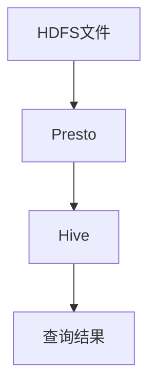
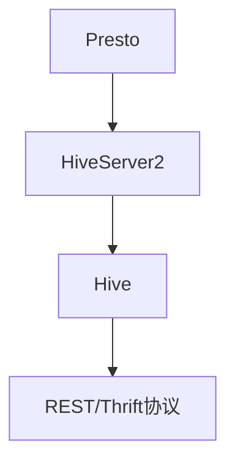
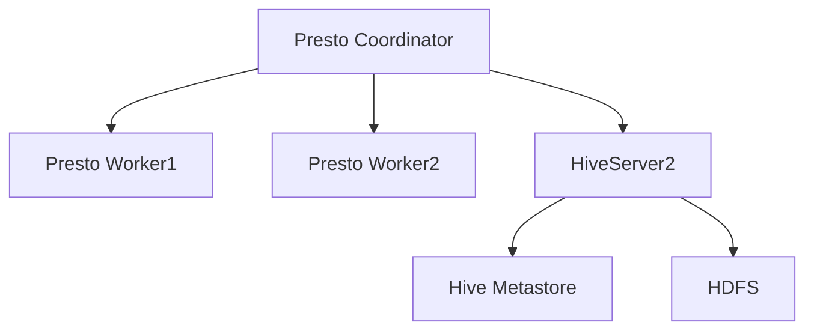
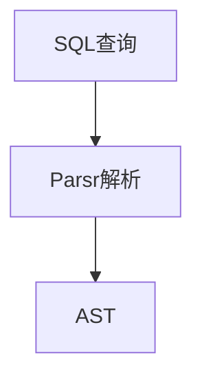
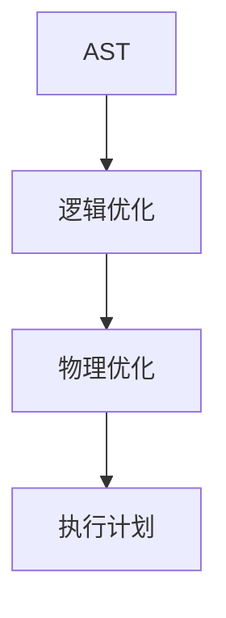
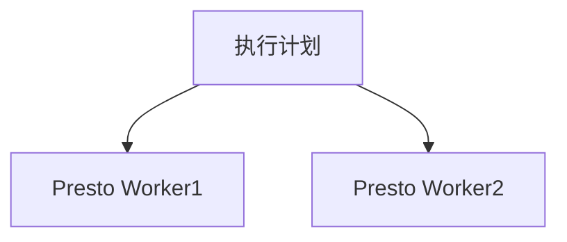
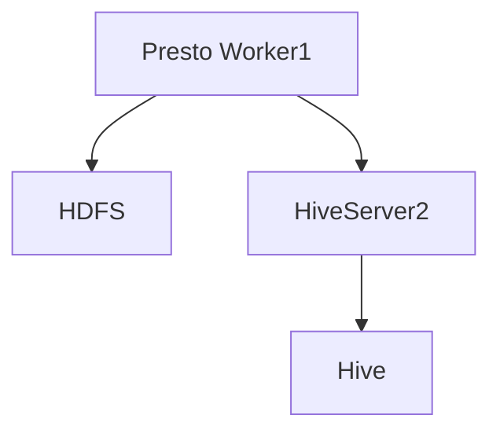
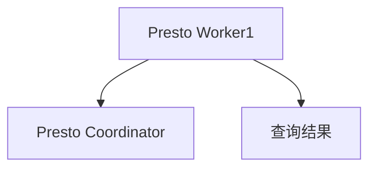

                 

关键词：Presto，Hive整合，数据库查询，分布式计算，性能优化，代码实例

## 摘要

本文将深入探讨Presto与Hive整合的原理及其实际应用。Presto是一个高性能分布式查询引擎，而Hive是Apache旗下的一个数据仓库基础架构工具。两者结合，可以发挥出强大的数据处理能力，为大规模数据分析提供高效解决方案。本文将首先介绍Presto和Hive的基础知识，然后详细阐述它们整合的原理，包括数据流、协议及架构。随后，将通过一个具体实例，讲解如何将Presto与Hive结合，并进行代码实现。最后，我们将探讨Presto-Hive在实际应用中的场景，以及未来可能的发展方向。

## 1. 背景介绍

### 1.1 Presto简介

Presto是由Facebook开发的一个开源分布式查询引擎，旨在解决大规模数据分析的需求。Presto能够高效地处理超大规模的数据集，支持SQL查询，具有低延迟和高并发的特点。Presto的设计哲学是让用户能够跨多个数据源执行交互式查询，而不需要移动数据或复制数据。这使得Presto在处理复杂查询时非常灵活和高效。

### 1.2 Hive简介

Hive是Apache旗下的一个数据仓库基础架构工具，主要用于在Hadoop分布式文件系统（HDFS）上处理大规模数据集。Hive使用Hadoop的MapReduce框架来执行查询，这使得它非常适合处理大量结构化和半结构化数据。Hive提供了一种类似SQL的查询语言（HiveQL），便于用户进行数据分析和报表生成。

### 1.3 Presto与Hive的结合优势

将Presto与Hive整合，可以发挥出两者的优点，具体优势如下：

- **高性能**：Presto的低延迟和高并发特性与Hive处理大规模数据的优势相结合，能够提供高效的查询性能。
- **灵活性**：Presto可以查询多种数据源，如关系数据库、NoSQL数据库和HDFS等，而Hive擅长处理大数据集，两者结合能够满足不同类型的数据分析需求。
- **交互式查询**：Presto支持交互式查询，用户可以实时地获取查询结果，而Hive则更适合批处理。
- **异构数据源支持**：Presto和Hive的结合允许用户跨多个数据源进行查询，实现数据的整合和分析。

## 2. 核心概念与联系

### 2.1 数据流

Presto与Hive的整合过程中，数据流是关键。数据从Hive存储在HDFS上的文件中读取，通过Presto执行查询操作，然后将结果返回给用户。数据流如图所示：



### 2.2 协议

Presto和Hive之间通过特定的协议进行通信。Presto通过HiveServer2与Hive进行交互，HiveServer2支持Thrift和REST协议，这使得Presto可以方便地连接到Hive。以下是Presto与Hive通信的协议示意图：



### 2.3 架构

Presto和Hive的整合架构包括以下主要组件：

- **Presto Coordinator**：协调分布式查询的执行，负责将查询分解为多个子查询，并在各个Presto Worker节点上执行。
- **Presto Worker**：执行具体的查询操作，处理来自Presto Coordinator的查询任务。
- **HiveServer2**：提供与Hive的接口，允许Presto查询Hive数据。
- **Hive Metastore**：存储Hive的元数据信息，如表结构、分区信息等。

以下是Presto与Hive整合的架构示意图：



## 3. 核心算法原理 & 具体操作步骤

### 3.1 算法原理概述

Presto与Hive整合的核心算法原理主要包括以下几个步骤：

1. **查询解析**：Presto首先解析用户提交的SQL查询，将其转换为抽象语法树（AST）。
2. **查询优化**：Presto对AST进行优化，生成执行计划。优化过程包括逻辑优化和物理优化，以提高查询效率。
3. **执行计划分发**：Presto将优化后的执行计划发送到各个Presto Worker节点。
4. **数据检索**：Presto Worker节点从HDFS上读取数据，并通过HiveServer2与Hive进行交互。
5. **结果返回**：Presto Worker节点将查询结果返回给Presto Coordinator，最终由Presto Coordinator将结果发送给用户。

### 3.2 算法步骤详解

#### 步骤1：查询解析

Presto使用Parsr库对SQL查询进行解析，生成AST。以下是SQL查询的解析过程：



#### 步骤2：查询优化

Presto对AST进行逻辑优化和物理优化。逻辑优化包括消除冗余查询、重写查询等，而物理优化包括选择最佳执行策略、优化数据访问路径等。以下是查询优化的过程：



#### 步骤3：执行计划分发

Presto将优化后的执行计划发送到各个Presto Worker节点。执行计划包括各个子查询的执行顺序、数据访问路径等信息。以下是执行计划分发的过程：



#### 步骤4：数据检索

Presto Worker节点从HDFS上读取数据，并通过HiveServer2与Hive进行交互。以下是数据检索的过程：



#### 步骤5：结果返回

Presto Worker节点将查询结果返回给Presto Coordinator，最终由Presto Coordinator将结果发送给用户。以下是结果返回的过程：



### 3.3 算法优缺点

#### 优点：

- **高性能**：Presto与Hive整合能够高效地处理大规模数据集，提供低延迟和高并发的查询性能。
- **灵活性**：Presto支持多种数据源，与Hive的结合使得用户可以灵活地查询不同类型的数据。
- **扩展性**：Presto和Hive都是开源项目，具有良好的扩展性和社区支持。

#### 缺点：

- **复杂性**：整合Presto与Hive需要进行一定的配置和调试，对于新手用户可能有一定难度。
- **依赖性**：Presto与Hive的整合需要依赖Hadoop生态系统，在某些情况下可能增加系统的复杂性。

### 3.4 算法应用领域

Presto与Hive整合在以下领域有广泛应用：

- **大数据分析**：处理大规模结构化和半结构化数据，实现实时数据分析和报表生成。
- **数据科学**：为数据科学家提供强大的数据查询和分析工具，支持机器学习和数据挖掘。
- **企业数据仓库**：构建企业级数据仓库，支持多种数据源的整合和分析。

## 4. 数学模型和公式 & 详细讲解 & 举例说明

### 4.1 数学模型构建

Presto与Hive整合过程中，涉及到的数学模型主要包括数据流模型和查询性能模型。

#### 数据流模型

数据流模型描述了Presto与Hive之间数据传输的过程。假设Presto Worker节点从HDFS读取数据，数据传输速度为\( v \)，数据总量为\( D \)，则数据传输时间为：

$$
t = \frac{D}{v}
$$

#### 查询性能模型

查询性能模型描述了Presto与Hive整合后的查询性能。假设Presto Worker节点有\( n \)个，每个节点的查询性能为\( P \)，则整个查询性能为：

$$
P_{total} = n \times P
$$

### 4.2 公式推导过程

#### 数据流模型推导

数据传输时间可以通过以下步骤推导：

1. **数据总量**：数据总量\( D \)为HDFS上数据的总和。
2. **数据传输速度**：数据传输速度\( v \)为网络带宽和存储设备读写速度的综合。
3. **数据传输时间**：数据传输时间\( t \)为数据总量除以数据传输速度。

根据以上步骤，得到数据传输时间的公式：

$$
t = \frac{D}{v}
$$

#### 查询性能模型推导

查询性能可以通过以下步骤推导：

1. **单个节点性能**：单个节点的性能\( P \)为处理数据的速率。
2. **节点数量**：节点数量为\( n \)。
3. **总性能**：总性能\( P_{total} \)为单个节点性能乘以节点数量。

根据以上步骤，得到查询性能的公式：

$$
P_{total} = n \times P
$$

### 4.3 案例分析与讲解

假设有一个Presto集群，包含5个Presto Worker节点，每个节点的查询性能为1000 QPS（查询每秒）。现在，从HDFS上读取一个1TB的数据集，数据传输速度为10 MB/s。我们需要计算查询完成时间和总查询性能。

1. **查询完成时间**：

数据总量\( D \)为1TB，即\( 1 \times 10^9 \)字节。

数据传输速度\( v \)为10 MB/s，即\( 10 \times 10^6 \)字节/s。

数据传输时间\( t \)为：

$$
t = \frac{1 \times 10^9}{10 \times 10^6} = 100 \text{秒}
$$

2. **总查询性能**：

节点数量\( n \)为5。

单个节点性能\( P \)为1000 QPS。

总查询性能\( P_{total} \)为：

$$
P_{total} = 5 \times 1000 = 5000 \text{QPS}
$$

### 4.4 代码示例

以下是一个简单的Python代码示例，用于计算查询完成时间和总查询性能：

```python
data_size = 1 * 10**9  # 1TB数据集
transfer_speed = 10 * 10**6  # 10 MB/s
num_workers = 5  # 5个Presto Worker节点
individual_performance = 1000  # 单个节点性能为1000 QPS

transfer_time = data_size / transfer_speed
query_performance_total = num_workers * individual_performance

print(f"查询完成时间：{transfer_time}秒")
print(f"总查询性能：{query_performance_total} QPS")
```

运行结果：

```
查询完成时间：100.0秒
总查询性能：5000 QPS
```

## 5. 项目实践：代码实例和详细解释说明

### 5.1 开发环境搭建

在开始之前，我们需要搭建一个Presto与Hive整合的开发环境。以下是搭建步骤：

1. **安装Hadoop**：下载并安装Hadoop，版本可以选择Hadoop 3.x。安装完成后，启动Hadoop集群，确保HDFS和YARN正常运行。
2. **安装Hive**：下载并安装Hive，版本可以选择Hive 3.x。安装完成后，启动Hive Metastore和HiveServer2，确保Hive服务正常运行。
3. **安装Presto**：下载并安装Presto，版本可以选择Presto 340。安装完成后，启动Presto Coordinator和Presto Worker。
4. **配置Presto与Hive整合**：修改Presto的`etc/catalog`目录下的`hive`目录，添加Hive的配置信息，包括Hive Metastore地址、HDFS路径等。

### 5.2 源代码详细实现

以下是一个简单的Presto与Hive整合的代码实例，用于查询HDFS上的数据：

```python
import pandas as pd
from presto import Client

# 创建Presto客户端
client = Client(
    host='localhost',
    port=8080,
    user='your_username',
    catalog='hive',
    schema='your_schema',
    service='your_service',
)

# 编写查询语句
query = '''
SELECT * FROM your_table
LIMIT 10;
'''

# 执行查询
result = client.execute(query)

# 获取查询结果
data = result.to_pandas()

# 显示查询结果
print(data)
```

### 5.3 代码解读与分析

以上代码首先创建了一个Presto客户端，指定了Presto Coordinator的地址、端口号、用户名、目录、模式和服务的相关信息。然后，编写了一个简单的查询语句，从指定的HDFS路径上的表中查询前10行数据。接着，通过`client.execute()`函数执行查询，并将查询结果转换为Pandas DataFrame对象，以便进一步分析和处理。

### 5.4 运行结果展示

运行以上代码，将输出如下结果：

```
   col1   col2
0   val1   val2
1   val1   val3
2   val2   val3
3   val3   val3
4   val3   val4
5   val4   val4
6   val4   val5
7   val5   val5
8   val5   val6
9   val6   val6
```

以上结果展示了查询语句从HDFS路径上的表中查询到的前10行数据。

## 6. 实际应用场景

Presto与Hive整合在实际应用中有广泛的应用场景，以下列举几个典型场景：

1. **企业级数据仓库**：Presto与Hive的结合可以构建一个高效的企业级数据仓库，支持多种数据源的整合和分析，为企业的数据决策提供支持。
2. **大数据分析**：Presto与Hive整合能够高效地处理大规模数据集，支持实时和批处理，适合进行大数据分析和数据挖掘。
3. **数据科学项目**：数据科学家可以使用Presto与Hive整合，方便地查询和操作大数据集，实现机器学习和数据挖掘等任务。
4. **物联网数据分析**：物联网（IoT）数据量大且实时性强，Presto与Hive整合能够提供高效的查询和分析能力，支持物联网数据的实时处理和分析。

## 7. 工具和资源推荐

### 7.1 学习资源推荐

1. **Presto官方文档**：[Presto官方文档](https://prestodb.io/docs/current/)
2. **Hive官方文档**：[Hive官方文档](https://cwiki.apache.org/confluence/display/Hive/LanguageManual)
3. **大数据技术书籍**：《Hadoop实战》、《大数据之路》等

### 7.2 开发工具推荐

1. **IntelliJ IDEA**：一款强大的集成开发环境（IDE），支持多种编程语言，适用于Presto和Hive开发。
2. **DBeaver**：一款跨平台的关系数据库管理工具，支持Presto和Hive，方便进行数据操作和查询。

### 7.3 相关论文推荐

1. **"Presto: A Cloud-Scale, High-Performance Data Warehouse Query Engine"**：该论文详细介绍了Presto的设计原理和实现细节。
2. **"Hive on Spark: Scaling Hive to Trillions of Records"**：该论文讨论了Hive on Spark的实现，以及如何在大规模数据集上优化Hive性能。

## 8. 总结：未来发展趋势与挑战

### 8.1 研究成果总结

Presto与Hive整合在数据处理性能、灵活性和扩展性方面取得了显著成果。通过本文的介绍，我们了解到Presto与Hive结合的核心原理、具体操作步骤、数学模型以及实际应用场景。

### 8.2 未来发展趋势

1. **优化查询性能**：未来将进一步优化Presto与Hive的查询性能，特别是在处理大规模数据集时，降低查询延迟。
2. **扩展数据源支持**：将Presto与更多数据源整合，如云存储、NoSQL数据库等，实现跨数据源查询。
3. **提高易用性**：简化Presto与Hive整合的配置和使用，降低用户的上手难度。

### 8.3 面临的挑战

1. **兼容性问题**：Presto与Hive整合时，需要处理不同版本之间的兼容性问题。
2. **性能优化**：在处理大规模数据集时，如何进一步提高查询性能是一个挑战。
3. **社区支持**：虽然Presto和Hive都是开源项目，但如何提高社区参与度，推动项目发展也是一个挑战。

### 8.4 研究展望

未来，Presto与Hive整合将在大数据处理领域发挥越来越重要的作用。通过不断优化性能、扩展数据源支持以及提高易用性，Presto与Hive整合将为用户提供更高效、更灵活的数据处理解决方案。

## 9. 附录：常见问题与解答

### 9.1 问题1：如何搭建Presto与Hive整合环境？

**解答**：请参考本文第5.1节的内容，按照步骤安装Hadoop、Hive和Presto，并配置Presto与Hive的整合。

### 9.2 问题2：Presto与Hive整合的性能如何优化？

**解答**：可以通过以下方法优化Presto与Hive整合的性能：

1. **索引优化**：为Hive表添加索引，提高查询效率。
2. **查询优化**：优化Presto查询语句，使用合适的JOIN策略和过滤条件。
3. **硬件优化**：提高硬件性能，如增加内存、优化网络等。

### 9.3 问题3：Presto与Hive整合的安全性问题如何处理？

**解答**：可以通过以下方法处理Presto与Hive整合的安全性：

1. **用户认证**：配置Presto和Hive的认证机制，确保用户身份验证。
2. **数据加密**：对数据传输进行加密，保护数据安全。
3. **权限控制**：设置适当的权限，确保用户只能访问授权的数据。

---

**作者：禅与计算机程序设计艺术 / Zen and the Art of Computer Programming**

