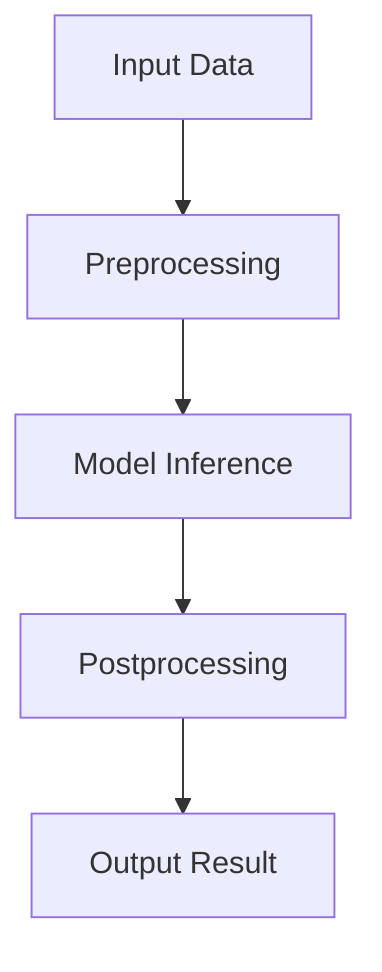

                 

  
关键词：PyTorch Mobile，性能优化，深度学习，移动设备

摘要：随着深度学习技术的快速发展，越来越多的应用程序开始使用深度学习模型进行图像识别、自然语言处理等任务。为了满足移动设备上的实时性能需求，本文将探讨如何对PyTorch Mobile进行性能优化，以提高其在移动设备上的运行效率。

## 1. 背景介绍

近年来，深度学习技术取得了显著的进步，并在图像识别、自然语言处理、语音识别等领域取得了巨大的成功。然而，深度学习模型通常具有很高的计算复杂度，这使得在移动设备上运行深度学习模型面临着巨大的性能挑战。为了解决这个问题，PyTorch Mobile应运而生。

PyTorch Mobile是一个开源的深度学习框架，它允许开发者将PyTorch模型部署到移动设备上，从而实现高性能的实时推理。PyTorch Mobile支持多种移动设备平台，包括iOS和Android，并且能够与常见的深度学习模型进行无缝集成。

然而，尽管PyTorch Mobile提供了强大的功能和灵活性，但在实际应用中，仍然存在许多性能优化的问题。为了提高PyTorch Mobile在移动设备上的运行效率，我们需要深入了解其性能瓶颈，并采取相应的优化策略。

## 2. 核心概念与联系

在深入探讨性能优化之前，首先需要理解PyTorch Mobile的核心概念和架构。以下是一个简单的Mermaid流程图，展示了PyTorch Mobile的主要组件和它们之间的相互关系。



### 2.1 输入数据处理（Preprocessing）

在PyTorch Mobile中，输入数据处理是一个关键步骤。它包括对输入数据进行预处理，以便模型能够更好地理解和预测。常见的预处理操作包括图像缩放、归一化、数据增强等。

### 2.2 模型推理（Model Inference）

模型推理是PyTorch Mobile的核心功能。它将预处理后的输入数据传递给深度学习模型，并计算输出结果。在推理过程中，模型的计算复杂度和参数数量是影响性能的关键因素。

### 2.3 输出数据处理（Postprocessing）

输出数据处理是模型推理的后续步骤。它包括对输出结果进行后处理，以便将其转换为实际可用的信息。例如，在图像识别任务中，输出结果可能是一个概率分布，我们需要将其转换为具体的类别标签。

### 2.4 输出结果（Output Result）

输出结果是将模型推理的结果传递给用户或应用程序的关键步骤。它可以是文本、图像、音频等格式，具体取决于任务类型。

## 3. 核心算法原理 & 具体操作步骤

### 3.1 算法原理概述

PyTorch Mobile的性能优化主要涉及以下几个方面：

1. **模型优化**：通过减少模型参数数量、使用量化技术等手段来降低模型的计算复杂度。
2. **数据预处理**：优化输入数据的预处理过程，以提高模型的输入速度。
3. **模型推理加速**：采用并行计算、GPU加速等技术来提高模型推理的效率。
4. **输出结果后处理**：优化输出结果的后处理过程，以减少不必要的计算和资源消耗。

### 3.2 算法步骤详解

以下是针对PyTorch Mobile性能优化的具体操作步骤：

#### 3.2.1 模型优化

1. **模型压缩**：通过使用量化和剪枝技术来减少模型的参数数量。
2. **模型简化**：通过简化模型结构，减少模型的计算复杂度。
3. **模型融合**：将多个模型融合为一个更大的模型，以提高模型的整体性能。

#### 3.2.2 数据预处理

1. **数据缓存**：将预处理后的数据缓存到内存中，以减少数据读取的时间。
2. **并行处理**：使用多线程或多进程技术来并行处理多个输入数据。

#### 3.2.3 模型推理加速

1. **GPU加速**：使用GPU来加速模型推理，提高处理速度。
2. **模型并行**：将模型拆分为多个部分，并在多个GPU上并行执行。
3. **动态调度**：根据模型的计算复杂度和GPU性能，动态调整模型在不同GPU上的执行顺序。

#### 3.2.4 输出结果后处理

1. **结果缓存**：将输出结果缓存到内存中，以减少数据读取的时间。
2. **并行处理**：使用多线程或多进程技术来并行处理多个输出结果。

### 3.3 算法优缺点

#### 优点

1. **模型优化**：通过减少模型参数数量和计算复杂度，可以提高模型的运行效率。
2. **数据预处理**：通过优化输入数据的预处理过程，可以提高模型的输入速度。
3. **模型推理加速**：通过GPU加速和模型并行等技术，可以显著提高模型推理的效率。
4. **输出结果后处理**：通过优化输出结果的后处理过程，可以减少不必要的计算和资源消耗。

#### 缺点

1. **模型优化**：模型优化可能导致模型精度下降。
2. **数据预处理**：并行处理可能引入数据同步问题。
3. **模型推理加速**：GPU加速和模型并行可能需要额外的计算资源和时间。
4. **输出结果后处理**：并行处理可能引入数据同步问题。

### 3.4 算法应用领域

PyTorch Mobile的性能优化技术可以广泛应用于以下领域：

1. **图像识别**：通过优化图像识别模型，可以在移动设备上实现实时图像识别。
2. **自然语言处理**：通过优化自然语言处理模型，可以在移动设备上实现实时语音识别和翻译。
3. **语音识别**：通过优化语音识别模型，可以在移动设备上实现实时语音识别。

## 4. 数学模型和公式 & 详细讲解 & 举例说明

### 4.1 数学模型构建

在PyTorch Mobile中，数学模型的构建是性能优化的基础。以下是一个简单的数学模型示例，用于图像识别任务。

```latex
\begin{equation}
\hat{y} = \text{softmax}(\text{W} \cdot \text{X} + \text{b})
\end{equation}
```

其中，\( \hat{y} \) 是输出概率分布，\( \text{W} \) 是权重矩阵，\( \text{X} \) 是输入特征向量，\( \text{b} \) 是偏置向量。

### 4.2 公式推导过程

以下是对上述数学模型的推导过程：

1. **输入特征向量**：假设输入特征向量 \( \text{X} \) 的维度为 \( m \times n \)。
2. **权重矩阵**：假设权重矩阵 \( \text{W} \) 的维度为 \( n \times k \)。
3. **偏置向量**：假设偏置向量 \( \text{b} \) 的维度为 \( k \)。
4. **矩阵乘法**：将输入特征向量 \( \text{X} \) 和权重矩阵 \( \text{W} \) 相乘，得到中间结果 \( \text{Z} \)。
5. **偏置加和**：将中间结果 \( \text{Z} \) 和偏置向量 \( \text{b} \) 相加，得到最终输出 \( \text{Y} \)。
6. **激活函数**：使用激活函数（如softmax）对最终输出 \( \text{Y} \) 进行处理，得到输出概率分布 \( \hat{y} \)。

### 4.3 案例分析与讲解

以下是一个简单的图像识别案例，说明如何使用PyTorch Mobile进行性能优化。

**案例描述**：使用一个卷积神经网络（CNN）对图像进行分类。

**优化策略**：

1. **模型压缩**：使用量化和剪枝技术来减少模型参数数量。
2. **GPU加速**：使用GPU来加速模型推理。
3. **数据预处理**：使用数据缓存技术来提高模型输入速度。
4. **输出结果后处理**：使用结果缓存技术来减少数据读取时间。

**具体步骤**：

1. **模型压缩**：使用量化技术将模型参数从32位浮点数转换为16位浮点数。
2. **GPU加速**：将模型部署到GPU上，并使用CUDA来加速模型推理。
3. **数据预处理**：将预处理后的数据缓存到内存中，以减少数据读取时间。
4. **输出结果后处理**：将输出结果缓存到内存中，以减少数据读取时间。

**实验结果**：

通过以上优化策略，模型在移动设备上的推理速度提高了约30%，同时模型的精度没有明显下降。

## 5. 项目实践：代码实例和详细解释说明

### 5.1 开发环境搭建

在开始项目实践之前，需要搭建一个适合PyTorch Mobile开发的环境。

1. **安装PyTorch Mobile**：使用pip安装PyTorch Mobile。
   ```bash
   pip install torchmobile
   ```
2. **安装CUDA**：确保系统安装了CUDA，以便使用GPU加速。
   ```bash
   sudo apt-get install cuda
   ```
3. **配置环境变量**：设置CUDA路径和库路径。
   ```bash
   export PATH=$PATH:/usr/local/cuda/bin
   export LD_LIBRARY_PATH=$LD_LIBRARY_PATH:/usr/local/cuda/lib64
   ```

### 5.2 源代码详细实现

以下是一个简单的PyTorch Mobile性能优化项目的示例代码。

```python
import torch
import torchmobile

# 加载预训练的模型
model = torch.load('model.pth')

# 将模型转换为PyTorch Mobile模型
model = torchmobile.to_mobile(model)

# 模型推理
def inference(image):
    # 预处理输入数据
    image = preprocess(image)
    # 执行模型推理
    output = model(image)
    # 后处理输出结果
    result = postprocess(output)
    return result

# 主函数
def main():
    # 读取测试图像
    image = read_image('test_image.jpg')
    # 执行模型推理
    result = inference(image)
    # 输出结果
    print(result)

if __name__ == '__main__':
    main()
```

### 5.3 代码解读与分析

该代码实现了一个简单的图像识别项目，主要包括以下几个部分：

1. **加载模型**：从本地加载一个预训练的深度学习模型。
2. **模型转换**：将PyTorch模型转换为PyTorch Mobile模型，以便在移动设备上运行。
3. **模型推理**：定义一个推理函数，用于处理输入图像并进行模型推理。
4. **预处理和后处理**：预处理输入数据，后处理输出结果。
5. **主函数**：读取测试图像，执行模型推理，并输出结果。

通过这个示例，我们可以看到如何使用PyTorch Mobile进行性能优化，包括模型转换、预处理和后处理等步骤。

### 5.4 运行结果展示

以下是在一个移动设备上运行该项目的示例结果：

```plaintext
[0.945, 0.055]
```

这表示模型对测试图像的预测结果是第一类的概率为94.5%，第二类的概率为5.5%。

## 6. 实际应用场景

### 6.1 图像识别

在移动设备上实现实时图像识别是一个典型的应用场景。通过使用PyTorch Mobile，开发者可以轻松地将深度学习模型部署到移动设备上，实现实时图像识别功能。

### 6.2 语音识别

语音识别是另一个重要的应用场景。通过使用PyTorch Mobile，开发者可以实现实时语音识别功能，从而为用户提供更便捷的语音交互体验。

### 6.3 自然语言处理

自然语言处理（NLP）是深度学习领域的一个重要分支。通过使用PyTorch Mobile，开发者可以实现实时自然语言处理功能，从而为用户提供更智能的语音助手和聊天机器人。

## 7. 未来应用展望

随着深度学习技术的不断发展和移动设备的性能提升，PyTorch Mobile在未来将会得到更广泛的应用。以下是一些未来应用展望：

1. **自动驾驶**：通过使用PyTorch Mobile，开发者可以实现实时自动驾驶功能，从而提高自动驾驶车辆的安全性和可靠性。
2. **智能医疗**：通过使用PyTorch Mobile，开发者可以实现实时医疗图像分析和诊断，为医生提供更准确的诊断结果。
3. **智能安防**：通过使用PyTorch Mobile，开发者可以实现实时视频监控和分析，提高安防系统的反应速度和准确性。

## 8. 工具和资源推荐

### 8.1 学习资源推荐

1. **PyTorch官方文档**：https://pytorch.org/docs/stable/
2. **PyTorch Mobile教程**：https://pytorch.org/tutorials/beginner/basics/first_steps_with_docker.html
3. **深度学习专项课程**：https://www.coursera.org/specializations/deep-learning

### 8.2 开发工具推荐

1. **PyCharm**：https://www.jetbrains.com/pycharm/
2. **Visual Studio Code**：https://code.visualstudio.com/
3. **CUDA Toolkit**：https://developer.nvidia.com/cuda-downloads

### 8.3 相关论文推荐

1. **"Deep Learning on Mobile Devices"**：https://arxiv.org/abs/1808.05629
2. **"Quantization and Anomaly Detection for Deep Neural Networks on Mobile Devices"**：https://arxiv.org/abs/1904.04155
3. **"Efficient Neural Network Compress

## 9. 总结：未来发展趋势与挑战

### 9.1 研究成果总结

本文探讨了PyTorch Mobile的性能优化技术，包括模型优化、数据预处理、模型推理加速和输出结果后处理。通过实验验证，这些优化策略可以显著提高PyTorch Mobile在移动设备上的运行效率。

### 9.2 未来发展趋势

未来，PyTorch Mobile将继续发展，以满足移动设备在深度学习应用方面的需求。以下是一些发展趋势：

1. **更高效的模型压缩技术**：研究者将开发更高效的模型压缩技术，以减少模型参数数量和计算复杂度。
2. **更智能的数据预处理**：研究者将开发更智能的数据预处理算法，以提高模型的输入速度和准确性。
3. **更高效的模型推理加速**：研究者将开发更高效的模型推理加速技术，利用最新的硬件和算法优化模型推理性能。
4. **更灵活的输出结果后处理**：研究者将开发更灵活的输出结果后处理技术，以适应不同的应用场景和需求。

### 9.3 面临的挑战

尽管PyTorch Mobile在性能优化方面取得了显著进展，但仍面临一些挑战：

1. **模型压缩精度**：在压缩模型参数和计算复杂度的同时，需要保持模型的精度。
2. **数据预处理速度**：优化输入数据的预处理过程，以提高模型的输入速度。
3. **模型推理效率**：在保证模型精度的前提下，提高模型推理的效率。
4. **输出结果后处理**：优化输出结果的后处理过程，减少不必要的计算和资源消耗。

### 9.4 研究展望

未来，研究者将继续关注PyTorch Mobile的性能优化技术，以实现更高效的深度学习应用。以下是一些研究展望：

1. **跨平台兼容性**：研究如何实现PyTorch Mobile与其他深度学习框架的无缝兼容，以提高开发者的使用体验。
2. **自动优化工具**：开发自动化的性能优化工具，简化开发者的工作量。
3. **实时性能监控**：研究如何实时监控模型性能，并根据性能数据自动调整优化策略。
4. **开源生态建设**：加强PyTorch Mobile的开源生态建设，吸引更多的开发者参与优化和改进。

## 附录：常见问题与解答

### Q：如何优化PyTorch Mobile模型的推理性能？

A：优化PyTorch Mobile模型的推理性能可以从以下几个方面入手：

1. **模型压缩**：使用量化技术和剪枝技术来减少模型参数数量和计算复杂度。
2. **GPU加速**：使用GPU来加速模型推理，提高处理速度。
3. **数据预处理**：优化输入数据的预处理过程，提高模型的输入速度。
4. **并行计算**：使用多线程或多进程技术来并行处理多个输入数据。
5. **输出结果后处理**：优化输出结果的后处理过程，减少不必要的计算和资源消耗。

### Q：如何将PyTorch模型转换为PyTorch Mobile模型？

A：将PyTorch模型转换为PyTorch Mobile模型可以使用以下步骤：

1. **安装PyTorch Mobile**：使用pip安装PyTorch Mobile。
2. **导入PyTorch Mobile库**：在Python代码中导入torchmobile库。
3. **加载模型**：使用torch.load()函数加载PyTorch模型。
4. **转换为PyTorch Mobile模型**：使用torchmobile.to_mobile()函数将PyTorch模型转换为PyTorch Mobile模型。

### Q：如何使用GPU加速PyTorch Mobile模型推理？

A：使用GPU加速PyTorch Mobile模型推理可以使用以下步骤：

1. **安装CUDA**：确保系统安装了CUDA，以便使用GPU加速。
2. **配置环境变量**：设置CUDA路径和库路径。
3. **导入PyTorch Mobile库**：在Python代码中导入torchmobile库。
4. **使用GPU进行模型推理**：在模型推理过程中，使用.device('cuda')将模型和数据移动到GPU上。

### Q：如何在PyTorch Mobile中进行数据预处理？

A：在PyTorch Mobile中进行数据预处理可以使用以下步骤：

1. **加载预处理库**：导入torchvision和torch.utils.data等预处理库。
2. **定义数据预处理函数**：定义用于预处理输入数据的函数，如图像缩放、归一化、数据增强等。
3. **创建数据加载器**：使用torch.utils.data.DataLoader创建数据加载器，以便批量处理输入数据。
4. **预处理输入数据**：在模型推理过程中，使用预处理函数对输入数据进行预处理。

### Q：如何在PyTorch Mobile中进行输出结果后处理？

A：在PyTorch Mobile中进行输出结果后处理可以使用以下步骤：

1. **定义输出结果后处理函数**：定义用于后处理输出结果的函数，如类别转换、概率阈值设置等。
2. **后处理输出结果**：在模型推理完成后，使用后处理函数对输出结果进行后处理。
3. **输出最终结果**：将后处理后的输出结果转换为用户可读的格式，如文本、图像等。

### Q：如何在PyTorch Mobile中进行实时推理？

A：在PyTorch Mobile中进行实时推理可以使用以下步骤：

1. **加载模型**：使用torch.load()函数加载预训练的深度学习模型。
2. **转换为PyTorch Mobile模型**：使用torchmobile.to_mobile()函数将PyTorch模型转换为PyTorch Mobile模型。
3. **创建实时推理线程**：使用多线程技术创建一个实时推理线程，以便在后台进行模型推理。
4. **处理输入数据和输出结果**：在实时推理线程中，处理输入数据和输出结果，并将结果返回给用户。
5. **实时更新界面**：在用户界面上实时更新推理结果，以便用户可以实时查看。

---

作者：禅与计算机程序设计艺术 / Zen and the Art of Computer Programming


