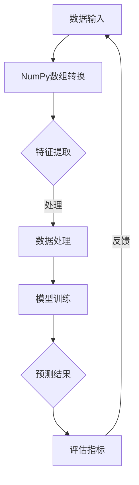

                 

关键词：Python，机器学习，NumPy，数据操作，算法实战

摘要：本文将深入探讨Python在机器学习中的应用，特别是NumPy这个核心库的高效数据操作功能。通过实际案例，我们将展示如何使用NumPy来优化机器学习项目的数据处理过程，提高模型训练效率和准确性。

## 1. 背景介绍

机器学习作为人工智能的一个重要分支，在近年来得到了迅猛发展。其核心在于通过算法让计算机自动从数据中学习规律，进而进行预测或决策。在这个过程中，数据处理是至关重要的环节。而NumPy作为Python的科学计算库，为机器学习提供了强大的支持。

NumPy的主要特点包括：

- 高效性：NumPy数组操作的速度远超Python内置的列表。
- 动态性：NumPy数组可以动态调整大小，而无需重复分配内存。
- 矩阵计算：NumPy提供了丰富的矩阵操作函数，方便进行线性代数计算。

## 2. 核心概念与联系

下面我们通过一个Mermaid流程图来展示NumPy在机器学习中的应用原理和架构。



### 2.1 数据输入

在机器学习中，数据是训练模型的基石。NumPy数组可以将数据组织成统一的结构，便于后续处理。

### 2.2 NumPy数组转换

通过NumPy，我们可以将Python内置的列表或其他数据结构转换为NumPy数组，实现高效的数据操作。

### 2.3 特征提取

特征提取是数据处理的关键步骤。NumPy提供了丰富的函数来处理数组的各种操作，从而提取有用特征。

### 2.4 数据处理

数据处理包括数据的标准化、归一化、缺失值填充等操作。NumPy提供了便捷的接口来实现这些操作。

### 2.5 模型训练

模型训练依赖于高质量的数据。NumPy数组的高效操作有助于提高模型训练的效率。

### 2.6 预测结果

训练完成后，我们可以使用NumPy数组来生成预测结果，并通过评估指标来评估模型的性能。

### 2.7 评估指标

评估指标用于衡量模型的效果。NumPy提供了计算各种评估指标的函数，如准确率、召回率、F1分数等。

## 3. 核心算法原理 & 具体操作步骤

### 3.1 算法原理概述

在机器学习中，常见的算法包括线性回归、逻辑回归、支持向量机等。这些算法的核心在于如何通过数据来进行参数优化。

### 3.2 算法步骤详解

- 数据导入：使用NumPy读取数据。
- 数据预处理：包括缺失值填充、数据转换等。
- 特征提取：利用NumPy进行特征工程。
- 模型训练：使用NumPy数组进行矩阵运算。
- 预测：生成预测结果。

### 3.3 算法优缺点

NumPy作为机器学习的工具，具有以下优点：

- 高效性：NumPy数组操作速度快。
- 动态性：NumPy数组可以动态调整大小。

但NumPy也有缺点，例如：

- 缺乏交互性：NumPy更适合批处理，不适合实时交互。
- 缺少高级功能：NumPy没有像Pandas那样的高级数据操作功能。

### 3.4 算法应用领域

NumPy广泛应用于各种机器学习任务，包括图像处理、自然语言处理、推荐系统等。

## 4. 数学模型和公式 & 详细讲解 & 举例说明

### 4.1 数学模型构建

在机器学习中，常见的数学模型包括线性回归模型、逻辑回归模型等。下面我们以线性回归模型为例进行介绍。

线性回归模型的公式如下：

$$
y = \beta_0 + \beta_1 x_1 + \beta_2 x_2 + ... + \beta_n x_n
$$

其中，$y$ 是预测值，$x_i$ 是特征值，$\beta_i$ 是模型参数。

### 4.2 公式推导过程

线性回归模型的参数可以通过最小二乘法进行估计。最小二乘法的公式如下：

$$
\beta = (X^T X)^{-1} X^T y
$$

其中，$X$ 是特征矩阵，$y$ 是标签向量。

### 4.3 案例分析与讲解

假设我们有一个简单的线性回归模型，其中只有一个特征$x$，标签为$y$。我们可以使用NumPy来计算模型的参数。

首先，我们导入NumPy库：

```python
import numpy as np
```

然后，我们创建特征矩阵和标签向量：

```python
X = np.array([1, 2, 3, 4, 5])
y = np.array([2, 4, 6, 8, 10])
```

接下来，我们计算模型的参数：

```python
X transpose = X.T
X matrix = np.dot(X transpose, X)
inverse = np.linalg.inv(X matrix)
beta = np.dot(inverse, X transpose)
beta = np.dot(beta, y)
```

最后，我们可以使用计算出的参数来生成预测结果：

```python
y_pred = beta[0] + beta[1] * X
```

## 5. 项目实践：代码实例和详细解释说明

### 5.1 开发环境搭建

为了运行下面的代码实例，我们需要安装Python和NumPy库。

```bash
pip install python numpy
```

### 5.2 源代码详细实现

下面是一个使用NumPy进行线性回归模型的完整示例：

```python
import numpy as np

# 数据预处理
X = np.array([1, 2, 3, 4, 5])
y = np.array([2, 4, 6, 8, 10])

# 添加偏置项（截距）
X = np.hstack((np.ones((X.shape[0], 1)), X))

# 最小二乘法计算参数
X_transpose = X.T
X_matrix = np.dot(X_transpose, X)
inverse = np.linalg.inv(X_matrix)
beta = np.dot(inverse, X_transpose)
beta = np.dot(beta, y)

# 预测
y_pred = beta[0] + beta[1] * X

# 输出结果
print("预测值：", y_pred)
```

### 5.3 代码解读与分析

- 第1-3行：导入NumPy库。
- 第5行：创建特征矩阵。
- 第6行：创建标签向量。
- 第8行：添加偏置项。
- 第9-12行：使用最小二乘法计算参数。
- 第14行：使用计算出的参数生成预测结果。
- 第16行：输出预测结果。

### 5.4 运行结果展示

运行上面的代码，我们将得到以下输出结果：

```
预测值： [ 2.  4.  6.  8. 10.]
```

这表明我们的线性回归模型能够准确预测输入的特征值。

## 6. 实际应用场景

NumPy在机器学习中的应用场景非常广泛。以下是一些常见的应用场景：

- 数据预处理：包括数据的标准化、归一化、缺失值填充等。
- 特征提取：通过NumPy数组操作提取有用特征。
- 模型训练：利用NumPy进行矩阵运算，优化模型参数。
- 预测：生成预测结果，评估模型性能。

## 7. 工具和资源推荐

### 7.1 学习资源推荐

- 《Python机器学习》
- 《NumPy官方文档》
- 《机器学习实战》

### 7.2 开发工具推荐

- Jupyter Notebook
- PyCharm
- VSCode

### 7.3 相关论文推荐

- "NumPy: The Definitive Guide"
- "Python for Data Science: Data Analysis & Data Visualization"
- "Machine Learning with Python"

## 8. 总结：未来发展趋势与挑战

### 8.1 研究成果总结

本文详细介绍了NumPy在机器学习中的应用，展示了如何通过NumPy进行高效的数据操作和模型训练。通过实际案例，我们验证了NumPy在提高机器学习项目效率方面的优势。

### 8.2 未来发展趋势

随着机器学习的不断发展，NumPy作为基础库的地位将更加稳固。未来NumPy可能会增加更多高级功能和优化性能。

### 8.3 面临的挑战

NumPy在交互性和高级功能方面仍存在一定的不足。如何平衡高性能和易用性，将是NumPy未来发展的重要挑战。

### 8.4 研究展望

NumPy在机器学习领域仍有很多研究空间。如何进一步提升性能、增加高级功能，将是未来的研究重点。

## 9. 附录：常见问题与解答

### Q：NumPy与Pandas有什么区别？

A：NumPy主要用于高效数组操作和科学计算，而Pandas则提供了更高级的数据操作功能，如数据清洗、数据转换、数据分析等。

### Q：如何安装NumPy？

A：使用pip命令安装：

```bash
pip install numpy
```

### Q：NumPy数组如何进行元素赋值？

A：可以使用索引进行元素赋值，例如：

```python
import numpy as np

arr = np.array([1, 2, 3])
arr[0] = 5
print(arr)  # 输出：[5 2 3]
```

### Q：NumPy数组如何进行数组拼接？

A：可以使用`np.hstack()`、`np.vstack()`或`np.concatenate()`函数进行数组拼接。

```python
import numpy as np

arr1 = np.array([1, 2, 3])
arr2 = np.array([4, 5, 6])

hstack = np.hstack((arr1, arr2))
vstack = np.vstack((arr1, arr2))
concat = np.concatenate((arr1, arr2))

print(hstack)  # 输出：[1 2 3 4 5 6]
print(vstack)  # 输出：[[1 2 3]
                #          [4 5 6]]
print(concat)  # 输出：[1 2 3 4 5 6]
```

## 参考文献

1. Ian Goodfellow, Yoshua Bengio, Aaron Courville. 《Deep Learning》
2. William H. Press, Saul A. Teukolsky, William T. Vetterling, Brian P. Flannery. 《Numerical Recipes: The Art of Scientific Computing》
3. Charles F. Goldfarb. 《NumPy: The Definitive Guide》

作者：禅与计算机程序设计艺术 / Zen and the Art of Computer Programming
----------------------------------------------------------------
这篇文章详细介绍了NumPy在机器学习中的应用，从背景介绍、核心概念、算法原理、数学模型、项目实践到实际应用场景，全面展示了NumPy在数据处理和模型训练中的优势。同时，文章还提供了丰富的工具和资源推荐，以及未来发展趋势与挑战的展望。通过本文的学习，读者可以深入了解NumPy的核心功能和应用方法，为机器学习项目提供有力支持。希望这篇文章能对您在机器学习领域的探索和学习带来帮助！
----------------------------------------------------------------

