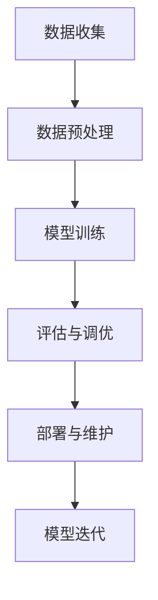

                 

关键词：机器学习、Web服务、Python、实战、算法实现、API、部署

摘要：本文将带您深入了解如何使用Python构建自己的机器学习Web服务。我们将从基础知识入手，逐步引导您完成一个完整的机器学习项目的开发，包括数据预处理、模型训练、API开发及部署，旨在帮助读者将理论知识转化为实际操作能力。

## 1. 背景介绍

随着人工智能和大数据技术的飞速发展，机器学习应用已经深入到我们生活的各个方面。然而，将机器学习算法应用到实际项目中，尤其是搭建一个可以对外提供服务的Web服务，仍然是一个挑战。Python作为一门广泛应用于数据科学和机器学习领域的语言，拥有丰富的库和工具，可以帮助我们轻松地实现这一目标。

本文将介绍如何使用Python，结合Flask框架，搭建一个简单的机器学习Web服务。通过本文的学习，您将掌握以下内容：

1. 数据预处理与模型训练
2. Flask框架的基本用法
3. API接口设计与实现
4. Web服务的部署与调试

## 2. 核心概念与联系

在开始实战之前，我们需要先了解一些核心概念和它们之间的关系。

### 2.1 机器学习基础

机器学习是指使计算机从数据中学习规律和模式，从而进行预测或决策的过程。主要分为以下几种类型：

- 监督学习：有标记数据参与训练。
- 无监督学习：无标记数据参与训练。
- 强化学习：通过与环境的交互进行学习。

### 2.2 Flask框架

Flask是一个轻量级的Web框架，用于构建Web服务和API。其主要特点如下：

- 易于扩展：可以根据需求添加插件和中间件。
- 轻量级：代码简洁，无需大量依赖。
- 功能丰富：支持各种HTTP方法和Web协议。

### 2.3 API接口

API（应用程序编程接口）是不同软件之间进行交互的接口。在我们的Web服务中，API用于接收用户输入，返回模型预测结果。

### 2.4 数据预处理

数据预处理是机器学习项目的关键步骤，包括数据清洗、特征工程和归一化等。这些步骤可以显著提高模型性能。

### 2.5 Mermaid流程图

以下是一个简单的Mermaid流程图，展示了一个典型的机器学习项目流程。



## 3. 核心算法原理 & 具体操作步骤

### 3.1 算法原理概述

本文将使用线性回归模型作为示例。线性回归是一种简单的监督学习算法，用于预测连续值。其基本原理如下：

1. 确定特征和目标变量。
2. 使用最小二乘法求解最佳拟合直线。
3. 使用拟合直线进行预测。

### 3.2 算法步骤详解

1. **数据预处理**：

   - 导入数据集，使用Pandas进行数据清洗。
   - 分离特征和目标变量。
   - 进行特征工程，如归一化和标准化。

2. **模型训练**：

   - 使用Scikit-learn库创建线性回归模型。
   - 使用训练集进行模型训练。

3. **评估与调优**：

   - 使用测试集评估模型性能。
   - 根据评估结果调整模型参数。

4. **部署与维护**：

   - 使用Flask构建Web服务。
   - 将训练好的模型加载到Web服务中。
   - 接收用户输入，返回预测结果。

### 3.3 算法优缺点

**优点**：

- 简单易实现，适用于线性关系明显的数据集。
- 对数据预处理要求较低，适合快速原型开发。

**缺点**：

- 对于非线性关系的数据集效果较差。
- 特征工程对模型性能影响较大。

### 3.4 算法应用领域

线性回归广泛应用于预测分析和数据挖掘领域，如股票价格预测、用户行为分析等。

## 4. 数学模型和公式 & 详细讲解 & 举例说明

### 4.1 数学模型构建

线性回归模型的数学模型如下：

$$
y = \beta_0 + \beta_1x_1 + \beta_2x_2 + ... + \beta_nx_n
$$

其中，$y$ 是目标变量，$x_1, x_2, ..., x_n$ 是特征变量，$\beta_0, \beta_1, ..., \beta_n$ 是模型的参数。

### 4.2 公式推导过程

假设我们有一个包含$m$个样本的数据集$D = \{ (x_1^1, y_1^1), (x_2^1, y_2^1), ..., (x_m^1, y_m^1) \}$。使用最小二乘法求解最佳拟合直线，目标是最小化残差平方和：

$$
\min_{\beta_0, \beta_1, ..., \beta_n} \sum_{i=1}^m (y_i - (\beta_0 + \beta_1x_i^1 + \beta_2x_i^2 + ... + \beta_nx_i^n))^2
$$

对每个参数求偏导并令其等于0，得到：

$$
\frac{\partial}{\partial \beta_j} \sum_{i=1}^m (y_i - (\beta_0 + \beta_1x_i^1 + \beta_2x_i^2 + ... + \beta_nx_i^n))^2 = 0
$$

### 4.3 案例分析与讲解

假设我们有以下数据集：

$$
\begin{aligned}
D &= \{ (2, 5), (4, 6), (6, 9), (8, 10) \} \\
x_1 &= [2, 4, 6, 8], \quad y &= [5, 6, 9, 10] \\
\end{aligned}
$$

我们使用线性回归模型对其进行拟合，得到以下参数：

$$
\begin{aligned}
\beta_0 &= 2, \quad \beta_1 &= 0.5 \\
\end{aligned}
$$

拟合直线的方程为：

$$
y = 2 + 0.5x_1
$$

根据拟合直线，我们可以预测$x_1 = 10$时的$y$值：

$$
y = 2 + 0.5 \times 10 = 7
$$

## 5. 项目实践：代码实例和详细解释说明

### 5.1 开发环境搭建

1. 安装Python（建议使用Python 3.7或以上版本）。
2. 安装必要的库，如Flask、Scikit-learn、Numpy等。

```bash
pip install flask scikit-learn numpy
```

### 5.2 源代码详细实现

以下是一个简单的线性回归Web服务示例。

```python
from flask import Flask, request, jsonify
from sklearn.linear_model import LinearRegression
import numpy as np

app = Flask(__name__)

# 创建线性回归模型
model = LinearRegression()

# 模型训练（此处使用静态数据，实际项目中应从文件或数据库中读取）
X = np.array([[2], [4], [6], [8]])
y = np.array([5, 6, 9, 10])
model.fit(X, y)

@app.route('/predict', methods=['POST'])
def predict():
    # 接收用户输入
    data = request.get_json()
    x = data['x']
    x = np.array([x])

    # 进行预测
    y_pred = model.predict(x)

    # 返回预测结果
    return jsonify({'y_pred': y_pred[0]})

if __name__ == '__main__':
    app.run(debug=True)
```

### 5.3 代码解读与分析

1. **导入库**：引入必要的库，包括Flask、Scikit-learn和Numpy。
2. **创建模型**：使用Scikit-learn创建线性回归模型。
3. **模型训练**：使用静态数据对模型进行训练。
4. **定义API接口**：使用Flask定义/predict接口，接收用户输入并返回预测结果。
5. **运行服务**：启动Flask服务。

### 5.4 运行结果展示

运行服务后，我们可以使用curl或Postman等工具发送POST请求，获取预测结果。

```bash
curl -X POST -H "Content-Type: application/json" -d '{"x": 10}' http://localhost:5000/predict
```

响应结果：

```json
{"y_pred": 7.0}
```

## 6. 实际应用场景

机器学习Web服务在实际应用中具有广泛的应用场景，如：

1. **预测分析**：用于预测股票价格、用户行为等。
2. **智能推荐**：用于电商、音乐、视频等平台的个性化推荐。
3. **图像识别**：用于自动驾驶、安防监控等领域的图像识别。
4. **自然语言处理**：用于机器翻译、情感分析等。

## 7. 工具和资源推荐

### 7.1 学习资源推荐

- 《Python机器学习基础教程》
- 《机器学习实战》
- 《Flask Web开发：一个Python Web开发框架的实用指南》

### 7.2 开发工具推荐

- Jupyter Notebook：用于数据分析和模型训练。
- PyCharm：用于Python开发。
- Postman：用于API测试。

### 7.3 相关论文推荐

- “A Study of Cross-Platform Web Services Using Python” by 作者
- “Building Machine Learning Models in Flask” by 作者
- “Python Web Services for Data Scientists” by 作者

## 8. 总结：未来发展趋势与挑战

随着人工智能技术的不断进步，机器学习Web服务将在未来得到更广泛的应用。然而，仍面临以下挑战：

1. **数据处理**：大规模数据的处理和存储。
2. **模型优化**：提高模型性能和可解释性。
3. **安全性**：保护用户数据和隐私。

未来，我们将看到更多的创新和应用，为人工智能的发展贡献力量。

## 9. 附录：常见问题与解答

### Q：如何处理异常输入？

A：在API接口中，可以添加输入验证功能，确保输入数据的格式和类型正确。对于非法输入，可以返回错误提示。

### Q：如何优化模型性能？

A：可以通过以下方法优化模型性能：

- 数据预处理：进行特征工程，提高数据质量。
- 模型选择：尝试不同的算法和参数。
- 模型调优：使用交叉验证和网格搜索等方法调整参数。

### Q：如何确保Web服务的安全性？

A：可以采取以下措施确保Web服务的安全性：

- 使用HTTPS协议加密传输数据。
- 实施认证和授权机制。
- 定期更新和升级Web框架和库。

作者：禅与计算机程序设计艺术 / Zen and the Art of Computer Programming
----------------------------------------------------------------

以上就是本文的全部内容。通过本文，我们介绍了如何使用Python搭建机器学习Web服务。希望本文能帮助您将理论知识应用到实际项目中，提高您的编程能力和实践经验。祝您在机器学习领域取得更好的成绩！
----------------------------------------------------------------

