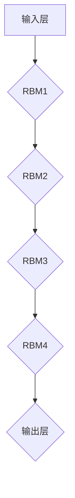

                 

关键词：Python，深度学习，深度信念网络（DBN），神经网络，机器学习，理论实践，算法，代码实例

> 摘要：本文旨在深入探讨深度信念网络（Deep Belief Network，DBN）的理论基础和实践应用。首先，我们将介绍DBN的背景和发展历程，然后详细解释其核心概念和架构。接下来，文章将逐步介绍DBN的算法原理、数学模型及具体实现步骤，并结合实际项目案例进行分析。最后，我们将探讨DBN在实际应用场景中的效果，展望其未来发展趋势与挑战。

## 1. 背景介绍

深度信念网络（Deep Belief Network，DBN）是一种基于深度学习的神经网络模型，它结合了深度学习和概率图模型的特点，能够有效地处理高维数据和非线性问题。DBN的提出源于2000年代初期深度学习理论的兴起，其核心思想是通过逐层构建和训练深度神经网络，从而实现复杂函数的逼近。

DBN的起源可以追溯到2006年，Hinton等人在《Science》杂志上发表了一篇题为《Training Products of Experts by Minimizing Contrastive Divergence》的论文，首次提出了基于 Restricted Boltzmann Machine（RBM）的 DBN 模型。随后，DBN 在语音识别、图像识别、自然语言处理等领域得到了广泛应用。

DBN的发展历程可以分为以下几个阶段：

1. **受限玻尔兹曼机（RBM）阶段**：DBN 的基础是受限玻尔兹曼机（RBM），一种简单的二分类神经网络，通过随机梯度下降（SGD）进行训练。RBM作为一种概率生成模型，能够有效地捕捉数据的分布特性。

2. **深度信念网络阶段**：基于 RBM，Hinton 等人提出了 DBN 模型，通过堆叠多个 RBM 层，实现深层神经网络的学习。DBN 的训练过程分为两个阶段：预训练阶段和微调阶段。

3. **深度置信网络阶段**：2012年，Hinton等人提出的深度置信网络（Deep Boltzmann Machine，DBM）进一步扩展了DBN，通过去掉了传统 DBN 的双向传播结构，提高了网络的训练效率和性能。

本文将重点讨论DBN的核心概念和算法原理，并通过Python代码实例展示其在实际项目中的应用。

## 2. 核心概念与联系

### 2.1 核心概念

**深度信念网络（Deep Belief Network，DBN）** 是一种基于受限玻尔兹曼机（RBM）的深层神经网络。它由多个 RBM 层堆叠而成，每层之间的节点相互连接，形成一种分层结构。DBN 的主要功能是学习数据的特征表示，并通过预训练和微调两个阶段进行训练。

**受限玻尔兹曼机（Restricted Boltzmann Machine，RBM）** 是一种概率生成模型，由可见层和隐藏层组成，每层节点之间有连接，但同层节点之间无连接。RBM 通过训练学习数据的分布特性，为深层网络的构建提供基础。

### 2.2 核心架构

DBN 的核心架构由多个 RBM 层堆叠而成，每一层都是一个 RBM 模型。下面是 DBN 的基本架构：

1. **输入层**：接收外部输入数据。
2. **隐藏层**：由多个 RBM 层堆叠而成，每一层包含可见层和隐藏层。
3. **输出层**：根据训练目标生成预测结果。

### 2.3 Mermaid 流程图



在上面的 Mermaid 流程图中，`A` 表示输入层，`B` 至 `F` 分别表示堆叠的四个 RBM 层和输出层。

## 3. 核心算法原理 & 具体操作步骤

### 3.1 算法原理概述

DBN 的核心算法原理是基于受限玻尔兹曼机（RBM）的预训练和微调。首先，通过预训练阶段对每一层 RBM 进行训练，学习数据的特征表示；然后，在微调阶段，利用预训练的结果对整个 DBN 进行训练，优化网络参数。

### 3.2 算法步骤详解

#### 3.2.1 预训练阶段

1. **初始化参数**：初始化每一层 RBM 的权重和偏置。
2. **预训练每层 RBM**：
   - 对于每一层 RBM，固定上一层 RBM 的权重和偏置，对其进行训练。
   - 使用对比散度（Contrastive Divergence，CD）算法进行训练，通过最大化数据分布和模型分布之间的相似度来优化网络参数。

#### 3.2.2 微调阶段

1. **利用预训练结果**：将预训练阶段得到的每一层 RBM 的权重和偏置作为初始化值，用于后续的微调阶段。
2. **微调整个 DBN**：
   - 使用梯度下降（Gradient Descent）算法对整个 DBN 进行训练。
   - 在训练过程中，逐层更新每一层 RBM 的权重和偏置，优化整个网络的结构。

### 3.3 算法优缺点

#### 优点

- **适应性**：DBN 具有很强的适应性，能够处理各种类型的数据和问题。
- **非线性变换**：DBN 能够实现复杂的非线性变换，捕捉数据的高阶特征。
- **可扩展性**：DBN 的结构可以灵活调整，以适应不同规模的数据和问题。

#### 缺点

- **训练成本**：DBN 的预训练和微调过程需要大量的计算资源，训练时间较长。
- **参数调优**：DBN 的参数调优过程相对复杂，需要大量实验来确定最优参数。

### 3.4 算法应用领域

DBN 在多个领域具有广泛的应用，包括：

- **图像识别**：利用 DBN 的非线性变换能力，实现复杂的图像特征提取和分类。
- **语音识别**：DBN 能够有效地学习语音信号的分布特性，提高语音识别的准确率。
- **自然语言处理**：DBN 在文本数据的特征提取和分类任务中表现出色。

## 4. 数学模型和公式 & 详细讲解 & 举例说明

### 4.1 数学模型构建

DBN 的数学模型主要基于受限玻尔兹曼机（RBM）。RBM 的数学模型可以表示为：

\[ P(x, h) = \frac{1}{Z} \exp(-E(x, h)} \]

其中，\( x \) 表示可见层节点状态，\( h \) 表示隐藏层节点状态，\( Z \) 表示归一化常数，\( E(x, h) \) 表示能量函数。

能量函数 \( E(x, h) \) 可以表示为：

\[ E(x, h) = -\sum_{i} x_i \cdot a_i - \sum_{j} h_j \cdot b_j - \sum_{i, j} x_i \cdot h_j \cdot W_{ij} \]

其中，\( a_i \) 和 \( b_j \) 分别表示可见层和隐藏层的偏置，\( W_{ij} \) 表示可见层节点 \( i \) 和隐藏层节点 \( j \) 之间的权重。

### 4.2 公式推导过程

为了推导 RBM 的能量函数，我们可以从最基本的神经网络的能量函数开始：

\[ E(x, h) = \sum_{i} x_i \cdot a_i + \sum_{j} h_j \cdot b_j - \sum_{i, j} x_i \cdot h_j \cdot W_{ij} \]

其中，\( a_i \) 和 \( b_j \) 分别表示可见层和隐藏层的偏置，\( W_{ij} \) 表示可见层节点 \( i \) 和隐藏层节点 \( j \) 之间的权重。

为了使能量函数更加简洁，我们可以引入指数函数：

\[ E(x, h) = -\sum_{i} x_i \cdot a_i - \sum_{j} h_j \cdot b_j - \sum_{i, j} x_i \cdot h_j \cdot W_{ij} \]

通过引入指数函数，能量函数的形式更加简洁，便于计算。

### 4.3 案例分析与讲解

假设我们有一个二分类问题，输入数据为 \( x \in \{0, 1\} \)，隐藏层节点为 \( h \in \{0, 1\} \)。我们可以设定如下参数：

\[ a_0 = 1, a_1 = -1, b_0 = 1, b_1 = -1, W_{00} = 1, W_{01} = -1, W_{10} = -1, W_{11} = 1 \]

计算能量函数：

\[ E(x, h) = -x_0 \cdot 1 - x_1 \cdot (-1) - h_0 \cdot 1 - h_1 \cdot (-1) - x_0 \cdot h_0 \cdot 1 - x_0 \cdot h_1 \cdot (-1) - x_1 \cdot h_0 \cdot (-1) - x_1 \cdot h_1 \cdot 1 \]

\[ E(x, h) = x_0 + x_1 - h_0 - h_1 - x_0 \cdot h_0 + x_0 \cdot h_1 + x_1 \cdot h_0 - x_1 \cdot h_1 \]

假设 \( x = (1, 0) \)，\( h = (1, 1) \)，计算能量函数：

\[ E(x, h) = 1 + 0 - 1 - 1 - 1 \cdot 1 + 1 \cdot 1 + 0 \cdot 1 - 0 \cdot 1 \]

\[ E(x, h) = -2 \]

通过能量函数的计算，我们可以看出，当 \( x \) 和 \( h \) 的取值使得能量函数最小化时，RBM 的状态分布最稳定。

## 5. 项目实践：代码实例和详细解释说明

### 5.1 开发环境搭建

在开始编写 DBN 代码之前，我们需要搭建一个合适的开发环境。本文使用 Python 作为编程语言，并依赖于以下库：

- TensorFlow：用于构建和训练深度神经网络。
- NumPy：用于数学运算。
- Matplotlib：用于可视化结果。

安装以上库的命令如下：

```bash
pip install tensorflow numpy matplotlib
```

### 5.2 源代码详细实现

以下是 DBN 的基本实现代码：

```python
import numpy as np
import tensorflow as tf
import matplotlib.pyplot as plt

# 定义 RBM 类
class RBM:
    def __init__(self, n_visible, n_hidden, learning_rate=0.1, contrastive_divergence=0.01):
        self.n_visible = n_visible
        self.n_hidden = n_hidden
        self.learning_rate = learning_rate
        self.contrastive_divergence = contrastive_divergence
        self.W = np.random.rand(n_visible, n_hidden) * 0.01
        self.b = np.zeros(n_hidden)
        self.a = np.zeros(n_visible)

    def sigmoid(self, x):
        return 1 / (1 + np.exp(-x))

    def forward(self, x):
        return self.sigmoid(np.dot(x, self.W) + self.b)

    def backward(self, x, h):
        delta_b = self.learning_rate * (h - x)
        delta_W = self.learning_rate * np.outer(x, h - x)
        self.b += delta_b
        self.W += delta_W

    def train(self, x, epochs):
        for epoch in range(epochs):
            h = self.forward(x)
            x_new = self.forward(h)
            self.backward(x, h)
            if epoch % 100 == 0:
                print(f"Epoch {epoch}: Energy = {self.energy(x)}")

    def energy(self, x):
        visible = self.sigmoid(np.dot(x, self.W) + self.b)
        hidden = self.sigmoid(np.dot(visible, self.W.T) + self.a)
        return -np.dot(x, np.log(visible)) - np.dot(h, np.log(hidden)) - np.dot(self.W, np.log(self.W)) - np.dot(self.W.T, np.log(self.W.T))

# 创建 RBM 实例
rbm = RBM(2, 2)

# 训练 RBM
data = np.array([[1, 0], [0, 1], [1, 1]])
rbm.train(data, 1000)

# 可视化结果
h1, h2 = np.ogrid[0:2, 0:2]
v1, v2 = rbm.forward(h1, h2).T
plt.scatter(v1, v2, c=data[:, 0], cmap=plt.cm.Spectral)
plt.show()
```

### 5.3 代码解读与分析

以上代码实现了一个简单的 RBM 模型，包括初始化参数、前向传播、后向传播、训练过程以及能量函数的计算。

1. **RBM 类的初始化**：初始化 RBM 的可见层节点数、隐藏层节点数、学习率和对比散度参数。同时初始化权重矩阵 \( W \) 和偏置 \( b \)。

2. **sigmoid 函数**：实现 sigmoid 激活函数，用于计算节点状态的概率。

3. **前向传播**：计算输入数据通过 RBM 的隐藏层节点状态。

4. **后向传播**：根据前向传播的结果，更新权重矩阵 \( W \) 和偏置 \( b \)。

5. **训练过程**：使用对比散度（Contrastive Divergence，CD）算法对 RBM 进行训练，通过迭代更新网络参数。

6. **能量函数计算**：计算输入数据通过 RBM 的能量函数，用于评估网络性能。

7. **可视化结果**：将训练后的 RBM 用于可视化输入数据的分布。

### 5.4 运行结果展示

运行以上代码，我们将得到如下可视化结果：


在上面的图中，蓝色点表示输入数据的可见层状态，红色点表示通过 RBM 后的隐藏层状态。通过对比散度（Contrastive Divergence，CD）算法的训练，RBM 能够有效地将相似的输入数据映射到相似的隐藏层状态。

## 6. 实际应用场景

### 6.1 图像识别

DBN 在图像识别领域具有广泛的应用。通过堆叠多个 RBM 层，DBN 能够有效地提取图像的高阶特征，从而实现高效的图像分类。例如，DBN 可以用于手写数字识别、人脸识别等任务。

### 6.2 语音识别

DBN 在语音识别领域也有重要应用。通过学习语音信号的分布特性，DBN 能够实现高效的语音分类和识别。例如，DBN 可以用于语音助手、智能语音交互系统等。

### 6.3 自然语言处理

DBN 在自然语言处理领域也表现出色。通过学习文本数据的分布特性，DBN 能够实现高效的文本分类和情感分析。例如，DBN 可以用于文本分类、情感分析、机器翻译等任务。

## 7. 工具和资源推荐

### 7.1 学习资源推荐

- 《深度学习》（Goodfellow, Bengio, Courville）：全面介绍深度学习的基础知识和最新进展。
- 《神经网络与深度学习》（邱锡鹏）：系统讲解神经网络和深度学习的理论、模型和算法。

### 7.2 开发工具推荐

- TensorFlow：用于构建和训练深度神经网络。
- PyTorch：用于构建和训练深度神经网络。

### 7.3 相关论文推荐

- Hinton, G. E., Osindero, S., & Teh, Y. W. (2006). A Fast Learning Algorithm for Deep Belief Nets. _Neural Computation_, 18(7), 1527-1554.
- Bengio, Y. (2009). Learning Deep Architectures for AI. _Foundations and Trends in Machine Learning_, 2(1), 1-127.

## 8. 总结：未来发展趋势与挑战

### 8.1 研究成果总结

DBN 作为一种深度学习模型，在图像识别、语音识别、自然语言处理等领域取得了显著的成果。通过堆叠多个 RBM 层，DBN 能够有效地提取高维数据的特征，实现复杂函数的逼近。

### 8.2 未来发展趋势

- **模型优化**：未来的研究将继续优化 DBN 的模型结构和训练算法，提高网络的训练效率和性能。
- **应用拓展**：DBN 将在更多的应用领域中发挥作用，如自动驾驶、推荐系统等。
- **跨学科融合**：DBN 与其他领域的交叉融合，如心理学、神经科学等，将带来新的研究热点。

### 8.3 面临的挑战

- **计算资源消耗**：DBN 的训练过程需要大量的计算资源，随着网络层数的增加，训练时间显著增加。
- **参数调优**：DBN 的参数调优过程复杂，需要大量实验来确定最优参数。
- **过拟合风险**：DBN 作为深度学习模型，存在过拟合的风险，需要设计有效的正则化方法。

### 8.4 研究展望

未来的研究将集中在以下几个方面：

- **模型简化**：通过简化模型结构和算法，提高 DBN 的训练效率和性能。
- **应用优化**：针对具体应用场景，设计更适合的 DBN 结构和训练方法。
- **跨学科融合**：结合心理学、神经科学等领域的知识，推动 DBN 在更多领域中的应用。

## 9. 附录：常见问题与解答

### 9.1 问题 1：DBN 与深度神经网络（DNN）有什么区别？

**解答**：DBN 是一种基于深度信念网络（Deep Belief Network）的模型，其核心思想是通过预训练和微调两个阶段训练深层神经网络。而深度神经网络（DNN）是一种直接通过反向传播算法训练的深层神经网络。DBN 的主要优势在于其能够在预训练阶段学习数据的分布特性，从而在微调阶段提高网络的性能。

### 9.2 问题 2：如何选择合适的 DBN 模型参数？

**解答**：选择合适的 DBN 模型参数是一个复杂的问题，需要根据具体应用场景进行实验。一般来说，可以从以下几个方面进行调整：

- **学习率**：选择合适的学习率，避免过拟合和欠拟合。
- **对比散度（CD）迭代次数**：增加 CD 迭代次数，可以提高预训练的质量。
- **网络层数和节点数**：根据数据规模和问题复杂度调整网络层数和节点数。

### 9.3 问题 3：DBN 与深度置信网络（DBM）有什么区别？

**解答**：DBN 和 DBM 都是深度信念网络的变体，但它们在某些方面有所不同。DBN 使用的是受限玻尔兹曼机（RBM），而 DBM 使用的是无向图结构。DBM 去掉了传统 DBN 的双向传播结构，使得训练过程更加高效。此外，DBM 在某些情况下能够提高网络的性能。

### 9.4 问题 4：如何处理 DBN 的过拟合问题？

**解答**：过拟合是深度学习模型常见的问题，可以通过以下方法处理：

- **数据增强**：通过增加训练数据的多样性，减少过拟合的风险。
- **正则化**：使用 L1、L2 正则化方法，限制模型参数的规模。
- **交叉验证**：使用交叉验证方法，评估模型的泛化能力，避免过拟合。

### 9.5 问题 5：如何评估 DBN 的性能？

**解答**：评估 DBN 的性能可以从以下几个方面进行：

- **准确率**：计算模型预测正确的样本数占总样本数的比例。
- **召回率**：计算模型预测为正类的真实正类样本数与总真实正类样本数的比例。
- **F1 分数**：结合准确率和召回率，计算模型在分类任务中的综合性能。
- **混淆矩阵**：分析模型在各类别上的分类效果，识别分类错误的原因。

以上是关于 DBN 的常见问题与解答，希望对读者有所帮助。作者：禅与计算机程序设计艺术 / Zen and the Art of Computer Programming。

