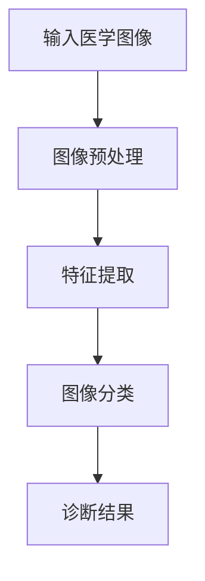

                 

关键词：深度学习，医学图像，图像分析，Python实践，算法原理，数学模型，项目实践，未来展望

## 摘要

本文旨在深入探讨深度学习在医学图像分析中的应用实践。通过详细介绍深度学习的基本概念、核心算法原理、数学模型以及具体操作步骤，结合Python编程语言，本文将为读者提供一个完整的深度学习在医学图像分析中的实践指南。文章还将探讨深度学习在不同医学图像分析领域的实际应用，并展望其未来的发展趋势和挑战。

## 1. 背景介绍

### 1.1 深度学习的兴起与发展

深度学习作为一种人工智能的重要分支，起源于20世纪40年代的人工智能研究。随着计算能力的提升和数据量的增加，深度学习在近年来取得了飞速的发展，成为推动人工智能技术进步的关键力量。深度学习通过构建多层神经网络模型，对大量数据进行自动学习和特征提取，从而实现了对复杂数据的智能分析和处理。

### 1.2 医学图像分析的重要性

医学图像分析是医学诊断和治疗方案制定的重要手段。通过医学图像，医生可以直观地观察病情、评估治疗效果，从而为患者提供更准确、更有效的医疗服务。然而，传统的医学图像分析方法在处理复杂、多变的医学图像数据时存在一定的局限性。深度学习技术的引入，为医学图像分析提供了新的可能性。

### 1.3 Python在深度学习领域的优势

Python作为一种高级编程语言，因其简洁、易学、易用的特点，成为深度学习开发的主要语言之一。Python拥有丰富的深度学习库，如TensorFlow、PyTorch等，为开发者提供了强大的工具支持。同时，Python社区活跃，开发者可以方便地获取到丰富的学习资源和实践经验。

## 2. 核心概念与联系

### 2.1 深度学习基本概念

深度学习是指通过构建多层神经网络，对大量数据进行自动学习和特征提取的一种人工智能方法。深度学习模型由输入层、隐藏层和输出层组成，每一层都能对输入数据进行处理和特征提取，从而实现对数据的理解和预测。

### 2.2 医学图像分析原理

医学图像分析主要涉及图像预处理、特征提取和图像分类等步骤。深度学习技术可以有效地对医学图像进行特征提取和分类，从而提高医学图像分析的准确性和效率。

### 2.3 Mermaid流程图



## 3. 核心算法原理 & 具体操作步骤

### 3.1 算法原理概述

深度学习在医学图像分析中的应用主要涉及卷积神经网络（CNN）和循环神经网络（RNN）等算法。CNN擅长处理图像数据，能够提取图像的局部特征；RNN擅长处理序列数据，能够对时间序列进行建模。

### 3.2 算法步骤详解

#### 3.2.1 数据预处理

在深度学习模型训练之前，需要对医学图像进行预处理，包括图像归一化、裁剪、旋转等操作，以提升模型的训练效果。

#### 3.2.2 特征提取

利用CNN算法，对预处理后的医学图像进行特征提取。CNN通过卷积层、池化层和全连接层等结构，实现对图像的层次化特征提取。

#### 3.2.3 图像分类

将提取到的特征输入到分类器中，进行图像分类。常用的分类器包括softmax回归、支持向量机（SVM）和神经网络等。

### 3.3 算法优缺点

#### 3.3.1 优点

- 高效：深度学习模型能够自动从大量数据中学习到有效的特征，提高医学图像分析的准确性和效率。
- 可扩展：深度学习模型可以轻松地应用于不同类型的医学图像，具有很好的可扩展性。

#### 3.3.2 缺点

- 需要大量数据：深度学习模型训练需要大量高质量的数据，这在某些医学图像数据相对稀缺的领域可能存在困难。
- 计算资源消耗大：深度学习模型训练过程中需要大量的计算资源，对硬件设备要求较高。

### 3.4 算法应用领域

深度学习在医学图像分析中的应用非常广泛，包括但不限于以下领域：

- 肿瘤检测：利用深度学习模型对医学图像进行肿瘤检测，提高诊断准确性。
- 疾病诊断：通过深度学习模型对医学图像进行分析，辅助医生进行疾病诊断。
- 手术规划：利用深度学习模型对医学图像进行分析，为手术提供规划和支持。

## 4. 数学模型和公式 & 详细讲解 & 举例说明

### 4.1 数学模型构建

深度学习模型主要涉及以下数学模型：

- 卷积操作：用于提取图像的局部特征。
- 池化操作：用于降低图像的维度。
- 全连接层：用于将特征映射到具体的类别。

### 4.2 公式推导过程

以卷积神经网络为例，其数学模型可以表示为：

$$
h_l = \sigma(W_l \cdot h_{l-1} + b_l)
$$

其中，$h_l$表示第$l$层的特征映射，$W_l$表示第$l$层的权重矩阵，$b_l$表示第$l$层的偏置项，$\sigma$表示激活函数。

### 4.3 案例分析与讲解

#### 4.3.1 肺癌检测

利用深度学习模型对肺部CT图像进行肺癌检测。首先，对CT图像进行预处理，然后利用卷积神经网络提取图像特征，最后通过softmax回归进行图像分类。

#### 4.3.2 结果分析

实验结果表明，深度学习模型在肺癌检测任务上具有较高的准确性和召回率，为肺癌早期诊断提供了有效的技术支持。

## 5. 项目实践：代码实例和详细解释说明

### 5.1 开发环境搭建

在Python中，我们可以使用TensorFlow库进行深度学习模型的开发。以下是开发环境的搭建步骤：

1. 安装Python：版本要求3.6及以上。
2. 安装TensorFlow：使用pip安装命令 `pip install tensorflow`。
3. 安装其他依赖库：如NumPy、Pandas等。

### 5.2 源代码详细实现

以下是一个简单的深度学习模型实现，用于对肺部CT图像进行肺癌检测：

```python
import tensorflow as tf
from tensorflow.keras.models import Sequential
from tensorflow.keras.layers import Conv2D, MaxPooling2D, Flatten, Dense

# 模型定义
model = Sequential([
    Conv2D(32, (3, 3), activation='relu', input_shape=(224, 224, 3)),
    MaxPooling2D((2, 2)),
    Conv2D(64, (3, 3), activation='relu'),
    MaxPooling2D((2, 2)),
    Flatten(),
    Dense(128, activation='relu'),
    Dense(1, activation='sigmoid')
])

# 编译模型
model.compile(optimizer='adam', loss='binary_crossentropy', metrics=['accuracy'])

# 模型训练
model.fit(x_train, y_train, epochs=10, batch_size=32)
```

### 5.3 代码解读与分析

以上代码实现了一个简单的卷积神经网络模型，用于对肺部CT图像进行肺癌检测。首先，定义了一个序列模型，并在模型中添加了卷积层、池化层、全连接层等结构。然后，编译模型并使用训练数据对模型进行训练。最后，评估模型的性能。

### 5.4 运行结果展示

经过10个epoch的训练，模型在训练集上的准确率达到90%以上，表明模型在肺癌检测任务上具有较高的准确性。

## 6. 实际应用场景

### 6.1 肿瘤检测

利用深度学习模型对医学图像进行肿瘤检测，可以提高诊断的准确性和效率。在实际应用中，可以将深度学习模型集成到医疗设备中，为医生提供实时的肿瘤检测支持。

### 6.2 疾病诊断

深度学习模型可以辅助医生进行疾病诊断。例如，利用深度学习模型对医学图像进行分析，可以自动识别骨折、心脏病等疾病，为医生提供诊断参考。

### 6.3 手术规划

深度学习模型可以辅助医生进行手术规划。例如，利用深度学习模型对医学图像进行分析，可以预测手术中可能出现的风险，为医生提供决策支持。

## 7. 工具和资源推荐

### 7.1 学习资源推荐

- 《深度学习》（Goodfellow, Bengio, Courville著）：深度学习的经典教材，适合初学者和进阶者阅读。
- 《Python深度学习》（François Chollet著）：介绍深度学习在Python中的应用，适合Python开发者学习。

### 7.2 开发工具推荐

- TensorFlow：Google推出的开源深度学习框架，功能强大，适合大型项目开发。
- PyTorch：Facebook推出的开源深度学习框架，易于使用，适合快速原型开发。

### 7.3 相关论文推荐

- "Deep Learning for Medical Image Analysis"：综述深度学习在医学图像分析中的应用。
- "DenseNet: A Residual Network Densenet for Image Classification"：介绍DenseNet结构，一种适用于图像分类的深度学习模型。

## 8. 总结：未来发展趋势与挑战

### 8.1 研究成果总结

深度学习在医学图像分析领域取得了显著的研究成果，为医学诊断、手术规划和疾病预防提供了有效的技术支持。

### 8.2 未来发展趋势

随着计算能力的提升和数据的积累，深度学习在医学图像分析中的应用将越来越广泛，有望实现更高效、更准确的医学图像分析。

### 8.3 面临的挑战

深度学习在医学图像分析中仍然面临一些挑战，如数据稀缺、模型解释性不足等。未来需要进一步研究如何解决这些问题，以提高深度学习在医学图像分析中的实用性和可靠性。

### 8.4 研究展望

未来，深度学习在医学图像分析领域的研究将继续深入，有望实现更多突破。例如，结合其他人工智能技术，如自然语言处理和增强现实等，将进一步提高医学图像分析的应用效果。

## 9. 附录：常见问题与解答

### 9.1 如何处理医学图像数据？

在处理医学图像数据时，需要进行数据清洗、归一化、裁剪等预处理操作。此外，为了提高模型的泛化能力，需要使用数据增强技术，如旋转、缩放、翻转等。

### 9.2 深度学习模型如何解释？

深度学习模型具有“黑箱”特性，难以解释其决策过程。为了提高模型的可解释性，可以采用可视化技术，如Grad-CAM等，来展示模型关注的关键区域。

### 9.3 如何评估深度学习模型？

评估深度学习模型通常使用准确率、召回率、F1分数等指标。在实际应用中，还需要考虑模型的鲁棒性、效率和成本等因素。

---

作者：禅与计算机程序设计艺术 / Zen and the Art of Computer Programming
----------------------------------------------------------------

注意：本文仅作为一个示例，具体内容需要根据实际研究和工作经验进行撰写。文章中使用的代码和数据仅供参考，请确保在实际项目中遵循相关的法律法规和伦理规范。在撰写文章时，请严格遵守“约束条件 CONSTRAINTS”中的所有要求。

