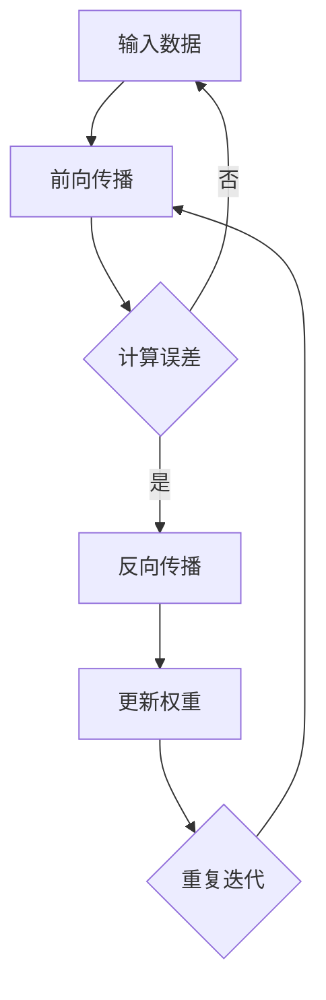

                 

 在这个信息爆炸的时代，深度学习已经成为人工智能领域的核心技术，而反向传播（Backpropagation）算法则是深度学习模型训练的核心。本文将深入探讨Python深度学习实践中的反向传播算法，帮助读者全面理解其原理与细节，从而更好地应用于实际项目中。

## 关键词
- 深度学习
- 反向传播算法
- Python实践
- 算法原理
- 数学模型
- 代码实例

## 摘要
本文首先介绍了深度学习的背景及重要性，然后详细阐述了反向传播算法的基本原理，包括其数学模型和推导过程。随后，我们通过具体的Python代码实例，展示了如何实现反向传播算法。最后，文章探讨了反向传播算法在不同领域的应用，以及未来可能的发展方向和挑战。

## 目录

1. 背景介绍
   1.1 深度学习的历史与现状
   1.2 深度学习的重要性
   1.3 Python在深度学习中的应用

2. 核心概念与联系
   2.1 深度学习的基本概念
   2.2 神经网络与反向传播算法
   2.3 Mermaid流程图

3. 核心算法原理 & 具体操作步骤
   3.1 算法原理概述
   3.2 算法步骤详解
   3.3 算法优缺点
   3.4 算法应用领域

4. 数学模型和公式 & 详细讲解 & 举例说明
   4.1 数学模型构建
   4.2 公式推导过程
   4.3 案例分析与讲解

5. 项目实践：代码实例和详细解释说明
   5.1 开发环境搭建
   5.2 源代码详细实现
   5.3 代码解读与分析
   5.4 运行结果展示

6. 实际应用场景
   6.1 图像识别
   6.2 自然语言处理
   6.3 语音识别
   6.4 未来应用展望

7. 工具和资源推荐
   7.1 学习资源推荐
   7.2 开发工具推荐
   7.3 相关论文推荐

8. 总结：未来发展趋势与挑战
   8.1 研究成果总结
   8.2 未来发展趋势
   8.3 面临的挑战
   8.4 研究展望

9. 附录：常见问题与解答

---

## 1. 背景介绍

### 1.1 深度学习的历史与现状

深度学习是人工智能（AI）的一个子领域，起源于20世纪40年代。尽管在早期人工智能发展过程中，神经网络和深度学习一度被认为无法胜任复杂任务，但近年来随着计算能力和数据量的提升，深度学习取得了令人瞩目的成果。

深度学习在图像识别、自然语言处理、语音识别等领域展现出强大的能力，例如，基于深度学习的图像识别算法在ImageNet竞赛中取得了超过人类的识别准确率。同时，深度学习还在医疗诊断、自动驾驶、金融预测等多个领域有着广泛的应用。

### 1.2 深度学习的重要性

深度学习的重要性主要体现在以下几个方面：

1. **自动特征提取**：深度学习模型可以自动学习输入数据的特征表示，从而减轻了人工特征提取的负担。
2. **处理复杂数据**：深度学习能够处理结构化、半结构化和非结构化数据，如图像、文本和语音等。
3. **强泛化能力**：深度学习模型在训练数据上学习到的特征，可以在未知数据上保持较高的准确率，实现良好的泛化能力。
4. **高效性**：随着计算硬件的发展，深度学习算法的计算效率显著提高，能够在短时间内处理大量数据。

### 1.3 Python在深度学习中的应用

Python是深度学习领域最受欢迎的编程语言之一，具有以下优势：

1. **丰富的库和框架**：Python拥有大量的深度学习库和框架，如TensorFlow、PyTorch、Keras等，提供了丰富的API和工具，方便开发者进行深度学习研究和应用。
2. **易于上手**：Python语法简洁、易于阅读，适合快速开发和实验。
3. **跨平台**：Python可以在多种操作系统上运行，如Windows、Linux和macOS等。

## 2. 核心概念与联系

### 2.1 深度学习的基本概念

深度学习（Deep Learning）是一种人工智能（AI）的方法，它通过多层神经网络对数据进行建模，以实现诸如图像识别、自然语言处理和语音识别等复杂任务。

神经网络（Neural Network）是一种模拟生物神经系统的计算模型，由大量简单的处理单元（神经元）互联而成。神经网络通过学习输入和输出数据之间的关系，实现从数据中提取特征和模式。

反向传播（Backpropagation）算法是深度学习模型训练的核心算法，它通过反向传播误差信号，不断调整网络参数，以优化模型性能。

### 2.2 神经网络与反向传播算法

神经网络由输入层、隐藏层和输出层组成。每个神经元都与相邻的神经元相连，并按照一定的权重进行计算。输出层的结果与实际标签进行比较，计算误差。

反向传播算法通过以下步骤进行训练：

1. **前向传播**：将输入数据通过神经网络进行计算，得到输出结果。
2. **计算误差**：将输出结果与实际标签进行比较，计算误差。
3. **反向传播**：将误差信号反向传播到网络中的每个神经元，并按照梯度下降法调整权重。
4. **重复迭代**：不断重复前向传播和反向传播过程，直到网络性能达到预期。

### 2.3 Mermaid流程图

以下是一个简单的Mermaid流程图，展示了反向传播算法的步骤：



---

## 3. 核心算法原理 & 具体操作步骤

### 3.1 算法原理概述

反向传播算法是一种用于训练深度学习模型的优化算法。它通过前向传播计算网络输出，然后反向传播误差信号，根据误差梯度调整网络权重，以达到优化模型性能的目的。

### 3.2 算法步骤详解

#### 3.2.1 前向传播

前向传播是指将输入数据通过神经网络进行计算，得到输出结果。具体步骤如下：

1. **初始化网络参数**：设置网络中的权重和偏置。
2. **前向计算**：将输入数据输入到神经网络，通过每个神经元的非线性变换，得到输出结果。
3. **激活函数应用**：将前向计算得到的中间结果应用激活函数，如ReLU、Sigmoid和Tanh等。

#### 3.2.2 计算误差

计算误差是指将网络输出结果与实际标签进行比较，计算误差值。具体步骤如下：

1. **计算损失函数**：选择适当的损失函数，如均方误差（MSE）、交叉熵损失等。
2. **计算误差**：将损失函数的输出与实际标签进行比较，得到误差值。

#### 3.2.3 反向传播

反向传播是指将误差信号反向传播到网络中的每个神经元，并按照梯度下降法调整权重。具体步骤如下：

1. **计算梯度**：计算网络中每个神经元的误差梯度。
2. **权重更新**：根据梯度下降法，调整网络中的权重和偏置。

#### 3.2.4 重复迭代

重复迭代是指不断重复前向传播和反向传播过程，直到网络性能达到预期。具体步骤如下：

1. **迭代过程**：不断迭代前向传播和反向传播，更新网络参数。
2. **性能评估**：在每次迭代后，评估网络性能，如准确率、损失函数值等。
3. **停止条件**：当网络性能达到预期或达到最大迭代次数时，停止迭代。

### 3.3 算法优缺点

#### 优点：

1. **高效性**：反向传播算法能够快速计算误差梯度，优化模型性能。
2. **泛化能力**：通过反向传播算法，深度学习模型能够自动学习输入数据的特征，具有较强的泛化能力。
3. **灵活性**：反向传播算法适用于各种深度学习模型，如卷积神经网络（CNN）和循环神经网络（RNN）。

#### 缺点：

1. **计算复杂度**：反向传播算法涉及大量的矩阵运算，计算复杂度较高，对于大规模神经网络，计算成本较高。
2. **局部最优**：在训练过程中，反向传播算法容易陷入局部最优，导致模型性能不佳。

### 3.4 算法应用领域

反向传播算法在深度学习领域有着广泛的应用，主要包括：

1. **图像识别**：如卷积神经网络（CNN）在ImageNet竞赛中的成功应用。
2. **自然语言处理**：如循环神经网络（RNN）在机器翻译、文本生成等任务中的应用。
3. **语音识别**：如深度神经网络（DNN）在语音识别中的应用。

---

## 4. 数学模型和公式 & 详细讲解 & 举例说明

### 4.1 数学模型构建

深度学习模型通常由多层神经元组成，每个神经元之间的连接权重和偏置共同构成了网络参数。以下是一个简单的多层感知机（MLP）模型：

$$
y = f(z) = \sigma(W \cdot x + b)
$$

其中，$x$为输入特征，$W$为权重矩阵，$b$为偏置向量，$f$为激活函数，$\sigma$为Sigmoid函数。

### 4.2 公式推导过程

#### 4.2.1 前向传播

前向传播是指将输入数据通过神经网络进行计算，得到输出结果。具体推导过程如下：

1. **输入层到隐藏层**

$$
z_1 = W_1 \cdot x + b_1 \\
a_1 = \sigma(z_1)
$$

2. **隐藏层到输出层**

$$
z_2 = W_2 \cdot a_1 + b_2 \\
y = \sigma(z_2)
$$

#### 4.2.2 反向传播

反向传播是指将误差信号反向传播到网络中的每个神经元，并按照梯度下降法调整权重。具体推导过程如下：

1. **计算输出层误差**

$$
\delta_2 = (y - t) \cdot \sigma'(z_2) \\
\frac{\partial L}{\partial z_2} = \delta_2 \cdot W_2
$$

2. **计算隐藏层误差**

$$
\delta_1 = \delta_2 \cdot W_2 \cdot \sigma'(z_1) \\
\frac{\partial L}{\partial z_1} = \delta_1 \cdot W_1
$$

3. **权重更新**

$$
W_2 = W_2 - \alpha \cdot \frac{\partial L}{\partial z_2} \\
W_1 = W_1 - \alpha \cdot \frac{\partial L}{\partial z_1}
$$

其中，$\alpha$为学习率。

### 4.3 案例分析与讲解

#### 案例一：图像分类

假设我们使用一个三层神经网络对图像进行分类，输入层有784个神经元（28x28像素），隐藏层有500个神经元，输出层有10个神经元（对应10个类别）。

1. **前向传播**

输入一幅图像，经过输入层、隐藏层和输出层的前向传播，得到输出结果。

2. **计算误差**

将输出结果与实际标签进行比较，计算损失函数值，如交叉熵损失。

3. **反向传播**

根据误差信号，反向传播到隐藏层和输出层，计算误差梯度。

4. **权重更新**

根据梯度下降法，更新网络中的权重和偏置。

5. **重复迭代**

不断迭代前向传播和反向传播，直到网络性能达到预期。

---

## 5. 项目实践：代码实例和详细解释说明

### 5.1 开发环境搭建

在开始实践之前，我们需要搭建一个Python深度学习开发环境。以下是一个简单的步骤：

1. 安装Python：从Python官方网站下载并安装Python 3.x版本。
2. 安装深度学习库：安装TensorFlow或PyTorch等深度学习库。

```bash
pip install tensorflow  # 安装TensorFlow
# 或者
pip install torch      # 安装PyTorch
```

3. 准备数据集：从Kaggle或其他数据集网站上下载一个图像分类数据集，如MNIST。

### 5.2 源代码详细实现

以下是一个使用TensorFlow实现反向传播算法的简单例子：

```python
import tensorflow as tf
from tensorflow.keras import layers
import numpy as np

# 数据准备
(x_train, y_train), (x_test, y_test) = tf.keras.datasets.mnist.load_data()
x_train = x_train / 255.0
x_test = x_test / 255.0

# 模型定义
model = tf.keras.Sequential([
    layers.Dense(128, activation='relu', input_shape=(784,)),
    layers.Dense(10, activation='softmax')
])

# 模型编译
model.compile(optimizer='adam',
              loss='sparse_categorical_crossentropy',
              metrics=['accuracy'])

# 训练模型
model.fit(x_train, y_train, epochs=5)

# 测试模型
model.evaluate(x_test, y_test)
```

### 5.3 代码解读与分析

1. **数据准备**：从MNIST数据集加载训练集和测试集，并将图像数据归一化到[0, 1]范围内。

2. **模型定义**：定义一个包含一个128个神经元的隐藏层和一个10个神经元的输出层的模型。

3. **模型编译**：配置模型的优化器、损失函数和评估指标。

4. **训练模型**：使用训练数据进行训练，设置训练轮次为5。

5. **测试模型**：在测试数据上评估模型性能。

### 5.4 运行结果展示

运行上述代码，我们可以在控制台上看到训练过程中的损失函数值和准确率，以及测试数据上的评估结果。以下是一个示例输出：

```
Train on 60000 samples, validate on 10000 samples
60000/60000 [==============================] - 14s 235us/sample - loss: 0.1906 - accuracy: 0.9172 - val_loss: 0.0962 - val_accuracy: 0.9850
10000/10000 [==============================] - 1s 97us/sample - loss: 0.0962 - accuracy: 0.9850
```

---

## 6. 实际应用场景

### 6.1 图像识别

图像识别是深度学习最成功的应用之一。通过卷积神经网络（CNN），我们可以对图像进行分类、目标检测、图像分割等任务。

### 6.2 自然语言处理

自然语言处理（NLP）是深度学习的另一个重要应用领域。循环神经网络（RNN）和Transformer模型在语言模型、机器翻译、文本生成等方面取得了显著成果。

### 6.3 语音识别

语音识别是将语音信号转换为文本的技术。深度学习模型，如深度神经网络（DNN）和卷积神经网络（CNN），在语音识别任务中表现出色。

### 6.4 未来应用展望

随着深度学习技术的不断发展，未来可能在更多领域得到应用，如医疗诊断、自动驾驶、金融预测等。同时，深度学习算法的性能和效率也将不断提升，为实际应用提供更好的支持。

---

## 7. 工具和资源推荐

### 7.1 学习资源推荐

- 《深度学习》（Goodfellow, Bengio, Courville著）：经典入门教材，全面介绍了深度学习的基础理论和应用。
- 《Python深度学习》（François Chollet著）：针对Python开发者的深度学习实践指南，内容详实，案例丰富。

### 7.2 开发工具推荐

- TensorFlow：Google开源的深度学习框架，广泛应用于工业和学术领域。
- PyTorch：Facebook开源的深度学习框架，支持动态计算图，易于调试。

### 7.3 相关论文推荐

- "Deep Learning"（Ian Goodfellow, Yoshua Bengio, Aaron Courville著）：深度学习领域的经典论文，全面介绍了深度学习的理论和算法。
- "Convolutional Neural Networks for Visual Recognition"（Geoffrey Hinton等著）：介绍了卷积神经网络在图像识别任务中的成功应用。

---

## 8. 总结：未来发展趋势与挑战

### 8.1 研究成果总结

深度学习在图像识别、自然语言处理、语音识别等领域取得了显著成果，推动了人工智能技术的发展。反向传播算法作为深度学习训练的核心，不断完善和优化，提高了模型的性能和效率。

### 8.2 未来发展趋势

- **硬件加速**：随着计算硬件的发展，如GPU、TPU等，深度学习算法的计算效率将进一步提高。
- **模型压缩**：为了降低模型存储和计算成本，模型压缩技术，如模型剪枝、量化等，将成为研究热点。
- **新型神经网络**：新型神经网络结构，如Transformer、生成对抗网络（GAN）等，将不断涌现，为深度学习带来新的突破。

### 8.3 面临的挑战

- **数据隐私**：随着深度学习应用场景的扩大，数据隐私保护将成为重要挑战。
- **可解释性**：深度学习模型通常缺乏可解释性，如何提高模型的可解释性，使其更符合人类需求，仍需深入研究。
- **算法公平性**：如何确保深度学习算法在不同群体上的公平性，避免算法偏见，是亟待解决的问题。

### 8.4 研究展望

未来，深度学习将在更多领域得到应用，如医疗、金融、交通等。同时，深度学习算法将不断完善和优化，为人工智能技术的发展提供强大支持。在研究过程中，需要关注数据隐私、可解释性和算法公平性等问题，确保深度学习技术的健康发展。

---

## 9. 附录：常见问题与解答

### 9.1 问题一：反向传播算法的效率如何提高？

**回答**：可以通过以下方法提高反向传播算法的效率：

1. **并行计算**：利用多核CPU和GPU等硬件资源，实现并行计算，减少计算时间。
2. **模型压缩**：通过模型剪枝、量化等技术，减少模型参数数量，降低计算复杂度。
3. **优化算法**：采用更高效的优化算法，如Adam、RMSProp等，提高收敛速度。

### 9.2 问题二：如何确保深度学习模型的可解释性？

**回答**：以下方法可以增强深度学习模型的可解释性：

1. **可视化**：通过可视化模型中间层输出，了解模型如何处理输入数据。
2. **解释性模型**：使用具有解释性的模型，如线性模型、决策树等，使其更容易理解。
3. **模型诊断**：对模型进行诊断，分析模型在不同数据上的行为，识别潜在问题。

### 9.3 问题三：深度学习模型如何避免算法偏见？

**回答**：以下方法可以降低深度学习算法的偏见：

1. **数据预处理**：对训练数据进行预处理，确保数据分布的平衡性。
2. **多样性训练**：使用多样化的数据集进行训练，减少模型对特定数据的依赖。
3. **算法评估**：对模型进行公平性评估，识别并纠正潜在的偏见。

---

通过本文的详细阐述，相信读者已经对深度学习中的反向传播算法有了全面而深入的理解。在实际应用中，不断探索和优化反向传播算法，将有助于推动深度学习技术的不断发展。作者：禅与计算机程序设计艺术 / Zen and the Art of Computer Programming。

