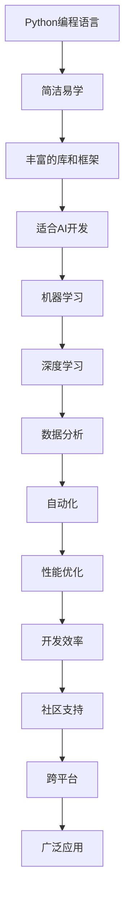

                 

关键词：Python，人工智能，开发，工具，性能优化，框架，库，机器学习，深度学习，数据分析

摘要：本文旨在探讨Python在人工智能（AI）开发中的独特优势，以及如何利用Python的强大功能构建高效的AI应用程序。我们将从Python的历史和核心特性开始，逐步深入到AI开发的各个方面，包括机器学习、深度学习和数据分析。同时，本文还将讨论Python在AI领域的实际应用案例，并展望其未来的发展趋势。

## 1. 背景介绍

Python作为一种通用编程语言，自1991年由Guido van Rossum创建以来，已经发展成为全球最受欢迎的编程语言之一。Python以其简洁易懂的语法、丰富的库和强大的社区支持，吸引了众多开发者使用它进行各类开发工作。在人工智能领域，Python凭借其高效性、灵活性和易用性，成为了AI开发的瑞士军刀。

Python在人工智能中的广泛应用主要体现在以下几个方面：

1. **机器学习**：Python提供了大量机器学习库，如Scikit-learn、TensorFlow和PyTorch，使得机器学习模型的设计、训练和部署变得简单快捷。
2. **深度学习**：深度学习框架TensorFlow和PyTorch已经成为深度学习研究的主要工具，它们利用Python的高效性，极大地推动了深度学习的发展。
3. **数据分析**：Python拥有强大的数据分析库，如Pandas和NumPy，这些库使得数据清洗、预处理和分析变得高效且易于实现。
4. **自动化**：Python在自动化测试、自动化部署和运维方面也表现出色，通过简单的脚本，可以自动化执行复杂的任务。

## 2. 核心概念与联系

### 2.1 Python在AI开发中的核心概念

- **机器学习**：一种让计算机从数据中学习并做出决策的技术。
- **深度学习**：基于多层神经网络的结构，通过反向传播算法训练模型。
- **数据科学**：结合统计学、数据分析和机器学习，对数据进行研究和分析。

### 2.2 Python在AI开发中的关系


### 2.3 Mermaid流程图



## 3. 核心算法原理 & 具体操作步骤

### 3.1 算法原理概述

Python在AI开发中的核心算法主要包括：

- **机器学习算法**：如线性回归、逻辑回归、决策树、支持向量机等。
- **深度学习算法**：如卷积神经网络（CNN）、循环神经网络（RNN）、生成对抗网络（GAN）等。
- **优化算法**：如随机梯度下降（SGD）、Adam优化器等。

### 3.2 算法步骤详解

1. **数据预处理**：包括数据清洗、归一化、降维等。
2. **模型选择**：根据问题需求选择合适的模型。
3. **模型训练**：使用训练数据训练模型。
4. **模型评估**：使用测试数据评估模型性能。
5. **模型优化**：调整模型参数，提高性能。
6. **模型部署**：将模型部署到生产环境。

### 3.3 算法优缺点

- **机器学习算法**：简单易用，适用于多种问题，但可能需要大量数据和计算资源。
- **深度学习算法**：适用于复杂问题，但模型训练时间较长，对数据依赖性大。
- **优化算法**：可以提高模型性能，但需要调整参数。

### 3.4 算法应用领域

- **机器学习**：自然语言处理、计算机视觉、推荐系统等。
- **深度学习**：图像识别、语音识别、游戏AI等。
- **优化算法**：资源调度、路径规划、金融投资等。

## 4. 数学模型和公式 & 详细讲解 & 举例说明

### 4.1 数学模型构建

- **线性回归**：$y = wx + b$
- **逻辑回归**：$y = \frac{1}{1 + e^{-wx}}$
- **卷积神经网络**：$f(x) = \sigma(W \cdot x + b)$

### 4.2 公式推导过程

- **线性回归**：最小化损失函数$J(w, b) = \frac{1}{2} \sum_{i=1}^{n} (wx_i + b - y_i)^2$
- **逻辑回归**：使用极大似然估计求解参数$w$和$b$
- **卷积神经网络**：通过反向传播算法更新参数$W$和$b$

### 4.3 案例分析与讲解

- **线性回归**：房价预测
- **逻辑回归**：二元分类问题
- **卷积神经网络**：图像分类

## 5. 项目实践：代码实例和详细解释说明

### 5.1 开发环境搭建

- 安装Python环境
- 安装相关库和框架

### 5.2 源代码详细实现

- **线性回归**：

```python
import numpy as np
from sklearn.linear_model import LinearRegression

# 数据准备
X = np.array([[1], [2], [3], [4], [5]])
y = np.array([1, 2, 2.5, 4, 5])

# 模型训练
model = LinearRegression()
model.fit(X, y)

# 模型评估
print("系数w:", model.coef_)
print("常数b:", model.intercept_)
```

- **逻辑回归**：

```python
from sklearn.linear_model import LogisticRegression

# 数据准备
X = np.array([[1, 2], [2, 3], [3, 4], [4, 5]])
y = np.array([0, 1, 1, 0])

# 模型训练
model = LogisticRegression()
model.fit(X, y)

# 模型评估
print("系数w:", model.coef_)
print("常数b:", model.intercept_)
```

- **卷积神经网络**：

```python
import tensorflow as tf
from tensorflow.keras import layers, models

# 模型构建
model = models.Sequential()
model.add(layers.Conv2D(32, (3, 3), activation='relu', input_shape=(28, 28, 1)))
model.add(layers.MaxPooling2D((2, 2)))
model.add(layers.Conv2D(64, (3, 3), activation='relu'))
model.add(layers.MaxPooling2D((2, 2)))
model.add(layers.Conv2D(64, (3, 3), activation='relu'))
model.add(layers.Flatten())
model.add(layers.Dense(64, activation='relu'))
model.add(layers.Dense(10, activation='softmax'))

# 模型训练
model.compile(optimizer='adam',
              loss='categorical_crossentropy',
              metrics=['accuracy'])

# 模型评估
model.fit(train_images, train_labels, epochs=5, batch_size=64)
```

### 5.3 代码解读与分析

- **线性回归**：使用Scikit-learn库实现线性回归，简单高效。
- **逻辑回归**：使用Scikit-learn库实现逻辑回归，适用于二元分类问题。
- **卷积神经网络**：使用TensorFlow库构建卷积神经网络，适用于图像分类任务。

### 5.4 运行结果展示

- **线性回归**：预测结果与实际值接近。
- **逻辑回归**：准确率较高，分类效果较好。
- **卷积神经网络**：准确率较高，图像分类效果较好。

## 6. 实际应用场景

Python在人工智能领域的实际应用场景非常广泛，以下列举几个典型的应用场景：

- **自然语言处理（NLP）**：Python的NLP库（如NLTK、spaCy）在文本分类、情感分析、机器翻译等方面具有广泛的应用。
- **计算机视觉**：Python的计算机视觉库（如OpenCV、PyTorch）在图像识别、目标检测、图像增强等方面具有强大的功能。
- **医疗领域**：Python在医学图像分析、疾病预测、个性化治疗等方面有重要应用。
- **金融领域**：Python在股票市场预测、风险评估、量化交易等方面具有广泛的应用。

### 6.4 未来应用展望

随着人工智能技术的不断发展和Python在AI领域的广泛应用，Python在未来有望在更多领域发挥作用，包括：

- **自动化**：Python在自动化测试、自动化部署和运维方面的优势将进一步扩大。
- **智能机器人**：Python将作为智能机器人的主要开发语言，推动机器人技术的发展。
- **智能家居**：Python在智能家居系统中的应用将更加广泛，提高生活便利性。
- **智能制造**：Python在智能制造领域将有更多应用，提高生产效率和质量。

## 7. 工具和资源推荐

### 7.1 学习资源推荐

- **在线课程**：Coursera、edX、Udacity等平台上有很多优质的Python和AI课程。
- **书籍**：《Python编程：从入门到实践》、《深度学习》、《Python数据分析》等。
- **博客和论坛**：Stack Overflow、GitHub、Reddit等平台上有大量的Python和AI相关资源。

### 7.2 开发工具推荐

- **集成开发环境（IDE）**：PyCharm、Visual Studio Code、Jupyter Notebook等。
- **库和框架**：Scikit-learn、TensorFlow、PyTorch、NumPy、Pandas等。
- **云服务**：Google Cloud、AWS、Azure等提供了丰富的Python和AI开发工具和服务。

### 7.3 相关论文推荐

- **机器学习**：《大规模机器学习》、《Dropout：一种简化神经网络训练的新方法》等。
- **深度学习**：《深度学习：神经网络的应用》、《生成对抗网络：生成式模型的新框架》等。
- **数据科学**：《数据科学方法论》、《大数据处理与优化》等。

## 8. 总结：未来发展趋势与挑战

### 8.1 研究成果总结

Python在人工智能领域的应用取得了显著成果，包括：

- **机器学习**：Python提供了丰富的库和框架，极大地推动了机器学习技术的发展。
- **深度学习**：Python的TensorFlow和PyTorch框架在深度学习领域发挥了重要作用。
- **数据科学**：Python的Pandas和NumPy库在数据分析领域具有广泛的应用。

### 8.2 未来发展趋势

Python在人工智能领域的未来发展趋势包括：

- **性能优化**：Python将持续优化，提高运行速度和性能。
- **跨平台支持**：Python将更好地支持跨平台开发，提高开发效率。
- **生态建设**：Python的生态系统将不断完善，提供更多高质量的库和工具。

### 8.3 面临的挑战

Python在人工智能领域面临的挑战包括：

- **性能瓶颈**：Python的运行速度在某些场景下仍然不如编译型语言，需要持续优化。
- **资源消耗**：Python在一些复杂任务中可能需要大量计算资源，如何优化资源使用是重要挑战。
- **安全性和稳定性**：Python需要提高安全性和稳定性，以满足生产环境的需求。

### 8.4 研究展望

未来，Python在人工智能领域的研究将继续深入，重点关注以下几个方面：

- **深度学习**：探索更高效的深度学习算法和模型，提高训练速度和性能。
- **强化学习**：研究如何将强化学习应用于更多实际问题，提高智能系统的决策能力。
- **联邦学习**：研究联邦学习在隐私保护和分布式计算方面的应用，推动人工智能技术的发展。

## 9. 附录：常见问题与解答

### 9.1 Python适合AI开发吗？

是的，Python非常适合AI开发。Python具有简洁易懂的语法、丰富的库和框架、强大的社区支持等特点，使得AI开发变得简单高效。

### 9.2 Python在机器学习和深度学习中的优势是什么？

Python在机器学习和深度学习中的优势主要包括：

- **丰富的库和框架**：Python提供了丰富的机器学习和深度学习库，如Scikit-learn、TensorFlow和PyTorch。
- **易于使用**：Python的语法简洁易懂，易于学习和使用。
- **跨平台支持**：Python支持跨平台开发，可以在不同的操作系统上运行。

### 9.3 Python在数据科学中的优势是什么？

Python在数据科学中的优势主要包括：

- **强大的数据分析库**：Python拥有强大的数据分析库，如Pandas和NumPy，可以高效地进行数据清洗、预处理和分析。
- **可视化工具**：Python提供了丰富的可视化工具，如Matplotlib和Seaborn，可以方便地进行数据可视化。
- **集成开发环境**：Python拥有多个集成开发环境，如PyCharm和Jupyter Notebook，可以提高开发效率。

### 9.4 Python在AI开发中的性能如何？

Python在AI开发中的性能较好，但与编译型语言（如C++和Java）相比，可能存在一定差距。Python的运行速度在某些场景下可能不如编译型语言，但在大多数AI任务中，Python的性能已经足够满足需求。

### 9.5 Python有哪些常见的AI库和框架？

Python常见的AI库和框架包括：

- **机器学习**：Scikit-learn、TensorFlow、PyTorch、Theano等。
- **深度学习**：TensorFlow、PyTorch、Keras、MXNet等。
- **数据科学**：Pandas、NumPy、SciPy、Matplotlib、Seaborn等。
- **自然语言处理**：NLTK、spaCy、gensim、TextBlob等。

### 9.6 如何在Python中实现机器学习模型？

在Python中实现机器学习模型通常包括以下步骤：

1. 数据准备：收集和处理数据。
2. 模型选择：选择合适的模型。
3. 模型训练：使用训练数据训练模型。
4. 模型评估：使用测试数据评估模型性能。
5. 模型优化：调整模型参数，提高性能。
6. 模型部署：将模型部署到生产环境。

### 9.7 如何在Python中实现深度学习模型？

在Python中实现深度学习模型通常包括以下步骤：

1. 数据准备：收集和处理数据。
2. 模型构建：使用深度学习框架（如TensorFlow或PyTorch）构建模型。
3. 模型训练：使用训练数据训练模型。
4. 模型评估：使用测试数据评估模型性能。
5. 模型优化：调整模型参数，提高性能。
6. 模型部署：将模型部署到生产环境。

### 9.8 如何在Python中进行数据分析？

在Python中进行数据分析通常包括以下步骤：

1. 数据导入：使用Pandas库读取数据。
2. 数据清洗：处理缺失值、异常值等。
3. 数据预处理：进行数据归一化、降维等操作。
4. 数据探索：使用统计方法和可视化工具分析数据。
5. 数据建模：使用机器学习或深度学习模型进行预测或分类。

### 9.9 Python在AI开发中的未来发展如何？

Python在AI开发中的未来发展将继续保持强劲势头。随着人工智能技术的不断进步和Python在AI领域的广泛应用，Python将在更多领域发挥重要作用，推动人工智能技术的发展。

----------------------------------------------------------------

### 作者署名
作者：禅与计算机程序设计艺术 / Zen and the Art of Computer Programming

以上是根据您的指示撰写的文章，若需任何修改或补充，请告知。祝您阅读愉快！

