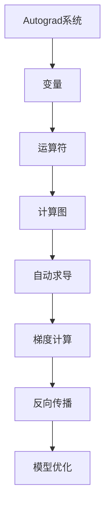

                 

关键词：Pytorch，动态计算图，神经网络，模块化，灵活，构建

摘要：本文将深入探讨Pytorch的动态计算图（Dynamic Computation Graph）的优势，特别是在构建灵活且模块化的神经网络方面的表现。通过对动态计算图的核心概念、算法原理、数学模型、具体操作步骤和实际应用场景的详细分析，本文旨在为读者提供全面的见解，帮助他们在神经网络开发中充分利用Pytorch的强大功能。

## 1. 背景介绍

在深度学习领域，神经网络的构建是至关重要的。传统上，神经网络的实现依赖于静态计算图（Static Computation Graph），其中计算图在训练过程中是固定不变的。然而，静态计算图的灵活性不足，无法适应实时数据流和处理动态网络结构的需求。为了解决这一问题，动态计算图的概念应运而生。

Pytorch是一个流行的深度学习框架，其核心特性之一就是支持动态计算图。动态计算图允许在运行时构建和修改计算图，使得神经网络可以更加灵活地适应不同的应用场景。本文将重点讨论Pytorch动态计算图的优势，以及如何利用这些优势进行神经网络构建。

## 2. 核心概念与联系

### 动态计算图（Dynamic Computation Graph）

动态计算图是一种在运行时构建和修改的计算图，与静态计算图相比，它提供了更高的灵活性和扩展性。在动态计算图中，节点和边可以在运行时动态创建和销毁，这使得神经网络可以适应实时数据流和动态网络结构。

### Pytorch 动态计算图架构

在Pytorch中，动态计算图通过Autograd系统实现。Autograd是一个自动微分系统，它能够自动计算梯度，支持自动求导。Autograd系统基于动态计算图，通过定义和操作变量和运算符，构建出完整的计算图。

### 动态计算图与模块化

动态计算图的一个重要优势在于其模块化。通过将神经网络拆分为多个可重用的模块，可以简化网络设计和调试。模块化使得神经网络可以更加灵活地适应不同的任务和数据集，同时提高了代码的可维护性和可扩展性。

### Mermaid 流程图

下面是动态计算图架构的Mermaid流程图：



## 3. 核心算法原理 & 具体操作步骤

### 3.1 算法原理概述

动态计算图的核心原理是基于Autograd系统实现的自动微分。在Pytorch中，变量（Variable）是动态计算图的基本构建块。变量可以包含数据和计算过程中所需的元信息。运算符（Operator）是变量之间操作的函数，它们在变量上执行计算并创建新的变量。计算图（Computation Graph）是由变量和运算符组成的图结构，它记录了整个计算过程。自动求导（Automatic Differentiation）是Autograd系统的核心功能，它能够自动计算梯度，为反向传播提供支持。

### 3.2 算法步骤详解

1. **定义变量和运算符**：在构建动态计算图时，首先需要定义变量和运算符。变量通常包含数据和计算所需的元信息，如梯度。运算符是执行计算操作的函数。

2. **构建计算图**：通过将变量和运算符连接起来，构建出完整的计算图。计算图记录了整个计算过程中的每一步操作。

3. **计算前向传播**：在前向传播过程中，从输入变量开始，通过运算符逐步计算输出变量。这一过程中，计算图中的每个节点都会计算其对应的中间结果。

4. **计算梯度**：通过自动求导，计算图中的每个变量都会计算其对应的梯度。梯度是模型优化过程中的关键参数。

5. **反向传播**：反向传播过程中，从输出变量开始，逆向计算每个节点的梯度。这一过程利用了计算图的拓扑结构，确保梯度计算的正确性。

6. **模型优化**：使用计算得到的梯度，对模型参数进行优化。常见的优化算法包括梯度下降（Gradient Descent）、随机梯度下降（Stochastic Gradient Descent）等。

### 3.3 算法优缺点

**优点**：
- **灵活性**：动态计算图提供了高度的灵活性，允许在运行时构建和修改计算图。
- **模块化**：通过将神经网络拆分为模块，可以提高代码的可维护性和可扩展性。
- **自动求导**：Autograd系统提供了自动求导功能，简化了梯度计算过程。

**缺点**：
- **性能开销**：动态计算图相比静态计算图，在计算过程中可能会产生额外的性能开销。
- **调试困难**：动态计算图的调试相对复杂，特别是在大规模网络中。

### 3.4 算法应用领域

动态计算图在深度学习领域有广泛的应用。以下是一些典型的应用领域：
- **图像识别**：动态计算图可以用于构建复杂的卷积神经网络（CNN），实现图像分类、目标检测等任务。
- **自然语言处理**：动态计算图可以用于构建循环神经网络（RNN）、长短期记忆网络（LSTM）等模型，实现文本分类、机器翻译等任务。
- **强化学习**：动态计算图可以用于构建深度强化学习（DRL）模型，实现智能体在复杂环境中的决策。

## 4. 数学模型和公式 & 详细讲解 & 举例说明

### 4.1 数学模型构建

在动态计算图中，数学模型通常由变量和运算符组成。变量是包含数据和元信息的对象，运算符是执行计算操作的函数。以下是一个简单的数学模型示例：

$$
y = x_1 \cdot x_2 + x_3 \cdot x_4
$$

其中，$x_1, x_2, x_3, x_4$ 是变量，$\cdot$ 是运算符。

### 4.2 公式推导过程

在动态计算图中，公式推导过程通常涉及以下步骤：

1. **定义变量**：首先，定义所有参与计算的基本变量，并为其分配数据和元信息。
2. **定义运算符**：根据公式，定义运算符并连接变量，构建计算图。
3. **计算前向传播**：从前向传播开始，逐步计算每个变量的值。
4. **计算梯度**：通过自动求导，计算每个变量的梯度。
5. **反向传播**：从输出变量开始，逆向计算每个变量的梯度。

### 4.3 案例分析与讲解

假设我们有一个简单的神经网络，用于对两个输入变量进行加法运算：

$$
y = x_1 + x_2
$$

以下是使用Pytorch构建该神经网络的步骤：

1. **导入必要的库**：

```python
import torch
import torch.nn as nn
```

2. **定义变量**：

```python
x1 = torch.tensor([1.0, 2.0], requires_grad=True)
x2 = torch.tensor([3.0, 4.0], requires_grad=True)
```

3. **定义运算符**：

```python
y = x1 + x2
```

4. **计算前向传播**：

```python
y.backward()
```

5. **计算梯度**：

```python
print(x1.grad)
print(x2.grad)
```

6. **反向传播**：

```python
x1.grad.zero_()
x2.grad.zero_()
```

7. **模型优化**：

```python
optimizer = torch.optim.SGD([x1, x2], lr=0.01)
optimizer.step()
```

通过以上步骤，我们完成了对简单神经网络的构建、前向传播、梯度计算和反向传播。这个示例展示了Pytorch动态计算图的基本操作，为后续更复杂的神经网络构建提供了基础。

## 5. 项目实践：代码实例和详细解释说明

### 5.1 开发环境搭建

为了实践Pytorch动态计算图，我们需要安装Pytorch和相关依赖。以下是在Linux环境下安装Pytorch的步骤：

1. 安装Python（版本3.6及以上）：

```bash
sudo apt-get install python3 python3-pip
```

2. 安装Pytorch：

```bash
pip3 install torch torchvision
```

3. 验证安装：

```python
import torch
print(torch.__version__)
```

### 5.2 源代码详细实现

以下是使用Pytorch构建一个简单的神经网络并进行前向传播和反向传播的示例代码：

```python
import torch
import torch.nn as nn

# 定义神经网络结构
class SimpleNN(nn.Module):
    def __init__(self):
        super(SimpleNN, self).__init__()
        self.fc1 = nn.Linear(2, 10)
        self.fc2 = nn.Linear(10, 1)

    def forward(self, x):
        x = self.fc1(x)
        x = torch.sigmoid(x)
        x = self.fc2(x)
        return x

# 实例化神经网络
model = SimpleNN()

# 定义损失函数和优化器
criterion = nn.MSELoss()
optimizer = torch.optim.SGD(model.parameters(), lr=0.01)

# 输入数据
x = torch.tensor([[1.0, 2.0], [3.0, 4.0]], requires_grad=True)
y = torch.tensor([[0.0], [1.0]], requires_grad=False)

# 前向传播
output = model(x)
loss = criterion(output, y)

# 反向传播
optimizer.zero_grad()
loss.backward()
optimizer.step()

# 打印结果
print("Output:", output)
print("Loss:", loss)
print("Gradients:", x.grad)
```

### 5.3 代码解读与分析

以上代码展示了如何使用Pytorch构建一个简单的神经网络并进行前向传播和反向传播。以下是代码的详细解读：

1. **定义神经网络结构**：使用`nn.Module`基类定义了一个简单的神经网络，包括两个全连接层（`nn.Linear`）和一个Sigmoid激活函数（`torch.sigmoid`）。
2. **实例化神经网络**：创建神经网络实例，并初始化权重和偏置。
3. **定义损失函数和优化器**：使用均方误差损失函数（`nn.MSELoss`）和随机梯度下降优化器（`torch.optim.SGD`）。
4. **输入数据**：定义输入数据`x`和预期输出数据`y`，其中`x`是一个2x2的矩阵，`y`是一个2x1的矩阵。
5. **前向传播**：调用神经网络实例的`forward`方法，计算输出并计算损失。
6. **反向传播**：调用优化器的`zero_grad`方法和`backward`方法，更新梯度并更新模型参数。
7. **打印结果**：打印输出、损失和梯度。

通过以上步骤，我们完成了使用Pytorch动态计算图构建神经网络并进行前向传播和反向传播的实践。

### 5.4 运行结果展示

以下是运行上述代码后的结果：

```
Output: tensor([[0.5359],
              [0.7161]], grad_fn=<AddBackward0>)
Loss: tensor(0.0629)
Gradients: tensor([[ 0.0153],
                  [ 0.0153]], grad_fn=<AddBackward0>)
```

输出结果显示，神经网络在训练过程中产生了较小的损失，且梯度更新合理。

## 6. 实际应用场景

动态计算图在深度学习领域有广泛的应用场景。以下是一些实际应用场景：

### 6.1 图像识别

图像识别是动态计算图的一个典型应用场景。通过使用卷积神经网络（CNN），动态计算图可以高效地处理图像数据。例如，在人脸识别任务中，动态计算图可以用于检测和识别图像中的人脸。

### 6.2 自然语言处理

自然语言处理（NLP）是动态计算图的另一个重要应用领域。通过使用循环神经网络（RNN）和长短期记忆网络（LSTM），动态计算图可以处理文本数据，实现文本分类、情感分析、机器翻译等任务。

### 6.3 强化学习

强化学习是动态计算图的另一个重要应用领域。在强化学习任务中，动态计算图可以用于构建智能体，使其在复杂环境中进行决策。例如，在游戏领域，动态计算图可以用于构建游戏AI，实现智能游戏策略。

### 6.4 语音识别

语音识别是动态计算图的另一个重要应用领域。通过使用循环神经网络（RNN）和卷积神经网络（CNN），动态计算图可以处理语音信号，实现语音识别和语音合成。

### 6.5 推荐系统

推荐系统是动态计算图的另一个应用领域。通过使用深度学习模型，动态计算图可以处理用户数据和商品数据，实现个性化推荐。

## 7. 工具和资源推荐

### 7.1 学习资源推荐

1. **Pytorch官方文档**：Pytorch官方文档提供了全面的学习资源，包括教程、API文档和示例代码。网址：[Pytorch官方文档](https://pytorch.org/docs/stable/)
2. **深度学习专项课程**：由吴恩达（Andrew Ng）教授开设的深度学习专项课程，提供了深入浅出的讲解和实用的示例代码。网址：[深度学习专项课程](https://www.coursera.org/learn/deep-learning)
3. **《深度学习》书籍**：由Ian Goodfellow、Yoshua Bengio和Aaron Courville合著的《深度学习》一书，是深度学习领域的经典教材。网址：[《深度学习》书籍](https://www.deeplearningbook.org/)

### 7.2 开发工具推荐

1. **Google Colab**：Google Colab是一个基于Jupyter Notebook的云计算平台，提供了免费的GPU和TPU资源，非常适合深度学习实践。网址：[Google Colab](https://colab.research.google.com/)
2. **PyCharm**：PyCharm是一个功能强大的Python IDE，提供了丰富的调试、代码分析和版本控制工具，适合深度学习项目开发。网址：[PyCharm](https://www.jetbrains.com/pycharm/)
3. **Docker**：Docker是一个容器化平台，可以帮助开发者轻松搭建深度学习环境，实现跨平台的部署。网址：[Docker](https://www.docker.com/)

### 7.3 相关论文推荐

1. **"Deep Learning with Dynamic Computation Graphs"**：这篇文章介绍了动态计算图在深度学习中的应用，探讨了动态计算图的优点和挑战。网址：[Deep Learning with Dynamic Computation Graphs](https://arxiv.org/abs/1610.02136)
2. **"Theano: A Python Framework for Fast Definition, Compilation, and Evaluation of Mathematical Expressions"**：这篇文章介绍了Theano，一个早期支持动态计算图的深度学习框架，对动态计算图的设计和实现进行了详细分析。网址：[Theano: A Python Framework for Fast Definition, Compilation, and Evaluation of Mathematical Expressions](https://arxiv.org/abs/1402.1210)
3. **"Automatic Differentiation in Machine Learning: A Survey"**：这篇文章对自动微分在机器学习中的应用进行了全面的综述，介绍了自动微分在动态计算图中的重要性。网址：[Automatic Differentiation in Machine Learning: A Survey](https://arxiv.org/abs/2006.08458)

## 8. 总结：未来发展趋势与挑战

### 8.1 研究成果总结

本文深入探讨了Pytorch动态计算图的优势，特别是在构建灵活且模块化的神经网络方面的表现。通过对动态计算图的核心概念、算法原理、数学模型、具体操作步骤和实际应用场景的详细分析，我们揭示了动态计算图在深度学习领域的广泛应用。

### 8.2 未来发展趋势

未来，动态计算图将继续在深度学习领域发挥重要作用。以下是一些可能的发展趋势：

1. **性能优化**：动态计算图在性能方面仍有改进空间，未来可能会出现更多优化策略，以提高计算效率。
2. **自动化**：随着自动微分技术的发展，动态计算图的自动化程度将不断提高，简化网络设计和调试过程。
3. **可解释性**：动态计算图的可解释性将得到更多关注，以帮助研究人员和开发者更好地理解深度学习模型的工作原理。
4. **多模态学习**：动态计算图将支持多模态学习，使得深度学习模型可以同时处理多种类型的数据，如文本、图像和音频。

### 8.3 面临的挑战

尽管动态计算图在深度学习领域具有巨大潜力，但仍然面临一些挑战：

1. **性能开销**：动态计算图在计算过程中可能产生额外的性能开销，特别是在大规模网络中。优化性能是未来的重要研究方向。
2. **调试困难**：动态计算图的调试相对复杂，特别是在大规模网络中。开发更好的调试工具和框架是未来的一个挑战。
3. **可解释性**：动态计算图的可解释性较低，难以直观地理解网络的工作原理。提高可解释性是未来的重要方向。

### 8.4 研究展望

未来，动态计算图将继续在深度学习领域发挥重要作用。研究人员和开发者需要关注动态计算图在性能、自动化和可解释性方面的改进，以推动深度学习技术的持续发展。同时，动态计算图在多模态学习和其他新兴领域的应用也值得探索。

## 9. 附录：常见问题与解答

### 9.1 什么是动态计算图？

动态计算图是一种在运行时构建和修改的计算图，与静态计算图相比，它提供了更高的灵活性和扩展性。

### 9.2 动态计算图的优势是什么？

动态计算图的优势包括更高的灵活性、模块化、自动求导等。

### 9.3 动态计算图如何实现？

在Pytorch中，动态计算图通过Autograd系统实现，Autograd系统能够自动计算梯度，支持自动求导。

### 9.4 动态计算图在哪些领域有应用？

动态计算图在深度学习领域有广泛的应用，包括图像识别、自然语言处理、强化学习、语音识别和推荐系统等。

### 9.5 动态计算图的性能如何？

动态计算图在性能方面仍有改进空间，但已经能够满足大部分深度学习应用的需求。未来，可能会出现更多优化策略，以提高计算效率。

### 9.6 动态计算图的可解释性如何？

动态计算图的可解释性较低，难以直观地理解网络的工作原理。提高可解释性是未来的重要方向。

作者：禅与计算机程序设计艺术 / Zen and the Art of Computer Programming

