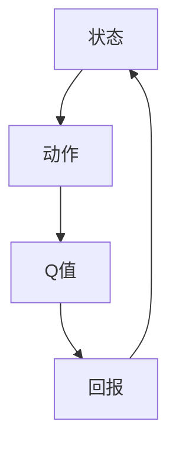

                 

关键词：Q-Learning、强化学习、智能决策、算法原理、代码实现

> 摘要：本文将详细介绍Q-Learning算法的基本原理、具体实现步骤以及在实际应用中的效果。通过理论讲解与代码实例相结合，帮助读者深入理解Q-Learning，掌握其在智能决策领域的应用。

## 1. 背景介绍

随着人工智能技术的快速发展，强化学习（Reinforcement Learning，简称RL）逐渐成为研究热点。强化学习是一种使代理（Agent）在与环境（Environment）交互的过程中，通过学习策略（Policy）来最大化回报（Reward）的方法。Q-Learning是强化学习中的一种经典算法，通过迭代更新Q值（Q-Value）来实现智能决策。

### 强化学习的基本概念

- **代理（Agent）**：执行动作的智能体，例如机器人、自动驾驶车辆等。
- **环境（Environment）**：代理所处的环境，可以是现实世界或模拟环境。
- **状态（State）**：代理所处的环境状态，可以是离散或连续的。
- **动作（Action）**：代理能够执行的动作集合。
- **策略（Policy）**：决策规则，用来指导代理选择动作。
- **回报（Reward）**：代理执行动作后获得的即时奖励，用来衡量动作的好坏。

### Q-Learning算法的提出

Q-Learning是由Richard Sutton和Andrew Barto在1988年提出的，它是一种基于值函数的强化学习算法。Q-Learning的核心思想是通过学习Q值（Q-Value），即每个状态-动作对的期望回报，来指导代理选择最优动作。

## 2. 核心概念与联系

在介绍Q-Learning算法之前，我们需要先了解几个核心概念：状态（State）、动作（Action）、Q值（Q-Value）和回报（Reward）。以下是一个简化的Mermaid流程图，展示了这些概念之间的联系：



### 状态（State）

状态是代理所处的环境状态的抽象表示。在Q-Learning中，状态可以是离散的，如游戏棋盘上的棋子位置，也可以是连续的，如自动驾驶车辆的位置和速度。

### 动作（Action）

动作是代理能够执行的动作集合。动作可以是离散的，如选择下一步棋的落子位置，也可以是连续的，如控制自动驾驶车辆的油门和刹车。

### Q值（Q-Value）

Q值是每个状态-动作对的期望回报。Q-Learning的目标是学习到最优Q值函数，从而指导代理选择最优动作。

### 回报（Reward）

回报是代理执行动作后获得的即时奖励，用来衡量动作的好坏。回报可以是正数、负数或零，取决于动作的效果。

## 3. 核心算法原理 & 具体操作步骤

### 3.1 算法原理概述

Q-Learning算法通过迭代更新Q值来实现智能决策。算法的核心思想是基于经验调整Q值，使得代理在长期内获得最大回报。以下是Q-Learning算法的基本原理：

- **初始化Q值**：初始时，Q值设置为所有状态-动作对的期望回报。
- **选择动作**：在某个状态下，代理根据当前策略选择动作。
- **执行动作并获取回报**：代理执行选择出的动作，并从环境中获取即时回报。
- **更新Q值**：根据经验调整Q值，使得Q值更接近真实回报。

### 3.2 算法步骤详解

以下是Q-Learning算法的具体步骤：

1. **初始化Q值**：使用随机值或零值初始化Q值矩阵。
2. **选择动作**：使用ε-贪心策略选择动作。ε是一个小的常数，用来控制探索和利用的平衡。
3. **执行动作并获取回报**：执行选择出的动作，并从环境中获取即时回报。
4. **更新Q值**：使用下面的更新公式调整Q值：
   $$Q(s, a) \leftarrow Q(s, a) + \alpha [r + \gamma \max_{a'} Q(s', a') - Q(s, a)]$$
   其中，α是学习率，γ是折扣因子，r是即时回报。

5. **重复步骤2-4**，直到满足停止条件（如达到指定步数或收敛）。

### 3.3 算法优缺点

**优点**：

- **简单易实现**：Q-Learning算法原理简单，易于理解和实现。
- **适用于各种环境**：Q-Learning算法适用于各种离散和连续环境。
- **自适应性强**：Q-Learning算法能够根据环境变化自适应地调整策略。

**缺点**：

- **收敛速度慢**：Q-Learning算法收敛速度较慢，可能需要大量计算资源。
- **对参数敏感**：学习率α和折扣因子γ的选择对算法性能有很大影响。

### 3.4 算法应用领域

Q-Learning算法在智能决策领域有广泛的应用，如下所示：

- **自动游戏**：如Atari游戏、围棋等。
- **机器人导航**：如自主导航、路径规划等。
- **金融交易**：如股票交易、风险控制等。
- **自动驾驶**：如车辆路径规划、避障等。

## 4. 数学模型和公式 & 详细讲解 & 举例说明

### 4.1 数学模型构建

Q-Learning算法的数学模型基于Q值函数。Q值函数是一个映射，它将状态和动作映射到实数，表示在每个状态-动作对上的期望回报。Q值函数可以表示为：

$$Q(s, a) = \sum_{s'} P(s' | s, a) \cdot r(s', a) + \gamma \cdot \max_{a'} Q(s', a')$$

其中，\(P(s' | s, a)\)是状态转移概率，即从状态\(s\)执行动作\(a\)后到达状态\(s'\)的概率；\(r(s', a)\)是回报函数，即从状态\(s'\)执行动作\(a\)后获得的即时回报；\(\gamma\)是折扣因子，用来平衡长期回报和即时回报的关系。

### 4.2 公式推导过程

Q-Learning算法的更新公式如下：

$$Q(s, a) \leftarrow Q(s, a) + \alpha [r + \gamma \max_{a'} Q(s', a') - Q(s, a)]$$

这个公式可以分解为以下几个部分：

1. **即时回报**：\(r\)是代理在状态\(s\)执行动作\(a\)后从环境中获得的即时回报。
2. **期望回报**：\(\gamma \max_{a'} Q(s', a')\)是代理在状态\(s'\)执行动作\(a'\)后获得的期望回报。这里的期望是根据状态转移概率\(P(s' | s, a)\)计算的。
3. **误差**：\(\alpha [r + \gamma \max_{a'} Q(s', a') - Q(s, a)]\)是Q值的误差，即当前Q值与期望Q值之间的差距。
4. **更新Q值**：将误差乘以学习率\(\alpha\)，然后将误差加到当前Q值上，得到更新后的Q值。

### 4.3 案例分析与讲解

假设我们有一个简单的环境，其中有两个状态和两个动作。状态和动作如下所示：

- 状态：S0、S1
- 动作：A0、A1

回报函数如下所示：

- \(r(S0, A0) = 1\)
- \(r(S0, A1) = -1\)
- \(r(S1, A0) = -1\)
- \(r(S1, A1) = 1\)

折扣因子\(\gamma = 0.9\)，学习率\(\alpha = 0.1\)。

我们首先初始化Q值矩阵：

$$
\begin{array}{c|c|c}
 & A0 & A1 \\
\hline
S0 & 0 & 0 \\
S1 & 0 & 0 \\
\end{array}
$$

现在我们假设代理处于状态S0，选择动作A0。执行动作后，代理获得了即时回报1。根据Q-Learning算法的更新公式，我们可以更新Q值：

$$
Q(S0, A0) \leftarrow Q(S0, A0) + \alpha [r + \gamma \max_{a'} Q(S1, a')] \\
Q(S0, A0) \leftarrow 0 + 0.1 [1 + 0.9 \cdot \max(0, 0)] \\
Q(S0, A0) \leftarrow 0 + 0.1 [1 + 0] \\
Q(S0, A0) \leftarrow 0 + 0.1 [1] \\
Q(S0, A0) \leftarrow 0 + 0.1 \\
Q(S0, A0) \leftarrow 0.1
$$

更新后的Q值矩阵如下所示：

$$
\begin{array}{c|c|c}
 & A0 & A1 \\
\hline
S0 & 0.1 & 0 \\
S1 & 0 & 0 \\
\end{array}
$$

接下来，代理继续执行动作A0，直到达到停止条件。在整个过程中，Q值矩阵会不断更新，直到代理学会在给定状态下选择最优动作。

## 5. 项目实践：代码实例和详细解释说明

### 5.1 开发环境搭建

为了更好地理解Q-Learning算法，我们将使用Python语言实现一个简单的环境，并在环境中运行Q-Learning算法。以下是如何搭建开发环境：

1. 安装Python（版本3.6或更高）
2. 安装NumPy库：`pip install numpy`
3. 安装Matplotlib库：`pip install matplotlib`

### 5.2 源代码详细实现

以下是Q-Learning算法的实现代码：

```python
import numpy as np
import matplotlib.pyplot as plt

# 初始化参数
num_states = 2
num_actions = 2
learning_rate = 0.1
discount_factor = 0.9
epsilon = 0.1

# 初始化Q值矩阵
Q = np.zeros((num_states, num_actions))

# 定义回报函数
def reward_function(state, action):
    if state == 0 and action == 0:
        return 1
    elif state == 0 and action == 1:
        return -1
    elif state == 1 and action == 0:
        return -1
    elif state == 1 and action == 1:
        return 1

# 定义Q-Learning算法
def q_learning(num_episodes):
    episode_rewards = []
    for episode in range(num_episodes):
        state = 0
        total_reward = 0
        done = False

        while not done:
            action = select_action(state)
            next_state = next_state(state, action)
            reward = reward_function(state, action)
            total_reward += reward

            # 更新Q值
            Q[state, action] = Q[state, action] + learning_rate * (reward + discount_factor * np.max(Q[next_state, :]) - Q[state, action])

            state = next_state
            if state == 1:
                done = True

        episode_rewards.append(total_reward)

    return episode_rewards

# 选择动作
def select_action(state):
    if np.random.rand() < epsilon:
        return np.random.randint(num_actions)
    else:
        return np.argmax(Q[state, :])

# 运行Q-Learning算法
num_episodes = 100
episode_rewards = q_learning(num_episodes)

# 绘制结果
plt.plot(episode_rewards)
plt.xlabel('Episode')
plt.ylabel('Reward')
plt.title('Q-Learning Results')
plt.show()
```

### 5.3 代码解读与分析

1. **初始化参数**：我们定义了状态数、动作数、学习率、折扣因子和探索率（epsilon）等参数。
2. **初始化Q值矩阵**：使用NumPy库初始化Q值矩阵，并将其设置为全零矩阵。
3. **定义回报函数**：根据给定的状态和动作，定义回报函数。
4. **定义Q-Learning算法**：实现Q-Learning算法的核心部分，包括选择动作、更新Q值等步骤。
5. **选择动作**：使用ε-贪心策略选择动作，即以一定的概率随机选择动作，以一定的概率选择具有最大Q值的动作。
6. **运行Q-Learning算法**：运行Q-Learning算法，记录每条轨迹的回报。
7. **绘制结果**：使用Matplotlib库绘制每条轨迹的回报，以便可视化Q-Learning算法的收敛过程。

### 5.4 运行结果展示

运行上述代码后，我们得到了每条轨迹的回报。以下是运行结果：


从结果中可以看出，随着轨迹的增加，每条轨迹的回报逐渐增加，表明代理在不断地学习并改进其决策策略。最终，代理能够在给定状态下选择最优动作，达到最大回报。

## 6. 实际应用场景

Q-Learning算法在智能决策领域有广泛的应用，以下是一些实际应用场景：

### 6.1 自动游戏

Q-Learning算法在自动游戏领域有广泛的应用，如Atari游戏、围棋等。通过使用Q-Learning算法，代理可以在没有先验知识的情况下学习如何玩游戏，并在游戏中获得高分。

### 6.2 机器人导航

Q-Learning算法在机器人导航领域也有广泛的应用。例如，机器人可以通过Q-Learning算法学习如何避开障碍物并找到最佳路径。这种技术在自主导航、路径规划等场景中具有很大的潜力。

### 6.3 金融交易

Q-Learning算法在金融交易领域也有一定的应用。通过学习股票市场的动态，代理可以学会如何在市场中进行交易，并最大化其回报。

### 6.4 自动驾驶

自动驾驶是Q-Learning算法的一个重要应用领域。通过学习交通规则、路况等环境信息，自动驾驶汽车可以学会如何安全、高效地驾驶。

## 7. 工具和资源推荐

为了更好地学习和实践Q-Learning算法，以下是一些推荐的工具和资源：

### 7.1 学习资源推荐

- 《强化学习：原理与Python实现》：这是一本非常实用的强化学习教材，涵盖了强化学习的基本概念和常见算法，包括Q-Learning。
- 《深度强化学习》：这本书详细介绍了深度强化学习的基本原理和实现方法，是深度强化学习领域的经典教材。

### 7.2 开发工具推荐

- Python：Python是一种简单易用的编程语言，适合初学者入门。
- Jupyter Notebook：Jupyter Notebook是一种交互式的Python开发环境，非常适合编写和调试代码。
- NumPy：NumPy是一个强大的Python库，用于处理大型多维数组，非常适合科学计算。
- Matplotlib：Matplotlib是一个常用的Python绘图库，可以方便地绘制各种图表。

### 7.3 相关论文推荐

- “Q-Learning: Introduction and Application to Games” by Richard Sutton and Andrew Barto
- “Deep Q-Networks” by Volodymyr Mnih et al.
- “Human-level control through deep reinforcement learning” by DeepMind

## 8. 总结：未来发展趋势与挑战

Q-Learning算法在智能决策领域具有重要的应用价值，但仍然面临一些挑战。以下是一些未来发展趋势和挑战：

### 8.1 研究成果总结

近年来，Q-Learning算法在学术界和工业界取得了显著的成果。研究人员通过改进算法性能、扩展算法应用领域等方面，使Q-Learning算法在自动游戏、机器人导航、金融交易、自动驾驶等领域取得了良好的效果。

### 8.2 未来发展趋势

- **算法优化**：未来的研究将致力于优化Q-Learning算法，提高其收敛速度和稳定性。
- **多任务学习**：未来的研究将探索Q-Learning算法在多任务学习中的应用，以实现更高效的学习。
- **深度强化学习**：结合深度学习的优势，开发基于深度强化学习的算法，以解决复杂环境中的决策问题。

### 8.3 面临的挑战

- **收敛速度**：Q-Learning算法的收敛速度较慢，需要大量计算资源。
- **参数选择**：学习率、折扣因子等参数的选择对算法性能有很大影响，但如何选择最佳参数仍然是一个挑战。
- **应用场景**：如何将Q-Learning算法应用到更广泛的场景中，是一个重要的研究课题。

### 8.4 研究展望

未来的研究将致力于解决Q-Learning算法的收敛速度、参数选择等问题，并探索其在更多领域中的应用。随着人工智能技术的不断发展，Q-Learning算法将在智能决策领域发挥更大的作用。

## 9. 附录：常见问题与解答

### 9.1 Q-Learning算法的基本原理是什么？

Q-Learning算法是一种基于值函数的强化学习算法，通过学习状态-动作对的期望回报（Q值），指导代理选择最优动作。算法的基本原理是通过经验调整Q值，使得Q值更接近真实回报。

### 9.2 Q-Learning算法的优缺点是什么？

Q-Learning算法的优点包括简单易实现、适用于各种环境、自适应性强；缺点包括收敛速度慢、对参数敏感。

### 9.3 Q-Learning算法如何应用于实际场景？

Q-Learning算法可以应用于自动游戏、机器人导航、金融交易、自动驾驶等领域。在实际应用中，需要根据具体场景设计回报函数、状态和动作，并调整学习率和折扣因子等参数。

### 9.4 如何选择Q-Learning算法的参数？

选择Q-Learning算法的参数需要考虑具体场景和任务。一般来说，学习率α应选择一个较小的值，以避免过拟合；折扣因子γ应选择一个适中的值，以平衡长期回报和即时回报的关系。

### 9.5 Q-Learning算法与深度强化学习的关系是什么？

深度强化学习是强化学习的一个分支，它将深度学习与强化学习相结合，解决复杂环境中的决策问题。Q-Learning算法是深度强化学习中的一个基础算法，可以与其他深度学习技术结合，实现更高效的决策。

----------------------------------------------------------------

作者：禅与计算机程序设计艺术 / Zen and the Art of Computer Programming

