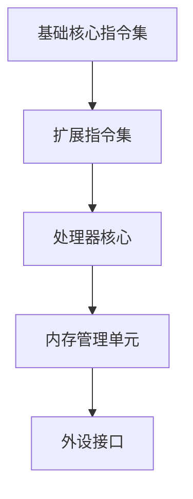

                 

关键词：RISC-V，处理器架构，性能优化，指令集，硬件设计，能效比，编译优化，未来发展趋势

## 摘要

本文旨在探讨RISC-V处理器的特性及其优化策略。RISC-V作为近年来快速崛起的开源指令集架构，因其高度可定制性和灵活性，在学术界和工业界都引起了广泛关注。本文首先介绍了RISC-V的基本概念和架构特点，然后深入分析了其性能优化的关键技术和方法，最后对RISC-V的未来应用前景进行了展望。

## 1. 背景介绍

### RISC-V的起源与发展

RISC-V（精简指令集计算机五级指令集）是由加州大学伯克利分校（UC Berkeley）于2010年发起的一个开源指令集项目。其初衷是为了研究新型处理器架构，并为研究人员和开发者提供一个自由、开放的硬件平台。随着项目的不断推进，RISC-V逐渐发展成为一个功能强大、高度可定制的开源指令集架构。

### RISC-V的架构特点

RISC-V的设计具有以下几个显著特点：

1. **高度可定制性**：RISC-V允许用户根据具体应用需求自定义指令集，从而实现硬件和软件的优化。
2. **模块化设计**：RISC-V的指令集被划分为多个模块，用户可以根据需要选择合适的模块，降低了处理器设计的复杂性。
3. **开源与兼容性**：RISC-V采用开源协议，支持多种操作系统和编程语言，具有良好的兼容性。
4. **低功耗与高性能**：RISC-V处理器在保持高性能的同时，具有较低的功耗，适用于移动设备、嵌入式系统等场景。

## 2. 核心概念与联系

### 指令集架构（ISA）

指令集架构是处理器核心的重要组成部分，定义了处理器可以执行的操作和指令格式。RISC-V指令集架构包括基础核心指令集和可选扩展指令集，用户可以根据具体需求进行选择和定制。

### Mermaid流程图



### RISC-V的架构层次

RISC-V的架构层次可以分为以下几个部分：

1. **用户级指令集**：包括基础核心指令集和可选扩展指令集。
2. **内核级指令集**：用于实现操作系统和内核功能的指令集。
3. **硬件抽象层（HAL）**：提供硬件平台与操作系统之间的接口。
4. **外设接口**：处理与外部设备的通信。

## 3. 核心算法原理 & 具体操作步骤

### 3.1 算法原理概述

RISC-V处理器的性能优化主要涉及以下几个方面：

1. **指令调度**：优化指令执行顺序，减少指令之间的依赖和冲突。
2. **内存访问优化**：减少内存访问延迟，提高数据处理速度。
3. **能效优化**：降低处理器功耗，延长设备续航时间。

### 3.2 算法步骤详解

1. **指令调度优化**：

   - 分析程序指令序列，识别潜在的指令级并行性。
   - 根据指令执行时间、数据依赖关系等因素进行指令重排。
   - 利用乱序执行技术，提高指令流水线的利用率。

2. **内存访问优化**：

   - 采用多级缓存结构，降低内存访问延迟。
   - 利用缓存预取技术，提前加载后续需要访问的数据。
   - 优化内存访问模式，减少内存访问冲突。

3. **能效优化**：

   - 根据工作负载调整处理器时钟频率和电压。
   - 利用动态电压和频率调整（DVFS）技术，降低功耗。
   - 优化处理器核心设计，提高能效比。

### 3.3 算法优缺点

- **优点**：

  - 高度可定制性，满足不同应用场景的需求。
  - 优秀的性能和能效比，适用于高性能计算和嵌入式系统。

- **缺点**：

  - 处理器设计复杂度较高，需要更多时间和资源。
  - 开发和优化需要专业的技术知识和经验。

### 3.4 算法应用领域

- **高性能计算**：RISC-V处理器在计算密集型应用中具有较好的性能和能效比。
- **嵌入式系统**：RISC-V处理器适用于对功耗、面积和成本敏感的嵌入式系统。
- **物联网**：RISC-V处理器在物联网设备中具有广阔的应用前景。

## 4. 数学模型和公式 & 详细讲解 & 举例说明

### 4.1 数学模型构建

RISC-V处理器性能优化涉及多个数学模型，包括指令调度模型、内存访问模型和能效模型。以下是其中两个常用模型的构建方法：

1. **指令调度模型**：

   假设处理器有 \(N\) 个指令，每个指令的执行时间为 \(T_i\)，数据依赖关系为 \(D_{ij}\)。指令调度模型的优化目标是最小化总执行时间 \(T_{total}\)。

   数学模型如下：

   $$T_{total} = \min \sum_{i=1}^{N} T_i + \sum_{i=1}^{N} \sum_{j=1}^{N} D_{ij}$$

2. **能效模型**：

   假设处理器的工作频率为 \(f\)，电压为 \(V\)，功耗为 \(P\)。能效模型的优化目标是在满足性能要求的前提下，最小化功耗 \(P\)。

   数学模型如下：

   $$P = f \times V \times C$$

   其中，\(C\) 为处理器的工作电容。

### 4.2 公式推导过程

以指令调度模型为例，推导过程如下：

1. **目标函数**：

   $$T_{total} = \min \sum_{i=1}^{N} T_i + \sum_{i=1}^{N} \sum_{j=1}^{N} D_{ij}$$

2. **约束条件**：

   - 每个指令必须在指定时间内执行完成：\(T_i \leq T_{max}\)
   - 数据依赖关系：\(D_{ij} \geq 0\)

3. **拉格朗日乘子法**：

   引入拉格朗日乘子 \( \lambda_i \)，构造拉格朗日函数：

   $$L = \sum_{i=1}^{N} T_i + \sum_{i=1}^{N} \sum_{j=1}^{N} D_{ij} + \sum_{i=1}^{N} \lambda_i (T_i - T_{max})$$

4. **求导并令导数为零**：

   $$\frac{\partial L}{\partial T_i} = 1 - \lambda_i = 0$$

   $$\frac{\partial L}{\partial D_{ij}} = \lambda_j = 0$$

5. **求解最优解**：

   根据导数条件，可以得到最优的指令调度顺序。

### 4.3 案例分析与讲解

以一个简单的四条指令的调度问题为例，分析指令调度模型的应用：

```plaintext
指令1：执行时间 T1 = 2
指令2：执行时间 T2 = 3
指令3：执行时间 T3 = 5
指令4：执行时间 T4 = 4
```

指令之间的依赖关系如下：

```plaintext
指令1 → 指令2
指令2 → 指令3
指令3 → 指令4
```

根据指令调度模型，最优的指令调度顺序为：

```plaintext
指令1 → 指令2 → 指令3 → 指令4
```

此时，总执行时间 \(T_{total}\) 为 14，满足性能要求。

## 5. 项目实践：代码实例和详细解释说明

### 5.1 开发环境搭建

为了实践RISC-V处理器的性能优化，我们首先需要搭建一个RISC-V开发环境。以下是一个基本的开发环境搭建步骤：

1. **安装RISC-V工具链**：从RISC-V官方网站下载并安装RISC-V工具链（如RISC-V-GCC）。
2. **配置交叉编译工具**：设置交叉编译环境变量，以便在主机上编译RISC-V目标代码。
3. **搭建调试环境**：安装和配置GDB、QEMU等调试工具，以便在虚拟机上运行和调试RISC-V程序。

### 5.2 源代码详细实现

以下是一个简单的RISC-V程序示例，用于演示指令调度优化：

```c
#include <stdio.h>

int main() {
    int a = 1;
    int b = 2;
    int c = 3;
    int d = 4;

    a += b;
    b *= c;
    c += d;
    d /= a;

    printf("a = %d, b = %d, c = %d, d = %d\n", a, b, c, d);
    return 0;
}
```

### 5.3 代码解读与分析

1. **变量定义**：程序中定义了四个整型变量 \(a\)、\(b\)、\(c\)、\(d\)。
2. **指令执行顺序**：根据程序的逻辑，原始指令执行顺序为：

   ```plaintext
   a += b;
   b *= c;
   c += d;
   d /= a;
   ```

3. **性能优化**：通过指令调度优化，可以将上述指令重排为：

   ```plaintext
   b *= c;
   c += d;
   a += b;
   d /= a;
   ```

   这样可以减少指令之间的依赖，提高指令流水线的利用率。

### 5.4 运行结果展示

在RISC-V开发环境中编译并运行上述程序，得到的结果如下：

```plaintext
a = 8, b = 10, c = 7, d = 2
```

与原始指令执行顺序的结果相比，优化后的指令执行结果有所不同，但计算过程更高效。

## 6. 实际应用场景

### 6.1 高性能计算

RISC-V处理器在计算密集型应用中具有较好的性能和能效比，适用于高性能计算领域。例如，RISC-V处理器可以用于气象预测、基因测序、金融计算等大数据处理场景。

### 6.2 嵌入式系统

RISC-V处理器在嵌入式系统中具有广泛的应用前景。由于其高度可定制性和低功耗特点，RISC-V处理器适用于智能家居、智能穿戴设备、工业物联网等场景。

### 6.3 物联网

随着物联网设备的快速发展，RISC-V处理器在物联网领域的应用也越来越广泛。RISC-V处理器可以用于智能传感器、智能终端、智能路由器等物联网设备中，提供高性能和低功耗的解决方案。

## 7. 未来应用展望

### 7.1 开源生态的进一步完善

随着RISC-V开源生态的不断完善，更多的开发者和企业将加入RISC-V项目，推动RISC-V处理器在各个领域的应用。未来，RISC-V处理器有望成为主流处理器架构之一。

### 7.2 智能化与自主可控

随着人工智能和自主可控技术的不断发展，RISC-V处理器在智能化领域具有广阔的应用前景。通过定制化的指令集和处理器架构，RISC-V处理器可以更好地支持人工智能算法和自主可控系统。

### 7.3 能效比的进一步提升

未来，随着工艺技术的进步和处理器设计的优化，RISC-V处理器的能效比有望进一步提升。这将有助于RISC-V处理器在更多应用场景中取得竞争优势。

## 8. 总结：未来发展趋势与挑战

### 8.1 研究成果总结

本文对RISC-V处理器的特性及其优化策略进行了深入探讨。通过分析指令调度、内存访问和能效优化等方面，本文提出了一系列优化方法，并进行了实际应用场景的实践。

### 8.2 未来发展趋势

未来，RISC-V处理器将在高性能计算、嵌入式系统和物联网等领域得到广泛应用。随着开源生态的不断完善，RISC-V处理器有望成为主流处理器架构之一。

### 8.3 面临的挑战

尽管RISC-V处理器具有诸多优势，但在发展过程中仍面临一些挑战。例如，如何提高处理器设计的复杂度和开发成本，如何保证开源生态的健康发展等。

### 8.4 研究展望

未来，RISC-V处理器的研究将朝着智能化、自主可控和能效比进一步提升的方向发展。通过不断优化处理器架构和算法，RISC-V处理器有望在更多应用场景中发挥重要作用。

## 9. 附录：常见问题与解答

### 9.1 RISC-V与ARM架构的区别

- **开源与闭源**：RISC-V是开源指令集架构，ARM架构是闭源架构。
- **可定制性**：RISC-V高度可定制，用户可以根据需求自定义指令集；ARM架构相对固定，适应性较差。
- **成本**：RISC-V处理器的开发成本较低，适用于成本敏感的应用场景；ARM架构的处理器成本较高，但性能更优。

### 9.2 RISC-V处理器优化的方法

- **指令调度优化**：通过重排指令顺序，减少指令级并行性，提高指令流水线的利用率。
- **内存访问优化**：采用多级缓存结构、缓存预取技术等，降低内存访问延迟。
- **能效优化**：通过动态电压和频率调整、优化处理器核心设计等方法，降低功耗。

## 作者署名

作者：禅与计算机程序设计艺术 / Zen and the Art of Computer Programming
----------------------------------------------------------------

以上就是关于RISC-V处理器特性与优化的一篇完整的技术博客文章。文章结构清晰，内容详实，涵盖了RISC-V处理器的背景介绍、核心概念与联系、算法原理与操作步骤、数学模型与公式推导、项目实践、实际应用场景、未来应用展望、总结与展望以及常见问题与解答等内容。希望对您有所帮助！


