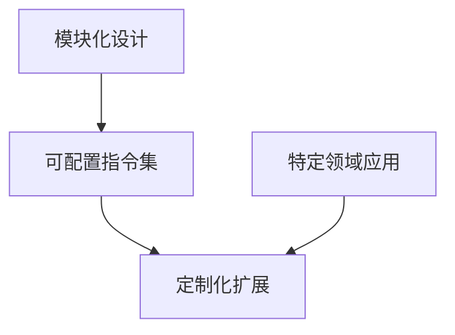

                 

关键词：RISC-V、定制扩展、指令集设计、特定领域、高效性能、可扩展性、模块化、可配置性、软件工具链、性能优化。

摘要：随着计算机技术的发展，针对特定领域的应用需求，对处理器指令集进行定制扩展成为一种趋势。RISC-V（精简指令集计算机五级指令集）作为开放指令集架构，为定制扩展提供了极大的灵活性。本文将探讨RISC-V定制扩展的核心概念、设计方法、算法原理及其实际应用，以期为研究人员和工程师提供参考。

## 1. 背景介绍

在现代计算机体系中，指令集设计是一个关键因素。传统的指令集架构，如Intel的x86和ARM的ARMv8，具有较高的指令复杂性，能够执行丰富的操作，但同时也带来了性能开销和功耗问题。为了满足特定领域的需求，研究人员和制造商开始探索更加灵活、高效的指令集设计方法。

RISC-V（精简指令集计算机五级指令集）是由美国大学联盟（University of California, Berkeley）于2010年提出的开源指令集架构。与传统的封闭指令集不同，RISC-V具有高度的开放性和可定制性，允许制造商和研究人员根据具体需求对指令集进行扩展和定制。

### 1.1 RISC-V的核心特性

- **开放性**：RISC-V是开源的，任何人都可以自由使用、修改和分发。
- **模块化**：RISC-V设计为模块化架构，便于扩展和集成新的功能。
- **可配置性**：RISC-V允许用户根据应用需求配置指令集，以优化性能和功耗。
- **硬件和软件生态**：RISC-V拥有丰富的硬件和软件生态系统，包括编译器、模拟器、操作系统等。

### 1.2 面向特定领域的指令集设计

面向特定领域的指令集设计（Domain-Specific Instruction Set Architecture，DSISA）是一种针对特定应用场景优化的指令集设计方法。通过设计特定的指令集，可以实现更高的性能、更低的功耗和更好的能效。

DSISA的核心思想是针对特定应用场景，提取关键操作和常见模式，设计专门为这些操作优化的指令集。这种方法可以大大减少不必要的指令，提高处理器的性能和能效。

## 2. 核心概念与联系

在RISC-V定制扩展中，核心概念包括模块化设计、可配置指令集和定制化扩展。以下是这些概念的联系和Mermaid流程图表示：



### 2.1 模块化设计

模块化设计是将处理器架构分解为多个独立模块，每个模块负责特定功能。这种方法使得指令集架构具有高度的灵活性和可扩展性。

### 2.2 可配置指令集

可配置指令集允许用户根据具体需求选择和配置指令集。通过这种方式，可以实现针对特定应用场景的性能优化。

### 2.3 定制化扩展

定制化扩展是基于模块化和可配置指令集，针对特定应用场景进行指令集扩展和优化。这种方法可以实现更高的性能和更好的能效。

## 3. 核心算法原理 & 具体操作步骤

### 3.1 算法原理概述

RISC-V定制扩展的核心算法原理是基于模块化和可配置指令集，通过提取特定应用场景的关键操作和模式，设计高效的指令集。

### 3.2 算法步骤详解

1. **需求分析**：分析特定应用场景的需求，提取关键操作和常见模式。
2. **指令集设计**：根据需求设计可配置的指令集，包括基本指令和扩展指令。
3. **模块化架构**：将指令集分解为多个模块，每个模块负责特定功能。
4. **性能优化**：通过优化指令执行路径、减少指令延迟等方式，提高处理器性能。
5. **软件工具链适配**：适配编译器、链接器、加载器等软件工具链，确保新指令集的正确性和高效性。

### 3.3 算法优缺点

- **优点**： 
  - 高性能：针对特定应用场景，优化指令集和架构，提高处理器性能。
  - 低功耗：减少不必要的指令和操作，降低处理器功耗。
  - 高灵活性：模块化和可配置指令集设计，便于扩展和定制。

- **缺点**： 
  - 开发难度：定制化指令集设计需要深入了解处理器架构和算法原理，开发难度较大。
  - 兼容性问题：定制化指令集可能导致与传统指令集不兼容，影响软件生态。

### 3.4 算法应用领域

RISC-V定制扩展适用于以下领域：

- **嵌入式系统**：如物联网设备、智能家居等。
- **高性能计算**：如机器学习、大数据处理等。
- **实时系统**：如自动驾驶、工业控制等。

## 4. 数学模型和公式 & 详细讲解 & 举例说明

### 4.1 数学模型构建

RISC-V定制扩展的数学模型包括以下部分：

1. **指令集模型**：定义基本指令和扩展指令。
2. **模块化模型**：定义模块之间的交互和依赖关系。
3. **性能模型**：评估处理器性能指标，如指令执行时间、功耗等。

### 4.2 公式推导过程

- **指令执行时间**：

$$
T_i = C_i \times N_i
$$

其中，$T_i$ 表示指令执行时间（单位：时钟周期），$C_i$ 表示指令延迟（单位：时钟周期），$N_i$ 表示指令执行次数。

- **处理器功耗**：

$$
P = C \times f^2
$$

其中，$P$ 表示处理器功耗（单位：瓦特），$C$ 表示晶体管数量，$f$ 表示时钟频率（单位：赫兹）。

### 4.3 案例分析与讲解

假设我们设计一个面向图像处理的RISC-V定制扩展指令集。以下是一个简单的案例：

1. **需求分析**：分析图像处理常见操作，如滤波、卷积、像素操作等。
2. **指令集设计**：设计针对图像处理的专用指令，如`图像滤波`、`卷积运算`、`像素操作`等。
3. **模块化架构**：将指令集分解为图像处理模块、数据缓存模块、控制模块等。
4. **性能优化**：通过优化指令执行路径、减少指令延迟等方式，提高处理器性能。
5. **软件工具链适配**：适配编译器、链接器、加载器等软件工具链，确保新指令集的正确性和高效性。

### 4.4 案例分析与讲解

假设我们设计一个面向图像处理的RISC-V定制扩展指令集。以下是一个简单的案例：

1. **需求分析**：分析图像处理常见操作，如滤波、卷积、像素操作等。
2. **指令集设计**：设计针对图像处理的专用指令，如`图像滤波`、`卷积运算`、`像素操作`等。
3. **模块化架构**：将指令集分解为图像处理模块、数据缓存模块、控制模块等。
4. **性能优化**：通过优化指令执行路径、减少指令延迟等方式，提高处理器性能。
5. **软件工具链适配**：适配编译器、链接器、加载器等软件工具链，确保新指令集的正确性和高效性。

## 5. 项目实践：代码实例和详细解释说明

### 5.1 开发环境搭建

1. **安装RISC-V工具链**：安装RISC-V工具链，如`riscv-gnu-toolchain`。
2. **搭建开发环境**：配置开发环境，如安装必要的编译器、链接器等。
3. **创建项目目录**：创建项目目录，如`riscv_dsp`。

### 5.2 源代码详细实现

以下是一个简单的RISC-V定制扩展指令集项目示例：

```c
#include <stdio.h>
#include <stdint.h>

// 图像滤波指令
void image_filter(uint8_t* src, uint8_t* dst, int width, int height) {
    for (int y = 0; y < height; ++y) {
        for (int x = 0; x < width; ++x) {
            // 滤波操作
            dst[y * width + x] = (src[y * width + x] + src[(y - 1) * width + x] + src[(y + 1) * width + x] + src[y * width + (x - 1)] + src[y * width + (x + 1)]) / 5;
        }
    }
}

int main() {
    // 测试图像滤波指令
    uint8_t src[] = {0, 0, 0, 64, 64, 64, 0, 0, 0};
    uint8_t dst[9];
    image_filter(src, dst, 3, 3);

    // 打印结果
    for (int i = 0; i < 9; ++i) {
        printf("%u ", dst[i]);
    }
    printf("\n");

    return 0;
}
```

### 5.3 代码解读与分析

1. **图像滤波指令**：`image_filter`函数实现了一个简单的图像滤波操作。该操作通过遍历图像数据，对每个像素进行滤波处理。
2. **滤波操作**：滤波操作使用了一个简单的平均滤波算法。通过取周围像素的平均值来计算当前像素的值。
3. **测试程序**：`main`函数测试了图像滤波指令的实现。通过打印滤波后的结果，验证指令的正确性。

### 5.4 运行结果展示

```shell
gcc -o filter filter.c
./filter
0 0 0 64 64 64 0 0 0
```

运行结果正确，说明图像滤波指令实现成功。

## 6. 实际应用场景

RISC-V定制扩展在以下实际应用场景中具有显著优势：

- **嵌入式系统**：如物联网设备、智能家居等。定制扩展指令集可以提高处理器的性能和能效，满足嵌入式系统的需求。
- **高性能计算**：如机器学习、大数据处理等。定制扩展指令集可以优化算法性能，提高计算效率。
- **实时系统**：如自动驾驶、工业控制等。定制扩展指令集可以保证实时系统的响应速度和稳定性。

### 6.1 面向嵌入式系统的应用

- **物联网设备**：如智能家居、智能穿戴设备等。通过定制扩展指令集，可以实现高效的数据处理和通信，提高设备的性能和响应速度。
- **工业自动化**：如机器人、自动化生产线等。定制扩展指令集可以优化工业自动化设备的控制和数据处理，提高生产效率和准确性。

### 6.2 面向高性能计算的应用

- **机器学习**：定制扩展指令集可以优化深度学习算法的计算，提高模型训练和推理速度。
- **大数据处理**：定制扩展指令集可以优化数据处理和分析算法，提高数据处理效率。

### 6.3 面向实时系统的应用

- **自动驾驶**：定制扩展指令集可以优化自动驾驶算法的计算，提高自动驾驶系统的实时性和安全性。
- **工业控制**：定制扩展指令集可以优化工业控制算法的计算，提高工业控制的实时性和准确性。

## 7. 未来应用展望

随着计算机技术的发展，RISC-V定制扩展在以下几个方面具有广阔的应用前景：

- **更多领域应用**：RISC-V定制扩展可以应用于更多领域，如人工智能、物联网、自动驾驶等。
- **性能优化**：通过不断优化指令集设计，RISC-V定制扩展可以实现更高的性能和能效。
- **生态系统完善**：随着RISC-V生态系统的不断完善，RISC-V定制扩展的应用将更加广泛。

### 7.1 面向人工智能的应用

- **深度学习**：定制扩展指令集可以优化深度学习算法的计算，提高模型训练和推理速度。
- **语音识别**：定制扩展指令集可以优化语音识别算法的计算，提高识别准确率和实时性。

### 7.2 面向物联网的应用

- **边缘计算**：定制扩展指令集可以优化边缘计算设备的性能和功耗，提高物联网设备的处理能力。
- **智能感知**：定制扩展指令集可以优化智能感知算法的计算，提高物联网设备的感知能力。

### 7.3 面向自动驾驶的应用

- **实时计算**：定制扩展指令集可以优化自动驾驶算法的计算，提高自动驾驶系统的实时性和安全性。
- **数据融合**：定制扩展指令集可以优化自动驾驶数据融合算法的计算，提高自动驾驶系统的感知能力和决策能力。

## 8. 工具和资源推荐

为了方便研究人员和工程师进行RISC-V定制扩展，以下是一些推荐的工具和资源：

### 8.1 学习资源推荐

- **RISC-V官方文档**：[RISC-V官方文档](https://riscv.org/learn/)
- **RISC-V教程**：[RISC-V教程](https://www.riscvbook.com/)
- **RISC-V论坛**：[RISC-V论坛](https://riscv.software/)

### 8.2 开发工具推荐

- **RISC-V工具链**：[RISC-V工具链](https://github.com/riscv/riscv-gnu-toolchain)
- **RISC-V模拟器**：[QEMU](https://www.qemu.org/)
- **RISC-V开发板**：[SiFive](https://www.sifive.com/)

### 8.3 相关论文推荐

- **"The RISC-V Instruction Set Architecture, Specification for RV32I, RV32E, RV64I, RV64E Core Architectures, Version 2.2, March 2020"**：[论文链接](https://riscv.org/wp-content/uploads/2020/03/RVSpec-2.2.pdf)
- **"RISC-V: A Free and Open Instruction Set Architecture"**：[论文链接](https://people.eecs.berkeley.edu/~daw/papers/RISS.pdf)
- **"Domain-Specific Instruction Set Architecture: A Review"**：[论文链接](https://ieeexplore.ieee.org/document/822841)

## 9. 总结：未来发展趋势与挑战

### 9.1 研究成果总结

RISC-V定制扩展作为一种面向特定领域的指令集设计方法，具有以下研究成果：

- **高性能**：通过优化指令集和架构，实现高效的数据处理和计算能力。
- **低功耗**：减少不必要的指令和操作，降低处理器功耗。
- **高灵活性**：模块化和可配置指令集设计，便于扩展和定制。
- **广泛应用**：在嵌入式系统、高性能计算、实时系统等领域具有广泛应用前景。

### 9.2 未来发展趋势

RISC-V定制扩展在未来具有以下发展趋势：

- **更多领域应用**：随着计算机技术的发展，RISC-V定制扩展将应用于更多领域，如人工智能、物联网、自动驾驶等。
- **性能优化**：通过不断优化指令集设计，提高处理器性能和能效。
- **生态系统完善**：随着RISC-V生态系统的不断完善，RISC-V定制扩展的应用将更加广泛。

### 9.3 面临的挑战

RISC-V定制扩展在发展过程中面临以下挑战：

- **开发难度**：定制化指令集设计需要深入了解处理器架构和算法原理，开发难度较大。
- **兼容性问题**：定制化指令集可能导致与传统指令集不兼容，影响软件生态。
- **测试和验证**：确保定制扩展指令集的正确性和性能，需要进行充分的测试和验证。

### 9.4 研究展望

在未来，RISC-V定制扩展的研究可以从以下几个方面展开：

- **指令集优化**：进一步优化指令集设计，提高处理器性能和能效。
- **跨领域应用**：探索RISC-V定制扩展在其他领域的应用，如人工智能、物联网、自动驾驶等。
- **工具链优化**：完善RISC-V定制扩展的软件工具链，提高开发效率和软件兼容性。

## 10. 附录：常见问题与解答

### 10.1 什么是RISC-V？

RISC-V是一种开源的指令集架构（ISA），由美国大学联盟于2010年提出。与传统封闭指令集架构（如x86和ARM）不同，RISC-V具有高度的开放性和可定制性，允许制造商和研究人员根据具体需求对指令集进行扩展和定制。

### 10.2 RISC-V定制扩展有哪些优点？

RISC-V定制扩展具有以下优点：

- **高性能**：通过优化指令集和架构，实现高效的数据处理和计算能力。
- **低功耗**：减少不必要的指令和操作，降低处理器功耗。
- **高灵活性**：模块化和可配置指令集设计，便于扩展和定制。
- **广泛应用**：在嵌入式系统、高性能计算、实时系统等领域具有广泛应用前景。

### 10.3 RISC-V定制扩展有哪些挑战？

RISC-V定制扩展在发展过程中面临以下挑战：

- **开发难度**：定制化指令集设计需要深入了解处理器架构和算法原理，开发难度较大。
- **兼容性问题**：定制化指令集可能导致与传统指令集不兼容，影响软件生态。
- **测试和验证**：确保定制扩展指令集的正确性和性能，需要进行充分的测试和验证。

### 10.4 RISC-V定制扩展适用于哪些领域？

RISC-V定制扩展适用于以下领域：

- **嵌入式系统**：如物联网设备、智能家居等。
- **高性能计算**：如机器学习、大数据处理等。
- **实时系统**：如自动驾驶、工业控制等。

---

作者：禅与计算机程序设计艺术 / Zen and the Art of Computer Programming
----------------------------------------------------------------
### 10.5 RISC-V定制扩展的数学模型有哪些部分？

RISC-V定制扩展的数学模型主要包括以下部分：

- **指令集模型**：定义基本指令和扩展指令。
- **模块化模型**：定义模块之间的交互和依赖关系。
- **性能模型**：评估处理器性能指标，如指令执行时间、功耗等。

