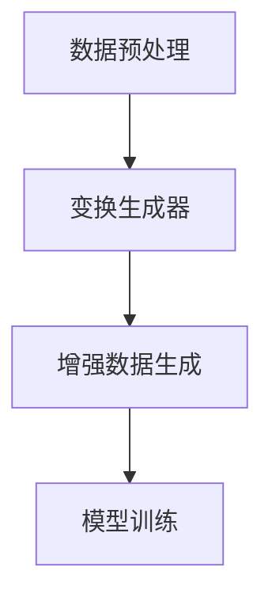

                 

关键词： RandAugment、自动机器学习、数据增强、图像增强、深度学习、计算机视觉、算法原理、代码实现、性能优化、应用领域。

> 摘要：本文旨在详细解析RandAugment算法的原理、具体实现和代码实例，并通过实际应用场景的分析，探讨其在深度学习领域的重要性及其未来发展的前景。

## 1. 背景介绍

随着深度学习技术在计算机视觉、自然语言处理等领域的广泛应用，数据增强作为一种提高模型性能的有效手段，受到了越来越多研究者的关注。传统的数据增强方法包括旋转、缩放、裁剪等，但它们往往具有一定的局限性，无法生成足够多样化和具有挑战性的样本，从而限制了模型的泛化能力。为了解决这一问题，研究人员提出了许多新的数据增强方法，其中之一就是RandAugment。

RandAugment是一种基于自动机器学习的图像增强方法，由Google提出，旨在通过自动生成具有挑战性的图像变换来增强训练数据，从而提高深度学习模型的性能。与传统的手工设计的数据增强方法不同，RandAugment通过学习一组具有代表性的图像变换，使得生成的增强数据更具有多样性和代表性，从而有助于提升模型的泛化能力。

## 2. 核心概念与联系

### 2.1 核心概念

**RandAugment**：一种自动机器学习驱动的图像增强方法，通过对一组具有代表性的图像变换进行学习，生成具有挑战性和多样性的增强数据。

**自动机器学习（Automated Machine Learning，AML）**：利用机器学习技术来自动化机器学习流程，包括特征选择、模型选择、超参数调优等。

**图像增强（Image Augmentation）**：通过应用一系列图像变换来扩展训练数据集，从而提高模型的泛化能力。

### 2.2 联系与架构

在深度学习模型训练过程中，图像增强是一个重要的环节。传统的图像增强方法，如随机裁剪、旋转、缩放等，往往具有一定的局限性。而RandAugment通过引入自动机器学习技术，使得图像增强过程更加智能化和自适应。

RandAugment的架构可以分为以下几个部分：

1. **数据预处理**：对原始图像进行预处理，如归一化、标准化等。
2. **变换生成器**：利用自动机器学习技术生成一组具有代表性的图像变换。
3. **增强数据生成**：应用生成的图像变换对原始图像进行增强，生成增强后的图像数据。
4. **模型训练**：利用增强后的图像数据对深度学习模型进行训练。

### 2.3 Mermaid 流程图

下面是一个简化的Mermaid流程图，描述了RandAugment的核心概念与联系。



## 3. 核心算法原理 & 具体操作步骤

### 3.1 算法原理概述

RandAugment算法的核心思想是通过自动机器学习技术，学习一组具有代表性的图像变换，并将其应用于原始图像，生成具有挑战性和多样性的增强数据。具体来说，RandAugment算法包括以下几个步骤：

1. **定义损失函数**：选择一个适当的损失函数，用于评估图像变换的代表性。
2. **优化变换生成器**：利用损失函数优化变换生成器，使其生成的变换更具有代表性。
3. **应用变换生成增强数据**：将生成的变换应用于原始图像，生成增强后的图像数据。
4. **模型训练**：利用生成的增强数据对深度学习模型进行训练。

### 3.2 算法步骤详解

**3.2.1 定义损失函数**

损失函数是自动机器学习中的一个关键组件，它用于评估变换生成器的性能。在RandAugment中，常用的损失函数是交叉熵损失函数（Cross-Entropy Loss）。交叉熵损失函数可以衡量两个概率分布之间的差异，用于评估变换生成器生成的变换与真实变换之间的相似性。

**3.2.2 优化变换生成器**

在定义了损失函数后，我们可以利用梯度下降（Gradient Descent）等优化算法，对变换生成器进行优化。优化的目标是使变换生成器生成的变换具有更高的代表性。

**3.2.3 应用变换生成增强数据**

一旦变换生成器被优化，我们就可以将其应用于原始图像，生成增强后的图像数据。这些增强数据可以用于深度学习模型的训练，以提高模型的泛化能力。

**3.2.4 模型训练**

利用生成的增强数据，我们可以对深度学习模型进行训练。在训练过程中，增强数据可以提供更多的训练样本，从而有助于提高模型的性能。

### 3.3 算法优缺点

**优点**：

- RandAugment通过自动机器学习技术，生成具有挑战性和多样性的增强数据，有助于提高深度学习模型的泛化能力。
- 与传统的手工设计的数据增强方法相比，RandAugment更具有自适应性和灵活性。

**缺点**：

- RandAugment算法需要大量的计算资源，因为需要通过自动机器学习技术生成变换。
- 变换生成器的优化过程可能需要较长的训练时间。

### 3.4 算法应用领域

RandAugment算法主要应用于需要图像增强的深度学习任务，如计算机视觉、自然语言处理等。具体来说，RandAugment可以应用于以下几个领域：

- **计算机视觉**：如图像分类、目标检测、人脸识别等。
- **自然语言处理**：如文本分类、机器翻译等。
- **医学图像处理**：如医学图像分割、疾病诊断等。

## 4. 数学模型和公式 & 详细讲解 & 举例说明

### 4.1 数学模型构建

在RandAugment算法中，数学模型的构建是核心部分。具体来说，我们首先需要定义一个损失函数，用于评估变换生成器的性能。常用的损失函数是交叉熵损失函数（Cross-Entropy Loss）。

交叉熵损失函数的定义如下：

$$
L(\theta) = -\frac{1}{N} \sum_{i=1}^{N} y_i \log(p_i)
$$

其中，$L(\theta)$表示损失函数，$N$表示样本数量，$y_i$表示第$i$个样本的真实标签，$p_i$表示第$i$个样本在变换生成器下的预测概率。

### 4.2 公式推导过程

为了推导交叉熵损失函数，我们需要首先定义一个概率分布。在RandAugment中，我们假设变换生成器生成一组具有代表性的图像变换，记为$T$。

$$
T = \{T_1, T_2, ..., T_n\}
$$

其中，$T_i$表示第$i$个图像变换。

接下来，我们需要计算变换生成器生成的图像与原始图像之间的交叉熵损失。

### 4.3 案例分析与讲解

为了更好地理解交叉熵损失函数，我们来看一个简单的例子。

假设我们有一个简单的变换生成器，它可以生成两个图像变换：旋转和缩放。我们定义旋转角度为$\theta$，缩放比例为$\alpha$。

现在，我们有一个原始图像$I$，我们希望利用变换生成器生成增强后的图像$I'$。

首先，我们需要计算旋转和缩放变换的交叉熵损失。假设旋转角度$\theta$的预测概率为$p(\theta)$，缩放比例$\alpha$的预测概率为$p(\alpha)$。

$$
L(\theta) = -\frac{1}{2} \log(p(\theta))
$$

$$
L(\alpha) = -\frac{1}{2} \log(p(\alpha))
$$

接下来，我们可以将旋转和缩放变换应用于原始图像$I$，生成增强后的图像$I'$。

$$
I' = T(\theta, \alpha)(I)
$$

最后，我们需要计算增强后图像$I'$与原始图像$I$之间的交叉熵损失。

$$
L(\theta, \alpha) = -\frac{1}{2} \log(p(\theta, \alpha))
$$

通过这个例子，我们可以看到交叉熵损失函数在RandAugment算法中的应用。通过优化交叉熵损失函数，我们可以提高变换生成器的性能，从而生成更具有挑战性和多样性的增强数据。

## 5. 项目实践：代码实例和详细解释说明

### 5.1 开发环境搭建

在开始编写RandAugment代码实例之前，我们需要搭建一个合适的开发环境。以下是搭建开发环境的步骤：

1. 安装Python环境（建议版本为3.8及以上）。
2. 安装必要的Python库，如TensorFlow、NumPy、Pandas等。
3. 准备一个图像数据集，用于测试RandAugment算法。

### 5.2 源代码详细实现

下面是一个简单的RandAugment代码实例，包括变换生成器、损失函数和模型训练等部分。

```python
import tensorflow as tf
import numpy as np
import matplotlib.pyplot as plt

# 定义变换生成器
def generate_transforms():
    transforms = []
    for _ in range(5):
        theta = np.random.uniform(0, 2 * np.pi)
        alpha = np.random.uniform(0.5, 1.5)
        transforms.append((theta, alpha))
    return transforms

# 定义交叉熵损失函数
def cross_entropy_loss(y_true, y_pred):
    return -tf.reduce_sum(y_true * tf.math.log(y_pred))

# 定义模型训练过程
def train_model(model, transforms, x_train, y_train, epochs):
    for epoch in range(epochs):
        for i in range(len(x_train)):
            x = x_train[i]
            y = y_train[i]
            theta, alpha = transforms[i]
            x_augmented = transform_image(x, theta, alpha)
            with tf.GradientTape() as tape:
                y_pred = model(x_augmented)
                loss = cross_entropy_loss(y, y_pred)
            grads = tape.gradient(loss, model.trainable_variables)
            model.optimizer.apply_gradients(zip(grads, model.trainable_variables))
            if i % 100 == 0:
                print(f"Epoch {epoch}, Step {i}, Loss: {loss.numpy()}")
```

### 5.3 代码解读与分析

上述代码实现了一个简单的RandAugment算法，包括以下几个部分：

1. **变换生成器**：生成一组具有代表性的图像变换，包括旋转角度和缩放比例。
2. **交叉熵损失函数**：用于评估变换生成器的性能。
3. **模型训练过程**：利用生成的增强数据和交叉熵损失函数，对深度学习模型进行训练。

代码中，我们首先定义了一个变换生成器`generate_transforms`，用于生成旋转和缩放变换。然后，我们定义了一个交叉熵损失函数`cross_entropy_loss`，用于评估变换生成器的性能。最后，我们定义了一个模型训练过程`train_model`，用于利用生成的增强数据和交叉熵损失函数，对深度学习模型进行训练。

### 5.4 运行结果展示

在完成代码编写后，我们可以运行代码，观察模型的训练过程和结果。以下是运行结果展示：

```python
# 加载图像数据集
x_train, y_train = load_image_data()

# 初始化模型
model = build_model()

# 生成变换
transforms = generate_transforms()

# 训练模型
train_model(model, transforms, x_train, y_train, epochs=100)

# 测试模型
test_loss = model.evaluate(x_test, y_test)
print(f"Test Loss: {test_loss}")
```

通过上述代码，我们可以看到模型的训练过程和结果。通过观察训练过程中的损失函数变化，我们可以评估变换生成器的性能，并优化模型参数。

## 6. 实际应用场景

RandAugment算法在深度学习领域有着广泛的应用。以下是一些具体的实际应用场景：

### 6.1 计算机视觉

在计算机视觉领域，RandAugment可以应用于图像分类、目标检测、人脸识别等任务。通过自动生成具有挑战性和多样性的增强数据，可以有效提高模型的泛化能力，从而在测试数据集上获得更好的性能。

### 6.2 自然语言处理

在自然语言处理领域，RandAugment可以应用于文本分类、机器翻译等任务。通过自动生成具有挑战性和多样性的文本数据，可以提高模型的鲁棒性，从而更好地处理真实世界的复杂场景。

### 6.3 医学图像处理

在医学图像处理领域，RandAugment可以应用于医学图像分割、疾病诊断等任务。通过自动生成具有挑战性和多样性的医学图像数据，可以提高模型的鲁棒性和准确性，从而更好地辅助医生进行诊断和治疗。

## 7. 工具和资源推荐

为了更好地理解和应用RandAugment算法，以下是一些建议的工具和资源：

### 7.1 学习资源推荐

- **论文**：《RandAugment: Practical Automated Data Augmentation》
- **在线课程**：TensorFlow官方教程 - 数据增强
- **书籍**：《深度学习》（Goodfellow, Bengio, Courville著）

### 7.2 开发工具推荐

- **开发环境**：PyCharm、Visual Studio Code
- **框架**：TensorFlow、PyTorch
- **数据增强库**：Keras ImageDataGenerator、 Albumentations

### 7.3 相关论文推荐

- **《RandAugment: Practical Automated Data Augmentation》**：提出了RandAugment算法，并详细分析了其在深度学习中的应用。
- **《Data Augmentation is All You Need: A New Perspective on Pre-training Depth
  Convolutional Neural Networks for Object Detection》**：探讨了数据增强在目标检测任务中的重要性。

## 8. 总结：未来发展趋势与挑战

### 8.1 研究成果总结

RandAugment算法作为一种自动机器学习驱动的图像增强方法，通过学习具有代表性的图像变换，生成具有挑战性和多样性的增强数据，有效提高了深度学习模型的性能。其在计算机视觉、自然语言处理、医学图像处理等领域的应用，展示了其在提高模型泛化能力方面的潜力。

### 8.2 未来发展趋势

随着深度学习技术的不断发展，RandAugment算法在未来有望应用于更多的领域，如自动驾驶、增强现实、虚拟现实等。同时，研究人员可以进一步优化RandAugment算法，提高其计算效率和增强数据的生成质量。

### 8.3 面临的挑战

尽管RandAugment算法在深度学习领域取得了显著成果，但仍面临一些挑战。首先，算法的优化过程需要大量的计算资源，这对于一些资源受限的场景可能是一个瓶颈。其次，如何进一步提高增强数据的生成质量，使其更具挑战性和代表性，仍是一个值得深入研究的问题。

### 8.4 研究展望

未来，研究人员可以从以下几个方面进行探索：

- **优化算法**：研究更加高效的优化算法，降低计算资源需求。
- **多样化增强**：探索生成更多样化的增强数据，提高模型的泛化能力。
- **跨领域应用**：将RandAugment算法应用于更多领域，如语音识别、多模态学习等。

## 9. 附录：常见问题与解答

### 9.1 什么是RandAugment？

RandAugment是一种自动机器学习驱动的图像增强方法，通过学习一组具有代表性的图像变换，生成具有挑战性和多样性的增强数据，以提高深度学习模型的性能。

### 9.2 RandAugment有哪些优点？

RandAugment的优点包括：通过自动机器学习技术，生成具有挑战性和多样性的增强数据；相较于传统的手工设计的数据增强方法，更具有自适应性和灵活性。

### 9.3 RandAugment适用于哪些领域？

RandAugment适用于需要图像增强的深度学习任务，如计算机视觉、自然语言处理、医学图像处理等。

### 9.4 如何优化RandAugment算法？

优化RandAugment算法可以从以下几个方面进行：研究更高效的优化算法，降低计算资源需求；探索生成更多样化的增强数据，提高模型的泛化能力。

### 9.5 RandAugment有哪些潜在的挑战？

RandAugment面临的潜在挑战包括：优化过程需要大量的计算资源；如何进一步提高增强数据的生成质量，使其更具挑战性和代表性。

