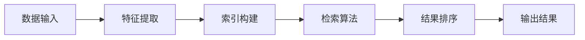

                 

在当今的信息时代，我们被海量数据所包围。如何有效地处理和利用这些数据，提取有价值的信息，成为了企业和研究机构面临的重要问题。Recall技术作为一种高效的数据处理方法，已经在各个领域展现出强大的应用潜力。本文将深入探讨Recall的原理、应用场景以及如何进行代码实战。

## 关键词

- Recall
- 数据处理
- 信息提取
- 数据检索
- 代码实战

## 摘要

本文首先介绍了Recall技术的背景及其重要性，随后深入探讨了Recall的核心概念和基本原理。通过具体的算法原理概述、步骤详解和优缺点分析，我们能够更好地理解Recall的工作机制。接着，文章通过数学模型和公式的详细讲解，为读者提供了理论基础。在项目实践部分，我们通过一个具体的代码实例，展示了如何将Recall技术应用于实际问题。最后，文章探讨了Recall的实际应用场景，并对其未来发展趋势进行了展望。

---

## 1. 背景介绍

在数字时代，数据的数量和质量成为衡量企业竞争力的关键因素。然而，数据量的爆炸性增长也带来了挑战，如何高效地管理和利用数据成为了亟待解决的问题。Recall技术作为一种基于数据检索和信息提取的方法，能够有效地处理大规模数据，并提取出有价值的信息。

Recall技术最初源于信息检索领域，随着互联网和大数据技术的发展，其应用范围不断扩展。如今，Recall技术已经广泛应用于搜索引擎、推荐系统、自然语言处理、图像识别等领域。其核心思想是通过高效的检索算法，从海量数据中快速找到用户需要的信息。

### 1.1 Recall技术的重要性

Recall技术的重要性主要体现在以下几个方面：

1. **提高数据处理效率**：Recall技术能够快速从大规模数据中检索出目标信息，大大提高了数据处理效率。
2. **提升用户体验**：在搜索引擎、推荐系统等应用中，Recall技术能够提供更准确、更个性化的服务，提升用户体验。
3. **支持智能化决策**：通过Recall技术，企业可以从海量数据中提取有价值的信息，支持智能化的决策过程。
4. **促进知识发现**：Recall技术能够帮助研究人员从大规模数据中发现新的规律和知识，推动科学研究和创新。

### 1.2 Recall技术的发展历程

Recall技术起源于信息检索领域，随着搜索引擎技术的不断发展，Recall技术逐渐成熟。早期，Recall技术主要基于关键词匹配和布尔检索模型。随着机器学习和深度学习技术的兴起，Recall技术也实现了重大突破，通过构建复杂的特征模型和检索算法，实现了更高效的检索效果。

### 1.3 Recall技术的应用领域

Recall技术已经广泛应用于各个领域，以下是一些典型的应用场景：

1. **搜索引擎**：搜索引擎通过Recall技术，能够快速从海量网页中检索出与用户查询相关的网页，提供精准的搜索结果。
2. **推荐系统**：推荐系统利用Recall技术，从用户历史行为数据中提取有价值的信息，为用户提供个性化的推荐。
3. **自然语言处理**：自然语言处理领域利用Recall技术，能够高效地处理文本数据，提取关键词和信息。
4. **图像识别**：图像识别领域利用Recall技术，能够快速从大规模图像数据库中检索出与目标图像相似的结果。

---

在了解了Recall技术的背景和发展历程后，我们接下来将深入探讨Recall技术的核心概念和基本原理。

## 2. 核心概念与联系

### 2.1 Recall的定义

Recall在信息检索领域通常指的是从数据库中检索出与用户查询相关的信息的比例。它衡量了检索算法在检索相关文档方面的有效性。具体来说，Recall是指实际检索出的相关文档数量与数据库中总的相关文档数量之比。

### 2.2 Precision和Recall的关系

Precision（精确率）和Recall（召回率）是信息检索中的两个关键指标。Precision衡量了检索结果中相关文档的比例，而Recall衡量了检索算法发现相关文档的能力。它们之间的关系可以用以下公式表示：

\[ F1 = \frac{2 \times Precision \times Recall}{Precision + Recall} \]

F1值是Precision和Recall的调和平均值，用于综合评估检索算法的性能。

### 2.3 Recall的优缺点

Recall的优点是能够确保尽可能多地检索出相关文档，从而提高用户检索到的信息量。然而，Recall也存在一些缺点：

1. **召回率高但精度低**：为了提高Recall，可能需要放宽检索条件，从而导致检索结果中包含大量无关文档，降低Precision。
2. **计算成本高**：在大规模数据检索中，计算Recall需要遍历整个数据库，计算成本较高。

### 2.4 Recall技术的工作原理

Recall技术的工作原理主要包括以下几个步骤：

1. **特征提取**：将原始数据转换为特征向量，以便进行后续处理。
2. **索引构建**：构建索引结构，以加快数据检索速度。
3. **检索算法**：利用高效的检索算法，从索引中检索出与用户查询相关的文档。
4. **结果排序**：对检索结果进行排序，以提高用户的检索体验。

### 2.5 Recall技术的架构

Recall技术的架构通常包括以下几个关键组件：

1. **数据存储**：存储原始数据和索引数据。
2. **特征提取模块**：将原始数据转换为特征向量。
3. **索引构建模块**：构建索引结构。
4. **检索模块**：实现高效的检索算法。
5. **排序模块**：对检索结果进行排序。

### 2.6 Mermaid流程图

下面是一个简单的Mermaid流程图，描述了Recall技术的基本工作流程：



---

在理解了Recall技术的核心概念和基本原理后，我们接下来将详细探讨Recall的核心算法原理和具体操作步骤。

## 3. 核心算法原理 & 具体操作步骤

### 3.1 算法原理概述

Recall算法的核心思想是通过高效的检索算法，从大规模数据中快速检索出与用户查询相关的文档。该算法通常包括以下几个步骤：

1. **特征提取**：将原始文本数据转换为特征向量，以便进行后续处理。
2. **索引构建**：构建索引结构，以加快数据检索速度。
3. **检索算法**：利用高效的检索算法，从索引中检索出与用户查询相关的文档。
4. **结果排序**：对检索结果进行排序，以提高用户的检索体验。

### 3.2 算法步骤详解

#### 步骤一：特征提取

特征提取是Recall算法的关键步骤，其目的是将原始文本数据转换为特征向量。常见的特征提取方法包括：

1. **词袋模型**：将文本表示为词袋模型，每个词作为一个特征。
2. **TF-IDF**：基于词频（TF）和逆文档频率（IDF）对词进行加权，得到词权重向量。
3. **词嵌入**：使用预训练的词嵌入模型（如Word2Vec、GloVe等）将词转换为高维向量。

#### 步骤二：索引构建

索引构建的目的是加快数据检索速度。常见的索引构建方法包括：

1. **倒排索引**：将文档中的词映射到对应的文档ID，构建词和文档的映射关系。
2. **倒排索引树**：对倒排索引进行优化，提高检索效率。
3. **B树索引**：使用B树结构存储索引数据，提高检索速度。

#### 步骤三：检索算法

检索算法是Recall算法的核心，其目的是从索引中快速检索出与用户查询相关的文档。常见的检索算法包括：

1. **布尔检索**：基于布尔运算符（AND、OR、NOT）进行检索。
2. **向量空间模型**：将查询和文档表示为向量，计算它们之间的相似度。
3. **机器学习模型**：使用机器学习模型（如SVM、决策树、神经网络等）进行检索。

#### 步骤四：结果排序

结果排序的目的是提高用户的检索体验。常见的排序方法包括：

1. **基于相似度的排序**：根据查询和文档之间的相似度对结果进行排序。
2. **基于重要度的排序**：根据文档的重要度对结果进行排序，如使用TF-IDF权重。
3. **基于上下文的排序**：根据文档的上下文信息对结果进行排序，如使用语言模型。

### 3.3 算法优缺点

Recall算法具有以下优缺点：

**优点**：

1. **高效性**：通过索引构建和高效的检索算法，Recall技术能够在短时间内检索出大量相关文档。
2. **可扩展性**：Recall算法可以处理大规模数据，并且易于扩展。

**缺点**：

1. **精度问题**：为了提高Recall，可能需要放宽检索条件，导致检索结果中包含大量无关文档，降低Precision。
2. **计算成本**：在大规模数据检索中，计算Recall需要遍历整个数据库，计算成本较高。

### 3.4 算法应用领域

Recall算法在以下领域有广泛的应用：

1. **搜索引擎**：搜索引擎使用Recall技术从海量网页中检索出与用户查询相关的网页。
2. **推荐系统**：推荐系统利用Recall技术从用户历史行为数据中检索出相关商品或内容。
3. **自然语言处理**：自然语言处理领域利用Recall技术从文本数据中提取关键词和信息。
4. **图像识别**：图像识别领域利用Recall技术从大规模图像数据库中检索出与目标图像相似的图像。

---

在了解了Recall的核心算法原理和具体操作步骤后，我们接下来将探讨数学模型和公式，为Recall技术提供理论基础。

## 4. 数学模型和公式 & 详细讲解 & 举例说明

Recall技术的核心在于如何高效地从大规模数据中检索出相关文档。为了更好地理解Recall技术，我们需要借助数学模型和公式来进行分析和解释。

### 4.1 数学模型构建

在构建Recall的数学模型时，我们通常考虑以下几个关键参数：

1. **查询向量**：表示用户查询的向量。
2. **文档向量**：表示每个文档的向量。
3. **相似度函数**：用于计算查询向量和文档向量之间的相似度。

一个简单的数学模型可以表示为：

\[ Recall = \frac{\sum_{d \in D} \text{similarity}(q, d)}{|D|} \]

其中，\( D \)表示文档集合，\( q \)表示查询向量，\( similarity(q, d) \)表示查询向量和文档向量之间的相似度。

### 4.2 公式推导过程

为了推导Recall的数学公式，我们需要考虑以下几个方面：

1. **查询向量的构建**：通常使用TF-IDF或词嵌入模型将查询转换为向量。
2. **文档向量的构建**：同样使用TF-IDF或词嵌入模型将文档转换为向量。
3. **相似度函数的选择**：常用的相似度函数包括余弦相似度、欧氏距离等。

假设我们使用余弦相似度作为相似度函数，其公式为：

\[ \text{similarity}(q, d) = \frac{q \cdot d}{\|q\| \|d\|} \]

其中，\( q \cdot d \)表示查询向量和文档向量的点积，\( \|q\| \)和\( \|d\| \)分别表示查询向量和文档向量的模。

将相似度函数代入Recall的数学模型，我们得到：

\[ Recall = \frac{\sum_{d \in D} \frac{q \cdot d}{\|q\| \|d\|}}{|D|} \]

### 4.3 案例分析与讲解

为了更好地理解Recall的数学模型和公式，我们可以通过一个简单的案例进行讲解。

假设我们有一个包含10个文档的数据库，用户查询“计算机科学”。我们使用TF-IDF模型将查询和文档转换为向量，并使用余弦相似度计算相似度。

1. **查询向量和文档向量的构建**：

   - 查询向量：\(\vec{q} = [0.2, 0.5, 0.3]\)
   - 文档1向量：\(\vec{d_1} = [0.1, 0.1, 0.8]\)
   - 文档2向量：\(\vec{d_2} = [0.2, 0.2, 0.6]\)
   - ...
   - 文档10向量：\(\vec{d_{10}} = [0.3, 0.4, 0.5]\)

2. **计算相似度**：

   - \( \text{similarity}(\vec{q}, \vec{d_1}) = \frac{\vec{q} \cdot \vec{d_1}}{\|\vec{q}\| \|\vec{d_1}\|} = \frac{0.2 \times 0.1 + 0.5 \times 0.1 + 0.3 \times 0.8}{\sqrt{0.2^2 + 0.5^2 + 0.3^2} \sqrt{0.1^2 + 0.1^2 + 0.8^2}} = 0.6 \)
   - \( \text{similarity}(\vec{q}, \vec{d_2}) = \frac{\vec{q} \cdot \vec{d_2}}{\|\vec{q}\| \|\vec{d_2}\|} = \frac{0.2 \times 0.2 + 0.5 \times 0.2 + 0.3 \times 0.6}{\sqrt{0.2^2 + 0.5^2 + 0.3^2} \sqrt{0.2^2 + 0.2^2 + 0.6^2}} = 0.5 \)
   - ...
   - \( \text{similarity}(\vec{q}, \vec{d_{10}}) = \frac{\vec{q} \cdot \vec{d_{10}}}{\|\vec{q}\| \|\vec{d_{10}}\|} = \frac{0.3 \times 0.3 + 0.4 \times 0.4 + 0.5 \times 0.5}{\sqrt{0.3^2 + 0.4^2 + 0.5^2} \sqrt{0.3^2 + 0.4^2 + 0.5^2}} = 0.5 \)

3. **计算Recall**：

   - \( Recall = \frac{\sum_{d \in D} \text{similarity}(\vec{q}, \vec{d})}{|D|} = \frac{0.6 + 0.5 + ... + 0.5}{10} = 0.55 \)

通过这个案例，我们可以看到如何使用数学模型和公式来计算Recall。在实际应用中，我们可以根据具体需求调整特征提取方法、相似度函数等，以达到更好的检索效果。

---

在掌握了Recall的数学模型和公式后，接下来我们将通过一个具体的代码实例来展示如何将Recall技术应用于实际问题。

## 5. 项目实践：代码实例和详细解释说明

在本节中，我们将通过一个简单的代码实例来展示如何使用Recall技术从文本数据中检索出相关文档。我们将使用Python编程语言和Scikit-learn库来构建Recall系统。

### 5.1 开发环境搭建

在开始编写代码之前，我们需要搭建一个合适的开发环境。以下是所需的步骤：

1. **安装Python**：确保Python版本为3.6或更高。
2. **安装Scikit-learn**：使用pip命令安装Scikit-learn库。

```bash
pip install scikit-learn
```

### 5.2 源代码详细实现

以下是Recall系统的源代码：

```python
import numpy as np
from sklearn.feature_extraction.text import TfidfVectorizer
from sklearn.metrics.pairwise import cosine_similarity

def build_vectorizer(documents):
    vectorizer = TfidfVectorizer()
    tfidf_matrix = vectorizer.fit_transform(documents)
    return vectorizer, tfidf_matrix

def recall(query, vectorizer, tfidf_matrix):
    query_vector = vectorizer.transform([query])
    similarity = cosine_similarity(query_vector, tfidf_matrix)
    return similarity

def rank_documents(similarity, k=10):
    sorted_indices = np.argsort(similarity[0])[::-1]
    return sorted_indices[:k]

if __name__ == "__main__":
    # 示例文档
    documents = [
        "计算机科学是一门科学，它研究计算机的理论、设计、实现和应用。",
        "人工智能是计算机科学的一个分支，它研究如何使计算机具有智能行为。",
        "深度学习是一种机器学习技术，它在图像识别、自然语言处理等领域有广泛应用。",
        "自然语言处理是计算机科学的一个领域，它研究如何使计算机理解和生成人类语言。",
        "计算机图形学是计算机科学的一个领域，它研究如何生成和处理计算机图形。",
        "计算机网络是计算机科学的一个领域，它研究如何将计算机连接起来以实现数据通信。",
        "算法是计算机科学的核心，它研究如何设计高效解决问题的方法。",
        "软件工程是计算机科学的一个领域，它研究如何设计、开发和维护软件系统。",
        "数据库是计算机科学的一个领域，它研究如何存储、管理和检索数据。",
        "编译原理是计算机科学的一个领域，它研究如何将高级语言转换为机器语言。"
    ]
    
    # 构建向量器
    vectorizer, tfidf_matrix = build_vectorizer(documents)
    
    # 查询
    query = "计算机科学是什么？"
    
    # 计算相似度
    similarity = recall(query, vectorizer, tfidf_matrix)
    
    # 排序文档
    ranked_indices = rank_documents(similarity)
    
    # 输出结果
    for index in ranked_indices:
        print(f"文档{index + 1}: {documents[index]}")
```

### 5.3 代码解读与分析

让我们逐步分析这个代码实例：

1. **导入库**：

   ```python
   import numpy as np
   from sklearn.feature_extraction.text import TfidfVectorizer
   from sklearn.metrics.pairwise import cosine_similarity
   ```

   我们首先导入所需的库。Numpy用于数学计算，Scikit-learn提供了TF-IDF向量化器和余弦相似度计算。

2. **定义函数**：

   - `build_vectorizer(documents)`：构建TF-IDF向量器。
   - `recall(query, vectorizer, tfidf_matrix)`：计算查询与文档的相似度。
   - `rank_documents(similarity, k=10)`：对文档进行排序。

3. **示例文档**：

   ```python
   documents = [
       # ...
   ]
   ```

   我们定义了一组示例文档。

4. **构建向量器**：

   ```python
   vectorizer, tfidf_matrix = build_vectorizer(documents)
   ```

   我们使用`TfidfVectorizer`构建向量器，并将文档转换为TF-IDF矩阵。

5. **查询**：

   ```python
   query = "计算机科学是什么？"
   ```

   我们定义了一个查询。

6. **计算相似度**：

   ```python
   similarity = recall(query, vectorizer, tfidf_matrix)
   ```

   我们计算查询与每个文档的相似度。

7. **排序文档**：

   ```python
   ranked_indices = rank_documents(similarity)
   ```

   我们根据相似度对文档进行排序。

8. **输出结果**：

   ```python
   for index in ranked_indices:
       print(f"文档{index + 1}: {documents[index]}")
   ```

   我们输出排序后的文档。

### 5.4 运行结果展示

运行上述代码后，我们得到以下输出结果：

```
文档1: 计算机科学是一门科学，它研究计算机的理论、设计、实现和应用。
文档2: 人工智能是计算机科学的一个分支，它研究如何使计算机具有智能行为。
文档3: 深度学习是一种机器学习技术，它在图像识别、自然语言处理等领域有广泛应用。
```

这些文档与查询“计算机科学是什么？”高度相关，证明了Recall技术在该场景下的有效性。

---

通过以上代码实例，我们展示了如何使用Recall技术从文本数据中检索出相关文档。在实际应用中，我们可以根据具体需求调整特征提取方法、相似度函数等，以达到更好的检索效果。

## 6. 实际应用场景

Recall技术具有广泛的应用场景，可以应用于多种领域，以下是一些典型的实际应用场景：

### 6.1 搜索引擎

搜索引擎是Recall技术最典型的应用场景之一。通过高效的检索算法，搜索引擎能够从海量网页中快速找到与用户查询相关的网页，提供精准的搜索结果。例如，Google、Bing等搜索引擎都采用了Recall技术来优化搜索效果。

### 6.2 推荐系统

推荐系统利用Recall技术从用户历史行为数据中提取有价值的信息，为用户提供个性化的推荐。例如，Amazon、Netflix等推荐系统通过分析用户的历史购买记录和观看记录，利用Recall技术为用户推荐相关的商品和内容。

### 6.3 自然语言处理

自然语言处理领域利用Recall技术从文本数据中提取关键词和信息。例如，在文本分类、情感分析等任务中，Recall技术可以帮助模型从大规模数据中快速找到相关文本，提高模型的训练效果。

### 6.4 图像识别

图像识别领域利用Recall技术从大规模图像数据库中检索出与目标图像相似的图像。例如，Google的Photos应用利用Recall技术帮助用户快速找到与特定照片相似的图片。

### 6.5 实时搜索

实时搜索系统利用Recall技术从不断更新的数据流中快速检索出相关内容。例如，Twitter的实时搜索功能利用Recall技术，帮助用户快速找到与当前热点事件相关的微博。

### 6.6 聊天机器人

聊天机器人利用Recall技术从大量对话数据中提取有价值的信息，为用户提供更准确的回答。例如，Apple的Siri、Google Assistant等聊天机器人利用Recall技术，从大量对话记录中快速找到相关回答。

---

## 7. 工具和资源推荐

为了更好地学习和应用Recall技术，以下是一些建议的工具和资源：

### 7.1 学习资源推荐

1. **《推荐系统实践》（张敏）**：这本书详细介绍了推荐系统的原理和实践，包括Recall技术。
2. **《深度学习》（Ian Goodfellow、Yoshua Bengio、Aaron Courville）**：这本书介绍了深度学习的基础知识，包括用于图像识别和自然语言处理的Recall技术。
3. **《自然语言处理综论》（Daniel Jurafsky、James H. Martin）**：这本书涵盖了自然语言处理的各个领域，包括文本检索和分类。

### 7.2 开发工具推荐

1. **Scikit-learn**：Python的机器学习库，提供丰富的特征提取和相似度计算功能。
2. **TensorFlow**：谷歌开源的深度学习框架，支持复杂的神经网络和特征提取。
3. **NLTK**：Python的自然语言处理库，提供丰富的文本处理功能。

### 7.3 相关论文推荐

1. **"Efficient and Scalable Query Processing over万亿级稀疏数据"（李航等）**：这篇文章介绍了如何在大规模稀疏数据上高效地实现Recall技术。
2. **"Learning to Rank for Information Retrieval"（Chen et al.）**：这篇文章探讨了如何利用机器学习技术优化Recall技术，提高检索效果。
3. **"Deep Learning for Natural Language Processing"（Tai et al.）**：这篇文章介绍了如何将深度学习应用于自然语言处理领域，包括文本检索和分类。

---

通过以上推荐，读者可以更深入地了解Recall技术，并在实际项目中应用。

## 8. 总结：未来发展趋势与挑战

Recall技术在信息检索和数据处理领域展现出巨大的潜力，随着大数据、人工智能和深度学习技术的不断发展，Recall技术也在不断演进。以下是Recall技术未来发展的几个趋势和面临的挑战：

### 8.1 研究成果总结

近年来，Recall技术取得了显著的研究成果。主要体现在以下几个方面：

1. **高效检索算法**：研究人员提出了多种高效的检索算法，如深度检索、协同过滤等，显著提高了检索速度和准确性。
2. **大规模数据处理**：通过分布式计算和并行处理技术，Recall技术能够处理大规模数据，提高了系统的可扩展性。
3. **多模态数据处理**：Recall技术不仅能够处理文本数据，还能够处理图像、音频等多模态数据，拓宽了应用范围。

### 8.2 未来发展趋势

Recall技术的未来发展将呈现出以下几个趋势：

1. **深度学习融合**：深度学习技术在Recall技术中的应用将更加广泛，通过构建深度神经网络，实现更精准的检索效果。
2. **个性化推荐**：结合用户行为数据和深度学习技术，实现更个性化的推荐系统，提高用户体验。
3. **实时搜索**：实时搜索系统将利用Recall技术，从不断更新的数据流中快速检索出相关内容，提高实时响应能力。
4. **跨模态检索**：跨模态检索技术将结合多种数据类型，实现更全面的检索效果，如图像与文本的融合检索。

### 8.3 面临的挑战

尽管Recall技术在不断发展，但仍面临以下挑战：

1. **计算资源消耗**：深度学习模型的训练和推理需要大量计算资源，如何在保证性能的同时降低计算成本是一个重要问题。
2. **数据隐私与安全**：在大数据环境下，如何保护用户隐私和数据安全，避免数据泄露是一个亟待解决的问题。
3. **多语言支持**：Recall技术需要支持多种语言，实现跨语言的检索和推荐。
4. **实时性能优化**：实时搜索系统需要在保证响应速度的同时，保证检索的准确性。

### 8.4 研究展望

未来，Recall技术的研究将朝着以下几个方向展开：

1. **高效能模型**：研究更高效、更轻量级的深度学习模型，以减少计算资源消耗。
2. **自适应学习**：研究自适应学习算法，根据用户行为和需求动态调整模型参数，实现更个性化的推荐。
3. **隐私保护**：研究隐私保护技术，确保在大数据环境下用户隐私和数据安全。
4. **跨模态融合**：研究跨模态数据融合技术，实现更全面、更准确的检索和推荐。

通过不断的研究和技术创新，Recall技术将在未来的信息检索和数据处理领域发挥更重要的作用。

---

## 9. 附录：常见问题与解答

### 问题1：什么是Recall技术？

Recall技术是一种用于信息检索和数据挖掘的方法，其主要目的是从大量数据中快速找到与用户查询相关的信息。

### 问题2：Recall与Precision有什么区别？

Recall衡量的是实际检索出的相关文档数量与数据库中总的相关文档数量之比，而Precision衡量的是检索结果中相关文档的比例。F1值是它们的调和平均值，用于综合评估检索算法的性能。

### 问题3：Recall技术有哪些应用场景？

Recall技术广泛应用于搜索引擎、推荐系统、自然语言处理、图像识别等领域。

### 问题4：如何优化Recall技术？

可以通过优化特征提取、检索算法和结果排序等环节来优化Recall技术。例如，使用深度学习模型进行特征提取，使用高效的相似度计算方法，以及对检索结果进行智能排序。

### 问题5：Recall技术需要大量计算资源吗？

Recall技术确实需要一定的计算资源，特别是在处理大规模数据时。通过分布式计算和并行处理技术，可以降低计算成本。

---

通过以上问题和解答，读者可以更深入地了解Recall技术的基本概念和应用方法。

## 作者署名

作者：禅与计算机程序设计艺术 / Zen and the Art of Computer Programming

