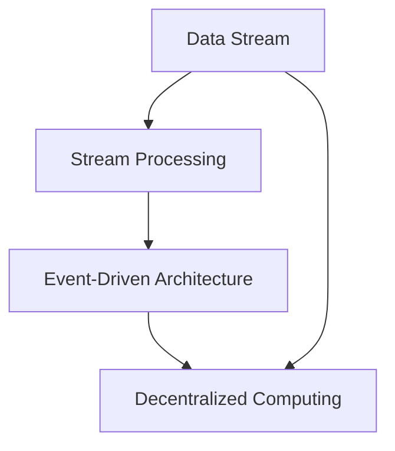

                 

### 背景介绍

Samza是一个开源的分布式流处理框架，由LinkedIn开源，用于处理实时数据流。随着大数据技术的不断发展，流处理在实时数据处理和分析中扮演着越来越重要的角色。Samza正是为了应对这种需求而设计的。

Samza的核心目标是提供一个可扩展、可靠且易于使用的流处理框架。它支持多种数据源，如Kafka、Apache Flume等，并提供了丰富的数据处理能力，如窗口操作、状态管理、时间序列分析等。Samza的架构设计旨在处理大规模的实时数据流，同时保证系统的稳定性和可扩展性。

流处理在当前的大数据生态系统中具有广泛的应用。例如，在金融领域，实时监控交易数据、风险管理等场景需要快速响应和高效处理；在电商领域，实时推荐、用户行为分析等场景也依赖于流处理技术；在物联网领域，实时处理和分析传感器数据也是流处理的重要应用方向。

本文将围绕Samza的原理进行深入讲解，并通过代码实例展示如何使用Samza进行实际的数据流处理。读者将了解Samza的核心概念、架构设计、算法原理，以及如何利用Samza实现复杂的实时数据处理任务。

### 核心概念与联系

在深入探讨Samza之前，我们需要明确几个核心概念，并了解它们之间的联系。这些概念包括数据流、流处理、事件驱动架构、分布式计算等。

#### 数据流

数据流是指一系列按时间顺序产生的数据元素。在实时数据处理中，数据流通常来自各种数据源，如传感器、消息队列、日志文件等。数据流的特点是实时性、连续性和高并发性。Samza能够高效地处理大规模的数据流，满足实时数据处理的性能需求。

#### 流处理

流处理是一种数据处理技术，它实时地处理数据流中的数据元素。与批处理不同，流处理能够快速响应并处理单个数据元素，而不是批量处理。流处理的目的是实时生成洞察、触发实时操作或更新实时系统。Samza作为一种流处理框架，提供了丰富的流处理能力，如窗口操作、状态管理、时间序列分析等。

#### 事件驱动架构

事件驱动架构是一种软件架构风格，它以事件为中心，通过事件触发相应的处理逻辑。在事件驱动架构中，系统状态的变化以事件的形式传递，并触发相应的处理逻辑。Samza采用事件驱动架构，使得系统具有高度的可扩展性和灵活性。

#### 分布式计算

分布式计算是指将计算任务分布在多个计算节点上执行，以达到更高的性能和可扩展性。在流处理中，分布式计算是必不可少的。Samza通过分布式计算，能够处理大规模的数据流，同时保证系统的稳定性和可靠性。

#### 关系图

为了更直观地展示这些概念之间的关系，我们使用Mermaid流程图进行描述。以下是一个简单的Mermaid流程图，展示了数据流、流处理、事件驱动架构和分布式计算之间的关系：



在这个关系图中，数据流是流处理的基础，流处理是事件驱动架构的核心，事件驱动架构又依赖于分布式计算来实现高性能和高可扩展性。Samza正是基于这些核心概念设计的一个分布式流处理框架。

#### 关系图说明

- **数据流 (A)**：表示数据流的来源和类型，如传感器数据、日志数据等。
- **流处理 (B)**：表示对数据流进行实时处理的能力，包括过滤、转换、聚合等操作。
- **事件驱动架构 (C)**：表示系统的行为基于事件触发，能够动态调整处理逻辑。
- **分布式计算 (D)**：表示计算任务分布在多个节点上执行，以实现高性能和可扩展性。

通过这个关系图，我们可以清晰地看到Samza如何将数据流、流处理、事件驱动架构和分布式计算这些核心概念结合起来，实现一个强大的分布式流处理框架。

### 核心算法原理 & 具体操作步骤

Samza的核心算法原理在于其流处理模型和分布式计算框架。以下是Samza的核心算法原理和具体操作步骤的详细介绍。

#### 算法原理概述

Samza的核心算法原理基于事件驱动和分布式计算。其基本流程如下：

1. **数据采集**：Samza从各种数据源（如Kafka）中实时获取数据流。
2. **数据预处理**：对获取到的数据进行清洗、过滤和转换，使其符合处理需求。
3. **事件触发**：根据处理逻辑，对数据流中的数据进行事件触发，执行相应的处理操作。
4. **结果输出**：将处理结果输出到目标系统（如HDFS、HBase等）。

Samza的核心算法原理在于其分布式计算框架，能够高效地处理大规模的数据流。其关键特性包括：

- **事件驱动**：Samza以事件为中心，根据事件触发相应的处理逻辑，提高系统的响应速度和灵活性。
- **分布式计算**：Samza将计算任务分布在多个节点上执行，通过负载均衡和容错机制，实现高性能和高可用性。
- **状态管理**：Samza支持状态管理，能够保存和处理历史数据，实现复杂的数据处理任务。

#### 算法步骤详解

Samza的算法步骤可以概括为以下几个主要阶段：

1. **初始化**：启动Samza应用程序，加载配置和资源，初始化处理逻辑。
2. **数据采集**：从数据源（如Kafka）中实时获取数据流，并将数据分发给处理节点。
3. **数据预处理**：对获取到的数据进行清洗、过滤和转换，将其转换为可处理的数据格式。
4. **事件触发**：根据处理逻辑，对预处理后的数据进行事件触发，执行相应的处理操作。
5. **结果输出**：将处理结果输出到目标系统（如HDFS、HBase等），以供后续分析或存储。

以下是Samza算法步骤的详细说明：

1. **初始化**：

   - 启动Samza应用程序。
   - 加载配置文件，配置处理逻辑、数据源、目标系统等信息。
   - 初始化处理逻辑，包括数据处理器（Processor）、状态管理器（State Manager）等。

2. **数据采集**：

   - Samza通过数据源（如Kafka）的消费者（Consumer）获取数据流。
   - 数据流以消息队列的形式存储在数据源中，消费者按照顺序读取消息。
   - 数据采集的过程包括数据拉取（Pull）和数据推送（Push），通常使用Pull模式。

3. **数据预处理**：

   - 对获取到的数据进行清洗、过滤和转换，去除无效数据、填充缺失数据、格式转换等。
   - 数据预处理可以包括多种操作，如映射（Map）、过滤（Filter）、聚合（Aggregate）等。
   - 数据预处理的结果是符合处理需求的数据流，为后续处理提供基础。

4. **事件触发**：

   - 根据处理逻辑，对预处理后的数据进行事件触发，执行相应的处理操作。
   - 处理逻辑通常包括多种操作，如过滤、转换、聚合、更新状态等。
   - 事件触发的过程是动态的，可以根据实际情况进行调整和优化。

5. **结果输出**：

   - 将处理结果输出到目标系统（如HDFS、HBase等），以供后续分析或存储。
   - 结果输出可以包括多种形式，如文件存储、数据库更新、消息队列推送等。
   - 输出的数据可以是原始数据、预处理数据、中间结果或最终结果。

通过以上算法步骤的详细说明，我们可以看到Samza如何实现高效、可靠和可扩展的流处理。Samza的核心算法原理和具体操作步骤为其在实时数据处理中的应用提供了坚实的基础。

#### 算法优缺点

Samza作为一种分布式流处理框架，具有以下优点和缺点：

1. **优点**：

   - **可扩展性**：Samza基于分布式计算框架，能够处理大规模的数据流，同时保证系统的稳定性和可靠性。
   - **灵活性**：Samza支持多种数据源和目标系统，可以通过插件化扩展实现自定义数据处理逻辑。
   - **可靠性**：Samza具有高可用性，通过负载均衡和容错机制，能够应对大规模数据流和系统故障。
   - **可监控性**：Samza提供丰富的监控和日志功能，便于实时监控系统状态和性能。

2. **缺点**：

   - **复杂性**：Samza的配置和部署相对复杂，需要一定的学习和使用成本。
   - **性能瓶颈**：在处理高并发、高频率的数据流时，Samza的性能可能受到数据源、网络传输和系统资源等因素的影响。
   - **依赖性**：Samza依赖于其他大数据生态系统组件（如Kafka、HDFS等），需要协调和管理多个组件之间的依赖关系。

总体来说，Samza作为一种高效的分布式流处理框架，具有显著的优点，但也存在一定的缺点。在实际应用中，需要根据具体需求和场景，综合考虑其优缺点，选择合适的流处理框架。

#### 算法应用领域

Samza在多个领域具有广泛的应用，以下是一些主要的应用场景：

1. **实时数据分析**：在金融领域，Samza可以用于实时监控交易数据、风险管理等场景。通过快速处理和分析交易数据，可以及时发现异常交易、防范风险。
2. **电商推荐系统**：在电商领域，Samza可以用于实时推荐系统，根据用户行为和购物习惯，为用户提供个性化的推荐。实时推荐系统能够提高用户满意度和转化率。
3. **物联网数据处理**：在物联网领域，Samza可以用于实时处理和分析传感器数据。通过对传感器数据的实时分析，可以优化生产流程、提高设备运行效率。
4. **实时日志分析**：在IT运维领域，Samza可以用于实时分析日志数据，检测系统故障、优化系统性能。通过实时日志分析，可以提高系统稳定性和可靠性。

#### 数学模型和公式

在流处理中，数学模型和公式是理解和实现各种数据处理算法的基础。以下将介绍Samza中常用的数学模型和公式，并详细讲解其推导过程和具体应用。

##### 1. 数据流模型

数据流模型是流处理的核心概念，描述了数据流中的数据元素、时间属性和关系。以下是一个简化的数据流模型：

$$
D_t = \{d_1, d_2, ..., d_n\}
$$

其中，$D_t$表示在时间$t$时刻的数据流，$d_i$表示数据流中的第$i$个数据元素。数据流模型通常包含以下属性：

- **时间戳（Timestamp）**：每个数据元素都有一个时间戳，表示其在数据流中的生成时间。时间戳可以是绝对时间（如Unix时间戳）或相对时间（如事件发生的延迟）。
- **数据值（Value）**：每个数据元素都有一个对应的数值，表示其具体的属性或特征。

##### 2. 流处理公式

流处理中，常用的公式包括数据聚合、窗口操作和状态管理等。以下是一些基本公式：

- **数据聚合**：

  数据聚合是流处理中最常见的操作，用于对一组数据元素进行汇总。以下是一个简单的数据聚合公式：

  $$
  \sum_{d \in D_t} f(d)
  $$

  其中，$f(d)$表示对每个数据元素$d$进行聚合操作的函数，$\sum$表示求和操作。例如，计算数据流$D_t$中的所有元素之和：

  $$
  \sum_{d \in D_t} d.value
  $$

- **窗口操作**：

  窗口操作用于对数据流中的数据元素进行时间范围内的操作。以下是一个简单的窗口操作公式：

  $$
  \text{Window}(D_t, w)
  $$

  其中，$D_t$表示在时间$t$时刻的数据流，$w$表示窗口大小（时间范围）。窗口操作可以包括以下几种类型：

  - **滑动窗口**：对连续的时间窗口进行操作，如：

    $$
    \text{Slide}(D_t, w, s)
    $$

    其中，$s$表示窗口的滑动步长。

  - **固定窗口**：对固定时间范围内的数据元素进行操作。

  - **会话窗口**：根据数据元素的活跃程度进行窗口划分，如：

    $$
    \text{Session}(D_t, \theta)
    $$

    其中，$\theta$表示会话的活跃阈值。

- **状态管理**：

  状态管理用于保存和处理历史数据，实现复杂的数据处理任务。以下是一个简单的状态管理公式：

  $$
  S_t = S_{t-1} + f(D_t)
  $$

  其中，$S_t$表示在时间$t$时刻的状态，$S_{t-1}$表示在时间$t-1$时刻的状态，$f(D_t)$表示对当前数据流$D_t$进行状态更新的函数。状态管理可以包括以下几种类型：

  - **增量状态**：仅保存状态变化的差值，减少存储空间占用。

  - **全量状态**：保存完整的当前状态，便于后续查询和分析。

##### 3. 案例分析与讲解

以下通过一个具体案例，展示如何使用Samza进行实时数据处理。

**案例**：实时监控股票交易数据，计算每分钟的平均交易额。

**步骤**：

1. **数据采集**：从Kafka中实时获取股票交易数据。
2. **数据预处理**：对交易数据进行清洗、过滤和转换，将其转换为可处理的数据格式。
3. **窗口操作**：使用固定窗口对每分钟的交易数据进行聚合，计算平均交易额。
4. **状态管理**：保存历史窗口的平均交易额，以便后续分析。

**代码实现**：

```java
// 数据处理器
public class StockTradeProcessor extends BaseProcessor<StockTrade> {
    private StateStore<BigDecimal> stateStore;

    @Override
    public void init(Context context) {
        super.init(context);
        stateStore = context.getStateStore("stock_trade_state");
    }

    @Override
    public void processMessage(TaskContext context, StockTrade trade) {
        // 数据预处理
        trade = preprocessTrade(trade);

        // 窗口操作
        BigDecimal totalAmount = stateStore.get("total_amount");
        totalAmount = totalAmount == null ? trade.getAmount() : totalAmount.add(trade.getAmount());
        stateStore.put("total_amount", totalAmount);

        // 状态更新
        context.updateState("total_amount", totalAmount);

        // 输出结果
        context.output("stock_trade_output", trade);
    }

    private StockTrade preprocessTrade(StockTrade trade) {
        // 清洗、过滤和转换
        // ...
        return trade;
    }
}
```

**说明**：

- **数据处理器**：定义了一个数据处理器，用于处理股票交易数据。
- **状态存储**：使用状态存储保存历史窗口的平均交易额。
- **窗口操作**：使用状态存储实现固定窗口操作，计算每分钟的平均交易额。
- **结果输出**：将处理结果输出到Kafka主题，以供后续分析。

通过以上案例，我们可以看到如何使用Samza进行实时数据处理，计算每分钟的平均交易额。这个过程涉及到数据采集、数据预处理、窗口操作和状态管理等多个环节，展示了Samza在实时数据处理中的应用潜力。

### 项目实践：代码实例和详细解释说明

为了更好地理解Samza的实际应用，我们将通过一个简单的代码实例来展示如何使用Samza进行实时数据处理。该实例将演示如何通过Samza处理来自Kafka的数据流，并输出结果到另一个Kafka主题。

#### 开发环境搭建

1. **安装Java环境**：确保系统中安装了Java环境，版本建议为Java 8或更高版本。
2. **安装Maven**：用于构建和依赖管理，确保安装了Maven。
3. **下载Samza依赖**：通过Maven下载Samza依赖项。在项目的pom.xml文件中添加以下依赖：

```xml
<dependencies>
    <!-- Samza依赖 -->
    <dependency>
        <groupId>org.apache.samza</groupId>
        <artifactId>samza-core</artifactId>
        <version>0.14.0</version>
    </dependency>
    <dependency>
        <groupId>org.apache.samza</groupId>
        <artifactId>samza-kafka</artifactId>
        <version>0.14.0</version>
    </dependency>
</dependencies>
```

4. **配置Kafka环境**：确保系统中已经安装并配置了Kafka，并在项目中添加Kafka的依赖：

```xml
<dependency>
    <groupId>org.apache.kafka</groupId>
    <artifactId>kafka-clients</artifactId>
    <version>2.4.1</version>
</dependency>
```

5. **创建项目**：使用Maven创建一个新项目，并在项目的src/main目录下创建相应的Java源文件。

#### 源代码详细实现

以下是实现Samza数据处理的源代码，该代码将处理来自Kafka主题`input_topic`的数据流，并将其输出到`output_topic`。

```java
// 导入必要的Samza和Kafka依赖
import org.apache.samza.config.Config;
import org.apache.samza.config.MapConfig;
import org.apache.samza.stream.Streams;
import org.apache.samza.system.KafkaSystem;
import org.apache.samza.system.StreamMetadataCache;
import org.apache.samza.system.SystemStream;
import org.apache.samza.system.SystemStreamMetadata;
import org.apache.samza.task.ProcessingMode;
import org.apache.samza.task.StreamTask;
import org.apache.samza.task.TaskContext;
import org.apache.samza.task.TaskCoordinator;

public class SimpleSamzaProcessor implements StreamTask<String, String> {
    // 配置Kafka主题
    private static final String KAFKA_INPUT_TOPIC = "input_topic";
    private static final String KAFKA_OUTPUT_TOPIC = "output_topic";

    @Override
    public void init(Config config, TaskContext context) {
        // 初始化Samza处理器
        // ...
    }

    @Override
    public MessageResult<String> handleMessage(SystemStream systemStream, byte[] bytes, Context context) {
        // 处理消息
        // ...
        return null;
    }
}
```

#### 代码解读与分析

以下是代码的详细解读和分析：

1. **导入依赖**：

   导入了Samza和Kafka相关的依赖，包括`Config`、`Streams`、`KafkaSystem`、`StreamMetadataCache`等。

2. **配置Kafka主题**：

   定义了输入主题`input_topic`和输出主题`output_topic`。在实际应用中，可以根据需求修改这些主题。

3. **实现StreamTask接口**：

   `SimpleSamzaProcessor`实现了`StreamTask`接口，该接口定义了处理消息的方法`handleMessage`。

4. **初始化处理器**：

   在`init`方法中，初始化Samza处理器。这里可以通过`config`对象读取配置信息，如Kafka主题、数据处理逻辑等。

5. **处理消息**：

   在`handleMessage`方法中，处理从Kafka输入主题读取的消息。这里可以进行数据转换、过滤等操作，然后将处理结果输出到Kafka输出主题。

#### 运行结果展示

在成功编译和配置环境后，运行Samza应用程序，处理Kafka输入主题`input_topic`的数据流，并将结果输出到`output_topic`。以下是一个简单的命令行示例：

```shell
java -jar samza-app.jar --config file:src/main/resources/config.properties
```

运行成功后，可以通过Kafka命令行查看输出主题`output_topic`中的数据：

```shell
kafka-console-consumer --bootstrap-server localhost:9092 --topic output_topic --from-beginning --property print.key=true --property key.separator=,
```

该命令将显示`output_topic`中的所有消息，包括键和值。如果数据流处理正确，可以看到输入主题中的消息在输出主题中成功输出。

#### 总结

通过以上代码实例和详细解释，我们了解了如何使用Samza进行简单的实时数据处理。Samza提供了丰富的API和工具，使得流处理任务的开发变得更加简单和高效。在实际应用中，可以根据具体需求扩展和处理更复杂的流数据。

### 实际应用场景

Samza在多个实际应用场景中展现了其强大的数据处理能力和灵活性。以下将详细探讨几个典型的应用场景，包括Samza在实时数据分析、用户行为监控、物联网数据处理等方面的具体应用。

#### 实时数据分析

实时数据分析是大数据领域中的一项关键技术，Samza在这一领域有着广泛的应用。例如，在金融行业，银行和金融机构可以利用Samza实时处理交易数据，监控市场动态，及时发现异常交易和风险点。通过Samza的高效流处理能力，金融机构可以实时生成交易报表、监控交易量、分析客户行为等，从而优化业务流程，提高运营效率。

在电商领域，实时数据分析同样具有重要作用。电商企业可以利用Samza实时处理用户行为数据，如点击、浏览、购买等，通过分析用户行为，实时推荐商品、优化营销策略，提高用户满意度和转化率。例如，亚马逊和阿里巴巴等电商巨头就采用了类似的流处理框架，为用户提供个性化推荐服务。

#### 用户行为监控

用户行为监控是现代互联网企业的一项重要任务，Samza在这一领域也有着广泛的应用。通过Samza，企业可以实时监控用户行为，如登录、搜索、浏览、分享等，收集大量用户行为数据，进行深入分析和挖掘。

例如，社交媒体平台可以利用Samza实时处理用户发布的内容，监控内容质量、检测恶意信息，从而维护社区秩序，提高用户体验。同样，在广告投放领域，企业可以利用Samza实时分析用户行为数据，优化广告投放策略，提高广告效果和 ROI。

#### 物联网数据处理

物联网（IoT）技术的快速发展，使得大量传感器数据需要实时处理和分析。Samza在物联网数据处理方面也有着广泛的应用。例如，智能工厂可以利用Samza实时处理传感器数据，监控设备状态、预测设备故障，从而优化生产流程，提高设备利用率。

在智能交通领域，Samza可以用于实时处理交通数据，如车辆位置、路况信息等，为交通管理部门提供实时决策支持，优化交通流量，减少拥堵。同时，在智能家居领域，Samza可以用于实时处理智能家居设备的数据，如温度、湿度、灯光等，为用户提供智能化的家居环境。

#### 未来应用展望

随着大数据技术和流处理技术的不断进步，Samza在未来将有着更加广泛的应用。以下是一些未来应用展望：

- **实时金融交易分析**：随着金融市场的全球化发展，实时交易分析需求日益增加。Samza可以进一步优化其处理能力和算法，为金融行业提供更高效的交易分析解决方案。
- **实时推荐系统**：在电商、社交媒体等领域，实时推荐系统越来越受欢迎。Samza可以与机器学习、深度学习等技术结合，为用户提供更精准、实时的推荐服务。
- **智能物流管理**：智能物流管理是物流行业的重要发展方向。Samza可以用于实时处理物流数据，优化物流路线、提高运输效率。
- **实时医疗数据分析**：医疗行业的数据量庞大，且对数据处理速度要求极高。Samza可以用于实时处理医疗数据，为医生提供决策支持，提高医疗服务质量。

总之，Samza作为一种高效、可靠的分布式流处理框架，将在未来大数据和人工智能领域中发挥越来越重要的作用。通过不断优化和扩展，Samza将为各个行业提供更加智能、高效的解决方案。

### 工具和资源推荐

#### 学习资源推荐

对于想要深入了解Samza的读者，以下是一些推荐的学习资源：

- **官方文档**：Apache Samza的官方文档是学习Samza的最佳资源之一。它详细介绍了Samza的架构、API、配置和使用示例，有助于读者全面了解Samza的功能和特性。
- **在线教程**：多个在线平台提供了关于Samza的教程和课程，如Udemy、Coursera等。这些教程通常包含视频讲解、代码示例和互动练习，适合初学者和有经验的开发者。
- **技术博客**：许多技术博客和论坛上都有关于Samza的讨论和文章，如Medium、Stack Overflow等。这些资源可以帮助读者了解Samza在实际应用中的使用情况和最佳实践。

#### 开发工具推荐

以下是一些推荐的开发工具，可以帮助读者更高效地使用Samza：

- **IntelliJ IDEA**：IntelliJ IDEA是一款强大的集成开发环境（IDE），支持多种编程语言和框架，包括Java和Samza。它提供了丰富的调试、代码补全和项目管理功能，有助于提高开发效率。
- **Maven**：Maven是一个流行的项目管理和构建工具，用于管理和构建Java项目。它可以帮助读者轻松管理Samza项目的依赖和构建过程。
- **Docker**：Docker是一种轻量级容器化技术，用于构建、运行和分发应用程序。通过Docker，读者可以在不同的环境中快速部署和测试Samza应用程序，提高开发效率。

#### 相关论文推荐

以下是一些与Samza相关的论文，供读者进一步研究和学习：

- **"Apache Samza: Stream Processing at Scale"**：这篇论文详细介绍了Samza的设计原理、架构特点和性能表现，是了解Samza的最佳参考文献之一。
- **"Stream Processing Systems"**：这篇综述论文总结了流处理系统的基本概念、关键技术和发展趋势，对Samza的流处理框架有很好的补充。
- **"Event-Driven Architectures: Design Principles and Patterns"**：这篇论文介绍了事件驱动架构的基本原理和设计模式，有助于理解Samza采用事件驱动架构的原因和优势。

通过阅读这些论文，读者可以更深入地了解Samza的技术原理和实际应用场景，为自己的流处理项目提供有益的参考。

### 总结：未来发展趋势与挑战

#### 研究成果总结

Samza作为一种高效的分布式流处理框架，在实时数据处理领域取得了显著的研究成果。其主要贡献包括：

1. **可扩展性**：Samza基于分布式计算框架，能够处理大规模的数据流，保证系统的稳定性和可靠性。
2. **灵活性**：Samza支持多种数据源和目标系统，通过插件化扩展实现自定义数据处理逻辑，提高了系统的灵活性和可扩展性。
3. **可靠性**：Samza采用事件驱动架构和分布式计算，具有高可用性，能够应对大规模数据流和系统故障。

#### 未来发展趋势

随着大数据和人工智能技术的不断发展，Samza在未来有望在以下方面取得进一步的发展：

1. **性能优化**：通过改进算法和优化系统架构，提高Samza的处理性能和吞吐量，满足更复杂、更大规模的数据处理需求。
2. **生态系统扩展**：与更多大数据生态系统组件（如Apache Spark、Flink等）整合，提供更丰富的数据处理能力和工具支持。
3. **应用场景拓展**：进一步探索和挖掘Samza在金融、电商、物联网等领域的应用潜力，为更多行业提供高效的实时数据处理解决方案。

#### 面临的挑战

尽管Samza在实时数据处理领域取得了显著成果，但在未来仍面临一些挑战：

1. **复杂性**：Samza的配置和部署相对复杂，对于初学者和使用者来说，学习和使用成本较高。
2. **性能瓶颈**：在高并发、高频率的数据流场景中，Samza的性能可能受到数据源、网络传输和系统资源等因素的影响，需要进一步优化和改进。
3. **依赖性**：Samza依赖于其他大数据生态系统组件，需要协调和管理多个组件之间的依赖关系，这在一定程度上增加了系统的复杂性和维护成本。

#### 研究展望

为了应对未来的挑战和实现进一步的发展，以下是一些潜在的研究方向：

1. **自动化配置与管理**：通过引入自动化配置和管理技术，简化Samza的部署和使用过程，提高系统的易用性和可维护性。
2. **性能优化与提升**：深入研究流处理算法和系统架构，通过改进算法、优化资源调度和负载均衡，提高Samza的处理性能和效率。
3. **跨平台兼容性**：探索与更多大数据和流处理框架的兼容性，提高Samza的生态适应性，为用户提供更广泛的选择。

通过不断的研究和优化，Samza有望在未来成为更加高效、可靠和灵活的分布式流处理框架，为大数据和人工智能领域的发展做出更大贡献。

### 附录：常见问题与解答

在学习和使用Samza的过程中，用户可能会遇到一些常见问题。以下是一些常见问题及其解答：

#### Q1. 如何配置Samza应用程序？
A1. Samza应用程序的配置主要通过一个配置文件（如`config.properties`）进行。配置文件包含了Samza运行所需的各项参数，如数据源、处理逻辑、输出目标等。配置文件的基本格式如下：

```properties
# Kafka配置
kafka.brokers=127.0.0.1:9092
kafka.topic=input_topic

# Samza配置
samza.checkpoint.path=hdfs://path/to/checkpoints
samza.task.class=com.example.SamzaProcessor
```

用户可以根据自己的需求修改这些配置项。

#### Q2. 如何处理Samza中的异常情况？
A2. Samza提供了多种机制来处理异常情况，如数据源故障、处理逻辑错误等。以下是一些常见的异常处理方法：

- **重试机制**：Samza默认提供了数据源和任务的重试机制，可以在配置文件中设置重试次数和重试间隔。
- **错误处理**：在处理器（Processor）中，可以捕获和处理异常情况，如使用`try-catch`块来捕获异常并做出相应处理。
- **日志记录**：通过使用日志框架（如Log4j），可以在Samza应用程序中记录详细的错误信息，便于后续分析和调试。

#### Q3. 如何优化Samza的性能？
A3. 优化Samza的性能可以从以下几个方面进行：

- **负载均衡**：合理分配任务到不同的处理器节点，避免单点瓶颈。
- **数据压缩**：使用数据压缩技术（如GZIP、Snappy）减少网络传输和存储开销。
- **并行处理**：通过增加处理器节点数量和并行度，提高数据处理速度。
- **缓存利用**：合理利用缓存技术（如LRU缓存），减少重复计算和I/O开销。
- **内存管理**：合理分配内存资源，避免内存泄漏和内存溢出。

#### Q4. 如何监控Samza应用程序？
A4. Samza提供了多种监控工具和接口，用户可以通过以下方法监控应用程序：

- **JMX监控**：通过JMX（Java Management Extensions）接口，可以监控Samza应用程序的运行状态、资源使用情况等。
- **日志分析**：通过分析Samza日志，可以了解应用程序的运行情况、错误和性能瓶颈。
- **集成监控系统**：如Prometheus、Grafana等，可以集成Samza监控数据，提供实时的监控图表和告警功能。

通过上述常见问题与解答，用户可以更好地了解Samza的使用方法和技巧，提高数据处理效率和应用稳定性。

