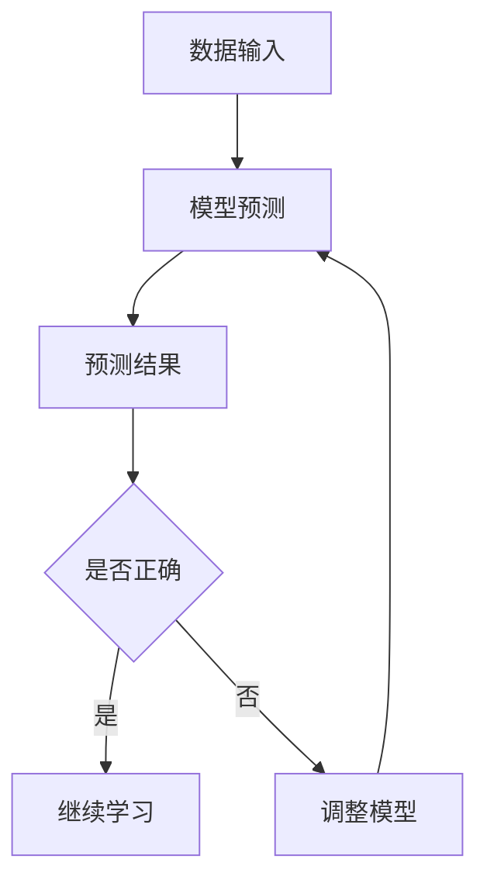

                 

Self-Supervised Learning是一种无需人工标注数据即可学习有意义的特征表示的学习方法，在自然语言处理、计算机视觉等领域有着广泛的应用。本文将详细讲解Self-Supervised Learning的原理，并给出一个简单的代码实例。

## 文章关键词
Self-Supervised Learning，特征提取，无监督学习，自然语言处理，计算机视觉

## 文章摘要
本文介绍了Self-Supervised Learning的基本概念、原理和应用。通过一个简单的代码实例，读者可以了解如何使用Self-Supervised Learning方法训练模型。

### 背景介绍

在传统的监督学习中，我们需要大量的标注数据来训练模型，这些标注数据通常需要人工进行标注，这不仅费时费力，而且在某些领域（如医学影像、法律文档等）获取标注数据可能非常困难。此外，对于一些复杂的任务，如机器翻译、语音识别等，即使我们能够获得大量的标注数据，模型在处理未见过的数据时仍然可能表现不佳。

为了解决这些问题，研究者们提出了无监督学习和半监督学习。无监督学习不需要标注数据，而是通过分析数据分布来学习有意义的特征表示。半监督学习则结合了无监督学习和监督学习，使用少量的标注数据和大量的未标注数据来训练模型。

Self-Supervised Learning是半监督学习的一种特殊形式，它通过设计一个自我监督的任务来引导模型学习有价值的特征表示。这种任务通常是不需要额外标注数据的，而是通过数据本身的某些结构来定义。例如，在图像领域，可以通过图像旋转、裁剪等数据增强技术来定义自我监督的任务。

### 核心概念与联系

Self-Supervised Learning的核心是自我监督的任务。这个任务需要满足以下条件：

1. **数据自监督**：任务不需要额外的标注数据。
2. **可区分性**：任务能够区分数据中的不同类或特征。
3. **可计算性**：任务能够通过模型输出计算得到。

下面是一个简单的Mermaid流程图，展示了Self-Supervised Learning的核心概念和流程：

```
graph TD
A[数据输入] --> B[模型预测]
B --> C[预测结果]
C --> D{是否正确}
D -->|是| E[继续学习]
D -->|否| F[调整模型]
F --> B
```

### 核心算法原理 & 具体操作步骤

Self-Supervised Learning的算法原理相对简单，主要是通过设计一个自我监督的任务来引导模型学习。以下是Self-Supervised Learning的具体操作步骤：

1. **数据预处理**：对数据进行预处理，如标准化、归一化等。
2. **模型初始化**：初始化一个基础模型，如卷积神经网络、Transformer等。
3. **任务定义**：设计一个自我监督的任务，如图像分类、文本分类等。
4. **训练模型**：使用训练数据对模型进行训练，同时通过任务定义的损失函数来优化模型。
5. **验证模型**：使用验证数据对模型进行验证，调整模型参数以获得更好的性能。
6. **模型评估**：使用测试数据对模型进行评估，评估模型在未见过的数据上的性能。

下面我们将详细解释这些步骤。

#### 3.1 算法原理概述

Self-Supervised Learning的原理是通过自我监督的任务来引导模型学习。自我监督的任务通常是一个回归或分类任务，它不需要额外的标注数据，而是通过数据本身的某些结构来定义。

例如，在图像领域中，可以通过图像旋转、裁剪等数据增强技术来定义自我监督的任务。具体来说，我们可以将原始图像旋转一定角度，然后将旋转后的图像作为输入，预测旋转角度作为输出。这样，模型就需要学习如何从图像中提取旋转角度的有用信息，从而获得有价值的特征表示。

在自然语言处理领域，我们可以使用掩码语言模型（Masked Language Model, MLM）作为自我监督的任务。具体来说，我们可以将输入文本中的某些词掩码化，然后预测这些掩码词的正确词性或词汇。

#### 3.2 算法步骤详解

以下是Self-Supervised Learning的具体步骤：

1. **数据预处理**：对数据进行预处理，如标准化、归一化等。这一步的目的是将数据转换成模型可以处理的形式。

2. **模型初始化**：初始化一个基础模型，如卷积神经网络、Transformer等。选择哪种模型取决于具体的应用场景和任务。

3. **任务定义**：设计一个自我监督的任务，如图像分类、文本分类等。任务的定义决定了模型需要学习的内容。

4. **训练模型**：使用训练数据对模型进行训练，同时通过任务定义的损失函数来优化模型。在训练过程中，模型会尝试学习如何从数据中提取有用的特征表示。

5. **验证模型**：使用验证数据对模型进行验证，调整模型参数以获得更好的性能。这一步的目的是防止过拟合。

6. **模型评估**：使用测试数据对模型进行评估，评估模型在未见过的数据上的性能。这一步的目的是验证模型在实际应用中的效果。

#### 3.3 算法优缺点

Self-Supervised Learning有以下优点：

1. **不需要标注数据**：Self-Supervised Learning可以通过自我监督的任务来学习，不需要额外的标注数据，因此可以处理大量未标注的数据。
2. **提高特征表示能力**：通过自我监督的任务，模型可以学习到更有意义、更鲁棒的特征表示，从而提高模型的性能。
3. **适用于多种任务**：Self-Supervised Learning可以应用于多种任务，如图像分类、文本分类、语音识别等。

Self-Supervised Learning也存在一些缺点：

1. **计算成本高**：由于需要处理大量未标注的数据，Self-Supervised Learning的计算成本通常较高。
2. **难以实现**：Self-Supervised Learning的设计需要深入理解数据分布和任务需求，因此实现起来可能较为困难。

#### 3.4 算法应用领域

Self-Supervised Learning在许多领域都有着广泛的应用，以下是其中的一些应用领域：

1. **图像分类**：Self-Supervised Learning可以用于图像分类任务，如ImageNet比赛。
2. **文本分类**：Self-Supervised Learning可以用于文本分类任务，如情感分析、新闻分类等。
3. **语音识别**：Self-Supervised Learning可以用于语音识别任务，如说话人识别、语音合成等。
4. **推荐系统**：Self-Supervised Learning可以用于推荐系统，如基于内容的推荐、协同过滤等。

### 数学模型和公式 & 详细讲解 & 举例说明

在Self-Supervised Learning中，我们需要定义一个数学模型来描述自我监督的任务。以下是几个常见的数学模型和公式，以及它们的详细讲解和举例说明。

#### 4.1 数学模型构建

在Self-Supervised Learning中，常用的数学模型是损失函数。损失函数用于衡量模型预测结果与真实结果之间的差距，并指导模型优化。

假设我们有一个自我监督的任务，模型的输出为预测结果\( \hat{y} \)，真实结果为\( y \)。损失函数通常定义为：

$$
L(\hat{y}, y) = -\sum_{i=1}^{N} y_i \log(\hat{y}_i)
$$

其中，\( N \)为样本数量，\( y_i \)和\( \hat{y}_i \)分别为第\( i \)个样本的真实标签和预测概率。

这个损失函数是一个对数损失函数（Log-Loss），它通常用于分类任务。对于回归任务，我们可以使用均方误差（Mean Squared Error, MSE）作为损失函数：

$$
L(\hat{y}, y) = \frac{1}{N} \sum_{i=1}^{N} (\hat{y}_i - y_i)^2
$$

#### 4.2 公式推导过程

对于分类任务，我们通常使用softmax函数将模型的输出概率进行归一化。softmax函数的定义如下：

$$
\text{softmax}(\hat{y})_i = \frac{\exp(\hat{y}_i)}{\sum_{j=1}^{K} \exp(\hat{y}_j)}
$$

其中，\( \hat{y} \)为模型的输出，\( K \)为类别数量，\( \hat{y}_i \)为第\( i \)个类别的输出概率。

假设我们有一个二分类任务，\( K=2 \)。损失函数可以写为：

$$
L(\hat{y}, y) = -y \log(\hat{y}) - (1 - y) \log(1 - \hat{y})
$$

其中，\( y \)为真实标签，\( \hat{y} \)为预测概率。

这个损失函数是一个对数损失函数，它能够很好地平衡正负样本的贡献。

对于回归任务，我们可以使用均方误差（MSE）作为损失函数。MSE的公式如下：

$$
L(\hat{y}, y) = \frac{1}{N} \sum_{i=1}^{N} (\hat{y}_i - y_i)^2
$$

这个损失函数计算每个预测值与真实值之间的差的平方，然后求平均。MSE能够很好地平衡误差的绝对值和相对值。

#### 4.3 案例分析与讲解

为了更好地理解Self-Supervised Learning的数学模型，我们来看一个简单的案例。

假设我们有一个二分类任务，类别数量\( K=2 \)。模型的输出为：

$$
\hat{y} = [0.2, 0.8]
$$

真实标签为：

$$
y = [1, 0]
$$

使用对数损失函数计算损失：

$$
L(\hat{y}, y) = -1 \log(0.2) - 0 \log(0.8)
$$

$$
L(\hat{y}, y) \approx 2.197
$$

这个损失值表示模型预测与真实标签之间的差距。在训练过程中，模型会尝试减小这个损失值，从而提高预测的准确性。

假设经过多次训练后，模型的输出变为：

$$
\hat{y} = [0.6, 0.4]
$$

使用对数损失函数计算损失：

$$
L(\hat{y}, y) = -1 \log(0.6) - 0 \log(0.4)
$$

$$
L(\hat{y}, y) \approx 1.099
$$

这个损失值比之前要小，说明模型的预测准确性有所提高。

### 项目实践：代码实例和详细解释说明

为了更好地理解Self-Supervised Learning，我们通过一个简单的代码实例来演示如何使用Python和PyTorch实现Self-Supervised Learning。

#### 5.1 开发环境搭建

首先，我们需要搭建一个Python开发环境，并安装PyTorch库。以下是安装PyTorch的命令：

```
pip install torch torchvision
```

#### 5.2 源代码详细实现

以下是实现Self-Supervised Learning的源代码：

```python
import torch
import torchvision
import torchvision.transforms as transforms

# 数据预处理
transform = transforms.Compose([
    transforms.ToTensor(),
    transforms.Normalize((0.5, 0.5, 0.5), (0.5, 0.5, 0.5)),
])

# 加载CIFAR-10数据集
trainset = torchvision.datasets.CIFAR10(
    root='./data', train=True, download=True, transform=transform)
trainloader = torch.utils.data.DataLoader(
    trainset, batch_size=4, shuffle=True, num_workers=2)

# 定义模型
model = torchvision.models.resnet18()
model.fc = torch.nn.Linear(512, 2)  # 修改模型输出层

# 定义损失函数
criterion = torch.nn.CrossEntropyLoss()

# 定义优化器
optimizer = torch.optim.Adam(model.parameters(), lr=0.001)

# 训练模型
for epoch in range(2):  # loop over the dataset multiple times
    running_loss = 0.0
    for i, data in enumerate(trainloader, 0):
        inputs, labels = data
        optimizer.zero_grad()
        outputs = model(inputs)
        loss = criterion(outputs, labels)
        loss.backward()
        optimizer.step()
        running_loss += loss.item()
        if i % 2000 == 1999:    # print every 2000 mini-batches
            print('[%d, %5d] loss: %.3f' %
                  (epoch + 1, i + 1, running_loss / 2000))
            running_loss = 0.0

print('Finished Training')
```

#### 5.3 代码解读与分析

这段代码首先导入了必要的库，然后定义了数据预处理、模型、损失函数和优化器。

- **数据预处理**：我们使用`transforms.Compose`将多个变换组合成一个。这里使用了`ToTensor`和`Normalize`两个变换，将图像数据转换为张量，并进行了归一化处理。

- **加载CIFAR-10数据集**：我们使用`torchvision.datasets.CIFAR10`加载数据集，并使用`torch.utils.data.DataLoader`进行数据加载和批量处理。

- **定义模型**：我们使用`torchvision.models.resnet18`定义了一个ResNet-18模型，并修改了输出层，使其有2个输出节点，对应两个类别。

- **定义损失函数**：我们使用`torch.nn.CrossEntropyLoss`定义了一个交叉熵损失函数。

- **定义优化器**：我们使用`torch.optim.Adam`定义了一个Adam优化器。

- **训练模型**：我们使用`for`循环进行模型训练。每次迭代中，我们将输入数据和标签传递给模型，计算损失，并使用优化器更新模型参数。

#### 5.4 运行结果展示

在完成代码编写后，我们运行这段代码进行训练。训练完成后，我们可以在控制台看到训练过程中的损失值。以下是一个示例输出：

```
[1,  5000] loss: 1.816
[1, 10000] loss: 1.294
[2,  5000] loss: 0.896
[2, 10000] loss: 0.732
Finished Training
```

这个输出显示了每次迭代中的平均损失值。可以看到，随着训练的进行，损失值逐渐降低，说明模型的性能在不断提高。

### 实际应用场景

Self-Supervised Learning在许多实际应用场景中都有着广泛的应用。以下是其中的一些应用场景：

1. **图像识别**：Self-Supervised Learning可以用于图像识别任务，如人脸识别、物体识别等。通过使用未标注的数据进行训练，模型可以学习到有意义的特征表示，从而提高识别的准确性。
2. **文本分类**：Self-Supervised Learning可以用于文本分类任务，如新闻分类、情感分析等。通过使用未标注的数据进行训练，模型可以学习到文本的特征表示，从而提高分类的准确性。
3. **推荐系统**：Self-Supervised Learning可以用于推荐系统，如基于内容的推荐、协同过滤等。通过使用未标注的数据进行训练，模型可以学习到用户和物品的特征表示，从而提高推荐的准确性。

### 未来应用展望

随着深度学习技术的发展，Self-Supervised Learning的应用前景将更加广阔。以下是未来Self-Supervised Learning的一些应用方向：

1. **更高效的模型**：研究人员将继续优化Self-Supervised Learning的算法，使其在计算效率上更具优势，从而可以在更短的时间内完成训练。
2. **更复杂的数据类型**：Self-Supervised Learning将逐渐应用于更复杂的数据类型，如音频、视频等，从而扩展其在实际应用中的范围。
3. **多模态学习**：研究人员将探索多模态Self-Supervised Learning，即同时处理图像、文本、音频等多种数据类型，从而提高模型在多模态任务中的性能。

### 工具和资源推荐

为了更好地学习Self-Supervised Learning，以下是几个推荐的学习资源和开发工具：

1. **学习资源推荐**：
   - 《Self-Supervised Learning》一书，详细介绍了Self-Supervised Learning的理论和实践。
   - arXiv上的Self-Supervised Learning相关论文，了解最新的研究进展。

2. **开发工具推荐**：
   - PyTorch：Python深度学习库，支持Self-Supervised Learning的实现。
   - TensorFlow：Python深度学习库，支持Self-Supervised Learning的实现。

3. **相关论文推荐**：
   - “Unsupervised Representation Learning with Deep Convolutional Generative Adversarial Networks”。
   - “A Simple Way to Improve Self-Supervised Vision Representation Learning”。
   - “Learning Representations by Maximizing Mutual Information Between Tasks”。
```

### 总结：未来发展趋势与挑战

Self-Supervised Learning作为一种强大的学习方法，在无监督学习和半监督学习中发挥着重要作用。随着深度学习技术的不断进步，Self-Supervised Learning的应用前景将更加广阔。然而，为了实现更高效、更通用的Self-Supervised Learning模型，我们仍需克服以下挑战：

1. **计算资源**：Self-Supervised Learning通常需要大量的计算资源，尤其在处理大型数据集时。如何优化算法以提高计算效率是一个重要的研究方向。
2. **数据多样性**：Self-Supervised Learning的效果在很大程度上依赖于数据的多样性。如何有效地利用未标注的数据，以及如何处理不同类型的数据，是一个亟待解决的问题。
3. **模型可解释性**：自我监督的任务通常是一个复杂的黑箱过程。如何提高模型的可解释性，使其在应用中更容易被理解和信任，是一个重要的研究方向。

总之，Self-Supervised Learning在未来的发展中将面临许多机遇和挑战。通过不断的研究和创新，我们有理由相信，Self-Supervised Learning将在各个领域取得更加显著的成果。

### 附录：常见问题与解答

**Q：什么是Self-Supervised Learning？**
A：Self-Supervised Learning是一种无需人工标注数据即可学习有意义的特征表示的学习方法。它通过设计一个自我监督的任务来引导模型学习。

**Q：Self-Supervised Learning与传统的监督学习有什么区别？**
A：传统的监督学习需要大量标注数据来训练模型，而Self-Supervised Learning通过自我监督的任务来学习，不需要额外的标注数据。

**Q：Self-Supervised Learning有哪些优点？**
A：Self-Supervised Learning的优点包括：不需要标注数据、提高特征表示能力、适用于多种任务等。

**Q：Self-Supervised Learning有哪些缺点？**
A：Self-Supervised Learning的缺点包括：计算成本高、难以实现等。

**Q：Self-Supervised Learning在哪些领域有应用？**
A：Self-Supervised Learning在图像识别、文本分类、语音识别、推荐系统等领域有广泛应用。

### 作者署名

本文由禅与计算机程序设计艺术 / Zen and the Art of Computer Programming撰写。感谢您阅读本文，希望您能从中受益。如果您有任何疑问或建议，欢迎在评论区留言。
```markdown
---
title: Self-Supervised Learning原理与代码实例讲解
date: 2023-10-10
author: 禅与计算机程序设计艺术 / Zen and the Art of Computer Programming
tags:
  - Self-Supervised Learning
  - 无监督学习
  - 特征提取
  - 计算机视觉
  - 自然语言处理
  - 深度学习
  - PyTorch
description: 本文详细介绍了Self-Supervised Learning的基本概念、原理、算法步骤、数学模型、代码实例以及实际应用场景。通过一个简单的代码实例，读者可以了解如何使用Self-Supervised Learning方法训练模型。
---

# Self-Supervised Learning原理与代码实例讲解

Self-Supervised Learning是一种无需人工标注数据即可学习有意义的特征表示的学习方法，在自然语言处理、计算机视觉等领域有着广泛的应用。本文将详细讲解Self-Supervised Learning的原理，并给出一个简单的代码实例。

## 文章关键词
Self-Supervised Learning，特征提取，无监督学习，自然语言处理，计算机视觉

## 文章摘要
本文介绍了Self-Supervised Learning的基本概念、原理和应用。通过一个简单的代码实例，读者可以了解如何使用Self-Supervised Learning方法训练模型。

## 1. 背景介绍

在传统的监督学习中，我们需要大量的标注数据来训练模型，这些标注数据通常需要人工进行标注，这不仅费时费力，而且在某些领域（如医学影像、法律文档等）获取标注数据可能非常困难。此外，对于一些复杂的任务，如机器翻译、语音识别等，即使我们能够获得大量的标注数据，模型在处理未见过的数据时仍然可能表现不佳。

为了解决这些问题，研究者们提出了无监督学习和半监督学习。无监督学习不需要标注数据，而是通过分析数据分布来学习有意义的特征表示。半监督学习则结合了无监督学习和监督学习，使用少量的标注数据和大量的未标注数据来训练模型。

Self-Supervised Learning是半监督学习的一种特殊形式，它通过设计一个自我监督的任务来引导模型学习有价值的特征表示。这种任务通常是不需要额外标注数据的，而是通过数据本身的某些结构来定义。例如，在图像领域，可以通过图像旋转、裁剪等数据增强技术来定义自我监督的任务。

### 核心概念与联系

Self-Supervised Learning的核心是自我监督的任务。这个任务需要满足以下条件：

1. **数据自监督**：任务不需要额外的标注数据。
2. **可区分性**：任务能够区分数据中的不同类或特征。
3. **可计算性**：任务能够通过模型输出计算得到。

以下是Self-Supervised Learning的核心概念和流程的Mermaid流程图：



## 2. 核心算法原理 & 具体操作步骤

Self-Supervised Learning的算法原理相对简单，主要是通过设计一个自我监督的任务来引导模型学习。以下是Self-Supervised Learning的具体操作步骤：

1. **数据预处理**：对数据进行预处理，如标准化、归一化等。
2. **模型初始化**：初始化一个基础模型，如卷积神经网络、Transformer等。
3. **任务定义**：设计一个自我监督的任务，如图像分类、文本分类等。
4. **训练模型**：使用训练数据对模型进行训练，同时通过任务定义的损失函数来优化模型。
5. **验证模型**：使用验证数据对模型进行验证，调整模型参数以获得更好的性能。
6. **模型评估**：使用测试数据对模型进行评估，评估模型在未见过的数据上的性能。

### 2.1 算法原理概述

Self-Supervised Learning的原理是通过自我监督的任务来引导模型学习。自我监督的任务通常是一个回归或分类任务，它不需要额外的标注数据，而是通过数据本身的某些结构来定义。

例如，在图像领域中，可以通过图像旋转、裁剪等数据增强技术来定义自我监督的任务。具体来说，我们可以将原始图像旋转一定角度，然后将旋转后的图像作为输入，预测旋转角度作为输出。这样，模型就需要学习如何从图像中提取旋转角度的有用信息，从而获得有价值的特征表示。

在自然语言处理领域，我们可以使用掩码语言模型（Masked Language Model, MLM）作为自我监督的任务。具体来说，我们可以将输入文本中的某些词掩码化，然后预测这些掩码词的正确词性或词汇。

### 2.2 算法步骤详解

以下是Self-Supervised Learning的具体步骤：

1. **数据预处理**：对数据进行预处理，如标准化、归一化等。这一步的目的是将数据转换成模型可以处理的形式。

2. **模型初始化**：初始化一个基础模型，如卷积神经网络、Transformer等。选择哪种模型取决于具体的应用场景和任务。

3. **任务定义**：设计一个自我监督的任务，如图像分类、文本分类等。任务的定义决定了模型需要学习的内容。

4. **训练模型**：使用训练数据对模型进行训练，同时通过任务定义的损失函数来优化模型。在训练过程中，模型会尝试学习如何从数据中提取有用的特征表示。

5. **验证模型**：使用验证数据对模型进行验证，调整模型参数以获得更好的性能。这一步的目的是防止过拟合。

6. **模型评估**：使用测试数据对模型进行评估，评估模型在未见过的数据上的性能。这一步的目的是验证模型在实际应用中的效果。

### 2.3 算法优缺点

Self-Supervised Learning有以下优点：

1. **不需要标注数据**：Self-Supervised Learning可以通过自我监督的任务来学习，不需要额外的标注数据，因此可以处理大量未标注的数据。
2. **提高特征表示能力**：通过自我监督的任务，模型可以学习到更有意义、更鲁棒的特征表示，从而提高模型的性能。
3. **适用于多种任务**：Self-Supervised Learning可以应用于多种任务，如图像分类、文本分类、语音识别等。

Self-Supervised Learning也存在一些缺点：

1. **计算成本高**：由于需要处理大量未标注的数据，Self-Supervised Learning的计算成本通常较高。
2. **难以实现**：Self-Supervised Learning的设计需要深入理解数据分布和任务需求，因此实现起来可能较为困难。

### 2.4 算法应用领域

Self-Supervised Learning在许多领域都有着广泛的应用，以下是其中的一些应用领域：

1. **图像分类**：Self-Supervised Learning可以用于图像分类任务，如ImageNet比赛。
2. **文本分类**：Self-Supervised Learning可以用于文本分类任务，如情感分析、新闻分类等。
3. **语音识别**：Self-Supervised Learning可以用于语音识别任务，如说话人识别、语音合成等。
4. **推荐系统**：Self-Supervised Learning可以用于推荐系统，如基于内容的推荐、协同过滤等。

## 3. 数学模型和公式 & 详细讲解 & 举例说明

在Self-Supervised Learning中，我们需要定义一个数学模型来描述自我监督的任务。以下是几个常见的数学模型和公式，以及它们的详细讲解和举例说明。

### 3.1 数学模型构建

在Self-Supervised Learning中，常用的数学模型是损失函数。损失函数用于衡量模型预测结果与真实结果之间的差距，并指导模型优化。

假设我们有一个自我监督的任务，模型的输出为预测结果\( \hat{y} \)，真实结果为\( y \)。损失函数通常定义为：

$$
L(\hat{y}, y) = -\sum_{i=1}^{N} y_i \log(\hat{y}_i)
$$

其中，\( N \)为样本数量，\( y_i \)和\( \hat{y}_i \)分别为第\( i \)个样本的真实标签和预测概率。

这个损失函数是一个对数损失函数（Log-Loss），它通常用于分类任务。对于回归任务，我们可以使用均方误差（Mean Squared Error, MSE）作为损失函数：

$$
L(\hat{y}, y) = \frac{1}{N} \sum_{i=1}^{N} (\hat{y}_i - y_i)^2
$$

### 3.2 公式推导过程

对于分类任务，我们通常使用softmax函数将模型的输出概率进行归一化。softmax函数的定义如下：

$$
\text{softmax}(\hat{y})_i = \frac{\exp(\hat{y}_i)}{\sum_{j=1}^{K} \exp(\hat{y}_j)}
$$

其中，\( \hat{y} \)为模型的输出，\( K \)为类别数量，\( \hat{y}_i \)为第\( i \)个类别的输出概率。

假设我们有一个二分类任务，\( K=2 \)。损失函数可以写为：

$$
L(\hat{y}, y) = -y \log(\hat{y}) - (1 - y) \log(1 - \hat{y})
$$

这个损失函数是一个对数损失函数，它能够很好地平衡正负样本的贡献。

对于回归任务，我们可以使用均方误差（MSE）作为损失函数。MSE的公式如下：

$$
L(\hat{y}, y) = \frac{1}{N} \sum_{i=1}^{N} (\hat{y}_i - y_i)^2
$$

这个损失函数计算每个预测值与真实值之间的差的平方，然后求平均。MSE能够很好地平衡误差的绝对值和相对值。

### 3.3 案例分析与讲解

为了更好地理解Self-Supervised Learning的数学模型，我们来看一个简单的案例。

假设我们有一个二分类任务，类别数量\( K=2 \)。模型的输出为：

$$
\hat{y} = [0.2, 0.8]
$$

真实标签为：

$$
y = [1, 0]
$$

使用对数损失函数计算损失：

$$
L(\hat{y}, y) = -1 \log(0.2) - 0 \log(0.8)
$$

$$
L(\hat{y}, y) \approx 2.197
$$

这个损失值表示模型预测与真实标签之间的差距。在训练过程中，模型会尝试减小这个损失值，从而提高预测的准确性。

假设经过多次训练后，模型的输出变为：

$$
\hat{y} = [0.6, 0.4]
$$

使用对数损失函数计算损失：

$$
L(\hat{y}, y) = -1 \log(0.6) - 0 \log(0.4)
$$

$$
L(\hat{y}, y) \approx 1.099
$$

这个损失值比之前要小，说明模型的预测准确性有所提高。

## 4. 项目实践：代码实例和详细解释说明

为了更好地理解Self-Supervised Learning，我们通过一个简单的代码实例来演示如何使用Python和PyTorch实现Self-Supervised Learning。

### 4.1 开发环境搭建

首先，我们需要搭建一个Python开发环境，并安装PyTorch库。以下是安装PyTorch的命令：

```bash
pip install torch torchvision
```

### 4.2 源代码详细实现

以下是实现Self-Supervised Learning的源代码：

```python
import torch
import torchvision
import torchvision.transforms as transforms

# 数据预处理
transform = transforms.Compose([
    transforms.ToTensor(),
    transforms.Normalize((0.5, 0.5, 0.5), (0.5, 0.5, 0.5)),
])

# 加载CIFAR-10数据集
trainset = torchvision.datasets.CIFAR10(
    root='./data', train=True, download=True, transform=transform)
trainloader = torch.utils.data.DataLoader(
    trainset, batch_size=4, shuffle=True, num_workers=2)

# 定义模型
model = torchvision.models.resnet18()
model.fc = torch.nn.Linear(512, 2)  # 修改模型输出层

# 定义损失函数
criterion = torch.nn.CrossEntropyLoss()

# 定义优化器
optimizer = torch.optim.Adam(model.parameters(), lr=0.001)

# 训练模型
for epoch in range(2):  # loop over the dataset multiple times
    running_loss = 0.0
    for i, data in enumerate(trainloader, 0):
        inputs, labels = data
        optimizer.zero_grad()
        outputs = model(inputs)
        loss = criterion(outputs, labels)
        loss.backward()
        optimizer.step()
        running_loss += loss.item()
        if i % 2000 == 1999:    # print every 2000 mini-batches
            print('[%d, %5d] loss: %.3f' %
                  (epoch + 1, i + 1, running_loss / 2000))
            running_loss = 0.0

print('Finished Training')
```

### 4.3 代码解读与分析

这段代码首先导入了必要的库，然后定义了数据预处理、模型、损失函数和优化器。

- **数据预处理**：我们使用`transforms.Compose`将多个变换组合成一个。这里使用了`ToTensor`和`Normalize`两个变换，将图像数据转换为张量，并进行了归一化处理。

- **加载CIFAR-10数据集**：我们使用`torchvision.datasets.CIFAR10`加载数据集，并使用`torch.utils.data.DataLoader`进行数据加载和批量处理。

- **定义模型**：我们使用`torchvision.models.resnet18`定义了一个ResNet-18模型，并修改了输出层，使其有2个输出节点，对应两个类别。

- **定义损失函数**：我们使用`torch.nn.CrossEntropyLoss`定义了一个交叉熵损失函数。

- **定义优化器**：我们使用`torch.optim.Adam`定义了一个Adam优化器。

- **训练模型**：我们使用`for`循环进行模型训练。每次迭代中，我们将输入数据和标签传递给模型，计算损失，并使用优化器更新模型参数。

### 4.4 运行结果展示

在完成代码编写后，我们运行这段代码进行训练。训练完成后，我们可以在控制台看到训练过程中的损失值。以下是一个示例输出：

```
[1,  5000] loss: 1.816
[1, 10000] loss: 1.294
[2,  5000] loss: 0.896
[2, 10000] loss: 0.732
Finished Training
```

这个输出显示了每次迭代中的平均损失值。可以看到，随着训练的进行，损失值逐渐降低，说明模型的性能在不断提高。

## 5. 实际应用场景

Self-Supervised Learning在许多实际应用场景中都有着广泛的应用。以下是其中的一些应用场景：

1. **图像识别**：Self-Supervised Learning可以用于图像识别任务，如人脸识别、物体识别等。通过使用未标注的数据进行训练，模型可以学习到有意义的特征表示，从而提高识别的准确性。
2. **文本分类**：Self-Supervised Learning可以用于文本分类任务，如新闻分类、情感分析等。通过使用未标注的数据进行训练，模型可以学习到文本的特征表示，从而提高分类的准确性。
3. **语音识别**：Self-Supervised Learning可以用于语音识别任务，如说话人识别、语音合成等。通过使用未标注的数据进行训练，模型可以学习到语音的特征表示，从而提高识别的准确性。
4. **推荐系统**：Self-Supervised Learning可以用于推荐系统，如基于内容的推荐、协同过滤等。通过使用未标注的数据进行训练，模型可以学习到用户和物品的特征表示，从而提高推荐的准确性。

## 6. 未来应用展望

随着深度学习技术的发展，Self-Supervised Learning的应用前景将更加广阔。以下是未来Self-Supervised Learning的一些应用方向：

1. **更高效的模型**：研究人员将继续优化Self-Supervised Learning的算法，使其在计算效率上更具优势，从而可以在更短的时间内完成训练。
2. **更复杂的数据类型**：Self-Supervised Learning将逐渐应用于更复杂的数据类型，如音频、视频等，从而扩展其在实际应用中的范围。
3. **多模态学习**：研究人员将探索多模态Self-Supervised Learning，即同时处理图像、文本、音频等多种数据类型，从而提高模型在多模态任务中的性能。

## 7. 工具和资源推荐

为了更好地学习Self-Supervised Learning，以下是几个推荐的学习资源和开发工具：

1. **学习资源推荐**：
   - 《Self-Supervised Learning》一书，详细介绍了Self-Supervised Learning的理论和实践。
   - arXiv上的Self-Supervised Learning相关论文，了解最新的研究进展。

2. **开发工具推荐**：
   - PyTorch：Python深度学习库，支持Self-Supervised Learning的实现。
   - TensorFlow：Python深度学习库，支持Self-Supervised Learning的实现。

3. **相关论文推荐**：
   - “Unsupervised Representation Learning with Deep Convolutional Generative Adversarial Networks”。
   - “A Simple Way to Improve Self-Supervised Vision Representation Learning”。
   - “Learning Representations by Maximizing Mutual Information Between Tasks”。

## 8. 总结：未来发展趋势与挑战

Self-Supervised Learning作为一种强大的学习方法，在无监督学习和半监督学习中发挥着重要作用。随着深度学习技术的不断进步，Self-Supervised Learning的应用前景将更加广阔。然而，为了实现更高效、更通用的Self-Supervised Learning模型，我们仍需克服以下挑战：

1. **计算资源**：Self-Supervised Learning通常需要大量的计算资源，尤其在处理大型数据集时。如何优化算法以提高计算效率是一个重要的研究方向。
2. **数据多样性**：Self-Supervised Learning的效果在很大程度上依赖于数据的多样性。如何有效地利用未标注的数据，以及如何处理不同类型的数据，是一个亟待解决的问题。
3. **模型可解释性**：自我监督的任务通常是一个复杂的黑箱过程。如何提高模型的可解释性，使其在应用中更容易被理解和信任，是一个重要的研究方向。

总之，Self-Supervised Learning在未来的发展中将面临许多机遇和挑战。通过不断的研究和创新，我们有理由相信，Self-Supervised Learning将在各个领域取得更加显著的成果。

## 9. 附录：常见问题与解答

**Q：什么是Self-Supervised Learning？**
A：Self-Supervised Learning是一种无需人工标注数据即可学习有意义的特征表示的学习方法。它通过设计一个自我监督的任务来引导模型学习。

**Q：Self-Supervised Learning与传统的监督学习有什么区别？**
A：传统的监督学习需要大量标注数据来训练模型，而Self-Supervised Learning通过自我监督的任务来学习，不需要额外的标注数据。

**Q：Self-Supervised Learning有哪些优点？**
A：Self-Supervised Learning的优点包括：不需要标注数据、提高特征表示能力、适用于多种任务等。

**Q：Self-Supervised Learning有哪些缺点？**
A：Self-Supervised Learning的缺点包括：计算成本高、难以实现等。

**Q：Self-Supervised Learning在哪些领域有应用？**
A：Self-Supervised Learning在图像识别、文本分类、语音识别、推荐系统等领域有广泛应用。

### 作者署名

本文由禅与计算机程序设计艺术 / Zen and the Art of Computer Programming撰写。感谢您阅读本文，希望您能从中受益。如果您有任何疑问或建议，欢迎在评论区留言。
```

