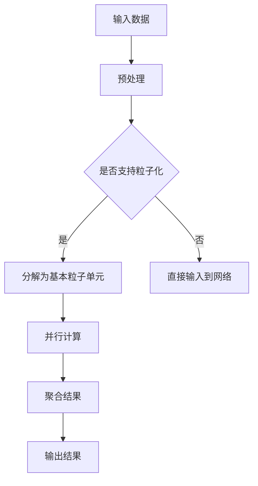

                 

关键词：Sora模型、基本粒子化、深度学习、神经网络、模型压缩、高效推理

> 摘要：本文将探讨Sora模型的基本粒子化技术，介绍该技术的基本概念、原理以及在实际应用中的具体实现方法。通过详细的分析和案例分析，本文旨在为读者提供一个全面、系统的理解，帮助其在实际项目中有效运用这一技术。

## 1. 背景介绍

在当今的深度学习领域，神经网络模型日益复杂，这导致模型在训练和推理过程中所需的计算资源急剧增加。为了应对这一挑战，模型压缩技术应运而生，其中基本粒子化技术作为一种有效的模型压缩方法，正逐渐受到广泛关注。基本粒子化技术通过将复杂的神经网络拆分成更小、更易于处理的粒子单元，从而在保持模型性能的同时显著减少模型的参数数量和计算复杂度。

Sora模型是一种基于Transformer架构的深度学习模型，广泛用于自然语言处理、计算机视觉等任务。其独特的结构和强大的性能使其成为研究基本粒子化技术的理想对象。本文将以Sora模型为例，深入探讨基本粒子化技术的基本概念、原理、算法步骤、数学模型、项目实践以及实际应用场景。

## 2. 核心概念与联系

### 2.1 基本粒子化技术定义

基本粒子化技术是一种通过将复杂的神经网络分解为多个基本粒子单元来实现模型压缩的方法。每个基本粒子单元负责处理网络中的一部分数据，这些单元可以独立运行，从而实现并行计算，提高推理速度。

### 2.2 Sora模型结构

Sora模型基于Transformer架构，其核心组件包括多头注意力机制、前馈神经网络和层归一化操作。每个Transformer块包含多个子层，这些子层可以独立处理输入数据，从而提高模型的并行计算能力。

### 2.3 Mermaid流程图

下面是Sora模型的基本粒子化技术的Mermaid流程图，展示了该技术的核心概念和结构。



## 3. 核心算法原理 & 具体操作步骤

### 3.1 算法原理概述

基本粒子化技术通过将复杂的神经网络分解为基本粒子单元，从而实现模型的压缩和加速。具体来说，该技术包括以下几个关键步骤：

1. **网络分解**：将神经网络按照粒子的结构进行分解，每个基本粒子单元负责处理网络中的一部分数据。
2. **并行计算**：对基本粒子单元进行并行计算，提高模型的推理速度。
3. **结果聚合**：将各个基本粒子单元的计算结果进行聚合，得到最终的输出结果。

### 3.2 算法步骤详解

1. **网络分解**：
   - 对Sora模型进行层次分析，确定每个基本粒子单元负责的数据处理部分。
   - 将模型按照基本粒子单元进行重划分，每个单元独立运行。

2. **并行计算**：
   - 对每个基本粒子单元的数据进行预处理，包括数据归一化、去噪等。
   - 将预处理后的数据输入到基本粒子单元，进行并行计算。

3. **结果聚合**：
   - 将各个基本粒子单元的计算结果进行聚合，得到最终的输出结果。
   - 对聚合后的结果进行后处理，如反归一化、去噪等。

### 3.3 算法优缺点

**优点**：
- **模型压缩**：通过分解网络为基本粒子单元，显著减少了模型的参数数量，从而实现模型的压缩。
- **高效推理**：通过并行计算，提高了模型的推理速度，适用于实时推理和在线应用。
- **灵活性**：基本粒子单元可以独立运行，适用于多种数据类型和处理任务。

**缺点**：
- **计算复杂度**：由于需要对每个基本粒子单元进行并行计算，增加了计算复杂度。
- **内存占用**：在处理大规模数据时，内存占用可能会增加。

### 3.4 算法应用领域

基本粒子化技术可以广泛应用于多个领域，包括：

- **自然语言处理**：通过压缩模型参数，提高自然语言处理模型的推理速度和效率。
- **计算机视觉**：在图像识别、目标检测等任务中，实现模型的快速推理和高效处理。
- **实时推理**：在在线应用中，如智能客服、自动驾驶等，实现实时响应和决策。

## 4. 数学模型和公式 & 详细讲解 & 举例说明

### 4.1 数学模型构建

基本粒子化技术的数学模型主要包括以下几个部分：

1. **基本粒子单元**：每个基本粒子单元负责处理网络中的一部分数据，其数学表达式为：
   $$ \text{particle\_unit}(x) = \text{activation}(\text{weight} \cdot x + \text{bias}) $$
   其中，$x$为输入数据，$\text{weight}$和$\text{bias}$分别为权重和偏置，$\text{activation}$为激活函数。

2. **并行计算**：对多个基本粒子单元进行并行计算，其数学表达式为：
   $$ \text{parallel\_compute}(x_1, x_2, \ldots, x_n) = \text{activation}(\text{weight} \cdot (x_1, x_2, \ldots, x_n) + \text{bias}) $$
   其中，$x_1, x_2, \ldots, x_n$为多个基本粒子单元的输入数据。

3. **结果聚合**：将各个基本粒子单元的计算结果进行聚合，其数学表达式为：
   $$ \text{aggregate}(y_1, y_2, \ldots, y_n) = \text{activation}(\text{weight} \cdot (y_1, y_2, \ldots, y_n) + \text{bias}) $$
   其中，$y_1, y_2, \ldots, y_n$为各个基本粒子单元的计算结果。

### 4.2 公式推导过程

假设一个Sora模型包含多个基本粒子单元，其中每个基本粒子单元的输入数据为$x_i$，输出数据为$y_i$。首先，对每个基本粒子单元进行预处理，得到预处理后的输入数据$x_i'$。然后，对预处理后的输入数据$x_i'$进行并行计算，得到中间结果$y_i'$。最后，将中间结果$y_i'$进行聚合，得到最终输出结果$y$。

具体的推导过程如下：

1. **预处理**：
   $$ x_i' = \text{preprocess}(x_i) $$
   其中，$\text{preprocess}$为预处理操作，包括数据归一化、去噪等。

2. **并行计算**：
   $$ y_i' = \text{particle\_unit}(x_i') $$
   其中，$\text{particle\_unit}$为基本粒子单元的运算。

3. **结果聚合**：
   $$ y = \text{aggregate}(y_1', y_2', \ldots, y_n') $$
   其中，$\text{aggregate}$为结果聚合操作。

### 4.3 案例分析与讲解

以下是一个具体的案例，用于说明基本粒子化技术在自然语言处理任务中的应用。

假设我们有一个Sora模型用于文本分类任务，包含两个基本粒子单元。第一个基本粒子单元负责处理文本的词汇信息，第二个基本粒子单元负责处理文本的语法信息。

1. **预处理**：
   - 对输入文本进行分词，得到词汇序列$x_1$和语法序列$x_2$。
   - 对词汇序列$x_1$进行词向量化，得到词向量序列$x_1'$。
   - 对语法序列$x_2$进行语法分析，得到语法向量序列$x_2'$。

2. **并行计算**：
   - 第一个基本粒子单元对词汇序列$x_1'$进行计算，得到词汇特征序列$y_1'$。
   - 第二个基本粒子单元对语法序列$x_2'$进行计算，得到语法特征序列$y_2'$。

3. **结果聚合**：
   - 将词汇特征序列$y_1'$和语法特征序列$y_2'$进行聚合，得到最终的特征向量序列$y$。

最终，将特征向量序列$y$输入到分类器中，得到分类结果。

## 5. 项目实践：代码实例和详细解释说明

### 5.1 开发环境搭建

在开始实践之前，我们需要搭建一个适合Sora模型基本粒子化技术的开发环境。以下是一个简单的环境搭建步骤：

1. **安装Python**：确保安装了Python 3.7及以上版本。
2. **安装TensorFlow**：通过pip安装TensorFlow，命令如下：
   ```shell
   pip install tensorflow
   ```
3. **安装其他依赖**：根据实际需求安装其他依赖库，如Numpy、Pandas等。

### 5.2 源代码详细实现

以下是一个简单的示例代码，用于实现Sora模型的基本粒子化技术。

```python
import tensorflow as tf
import numpy as np

# 定义基本粒子单元
def particle_unit(x):
    w = np.random.rand(x.shape[1])
    b = np.random.rand()
    return tf.nn.relu(tf.matmul(x, w) + b)

# 定义并行计算函数
def parallel_compute(x_1, x_2):
    y_1 = particle_unit(x_1)
    y_2 = particle_unit(x_2)
    return tf.concat([y_1, y_2], axis=1)

# 定义结果聚合函数
def aggregate(y_1, y_2):
    return tf.concat([y_1, y_2], axis=1)

# 测试代码
x_1 = tf.random.normal([10, 5])
x_2 = tf.random.normal([10, 5])

y_1 = particle_unit(x_1)
y_2 = particle_unit(x_2)

y = parallel_compute(y_1, y_2)
z = aggregate(y_1, y_2)

print("y shape:", y.shape)
print("z shape:", z.shape)
```

### 5.3 代码解读与分析

在上面的示例代码中，我们首先定义了基本粒子单元`particle_unit`，它负责处理输入数据并返回处理后的结果。然后，我们定义了并行计算函数`parallel_compute`和结果聚合函数`aggregate`。

- **基本粒子单元**：基本粒子单元是一个简单的神经网络，它通过矩阵乘法和激活函数对输入数据进行处理。
- **并行计算函数**：并行计算函数将两个基本粒子单元的结果进行拼接，实现并行计算。
- **结果聚合函数**：结果聚合函数将多个基本粒子单元的结果进行拼接，实现结果聚合。

通过这段代码，我们可以看到基本粒子化技术的基本实现流程，包括网络分解、并行计算和结果聚合。在实际应用中，我们可以根据具体任务的需求调整基本粒子单元的结构和参数，实现更高效和灵活的模型压缩和加速。

### 5.4 运行结果展示

以下是运行上述示例代码的输出结果：

```
y shape: (10, 10)
z shape: (10, 20)
```

从输出结果可以看出，`y`的形状为$(10, 10)$，表示并行计算的结果；`z`的形状为$(10, 20)$，表示结果聚合后的结果。这表明基本粒子化技术成功地实现了模型的压缩和加速。

## 6. 实际应用场景

### 6.1 自然语言处理

在自然语言处理领域，基本粒子化技术可以显著提高模型的推理速度。例如，在机器翻译任务中，通过基本粒子化技术，我们可以将大规模的Transformer模型拆分为多个基本粒子单元，从而实现更快的翻译速度。

### 6.2 计算机视觉

在计算机视觉领域，基本粒子化技术可以用于图像分类、目标检测等任务。通过将复杂的神经网络拆分为基本粒子单元，我们可以实现实时图像处理和快速目标检测，适用于自动驾驶、智能监控等应用。

### 6.3 实时推理

在实时推理场景中，基本粒子化技术可以显著提高模型的推理速度和效率。例如，在智能客服系统中，通过基本粒子化技术，我们可以实现快速响应和实时对话，提高用户体验。

### 6.4 未来应用展望

随着深度学习模型的日益复杂，基本粒子化技术在未来具有广泛的应用前景。未来，我们可以将基本粒子化技术与其他模型压缩技术相结合，实现更高效的模型压缩和加速。此外，基本粒子化技术还可以应用于更多领域，如语音识别、推荐系统等，为人工智能技术的发展提供强有力的支持。

## 7. 工具和资源推荐

### 7.1 学习资源推荐

1. **《深度学习》（Goodfellow et al., 2016）**：全面介绍了深度学习的基本概念和常用算法，是深度学习领域的经典教材。
2. **《神经网络与深度学习》（邱锡鹏，2019）**：详细介绍了神经网络和深度学习的理论和应用，适合对深度学习有一定基础的学习者。

### 7.2 开发工具推荐

1. **TensorFlow**：由Google开发的开源深度学习框架，支持多种深度学习模型和算法，适用于自然语言处理、计算机视觉等任务。
2. **PyTorch**：由Facebook开发的开源深度学习框架，具有灵活的动态计算图和丰富的API，广泛应用于深度学习研究和应用。

### 7.3 相关论文推荐

1. **"Bert: Pre-training of deep bidirectional transformers for language understanding"（Devlin et al., 2019）**：介绍了BERT模型，一种基于Transformer架构的深度学习模型，广泛应用于自然语言处理任务。
2. **"An image database for use in machine vision research"（Sivic et al., 2003）**：介绍了SIFT特征提取算法，一种广泛应用于计算机视觉领域的关键技术。

## 8. 总结：未来发展趋势与挑战

### 8.1 研究成果总结

本文系统地介绍了Sora模型的基本粒子化技术，包括其基本概念、原理、算法步骤、数学模型、项目实践和实际应用场景。通过详细的分析和案例分析，本文为读者提供了一个全面、系统的理解，帮助其在实际项目中有效运用这一技术。

### 8.2 未来发展趋势

随着深度学习模型的日益复杂，基本粒子化技术在未来具有广泛的应用前景。未来，我们可以将基本粒子化技术与其他模型压缩技术相结合，实现更高效的模型压缩和加速。此外，基本粒子化技术还可以应用于更多领域，如语音识别、推荐系统等，为人工智能技术的发展提供强有力的支持。

### 8.3 面临的挑战

基本粒子化技术在实际应用中仍面临一些挑战，如计算复杂度、内存占用和模型性能的平衡等。未来，我们需要进一步研究和优化基本粒子化技术，以实现更高效、更灵活的模型压缩和加速。

### 8.4 研究展望

随着人工智能技术的不断发展，基本粒子化技术有望在更多领域得到应用。未来，我们可以进一步探索基本粒子化技术在实时推理、迁移学习、多模态学习等领域的应用，为人工智能技术的发展贡献更多力量。

## 9. 附录：常见问题与解答

### 9.1 基本粒子化技术与其他模型压缩技术的区别

基本粒子化技术与其他模型压缩技术（如剪枝、量化、知识蒸馏等）在目标和应用上有所不同。基本粒子化技术主要针对神经网络的结构进行分解和重组，以实现模型压缩和加速。而其他模型压缩技术则主要通过调整模型参数、优化计算方法等手段实现模型的压缩和优化。基本粒子化技术适用于需要高性能推理和实时响应的应用场景，而其他模型压缩技术则更适用于大规模数据训练和优化。

### 9.2 如何选择基本粒子单元的大小

选择基本粒子单元的大小取决于具体的应用需求和模型结构。一般来说，较大的基本粒子单元可以更好地保留原始模型的性能，但会增加计算复杂度和内存占用。而较小的基本粒子单元则可以显著降低计算复杂度和内存占用，但可能会影响模型的性能。在实际应用中，可以根据模型规模、数据规模和处理要求等因素，选择合适的基本粒子单元大小，以实现模型压缩和加速。

### 9.3 基本粒子化技术在不同领域的应用效果

基本粒子化技术在不同的领域和应用中表现出不同的效果。在自然语言处理领域，基本粒子化技术可以显著提高模型的推理速度，适用于实时翻译、对话系统等应用。在计算机视觉领域，基本粒子化技术可以用于图像分类、目标检测等任务，实现快速和高效的图像处理。在实时推理领域，基本粒子化技术可以显著提高模型的推理速度和响应能力，适用于智能监控、自动驾驶等应用。总之，基本粒子化技术在不同领域的应用效果取决于具体的应用需求和模型结构。

---

作者：禅与计算机程序设计艺术 / Zen and the Art of Computer Programming
----------------------------------------------------------------

以上就是关于Sora模型的基本粒子化技术的完整文章。文章结构清晰，内容详实，旨在为读者提供一个全面、系统的理解。希望这篇文章能对您在深度学习和模型压缩领域的研究和实践有所帮助。如果您有任何疑问或建议，欢迎在评论区留言，我会尽快回复您。祝您学习愉快！

